<!--
=====================================================================
 PLANTILLA — Informe de Trabajo Final · 1ASI0732 Diseño de Experimentos
 Un solo archivo README.md (archivo principal del repositorio del informe).
 Estructura completa según el statement: 3 Partes, 8 Capítulos + anexos.
 Reemplazar cada <placeholder> y cada bloque > _Guía:_ con el contenido real.
 Recordar: actualizar y VERIFICAR la Tabla de Contenidos antes de cada entrega.
=====================================================================
-->

<!-- CARÁTULA -->
<div align="center">


# Universidad Peruana de Ciencias Aplicadas

---

## Carrera de Ingeniería de Software

---

1ASI0732

Diseño de Experimentos de Ingeniería de Software

**NRC**

9100

**Informe de Trabajo Final**

**Docente**

Sanchez Ponce, Alex Humberto

**Startup**

CareStacks

**Producto**

CareConnect

**Integrantes**

<center>

| Código | Apellidos y Nombres |
|---|---|
| U202319881 | Baldeon Armas, Santiago Armando |
| U202415495 | Espinoza Cruz, Angela Milagros |
| U202319563 | Muñiz Huayanca, Percy Alonso |
| U20221G099 | Nikaido Vargas, Javier Masaru |
| U202319698 | Salcedo Champi, Matias Rodolfo |

</center>

**Período 2026-20**

Septiembre, 2026

</div>

---
# REGISTRO DE VERSIONES DEL INFORME

| **Versión** | **Fecha** | **Autor** | **Descripción de modificación** |
|:---:|:---:|---|---|
| 0.1.0 | 31/08/2026 | Matias Salcedo | Creó la plantilla base del informe final (`main`) |
| 0.2.0 | 01/09/2026 – 08/09/2026 | Matias Salcedo | Redactó el Capítulo III, desarrollando las user stories, el product backlog, el impact mapping, el to-be scenario mapping y el llenado de la carátula (`chapter-3`) |
| 0.3.0 | 04/09/2026 – 05/09/2026 | Angela Espinoza | Desarrolló el Capítulo II a partir de las personas, los empathy maps, los journey maps y el análisis de needfinding (`chapter-2`) |
| 0.4.0 | 07/09/2026 | Javier Nikaido | Elaboró los diagramas de arquitectura, de clases y de base de datos del Capítulo IV (`chapter-4`) |
| 0.5.0 | 07/09/2026 | Angela Espinoza | Amplió el Capítulo II incorporando el enfoque Lean UX (problem statement, hipótesis y canvas), los segmentos objetivo y el análisis competitivo (`chapter-2`) |
| 0.6.0 | 08/09/2026 | Matias Salcedo | Completó la especificación de requerimientos del Capítulo III y afinó el backlog junto con el impact map (`chapter-3`) |
| 0.7.0 | 09/09/2026 | Angela Espinoza / Santiago Baldeon | Redactaron el Capítulo I describiendo el perfil de la startup y los perfiles de los integrantes del equipo (`chapter-1`, `chapter-2`) |
| 0.8.0 | 09/09/2026 – 10/09/2026 | Javier Nikaido | Implementó y documentó la Landing Page junto con su configuración de despliegue para el Capítulo V (`chapter-5`) |
| 0.9.0 | 10/09/2026 | Percy Muñiz | Incorporó la evidencia de la aplicación móvil en iOS, el prototipado y los sprint backlogs del Capítulo V (`chapter-5`) |
| 0.10.0 | 10/09/2026 | Javier Nikaido | Revisó los perfiles de los integrantes y ajustó la guía de requisitos del Capítulo IV (`chapter-1`, `chapter-4`) |
| 0.11.0 | 11/09/2026 | Matias Salcedo | Completó la sección de diseño UX web del Capítulo II (`chapter-2`) |
| 0.12.0 | 14/09/2026 | Angela Espinoza | Añadió el As-Is Scenario Mapping, el glosario de ubiquitous language, las referencias en formato APA 7 y reescribió el proceso Lean UX (`chapter-1`, `chapter-2`) |
| 0.13.0 | 14/09/2026 | Javier Nikaido / Percy Muñiz | Revisaron el class dictionary y el stack tecnológico, migraron el frontend a Flutter y ajustaron la configuración de despliegue (`chapter-4`, `chapter-5`) |
| 0.14.0 | 15/09/2026 | Santiago Baldeon | Elaboró los wireframes y mockups de la aplicación móvil del Capítulo IV (`chapter-4`) |
| 1.0.0 | 16/09/2026 | Matias Salcedo | AV1 Report |

# Project Report Collaboration Insights

Enlace de la organización para el reporte del proyecto: https://github.com/upc-pre-202620-1asi0732-9100-carestacks/carestacks-report

AV1:


## Tabla de Contenidos

<!-- 4 niveles. Verificar los anclajes (#) antes de cada entrega: GitHub genera el ancla a partir del texto del título. -->

- [Student Outcome](#student-outcome)
- [Part I: As-Is Software Project](#part-i-as-is-software-project)
  - [Capítulo I: Introducción](#capítulo-i-introducción)
    - [1.1. Startup Profile](#11-startup-profile)
      - [1.1.1. Descripción de la Startup](#111-descripción-de-la-startup)
      - [1.1.2. Perfiles de integrantes del equipo](#112-perfiles-de-integrantes-del-equipo)
    - [1.2. Solution Profile](#12-solution-profile)
      - [1.2.1. Antecedentes y problemática](#121-antecedentes-y-problemática)
      - [1.2.2. Lean UX Process](#122-lean-ux-process)
        - [1.2.2.1. Lean UX Problem Statements](#1221-lean-ux-problem-statements)
        - [1.2.2.2. Lean UX Assumptions](#1222-lean-ux-assumptions)
        - [1.2.2.3. Lean UX Hypothesis Statements](#1223-lean-ux-hypothesis-statements)
        - [1.2.2.4. Lean UX Canvas](#1224-lean-ux-canvas)
    - [1.3. Segmentos objetivo](#13-segmentos-objetivo)
    - [Segmento Objetivo 1: Cuidadores de pacientes geriátricos](#segmento-objetivo-1-cuidadores-de-pacientes-geriátricos)
    - [Segmento Objetivo 2: Pacientes geriátricos](#segmento-objetivo-2-pacientes-geriátricos)
  - [Capítulo II: Requirements Elicitation & Analysis](#capítulo-ii-requirements-elicitation--analysis)
    - [2.1. Competidores](#21-competidores)
      - [2.1.1. Análisis competitivo](#211-análisis-competitivo)
      - [2.1.2. Estrategias y tácticas frente a competidores](#212-estrategias-y-tácticas-frente-a-competidores)
    - [2.2. Entrevistas](#22-entrevistas)
      - [2.2.1. Diseño de entrevistas](#221-diseño-de-entrevistas)
      - [Segmento 1: Cuidadores de pacientes geriátricos](#segmento-1-cuidadores-de-pacientes-geriátricos)
      - [Segmento 2: Pacientes geriátricos](#segmento-2-pacientes-geriátricos)
      - [2.2.2. Registro de entrevistas](#222-registro-de-entrevistas)
      - [Segmento 1: Cuidadores de pacientes geriátricos](#segmento-1-cuidadores-de-pacientes-geriátricos-1)
      - [Segmento 2: Pacientes geriátricos](#segmento-2-pacientes-geriátricos-1)
      - [2.2.3. Análisis de entrevistas](#223-análisis-de-entrevistas)
      - [Segmento 1: Cuidadores de pacientes geriátricos](#segmento-1-cuidadores-de-pacientes-geriátricos-2)
      - [Segmento 2: Pacientes geriátricos](#segmento-2-pacientes-geriátricos-2)
      - [Conclusión general del análisis](#conclusión-general-del-análisis)
    - [2.3. Needfinding](#23-needfinding)
      - [2.3.1. User Personas](#231-user-personas)
      - [2.3.2. User Task Matrix](#232-user-task-matrix)
      - [2.3.3. User Journey Mapping](#233-user-journey-mapping)
      - [2.3.4. Empathy Mapping](#234-empathy-mapping)
      - [2.3.5. As-is Scenario Mapping](#235-as-is-scenario-mapping)
        - [User Persona 1 — Valeria Huamán](#user-persona-1--valeria-huamán)
        - [User Persona 2 — Rafael Medina](#user-persona-2--rafael-medina)
        - [Hallazgos transversales](#hallazgos-transversales)
    - [2.4. Ubiquitous Language](#24-ubiquitous-language)
        - [Actores del cuidado](#actores-del-cuidado)
        - [Agenda y eventos de salud](#agenda-y-eventos-de-salud)
        - [Medicación y adherencia](#medicación-y-adherencia)
        - [Continuidad del cuidado](#continuidad-del-cuidado)
        - [Documentación y evolución](#documentación-y-evolución)
  - [Capítulo III: Requirements Specification](#capítulo-iii-requirements-specification)
    - [3.1. To-Be Scenario Mapping](#31-to-be-scenario-mapping)
        - [Comparación con el As-Is Scenario Mapping (sección [2.3.5](#235-as-is-scenario-mapping))](#comparación-con-el-as-is-scenario-mapping-sección-235235-as-is-scenario-mapping)
    - [3.2. User Stories](#32-user-stories)
    - [3.3. Product Backlog](#33-product-backlog)
    - [3.4. Impact Mapping](#34-impact-mapping)
  - [Capítulo IV: Product Design](#capítulo-iv-product-design)
    - [4.1. Style Guidelines](#41-style-guidelines)
      - [4.1.1. General Style Guidelines](#411-general-style-guidelines)
      - [4.1.2. Web Style Guidelines](#412-web-style-guidelines)
      - [4.1.3. Mobile Style Guidelines](#413-mobile-style-guidelines)
        - [4.1.3.1. iOS Mobile Style Guidelines](#4131-ios-mobile-style-guidelines)
        - [4.1.3.2. Android Mobile Style Guidelines](#4132-android-mobile-style-guidelines)
    - [4.2. Information Architecture](#42-information-architecture)
      - [4.2.1. Organization Systems](#421-organization-systems)
      - [4.2.2. Labeling Systems](#422-labeling-systems)
      - [4.2.3. SEO Tags and Meta Tags](#423-seo-tags-and-meta-tags)
      - [4.2.4. Searching Systems](#424-searching-systems)
      - [4.2.5. Navigation Systems](#425-navigation-systems)
    - [4.3. Landing Page UI Design](#43-landing-page-ui-design)
      - [4.3.1. Landing Page Wireframe](#431-landing-page-wireframe)
      - [4.3.2. Landing Page Mock-up](#432-landing-page-mock-up)
    - [4.4. Mobile Applications UX/UI Design](#44-mobile-applications-uxui-design)
      - [4.4.1. Mobile Applications Wireframes](#441-mobile-applications-wireframes)
      - [4.4.2. Mobile Applications Wireflow Diagrams](#442-mobile-applications-wireflow-diagrams)
        - [User Goal 1: Registro y selección de rol](#user-goal-1-registro-y-selección-de-rol)
        - [User Goal 2: Inicio de sesión](#user-goal-2-inicio-de-sesión)
        - [User Goal 3: Confirmar toma de medicación (Cuidador)](#user-goal-3-confirmar-toma-de-medicación-cuidador)
        - [User Goal 4: Compartir el perfil con un nuevo cuidador (Paciente)](#user-goal-4-compartir-el-perfil-con-un-nuevo-cuidador-paciente)
        - [User Goal 5: Revisar y resolver notificaciones (Cuidador)](#user-goal-5-revisar-y-resolver-notificaciones-cuidador)
        - [User Goal 6: Registrar un evento en Agenda](#user-goal-6-registrar-un-evento-en-agenda)
        - [User Goal 7: Subir un documento médico](#user-goal-7-subir-un-documento-médico)
      - [4.4.3. Mobile Applications Mock-ups](#443-mobile-applications-mock-ups)
      - [4.4.4. Mobile Applications User Flow Diagrams](#444-mobile-applications-user-flow-diagrams)
    - [4.5. Mobile Applications Prototyping](#45-mobile-applications-prototyping)
      - [4.5.1. Android Mobile Applications Prototyping](#451-android-mobile-applications-prototyping)
      - [4.5.2. iOS Mobile Applications Prototyping](#452-ios-mobile-applications-prototyping)
    - [4.6. Web Applications UX/UI Design](#46-web-applications-uxui-design)
      - [4.6.1. Web Applications Wireframes](#461-web-applications-wireframes)
      - [4.6.2. Web Applications Wireflow Diagrams](#462-web-applications-wireflow-diagrams)
      - [4.6.3. Web Applications Mock-ups](#463-web-applications-mock-ups)
      - [4.6.4. Web Applications User Flow Diagrams](#464-web-applications-user-flow-diagrams)
    - [4.7. Web Applications Prototyping](#47-web-applications-prototyping)
    - [4.8. Domain-Driven Software Architecture](#48-domain-driven-software-architecture)
      - [4.8.1. Software Architecture Context Diagram](#481-software-architecture-context-diagram)
        - [Elementos del Context Diagram](#elementos-del-context-diagram)
        - [Relaciones principales](#relaciones-principales)
      - [4.8.2. Software Architecture Container Diagrams](#482-software-architecture-container-diagrams)
        - [Containers de CareConnect](#containers-de-careconnect)
        - [Relaciones entre containers](#relaciones-entre-containers)
        - [Consideración tecnológica](#consideración-tecnológica)
      - [4.8.3. Software Architecture Components Diagrams](#483-software-architecture-components-diagrams)
        - [Componentes principales](#componentes-principales)
        - [Relaciones principales entre componentes](#relaciones-principales-entre-componentes)
    - [4.9. Software Object-Oriented Design](#49-software-object-oriented-design)
      - [4.9.1. Class Diagrams](#491-class-diagrams)
        - [Bounded Context: Agenda](#bounded-context-agenda)
        - [Bounded Context: Notificaciones](#bounded-context-notificaciones)
        - [Bounded Context: Diario de Seguimiento](#bounded-context-diario-de-seguimiento)
        - [Bounded Context: Gestión de Consentimiento](#bounded-context-gestión-de-consentimiento)
        - [Bounded Context: Documentos](#bounded-context-documentos)
        - [Bounded Context: Autenticación / IAM](#bounded-context-autenticación--iam)
      - [4.9.2. Class Dictionary](#492-class-dictionary)
        - [Bounded Context Agenda](#bounded-context-agenda-1)
        - [Bounded Context Notifications](#bounded-context-notifications)
        - [Bounded Context Diary Tracking](#bounded-context-diary-tracking)
        - [Bounded Context Consent Management](#bounded-context-consent-management)
        - [Bounded Context Documents](#bounded-context-documents)
        - [Bounded Context Authentication / IAM](#bounded-context-authentication--iam)
        - [Resumen del Diccionario de Clases](#resumen-del-diccionario-de-clases)
    - [4.10. Database Design](#410-database-design)
      - [4.10.1. Relational/Non-Relational Database Diagram](#4101-relationalnon-relational-database-diagram)
        - [Agrupación conceptual por bounded context](#agrupación-conceptual-por-bounded-context)
        - [Persistencia relacional](#persistencia-relacional)
        - [Persistencia de archivos](#persistencia-de-archivos)
  - [Capítulo V: Product Implementation](#capítulo-v-product-implementation)
    - [5.1. Software Configuration Management](#51-software-configuration-management)
      - [5.1.1. Software Development Environment Configuration](#511-software-development-environment-configuration)
        - [Herramientas por actividad](#herramientas-por-actividad)
        - [Configuración de la Native Mobile Application](#configuración-de-la-native-mobile-application)
        - [Configuración del Backend RESTful API](#configuración-del-backend-restful-api)
        - [Variables de entorno del Backend](#variables-de-entorno-del-backend)
        - [Configuración de la Landing Page](#configuración-de-la-landing-page)
        - [Configuración de la Frontend Web Application](#configuración-de-la-frontend-web-application)
        - [Consideración sobre el stack del curso](#consideración-sobre-el-stack-del-curso)
      - [5.1.2. Source Code Management](#512-source-code-management)
      - [Repositorio del informe](#repositorio-del-informe)
      - [Estrategia de ramas](#estrategia-de-ramas)
      - [Convenciones para nombres de ramas](#convenciones-para-nombres-de-ramas)
      - [Repositorios de producto](#repositorios-de-producto)
      - [Convenciones de GitFlow para los repositorios de producto](#convenciones-de-gitflow-para-los-repositorios-de-producto)
      - [Versionado Semántico (Semantic Versioning)](#versionado-semántico-semantic-versioning)
      - [Conventional Commits](#conventional-commits)
      - [5.1.3. Source Code Style Guide & Conventions](#513-source-code-style-guide--conventions)
        - [Convenciones generales](#convenciones-generales)
        - [Organización del Backend](#organización-del-backend)
        - [Convenciones Java / Spring Boot](#convenciones-java--spring-boot)
        - [Convenciones Kotlin / Android](#convenciones-kotlin--android)
        - [Convenciones TypeScript / Frontend](#convenciones-typescript--frontend)
        - [Convenciones REST](#convenciones-rest)
        - [Convenciones de Base de Datos](#convenciones-de-base-de-datos)
        - [Convenciones Gherkin](#convenciones-gherkin)
        - [Buenas prácticas](#buenas-prácticas)
      - [5.1.4. Software Deployment Configuration](#514-software-deployment-configuration)
        - [Landing Page](#landing-page)
        - [Frontend Web Application](#frontend-web-application)
        - [RESTful API](#restful-api)
        - [Configuración objetivo de la RESTful API](#configuración-objetivo-de-la-restful-api)
        - [PostgreSQL](#postgresql)
        - [Supabase Storage](#supabase-storage)
        - [Native Mobile Application](#native-mobile-application)
        - [Firebase Cloud Messaging](#firebase-cloud-messaging)
        - [SendGrid](#sendgrid)
        - [Gestión de variables de entorno](#gestión-de-variables-de-entorno)
        - [Entornos de despliegue](#entornos-de-despliegue)
        - [Estado actual del despliegue](#estado-actual-del-despliegue)
        - [Criterios de validación del despliegue](#criterios-de-validación-del-despliegue)
        - [Seguridad de la configuración](#seguridad-de-la-configuración)
    - [5.2. Product Implementation & Deployment](#52-product-implementation--deployment)
      - [5.2.1. Sprint Backlogs](#521-sprint-backlogs)
      - [Sprint 1](#sprint-1)
        - [Sprint Planning 1](#sprint-planning-1)
        - [Aspect Leaders and Collaborators](#aspect-leaders-and-collaborators)
        - [Sprint Backlog 1](#sprint-backlog-1)
      - [5.2.2. Implemented Landing Page Evidence](#522-implemented-landing-page-evidence)
        - [Deployment Evidence](#deployment-evidence)
        - [Home and Problem Section](#home-and-problem-section)
        - [Features Section](#features-section)
        - [Product, Benefits and How It Works](#product-benefits-and-how-it-works)
        - [Plans, Contact and Footer](#plans-contact-and-footer)
      - [5.2.3. Implemented Frontend-Web Application Evidence](#523-implemented-frontend-web-application-evidence)
      - [5.2.4. Implemented Native-Mobile Application Evidence](#524-implemented-native-mobile-application-evidence)
      - [5.2.5. Implemented RESTful API and/or Serverless Backend Evidence](#525-implemented-restful-api-andor-serverless-backend-evidence)
      - [5.2.6. RESTful API documentation](#526-restful-api-documentation)
      - [5.2.7. Team Collaboration Insights](#527-team-collaboration-insights)
      - [Repositorio del Informe (`carestacks-report`)](#repositorio-del-informe-carestacks-report)
      - [Repositorio del Backend (`carestacks-backend-api`)](#repositorio-del-backend-carestacks-backend-api)
      - [Repositorio de la Aplicación Móvil (`carestacks-mobile-app`)](#repositorio-de-la-aplicación-móvil-carestacks-mobile-app)
      - [Repositorio de la Aplicación Web (`carestacks-web`)](#repositorio-de-la-aplicación-web-carestacks-web)
      - [Interpretación](#interpretación)
    - [5.3. Video About-the-Product](#53-video-about-the-product)
- [Part II: Verification, Validation & Pipeline](#part-ii-verification-validation--pipeline)
  - [Capítulo VI: Product Verification & Validation](#capítulo-vi-product-verification--validation)
    - [6.1. Testing Suites & Validation](#61-testing-suites--validation)
      - [6.1.1. Core Entities Unit Tests](#611-core-entities-unit-tests)
      - [6.1.2. Core Integration Tests](#612-core-integration-tests)
      - [6.1.3. Core Behavior-Driven Development](#613-core-behavior-driven-development)
      - [6.1.4. Core System Tests](#614-core-system-tests)
    - [6.2. Static testing & Verification](#62-static-testing--verification)
      - [6.2.1. Static Code Analysis](#621-static-code-analysis)
        - [6.2.1.1. Coding standard & Code conventions](#6211-coding-standard--code-conventions)
        - [6.2.1.2. Code Quality & Code Security](#6212-code-quality--code-security)
      - [6.2.2. Reviews](#622-reviews)
    - [6.3. Validation Interviews](#63-validation-interviews)
      - [6.3.1. Diseño de Entrevistas](#631-diseño-de-entrevistas)
      - [6.3.2. Registro de Entrevistas](#632-registro-de-entrevistas)
      - [6.3.3. Evaluaciones según heurísticas](#633-evaluaciones-según-heurísticas)
    - [6.4. Auditoría de Experiencias de Usuario](#64-auditoría-de-experiencias-de-usuario)
      - [6.4.1. Auditoría realizada](#641-auditoría-realizada)
        - [6.4.1.1. Información del grupo auditado](#6411-información-del-grupo-auditado)
        - [6.4.1.2. Cronograma de auditoría realizada](#6412-cronograma-de-auditoría-realizada)
        - [6.4.1.3. Contenido de auditoría realizada](#6413-contenido-de-auditoría-realizada)
      - [6.4.2. Auditoría recibida](#642-auditoría-recibida)
        - [6.4.2.1. Información del grupo auditor](#6421-información-del-grupo-auditor)
        - [6.4.2.2. Cronograma de auditoría recibida](#6422-cronograma-de-auditoría-recibida)
        - [6.4.2.3. Contenido de auditoría recibida](#6423-contenido-de-auditoría-recibida)
        - [6.4.2.4. Resumen de modificaciones para subsanar hallazgos](#6424-resumen-de-modificaciones-para-subsanar-hallazgos)
  - [Capítulo VII: DevOps Practices](#capítulo-vii-devops-practices)
    - [7.1. Continuous Integration](#71-continuous-integration)
      - [7.1.1. Tools and Practices](#711-tools-and-practices)
      - [7.1.2. Build & Test Suite Pipeline Components](#712-build--test-suite-pipeline-components)
    - [7.2. Continuous Delivery](#72-continuous-delivery)
      - [7.2.1. Tools and Practices](#721-tools-and-practices)
      - [7.2.2. Stages Deployment Pipeline Components](#722-stages-deployment-pipeline-components)
    - [7.3. Continuous deployment](#73-continuous-deployment)
      - [7.3.1. Tools and Practices](#731-tools-and-practices)
      - [7.3.2. Production Deployment Pipeline Components](#732-production-deployment-pipeline-components)
    - [7.4. Continuous Monitoring](#74-continuous-monitoring)
      - [7.4.1. Tools and Practices](#741-tools-and-practices)
      - [7.4.2. Monitoring Pipeline Components](#742-monitoring-pipeline-components)
      - [7.4.3. Alerting Pipeline Components](#743-alerting-pipeline-components)
      - [7.4.4. Notification Pipeline Components](#744-notification-pipeline-components)
- [Part III: Experiment-Driven Lifecycle](#part-iii-experiment-driven-lifecycle)
  - [Capítulo VIII: Experiment-Driven Development](#capítulo-viii-experiment-driven-development)
    - [8.1. Experiment Planning](#81-experiment-planning)
      - [8.1.1. As-Is Summary](#811-as-is-summary)
      - [8.1.2. Raw Material: Assumptions, Knowledge Gaps, Ideas, Claims](#812-raw-material-assumptions-knowledge-gaps-ideas-claims)
      - [8.1.3. Experiment-Ready Questions](#813-experiment-ready-questions)
      - [8.1.4. Question Backlog](#814-question-backlog)
      - [8.1.5. Experiment Cards](#815-experiment-cards)
    - [8.2. Experiment Design](#82-experiment-design)
      - [8.2.1. Hypotheses](#821-hypotheses)
      - [8.2.2. Domain Business Metrics](#822-domain-business-metrics)
      - [8.2.3. Measures](#823-measures)
      - [8.2.4. Conditions](#824-conditions)
      - [8.2.5. Scale Calculations and Decisions](#825-scale-calculations-and-decisions)
      - [8.2.6. Methods Selection](#826-methods-selection)
      - [8.2.7. Data Analytics: Goals, KPIs and Metrics Selection](#827-data-analytics-goals-kpis-and-metrics-selection)
      - [8.2.8. Web and Mobile Tracking Plan](#828-web-and-mobile-tracking-plan)
    - [8.3. Experimentation](#83-experimentation)
      - [8.3.1. To-Be User Stories](#831-to-be-user-stories)
      - [8.3.2. To-Be Product Backlog](#832-to-be-product-backlog)
      - [8.3.3. Pipeline-supported, Experiment-Driven To-Be Software Platform Lifecycle](#833-pipeline-supported-experiment-driven-to-be-software-platform-lifecycle)
        - [8.3.3.1. To-Be Sprint Backlogs](#8331-to-be-sprint-backlogs)
        - [8.3.3.2. Implemented To-Be Landing Page Evidence](#8332-implemented-to-be-landing-page-evidence)
        - [8.3.3.3. Implemented To-Be Frontend-Web Application Evidence](#8333-implemented-to-be-frontend-web-application-evidence)
        - [8.3.3.4. Implemented To-Be Native-Mobile Application Evidence](#8334-implemented-to-be-native-mobile-application-evidence)
        - [8.3.3.5. Implemented To-Be RESTful API and/or Serverless Backend Evidence](#8335-implemented-to-be-restful-api-andor-serverless-backend-evidence)
        - [8.3.3.6. Team Collaboration Insights](#8336-team-collaboration-insights)
      - [8.3.4. To-Be Validation Interviews](#834-to-be-validation-interviews)
        - [8.3.4.1. Diseño de Entrevistas](#8341-diseño-de-entrevistas)
        - [8.3.4.2. Registro de Entrevistas](#8342-registro-de-entrevistas)
    - [8.4. Experiment Aftermath & Analysis](#84-experiment-aftermath--analysis)
      - [8.4.1. Analysis and Interpretation of Results](#841-analysis-and-interpretation-of-results)
      - [8.4.2. Re-scored and Re-prioritized Question Backlog](#842-re-scored-and-re-prioritized-question-backlog)
    - [8.5. Continuous Learning](#85-continuous-learning)
      - [8.5.1. Shareback Session Artifacts: Learning Workflow](#851-shareback-session-artifacts-learning-workflow)
    - [8.6. To-Be Software Platform Pre-launch](#86-to-be-software-platform-pre-launch)
      - [8.6.1. About-the-Product Intro Video](#861-about-the-product-intro-video)
      - [8.6.2. Resumen usando Gees Framework](#862-resumen-usando-gees-framework)
  - [Conclusiones](#conclusiones)
    - [Conclusiones y recomendaciones](#conclusiones-y-recomendaciones)
  - [Bibliografía](#bibliografía)
  - [Anexos](#anexos)
    - [Anexo A: Archivo de Figma](#anexo-a-archivo-de-figma)
    - [Anexo B: Video de Entrevistas](#anexo-b-video-de-entrevistas)
    - [Anexo C: Repositorios de Producto](#anexo-c-repositorios-de-producto)
    - [Anexo: Videos](#anexo-videos)

# Student Outcome

Cada participante del equipo debe sustentar evidencia de cómo las actividades realizadas en el trabajo final han ayudado a desarrollar las dimensiones del student outcome. Por ello en esta sección debe haber una subsección por cada alumno donde éste describa por escrito la relación entre el outcome, sus dimensiones y el trabajo que ha realizado. Esto se complementa con lo reflejado en los testimonios expuestos que forman parte del video About The Team.

**ABET – EAC - Student Outcome 4**

| Criterio específico | Acciones realizadas | Conclusiones |
|----|----|----|
|4.c.1 Reconoce responsabilidad ética y profesional en situaciones de ingeniería de software|**Espinoza Cruz, Angela Milagros**<br>*AV1*<br>Redacté la descripción de la startup, los perfiles del equipo, el problema y la problemática, el proceso completo de Lean UX (Problem Statements, Assumptions, Hypothesis Statements y Canvas) y los segmentos objetivo en el Capítulo I. En el Capítulo II, desarrollé el análisis competitivo, el diseño y registro de entrevistas, los User Personas, User Task Matrix, Journey Maps, Empathy Maps, As-Is Scenario Mapping y el glosario de Ubiquitous Language.<br><br>**Salcedo Champi, Matias Rodolfo**<br>*AV1*<br>Configuré la plantilla inicial del informe y la carátula del equipo. En el Capítulo III, redacté el To-Be Scenario Mapping, las User Stories, el Product Backlog y el Impact Mapping. En el Capítulo IV, completé la sección de Web Applications UX/UI Design.<br><br>**Nikaido Vargas, Javier Masaru**<br>*AV1*<br>En el Capítulo IV, elaboré los diagramas de arquitectura (Context, Container y Components), los diagramas y diccionario de clases, y el diagrama de base de datos. En el Capítulo V, documenté la Software Configuration Management, la evidencia de despliegue del Landing Page y la configuración de despliegue de los productos de CareConnect.<br><br>**Baldeon Armas, Santiago Armando**<br>*AV1*<br>Colaboré en la documentación de los perfiles de integrantes del equipo en el Capítulo I y en contenido del Capítulo IV.<br><br>**Muñiz Huayanca, Percy Alonso**<br>*AV1*<br>En el Capítulo IV, documenté el prototipado de la aplicación móvil (iOS con Flutter) y adapté la base Flutter del segmento cuidador a un prototipo funcional de escritorio para el Capítulo IV.7. En el Capítulo V, documenté la evidencia de implementación del Frontend-Web, la evidencia Native-Mobile, la evidencia del backend RESTful y su documentación en Swagger, y actualicé los Sprint Backlogs con el detalle técnico de cada tarea.|**AV1**<br><br>La actualización constante de conceptos y conocimientos en ingeniería de software nos permitió abordar de manera efectiva los retos de los capítulos desarrollados hasta esta entrega, aplicando metodologías actuales —Lean UX, Domain-Driven Design, arquitectura C4 y mejores prácticas de implementación para el desarrollo del proyecto y nuestro crecimiento profesional.|
|4.c.2 Emite juicios informados considerando el impacto de las soluciones de ingeniería de software en contextos globales, económicos, ambientales y sociales|**Espinoza Cruz, Angela Milagros**<br>*AV1*<br>La elaboración del Lean UX Canvas y el análisis competitivo me exigió investigar metodologías de validación temprana de producto y herramientas de análisis de mercado que no había aplicado antes. El diseño y análisis de entrevistas reforzó la importancia de la empatía y el aprendizaje continuo sobre experiencia de usuario en un dominio sensible como el cuidado de adultos mayores.<br><br>**Salcedo Champi, Matias Rodolfo**<br>*AV1*<br>Redactar el Product Backlog y el Impact Mapping me llevó a profundizar en técnicas de priorización de historias de usuario. Completar el diseño UX/UI web me exigió aprender a adaptar un sistema de diseño pensado originalmente para móvil hacia un contexto de escritorio.<br><br>**Nikaido Vargas, Javier Masaru**<br>*AV1*<br>Elaborar los diagramas C4 y el diccionario de clases me llevó a profundizar en Domain-Driven Design y en la representación formal de bounded contexts. Documentar la configuración de despliegue me impulsó a investigar buenas prácticas de gestión de variables de entorno y separación de ambientes.<br><br>**Baldeon Armas, Santiago Armando**<br>*AV1*<br>Colaborar en la documentación del equipo y del Capítulo IV me motivó a revisar cómo estructurar información técnica de forma clara para distintos lectores del informe.<br><br>**Muñiz Huayanca, Percy Alonso**<br>*AV1*<br>Adaptar la aplicación móvil Flutter a un prototipo web funcional me exigió aprender sobre sistemas de layout responsive y jerarquía visual en Flutter Web, algo que no había trabajado antes. Levantar y documentar el backend con Swagger me llevó a profundizar en configuración de CORS, gestión de variables de entorno y buenas prácticas de control de versiones (Git) que no dominaba con este nivel de detalle.|**AV1**<br><br>El aprendizaje permanente ha sido fundamental para adaptarnos a los retos técnicos y metodológicos de los capítulos desarrollados hasta esta entrega, permitiéndonos incorporar nuevas metodologías, herramientas y enfoques en el desarrollo del proyecto, y preparándonos para un desempeño profesional competente y actualizado en ingeniería de software.|

# Part I: As-Is Software Project

## Capítulo I: Introducción

### 1.1. Startup Profile

#### 1.1.1. Descripción de la Startup
CareStacks es una startup de tecnología orientada al sector salud y bienestar social, fundada por estudiantes de Ingeniería de Software de la Universidad Peruana de Ciencias Aplicadas. Nacimos para resolver una necesidad concreta y cotidiana: los cuidadores y los pacientes geriátricos no cuentan con herramientas digitales realmente pensadas para organizar el cuidado diario, dar seguimiento a los tratamientos y mantener una comunicación clara entre todos los involucrados. Competimos en un mercado donde las soluciones existentes se concentran en recordatorios individuales de medicación o en el almacenamiento aislado de información médica, y nos diferenciamos al integrar la coordinación entre múltiples cuidadores dentro de una misma plataforma.

Nuestra misión es brindar a cuidadores y pacientes geriátricos una herramienta móvil accesible que facilite el seguimiento del bienestar del paciente y mejore la coordinación de las actividades de cuidado.

Nuestra visión es consolidarnos como la plataforma de referencia en Latinoamérica para la gestión del cuidado geriátrico, apostando por soluciones tecnológicas que pongan a las personas en el centro.

Nuestro producto, CareConnect, es una aplicación móvil nativa y multiplataforma pensada para el día a día del cuidado. Integra un calendario de medicación y terapias programadas, un sistema de alertas y recordatorios en tiempo real, una carpeta digital para documentos clínicos y tratamientos, un historial de notas y registro de evolución del paciente, y la compartición de perfiles entre cuidadores para garantizar continuidad en la atención. Todas estas capacidades conviven en una sola interfaz, de modo que la información crítica del paciente deja de estar dispersa entre cuadernos, alarmas y conversaciones de mensajería.

#### 1.1.2. Perfiles de integrantes del equipo

| Integrantes | Descripción |
| --- | --- |
|  | **Nombres y Apellidos:** Matias Rodolfo Salcedo Champi <br> **Código:** U202319698 <br> **Carrera:** Ingeniería de Software <br> Soy una persona orientada a la construcción de producto, con experiencia en el desarrollo de aplicaciones móviles y web y participación previa en proyectos de investigación y desarrollo. Cuento con conocimientos en Flutter, Dart, Node.js, Express.js, MongoDB, PostgreSQL, Git y GitHub, lo que me permite aportar tanto en la capa móvil como en los servicios que la soportan. Me motiva llevar una idea desde el prototipo hasta una versión funcional y desplegada. |
|  | **Nombres y Apellidos:** Santiago Armando Baldeon Vivar<br> **Código:** U202319881 <br> **Carrera:** Ingeniería de Software <br> Mi nombre es Santiago Armando Baldeon y tengo 20 años. Actualmente estoy cursando la carrera de Ingeniería de Software en la Universidad Peruana de Ciencias Aplicadas. En mi caso elegí esta carrera porque desde chico sentí gran pasión por la tecnología y siempre quise ser alguien importante en este mundo, brindando mis aportes a la humanidad. Creo que voy por buen camino y espero en un futuro cumplir estos sueños y objetivos que tengo. |
|  | **Nombres y Apellidos:** Javier Masaru Nikaido Vargas <br> **Código:** U20221G099 <br> **Carrera:** Ingeniería de Software <br> Soy estudiante del octavo ciclo de Ingeniería de Software y contribuyo al equipo en el desarrollo estructural de la solución y en la validación funcional de lo implementado. Me enfoco en verificar que lo construido responda efectivamente a los requisitos definidos y en detectar inconsistencias antes de que lleguen a la entrega. Me motiva el trabajo metódico y la mejora continua del producto. |
|  | **Nombres y Apellidos:** Angela Milagros Espinoza Cruz <br> **Código:** U202415495 <br> **Carrera:** Ingeniería de Software <br> Soy una persona curiosa, creativa y resiliente, cualidades que me impulsan a aportar innovación en cada uno de mis trabajos. Cuento con conocimientos en Python, Figma y C++, además de experiencia en el diseño y desarrollo de páginas web. Me motiva el aprendizaje constante, la exploración de nuevas herramientas y la creación de soluciones innovadoras aplicadas a problemas existentes. Asimismo, considero que la proactividad y la comunicación asertiva son fundamentales para llevar a cabo los proyectos de manera efectiva. |
|   | **Nombres y Apellidos:** Percy Alonso Muñiz Huayanca <br> **Código:** U202319563 <br> **Carrera:** Ingeniería de Software <br> Soy Alonso, estudiante de Ingeniería de Software de la Universidad Peruana de Ciencias Aplicadas, actualmente en octavo ciclo. Me interesa especialmente el desarrollo backend y fullstack, y en los últimos ciclos he ido inclinándome también hacia el área de Inteligencia Artificial y Data Science, sin dejar de lado buenas prácticas de ciberseguridad. Me gusta trabajar apoyándome en herramientas de IA para programar de forma más eficiente, dividiendo el trabajo en tareas claras para cumplir con los plazos sin perder calidad. Como líder de equipo, procuro mantener una comunicación constante con mis compañeros y asegurarme de que cada entregable avance de forma ordenada, coordinando responsabilidades según las fortalezas de cada uno.|


### 1.2. Solution Profile

#### 1.2.1. Antecedentes y problemática

Aplicamos la técnica de las 5W y 2H para examinar los antecedentes y la problemática que aborda nuestro proyecto.

| 5W / 2H | Pregunta | Descripción |
| --- | --- | --- |
| **Who?** | ¿Quién es afectado? | Los más afectados son los cuidadores formales e informales y los pacientes geriátricos que dependen de una rutina de atención constante. Ambos segmentos viven de forma directa las consecuencias de una mala coordinación, ya sea por sobrecarga en el cuidado o por falta de seguimiento oportuno. |
| **What?** | ¿Cuál es el problema? | No existe una plataforma que centralice de forma práctica los tratamientos, rutinas, recordatorios, documentos clínicos e historial de evolución de un paciente geriátrico. Esa ausencia hace que coordinarse entre varios cuidadores sea difícil y que el propio paciente tenga poca visibilidad de su proceso de cuidado. |
| **Where?** | ¿Dónde sucede el problema? | El problema ocurre principalmente en entornos de cuidado domiciliario, comunitario y de atención particular en el Perú, aunque la situación es comparable en otros países de Latinoamérica, donde gran parte del cuidado geriátrico también recae en las familias y cuidadores externos. |
| **When?** | ¿Cuándo sucede el problema? | No es algo que ocurra de vez en cuando. Se presenta todos los días: al coordinar la medicación, al hacer el cambio de turno entre cuidadores, al buscar el historial clínico o al intentar registrar si el paciente mejoró o empeoró. |
| **Why?** | ¿Cuál es la causa del problema? | El cuidado geriátrico involucra a varios actores, entre ellos el paciente, los familiares, enfermeros, médicos y cuidadores contratados, pero no hay herramientas móviles accesibles que conecten esa información y la mantengan actualizada, en línea con lo señalado sobre la necesidad de nuevos modelos de cuidado integrados que combinen tecnología y soporte comunitario (Beard et al., 2016). El resultado es que muchas decisiones se toman con datos incompletos o tardíos, lo que incrementa el riesgo para el paciente. |
| **How?** | ¿Cómo se manifiesta el problema? | Se traduce en situaciones concretas: medicamentos olvidados o duplicados, citas médicas mal registradas, signos de alerta que no se comunican a tiempo, documentos clínicos dispersos y una dependencia excesiva de llamadas o mensajes informales para coordinar el cuidado. |
| **How much?** | ¿Cuál es la magnitud del problema? | La magnitud es significativa y creciente. El 13,9 % de la población peruana tiene 60 años o más y se proyecta que supere el 22 % hacia 2050, lo que amplía de forma sostenida la base de personas que requieren seguimiento continuo (INEI, 2024). Sobre esa base, cerca del 50 % de los pacientes crónicos no adhiere correctamente a su tratamiento por olvidos y desorganización, con el consiguiente aumento de complicaciones y reingresos hospitalarios (OMS, 2025). En el plano cotidiano, el impacto se refleja en tiempo perdido, errores evitables en la administración del cuidado, mayor carga física y emocional para los cuidadores y un seguimiento menos seguro para los pacientes. Cuando no existe una herramienta común de coordinación, aumentan los costos asociados a consultas repetidas, omisiones en tratamientos y desorganización en la atención diaria. |

**Restricciones del proyecto**

- El alcance se limita a una aplicación móvil nativa y multiplataforma acompañada de los servicios necesarios para su funcionamiento. No contempla integración con historias clínicas electrónicas de instituciones de salud.
- La solución está dirigida a entornos de cuidado domiciliario, comunitario y de atención particular en el Perú. No cubre la gestión operativa de clínicas u hospitales.
- El diseño debe ajustarse a dispositivos móviles de gama media, que son los de mayor uso entre los segmentos objetivo.
- Los usuarios de ambos segmentos presentan niveles heterogéneos de alfabetización digital, por lo que los flujos deben resolverse con un número mínimo de pasos y sin requerir formación técnica previa.
  
- El modelo de negocio previsto es freemium, lo que condiciona qué funcionalidades se ofrecen de forma gratuita y cuáles quedan reservadas al plan de pago.

#### 1.2.2. Lean UX Process

El proceso Lean UX permite articular la visión del modelo de negocio que será soportado por CareConnect, partiendo del problema identificado en la sección anterior. A continuación se desarrolla el Problem Statement que delimita el dominio y la brecha a abordar, los supuestos que el equipo asume sobre el negocio, los usuarios y las funcionalidades, las hipótesis que se derivan de dichos supuestos y, finalmente, el Lean UX Canvas que sintetiza todo el proceso.

##### 1.2.2.1. Lean UX Problem Statements

Se elabora un único Problem Statement para todo el proyecto, considerando ambos segmentos dentro del mismo enunciado.

**Problem Statement**

El estado actual del cuidado geriátrico domiciliario se sostiene sobre la coordinación cotidiana entre varias personas: familiares, cuidadores contratados y el propio paciente. Una vez que el profesional de salud establece el tratamiento, son los cuidadores quienes deben aplicarlo día a día, alternando turnos, administrando medicación, acompañando controles médicos y observando cambios en el estado del paciente. Este seguimiento ocurre fuera de cualquier institución de salud y sin supervisión directa del profesional que indicó el tratamiento.

La brecha que buscamos abordar frente a los productos y servicios utilizados actualmente se encuentra en la coordinación entre quienes cuidan a un mismo paciente. Durante la jornada, la información sobre lo que ya ocurrió depende de lo que cada cuidador recuerda y logra comunicar por medios que no fueron diseñados para preservarla: cuadernos de bitácora, alarmas del celular y grupos de mensajería. Esto genera tres consecuencias concretas, todas verificadas en nuestras entrevistas: el cuidador no puede confirmar si otra persona ya administró una dosis; el paciente, ante la duda de haberla tomado, prefiere omitirla; y el historial de evolución debe reconstruirse manualmente cada vez que el médico lo solicita. Las alternativas disponibles en el mercado resuelven el recordatorio individual de medicación o la coordinación familiar, pero ninguna integra ambas dimensiones en un mismo producto.

Nuestro producto, CareConnect, busca abordar esta brecha mediante una aplicación móvil que vincula digitalmente al paciente geriátrico con los cuidadores que él autoriza, centralizando la agenda de medicación y controles, las alertas, los documentos clínicos y el registro de evolución en un único lugar compartido. De este modo, cada participante sabe qué se hizo, qué queda pendiente y en qué estado se encuentra el paciente, manteniendo las decisiones clínicas exclusivamente bajo criterio del profesional de salud.

Nuestro enfoque inicial estará puesto en cuidadores informales de pacientes geriátricos, de 25 a 60 años, residentes en zonas urbanas y periurbanas de Lima, que actualmente coordinan el cuidado combinando cuadernos, alarmas y mensajería, y que comparten la responsabilidad del paciente con al menos otra persona. Este subconjunto concentra la fricción que el producto busca resolver y es el más accesible para validar la propuesta en las primeras iteraciones.

Sabremos que hemos tenido éxito cuando observemos que los cuidadores vinculados a un mismo paciente confirman de manera sostenida las actividades de cuidado dentro de la plataforma, que el relevo de turno se resuelve consultando la aplicación en lugar de reconstruir la información por mensajería, y que los pacientes geriátricos consultan o confirman por sí mismos al menos una actividad de su rutina diaria.

**Elementos del Problem Statement**

| Elemento | Contenido |
| :--- | :--- |
| **Domain** | Cuidado geriátrico domiciliario, comunitario y de atención particular, entendido como el seguimiento cotidiano de la medicación, los controles médicos, la documentación clínica y la evolución de un paciente adulto mayor fuera de una institución de salud. |
| **Customer segments** | Cuidadores formales e informales de pacientes geriátricos, responsables de la ejecución diaria del cuidado; y pacientes geriátricos con autonomía parcial o acompañada, que participan de su propia rutina de cuidado. |
| **Pain points** | Imposibilidad de confirmar si otro cuidador ya administró una dosis; pérdida de información durante el relevo de turno; omisión de dosis por parte del paciente ante la duda de haberla tomado; reconstrucción manual del historial de evolución cuando el médico lo solicita; dispersión de documentos clínicos entre medios físicos y digitales; y alta carga mental derivada de sostener toda la coordinación en la memoria. |
| **Gap** | No existe una plataforma que combine el seguimiento clínico de la medicación con la coordinación en tiempo real entre varias personas que cuidan a un mismo paciente. Las soluciones actuales resuelven una dimensión u otra, pero no ambas dentro de un mismo producto. |
| **Vision / Strategy** | Convertirse en la plataforma de referencia en Latinoamérica para la gestión del cuidado geriátrico compartido, ofreciendo continuidad real entre turnos al cuidador y una experiencia simple y legible al paciente, sin sustituir el criterio del profesional de salud. La estrategia de entrada es un modelo freemium que permite comenzar a usar la plataforma sin fricción y reserva al plan de pago las capacidades de coordinación avanzada. |
| **Initial segment** | Cuidadores informales de 25 a 60 años en zonas urbanas y periurbanas de Lima, que comparten la responsabilidad de un mismo paciente geriátrico con al menos otra persona y que hoy se coordinan mediante cuadernos, alarmas y mensajería. |

##### 1.2.2.2. Lean UX Assumptions

***Business Assumptions:***

a) Creemos que existe una oportunidad de negocio en ofrecer a cuidadores de pacientes geriátricos una herramienta digital enfocada en la coordinación entre varias personas que atienden a un mismo paciente, y no únicamente en el recordatorio individual de medicación.

b) Creemos que CareConnect puede diferenciarse de las soluciones actuales del mercado al integrar en un solo producto la coordinación entre cuidadores y el seguimiento clínico de la medicación, dimensiones que hoy las alternativas existentes resuelven por separado.

c) Creemos que los cuidadores adoptarán una herramienta digital si su configuración inicial es breve y no exige formación técnica previa.

d) Creemos que un modelo freemium permitirá reducir las barreras de acceso y llegar tanto a usuarios individuales como a instituciones de salud, capturando distintos perfiles de uso sin que el costo represente una limitación inicial.

e) Creemos que la descoordinación entre cuidadores genera costos concretos y evitables, tanto para las familias como para las instituciones de salud, que justifican la adopción de una solución como la nuestra.

f) Creemos que como equipo contamos con las capacidades técnicas y organizativas necesarias para desarrollar y validar una primera versión funcional de CareConnect dentro de los alcances y recursos disponibles para el proyecto.

---

***Business Outcome Assumptions:***

a) Creemos que CareConnect estará teniendo éxito si logra reducir los errores de medicación reportados por los usuarios, en particular las dosis duplicadas y las dosis omitidas.

b) Creemos que CareConnect estará teniendo éxito si mantiene una tasa de retención superior al 60 % al tercer mes de uso.

c) Creemos que CareConnect estará aportando valor si el tiempo promedio de transferencia de información entre cuidadores durante el cambio de turno se reduce respecto del proceso manual actual.

d) Creemos que CareConnect estará mostrando potencial de crecimiento si aumenta progresivamente la cantidad de pacientes con más de un cuidador vinculado activo en la plataforma.

e) Creemos que CareConnect estará consolidando su propuesta de valor si una proporción creciente de cuidadores utiliza la aplicación como fuente principal de consulta durante el relevo de turno, en lugar de la mensajería informal.

---

***User Assumptions:***

a) Creemos que uno de nuestros principales segmentos de usuario está conformado por cuidadores formales e informales de pacientes geriátricos, que asumen la responsabilidad operativa del cuidado diario en entornos domiciliarios o comunitarios.

b) Creemos que nuestro segundo segmento de usuario está conformado por pacientes geriátricos con autonomía parcial o acompañada, que requieren seguimiento frecuente de su medicación y actividades diarias.

c) Creemos que el cuidador utilizará CareConnect varias veces al día y en momentos breves, como parte de su jornada de cuidado, para confirmar actividades, registrar observaciones y consultar el estado del paciente.

d) Creemos que el paciente geriátrico utilizará CareConnect principalmente para consultar qué actividades tiene pendientes, confirmar que cumplió una indicación y comunicar cómo se siente.

e) Creemos que ambos segmentos interactuarán dentro de un mismo proceso de cuidado manteniendo funciones diferenciadas por rol, y que el paciente conservará la facultad de decidir qué información comparte y con qué cuidador.

f) Creemos que dentro del segmento de pacientes geriátricos conviven perfiles con niveles muy distintos de alfabetización digital, por lo que la interfaz debe dimensionarse para el perfil de menor manejo sin limitar al de mayor manejo.

---

***User Outcome and Benefit Assumptions:***

a) Creemos que el cuidador busca confirmar y consultar el estado del cuidado de forma rápida, con flujos que se resuelvan en pocos pasos y no añadan carga a una jornada ya saturada.

b) Creemos que el cuidador obtiene valor al saber con certeza qué actividades ya fueron realizadas por otro cuidador, sin necesidad de preguntar ni de esperar respuesta.

c) Creemos que el cuidador obtiene valor al disponer del historial de evolución y de los documentos clínicos organizados cuando el profesional de salud los solicita.

d) Creemos que el cuidador obtiene valor al reducir la carga mental asociada a recordar y comunicar cada detalle del cuidado a las demás personas involucradas.

e) Creemos que el paciente geriátrico busca conocer con claridad qué le corresponde hacer durante el día, sin depender de otra persona para cada consulta.

f) Creemos que el paciente geriátrico obtiene valor al poder confirmar que ya cumplió una indicación, eliminando la duda que hoy lo lleva a omitir dosis.

g) Creemos que ambos segmentos obtienen valor de una herramienta que apoye la organización del cuidado sin emitir diagnósticos ni sustituir el criterio del profesional de salud.

---

***Feature Assumptions:***

a) Creemos que ofrecer una agenda que integre la medicación y los controles programados del paciente permitirá a cuidadores y pacientes conocer con claridad qué actividades corresponden a cada momento del día.

b) Creemos que permitir la confirmación explícita de cada actividad de cuidado, visible para todos los cuidadores vinculados, eliminará la incertidumbre sobre si una dosis ya fue administrada.

c) Creemos que enviar alertas y recordatorios en tiempo real a todos los cuidadores vinculados, y no únicamente a uno designado, permitirá reaccionar oportunamente ante incumplimientos o situaciones críticas.

d) Creemos que disponer de una carpeta digital de documentos clínicos dentro de la aplicación evitará que recetas, resultados e informes queden dispersos entre medios físicos y digitales.

e) Creemos que ofrecer un diario de seguimiento con registro de evolución permitirá reconstruir con facilidad lo ocurrido durante el periodo previo a una consulta médica.

f) Creemos que permitir al paciente compartir su perfil con cuidadores autorizados, controlando qué información expone cada uno, hará posible la continuidad del cuidado entre turnos preservando su capacidad de decisión sobre su propia información.

##### 1.2.2.3. Lean UX Hypothesis Statements

Se elabora un Hypothesis Statement por cada Feature Assumption, siguiendo la plantilla: *We believe we will achieve [business outcome] if [these personas] attain [benefit/user outcome] with [feature or solution].*

**Hypothesis Statement 1**

Creemos que la reducción de los errores de medicación reportados por los usuarios se logrará si los cuidadores formales e informales y los pacientes geriátricos logran conocer con claridad qué actividades corresponden a cada momento del día, con una agenda que integre la medicación y los controles programados del paciente.

**Hypothesis Statement 2**

Creemos que la reducción del tiempo de transferencia de información durante el cambio de turno se logrará si los cuidadores vinculados a un mismo paciente logran saber con certeza qué actividades ya fueron realizadas por otro cuidador, con una función de confirmación explícita de cada actividad de cuidado visible para todos ellos.

**Hypothesis Statement 3**

Creemos que el uso recurrente de CareConnect durante la jornada de cuidado se logrará si los cuidadores formales e informales logran reaccionar oportunamente ante incumplimientos o situaciones críticas, con una función de alertas y recordatorios en tiempo real dirigida a todos los cuidadores vinculados al paciente.

**Hypothesis Statement 4**

Creemos que la incorporación recurrente de CareConnect en la rutina de cuidado se logrará si los cuidadores formales e informales logran disponer de los documentos clínicos organizados cuando el profesional de salud los solicita, con una carpeta digital de documentos integrada en la aplicación.

**Hypothesis Statement 5**

Creemos que la retención de los usuarios a lo largo del tratamiento se logrará si los cuidadores formales e informales logran reconstruir con facilidad lo ocurrido durante el periodo previo a una consulta médica, con un diario de seguimiento que registre la evolución del paciente.

**Hypothesis Statement 6**

Creemos que el crecimiento de la cantidad de pacientes con más de un cuidador vinculado activo se logrará si los pacientes geriátricos logran mantener la continuidad de su cuidado entre turnos conservando la decisión sobre su propia información, con una función de compartición de perfil que permita autorizar cuidadores y controlar qué información expone cada uno.

**Trazabilidad y criterios de validación**

| Hipótesis | Feature Assumption | Business Outcome asociado | Criterio de validación |
| :---: | :--- | :--- | :--- |
| **H1** | a) Agenda integrada de medicación y controles | Reducción de errores de medicación | Disminución de las dosis duplicadas y omitidas reportadas por los usuarios respecto de la línea base declarada al registrarse. |
| **H2** | b) Confirmación explícita de actividades | Reducción del tiempo de relevo de turno | El tiempo promedio de transferencia de información entre cuidadores al cambio de turno se reduce en 50 % respecto del proceso manual, según los registros de actividad de la aplicación. |
| **H3** | c) Alertas y recordatorios en tiempo real | Uso recurrente durante la jornada | El 70 % de los usuarios activos utiliza la función de alertas de medicación al menos una vez por día durante las primeras cuatro semanas. |
| **H4** | d) Carpeta digital de documentos clínicos | Incorporación en la rutina de cuidado | Una proporción creciente de cuidadores consulta o carga documentos en la aplicación durante el periodo previo a una consulta médica. |
| **H5** | e) Diario de seguimiento con evolución | Retención superior al 60 % al tercer mes | La tasa de retención al tercer mes supera el 60 % entre los usuarios que registraron al menos una entrada de diario durante el primer mes. |
| **H6** | f) Compartición de perfil con permisos | Crecimiento de pacientes con varios cuidadores | Aumento sostenido de la cantidad de pacientes con más de un cuidador vinculado activo, y configuración inicial del perfil completada en menos de 10 minutos por cuidadores que la realizan por primera vez. |

##### 1.2.2.4. Lean UX Canvas


| # | Sección | Contenido |
| --- | --- | --- |
| **1** | **Problema de negocio** | Los cuidadores de pacientes geriátricos manejan información crítica de salud de forma desordenada y con herramientas que no fueron diseñadas para eso, lo que genera riesgos para el paciente y agotamiento en quien cuida. Las soluciones disponibles en el mercado atienden la medicación individual o el almacenamiento de información, pero ninguna resuelve la coordinación entre las distintas personas que cuidan a un mismo paciente. Esto se traduce en dosis duplicadas u omitidas, información perdida en los cambios de turno e historial de evolución que debe reconstruirse manualmente cada vez que el profesional de salud lo solicita. |
| **2** | **Resultados comerciales** | • Reducir los errores de medicación reportados por los usuarios, en particular las dosis duplicadas y las dosis omitidas.<br>• Reducir el tiempo promedio de transferencia de información entre cuidadores durante el cambio de turno respecto del proceso manual actual.<br>• Mantener una tasa de retención superior al 60 % al tercer mes de uso.<br>• Aumentar progresivamente la cantidad de pacientes con más de un cuidador vinculado activo en la plataforma.<br>• Lograr que una proporción creciente de cuidadores utilice la aplicación como fuente principal de consulta durante el relevo de turno. |
| **3** | **Usuarios y clientes** | **Cuidador:** cuidadores formales e informales de pacientes geriátricos, de 25 a 60 años, ubicados en zonas urbanas y periurbanas del Perú, que hoy coordinan el cuidado mediante herramientas no especializadas. Utilizan CareConnect varias veces al día y en momentos breves, como parte de su jornada de cuidado, para confirmar actividades, registrar observaciones y consultar el estado del paciente.<br><br>**Paciente geriátrico:** adultos de 60 años a más con autonomía parcial o acompañada, que requieren seguimiento frecuente de su medicación y actividades diarias. Utilizan CareConnect para consultar qué actividades tienen pendientes, confirmar que cumplieron una indicación y comunicar cómo se sienten. |
| **4** | **Beneficios para el usuario** | **Cuidador:**<br>• Saber con certeza qué actividades ya fueron realizadas por otro cuidador, sin necesidad de preguntar ni esperar respuesta.<br>• Resolver el relevo de turno consultando la aplicación en lugar de reconstruir la información por mensajería.<br>• Disponer del historial de evolución y de los documentos clínicos organizados cuando el profesional de salud los solicita.<br>• Reducir la carga mental asociada a recordar y comunicar cada detalle del cuidado.<br><br>**Paciente geriátrico:**<br>• Conocer con claridad qué actividades le corresponden durante el día.<br>• Confirmar que ya cumplió una indicación, eliminando la duda que hoy lo lleva a omitir dosis.<br>• Acceder a sus documentos clínicos sin depender de otra persona.<br>• Participar de su propio cuidado conservando su autonomía. |
| **5** | **Ideas de las soluciones** | • Agenda que integra la medicación y los controles programados del paciente.<br>• Confirmación explícita de cada actividad de cuidado, visible para todos los cuidadores vinculados.<br>• Alertas y recordatorios en tiempo real dirigidos a todos los cuidadores vinculados, y no únicamente a uno designado.<br>• Carpeta digital de documentos clínicos dentro de la aplicación.<br>• Diario de seguimiento con registro de la evolución del paciente.<br>• Compartición del perfil del paciente con cuidadores autorizados, con control sobre qué información expone cada uno. |
| **6** | **Hipótesis** | **H1.** Creemos que la reducción de los errores de medicación reportados por los usuarios se logrará si los cuidadores formales e informales y los pacientes geriátricos logran conocer con claridad qué actividades corresponden a cada momento del día, con una agenda que integre la medicación y los controles programados del paciente.<br><br>**H2.** Creemos que la reducción del tiempo de transferencia de información durante el cambio de turno se logrará si los cuidadores vinculados a un mismo paciente logran saber con certeza qué actividades ya fueron realizadas por otro cuidador, con una función de confirmación explícita de cada actividad de cuidado visible para todos ellos.<br><br>**H3.** Creemos que el uso recurrente de CareConnect durante la jornada de cuidado se logrará si los cuidadores formales e informales logran reaccionar oportunamente ante incumplimientos o situaciones críticas, con una función de alertas y recordatorios en tiempo real dirigida a todos los cuidadores vinculados al paciente.<br><br>**H4.** Creemos que la incorporación recurrente de CareConnect en la rutina de cuidado se logrará si los cuidadores formales e informales logran disponer de los documentos clínicos organizados cuando el profesional de salud los solicita, con una carpeta digital de documentos integrada en la aplicación.<br><br>**H5.** Creemos que la retención de los usuarios a lo largo del tratamiento se logrará si los cuidadores formales e informales logran reconstruir con facilidad lo ocurrido durante el periodo previo a una consulta médica, con un diario de seguimiento que registre la evolución del paciente.<br><br>**H6.** Creemos que el crecimiento de la cantidad de pacientes con más de un cuidador vinculado activo se logrará si los pacientes geriátricos logran mantener la continuidad de su cuidado entre turnos conservando la decisión sobre su propia información, con una función de compartición de perfil que permita autorizar cuidadores y controlar qué información expone cada uno. |
| **7** | **¿Qué es lo más importante que necesitamos evaluar primero?** | La hipótesis más riesgosa es que los cuidadores estén dispuestos a registrar y confirmar información durante su jornada, en lugar de percibirlo como una carga adicional sobre un día ya saturado. Necesitamos evaluar primero si la confirmación de una actividad de cuidado puede resolverse en una sola acción y resultar más rápida que anotarla en el cuaderno. Si esto no ocurre, la propuesta de valor de CareConnect se debilita, porque la coordinación compartida solo funciona si la información llega efectivamente al sistema. |
| **8** | **¿Cuál es la menor cantidad de trabajo que necesitamos hacer para resolver los supuestos?** | Realizar entrevistas con al menos seis cuidadores, tres formales y tres informales, para entender cómo trabajan hoy y dónde sienten mayor fricción en la gestión del cuidado. Complementar esta indagación con un prototipo del flujo de confirmación de una dosis y del relevo de turno, probado con cuidadores del segmento objetivo mediante tareas de uso, midiendo el tiempo requerido para completar cada confirmación y la disposición a mantener este registro de forma cotidiana. También recopilar retroalimentación cualitativa sobre qué tendría que cambiar para que confíen en la función de manera constante. |

### 1.3. Segmentos objetivo

CareConnect apunta a dos segmentos bien diferenciados, definidos a partir del análisis del problema y de las personas que lo viven de cerca.

### Segmento Objetivo 1: Cuidadores de pacientes geriátricos

Nuestro primer segmento objetivo incluye tanto a cuidadores formales, es decir enfermeros, técnicos de salud y asistentes geriátricos en atención domiciliaria o centros de cuidado, como a cuidadores informales, es decir familiares que asumen el rol principal en casa, muchas veces sin formación especializada pero con responsabilidad directa sobre la rutina del paciente.

**Aspectos demográficos:**

- Sexo: masculino y femenino, con presencia mayoritaria de mujeres en labores de cuidado.
- Edades: 25 a 60 años.
- Nivel socioeconómico: sectores B, C y D.
- Nivel educativo: variable, desde secundaria completa hasta educación superior técnica o universitaria en el caso de cuidadores formales.
- Ocupación: cuidador o cuidadora formal con experiencia en atención geriátrica, o cuidador o cuidadora informal responsable del acompañamiento diario.

**Aspectos geográficos:**

- Nacionalidad: peruana.
- Zona geográfica: urbana y periurbana, donde existe mayor acceso a smartphones y servicios de atención domiciliaria.

**Aspectos psicográficos:**

- Valores: responsabilidad, continuidad del cuidado, seguridad del paciente.
- Estilos de vida: usan el celular con frecuencia para organizar su vida diaria y acceden principalmente desde dispositivos móviles de gama media. Viven bajo presión constante, porque deben controlar medicación, citas, cambios de estado y comunicación con otros actores del cuidado.
- Intereses: organización del tiempo, seguimiento del estado del paciente, comunicación con familiares y personal de salud.
- Personalidad: dispuestos a incorporar aplicaciones que realmente les faciliten el trabajo, pero exigentes con la simplicidad. Si una herramienta les toma demasiado tiempo o esfuerzo, dejan de usarla.
- Frustraciones: perder información en los cambios de turno, no poder confirmar si otra persona ya administró una dosis y depender de múltiples herramientas no integradas.

**Datos estadísticos de sustento:**

Se trata de un segmento en crecimiento debido al aumento sostenido de la población adulta mayor. El 13,9 % de la población peruana tiene 60 años o más y se proyecta que esa proporción supere el 22 % hacia 2050, lo que amplía de forma directa la base de personas que requieren un cuidador (INEI, 2024). La relevancia del segmento también se explica por la carga que asume: cerca del 50 % de los pacientes crónicos no adhiere correctamente a su tratamiento por olvidos y desorganización, situación que recae sobre quien acompaña la rutina diaria (OMS, 2025).

### Segmento Objetivo 2: Pacientes geriátricos

Nuestro segundo segmento objetivo son adultos mayores que requieren seguimiento frecuente de su estado de salud, medicación y actividades diarias. Algunos conservan autonomía parcial y pueden interactuar por sí mismos con la aplicación, mientras que otros necesitan apoyo de un cuidador, pero igualmente se benefician de una herramienta que haga visible su rutina y su progreso.

**Aspectos demográficos:**

- Sexo: masculino y femenino, sin predominancia específica.
- Edades: 60 años a más.
- Nivel socioeconómico: sectores B, C y D.
- Nivel educativo: variable, desde educación básica hasta educación superior.
- Condición de uso: pacientes con autonomía parcial o acompañada que necesitan recordatorios, seguimiento y visualización simple de su cuidado.

**Aspectos geográficos:**

- Nacionalidad: peruana.
- Zona geográfica: urbana y periurbana, donde el acceso a smartphones o al apoyo digital es más viable.

**Aspectos psicográficos:**

- Valores: autonomía, tranquilidad, no representar una carga para la familia.
- Estilos de vida: uso básico del celular, orientado a llamadas, mensajería y alarmas simples.
- Intereses: mantener su salud bajo control y conservar la mayor independencia posible en su rutina.
- Personalidad: valoran especialmente la claridad, la legibilidad y la simplicidad. Se incomodan con navegación compleja o formularios extensos.
- Frustraciones: dudar si ya tomaron una dosis, no encontrar sus documentos clínicos y depender de otra persona para resolver asuntos cotidianos de su cuidado.

**Datos estadísticos de sustento:**

La relevancia de este segmento está directamente asociada al envejecimiento de la población peruana, donde el 13,9 % ya tiene 60 años o más con proyección superior al 22 % hacia 2050 (INEI, 2024). A ello se suma la necesidad de promover mayor adherencia a los tratamientos: el 50 % de los pacientes crónicos no cumple correctamente sus indicaciones, principalmente por olvidos y falta de soporte continuo, lo que incrementa complicaciones y reingresos hospitalarios (OMS, 2025). Es un segmento que requiere soluciones digitales con barreras de uso mínimas y utilidad inmediata.

## Capítulo II: Requirements Elicitation & Analysis

### 2.1. Competidores

El mercado de aplicaciones móviles orientadas a la salud personal presenta una oferta consolidada a nivel global, con actores que abordan el seguimiento del tratamiento desde distintos ángulos: recordatorios de medicación, monitoreo de hábitos o almacenamiento de información médica familiar. Sin embargo, ninguno de los productos existentes resuelve la coordinación entre varios cuidadores que atienden a un mismo paciente geriátrico, que es precisamente el espacio que **CareConnect** busca ocupar. Tras el proceso de investigación del landscape competitivo, identificamos tres competidores cuyas propuestas de valor se solapan parcialmente con la nuestra.

**Medisafe** es una aplicación enfocada en recordatorios de medicación para pacientes individuales. Su propuesta central es la alta especialización en el control de la toma de medicamentos, con un modelo freemium y distribución exclusivamente móvil.

**MyTherapy** es una aplicación orientada al seguimiento de salud, hábitos y tratamientos médicos. Su diferencial es una interfaz simple y el monitoreo continuo del estado de salud, dirigido principalmente a personas con enfermedades crónicas. Opera bajo modelo freemium y canal móvil.

**Caring Village** es una plataforma orientada a la coordinación y comunicación entre familiares y cuidadores que atienden a un mismo paciente. Su diferencial es facilitar la organización de tareas, actualizaciones y comunicación entre los miembros de la red de cuidado. Opera bajo un modelo freemium y cuenta con presencia web y móvil.

#### 2.1.1. Análisis competitivo

<table>
  <tr>
    <td colspan="6" align="center"><b>Competitive analysis landscape</b></td>
  </tr>
  <tr>
    <td colspan="2"><b>¿Por qué llevar a cabo este análisis?</b></td>
    <td colspan="4">¿Qué ofrecen los principales competidores del mercado de gestión de medicación y coordinación del cuidado, y en qué aspectos CareConnect puede diferenciarse para capturar a cuidadores y pacientes geriátricos en el mercado peruano y latinoamericano?</td>
  </tr>
  <tr>
    <td colspan="2"><i>Nombre y Logo</i></td>
    <td align="center"><br><b>CareConnect</b></td>
    <td align="center"><br><b>Medisafe</b></td>
    <td align="center"><br><b>MyTherapy</b></td>
    <td align="center"><br><b>Caring Village</b></td>
  </tr>
  <tr>
    <td rowspan="2" align="center"><b>Perfil</b></td>
    <td><b>Overview</b></td>
    <td>Aplicación móvil nativa y multiplataforma en etapa de desarrollo, orientada al cuidado colaborativo de pacientes geriátricos. Integra calendario de medicación y terapias programadas, alertas y recordatorios en tiempo real, carpeta digital de documentos clínicos, historial de notas y registro de evolución, y compartición de perfiles entre cuidadores, dirigida a cuidadores de 25 a 60 años y pacientes geriátricos de 60 años a más en el Perú.</td>
    <td>Aplicación de recordatorios de medicación con más de una década en el mercado, disponible para iOS y Android. Cuenta con más de 101 000 calificaciones en App Store con un promedio de 4.7 estrellas, y su función Medfriends permite notificar a un familiar o cuidador cuando el usuario omite una dosis.</td>
    <td>Aplicación desarrollada por smartpatient GmbH, disponible para iOS y Android en múltiples idiomas, con una calificación de 4.8 en Google Play. Combina recordatorios de medicación con seguimiento de peso, presión arterial, oxígeno en sangre y glucosa, además de un diario de síntomas y estado de ánimo.</td>
    <td>Aplicación de coordinación familiar del cuidado organizada en torno al concepto de Village, donde el usuario principal invita a familiares, amigos y cuidadores profesionales a colaborar en el cuidado de una misma persona. Incluye asistente con inteligencia artificial llamado Julia, calendario compartido sincronizable con Google Calendar, Apple Calendar y Outlook, almacenamiento de documentos y mensajería segura, con una calificación de 4.6 sobre 5 en App Store.</td>
  </tr>
  <tr>
    <td><b>Ventaja competitiva</b><br><i>¿Qué valor ofrece a los clientes?</i></td>
    <td>Permite que varios cuidadores compartan en tiempo real el estado y la evolución de un mismo paciente geriátrico dentro de una sola aplicación, cubriendo la coordinación de turnos que ninguno de los tres competidores investigados ofrece de forma nativa.</td>
    <td>Ofrece seguridad en la administración de medicamentos mediante su verificador de interacciones entre fármacos y la alerta Medfriends, aunque ese aviso llega a una sola persona designada y no sostiene una coordinación continua entre varios cuidadores a la vez.</td>
    <td>Da al propio paciente una visión clara y exportable de su tratamiento y de sus signos vitales a lo largo del tiempo mediante su reporte mensual, pensado para que lo revise el usuario y su médico, y no para que lo compartan varios cuidadores en simultáneo.</td>
    <td>Ofrece a la familia un espacio único de coordinación con calendario, documentos y mensajería compartidos entre todos los miembros de un mismo Village, apoyado en el asistente Julia, aunque su plan gratuito limita ese círculo a solo 2 miembros y no incluye recordatorios de medicación.</td>
  </tr>
  <tr>
    <td rowspan="2" align="center"><b>Perfil de Marketing</b></td>
    <td><b>Mercado Objetivo</b></td>
    <td>Cuidadores formales e informales de 25 a 60 años y pacientes geriátricos de 60 años a más, en zonas urbanas y periurbanas del Perú que hoy coordinan el cuidado mediante herramientas no especializadas.</td>
    <td>Personas que gestionan tratamientos médicos individuales, incluidos pacientes con enfermedades crónicas que toman varios medicamentos a la vez, con fuerte presencia en Estados Unidos y otros mercados donde ya opera su plan de pago.</td>
    <td>Personas con tratamientos médicos y enfermedades crónicas que buscan registrar su medicación y sus signos vitales de forma autónoma, con alcance en múltiples países gracias a su disponibilidad en distintos idiomas.</td>
    <td>Familias que coordinan el cuidado de un adulto mayor o de un familiar con una condición de salud, incluidos cuidadores principales, familiares a distancia, amigos y cuidadores profesionales invitados a un mismo Village.</td>
  </tr>
  <tr>
    <td><b>Estrategias de Marketing</b></td>
    <td>Aún no ha desplegado campañas de marketing por encontrarse en etapa de desarrollo como proyecto universitario, aunque contempla campañas en redes sociales y alianzas con centros de salud según lo definido en la sección de estrategias frente a competidores.</td>
    <td>Sostiene su visibilidad principalmente en las tiendas de aplicaciones, apoyada en más de una década de trayectoria y en una calificación promedio de 4.7 sobre 5 en más de 101 000 reseñas de usuarios.</td>
    <td>Se posiciona como una aplicación reconocida para el manejo de medicación, apoyada en una calificación de 4.8 en Google Play y en su disponibilidad en múltiples idiomas para llegar a audiencias de distintos países.</td>
    <td>Construye su reputación mediante testimonios reales de familias publicados en su propio sitio y en las tiendas de aplicaciones, sostenida en una calificación de 4.6 sobre 5 en App Store y en contenido de blog orientado a distintos perfiles de cuidadores, como familias con hijos y padres mayores a la vez.</td>
  </tr>
  <tr>
    <td rowspan="3" align="center"><b>Perfil de Producto</b></td>
    <td><b>Productos &amp; Servicios</b></td>
    <td>Calendario de medicación y terapias programadas, alertas y recordatorios en tiempo real, carpeta digital de documentos clínicos, historial de notas y registro de evolución del paciente, y compartición de perfiles entre cuidadores.</td>
    <td>Recordatorios de medicación, verificador de interacciones entre fármacos, alertas de reposición, función Medfriends para notificar a un cuidador ante una dosis omitida, y sincronización con Apple HealthKit.</td>
    <td>Recordatorios de medicación y de reposición de recetas, registro de peso, presión arterial, oxígeno en sangre y glucosa, diario de síntomas y estado de ánimo, seguimiento de rachas de cumplimiento y reporte mensual de salud exportable.</td>
    <td>Calendario compartido sincronizable con Google Calendar, Apple Calendar y Outlook, listas de tareas, almacenamiento de documentos, mensajería segura, planes de cuidado personalizables y exportación de un diario de bienestar, todo organizado en torno a un Village por persona cuidada, con el asistente de inteligencia artificial Julia como soporte adicional.</td>
  </tr>
  <tr>
    <td><b>Precios &amp; Costos</b></td>
    <td>Modelo freemium con funcionalidades premium orientadas a la coordinación entre múltiples cuidadores, sin montos definidos aún por encontrarse en etapa de desarrollo.</td>
    <td>Desde enero de 2026 el nivel gratuito quedó limitado a 2 medicamentos, y el acceso completo requiere una suscripción de 4.99 dólares al mes o 39.99 dólares al año.</td>
    <td>Se mantiene completamente gratuita para iOS y Android, sostenida mediante publicidad dentro de la aplicación en lugar de un plan de pago.</td>
    <td>Ofrece un plan gratuito limitado a un Village de hasta 2 miembros, un plan Circle de 14.99 dólares al mes con hasta 2 Villages de 5 miembros cada uno, y un plan Village de 24.99 dólares al mes con hasta 5 Villages de 50 miembros cada uno, con descuento del 17 % en facturación anual.</td>
  </tr>
  <tr>
    <td><b>Canales de distribución</b><br><i>(Web y/o Móvil)</i></td>
    <td>Móvil. Aplicación nativa multiplataforma para iOS y Android, sin versión web contemplada en el alcance actual.</td>
    <td>Móvil. Disponible en App Store y Google Play, sin versión web.</td>
    <td>Móvil. Disponible en App Store y Google Play, sin versión web.</td>
    <td>Web y móvil. Disponible en App Store y Google Play, con un portal web propio para la gestión de la cuenta y la suscripción.</td>
  </tr>
  <tr>
    <td rowspan="5" align="center"><b>Análisis SWOT</b></td>
    <td colspan="5"><i>Realice esto para su startup y sus competidores. Sus fortalezas deberían apoyar sus oportunidades y contribuir a lo que ustedes definen como su posible ventaja competitiva.</i></td>
  </tr>
  <tr>
    <td><b>Fortalezas</b></td>
    <td>Coordinación en tiempo real entre múltiples cuidadores dentro de una sola plataforma. Al comparar esta fortaleza con la competencia, se observa que Medisafe solo notifica a un cuidador designado mediante Medfriends, que MyTherapy concentra el seguimiento en el propio paciente sin compartirlo activamente, y que Caring Village sí coordina a varios miembros de la familia pero sin integrar el seguimiento clínico de medicación como parte central de su producto, por lo que CareConnect es el único que combina ambas dimensiones.</td>
    <td>Verificador de interacciones entre medicamentos y alerta Medfriends, respaldados por más de una década de trayectoria y una calificación de 4.7 sobre más de 101 000 reseñas. Al comparar esta fortaleza con la competencia, se observa que ese nivel de validación y confianza de usuarios supera al de CareConnect, que aún no cuenta con historial de uso real.</td>
    <td>Seguimiento integral de signos vitales junto con la medicación, con reporte mensual exportable y calificación de 4.8 en Google Play. Al comparar esta fortaleza con la competencia, se observa que ese nivel de detalle clínico individual es mayor al que ofrece hoy CareConnect, aunque no incluye coordinación entre distintos cuidadores.</td>
    <td>Coordinación familiar organizada por Villages, con asistente de inteligencia artificial Julia, calendario sincronizable con Google, Apple y Outlook, y una calificación de 4.6 sobre 5 en App Store. Al comparar esta fortaleza con la competencia, se observa que su enfoque en coordinación familiar es el más cercano al de CareConnect, aunque no incluye recordatorios ni verificación de medicación como parte de su producto principal.</td>
  </tr>
  <tr>
    <td><b>Debilidades</b></td>
    <td>Al ser un proyecto en etapa de desarrollo, no cuenta aún con usuarios activos, calificaciones ni validación de mercado. Al comparar esta debilidad con la competencia, se observa que Medisafe, MyTherapy y Caring Village ya tienen miles de reseñas y presencia consolidada, lo que exige a CareConnect construir confianza desde cero.</td>
    <td>Desde 2026 su nivel gratuito quedó limitado a solo 2 medicamentos, lo que la vuelve poco viable para pacientes geriátricos con regímenes de tratamiento más complejos. Al comparar esta debilidad con la competencia, se observa que esa restricción abre una oportunidad concreta para el modelo freemium de CareConnect, pensado para regímenes de cuidado más amplios.</td>
    <td>No ofrece verificador de interacciones entre medicamentos ni mecanismos de coordinación entre múltiples cuidadores. Al comparar esta debilidad con la competencia, se observa que ambas funciones sí forman parte del alcance de Medisafe y de CareConnect respectivamente, lo que deja a MyTherapy enfocada únicamente en el autoseguimiento individual.</td>
    <td>Su plan gratuito limita el Village a solo 2 miembros y no incluye recordatorios de medicación, que quedan fuera incluso de sus planes pagos según su propia página de precios. Al comparar esta debilidad con la competencia, se observa que Caring Village resuelve la coordinación familiar pero no el seguimiento clínico de medicamentos, brecha que sí cubre CareConnect dentro de una sola aplicación.</td>
  </tr>
  <tr>
    <td><b>Oportunidades</b></td>
    <td>La fragmentación entre soluciones de coordinación familiar como Caring Village y soluciones de medicación como Medisafe deja sin cubrir a los usuarios que buscan ambas funciones en una sola aplicación. Al comparar esta oportunidad con la competencia, se observa que ninguno de los tres competidores investigados ofrece hoy esa combinación, lo que deja a CareConnect en posición de capturar primero ese espacio en Latinoamérica.</td>
    <td>Podría extender su función Medfriends para notificar a varios cuidadores a la vez en lugar de a uno solo. Al comparar esta oportunidad con la competencia, se observa que si lo hiciera se acercaría directamente a la propuesta de coordinación que hoy diferencia a CareConnect.</td>
    <td>Podría integrar alertas dirigidas a un cuidador externo a partir de los datos que ya recopila del paciente. Al comparar esta oportunidad con la competencia, se observa que esa integración la acercaría a un modelo más colaborativo similar al de CareConnect.</td>
    <td>Podría incorporar recordatorios y verificación de medicación dentro de sus planes Circle o Village. Al comparar esta oportunidad con la competencia, se observa que si lo hiciera competiría de forma directa con CareConnect en el eje que hoy nos diferencia, la integración de coordinación familiar y seguimiento clínico en un solo producto.</td>
  </tr>
  <tr>
    <td><b>Amenazas</b></td>
    <td>Medisafe, MyTherapy y Caring Village ya cuentan con miles de usuarios y calificaciones consolidadas en las tiendas de aplicaciones. Al comparar esta amenaza con la competencia, se observa que CareConnect debe superar esa barrera de confianza inicial además de la baja alfabetización digital de parte de su segmento de pacientes geriátricos.</td>
    <td>El endurecimiento de su modelo de pago en 2026 generó una ola de usuarios buscando alternativas gratuitas, lo que puede favorecer tanto a aplicaciones gratuitas como MyTherapy como a nuevas propuestas como CareConnect. Al comparar esta amenaza con la competencia, se observa que Medisafe corre el riesgo de perder usuarios frente a alternativas mejor valoradas en precio.</td>
    <td>La saturación del mercado de aplicaciones de seguimiento de salud gratuitas, incluidas alternativas que surgieron tras el cambio de modelo de Medisafe. Al comparar esta amenaza con la competencia, se observa que MyTherapy compite por el mismo usuario individual que buscan captar varias aplicaciones similares, mientras que CareConnect se diferencia al dirigirse a la coordinación entre cuidadores.</td>
    <td>Su plan gratuito limitado a 2 miembros puede empujar a familias con más de un cuidador hacia alternativas que resuelvan coordinación y medicación en un solo pago. Al comparar esta amenaza con la competencia, se observa que CareConnect puede capturar a esas familias si su propio modelo freemium ofrece un umbral gratuito más amplio que el de Caring Village.</td>
  </tr>
</table>

#### 2.1.2. Estrategias y tácticas frente a competidores

A partir del análisis competitivo realizado en la sección anterior, se identificaron diversas oportunidades y debilidades en los competidores actuales, Medisafe, MyTherapy y Caring Village. En base a estos hallazgos, se plantean las siguientes estrategias y tácticas para afrontar las fortalezas de la competencia y aprovechar sus debilidades, posicionando a CareConnect como una solución diferenciada en el mercado.

**1. Diferenciación mediante coordinación en tiempo real con seguimiento clínico integrado**

Se identificó que Medisafe notifica únicamente a un cuidador designado a través de su función Medfriends, que MyTherapy concentra el seguimiento en el propio paciente sin coordinación activa entre terceros, y que Caring Village coordina bien a la familia mediante calendarios y mensajería compartida pero no incluye recordatorios ni verificación de medicación dentro de su producto.

*Estrategia:* implementar un sistema de coordinación en tiempo real entre cuidadores y familiares que integre, en la misma aplicación, el seguimiento de la medicación que Caring Village no ofrece.

*Tácticas:*
- Sistema de notificaciones en tiempo real sobre medicación y eventos, enviado a todos los cuidadores vinculados y no solo a uno.
- Confirmación de actividades realizadas, por ejemplo la medicación administrada.
- Alertas automáticas en caso de incumplimiento o eventos críticos.

**2. Plataforma integral de cuidado**

Los competidores actuales ofrecen soluciones parciales: Medisafe se enfoca en medicación con verificación de interacciones, MyTherapy en seguimiento de salud y signos vitales del propio paciente, y Caring Village en coordinación familiar mediante calendarios, documentos y mensajería, sin que ninguno integre las tres dimensiones a la vez.

*Estrategia:* ofrecer una plataforma integral que centralice todos los aspectos del cuidado en una sola aplicación.

*Tácticas:*
- Integración de calendario de medicación y terapias.
- Registro de historial clínico y evolución del paciente.
- Almacenamiento de documentos médicos en una carpeta digital.
- Unificación de todas las funcionalidades en una sola interfaz.

**3. Enfoque en el cuidado colaborativo accesible**

Caring Village resuelve bien la coordinación entre varios miembros de la familia, pero limita su plan gratuito a un solo Village de hasta 2 miembros, y sus planes de pago parten en 14.99 dólares al mes, una barrera de adopción para familias con más cuidadores o con menor capacidad de pago.

*Estrategia:* permitir la gestión colaborativa del cuidado mediante perfiles compartidos, con un umbral gratuito más amplio que el de Caring Village para familias con varios cuidadores.

*Tácticas:*
- Sistema de usuarios múltiples vinculados a un mismo paciente.
- Acceso compartido a historial, eventos y registros.
- Control de permisos según tipo de usuario, cuidador o familiar.

**4. Mejora de la experiencia del usuario**

Se observó que Medisafe restringió su nivel gratuito a solo 2 medicamentos desde 2026, lo que la vuelve poco viable para regímenes de cuidado geriátrico más complejos, y que varias soluciones no están diseñadas para contextos de uso bajo presión ni para usuarios con bajo conocimiento tecnológico.

*Estrategia:* desarrollar una interfaz intuitiva, rápida y centrada en el usuario, con un nivel gratuito que cubra realmente las necesidades de un paciente geriátrico con múltiples medicamentos.

*Tácticas:*
- Diseño mobile first enfocado en dispositivos Android de gama media.
- Navegación simple con flujos cortos.
- Interfaces claras para tareas críticas como registro, consulta y alertas.
- Pruebas de usabilidad con cuidadores reales.

**5. Enfoque en un nicho específico**

Ninguno de los tres competidores está especializado en el cuidado de pacientes geriátricos: Medisafe y MyTherapy se dirigen al paciente individual sin distinción etaria, y Caring Village se dirige a la coordinación familiar en general, sin distinguir entre tipos de condición de salud ni especializarse en el cuidado geriátrico.

*Estrategia:* posicionar a CareConnect como una solución especializada en el cuidado geriátrico compartido entre varios cuidadores.

*Tácticas:*
- Adaptación de funcionalidades a rutinas complejas de cuidado con múltiples actores.
- Diseño accesible y comprensible para pacientes de 60 años a más.
- Comunicación centrada en el bienestar del paciente y en el apoyo al cuidador.

**6. Estrategia de crecimiento y adopción**

Se identificó que Medisafe, MyTherapy y Caring Village tienen alcance internacional pero no están enfocados específicamente en Latinoamérica, y que los planes pagos de Caring Village, desde 14.99 dólares al mes, resultan menos accesibles para el poder adquisitivo de familias en la región.

*Estrategia:* expandir la plataforma mediante estrategias digitales y alianzas estratégicas, capturando primero el mercado peruano y latinoamericano con precios adaptados a la región.

*Tácticas:*
- Campañas en redes sociales dirigidas a cuidadores y familias.
- Alianzas con centros de salud y organizaciones de apoyo.
- Modelo freemium para facilitar la adopción inicial, con un nivel gratuito más amplio que el de Medisafe y de Caring Village.
- Programas de recomendación entre usuarios.

**7. Mejora continua basada en datos**

Los competidores presentan limitaciones distintas en personalización y evolución del producto: Medisafe endureció su modelo de pago en 2026, MyTherapy no ofrece coordinación entre cuidadores, y Caring Village no integra el seguimiento de medicación dentro de su propuesta principal.

*Estrategia:* implementar un modelo de mejora continua basado en datos y en el feedback de los usuarios, cerrando de forma iterativa las brechas que dejan los tres competidores.

*Tácticas:*
- Recolección de métricas de uso dentro de la aplicación.
- Análisis del comportamiento del usuario.
- Iteraciones frecuentes del producto.
- Incorporación de feedback directo de cuidadores y familiares.
  
### 2.2. Entrevistas

Esta sección presenta el diseño, el registro y el análisis de las entrevistas realizadas a los segmentos objetivo, con el fin de comprender sus necesidades, sus problemas actuales y las oportunidades de mejora en la gestión del cuidado geriátrico.

#### 2.2.1. Diseño de entrevistas

Diseñamos entrevistas semiestructuradas con preguntas diferenciadas según cada segmento objetivo, organizadas en bloques temáticos que permiten recopilar información sobre el perfil del usuario, sus hábitos actuales y la validación de las funcionalidades propuestas. Los bloques fueron definidos de modo que la información recogida alimente directamente la construcción de los arquetipos: el bloque de perfil captura características demográficas, el bloque de hábitos captura comportamientos, herramientas y canales de interacción, y el bloque de validación captura objetivos y expectativas.

#### Segmento 1: Cuidadores de pacientes geriátricos

El objetivo es entender cómo gestionan actualmente el cuidado diario, qué herramientas utilizan y qué dificultades enfrentan.

**Bloque 1: Perfil y biografía**

1. ¿Nos podría indicar su nombre, edad y cuánto tiempo lleva realizando actividades de cuidado?
2. ¿En qué distrito reside y en qué distrito realiza sus actividades de cuidado?
3. ¿A qué se dedica además del cuidado y cuál es su situación familiar actual?
4. ¿El cuidado que realiza es formal o informal, y a cuántas personas atiende?
5. ¿Qué marcas de salud conoce, cómo las conoció, y desde qué dispositivo y navegador navega por internet?

**Bloque 2: Gestión actual del cuidado y herramientas**

6. ¿Cómo organiza actualmente la medicación y las terapias del paciente?
7. ¿Qué herramientas utiliza en su día a día?
8. ¿Qué dispositivo usa principalmente y qué aplicaciones abre con más frecuencia durante su jornada?
9. ¿Ha tenido problemas por falta de coordinación o de información?
10. ¿Cómo se comunica con otros cuidadores o familiares y por qué canal?
11. ¿Qué aspectos considera más difíciles en el cuidado diario?

**Bloque 3: Validación de funcionalidades y expectativas**

12. ¿Qué funcionalidades le gustaría tener en una aplicación de apoyo?
13. Si una aplicación permitiera que varios cuidadores registren y confirmen en tiempo real la medicación administrada, ¿la usaría? ¿Por qué?
14. ¿Qué espera mejorar con una solución digital?
15. ¿Qué tendría que ocurrir para que dejara de usar una aplicación de este tipo?

#### Segmento 2: Pacientes geriátricos

El objetivo es comprender cómo los pacientes gestionan su propio cuidado, qué dificultades tienen para seguir sus tratamientos y qué tipo de apoyo digital necesitan para mejorar su autonomía.

**Bloque 1: Perfil y biografía**

1. ¿Nos podría indicar su nombre, edad y si actualmente recibe apoyo de un cuidador?
2. ¿En qué distrito vive y con quiénes vive actualmente?
3. ¿A qué se dedicaba antes y cómo describiría su rutina de un día normal?
4. ¿Qué tan independiente se siente para resolver sus actividades diarias?
5. ¿Qué marcas de salud conoce, cómo las conoció, y desde qué dispositivo y navegador navega por internet?

**Bloque 2: Gestión actual del cuidado y uso de tecnología**

6. ¿Cómo recuerda tomar sus medicamentos o asistir a sus citas médicas?
7. ¿Ha tenido dificultades para seguir su tratamiento o su rutina diaria?
8. ¿Qué es lo que más le cuesta recordar o controlar en su día a día?
9. ¿Utiliza celular o alguna aplicación actualmente? ¿Para qué?
10. ¿Utiliza algún otro dispositivo, como tablet o computadora?
11. ¿Qué tan fácil o difícil le resulta usar aplicaciones móviles?
12. ¿Dónde guarda actualmente sus recetas, resultados y documentos médicos?

**Bloque 3: Validación de funcionalidades y expectativas**

13. ¿Qué tipo de recordatorios le ayudarían más: alarmas, notificaciones o mensajes?
14. ¿Le gustaría poder ver sus actividades o medicamentos en una sola pantalla?
15. ¿Qué le haría sentir más seguro o tranquilo respecto a su cuidado?
16. ¿Qué funcionalidades le gustaría tener en una aplicación que le ayude en su cuidado?

#### 2.2.2. Registro de entrevistas

#### Segmento 1: Cuidadores de pacientes geriátricos

| Segmento: Cuidadores | Entrevista #1 |
| --- | --- |
| **Nombres y Apellidos** | Giancarlo Castañeda |
| **Edad** | 25 |
| **Distrito** | Lima |
| **Ocupación** | Cuidador de adultos mayores a domicilio |
| **Tiempo como cuidador** | 1 año |
| **Timing inicio** | 0:00 |
| **Duración** | 5:09 |
| **URL** | [Video Entrevistas](https://upcedupe-my.sharepoint.com/:v:/g/personal/u202319881_upc_edu_pe/IQAd7joONgjbTYJ4N_xUFvPXAcOMtAz8WbmokiYYCP5M3T0?nav=eyJyZWZlcnJhbEluZm8iOnsicmVmZXJyYWxBcHAiOiJPbmVEcml2ZUZvckJ1c2luZXNzIiwicmVmZXJyYWxBcHBQbGF0Zm9ybSI6IldlYiIsInJlZmVycmFsTW9kZSI6InZpZXciLCJyZWZlcnJhbFZpZXciOiJNeUZpbGVzTGlua0NvcHkifX0&e=mumL28) |
| **Screenshot** | 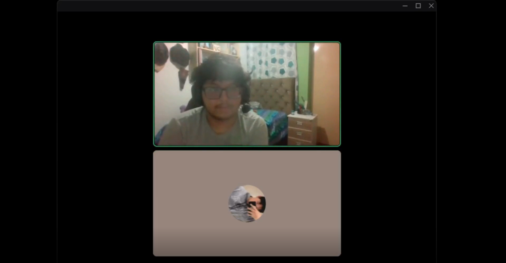 |
| **Resumen** | Giancarlo gestiona el cuidado del paciente mediante herramientas mayormente manuales. Para la medicación utiliza pastilleros semanales organizados con base en recetas médicas, complementados con alarmas en su celular para recordar los horarios. Las terapias y citas médicas las registra en un cuaderno físico junto con el historial del paciente. Entre sus herramientas cotidianas menciona dispositivos médicos básicos como tensiómetro, oxímetro y termómetro, además de un cuaderno de bitácora para registrar eventos relevantes. A nivel digital emplea principalmente alarmas y WhatsApp para comunicarse con los familiares. Señaló que uno de los principales problemas es la falta de coordinación durante los cambios de turno, donde la información no siempre se transmite correctamente, lo que puede generar pérdida de datos importantes sobre el estado del paciente. Respecto a las dificultades del cuidado diario, mencionó el manejo de cambios de humor y episodios de confusión del paciente, así como la falta de apoyo inmediato de profesionales de salud para resolver dudas. En relación con una posible solución digital, destacó la necesidad de registro compartido en tiempo real entre cuidadores, confirmación de administración de medicamentos, recordatorios automáticos, historial de signos vitales y una sección de notas para el relevo de turno. Espera que una solución digital le permita reducir la carga mental, mejorar la organización del cuidado y generar mayor confianza con los familiares al brindarles visibilidad del estado del paciente en tiempo real. |

| Segmento: Cuidadores | Entrevista #2 |
| --- | --- |
| **Nombres y Apellidos** | Renzo Uribe |
| **Edad** | 28 |
| **Distrito** | Lima |
| **Ocupación** | Cuidador de adultos mayores a domicilio |
| **Tiempo como cuidador** | 2 años |
| **Timing inicio** | 5:10 |
| **Duración** | 6:55 |
| **URL** | [Video Entrevistas](https://upcedupe-my.sharepoint.com/:v:/g/personal/u202319881_upc_edu_pe/IQAd7joONgjbTYJ4N_xUFvPXAcOMtAz8WbmokiYYCP5M3T0?nav=eyJyZWZlcnJhbEluZm8iOnsicmVmZXJyYWxBcHAiOiJPbmVEcml2ZUZvckJ1c2luZXNzIiwicmVmZXJyYWxBcHBQbGF0Zm9ybSI6IldlYiIsInJlZmVycmFsTW9kZSI6InZpZXciLCJyZWZlcnJhbFZpZXciOiJNeUZpbGVzTGlua0NvcHkifX0&e=mumL28) |
| **Screenshot** | 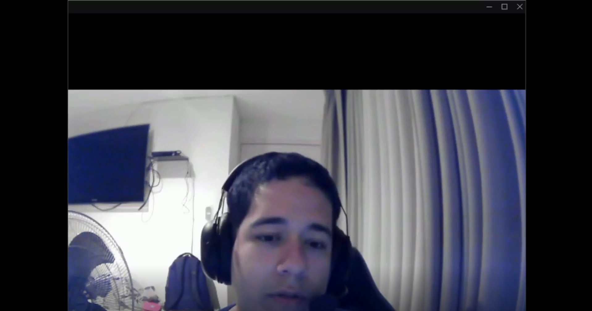 |
| **Resumen** | Renzo gestiona el cuidado del paciente mediante una combinación de herramientas manuales y digitales. Para la medicación utiliza un pastillero semanal organizado por horarios de mañana, tarde y noche. Para terapias y citas médicas emplea tanto un calendario físico como Google Calendar. Entre las herramientas de su día a día mencionó hojas de papel, aplicaciones de notas y múltiples alarmas en su celular, donde además registra información relevante como alimentación, signos vitales y cambios de ánimo. Indicó que uno de los principales problemas es la falta de coordinación e información, especialmente durante los cambios de turno o cuando los familiares no comunican cambios en la medicación, lo que genera incertidumbre sobre si el paciente ya recibió una dosis o si hubo modificaciones en el tratamiento. Para comunicarse utiliza principalmente WhatsApp, aunque considera que no es eficiente porque la información se pierde entre mensajes y dificulta la búsqueda de datos importantes en situaciones críticas. Entre las principales dificultades del cuidado diario destacó la responsabilidad de manejar múltiples pacientes, el control del stock de medicamentos y suministros, la necesidad de recordar citas y tareas, la gestión de cambios de ánimo en los pacientes y la dependencia de la memoria ante la falta de un sistema centralizado. Propuso funcionalidades como registro compartido de medicación con confirmación de dosis, alertas automáticas en caso de olvido, bitácora de salud con registro de signos vitales, visualización gráfica para seguimiento médico y un botón de emergencia con notificación a familiares y envío de ubicación. Espera que una solución digital le permita mejorar la organización, reducir errores en el cuidado y contar con un historial claro del paciente, evitando depender únicamente de la memoria o de la comunicación informal. |

| Segmento: Cuidadores | Entrevista #3 |
| --- | --- |
| **Nombres y Apellidos** | Sebastián Rubio Ortiz |
| **Edad** | 26 |
| **Distrito** | Lima |
| **Ocupación** | Cuidador informal, con inicio familiar y experiencia progresiva |
| **Tiempo como cuidador** | Aproximadamente 1 año |
| **Timing inicio** | 12:05 |
| **Duración** | 4:28 |
| **URL** | [Video Entrevistas](https://upcedupe-my.sharepoint.com/:v:/g/personal/u202319881_upc_edu_pe/IQAd7joONgjbTYJ4N_xUFvPXAcOMtAz8WbmokiYYCP5M3T0?nav=eyJyZWZlcnJhbEluZm8iOnsicmVmZXJyYWxBcHAiOiJPbmVEcml2ZUZvckJ1c2luZXNzIiwicmVmZXJyYWxBcHBQbGF0Zm9ybSI6IldlYiIsInJlZmVycmFsTW9kZSI6InZpZXciLCJyZWZlcnJhbFZpZXciOiJNeUZpbGVzTGlua0NvcHkifX0&e=mumL28) |
| **Screenshot** | 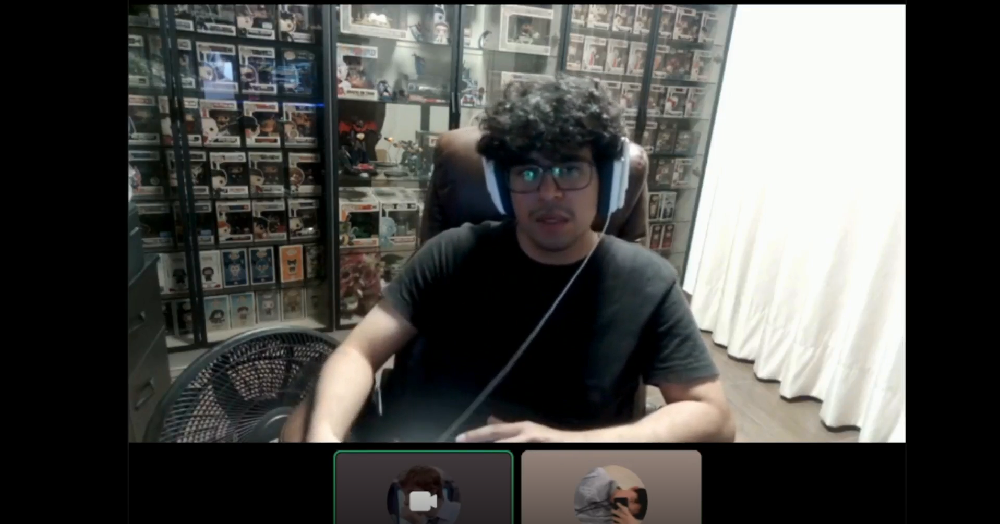 |
| **Resumen** | Sebastián organiza el cuidado del paciente utilizando principalmente herramientas digitales. Para la programación de citas y terapias emplea aplicaciones como Google Calendar, mientras que para la medicación combina pastilleros físicos con recordatorios digitales en su celular. Mencionó el uso constante del teléfono móvil para alarmas, cronómetros, notas y comunicación mediante WhatsApp, y señaló que estas herramientas son útiles pero no están integradas entre sí. Destacó que uno de los principales problemas es la falta de coordinación entre cuidadores, especialmente por el uso de métodos distintos, digitales y manuales. Indicó que el choque generacional dificulta la organización, ya que algunos cuidadores prefieren registrar información en papel, lo que puede generar pérdida de datos o falta de actualización ante cambios de medicación. La comunicación se realiza principalmente a través de grupos de WhatsApp, lo cual genera desorden y dificulta el acceso rápido a información relevante. Entre las principales dificultades del cuidado diario mencionó la alta carga mental asociada a la responsabilidad del cuidado, el riesgo de cometer errores en la administración de medicación, la dificultad para organizar información de manera eficiente y la falta de un sistema unificado entre cuidadores. Propuso funcionalidades como una interfaz intuitiva y de uso rápido, un sistema de checklist sincronizado entre cuidadores, la centralización de la información médica del paciente y la gestión del stock de medicamentos. Espera que una solución digital le permita centralizar toda la información del paciente en un solo lugar, mejorar la coordinación entre cuidadores y facilitar la organización del cuidado diario de manera más eficiente. |

#### Segmento 2: Pacientes geriátricos

| Segmento: Pacientes geriátricos | Entrevista #1 |
| --- | --- |
| **Nombres y Apellidos** | Rosa María Quispe |
| **Edad** | 68 |
| **Distrito** | Lima |
| **Apoyo de cuidador** | Sí, su hija |
| **Nivel de autonomía** | Media |
| **Uso de celular** | Sí, uso básico |
| **Timing inicio** | 16:34 |
| **Duración** | 2:42 |
| **URL** | [Video Entrevistas](https://upcedupe-my.sharepoint.com/:v:/g/personal/u202319881_upc_edu_pe/IQAd7joONgjbTYJ4N_xUFvPXAcOMtAz8WbmokiYYCP5M3T0?nav=eyJyZWZlcnJhbEluZm8iOnsicmVmZXJyYWxBcHAiOiJPbmVEcml2ZUZvckJ1c2luZXNzIiwicmVmZXJyYWxBcHBQbGF0Zm9ybSI6IldlYiIsInJlZmVycmFsTW9kZSI6InZpZXciLCJyZWZlcnJhbFZpZXciOiJNeUZpbGVzTGlua0NvcHkifX0&e=mumL28) |
| **Screenshot** | 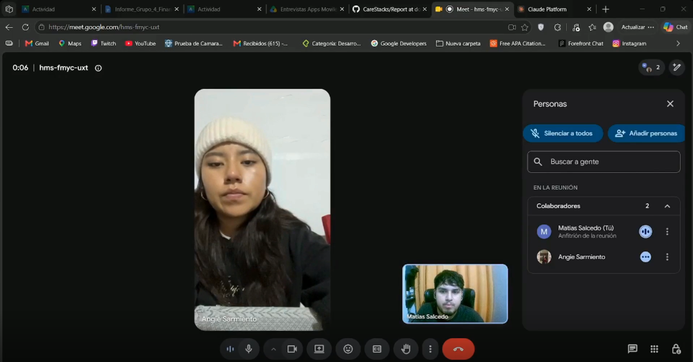 |
| **Resumen** | Rosa María depende parcialmente de su hija para organizar su medicación y sus citas médicas. Utiliza alarmas en su celular para recordar algunos medicamentos, pero en ocasiones olvida si ya los tomó, y las citas médicas las anota en un cuaderno. Entre sus dificultades identificó el olvido de medicación en algunos momentos, la confusión sobre si ya tomó una dosis y la dependencia de otra persona para confirmar información. Utiliza el celular principalmente para llamadas, WhatsApp y alarmas, e indica que no está familiarizada con aplicaciones complejas. Le gustaría contar con una herramienta simple que le indique claramente qué medicamentos debe tomar y en qué momento, sin generar confusión. Entre las funcionalidades sugeridas mencionó recordatorios claros con sonido, confirmación visual de la medicación tomada y una pantalla simple con las actividades del día. Espera que una solución digital le ayude a sentirse más segura y menos dependiente, especialmente para recordar su medicación diaria. |

| Segmento: Pacientes geriátricos | Entrevista #2 |
| --- | --- |
| **Nombres y Apellidos** | Luis Alberto Rojas |
| **Edad** | 74 |
| **Distrito** | *Pendiente. El documento base registra únicamente Arequipa, Perú.* |
| **Apoyo de cuidador** | No, vive con su esposa |
| **Nivel de autonomía** | Alta |
| **Uso de celular** | Sí |
| **Timing inicio** | 19:16 |
| **Duración** | 4:44 |
| **URL** | [Video Entrevistas](https://upcedupe-my.sharepoint.com/:v:/g/personal/u202319881_upc_edu_pe/IQAd7joONgjbTYJ4N_xUFvPXAcOMtAz8WbmokiYYCP5M3T0?nav=eyJyZWZlcnJhbEluZm8iOnsicmVmZXJyYWxBcHAiOiJPbmVEcml2ZUZvckJ1c2luZXNzIiwicmVmZXJyYWxBcHBQbGF0Zm9ybSI6IldlYiIsInJlZmVycmFsTW9kZSI6InZpZXciLCJyZWZlcnJhbFZpZXciOiJNeUZpbGVzTGlua0NvcHkifX0&e=mumL28) |
| **Screenshot** | 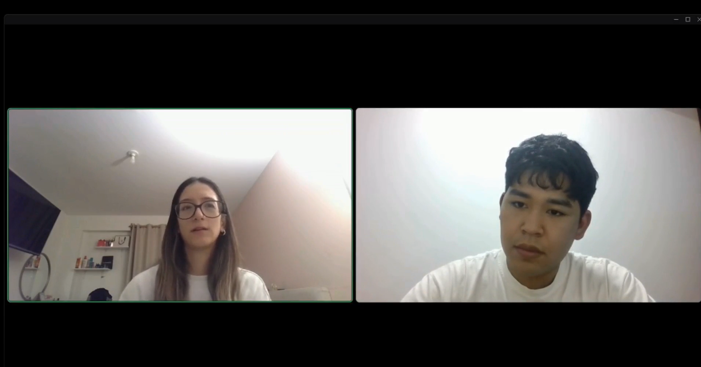 |
| **Resumen** | Luis Alberto gestiona su cuidado de forma independiente, apoyándose principalmente en su memoria y en algunos recordatorios del celular, aunque reconoce que en ocasiones olvida detalles de su tratamiento o de sus citas médicas. Las citas las anota en un calendario físico. Entre sus dificultades identificó el olvido ocasional de medicamentos, la falta de organización centralizada y la dificultad para llevar un historial de su salud. Utiliza el celular para llamadas, WhatsApp y ocasionalmente para alarmas, y se siente relativamente cómodo con tecnología básica. Busca una herramienta que le permita tener todo organizado en un solo lugar y evitar olvidos. Entre las funcionalidades sugeridas mencionó recordatorios automáticos, registro de medicamentos tomados e historial simple de salud. Espera mejorar su organización diaria y reducir los errores en su tratamiento mediante una herramienta fácil de usar. |

| Segmento: Pacientes geriátricos | Entrevista #3 |
| --- | --- |
| **Nombres y Apellidos** | Laura Marcela Rios |
| **Edad** | 78 |
| **Distrito** | Magdalena, Lima |
| **Apoyo de cuidador** | No, pero vive con su familia |
| **Nivel de autonomía** | Alta |
| **Uso de celular** | Sí, junto con tablet |
| **Timing inicio** | 24:01 |
| **Duración** | 4:21 |
| **URL** | [Video Entrevistas](https://upcedupe-my.sharepoint.com/:v:/g/personal/u202319881_upc_edu_pe/IQAd7joONgjbTYJ4N_xUFvPXAcOMtAz8WbmokiYYCP5M3T0?nav=eyJyZWZlcnJhbEluZm8iOnsicmVmZXJyYWxBcHAiOiJPbmVEcml2ZUZvckJ1c2luZXNzIiwicmVmZXJyYWxBcHBQbGF0Zm9ybSI6IldlYiIsInJlZmVycmFsTW9kZSI6InZpZXciLCJyZWZlcnJhbFZpZXciOiJNeUZpbGVzTGlua0NvcHkifX0&e=mumL28) |
| **Screenshot** | 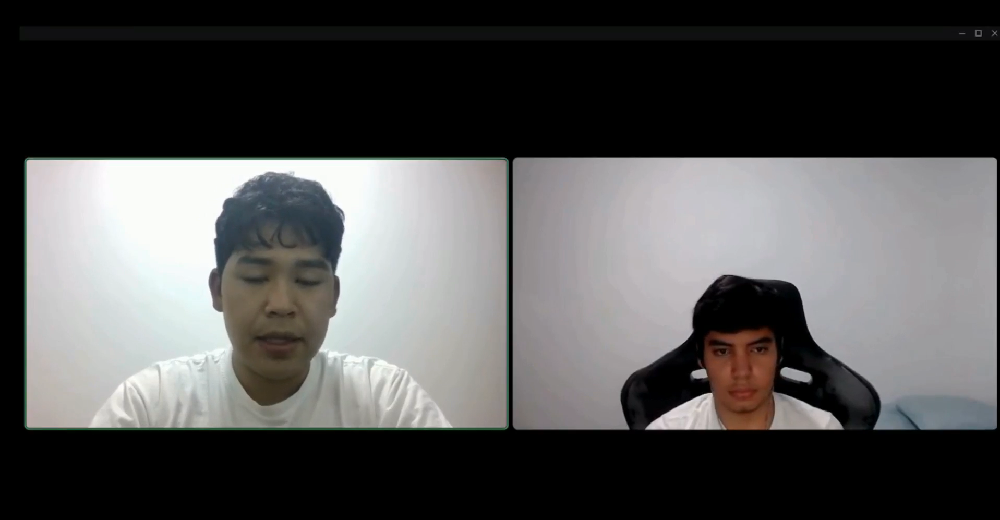 |
| **Resumen** | Laura Marcela gestiona su cuidado de forma independiente, apoyándose principalmente en alarmas y recordatorios de su celular y de su tablet. Reconoce que en ocasiones olvida, y son sus hijos o las propias alarmas quienes le recuerdan los medicamentos que debe tomar. Camina y asiste a sus citas de manera presencial y sin ayuda en la mayoría de casos. Entre sus dificultades identificó el olvido ocasional de fechas, la discapacidad física en ciertos momentos y la dificultad para guardar sus documentos de manera centralizada. Utiliza el celular para llamadas, WhatsApp y de forma intensiva para alarmas y calendario, además de usar frecuentemente la tablet para entretenimiento y comunicación, por lo que se siente cómoda con la tecnología. Busca una herramienta que le permita tener todo organizado en un solo lugar, evitar olvidos y transmitir información rápidamente a sus hijos en caso necesiten ayudarla. Entre las funcionalidades sugeridas mencionó recordatorios automáticos, agendado de citas acompañada e historial de documentos y citas pasadas. Espera mejorar su organización diaria y reducir los errores y accidentes que pueda sufrir en su tratamiento o en el camino hacia este, mediante una herramienta fácil de usar. |

#### 2.2.3. Análisis de entrevistas


#### Segmento 1: Cuidadores de pacientes geriátricos

**Características objetivas**

Los tres entrevistados de este segmento, es decir el 100 %, se encuentran dentro del rango de 25 a 60 años definido para cuidadores (Giancarlo 25, Sebastián 26 y Renzo 28 años) y residen en el Perú. La experiencia acumulada en actividades de cuidado varía entre uno y dos años: el 67 %, correspondiente a Giancarlo y Sebastián, lleva aproximadamente un año, mientras que el 33 %, correspondiente a Renzo, acumula dos años. Respecto al tipo de cuidado, el 67 %, es decir Giancarlo y Renzo, se desempeña como cuidador de adultos mayores a domicilio, y el 33 %, es decir Sebastián, ejerce como cuidador informal que inició en el ámbito familiar y fue ganando experiencia de manera progresiva.

En cuanto a la infraestructura de trabajo, el 100 % utiliza el celular como herramienta principal de su jornada y el 100 % utiliza alarmas para recordar la medicación. El 100 % combina herramientas físicas, como pastilleros y cuadernos, con herramientas digitales, sin que ninguna de ellas esté integrada con las demás. El 100 % utiliza WhatsApp como canal de comunicación con familiares y con otros cuidadores. El 67 %, Renzo y Sebastián, incorpora además una herramienta de calendario digital, específicamente Google Calendar, mientras que el 33 %, Giancarlo, se apoya exclusivamente en un cuaderno de bitácora. Un 33 %, Giancarlo, emplea también dispositivos médicos básicos como tensiómetro, oxímetro y termómetro.

**Características subjetivas**

Respecto a los problemas de coordinación, el 100 % declara enfrentarlos y el 100 % ha experimentado pérdida de información. El 67 %, Giancarlo y Renzo, sitúa el momento crítico específicamente en los cambios de turno: Giancarlo señala que la información no siempre se transmite correctamente al relevo, y Renzo indica que la incertidumbre sobre si el paciente ya recibió una dosis se agrava cuando los familiares no comunican cambios en la medicación. Sebastián identifica como causa el choque generacional entre cuidadores que registran en papel y cuidadores que registran de forma digital, lo que produce datos desactualizados.

En cuanto al canal de comunicación, el 67 %, Renzo y Sebastián, califica explícitamente a WhatsApp como insuficiente: Renzo indica que la información se pierde entre mensajes y dificulta encontrar datos importantes en situaciones críticas, mientras que Sebastián describe los grupos como desordenados y poco útiles para acceder rápido a lo relevante. Esto confirma que el problema no es la ausencia de un canal, sino la ausencia de una estructura que preserve la información.

Sobre la carga del rol, el 100 % menciona una alta carga mental y el 100 % expresa preocupación por cometer errores en la medicación. El 67 % refiere dificultades para organizar la información de manera eficiente, y el 33 %, Giancarlo, señala además la falta de apoyo profesional inmediato para resolver dudas clínicas. Renzo agrega dos cargas específicas de su perfil: la responsabilidad de manejar múltiples pacientes y el control del stock de medicamentos y suministros.

Respecto a las funcionalidades solicitadas de forma espontánea, el 100 % pidió registro compartido en tiempo real, confirmación de medicación administrada, alertas automáticas e historial del paciente. El 67 % solicitó una sección de notas o relevo de turno, mientras que el 33 % mencionó un botón de emergencia con envío de ubicación, propuesto por Renzo, y el control de stock de medicamentos, propuesto por Renzo y Sebastián. Sebastián enfatizó además que la interfaz debe ser intuitiva y de uso rápido, condición que aparece como requisito de adopción y no como preferencia estética.

**Conclusión del segmento**

Este grupo no busca simplemente una alarma más. Existe una fuerte dependencia de herramientas manuales y no especializadas, y la coordinación entre cuidadores emerge como el problema más crítico, por encima incluso del olvido individual. La carga mental es alta debido a la responsabilidad que asumen, y por eso valoran una solución que centralice la información y automatice procesos sin añadir pasos a su jornada. La simplicidad y la rapidez son factores determinantes para la adopción: si la herramienta les cuesta tiempo, vuelven al cuaderno.

#### Segmento 2: Pacientes geriátricos

**Características objetivas**

Los tres entrevistados de este segmento tienen entre 68 y 78 años, con un promedio de 73,3 años: Rosa María de 68 años, Luis Alberto de 74 años y Laura Marcela de 78 años. En cuanto a ubicación, el 67 %, Rosa María y Laura Marcela, reside en Lima, y el 33 %, Luis Alberto, en Arequipa. Respecto al apoyo recibido, el 33 %, Rosa María, cuenta con apoyo directo de un cuidador, específicamente su hija, mientras que el 67 %, Luis Alberto y Laura Marcela, no cuenta con cuidador asignado aunque convive con su familia. Coherentemente, el 67 % declara un nivel de autonomía alta y el 33 % un nivel de autonomía media.

El 100 % utiliza celular. En cuanto al nivel de manejo, el 67 %, Rosa María y Luis Alberto, se limita a funciones básicas de llamadas, WhatsApp y alarmas, y el 33 %, Laura Marcela, presenta un uso más intensivo que incluye calendario y el uso frecuente de una tablet para entretenimiento y comunicación. El 33 %, Rosa María, declara explícitamente no estar familiarizada con aplicaciones complejas.

**Características subjetivas**

Respecto a la gestión actual del tratamiento, el 100 % presenta dificultades para recordar la medicación o las actividades del día y el 100 % se apoya en métodos básicos como la memoria, el cuaderno o alarmas simples. Las estrategias difieren: Rosa María combina alarmas con la confirmación de su hija y anota las citas en un cuaderno, Luis Alberto se apoya en su memoria y registra las citas en un calendario físico, y Laura Marcela utiliza alarmas y recordatorios tanto en celular como en tablet.

En cuanto al riesgo asociado, el 100 % presenta riesgo de olvido y el 100 % carece de un sistema centralizado. El 33 %, Rosa María, reporta específicamente confusión sobre si ya tomó una dosis, lo que la lleva a dudar del estado real de su tratamiento. El 33 %, Laura Marcela, identifica además la dificultad para guardar sus documentos de manera centralizada, y menciona la discapacidad física en ciertos momentos como una limitación adicional.

Respecto a las funcionalidades solicitadas, el 100 % pidió recordatorios claros y automáticos, y el 100 % expresó la necesidad de una interfaz sencilla con visualización simple de las actividades. El 67 %, Rosa María y Luis Alberto, solicitó algún mecanismo de confirmación o registro de la medicación tomada. El 67 %, Luis Alberto y Laura Marcela, pidió un historial, orientado al estado de salud en el primer caso y a documentos y citas pasadas en el segundo. El 33 %, Laura Marcela, añadió el agendado de citas acompañada y la posibilidad de transmitir información rápidamente a sus hijos en caso necesiten ayudarla.

**Conclusión del segmento**

Este grupo requiere soluciones extremadamente simples. Existe una dependencia variable de apoyo externo, que va desde la confirmación puntual de un familiar hasta la gestión completa por parte de una hija, pero en los tres casos aparece el mismo deseo de conservar autonomía. La claridad visual y la facilidad de uso son fundamentales, y la solución debe orientarse a reducir la confusión antes que a añadir funciones. Es relevante que la disposición hacia la tecnología no sea uniforme dentro del segmento, lo que obliga a diseñar para el perfil de menor alfabetización digital sin limitar al de mayor manejo.

#### Conclusión general del análisis

A partir de ambos segmentos identificamos los siguientes hallazgos clave. El 100 % de los entrevistados presenta problemas de organización del cuidado y el 100 % utiliza herramientas no especializadas que no conversan entre sí. El 100 % requiere algún grado de centralización de la información. La coordinación entre cuidadores aparece como el mayor problema del primer segmento, mientras que la certeza sobre la dosis ya tomada aparece como el mayor problema del segundo. Ambos segmentos convergen en un mismo punto: necesitan saber con seguridad qué se hizo y qué falta hacer, aunque lo formulen desde posiciones distintas.

**Implicaciones para el diseño de CareConnect**

- Implementar un sistema centralizado de información que sustituya la combinación de cuaderno, alarma y mensajería.
- Diseñar una interfaz simple y accesible, con flujos cortos y textos legibles, dimensionada para el perfil de menor alfabetización digital.
- Incorporar alertas y recordatorios con confirmación explícita de cumplimiento.
- Permitir la colaboración entre múltiples usuarios vinculados a un mismo paciente, con visibilidad del relevo de turno.
- Reducir la dependencia de herramientas externas concentrando historial, documentos y agenda en un solo lugar.

### 2.3. Needfinding

#### 2.3.1. User Personas

En esta sección presentamos los arquetipos construidos a partir de los hallazgos recogidos en el análisis de competencia y en el análisis de entrevistas. Cada ficha concentra datos demográficos, hábitos, objetivos, frustraciones y nivel de adopción tecnológica observados durante la investigación, y sirve de referencia para las decisiones de diseño de CareConnect. Elaboramos una ficha por cada segmento objetivo definido en el Capítulo I, el cuidador de pacientes geriátricos y el paciente geriátrico con autonomía parcial o acompañada.

Los atributos destacados son los que aparecieron de forma transversal en las entrevistas: uso intensivo del celular como herramienta principal, dependencia de soluciones no especializadas como WhatsApp, pastilleros y cuadernos, alta carga mental en cuidadores y necesidad de simplicidad extrema en pacientes. Estos rasgos orientan el tono, la jerarquía de información y las prioridades funcionales del producto.

**Segmento 1: Cuidadores de pacientes geriátricos**


**Segmento 2: Pacientes geriátricos**   


#### 2.3.2. User Task Matrix

A partir de los dos User Personas definidos, Valeria Huamán como cuidadora informal y Rafael Medina como paciente geriátrico, consolidamos las tareas que ambos segmentos realizan en su día a día para llevar adelante el cuidado geriátrico. Es importante precisar que estas tareas se identifican con independencia de la existencia de CareConnect: representan actividades que los usuarios ya ejecutan con las herramientas que tienen a mano, como WhatsApp, cuadernos, alarmas, llamadas y memoria, y que cualquier solución de software debería facilitar, no reemplazar.

Para cada tarea indicamos la frecuencia con la que el segmento la realiza y la importancia que tiene dentro del proceso de cuidado. La escala se apoya en los porcentajes obtenidos en el análisis de entrevistas.

| Tarea | Valeria (cuidadora)<br>Frecuencia | Valeria (cuidadora)<br>Importancia | Rafael (paciente)<br>Frecuencia | Rafael (paciente)<br>Importancia |
|---|:---:|:---:|:---:|:---:|
| Administrar o tomar la medicación según horario | Alta | Alta | Alta | Alta |
| Recordar y confirmar si una dosis ya fue administrada | Alta | Alta | Alta | Alta |
| Registrar observaciones del paciente como síntomas, ánimo y signos | Alta | Alta | Media | Media |
| Consultar la rutina y actividades del día, controles y terapias | Alta | Alta | Alta | Alta |
| Agendar y asistir a citas médicas | Media | Alta | Media | Alta |
| Coordinar el cambio de turno entre cuidadores | Alta | Alta | N/A | N/A |
| Comunicar cambios o malestares del paciente a familiares o médicos | Alta | Alta | Media | Alta |
| Consultar historial clínico y evolución del paciente | Media | Alta | Baja | Media |
| Gestionar documentos médicos como recetas, resultados y comprobantes | Media | Alta | Baja | Media |
| Buscar información sobre tratamiento o medicamentos | Media | Media | Baja | Media |
| Solicitar apoyo a cuidador o familiar ante una duda | Media | Media | Alta | Alta |
| Reportar que una actividad del día fue completada | Alta | Media | Alta | Alta |

**Análisis del User Task Matrix**

Las tareas con mayor frecuencia e importancia en ambos segmentos son la administración y confirmación de la medicación, la consulta de la rutina diaria y el reporte de actividades completadas. Esto es consistente con el 100 % de entrevistados que mencionó la medicación como eje del cuidado y con las funcionalidades más solicitadas en el análisis de entrevistas: recordatorios, confirmación de medicación y visualización simple de actividades.

Respecto a las coincidencias, ambos User Personas necesitan certeza sobre el estado del tratamiento. Valeria necesita saber si alguien más ya administró una dosis, y Rafael necesita saber si él mismo ya la tomó. Ambos usan el celular como herramienta principal y valoran la rapidez para acceder a información crítica. También comparten la tarea de consultar la rutina diaria y reportar su cumplimiento, aunque con matices: Valeria la vive como responsabilidad operativa y Rafael como una forma de participar en su propio cuidado.

Respecto a las diferencias, las tareas vinculadas a la coordinación, es decir el cambio de turno, la gestión documental y la comunicación con múltiples actores, concentran alta frecuencia e importancia solo para Valeria. En Rafael aparecen con baja frecuencia porque las delega en su hija o en su esposa. En contraste, solicitar apoyo es una tarea de alta frecuencia para Rafael y media para Valeria, lo que refleja la asimetría de autonomía entre ambos: el paciente busca apoyo y el cuidador lo provee.

En cuanto a las implicaciones para el diseño, las tareas con alta frecuencia y alta importancia en ambos segmentos deben resolverse con flujos mínimos, de uno o dos toques, y con visibilidad inmediata en la pantalla principal. Las tareas asimétricas, es decir la coordinación para el cuidador y la solicitud de apoyo para el paciente, justifican vistas diferenciadas por rol dentro de una misma aplicación compartida. El resto de tareas, como la consulta de historial, la gestión documental y la búsqueda de información, puede vivir detrás de un segundo nivel de navegación sin perjudicar la experiencia.  

#### 2.3.3. User Journey Mapping

**Segmento 1: Cuidadores de pacientes geriátricos**


El recorrido de Valeria muestra una caída emocional progresiva a lo largo del día. Arranca con incertidumbre sobre si está olvidando algo, se estabiliza brevemente al administrar la medicación y vuelve a caer en los momentos críticos de cambio de turno y consulta médica, donde la falta de una herramienta centralizada hace que la información dependa de la memoria y del cuaderno. El punto más bajo aparece en la consulta médica, cuando el doctor pide historial y evolución, Valeria debe reconstruirlo a mano. La fase de registro de evolución cierra el día con frustración por no tener un registro fiel de lo ocurrido.

**Segmento 2: Pacientes geriátricos**


El recorrido de Rafael es más plano pero tiene un valle claro en la fase de malestar o cambio pues debido a su intención de no molestar a la familia, tarda en avisar cuando algo está fuera de lo normal. Al momento de tomar la medicación también baja la curva porque, ante la duda de haberla tomado, prefiere omitirla. La fase de actividades del día es la más positiva, dado que se trata de una rutina conocida que le da sensación de autonomía y la consulta médica recupera cierta estabilidad porque está acompañado, aunque persiste la frustración de no tener su historial al alcance.


#### 2.3.4. Empathy Mapping

**Segmento 1: Cuidadores de pacientes geriátricos**


En Valeria destaca una tensión entre el alto nivel de responsabilidad asumido y la falta de herramientas que la acompañen. Lo que dice y lo que piensa convergen en la misma preocupación: olvidar un medicamento o una indicación. Lo que hace muestra un patrón claro de uso intensivo del celular combinado con cuaderno físico, lo que refleja la ausencia de una solución centralizada. Lo que siente combina ansiedad y culpa con momentos puntuales de alivio cuando otro familiar confirma una acción. El mapa evidencia que CareConnect debe reducir la carga mental antes que sumar nuevas funciones.

**Segmento 2: Pacientes geriátricos**


En Rafael el eje emocional dominante es la pérdida progresiva de autonomía. Lo que dice muestra su deseo de resolver lo cotidiano sin tener que llamar a su hija por cada detalle. Lo que piensa revela una regla de decisión riesgosa: ante la duda, prefiere omitir la dosis. Lo que hace confirma un uso muy acotado del celular y un rechazo natural a aplicaciones nuevas si no fueron instaladas por alguien de confianza. Lo que siente mezcla frustración y gratitud, con tranquilidad cuando la información se presenta de forma clara. El mapa refuerza que la interfaz debe priorizar legibilidad, confirmación simple y lenguaje directo.

#### 2.3.5. As-is Scenario Mapping

Se presenta la situación actual (As-Is) de cada User Persona antes de contar con la solución. Cada escenario organiza el recorrido en fases y describe las acciones, pensamientos y emociones que la persona experimenta hoy, apoyándose únicamente en las herramientas que tiene a la mano. Las fases se nombraron de modo que puedan contrastarse una a una con las del To-Be Scenario Mapping.

---

##### User Persona 1 — Valeria Huamán

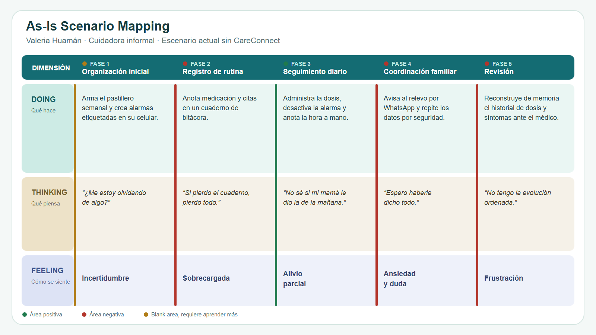

###### Recorrido por fases

| | Fase 1: Organización inicial | Fase 2: Registro de rutina | Fase 3: Seguimiento diario | Fase 4: Coordinación familiar | Fase 5: Revisión |
|---|---|---|---|---|---|
| **Doing** | Arma el pastillero semanal y crea alarmas etiquetadas en su celular | Anota medicación y citas en un cuaderno de bitácora | Administra la dosis, desactiva la alarma y anota la hora a mano | Avisa al relevo por WhatsApp y repite los datos por seguridad | Reconstruye de memoria el historial de dosis y síntomas ante el médico |
| **Thinking** | "¿Me estoy olvidando de algo?" | "Si pierdo el cuaderno, pierdo todo" | "No sé si mi mamá le dio la de la mañana" | "Espero haberle dicho todo" | "No tengo la evolución ordenada" |
| **Feeling** | Incertidumbre | Sobrecargada | Alivio parcial | Ansiedad y duda | Frustración |

###### Áreas identificadas

| Área | Fase | Descripción |
|---|---|---|
| **Positiva** | Fase 3: Seguimiento diario | Es el único momento del día con certeza plena, porque la acción es concreta, inmediata y depende solo de ella |
| **Negativa** | Fase 2: Registro de rutina | Toda la información del tratamiento vive en un soporte único y frágil, sin respaldo ni acceso para el resto de cuidadores |
| **Negativa** | Fase 4: Coordinación familiar | El relevo depende de la memoria y de mensajes informales. Es el problema que los tres cuidadores entrevistados señalaron como principal |
| **Negativa** | Fase 5: Revisión | La información existe pero está dispersa entre cuaderno, alarmas y conversaciones, y debe reconstruirse a mano frente al médico |
| **Blank area** | Fase 1: Organización inicial | No se determinó con qué criterio Valeria decide qué revisar primero cada mañana ni cuánto tiempo le toma. Requiere observación directa |

---

##### User Persona 2 — Rafael Medina

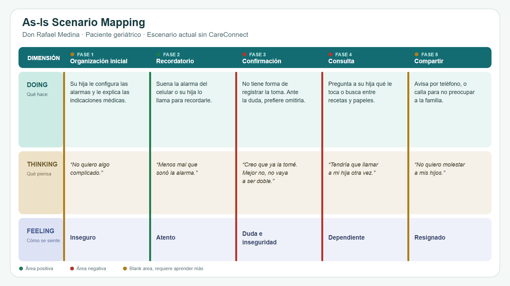

###### Recorrido por fases

| | Fase 1: Organización inicial | Fase 2: Recordatorio | Fase 3: Confirmación | Fase 4: Consulta | Fase 5: Compartir |
|---|---|---|---|---|---|
| **Doing** | Su hija le configura las alarmas y le explica las indicaciones médicas | Suena la alarma del celular o su hija lo llama para recordarle | No tiene forma de registrar la toma. Ante la duda, prefiere omitirla | Pregunta a su hija qué le toca o busca entre recetas y papeles | Avisa por teléfono, o calla para no preocupar a la familia |
| **Thinking** | "No quiero algo complicado" | "Menos mal que sonó la alarma" | "Creo que ya la tomé. Mejor no, no vaya a ser doble" | "Tendría que llamar a mi hija otra vez" | "No quiero molestar a mis hijos" |
| **Feeling** | Inseguro | Atento | Duda e inseguridad | Dependiente | Resignado |

###### Áreas identificadas

| Área | Fase | Descripción |
|---|---|---|
| **Positiva** | Fase 2: Recordatorio | La alarma cumple su función de avisar a tiempo y es el único apoyo que hoy le resulta confiable |
| **Negativa** | Fase 3: Confirmación | La duda sobre la dosis ya tomada deriva en omitir la medicación. Es un riesgo clínico directo, reportado de forma explícita durante las entrevistas al segmento |
| **Negativa** | Fase 4: Consulta | Depende de otra persona para saber qué le corresponde hacer, lo que reduce la autonomía que él mismo declara querer conservar |
| **Blank area** | Fase 1: Organización inicial | No se determinó con qué frecuencia Rafael necesita consultar a su hija ni cuántas de esas consultas podría resolver por sí mismo. Requiere medición |
| **Blank area** | Fase 5: Compartir | Se desconoce en qué medida desea compartir su estado por iniciativa propia o prefiere que lo haga su cuidadora. De ello depende cuánta información mostrarle en la aplicación |

---

##### Hallazgos transversales

En el caso de Valeria, el escenario actual distribuye la información entre cuadernos, alarmas y conversaciones de WhatsApp. Esta fragmentación incrementa la carga mental, dificulta el relevo entre cuidadores y obliga a reconstruir manualmente el historial durante una consulta médica. En el caso de Rafael, la situación actual genera dudas sobre si ya tomó una dosis y lo lleva a depender de otras personas para consultar su rutina.

Al comparar ambos mapas se observa que la fricción no está en la ejecución de las tareas de cuidado, que ambos resuelven, sino en la certeza sobre lo que ya ocurrió. Valeria no puede confirmar si otra persona administró la dosis y Rafael no puede confirmar si él mismo la tomó, de modo que se trata de la misma carencia expresada desde dos posiciones distintas del mismo proceso. Los momentos de mayor deterioro emocional coinciden además con los de mayor riesgo clínico, esto es el relevo de turno para el cuidador y la duda de dosis para el paciente. Las tres blank areas identificadas quedan registradas como preguntas abiertas para las siguientes iteraciones de investigación.


### 2.4. Ubiquitous Language

En esta sección se establece el lenguaje ubicuo del dominio de CareConnect, entendido como el conjunto de términos y conceptos que el equipo de desarrollo y los expertos del dominio del cuidado geriátrico utilizan de manera compartida para referirse a la misma realidad. Mantener este glosario completo y sin ambigüedad permite que las conversaciones sobre el producto, la documentación del informe y el modelo de la solución empleen las mismas palabras con el mismo significado, evitando que un mismo concepto reciba nombres distintos según quién lo mencione.

Siguiendo la práctica establecida por Eric Evans en Domain Driven Design, los términos se expresan en inglés, que es el idioma del modelo del dominio, y se acompañan de su equivalente en español en una columna independiente. Las definiciones se redactan en español. El glosario recoge exclusivamente conceptos propios del dominio del cuidado geriátrico, es decir, aquellos que existen en la realidad del paciente y de sus cuidadores con independencia de la solución de software. Los términos técnicos del área de ingeniería de software quedan fuera de esta sección por pertenecer al lenguaje de la solución y no al del problema.

Los términos se organizan en cinco grupos temáticos que corresponden a los aspectos centrales del dominio: los actores del cuidado, la agenda y el seguimiento de eventos de salud, la medicación y la adherencia al tratamiento, la continuidad del cuidado entre turnos, y la documentación y el registro de la evolución del paciente.

<div style="page-break-after: always"></div>

##### Actores del cuidado

| Término | Equivalente en español | Definición |
| :--- | :--- | :--- |
| **Patient** | Paciente | Persona cuya información de salud se registra y organiza en el marco de un proceso de cuidado, y titular de las decisiones sobre quién puede acceder a dicha información. |
| **Geriatric Patient** | Paciente geriátrico | Paciente adulto mayor, de sesenta años a más, que requiere seguimiento frecuente de su medicación, controles médicos y actividades diarias. |
| **Caregiver** | Cuidador | Persona autorizada por el paciente para acompañar su rutina de cuidado, dar seguimiento a su información de salud y ejecutar las actividades previstas en su tratamiento. |
| **Formal Caregiver** | Cuidador formal | Cuidador con formación o vínculo laboral en la atención de adultos mayores, como un enfermero, un técnico de salud o un asistente geriátrico. |
| **Informal Caregiver** | Cuidador informal | Familiar o allegado que asume el cuidado del paciente sin formación especializada ni relación contractual, generalmente dentro del hogar. |
| **Care Network** | Red de cuidado | Conjunto de cuidadores autorizados por un mismo paciente que se coordinan entre sí para sostener la continuidad de su cuidado. |
| **Health Professional** | Profesional de salud | Médico u otro especialista que evalúa al paciente, establece el tratamiento y conserva la responsabilidad sobre las decisiones clínicas. |

<div style="page-break-after: always"></div>

##### Agenda y eventos de salud

| Término | Equivalente en español | Definición |
| :--- | :--- | :--- |
| **Health Event** | Evento de salud | Actividad relacionada con la salud del paciente que ocurre en un momento determinado, como la toma de un medicamento o la asistencia a una cita médica. |
| **Agenda** | Agenda de cuidado | Organización en el tiempo de todos los eventos de salud previstos para un paciente, que permite conocer qué actividades corresponden a cada momento del día. |
| **Appointment** | Cita médica | Evento de salud programado entre el paciente y un profesional de salud en una fecha y una hora determinadas. |
| **Care Routine** | Rutina de cuidado | Secuencia habitual de actividades que el paciente y sus cuidadores realizan a lo largo del día para sostener el tratamiento indicado. |
| **Event Status** | Estado del evento | Condición en la que se encuentra un evento de salud respecto de su cumplimiento, pudiendo estar pendiente, confirmado o no cumplido. |
| **Event Confirmation** | Confirmación de evento | Registro mediante el cual el paciente o un cuidador dejan constancia de que un evento de salud programado efectivamente ocurrió. |
| **Reschedule** | Reprogramación | Cambio de la fecha o la hora de un evento de salud previamente registrado en la agenda de cuidado. |
| **Reminder** | Recordatorio | Aviso anticipado que se comunica al paciente o a sus cuidadores para que un evento de salud próximo se cumpla a tiempo. |
| **Alert** | Alerta | Aviso de alta prioridad dirigido a los cuidadores cuando se produce un incumplimiento o una situación que requiere atención inmediata. |

<div style="page-break-after: always"></div>

##### Medicación y adherencia

| Término | Equivalente en español | Definición |
| :--- | :--- | :--- |
| **Prescription** | Prescripción médica | Indicación emitida por un profesional de salud que establece qué medicamentos debe tomar el paciente, en qué dosis y con qué frecuencia. |
| **Medication Schedule** | Esquema de medicación | Distribución en el tiempo de los medicamentos prescritos al paciente, que define los horarios en que corresponde tomar cada uno. |
| **Medication Event** | Evento de medicación | Evento de salud que representa la toma o la administración de un medicamento en un horario definido dentro del esquema de medicación. |
| **Dose** | Dosis | Cantidad de un medicamento que corresponde tomar en un momento determinado, según lo establecido en la prescripción médica. |
| **Dose Administration** | Administración de dosis | Acto mediante el cual un cuidador entrega al paciente la dosis que corresponde, o el paciente la toma por sí mismo. |
| **Missed Dose** | Dosis omitida | Dosis que no fue tomada ni administrada dentro del horario previsto en el esquema de medicación. |
| **Duplicate Dose** | Dosis duplicada | Dosis administrada más de una vez en un mismo horario, generalmente por falta de certeza sobre si ya había sido entregada. |
| **Treatment Adherence** | Adherencia al tratamiento | Grado en que el paciente cumple las indicaciones médicas recibidas, especialmente en lo referido a horarios y dosis de medicación. |

<div style="page-break-after: always"></div>

##### Continuidad del cuidado

| Término | Equivalente en español | Definición |
| :--- | :--- | :--- |
| **Care Shift** | Turno de cuidado | Periodo continuo durante el cual un cuidador determinado asume la responsabilidad sobre el paciente. |
| **Shift Handover** | Relevo de turno | Traspaso de la responsabilidad del cuidado y de la información sobre el estado del paciente entre el cuidador que termina su turno y el que lo inicia. |
| **Profile Sharing** | Compartición de perfil | Decisión del paciente de autorizar a un cuidador para que acceda a su información de salud y participe de su proceso de cuidado. |
| **Access Consent** | Consentimiento de acceso | Alcance de la información de salud que el paciente autoriza a conocer a un cuidador determinado, y que puede modificar o retirar en cualquier momento. |
| **Shared Care** | Cuidado compartido | Modalidad de cuidado en la que varias personas atienden a un mismo paciente de manera alternada y requieren información común sobre lo ya realizado. |
| **Caregiver Burden** | Carga del cuidador | Desgaste físico y mental que experimenta el cuidador como consecuencia de la responsabilidad sostenida sobre el paciente. |

<div style="page-break-after: always"></div>

##### Documentación y evolución

| Término | Equivalente en español | Definición |
| :--- | :--- | :--- |
| **Medical Document** | Documento médico | Documento con información clínica del paciente, como un resultado de examen, una receta o un informe emitido por un profesional de salud. |
| **Diary Entry** | Entrada de diario | Registro descrito por el paciente o por un cuidador sobre el estado, la experiencia o el comportamiento del paciente en un momento determinado. |
| **Diary** | Diario de seguimiento | Conjunto ordenado de entradas de diario que permite reconstruir cómo transcurrió el cuidado del paciente a lo largo del tiempo. |
| **Patient Evolution** | Evolución del paciente | Cambio observado en el estado de salud del paciente durante un periodo determinado, y que el profesional de salud consulta para evaluar el tratamiento. |
| **Vital Signs** | Signos vitales | Mediciones básicas del estado del paciente, como la presión arterial, la temperatura corporal y la saturación de oxígeno, registradas durante el cuidado diario. |
| **Warning Sign** | Signo de alerta | Manifestación observada en el paciente que indica un posible deterioro de su estado y que debe comunicarse oportunamente a los demás cuidadores o al profesional de salud. |

<div style="page-break-after: always"></div>

## Capítulo III: Requirements Specification

<!-- ===== CAPÍTULO ASIGNADO A ESTE INTEGRANTE ===== -->
Este capítulo especifica los requisitos funcionales y técnicos de los productos digitales de CareConnect a partir de los hallazgos del proceso de elicitación. Se presentan los escenarios futuros de las personas usuarias, las historias de usuario, el Product Backlog priorizado y el Impact Mapping que conecta las funcionalidades con los objetivos del negocio.

### 3.1. To-Be Scenario Mapping
Se presenta la situación futura (To-Be) de cada User Persona con la solución implementada, en contraste directo con el As-Is Scenario Mapping presentado en la sección [2.3.5](#235-as-is-scenario-mapping). Cada escenario organiza el recorrido en las mismas fases definidas en el As-Is y describe las acciones, pensamientos y emociones esperadas durante el uso de CareConnect.

**User Persona 1 — Valeria Huamán (Cuidadora informal)**

| | Fase 1: Organización inicial | Fase 2: Registro de rutina | Fase 3: Seguimiento diario | Fase 4: Coordinación familiar | Fase 5: Revisión |
|---|---|---|---|---|---|
| **Doing** | Crea su cuenta y registra al paciente | Registra medicación y citas en la agenda | Recibe alertas de incumplimiento y confirma tareas | Comparte el perfil con otro familiar y revisa el diario compartido | Consulta el historial de eventos y documentos |
| **Thinking** | "¿Es fácil de configurar?" | "Ahora todo queda en un solo lugar" | "Me avisa si algo no se cumplió" | "Mi hermana también puede ver el estado" | "Puedo mostrar esto al médico" |
| **Feeling** | Expectante | Aliviada, en control | Segura, respaldada | Acompañada, menos sola | Confiada |

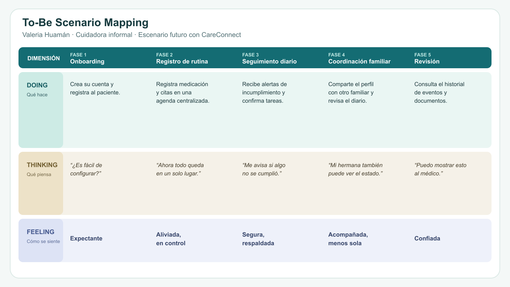

**User Persona 2 — Don Rafael Medina (Paciente geriátrico)**

| | Fase 1: Organización inicial | Fase 2: Recordatorio | Fase 3: Confirmación | Fase 4: Consulta | Fase 5: Compartir |
|---|---|---|---|---|---|
| **Doing** | Un familiar le configura la cuenta | Recibe un recordatorio claro de su medicación | Confirma que tomó su medicamento con un toque | Revisa su agenda del día en letra grande | Comparte su estado con su cuidadora |
| **Thinking** | "No quiero algo complicado" | "Me avisa a tiempo" | "Fue fácil confirmar" | "Entiendo qué me toca hoy" | "Mi hija sabe cómo estoy" |
| **Feeling** | Inseguro al inicio | Tranquilo | Autónomo | Orientado, sin confusión | Acompañado |

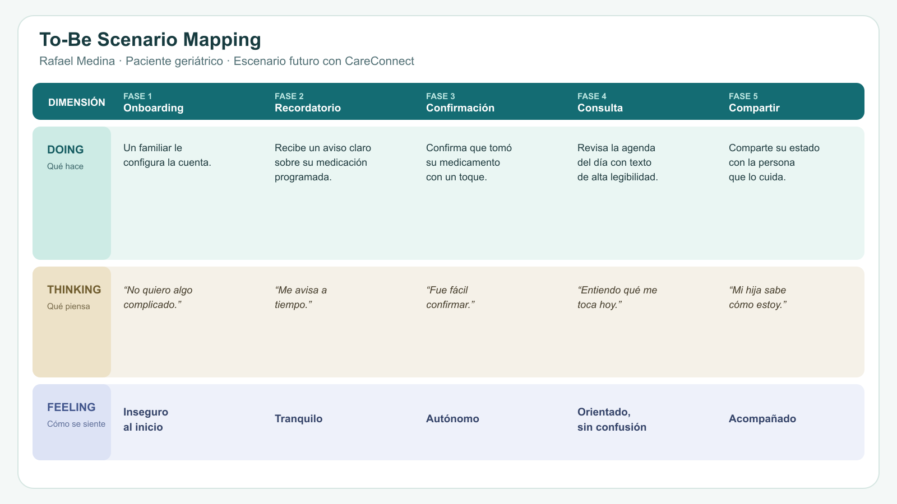

##### Comparación con el As-Is Scenario Mapping (sección [2.3.5](#235-as-is-scenario-mapping))

En el caso de Valeria, el escenario actual distribuye la información entre cuadernos, alarmas y conversaciones de WhatsApp. Esta fragmentación incrementa la carga mental, dificulta el relevo entre cuidadores y obliga a reconstruir manualmente el historial durante una consulta médica. El escenario To-Be centraliza la agenda, las confirmaciones, el diario y los documentos; además, permite compartir el perfil para que la coordinación familiar no dependa de mensajes aislados.

En el caso de Rafael, la situación actual genera dudas sobre si ya tomó una dosis y lo lleva a depender de otras personas para consultar su rutina. El escenario To-Be introduce recordatorios claros, confirmación con un solo toque y una agenda diaria de alta legibilidad. Con ello conserva mayor autonomía y su cuidadora puede conocer el estado de las actividades sin interrumpirlo constantemente.

### 3.2. User Stories
Las historias de usuario se organizaron por producto digital y se redactaron con criterios de aceptación en formato Gherkin (Dado-Cuando-Entonces). Se conservaron las historias funcionales validadas durante el ciclo anterior y se incorporaron las correspondientes al Landing Page y a la Frontend Web Application.

**Epics**

| Epic ID | Nombre de la Épica | Descripción |
|---------|--------------------|-------------|
| EP01 | Gestión de Agenda | Como paciente o cuidador, quiero gestionar eventos de salud para organizar medicación y citas en el tiempo. |
| EP02 | Gestión de Notificaciones | Como paciente o cuidador, quiero recibir notificaciones para dar seguimiento oportuno a los eventos de salud. |
| EP03 | Gestión de Documentos | Como paciente o cuidador, quiero gestionar documentos médicos para mantener un registro accesible. |
| EP04 | Gestión de Consentimiento | Como paciente, quiero compartir mi perfil con un cuidador para permitir el seguimiento de mi estado de salud. |
| EP05 | Diario de Seguimiento | Como paciente o cuidador, quiero registrar notas de seguimiento para monitorear la evolución del estado de salud. |
| EP06 | Autenticación | Como paciente o cuidador, quiero acceder al sistema de forma segura para proteger mi información personal. |
| EP07 | Landing Page | Como visitante, quiero conocer la propuesta de valor y las características de CareConnect para decidir si la solución responde a mis necesidades de cuidado. |

**Historias de usuario, historias técnicas y spikes**

El siguiente cuadro consolida todos los elementos especificados para los productos digitales de CareConnect. Las User Stories y Technical Stories incluyen criterios de aceptación comprobables en formato Gherkin, mientras que los spikes indican su timebox y resultado esperado.

| Story ID | Tipo | Usuario | Prioridad | Épica | Título | Descripción | Criterios de aceptación / Resultado esperado |
|----------|------|---------|-----------|--------|--------|-------------|-----------------------------------------------|
| US01 | User Story | Paciente / Cuidador | Alta | Gestión de Agenda | Registrar evento de salud | Como paciente o cuidador, deseo registrar un evento de salud (medicación o cita) para organizar las actividades médicas en un calendario. | Escenario 1: Registro exitoso de evento <br> Dado que el paciente o cuidador ingresa datos válidos del evento <br> Cuando registra el evento de salud <br> Entonces el sistema almacena el evento correctamente en la agenda <br><br> Escenario 2: Validación de datos obligatorios <br> Dado que el paciente o cuidador omite datos obligatorios <br> Cuando intenta registrar el evento <br> Entonces el sistema muestra un mensaje de error indicando los campos requeridos <br><br> Escenario 3: Visualización del evento <br> Dado que el evento fue registrado correctamente <br> Cuando el paciente o cuidador accede al calendario <br> Entonces el evento se visualiza en la fecha correspondiente |
| US02 | User Story | Paciente | Alta | Gestión de Agenda | Confirmar evento de salud | Como paciente, deseo confirmar un evento de salud para registrar el cumplimiento de mi tratamiento. | Escenario 1: Confirmación exitosa <br> Dado que existe un evento programado <br> Cuando el paciente confirma el evento <br> Entonces el sistema actualiza su estado a "confirmado" <br><br> Escenario 2: Visualización del estado <br> Dado que el evento fue confirmado <br> Cuando el paciente accede al calendario <br> Entonces el estado del evento se muestra como confirmado |
| US03 | User Story | Paciente / Cuidador | Media | Gestión de Agenda | Reprogramar evento de salud | Como paciente o cuidador, deseo reprogramar un evento de salud para ajustarlo a cambios en la disponibilidad. | Escenario 1: Reprogramación exitosa <br> Dado que existe un evento previamente registrado <br> Cuando el paciente o cuidador modifica la fecha u hora <br> Entonces el sistema actualiza el evento correctamente <br><br> Escenario 2: Validación de conflicto <br> Dado que existe otro evento en el mismo horario <br> Cuando el paciente o cuidador intenta reprogramar <br> Entonces el sistema evita el conflicto y muestra una advertencia |
| US04 | User Story | Paciente | Alta | Gestión de Notificaciones | Recibir recordatorios de eventos | Como paciente, deseo recibir recordatorios de mis eventos de salud para cumplir con mis actividades programadas. | Escenario 1: Envío de recordatorio <br> Dado que existe un evento programado <br> Cuando se aproxima la hora del evento <br> Entonces el paciente recibe una notificación <br><br> Escenario 2: Contenido de la notificación <br> Dado que se genera una notificación <br> Cuando el paciente la visualiza <br> Entonces esta contiene información relevante del evento |
| US05 | User Story | Cuidador | Alta | Gestión de Notificaciones | Recibir alertas de incumplimiento | Como cuidador, deseo recibir alertas cuando un evento no es confirmado para supervisar al paciente. | Escenario 1: Generación de alerta <br> Dado que un evento no ha sido confirmado <br> Cuando se supera el tiempo límite establecido <br> Entonces el cuidador recibe una alerta de incumplimiento <br><br> Escenario 2: Validación de permisos <br> Dado que el cuidador no tiene acceso al paciente <br> Cuando se genera la alerta <br> Entonces el sistema no envía la notificación |
| US06 | User Story | Cuidador | Media | Gestión de Notificaciones | Visualizar notificaciones | Como cuidador, deseo visualizar las notificaciones recibidas para monitorear el estado del paciente. | Escenario 1: Consulta de notificaciones <br> Dado que existen notificaciones registradas <br> Cuando el cuidador accede a la sección de notificaciones <br> Entonces el sistema muestra la lista de notificaciones <br><br> Escenario 2: Orden de visualización <br> Dado que existen múltiples notificaciones <br> Cuando el cuidador las visualiza <br> Entonces se muestran ordenadas por fecha o prioridad |
| US07 | User Story | Paciente / Cuidador | Alta | Gestión de Documentos | Subir documento médico | Como paciente o cuidador, deseo subir documentos médicos para mantener un registro digital accesible. | Escenario 1: Carga exitosa <br> Dado que el paciente o cuidador selecciona un archivo válido <br> Cuando lo sube al sistema <br> Entonces el documento se almacena correctamente <br><br> Escenario 2: Validación de archivo <br> Dado que el archivo no cumple con formato o tamaño permitido <br> Cuando el paciente o cuidador intenta subirlo <br> Entonces el sistema muestra un mensaje de error |
| US08 | User Story | Paciente / Cuidador | Media | Gestión de Documentos | Consultar documentos | Como paciente o cuidador, deseo consultar los documentos almacenados para revisar información médica. | Escenario 1: Visualización de documentos <br> Dado que existen documentos almacenados <br> Cuando el paciente o cuidador accede a la sección correspondiente <br> Entonces el sistema muestra la lista de documentos disponibles |
| US09 | User Story | Cuidador | Media | Gestión de Documentos | Acceder a documentos compartidos | Como cuidador, deseo acceder a los documentos del paciente para apoyar en su seguimiento. | Escenario 1: Acceso autorizado <br> Dado que el cuidador tiene permisos de acceso <br> Cuando consulta los documentos del paciente <br> Entonces el sistema permite su visualización <br><br> Escenario 2: Acceso denegado <br> Dado que el cuidador no tiene permisos <br> Cuando intenta acceder a los documentos <br> Entonces el sistema bloquea el acceso y muestra un mensaje de restricción |
| US10 | User Story | Paciente / Cuidador | Alta | Autenticación | Registrar cuenta | Como usuario, quiero registrar mi propia cuenta para acceder a la plataforma. | Escenario 1: Creación de cuenta <br> Dado que el usuario ingresa datos válidos <br> Cuando registra su cuenta <br> Entonces el sistema crea la cuenta del usuario <br><br> Escenario 2: Creación denegada <br> Dado que el correo ya existe <br> Cuando el usuario intenta registrarse <br> Entonces el sistema bloquea el registro y muestra "el usuario con este correo ya existe" |
| US11 | User Story | Paciente / Cuidador | Alta | Autenticación | Validar acceso por rol | Como usuario, quiero validar el acceso según el rol que poseo. | Escenario 1: Acceso permitido <br> Dado que el usuario tiene permisos válidos <br> Cuando abre la aplicación <br> Entonces el sistema le muestra lo que le corresponde según su rol <br><br> Escenario 2: Acceso denegado <br> Dado que el usuario no tiene permisos <br> Cuando intenta acceder a otra sección <br> Entonces el sistema bloquea el acceso y muestra un mensaje de restricción |
| US12 | User Story | Paciente / Cuidador | Media | Diario de Seguimiento | Escribir nota | Como paciente o cuidador, quiero escribir notas en mi diario para registrar mi estado o el de mi familiar. | Escenario 1: Nota registrada <br> Dado que el paciente o cuidador ingresa contenido válido <br> Cuando guarda la nota <br> Entonces la nota se almacena correctamente <br><br> Escenario 2: Nota vacía <br> Dado que el paciente o cuidador no ingresa contenido <br> Cuando intenta guardar <br> Entonces el sistema muestra un mensaje de error |
| US13 | User Story | Cuidador | Media | Diario de Seguimiento | Consultar diarios compartidos | Como cuidador, quiero consultar el diario compartido del paciente para conocer su estado. | Escenario 1: Consulta exitosa <br> Dado que el cuidador posee acceso autorizado <br> Cuando consulta el diario del paciente <br> Entonces el sistema le muestra las notas <br><br> Escenario 2: Acceso denegado <br> Dado que el cuidador no tiene permisos <br> Cuando intenta acceder a las notas <br> Entonces el sistema bloquea el acceso y muestra un mensaje de restricción |
| US14 | User Story | Paciente | Alta | Gestión de Consentimiento | Compartir perfil | Como paciente, quiero compartir mi perfil con familiares para que puedan ver mi información. | Escenario 1: Compartir exitoso <br> Dado que el familiar es un usuario válido <br> Cuando comparto mi perfil <br> Entonces el sistema otorga el acceso al familiar <br><br> Escenario 2: Error al compartir <br> Dado que el familiar no es un usuario válido <br> Cuando intento compartir el perfil <br> Entonces el sistema muestra un mensaje de usuario no existe |
| US15 | User Story | Cuidador | Media | Gestión de Consentimiento | Consultar perfil compartido | Como cuidador, quiero consultar el perfil compartido del paciente para acceder a su información. | Escenario 1: Consulta exitosa <br> Dado que el paciente me dio permiso <br> Cuando consulto el perfil <br> Entonces se muestra la información <br><br> Escenario 2: Acceso inválido <br> Dado que el paciente no otorgó permisos <br> Cuando intento consultar el perfil <br> Entonces el sistema bloquea el acceso y muestra un mensaje de restricción |
| US16 | User Story | Paciente | Media | Gestión de Consentimiento | Revocar acceso | Como paciente, quiero revocar el acceso a mi perfil para controlar quién puede ver mi información. | Escenario 1: Revocación exitosa <br> Dado que el paciente otorgó los permisos <br> Cuando revoca el acceso <br> Entonces el sistema quita los privilegios al cuidador <br><br> Escenario 2: Acción no permitida <br> Dado que el paciente ya revocó el permiso al cuidador <br> Cuando intenta revocar nuevamente <br> Entonces el sistema muestra un mensaje de error |
| USL01 | User Story | Visitante | Alta | Landing Page | Conocer la propuesta de valor | Como visitante, deseo conocer la propuesta de valor de CareConnect para entender cómo la solución me ayuda a coordinar el cuidado. | Escenario 1: Presentación de la propuesta <br> Dado que el visitante ingresa a la landing <br> Cuando visualiza la sección principal <br> Entonces se presenta la propuesta de valor y su beneficio principal |
| USL02 | User Story | Visitante (cuidador / paciente) | Alta | Landing Page | Explorar beneficios por segmento | Como visitante, deseo explorar los beneficios dirigidos a mi segmento para evaluar si la solución responde a mi necesidad. | Escenario 1: Contenido por segmento <br> Dado que el visitante recorre la landing <br> Cuando llega a la sección de segmentos <br> Entonces se presentan beneficios diferenciados para cuidadores y pacientes |
| USL03 | User Story | Visitante | Media | Landing Page | Ver testimonios | Como visitante, deseo ver testimonios de usuarios para generar confianza en la solución. | Escenario 1: Visualización de testimonios <br> Dado que el visitante recorre la landing <br> Cuando llega a la sección de testimonios <br> Entonces se muestran al menos un testimonio por segmento objetivo |
| USL04 | User Story | Visitante | Alta | Landing Page | Iniciar registro desde la landing | Como visitante, deseo iniciar mi registro desde la landing para comenzar a usar la plataforma. | Escenario 1: Llamado a la acción <br> Dado que el visitante decide registrarse <br> Cuando activa el llamado a la acción de registro <br> Entonces el sistema lo dirige al flujo de creación de cuenta |
| USL05 | User Story | Visitante | Media | Landing Page | Cambiar idioma del sitio | Como visitante, deseo cambiar el idioma del sitio (English / Español) para leer el contenido en mi idioma preferido. | Escenario 1: Cambio de idioma <br> Dado que el visitante selecciona un idioma disponible (en_US / es_419) <br> Cuando confirma la selección <br> Entonces el contenido del sitio se muestra en el idioma elegido |
| USL06 | User Story | Visitante | Media | Landing Page | Consultar Términos y Condiciones | Como visitante, deseo consultar los Términos y Condiciones desde el footer para conocer los derechos y obligaciones del servicio. | Escenario 1: Acceso a Términos y Condiciones <br> Dado que el visitante está en la landing <br> Cuando accede al enlace de Términos y Condiciones del footer <br> Entonces el sistema muestra el Acuerdo de Servicio (SaaS) |
| USW01 | User Story | Cuidador | Alta | Gestión de Agenda | Gestionar agenda desde la web | Como cuidador, deseo gestionar la agenda del paciente desde el navegador para coordinar el cuidado sin depender del móvil. | Escenario 1: Gestión web de eventos <br> Dado que el cuidador inició sesión en la web application <br> Cuando registra o edita un evento de salud <br> Entonces el sistema persiste el cambio y lo refleja en la agenda |
| USW02 | User Story | Cuidador | Media | Diario de Seguimiento | Consultar diario y documentos desde la web | Como cuidador, deseo consultar el diario y los documentos compartidos del paciente desde la web para dar seguimiento en pantalla amplia. | Escenario 1: Consulta web autorizada <br> Dado que el cuidador tiene acceso autorizado <br> Cuando consulta el diario o los documentos compartidos en la web application <br> Entonces el sistema muestra la información correspondiente |
| USW03 | User Story | Paciente / Cuidador | Media | Gestión de Notificaciones | Visualizar notificaciones desde la web | Como usuario, deseo visualizar mis notificaciones en la web application para dar seguimiento a los eventos desde cualquier dispositivo. | Escenario 1: Notificaciones en web <br> Dado que existen notificaciones para el usuario <br> Cuando accede a la sección de notificaciones en la web application <br> Entonces el sistema muestra la lista ordenada por fecha o prioridad |
| TS01 | Technical Story | Desarrollador | Alta | Gestión de Agenda | Persistencia de eventos de agenda | Como desarrollador, quiero implementar la persistencia de eventos de salud (citas y medicación) para garantizar su almacenamiento y consulta eficiente. | Escenario 1: Almacenamiento exitoso <br> Dado que se recibe un evento válido <br> Cuando el sistema lo procesa <br> Entonces el evento se almacena correctamente en la base de datos <br><br> Escenario 2: Integridad de datos <br> Dado que ocurre un error en el almacenamiento <br> Cuando el sistema intenta guardar el evento <br> Entonces se evita la persistencia de datos incompletos |
| TS02 | Technical Story | Desarrollador | Alta | Gestión de Agenda | Gestión de estado de eventos | Como desarrollador, quiero implementar la lógica de cambio de estado de los eventos (pendiente, confirmado, incumplido) para reflejar el seguimiento del paciente. | Escenario 1: Cambio de estado válido <br> Dado que existe un evento registrado <br> Cuando se actualiza su estado <br> Entonces el sistema persiste el nuevo estado correctamente <br><br> Escenario 2: Validación de transición <br> Dado un estado inválido <br> Cuando se intenta actualizar <br> Entonces el sistema rechaza la operación |
| TS03 | Technical Story | Desarrollador | Alta | Gestión de Notificaciones | Programación de notificaciones | Como desarrollador, quiero implementar un servicio de programación que genere notificaciones basadas en la fecha y hora de los eventos registrados. | Escenario 1: Programación correcta <br> Dado que existe un evento con fecha definida <br> Cuando se agenda la notificación <br> Entonces el sistema programa su envío correctamente <br><br> Escenario 2: Reprogramación <br> Dado que el evento cambia de horario <br> Cuando se actualiza <br> Entonces la notificación se reprograma automáticamente |
| TS04 | Technical Story | Desarrollador | Alta | Gestión de Notificaciones | Envío de notificaciones | Como desarrollador, quiero implementar el mecanismo de envío de notificaciones push hacia pacientes y cuidadores según reglas de negocio. | Escenario 1: Envío exitoso <br> Dado que existe una notificación programada <br> Cuando se cumple la condición de envío <br> Entonces el sistema envía la notificación al destinatario <br><br> Escenario 2: Manejo de fallos <br> Dado que falla el envío <br> Cuando ocurre el error <br> Entonces el sistema registra el incidente y reintenta según configuración |
| TS05 | Technical Story | Desarrollador | Media | Gestión de Notificaciones | Control de acceso a notificaciones | Como desarrollador, quiero implementar validaciones de permisos para asegurar que solo usuarios autorizados reciban notificaciones. | Escenario 1: Acceso autorizado <br> Dado que el usuario tiene permisos <br> Cuando se genera una notificación <br> Entonces el sistema permite su envío <br><br> Escenario 2: Acceso restringido <br> Dado que el usuario no tiene permisos <br> Cuando se genera una notificación <br> Entonces el sistema bloquea el envío |
| TS06 | Technical Story | Desarrollador | Alta | Gestión de Documentos | Almacenamiento de documentos | Como desarrollador, quiero implementar el almacenamiento de documentos médicos en un sistema seguro para garantizar su disponibilidad. | Escenario 1: Almacenamiento correcto <br> Dado que se recibe un archivo válido <br> Cuando el sistema lo procesa <br> Entonces el documento se almacena correctamente <br><br> Escenario 2: Validación de archivo <br> Dado un archivo inválido <br> Cuando se intenta almacenar <br> Entonces el sistema rechaza la operación |
| TS07 | Technical Story | Desarrollador | Media | Gestión de Documentos | Gestión de metadatos de documentos | Como desarrollador, quiero implementar el registro de metadatos (tipo, fecha, paciente, descripción) asociados a cada documento. | Escenario 1: Registro de metadatos <br> Dado que se almacena un documento <br> Cuando se registran sus atributos <br> Entonces el sistema guarda correctamente los metadatos <br><br> Escenario 2: Consistencia <br> Dado datos incompletos <br> Cuando se intenta registrar <br> Entonces el sistema valida y rechaza la operación |
| TS08 | Technical Story | Desarrollador | Alta | Gestión de Documentos | Control de acceso a documentos | Como desarrollador, quiero implementar mecanismos de autorización para controlar el acceso a documentos entre paciente y cuidador. | Escenario 1: Acceso permitido <br> Dado que el cuidador tiene permisos <br> Cuando solicita acceso <br> Entonces el sistema permite visualizar el documento <br><br> Escenario 2: Acceso denegado <br> Dado que no tiene permisos <br> Cuando intenta acceder <br> Entonces el sistema bloquea la operación |
| TS09 | Technical Story | Desarrollador | Alta | Autenticación | Persistencia de usuarios | Como desarrollador, quiero implementar la persistencia de usuarios para garantizar el registro correcto en la base de datos. | Escenario 1: Registro exitoso <br> Dado que el usuario envía datos válidos <br> Cuando el sistema procesa el registro <br> Entonces el usuario se almacena correctamente en la base de datos <br><br> Escenario 2: Usuario duplicado <br> Dado que el correo ya existe <br> Cuando el sistema intenta registrar el usuario <br> Entonces se evita el registro duplicado y se muestra un error |
| TS10 | Technical Story | Desarrollador | Alta | Autenticación | Autorización basada en roles | Como desarrollador, quiero implementar validación de acceso por roles para garantizar seguridad en los recursos. | Escenario 1: Acceso autorizado <br> Dado que el usuario tiene el rol correcto <br> Cuando intenta acceder a un recurso <br> Entonces el sistema permite el acceso <br><br> Escenario 2: Acceso denegado <br> Dado que el usuario no tiene permisos <br> Cuando intenta acceder <br> Entonces el sistema bloquea el acceso |
| TS11 | Technical Story | Desarrollador | Alta | Diario de Seguimiento | Persistencia de notas | Como desarrollador, quiero almacenar notas del diario para asegurar su disponibilidad. | Escenario 1: Guardado exitoso <br> Dado que la nota tiene contenido válido <br> Cuando el sistema guarda la nota <br> Entonces se almacena correctamente <br><br> Escenario 2: Nota inválida <br> Dado que la nota está vacía <br> Cuando el sistema intenta guardarla <br> Entonces se rechaza la operación |
| TS12 | Technical Story | Desarrollador | Media | Diario de Seguimiento | Consulta de diario compartido | Como desarrollador, quiero implementar la consulta de diarios compartidos para permitir acceso a cuidadores. | Escenario 1: Consulta autorizada <br> Dado que el usuario tiene acceso <br> Cuando consulta el diario <br> Entonces se muestran las notas <br><br> Escenario 2: Acceso denegado <br> Dado que no tiene permisos <br> Cuando intenta consultar <br> Entonces el sistema bloquea el acceso |
| TS13 | Technical Story | Desarrollador | Media | Gestión de Consentimiento | Consulta de perfil compartido | Como desarrollador, quiero permitir la visualización de perfiles compartidos. | Escenario 1: Consulta exitosa <br> Dado que el usuario tiene acceso <br> Cuando consulta el perfil <br> Entonces se muestra la información <br><br> Escenario 2: Acceso inválido <br> Dado que no tiene permisos <br> Cuando intenta acceder <br> Entonces se bloquea el acceso |
| TS14 | Technical Story | Desarrollador | Media | Gestión de Consentimiento | Revocación de acceso | Como desarrollador, quiero implementar la revocación de accesos para controlar permisos. | Escenario 1: Revocación exitosa <br> Dado que existe acceso activo <br> Cuando el propietario revoca acceso <br> Entonces se elimina el permiso <br><br> Escenario 2: Usuario sin permiso <br> Dado que no es propietario <br> Cuando intenta revocar <br> Entonces se rechaza la acción |
| SP01 | Spike | Equipo de desarrollo | Alta | Investigación técnica | Estrategia de notificaciones sin conexión | Como equipo de desarrollo, queremos investigar cómo entregar notificaciones push de medicación en dispositivos con conectividad intermitente, comparando Firebase Cloud Messaging vs. AlarmManager local, para decidir la estrategia del Bounded Context de Notificaciones. | Timebox: 2 días.<br>Resultado esperado: Documento corto con recomendación, prototipo mínimo y criterios de decisión (latencia, batería, costo, complejidad). |
| SP02 | Spike | Equipo de desarrollo | Alta | Investigación técnica | Consentimiento y requisitos legales | Como equipo, queremos investigar patrones técnicos (tokens firmados con expiración + lista de revocación) y requisitos legales (Ley N° 29733, HIPAA-like) para implementar el otorgamiento y revocación de consentimiento del paciente sobre su información clínica. | Timebox: 3 días.<br>Resultado esperado: Documento con esquema técnico, validación con caso de uso de revocación inmediata y referencias normativas aplicables. |
| SP03 | Spike | Equipo de desarrollo | Media | Investigación técnica | Evaluación del stack móvil | Como equipo, queremos comparar Flutter y Kotlin Multiplatform en términos de productividad, performance, soporte de notificaciones nativas y curva de aprendizaje para decidir el stack móvil del MVP. | Timebox: 2 días.<br>Resultado esperado: Matriz comparativa, prototipos en cada tecnología consumiendo un endpoint REST y recomendación final. |
| SP04 | Spike | Equipo de desarrollo | Media | Investigación técnica | Almacenamiento cifrado de documentos | Como equipo, queremos investigar opciones de almacenamiento cifrado en reposo y en tránsito para documentos clínicos del paciente (recetas, resultados), comparando S3 con SSE-KMS, GCS y un esquema local cifrado. | Timebox: 2 días.<br>Resultado esperado: Recomendación de servicio, esquema de cifrado y plan de manejo de claves. |
| SP05 | Spike | Equipo de desarrollo | Media | Investigación técnica | Sincronización offline | Como equipo, queremos definir cómo sincronizar Diario y Agenda entre el dispositivo (SQLite/Room) y el backend tras periodos sin conexión, evitando conflictos y pérdidas de información. | Timebox: 2 días.<br>Resultado esperado: Documento de estrategia de sincronización con manejo de conflictos y prototipo mínimo. |
### 3.3. Product Backlog
El Product Backlog integra las historias funcionales de la aplicación, el Landing Page y la Frontend Web Application, además de las historias técnicas y los spikes necesarios para reducir incertidumbre antes de la implementación. El orden considera primero la comunicación y captación inicial del Landing Page y, a continuación, el acceso web y las capacidades principales de seguimiento y cuidado.

Los elementos se ordenan por valor para el negocio e incluyen su estimación en Story Points.

| # Orden | User Story ID | Título | Descripción | Story Points (1/2/3/5/8) |
|--------:|---------------|--------|-------------|:------------------------:|
| 1  | USL01 | Conocer la propuesta de valor | Como visitante, deseo conocer la propuesta de valor de CareConnect para entender cómo la solución me ayuda a coordinar el cuidado. | 2 |
| 2  | USL02 | Explorar beneficios por segmento | Como visitante, deseo explorar los beneficios dirigidos a mi segmento para evaluar si la solución responde a mi necesidad. | 3 |
| 3  | USL04 | Iniciar registro desde la landing | Como visitante, deseo iniciar mi registro desde la landing para comenzar a usar la plataforma. | 2 |
| 4  | USL05 | Cambiar idioma del sitio | Como visitante, deseo cambiar el idioma del sitio para leer el contenido en su idioma preferido. | 3 |
| 5  | USL06 | Consultar Términos y Condiciones | Como visitante, deseo consultar los Términos y Condiciones desde el footer para conocer los derechos y obligaciones del servicio. | 2 |
| 6  | USL03 | Ver testimonios | Como visitante, deseo ver testimonios de usuarios para generar confianza en la solución. | 2 |
| 7  | USW01 | Gestionar agenda desde la web | Como cuidador, deseo gestionar la agenda del paciente desde el navegador para coordinar el cuidado sin depender del móvil. | 5 |
| 8  | USW02 | Consultar diario y documentos desde la web | Como cuidador, deseo consultar el diario y los documentos compartidos del paciente desde la web para dar seguimiento en pantalla amplia. | 3 |
| 9  | USW03 | Visualizar notificaciones desde la web | Como usuario, deseo visualizar mis notificaciones en la web application para dar seguimiento a los eventos desde cualquier dispositivo. | 2 |
| 10 | US01 | Registrar evento de salud | Como paciente o cuidador, deseo registrar un evento de salud (medicación o cita) para organizar las actividades médicas en un calendario. | 3 |
| 11 | US02 | Confirmar evento de salud | Como paciente, deseo confirmar un evento de salud para registrar el cumplimiento de mi tratamiento. | 3 |
| 12 | US03 | Reprogramar evento de salud | Como paciente o cuidador, deseo reprogramar un evento de salud para ajustarlo a cambios en la disponibilidad. | 3 |
| 13 | US04 | Recibir recordatorios de eventos | Como paciente, deseo recibir recordatorios de mis eventos de salud para cumplir con mis actividades programadas. | 2 |
| 14 | US05 | Recibir alertas de incumplimiento | Como cuidador, deseo recibir alertas cuando un evento no es confirmado para supervisar al paciente. | 2 |
| 15 | US06 | Visualizar notificaciones | Como cuidador, deseo visualizar las notificaciones recibidas para monitorear el estado del paciente. | 1 |
| 16 | US07 | Subir documento médico | Como paciente o cuidador, deseo subir documentos médicos para mantener un registro digital accesible. | 2 |
| 17 | US08 | Consultar documentos | Como paciente o cuidador, deseo consultar los documentos almacenados para revisar información médica. | 1 |
| 18 | US09 | Acceder a documentos compartidos | Como cuidador, deseo acceder a los documentos del paciente para apoyar en su seguimiento. | 3 |
| 19 | US10 | Registrar cuenta | Como usuario, quiero registrar mi propia cuenta para acceder a la plataforma. | 2 |
| 20 | US11 | Validar acceso por rol | Como usuario, quiero validar el acceso según el rol que poseo. | 3 |
| 21 | US12 | Escribir nota | Como paciente o cuidador, quiero escribir notas en mi diario para registrar mi estado o el de mi familiar. | 2 |
| 22 | US13 | Consultar diarios compartidos | Como cuidador, quiero consultar el diario compartido del paciente para conocer su estado. | 3 |
| 23 | US14 | Compartir perfil | Como paciente, quiero compartir mi perfil con familiares para que puedan ver mi información. | 3 |
| 24 | US15 | Consultar perfil compartido | Como cuidador, quiero consultar el perfil compartido del paciente para acceder a su información. | 3 |
| 25 | US16 | Revocar acceso | Como paciente, quiero revocar el acceso a mi perfil para controlar quién puede ver mi información. | 3 |
| 26 | TS01 | Persistencia de eventos de agenda | Como desarrollador, quiero implementar la persistencia de eventos de salud (citas y medicación) para garantizar su almacenamiento y consulta eficiente. | 3 |
| 27 | TS02 | Gestión de estado de eventos | Como desarrollador, quiero implementar la lógica de cambio de estado de los eventos (pendiente, confirmado, incumplido) para reflejar el seguimiento del paciente. | 3 |
| 28 | TS03 | Programación de notificaciones | Como desarrollador, quiero implementar un servicio de programación que genere notificaciones basadas en la fecha y hora de los eventos registrados. | 3 |
| 29 | TS04 | Envío de notificaciones | Como desarrollador, quiero implementar el mecanismo de envío de notificaciones push hacia pacientes y cuidadores según reglas de negocio. | 2 |
| 30 | TS05 | Control de acceso a notificaciones | Como desarrollador, quiero implementar validaciones de permisos para asegurar que solo usuarios autorizados reciban notificaciones. | 3 |
| 31 | TS06 | Almacenamiento de documentos | Como desarrollador, quiero implementar el almacenamiento de documentos médicos en un sistema seguro para garantizar su disponibilidad. | 2 |
| 32 | TS07 | Gestión de metadatos de documentos | Como desarrollador, quiero implementar el registro de metadatos (tipo, fecha, paciente, descripción) asociados a cada documento. | 3 |
| 33 | TS08 | Control de acceso a documentos | Como desarrollador, quiero implementar mecanismos de autorización para controlar el acceso a documentos entre paciente y cuidador. | 3 |
| 34 | TS09 | Persistencia de usuarios | Como desarrollador, quiero implementar la persistencia de usuarios para garantizar el registro correcto en la base de datos. | 2 |
| 35 | TS10 | Autorización basada en roles | Como desarrollador, quiero implementar validación de acceso por roles para garantizar seguridad en los recursos. | 2 |
| 36 | TS11 | Persistencia de notas | Como desarrollador, quiero almacenar notas del diario para asegurar su disponibilidad. | 2 |
| 37 | TS12 | Consulta de diario compartido | Como desarrollador, quiero implementar la consulta de diarios compartidos para permitir acceso a cuidadores. | 3 |
| 38 | TS13 | Consulta de perfil compartido | Como desarrollador, quiero permitir la visualización de perfiles compartidos. | 3 |
| 39 | TS14 | Revocación de acceso | Como desarrollador, quiero implementar la revocación de accesos para controlar permisos. | 5 |
| 40 | SP01 | Estrategia de notificaciones sin conexión | Como equipo de desarrollo, queremos investigar cómo entregar notificaciones push de medicación en dispositivos con conectividad intermitente, comparando Firebase Cloud Messaging vs. AlarmManager local, para decidir la estrategia del Bounded Context de Notificaciones. | 3 |
| 41 | SP02 | Consentimiento y requisitos legales | Como equipo, queremos investigar patrones técnicos (tokens firmados con expiración + lista de revocación) y requisitos legales (Ley N° 29733, HIPAA-like) para implementar el otorgamiento y revocación de consentimiento del paciente sobre su información clínica. | 5 |
| 42 | SP03 | Evaluación del stack móvil | Como equipo, queremos comparar Flutter y Kotlin Multiplatform en términos de productividad, performance, soporte de notificaciones nativas y curva de aprendizaje para decidir el stack móvil del MVP. | 3 |
| 43 | SP04 | Almacenamiento cifrado de documentos | Como equipo, queremos investigar opciones de almacenamiento cifrado en reposo y en tránsito para documentos clínicos del paciente (recetas, resultados), comparando S3 con SSE-KMS, GCS y un esquema local cifrado. | 3 |
| 44 | SP05 | Sincronización offline | Como equipo, queremos definir cómo sincronizar Diario y Agenda entre el dispositivo (SQLite/Room) y el backend tras periodos sin conexión, evitando conflictos y pérdidas de información. | 3 |

- URL del Product Backlog: https://trello.com/b/slxEXro5/careconnect-product-backlog

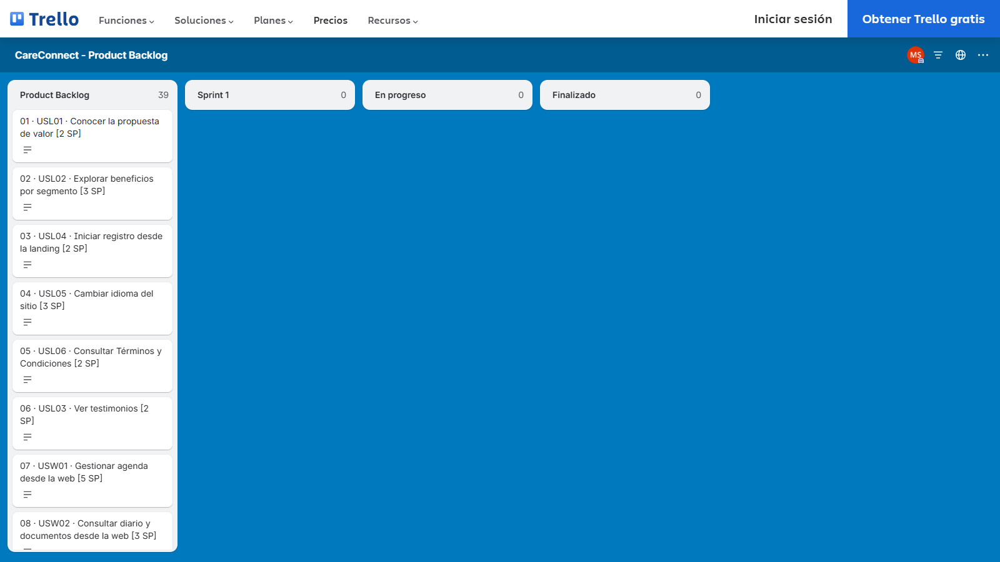


### 3.4. Impact Mapping
El Impact Mapping representa la relación entre las tres metas SMART de CareConnect, los actores que influyen en ellas, los cambios de comportamiento esperados y los entregables que los habilitan. La versión actual incorpora las experiencias móvil, web y Landing Page.

El Impact Map permite visualizar cómo las funcionalidades clave de la aplicación se alinean con los objetivos de negocio, considerando a los actores involucrados y los impactos esperados en su comportamiento.


**Business Goals (SMART)**
- **BG1:** Alcanzar 500 cuidadores activos que registren al menos 3 eventos de salud por semana en los primeros 6 meses post-lanzamiento.
- **BG2:** Lograr una tasa de confirmación de eventos de medicación del 70% por parte de los pacientes en los primeros 3 meses.
- **BG3:** Conseguir que el 60% de los pacientes comparta su perfil con al menos un cuidador durante el primer trimestre.

| Business Goal | Actor / Persona | Impact | Deliverable | User Stories |
|---------------|-----------------|--------|-------------|--------------|
| BG1 | Visitante (cuidador potencial) | Comprende el valor de la solución e inicia su registro | Landing Page con beneficios por segmento y llamado a la acción | USL01, USL02, USL04 |
| BG1 | Cuidador (Valeria Huamán) | Registra y coordina los eventos de salud de forma regular | Agenda multiplataforma con registro y reprogramación de eventos | US01, US03, USW01 |
| BG1 | Cuidador (Valeria Huamán) | Actúa a tiempo ante incumplimientos | Centro de notificaciones y alertas de incumplimiento | US05, US06, USW03 |
| BG2 | Paciente (Rafael Medina) | Confirma su medicación al recibir el recordatorio | Recordatorios y confirmación simple de eventos | US02, US04 |
| BG3 | Paciente (Rafael Medina) | Comparte su perfil con un familiar o cuidador | Gestión de consentimiento para compartir y revocar accesos | US14, US16 |
| BG3 | Cuidador (Valeria Huamán) | Consulta el perfil, los documentos y el diario compartidos | Vistas compartidas en la aplicación móvil y web | US13, US15, USW02 |
<!-- ===== FIN CAPÍTULO ASIGNADO ===== -->

## Capítulo IV: Product Design

### 4.1. Style Guidelines

#### 4.1.1. General Style Guidelines

CareConnect busca un tono que transmita **calidez humana, confianza y claridad**, propio de un producto que media el cuidado de personas mayores o dependientes entre pacientes, cuidadores (familiares o profesionales) y personal médico. La comunicación evita la frialdad clínica de un software hospitalario tradicional y prioriza beneficios emocionales antes que técnicos: la propia landing page abre con "Organiza el cuidado diario de tus seres queridos" y "una herramienta diseñada para brindar **paz mental** a las familias", no con una lista de funciones.

**Dimensiones de tono**

| Dimensión | Posición de CareConnect | Justificación |
|---|---|---|
| Divertido ↔ Serio | Cercano al polo **Serio** | Se maneja información de salud (medicación, diagnósticos, adherencia a tratamiento); el copy de la landing usa términos como "ansiedad", "incumplimiento" y "urgente" sin suavizarlos, priorizando la seriedad del caso de uso. |
| Formal ↔ Casual | Punto medio, ligeramente **Casual** | Los saludos personalizados ("Hola, Mariana", "Buenos días") y CTAs cortos ("Comienza ahora") son casuales, pero los formularios (Crear cuenta, Compartir perfil) mantienen etiquetas formales en mayúsculas. |
| Respetuoso ↔ Irreverente | Totalmente **Respetuoso** | Ningún microcopy usa humor; incluso los estados negativos se comunican con vocabulario neutro y accionable ("Omisión de medicación", "Resolver"), nunca alarmista sin salida. |
| Entusiasta ↔ Sereno | Cercano al polo **Sereno** | Paleta suave, tipografía redondeada y mensajes como "Podrás revocar este acceso en cualquier momento" transmiten control y calma frente a una tarea que de por sí genera estrés (cuidar a un familiar). |

**Branding**

El wordmark "Care Connect" se presenta partido en dos líneas con un ícono de conexión (barra vertical + curva) a la izquierda, en el color violeta/índigo institucional. La marca se sostiene en fotografía real de vínculo intergeneracional (abuela y cuidadora abrazadas) tanto en la landing como en la pantalla de bienvenida de la app, reforzando "cuidado que se siente como en casa" por sobre la estética de dashboard médico.

**Typography**

Se identifica una única familia **sans-serif geométrica/redondeada**, con pesos diferenciados por jerarquía (no dos familias como se estimó preliminarmente): peso *bold/extrabold* para titulares y wordmark, peso *regular/medium* para cuerpo de texto, y una variante en mayúsculas con tracking amplio para labels de formulario ("CORREO DEL CUIDADOR", "PERMISOS DE ACCESO"). Jerarquía observada: H1 ~40px (hero de landing), H2 ~28px ("Funciones principales", "Cómo funciona"), H3 ~18–20px (nombre de card/paciente), cuerpo 15–16px, caption/label 11–12px.

**Colors**

| Color | Uso |
|---|---|
| Violeta/Índigo primario (~#6C5CE7) | CTA principal en landing ("Probar app", "Comienza ahora") y en app ("Confirmar toma", "Compartir perfil", "Subir documento"), ícono activo del bottom nav, borde de badge "Cuidador". |
| Navy/Índigo oscuro (~#1E1B4B) | Titulares de landing, wordmark, texto de alto contraste. |
| Negro/Carbón (~#1A1A1A) | Botón "Elegir plan" del Plan Anual y badge "AHORRA MÁS", usado como acento de contraste para el plan destacado, diferenciándolo del violeta usado en el resto del producto. |
| Crema/Arena (~#FDF6EC) | Fondo general de la app (Inicio, Perfil, Documentos, Diario) y de la card "Bienestar hoy" en el hero de landing. |
| Verde salvia / menta (badge "Paciente", card "Bienestar hoy") | Estados positivos y el rol Paciente. |
| Lavanda claro (card "Acceso compartido" en Funciones principales) | Resalta la función diferencial del producto (compartir cuidado) sobre el resto de tarjetas en blanco. |
| Naranja (badge "PENDIENTE", "Evento no confirmado") | Alertas de atención media. |
| Rojo (badge "URGENTE", "Alerta de incumplimiento") | Estados críticos que requieren acción inmediata. |
| Gris/blanco | Badge "LEÍDO", texto secundario, bordes y campos de formulario. |

**Spacing**

Unidad base de 8px. Las tarjetas de landing y de app comparten el mismo radio de borde amplio (16–24px), y los botones usan radio total tipo *pill*. En la landing, las secciones se separan por bandas de fondo alterno (blanco / crema) en vez de líneas divisorias, patrón que se replica en la app entre el header y el contenido scrolleable.

#### 4.1.2. Web Style Guidelines

La landing page de CareConnect ya está en producción como sitio web responsivo y define el estándar a extender a un eventual panel de escritorio para cuidadores profesionales:

- **Header fijo (sticky)**: logo a la izquierda, navegación central (Inicio, Funciones, Beneficios, Precio, Contacto) y CTA violeta "Probar app" a la derecha, visible en todo momento durante el scroll.
- **Grid**: hero en dos columnas (contenido + mockup de teléfono) en desktop, que colapsa a una columna en mobile; las secciones de beneficios y funciones usan grillas de 3 y de 2–3 columnas respectivamente, con gutter generoso.
- **Componentes**: `Card` para beneficios/funciones/planes, `Badge` para "AHORRA MÁS", `Button` primario (violeta, relleno) y secundario (violeta, outline) — mismo componente reutilizado en toda la web y coherente con los botones de la app.
- **Breakpoints**: mobile (<768px, una columna, nav colapsado a menú hamburguesa), tablet (768–1024px), desktop (>1024px, layout de dos columnas en el hero tal como está implementado).
- **Interacción**: transiciones suaves (~200ms) en hover de botones y tarjetas; el mockup del teléfono en el hero refuerza visualmente el producto real sin necesidad de video o animación compleja.

#### 4.1.3. Mobile Style Guidelines

##### 4.1.3.1. iOS Mobile Style Guidelines

- Tipografía del sistema **SF Pro** para elementos nativos (notificaciones push, teclado, `UIDatePicker`), reservando la tipografía de marca para textos propios de la app.
- Respeto de **Safe Area** superior (notch/Dynamic Island): el header "CareConnect" con ícono de escudo/seguridad y campana de notificaciones se ubica debajo del área segura, como se ve en la pantalla de bienvenida implementada.
- Bottom Tab Bar nativo con 5 ítems (Inicio, Agenda, Documentos, Diario, Perfil), ícono e label activos en violeta.
- Selector de fecha (`Fecha del documento` en Subir documento) debe usar el `UIDatePicker` nativo tipo rueda, más apto para usuarios mayores que un teclado numérico libre.

##### 4.1.3.2. Android Mobile Style Guidelines

- Alineado a **Material Design 3**, tipografía Roboto para componentes nativos, manteniendo la tipografía de marca en headers custom.
- **Ripple effect** en botones primarios ("Confirmar toma", "Compartir perfil", "Subir documento") para reforzar feedback táctil.
- Bottom Navigation Bar de Material con indicador tipo "pill" violeta detrás del ítem activo.
- `Snackbar` para confirmaciones no críticas (ej. "Documento subido") y `AlertDialog` reservado para acciones sensibles como revocar el acceso de un cuidador.

### 4.2. Information Architecture

#### 4.2.1. Organization Systems

La arquitectura se organiza en tres capas:

1. **Por rol** (definido en el registro: Paciente o Cuidador), que determina el copy y alcance de cada módulo — ej. Documentos dice "Gestiona y revisa el historial médico de forma segura" para el paciente y "Archivos compartidos de Elena García para su seguimiento médico" para el cuidador.
2. **Por paciente vinculado**: un cuidador puede tener varios "Pacientes asignados"; el dashboard del cuidador lista cada paciente con su estado ("Activo") y permite entrar a su ficha completa (nombre, condición clínica, movilidad, plan emocional y preferencias).
3. **Por permiso granular**: el flujo "Compartir perfil" introduce un sistema de permisos explícito por módulo (Agenda, Documentos, Diario), de forma que el paciente decide **qué** puede ver cada cuidador, no solo **quién** tiene acceso.

#### 4.2.2. Labeling Systems

| Etiqueta | Contenido que representa |
|---|---|
| Inicio | Dashboard con resumen del paciente/pacientes: medicación pendiente, resumen del día. |
| Agenda | Calendario de medicación, terapias y citas médicas del día/mes. |
| Documentos | Historial médico digitalizado (recetas, laboratorios, informes, carnet de vacunación). |
| Diario | Registro del bienestar diario: síntomas, ánimo, alimentación, presión, glucosa. |
| Perfil | Datos de cuenta, rol, verificación y gestión de accesos. |
| Confirmar toma | Registrar que una dosis de medicación fue administrada. |
| Compartir perfil | Invitar a un cuidador por correo y otorgarle permisos específicos. |
| Gestionar accesos | Ver y revocar los permisos otorgados a cuidadores. |
| Pacientes asignados / vinculados | Listado de pacientes bajo cuidado de un cuidador. |
| Resumen del día / de tareas | Contadores de eventos pendientes, confirmados/completados e incumplidos/omitidos. |
| Notificaciones | Centro de alertas: eventos no confirmados, incumplimientos, documentos actualizados, recordatorios. |

#### 4.2.3. SEO Tags and Meta Tags

**Landing Page**

| Tag | Valor |
|---|---|
| Title | CareConnect — Organiza el cuidado diario de tus seres queridos |
| Description | Gestiona tratamientos, citas y recordatorios en un solo lugar. CareConnect brinda paz mental a las familias y el mejor cuidado para los mayores. |
| Keywords | cuidado de adultos mayores, app de cuidadores, agenda de medicación, historial médico digital, diario de bienestar, acceso compartido, cuidado geriátrico. |
| Author | Equipo CareConnect |

**Web / Mobile Application**

| Tag | Valor |
|---|---|
| Title | CareConnect App — Panel de Cuidado y Seguimiento |
| Description | Agenda de medicación, documentos médicos, diario de bienestar y acceso compartido para pacientes y cuidadores. |
| Keywords | agenda de medicación, historial clínico, diario del paciente, cuidador familiar, permisos de acceso, notificaciones de salud. |
| Author | Equipo CareConnect |

#### 4.2.4. Searching Systems

- **Documentos**: barra "Buscar documentos…" que filtra por nombre, tipo (Receta, Laboratorio, Informe, Vacuna, PDF, Digital, Imagen, DOCX) y sección (Recientes / Historial anual), cada resultado con badge de tipo codificado por color.
- **Agenda**: navegación por calendario (mes/día) con selector "◀ Octubre 2023 ▶", en vez de buscador de texto libre, dado que el usuario busca por fecha, no por palabra clave.
- **Notificaciones**: no hay buscador; se resuelve por orden cronológico inverso y por badges de estado (Pendiente, Urgente, Leído) que permiten escanear prioridad visualmente.

#### 4.2.5. Navigation Systems

- **Bottom Nav persistente** (Inicio, Agenda, Documentos, Diario, Perfil) idéntico en estructura para Paciente y Cuidador, con ítem activo resaltado en violeta.
- **Navegación de flujo con retorno explícito** ("←") en tareas puntuales: Subir documento, Compartir perfil, Notificaciones — todas permiten volver sin perder el contexto de origen.
- **Accesos rápidos contextuales**: el dashboard del cuidador incluye botones directos "Revisar agenda", "Ver documentos", "Ver diario" **del paciente actualmente enfocado**, evitando pasar por el bottom nav para tareas de seguimiento inmediato.
- **Navegación cruzada Paciente ↔ Cuidador**: desde el Perfil del paciente, "Compartir perfil" abre el flujo que —del lado del cuidador— se traduce en un nuevo "Paciente vinculado" visible en su propio dashboard y Perfil.

### 4.3. Landing Page UI Design

#### 4.3.1. Landing Page Wireframe

La estructura de la landing sigue una jerarquía descendente clásica de conversión:

1. **Header** fijo: logo, navegación (Inicio, Funciones, Beneficios, Precio, Contacto), CTA "Probar app".
2. **Hero**: titular + subtítulo + doble CTA ("Comienza ahora" / "Ver funciones") + mockup del dashboard real de la app.
3. **Beneficios** ("Pensado para pacientes, cuidadores y familias"): 3 columnas con ícono, título y descripción.
4. **Proceso** ("Cómo funciona"): 3 pasos numerados.
5. **Funciones principales**: grilla de 5 tarjetas (una destacada — Acceso compartido).
6. **Planes** ("Planes simples para tu cuidado diario"): 2 tarjetas de precio comparadas.

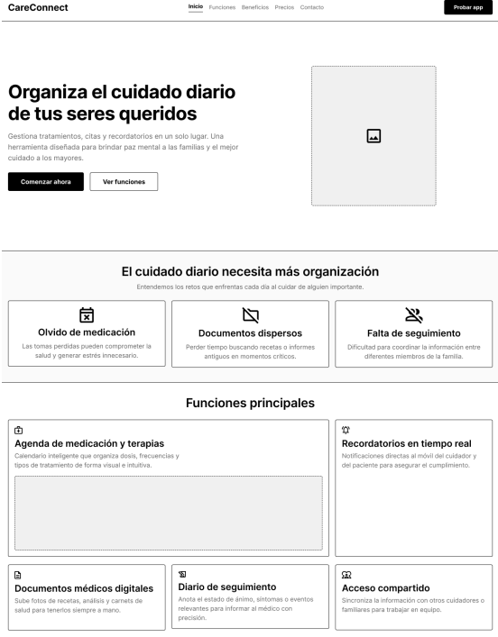
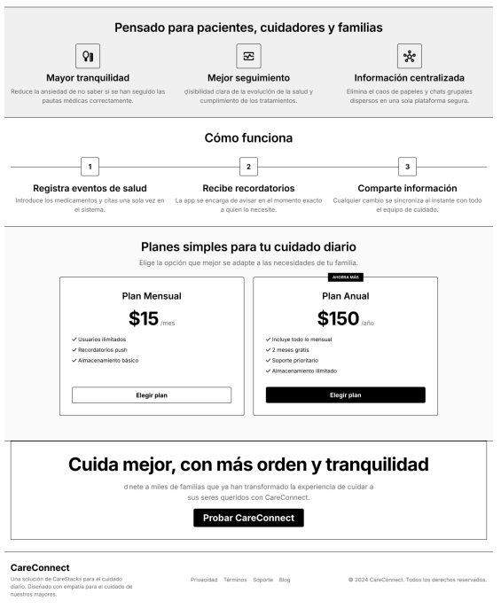

#### 4.3.2. Landing Page Mock-up

**Elementos del Diseño**

| Elemento | Justificación |
|---|---|
| Colour | El violeta se reserva para toda acción de conversión (Probar app, Comienza ahora, Elegir plan del plan mensual, Ver funciones), mientras que el negro/carbón se usa exclusivamente en el "Plan Anual" y su badge "AHORRA MÁS", generando un contraste deliberado que dirige la mirada hacia el plan que la empresa quiere vender más. La tarjeta "Acceso compartido" usa fondo lavanda en lugar de blanco, destacándola visualmente sobre las otras cuatro funciones sin necesidad de texto adicional ("función diferencial"). |
| Shape | Las tarjetas de beneficios, funciones y planes comparten el mismo radio de borde amplio que las tarjetas dentro de la app (Inicio, Documentos, Diario), generando continuidad formal entre el sitio público y el producto. Los pasos de "Cómo funciona" usan círculos numerados en vez de íconos, priorizando la secuencia sobre la ilustración. |
| Size | El titular del hero es el elemento tipográfico más grande de toda la landing, seguido de los títulos de sección ("Funciones principales", "Cómo funciona") y por último el cuerpo de cada tarjeta. Los precios ("$15", "$150") son notablemente más grandes que el resto del texto de su tarjeta, priorizando el dato de decisión de compra. |
| Space | Cada sección de la landing está delimitada por espacio vertical amplio y no por líneas, replicando el patrón "banda de color alterno" (blanco / crema) para separar bloques sin saturar. |
| Direction | El flujo es estrictamente vertical y de conversión creciente: hero (propuesta de valor) → beneficios (por qué importa) → cómo funciona (cómo se usa) → funciones (qué incluye) → planes (cuánto cuesta), acompañando el recorrido natural de decisión de un usuario que evalúa contratar el servicio para su familia. |
| Texture | El mockup del teléfono en el hero muestra la app real en uso (no una ilustración genérica), funcionando como prueba social implícita de que el producto ya existe y funciona. |

**Heurísticas de Usabilidad (Jakob Nielsen)**

| Heurística | Justificación |
|---|---|
| H1 – Visibilidad del estado del sistema | El mockup del hero muestra el estado real de la app (medicación "PENDIENTE", resumen "4 / 12 / 0"), comunicando al visitante qué va a ver exactamente al instalar la app, sin necesidad de descripciones abstractas. |
| H2 – Relación sistema/mundo real | El copy usa vocabulario familiar del cuidado cotidiano ("ansiedad de no saber si se han seguido las pautas", "caos de papeles y chats grupales") en vez de terminología de producto SaaS, conectando directamente con el dolor real del usuario objetivo (familias cuidadoras). |
| H4 – Consistencia y estándares | El botón "Probar app" del header y "Comienza ahora" del hero usan el mismo estilo violeta relleno, mientras "Ver funciones" usa el mismo violeta en outline, estableciendo desde el primer vistazo qué botón es la acción primaria y cuál la secundaria en toda la página. |
| H6 – Reconocer antes que recordar | Las dos tarjetas de precio muestran sus features completas en la misma vista (sin acordeones ni "ver más"), permitiendo comparar Plan Mensual vs. Plan Anual sin necesidad de recordar los datos de una al leer la otra. |
| H8 – Diseño estético y minimalista | Cada sección limita su contenido a lo esencial: 3 beneficios, 3 pasos, 5 funciones, 2 planes — números redondos y escaneables que evitan la fatiga de decisión en una landing dirigida también a usuarios mayores o poco digitales. |

**Principios de Arquitectura de Información**

| Principio | Justificación |
|---|---|
| Choices | La sección de planes ofrece exactamente dos alternativas comparables (Mensual vs. Anual), con el ahorro anual explícito ("2 meses gratis"), simplificando la decisión de compra a un solo criterio dominante (compromiso corto vs. ahorro). |
| Disclosure | La landing revela información en capas: el hero comunica el beneficio central en una frase, "Funciones principales" detalla el qué, y el precio se posterga hasta el final, cuando el usuario ya entendió el valor — evitando anclar la conversación en el costo antes que en el beneficio. |
| Exemplars | El mockup del hero usa un caso concreto y humano ("Hola, Mariana", Losartán 50mg, 8:00 a.m.) en lugar de datos genéricos tipo "Usuario X", haciendo tangible el producto desde el primer segundo. |

**Principios de Inclusive Design**

| Principio | Justificación |
|---|---|
| P2 – Considera la situación del usuario | El público de la landing incluye adultos mayores y familiares con distinta alfabetización digital; el copy evita jerga técnica y los CTAs son cortos y directos ("Comienza ahora"), reduciendo la carga cognitiva de la primera visita. |
| P6 – Prioriza el contenido | La tarjeta "Acceso compartido" se destaca cromáticamente sobre el resto de funciones porque es el diferenciador competitivo real del producto (coordinación entre múltiples cuidadores), priorizándola sin necesidad de agrandar su tamaño. |
| P7 – Agrega valor | Mostrar el resumen del día (pendientes/confirmados/incumplidos) directamente en el hero, antes de que el usuario cree una cuenta, agrega valor al anticipar el tipo de control y tranquilidad que tendrá una vez dentro del producto. |

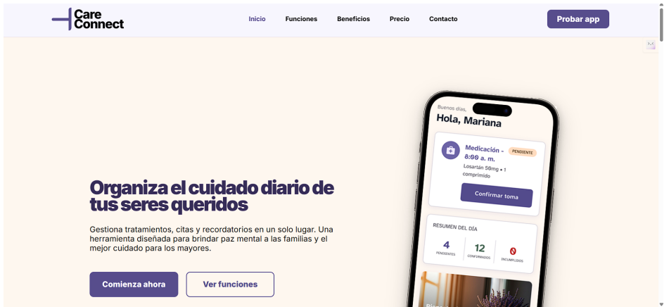
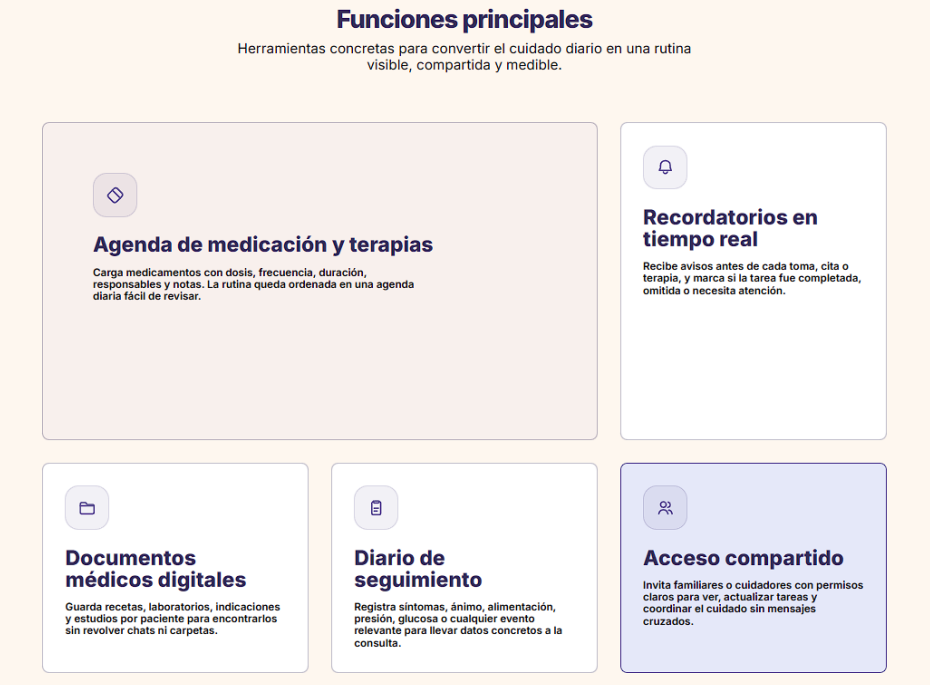

### 4.4. Mobile Applications UX/UI Design

#### 4.4.1. Mobile Applications Wireframes

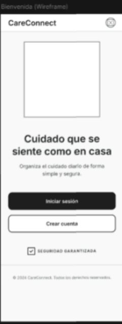

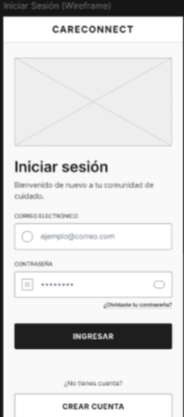

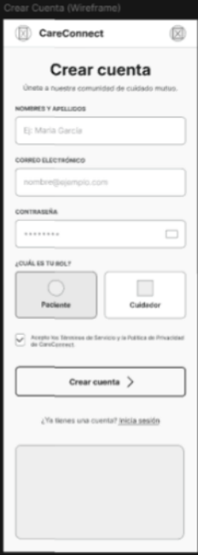

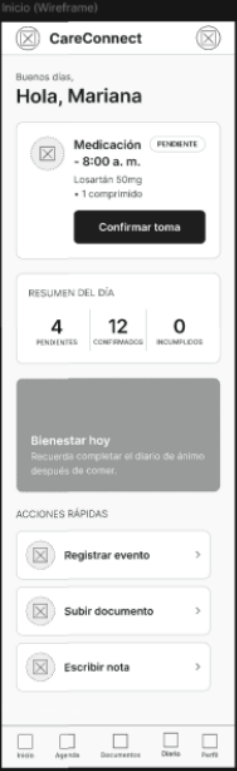

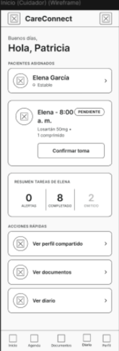

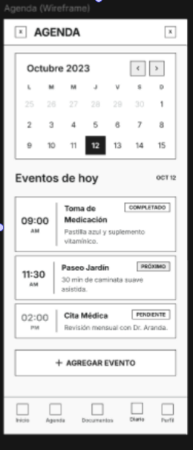

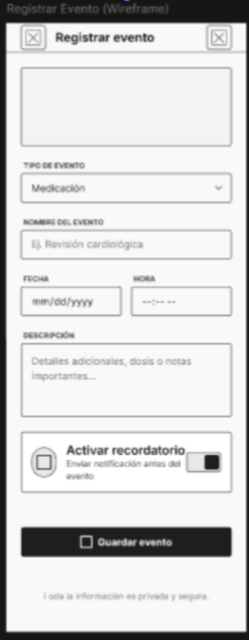

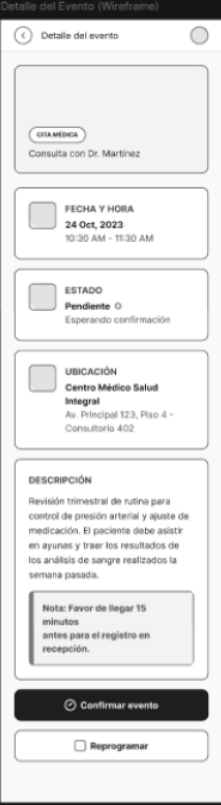

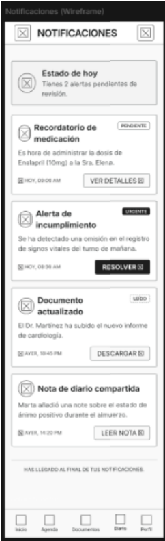

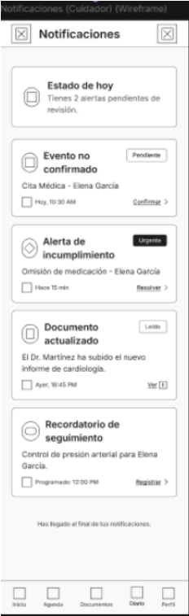


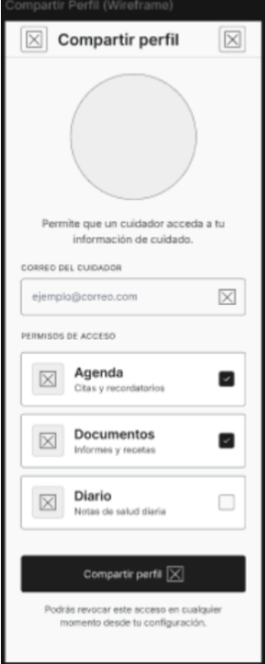

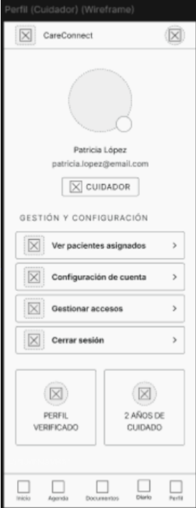

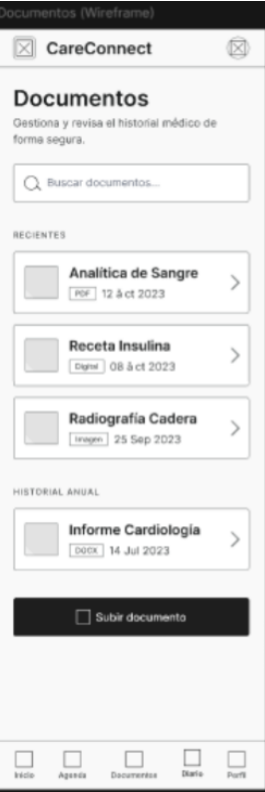

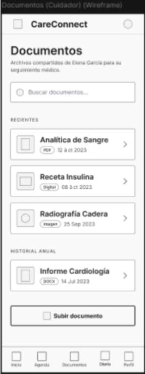

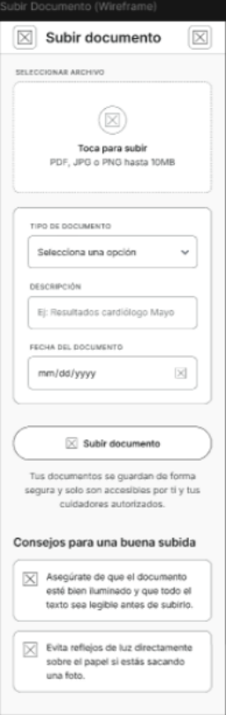

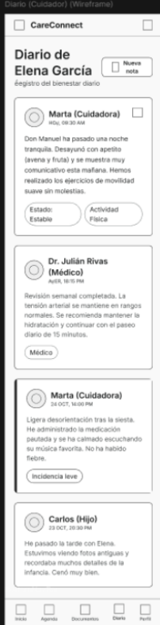

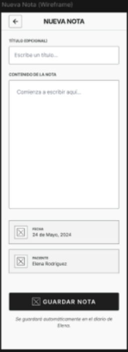

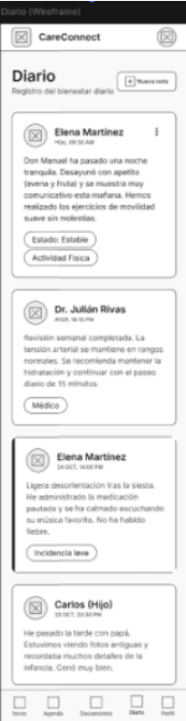


**Elementos del Diseño**

| Elemento | Justificación |
|---|---|
| Shape | Ya desde el wireframe, las tarjetas de tarea (medicación, cita, paseo) y de paciente usan rectángulos de esquinas redondeadas, mientras que los avatares de paciente son placeholders circulares, estableciendo la distinción forma-persona vs. forma-contenido desde la etapa de baja fidelidad. |
| Size | En "Inicio (Cuidador)" el saludo "Hola, Patricia" y el nombre del paciente "Elena García" son los elementos de mayor jerarquía tipográfica de la pantalla, por encima de los datos de la tarea (Losartán 50mg), priorizando el reconocimiento de personas sobre el detalle clínico en el primer vistazo. |
| Space | En Agenda, el espacio entre eventos del día (Toma de Medicación, Paseo Jardín, Cita Médica) es uniforme y suficiente para lectura rápida con el pulgar, consistente con el contexto de uso mientras se atiende a un paciente. |
| Direction | El wireframe de Agenda ordena los eventos del día de forma cronológica ascendente (09:00 → 11:30 → 02:00 PM), replicando el orden natural en que ocurrirán, y coloca "+ Agregar evento" al final del flujo de lectura, no al inicio, para no interrumpir el repaso del día. |
| Line | Los únicos bordes explícitos del wireframe son los del calendario (Agenda) y los campos de formulario (Crear cuenta, Iniciar sesión); el resto de la separación entre secciones se resuelve por espacio, validando que la jerarquía funciona incluso sin color. |

**Heurísticas de Usabilidad (Jakob Nielsen)**

| Heurística | Justificación |
|---|---|
| H1 – Visibilidad del estado del sistema | Cada evento de Agenda muestra su badge de estado (COMPLETADO, PRÓXIMO, PENDIENTE) directamente en la fila, sin necesidad de abrir el detalle, ya desde el wireframe de baja fidelidad. |
| H3 – Libertad y control del usuario | El wireframe de "Compartir Perfil" incluye una "✕" de cierre además del posible retorno, dando al usuario dos formas de abandonar el flujo de invitar a un cuidador sin completar la acción. |
| H4 – Consistencia y estándares | El bottom nav de 5 ítems (Inicio, Agenda, Documentos, Diario, Perfil) aparece idéntico en wireframe tanto para "Inicio (Cuidador)" como en Agenda, confirmando que la estructura de navegación se definió antes que el estilo visual. |
| H5 – Prevención de errores | En Crear Cuenta (wireframe), la selección de rol usa botones exclusivos tipo radio (Paciente / Cuidador) en vez de checkboxes, evitando que el sistema reciba una combinación de roles inválida. |
| H6 – Reconocer antes que recordar | El wireframe de "Compartir Perfil" ya contempla, antes del alto nivel de fidelidad, una lista explícita de permisos por módulo (Agenda, Documentos, Diario) visibles simultáneamente, evitando que el paciente deba recordar qué otorgó al cuidador en una pantalla previa. |

**Principios de Arquitectura de Información**

| Principio | Justificación |
|---|---|
| Objects | Desde el wireframe, cada evento de Agenda se define como un objeto con atributos propios (hora, título, descripción, estado), anticipando la estructura de datos que luego alimentará también las Notificaciones (mismo tipo de evento, distinto canal de visualización). |
| Choices | El wireframe de "Perfil" ofrece explícitamente dos variantes según rol —Perfil (Paciente) con "Gestionar accesos" y Perfil (Cuidador) con "Ver pacientes asignados"— validando la ramificación de la arquitectura por rol antes de invertir en diseño visual. |
| Front doors | Los tres wireframes de Perfil/Compartir Perfil/Perfil (Cuidador) están diseñados para ser autosuficientes: cada uno repite el header con logo y controles de cierre, de modo que un usuario que entra directo a "Compartir Perfil" desde una notificación entiende igual el contexto. |

**Principios de Inclusive Design**

| Principio | Justificación |
|---|---|
| P3 – Sé consistente | El patrón "avatar + nombre + badge de estado" se repite idéntico entre el wireframe de paciente en Inicio (Cuidador) y el de evento en Agenda, reduciendo la curva de aprendizaje entre módulos desde la etapa de boceto. |
| P5 – Ofrece opciones | El wireframe de Iniciar Sesión contempla tanto el ingreso por correo/contraseña como el enlace "¿Olvidaste tu contraseña?", cubriendo desde baja fidelidad el caso de usuario recurrente que no logra autenticarse. |

#### 4.4.2. Mobile Applications Wireflow Diagrams

La aplicación móvil cubre siete *user goals*, cada uno documentado con su propio wireflow.

##### User Goal 1: Registro y selección de rol

<!-- Insertar wireflow del User Goal 1 -->

Bienvenida → Crear cuenta (datos + rol Paciente/Cuidador + aceptación de términos) → Inicio según rol.

##### User Goal 2: Inicio de sesión

<!-- Insertar wireflow del User Goal 2 -->

Bienvenida → Iniciar sesión (correo/contraseña) → [¿Credenciales válidas?] → Sí: Inicio / No: error + "¿Olvidaste tu contraseña?".

##### User Goal 3: Confirmar toma de medicación (Cuidador)

<!-- Insertar wireflow del User Goal 3 -->

Inicio (Cuidador) → tarjeta "Elena – 8:00 a.m. PENDIENTE" → "Confirmar toma" → resumen de tareas se actualiza (COMPLETADO +1) sin salir del dashboard.

##### User Goal 4: Compartir el perfil con un nuevo cuidador (Paciente)

<!-- Insertar wireflow del User Goal 4 -->

Perfil (Paciente) → "Gestionar accesos"/"Compartir perfil" → ingresar correo del cuidador → seleccionar permisos (Agenda/Documentos/Diario) → "Compartir perfil" → confirmación → el paciente aparece como "Paciente vinculado" en el Perfil del cuidador invitado.

##### User Goal 5: Revisar y resolver notificaciones (Cuidador)

<!-- Insertar wireflow del User Goal 5 -->

Inicio (Cuidador) → ícono de campana → Notificaciones → [tipo de alerta] → Evento no confirmado: "Confirmar" / Alerta de incumplimiento: "Resolver" / Documento actualizado: "Ver" → retorno a Notificaciones con el ítem actualizado.

##### User Goal 6: Registrar un evento en Agenda

<!-- Insertar wireflow del User Goal 6 -->

Agenda → "+ Agregar evento" → completar tipo, hora y detalle → guardar → el evento aparece en "Eventos de hoy" en su posición cronológica correspondiente.

##### User Goal 7: Subir un documento médico

<!-- Insertar wireflow del User Goal 7 -->

Documentos → "Subir documento" → seleccionar archivo → tipo/descripción/fecha → "Subir documento" → documento visible en "Recientes".

#### 4.4.3. Mobile Applications Mock-ups

**Elementos del Diseño**

| Elemento | Justificación |
|---|---|
| Colour | El violeta como color de acción única se mantiene disciplinadamente en toda la app de alta fidelidad: "Confirmar toma", "Compartir perfil", "Subir documento" comparten el mismo tono exacto, enseñando al usuario a reconocer la acción principal en cualquier pantalla sin ambigüedad. Los badges de rol usan color semántico propio: verde para "Paciente", violeta/azulado para "Cuidador", distinguiendo identidad de estado. |
| Shape | En "Compartir perfil", la ilustración circular de manos entrelazadas (en violeta) humaniza una pantalla técnica de permisos, coherente con el tono cálido definido en 4.1.1, y contrasta con los checkboxes cuadrados de permisos, diferenciando "emoción" de "configuración" dentro de la misma pantalla. |
| Size | En Documentos, el tipo de archivo (PDF, Digital, Imagen, DOCX) se muestra como badge pequeño bajo el nombre del documento, mientras que el nombre del documento es el elemento de mayor tamaño de cada fila, priorizando qué es el documento sobre en qué formato está. |
| Texture | El ícono de escudo junto a la hora en el header de la app implementada (pantalla de Bienvenida) comunica seguridad de forma persistente y sutil, sin necesidad de un texto explicativo adicional. |

**Heurísticas de Usabilidad (Jakob Nielsen)**

| Heurística | Justificación |
|---|---|
| H1 – Visibilidad del estado del sistema | En Compartir perfil, los checkboxes de "Agenda" y "Documentos" aparecen premarcados mientras "Diario" no, comunicando una configuración de permisos sugerida por defecto (información operativa sí, notas íntimas de bienestar no) que el paciente puede ajustar antes de confirmar. |
| H3 – Libertad y control del usuario | El texto "Podrás revocar este acceso en cualquier momento desde tu configuración" en Compartir perfil reduce la fricción emocional de otorgar acceso a datos de salud, al garantizar reversibilidad antes de que el usuario decida compartir. |
| H5 – Prevención de errores | En Subir documento, el límite de archivo ("PDF, JPG o PNG hasta 10MB") y los consejos de captura ("Evita reflejos de luz directamente sobre el papel") se muestran antes de intentar la subida, anticipando los errores más comunes en usuarios que fotografían documentos físicos. |
| H9 – Reconocer y recuperarse de errores | En Notificaciones, cada alerta trae su propia acción de resolución en el mismo ítem ("Confirmar", "Resolver", "Ver", "Registrar"), evitando que el cuidador deba navegar a otro módulo para atender el problema señalado. |

**Principios de Arquitectura de Información**

| Principio | Justificación |
|---|---|
| Multiple classification | Un documento puede localizarse por tipo (Receta, Laboratorio, Informe, Vacuna), por recencia (Recientes) o por período (Historial anual), atendiendo distintos modelos mentales de búsqueda según si el usuario recuerda el nombre, la fecha o la categoría clínica. |
| Growth | El sistema de permisos de Compartir perfil está preparado para escalar a más módulos sin rediseño: cada nuevo módulo de la app (ej. un futuro "Finanzas del cuidado") solo necesitaría sumarse como una fila más de checkbox en la misma pantalla. |

**Principios de Inclusive Design**

| Principio | Justificación |
|---|---|
| P1 – Proporciona experiencias comparables | Perfil (Paciente) y Perfil (Cuidador) comparten exactamente la misma estructura visual (foto, nombre, badge de rol, acciones de cuenta, métricas destacadas), garantizando una experiencia igualmente completa y reconocible para ambos roles. |
| P4 – Deja al usuario mandar | El paciente decide qué comparte (Compartir perfil) y puede revocarlo después (Gestionar accesos); el sistema nunca otorga visibilidad automática de los datos sensibles del Diario a un cuidador sin consentimiento explícito. |

**Aplicación móvil — pantallas implementadas**

**Bienvenida** — *User Goal 1: Registro y selección de rol / User Goal 2: Inicio de sesión*

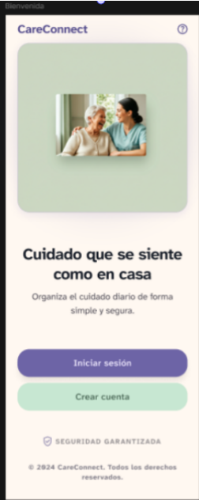

**Iniciar sesión** — *User Goal 2: Inicio de sesión*

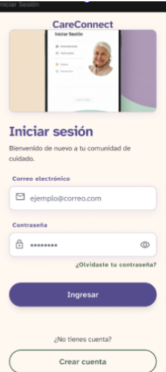

**Crear cuenta** — *User Goal 1: Registro y selección de rol*

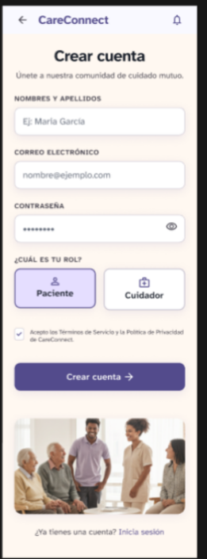

**Inicio (Paciente)** — *User Goal 1: Registro y selección de rol / User Goal 2: Inicio de sesión*

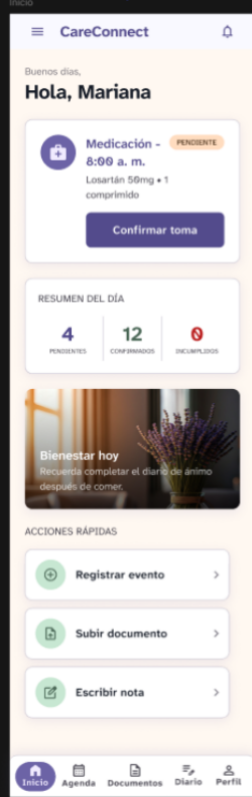

**Inicio (Cuidador)** — *User Goal 3: Confirmar toma de medicación (Cuidador)*

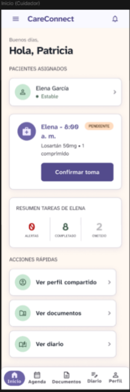

**Agenda** — *User Goal 6: Registrar un evento en Agenda*

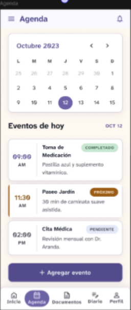

**Registrar evento** — *User Goal 6: Registrar un evento en Agenda*

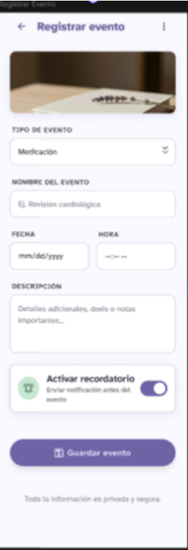

**Detalle del evento** — *Pantalla complementaria de Agenda*

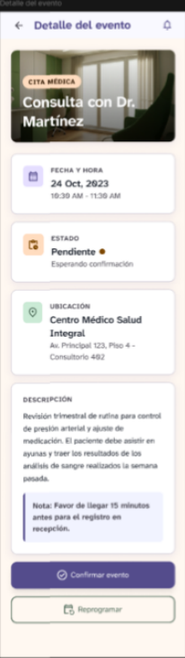

**Notificaciones (Paciente)** — *User Goal 5: Revisar y resolver notificaciones (Cuidador)*

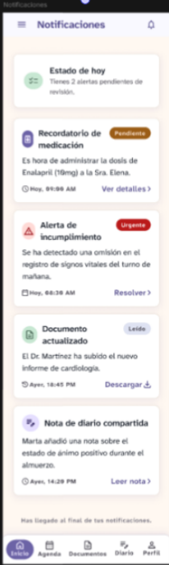

**Notificaciones (Cuidador)** — *User Goal 5: Revisar y resolver notificaciones (Cuidador)*

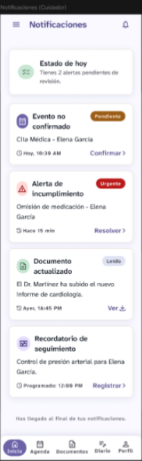

**Perfil (Paciente)** — *User Goal 4: Compartir el perfil con un nuevo cuidador (Paciente)*

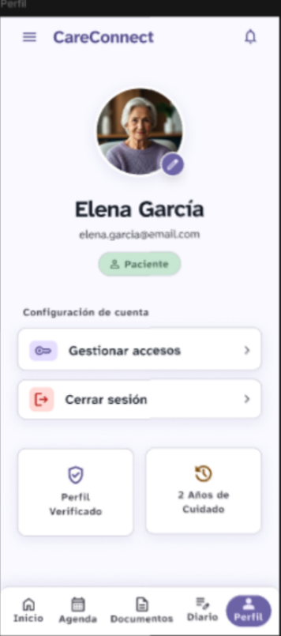

**Compartir perfil** — *User Goal 4: Compartir el perfil con un nuevo cuidador (Paciente)*

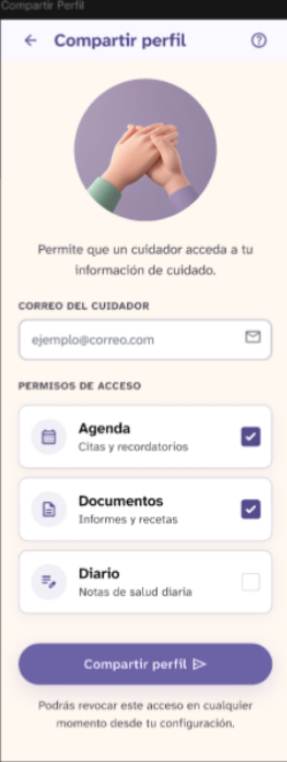

**Perfil (Cuidador)** — *Pantalla complementaria de Perfil*

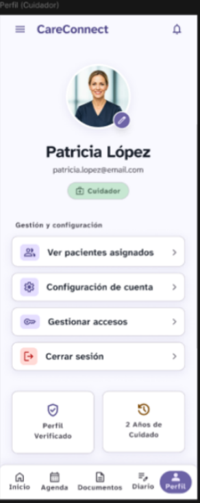

**Documentos (Cuidador)** — *User Goal 7: Subir un documento médico*

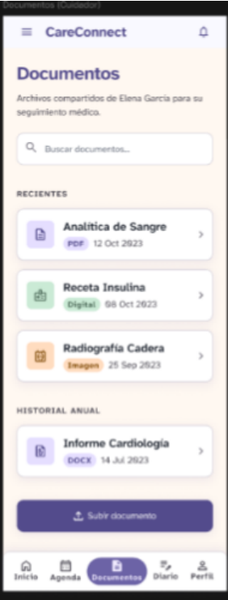

**Documentos (Paciente)** — *User Goal 7: Subir un documento médico*

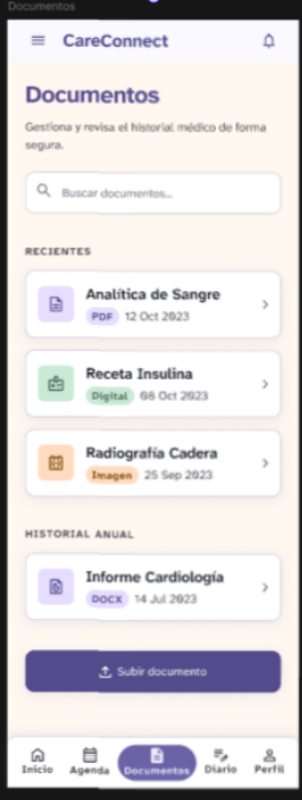

**Subir documento** — *User Goal 7: Subir un documento médico*

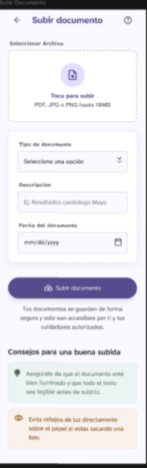

**Diario (Paciente)** — *Pantalla complementaria de Diario*

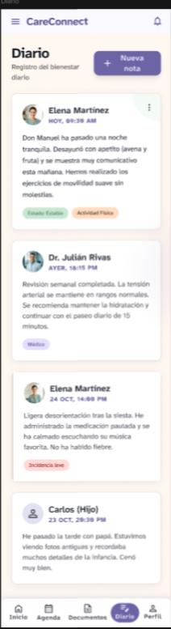

**Nueva nota** — *Pantalla complementaria de Diario*

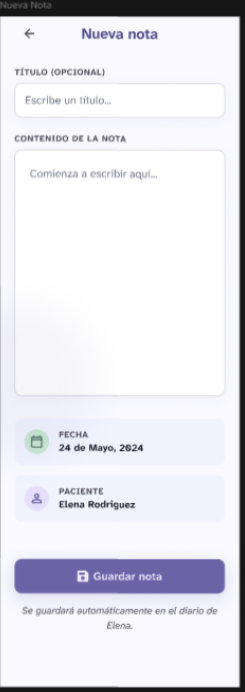

**Diario (Cuidador)** — *Pantalla complementaria de Diario*

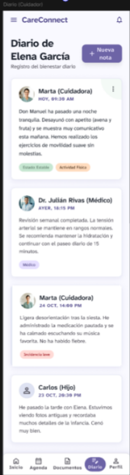

#### 4.4.4. Mobile Applications User Flow Diagrams

Un user flow por objetivo de usuario, contemplando *happy path* y *unhappy path*:

1. **Registrarse en la plataforma**
   - *Happy path*: Bienvenida → Crear cuenta → completar datos → seleccionar rol → aceptar términos → cuenta creada → Inicio.
   - *Unhappy path*: campo obligatorio vacío o términos no aceptados → botón "Crear cuenta" inhabilitado/error inline → usuario corrige → reintenta.

2. **Iniciar sesión**
   - *Happy path*: Iniciar sesión → credenciales correctas → Inicio según rol.
   - *Unhappy path*: credenciales incorrectas → mensaje de error → "¿Olvidaste tu contraseña?" → recuperación → nuevo intento.

3. **Confirmar toma de medicación**
   - *Happy path*: Inicio (Cuidador) → tarea "PENDIENTE" → "Confirmar toma" → contador "COMPLETADOS" se actualiza.
   - *Unhappy path*: el cuidador no confirma en el horario → el sistema reclasifica el evento como "INCUMPLIDO"/"OMITIDO" → se genera una "Alerta de incumplimiento" en Notificaciones para seguimiento.

4. **Compartir el perfil con un cuidador**
   - *Happy path*: Perfil (Paciente) → Compartir perfil → correo del cuidador + permisos seleccionados → "Compartir perfil" → invitación enviada → el cuidador ve al paciente en "Pacientes vinculados".
   - *Unhappy path*: correo inválido o cuidador ya vinculado → el sistema muestra el error en el campo → usuario corrige el correo y reenvía la invitación.

5. **Revisar y resolver una notificación**
   - *Happy path*: campana de notificaciones → alerta "Evento no confirmado" → "Confirmar" → notificación pasa a resuelta.
   - *Unhappy path*: alerta "Urgente" (omisión de medicación) sin resolver a tiempo → permanece visible en "Estado de hoy" hasta que el cuidador ejecuta "Resolver", evitando que se pierda entre notificaciones ya leídas.

6. **Subir un documento médico**
   - *Happy path*: Documentos → Subir documento → archivo válido → tipo/descripción/fecha → "Subir documento" → documento visible en "Recientes".
   - *Unhappy path*: archivo excede 10MB o formato no soportado → el sistema rechaza el archivo mostrando el requisito ("PDF, JPG o PNG hasta 10MB") → usuario selecciona un archivo válido y reintenta.

7. **Registrar un evento en Agenda**
   - *Happy path*: Agenda → "+ Agregar evento" → completar hora, tipo y detalle → guardar → evento visible en "Eventos de hoy" en su horario correspondiente.
   - *Unhappy path*: hora del evento en conflicto con otro ya registrado → el sistema advierte el solapamiento antes de guardar → usuario ajusta el horario y confirma.


### 4.5. Mobile Applications Prototyping

Esta sección documenta el prototipado interactivo de la aplicación móvil de CareStacks. Para cubrir ambos segmentos objetivo (cuidador y paciente) y ambas plataformas nativas, se utilizaron dos bases de código distintas heredadas del proyecto anterior:

- **iOS → segmento Cuidador**, con la aplicación desarrollada en **Flutter**.
- **Android → segmento Paciente**, con la aplicación nativa desarrollada en **Kotlin + Jetpack Compose**.

#### 4.5.1. Android Mobile Applications Prototyping

| Pantalla | Captura |
|---|---|
| Perfil |  |
| Inicio / Bienvenida |  |
| Inicio de sesión |  |
| Registro |  |
| Home (Paciente) |  |
| Agenda |  |
| Agregar evento de agenda |  |
| Diario |  |
| Agregar nota de diario |  |
| Documentos |  |
| Notificaciones |  |
| Gestionar accesos |  |

**Video del prototipo (Android)**

| Captura del video | Enlace |
|:---:|:---:|
| 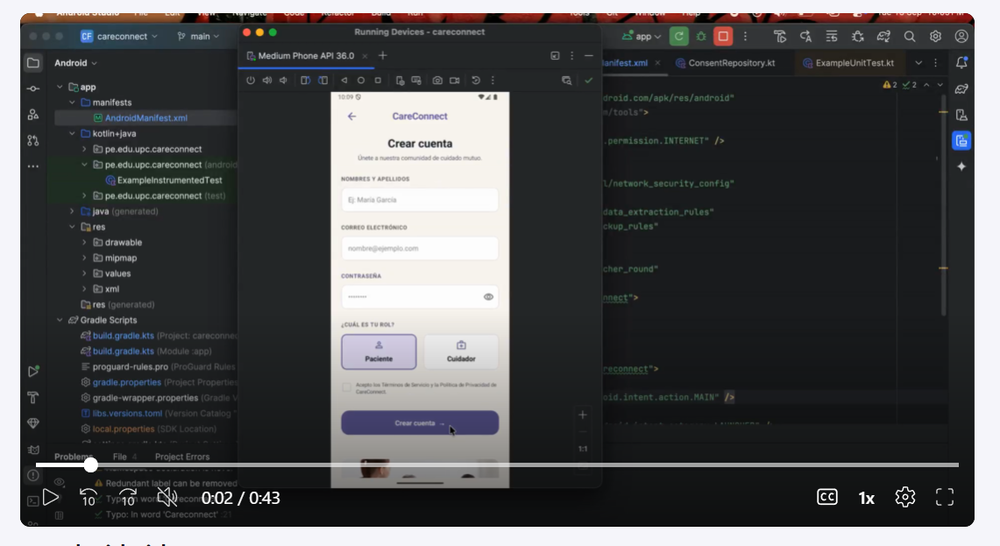 | [Ver video en Microsoft Stream](https://upcedupe-my.sharepoint.com/:v:/g/personal/u202319563_upc_edu_pe/IQCxyxzTeImsTaBVopDNXHyUAdGQYZnmlXXGn62jhU8cayU?nav=eyJyZWZlcnJhbEluZm8iOnsicmVmZXJyYWxBcHAiOiJPbmVEcml2ZUZvckJ1c2luZXNzIiwicmVmZXJyYWxBcHBQbGF0Zm9ybSI6IldlYiIsInJlZmVycmFsTW9kZSI6InZpZXciLCJyZWZlcnJhbFZpZXciOiJNeUZpbGVzTGlua0NvcHkifX0&e=noqJKl) |

#### 4.5.2. iOS Mobile Applications Prototyping

El prototipo fue ejecutado y validado en un simulador de iOS, correspondiente a la aplicación multiplataforma en **Flutter**, enfocada en el segmento **cuidador**: gestión de pacientes asignados, agenda, diario compartido, documentos médicos y notificaciones. Las capturas fueron tomadas con el backend local (CareConnect API) conectado y datos de prueba reales (un paciente vinculado a un cuidador mediante el módulo de Gestión de Consentimiento).

| Pantalla | Captura |
|---|---|
| Perfil |  |
| Inicio de sesión |  |
| Registro |  |
| Home (Cuidador) |  |
| Agenda |  |
| Diario |  |
| Documentos |  |
| Notificaciones |  |

**Video del prototipo (iOS)**

| Captura del video | Enlace |
|:---:|:---:|
| 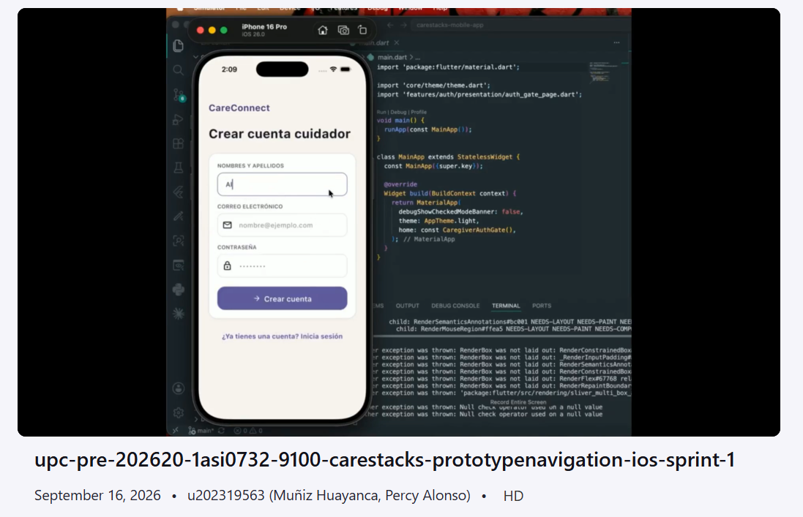 | [Ver video en Microsoft Stream](https://upcedupe-my.sharepoint.com/:v:/g/personal/u202319563_upc_edu_pe/IQD8hwXPwgf_RJSGdsPc4diHAUM7uH7Tff9QItUFv6-Pegw?e=UDYvyk) |

### 4.6. Web Applications UX/UI Design

El diseño de la aplicación web de CareConnect contempla los principales recorridos del cuidador: registro e inicio de sesión, consulta del resumen diario, gestión de agenda, revisión de documentos, registro en el diario, consulta del perfil y visualización de notificaciones.

- [Archivo editable de wireframes, flujos y mock-ups en Figma](https://www.figma.com/design/1TzGaaQLzkBu26Ojno1AVU/CareConnect-%E2%80%94-Web-Applications-UX-UI-Design--4.6-?node-id=4-5&p=f)

#### 4.6.1. Web Applications Wireframes

Los wireframes presentan la estructura de baja fidelidad de las ocho vistas principales. Permiten validar la jerarquía, la navegación, la distribución de contenido y las acciones antes de aplicar el sistema visual definitivo. El conjunto incluye las pantallas de iniciar sesión, crear cuenta, inicio, agenda, documentos, diario, perfil y notificaciones; se encuentra organizado en la página **01 Wireframes** del archivo de Figma.

| Iniciar sesión | Crear cuenta |
|---|---|
| 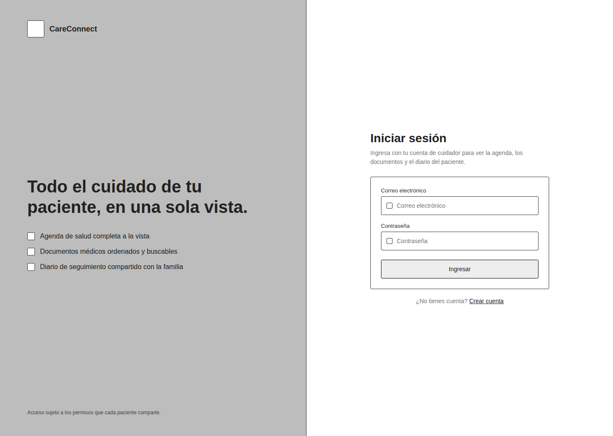 | 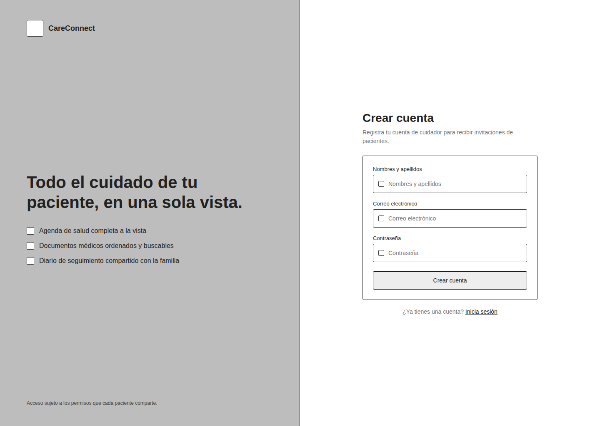 |

| Inicio | Agenda |
|---|---|
| 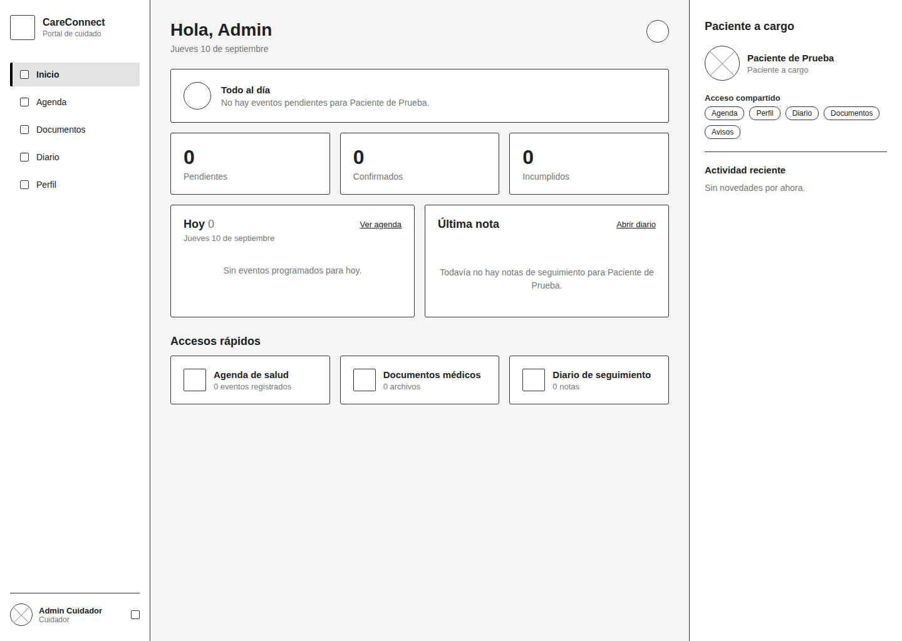 | 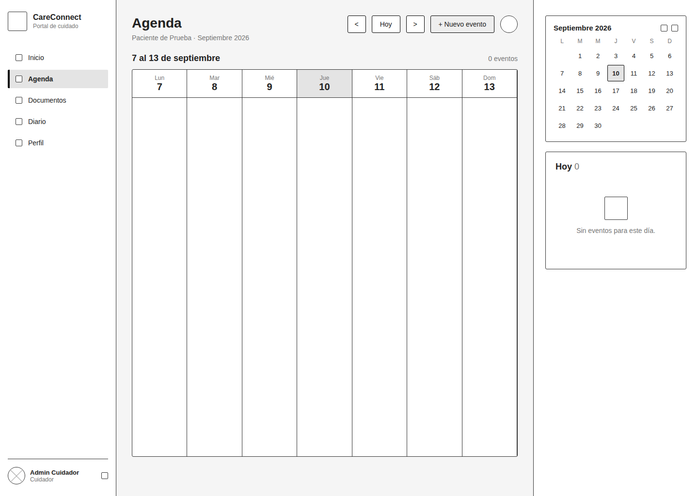 |

| Documentos | Diario |
|---|---|
| 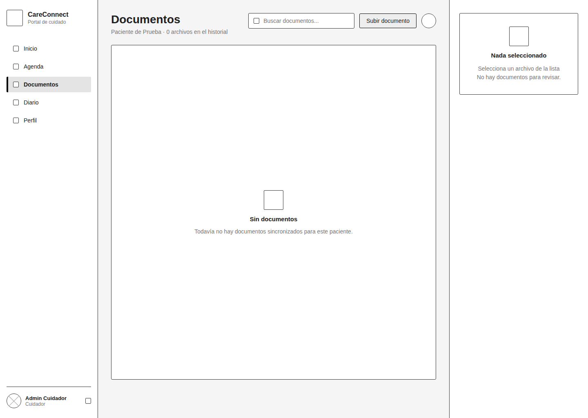 | 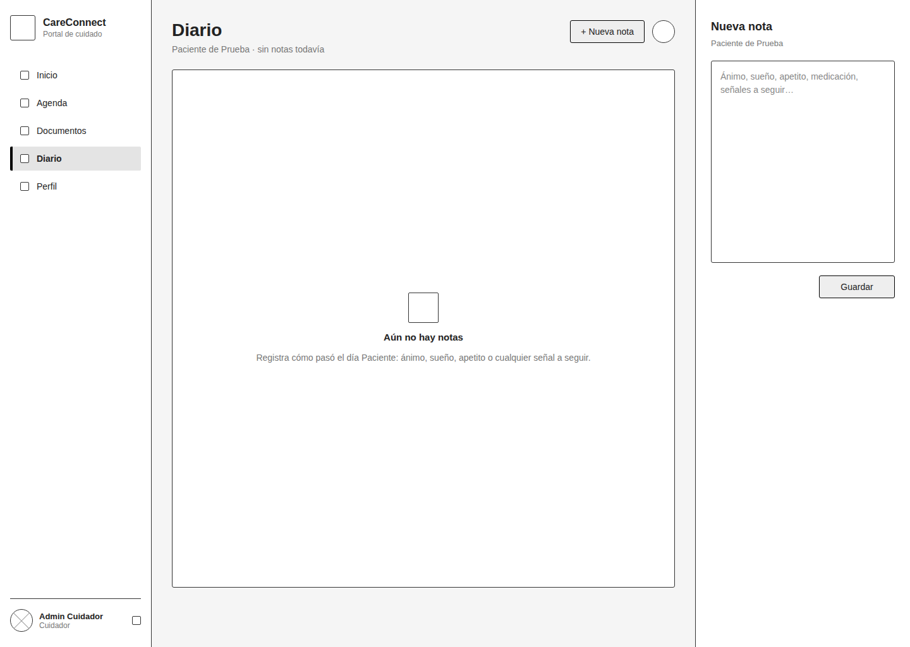 |

| Perfil | Notificaciones |
|---|---|
| 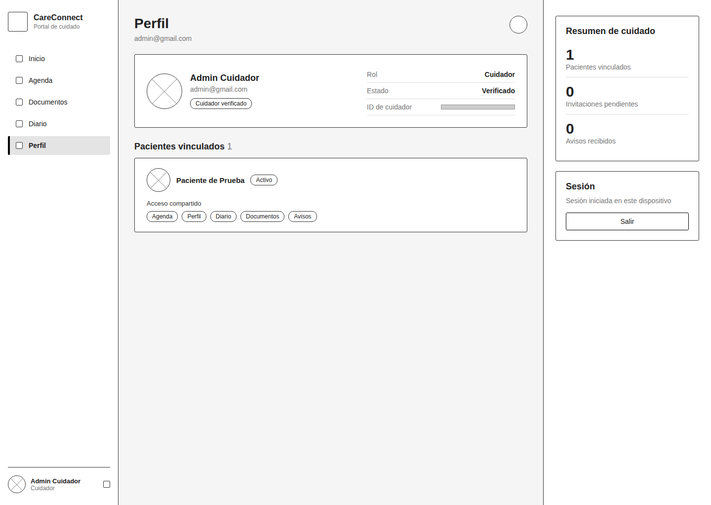 | 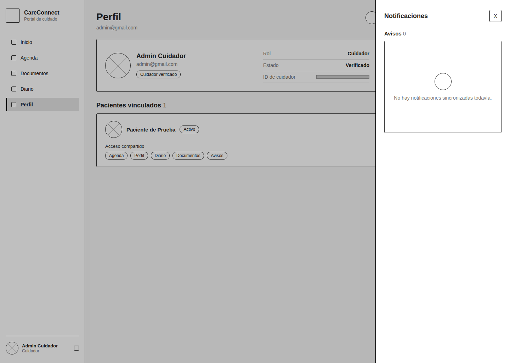 |

#### 4.6.2. Web Applications Wireflow Diagrams

El Wireflow representa el recorrido de navegación de izquierda a derecha. El cuidador crea una cuenta o accede con sus credenciales y llega a **Inicio**, desde donde puede abrir Agenda, Documentos, Diario, Perfil y Notificaciones. La campana proporciona acceso lateral a las notificaciones y todas las pantallas conservan un retorno claro al inicio.

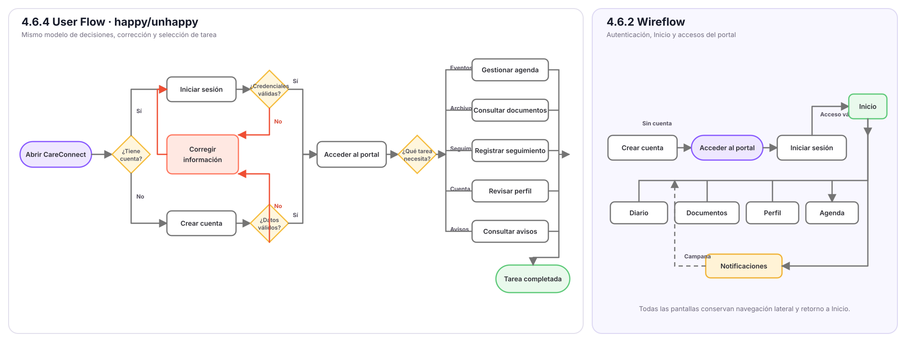

*Figura 1. Wireflow y User Flow de la aplicación web de CareConnect, organizados para una lectura de izquierda a derecha.*

#### 4.6.3. Web Applications Mock-ups

Los mock-ups de alta fidelidad mantienen una identidad visual serena y accesible, con predominio del morado, fondos cálidos, tarjetas de contraste suave y estados vacíos claramente comunicados. El conjunto completo está disponible en la página **03 Mock-ups** del archivo de Figma.

| Autenticación | Acceso principal |
|---|---|
|  |  |
|  |  |

| Seguimiento y cuenta | Vistas del portal |
|---|---|
|  |  |
|  |  |

#### 4.6.4. Web Applications User Flow Diagrams

El User Flow, presentado junto al Wireflow en la figura anterior, representa las rutas satisfactorias y de error del cuidador. Incluye las decisiones sobre la existencia de una cuenta, la validez de los datos de registro y de las credenciales, la corrección y el reintento, además de la selección de la tarea principal. Las rutas satisfactorias concluyen con la ejecución de una tarea en Agenda, Documentos, Diario, Perfil o Notificaciones.

[Ver el Wireflow y User Flow editables en la página **02 UX Flows** de Figma](https://www.figma.com/design/1TzGaaQLzkBu26Ojno1AVU/CareConnect-%E2%80%94-Web-Applications-UX-UI-Design--4.6-?node-id=4-5&p=f)

### 4.7. Web Applications Prototyping

A diferencia del prototipado en Figma (4.6), esta sección documenta el **prototipo funcional** de la aplicación web de CareStacks: una adaptación a escritorio de la base Flutter del segmento cuidador, ejecutada en navegador (`flutter run -d chrome`) y conectada al backend real de CareConnect API, con datos de prueba reales.

El prototipo reemplaza el layout móvil original (bottom nav, columna única) por un sistema responsive de tres anchos con sidebar de navegación, jerarquía visual en tarjetas (hero/standard/quiet/flat) y un panel de detalle lateral, manteniendo intacta la paleta de colores definida en `app_colors.dart`.

| Pantalla | Captura |
|---|---|
| Perfil |  |
| Inicio de sesión |  |
| Registro |  |
| Home (Cuidador) |  |
| Agenda |  |
| Diario |  |
| Documentos |  |
| Notificaciones |  |

**Video del prototipo (Web)**

| Captura del video | Enlace |
|:---:|:---:|
| 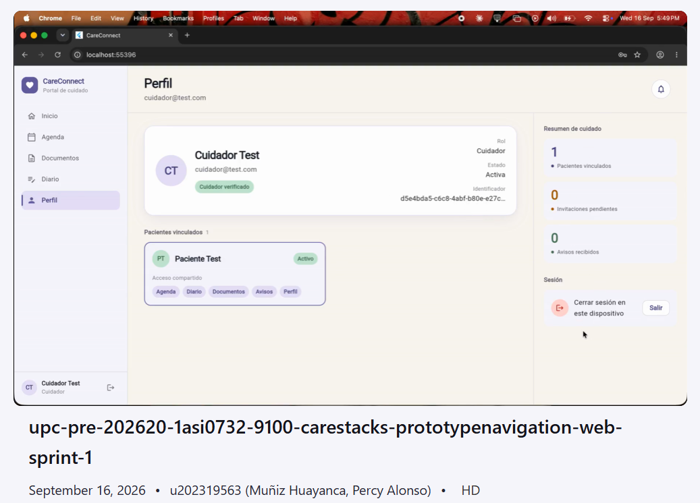 | [Ver video en Microsoft Stream](https://upcedupe-my.sharepoint.com/:v:/g/personal/u202319563_upc_edu_pe/IQCe4c3pMvTBRq2J8EtwN-b3AaO8jwiZA8ZkR9gq_FFT60I?e=bigaiv&nav=eyJyZWZlcnJhbEluZm8iOnsicmVmZXJyYWxBcHAiOiJTdHJlYW1XZWJBcHAiLCJyZWZlcnJhbFZpZXciOiJTaGFyZURpYWxvZy1MaW5rIiwicmVmZXJyYWxBcHBQbGF0Zm9ybSI6IldlYiIsInJlZmVycmFsTW9kZSI6InZpZXcifX0%3D) |

### 4.8. Domain-Driven Software Architecture

La arquitectura de software de **CareConnect** se define tomando como base los principios de Domain-Driven Design (DDD) y el modelo C4. El diseño busca separar las responsabilidades del negocio mediante bounded contexts con límites explícitos, manteniendo al mismo tiempo una arquitectura que permita que las diferentes aplicaciones cliente consuman los servicios centrales del producto.

A nivel estratégico, CareConnect se encuentra organizado en seis bounded contexts: **Agenda, Notificaciones, Documentos, Gestión de Consentimiento, Diario de Seguimiento y Autenticación (IAM)**. Esta separación se deriva del EventStorming, el Context Mapping y los Bounded Context Canvases elaborados previamente, permitiendo que cada subdominio conserve sus propias reglas de negocio y lenguaje ubicuo.

Los bounded contexts **Agenda, Notificaciones y Diario de Seguimiento** concentran las funcionalidades principales vinculadas al seguimiento cotidiano del paciente. **Documentos** y **Gestión de Consentimiento** brindan capacidades de soporte relacionadas con información clínica y control de acceso, mientras que **Autenticación (IAM)** se encarga de la identidad, las sesiones y los roles de usuario.

A nivel de implementación, los bounded contexts no se despliegan como microservicios independientes. Estos se encuentran organizados como módulos dentro de un único backend RESTful, conservando la separación conceptual establecida mediante DDD.

La solución considera actualmente una Landing Page, una aplicación móvil Android, un backend RESTful, una base de datos relacional y almacenamiento externo de documentos. Para el alcance del curso 1ASI0732 también se contempla una **Frontend Web Application** independiente de la Landing Page.

---

#### 4.8.1. Software Architecture Context Diagram

El Software Architecture Context Diagram representa a **CareConnect** como un único sistema de software y muestra las personas y sistemas externos con los que interactúa. Este nivel permite comprender el alcance general de la solución sin mostrar todavía detalles relacionados con containers, componentes o tecnologías internas.

Los dos actores principales del sistema son el **Paciente geriátrico** y el **Cuidador**.

El Paciente geriátrico utiliza CareConnect para consultar sus actividades de salud, confirmar eventos, recibir recordatorios, gestionar documentos médicos, registrar información en su diario de seguimiento y administrar los permisos mediante los cuales otros usuarios pueden acceder a determinada información.

El Cuidador utiliza la solución para supervisar las actividades del paciente, consultar información autorizada, visualizar documentos médicos, recibir alertas y apoyar en la coordinación diaria del cuidado.

CareConnect también interactúa con diferentes servicios externos:

- **Firebase Cloud Messaging:** permite entregar notificaciones push a los dispositivos de los usuarios.
- **SendGrid:** permite enviar correos electrónicos transaccionales.
- **Identity Provider:** permite integrar autenticación federada mediante proveedores externos.
- **Supabase Storage:** proporciona almacenamiento privado para los archivos médicos gestionados por el sistema.

##### Elementos del Context Diagram

| Elemento | Tipo | Responsabilidad |
|---|---|---|
| Paciente geriátrico | Persona | Consulta y administra información relacionada con su cuidado. |
| Cuidador | Persona | Supervisa y coordina las actividades de cuidado del paciente. |
| CareConnect | Sistema | Centraliza agenda, notificaciones, documentos, diario, permisos e identidad. |
| Firebase Cloud Messaging | Sistema externo | Entrega notificaciones push. |
| SendGrid | Sistema externo | Envía correos electrónicos transaccionales. |
| Identity Provider | Sistema externo | Proporciona autenticación federada cuando corresponde. |
| Supabase Storage | Sistema externo | Almacena de forma privada los archivos médicos. |

##### Relaciones principales

| Origen | Destino | Relación |
|---|---|---|
| Paciente geriátrico | CareConnect | Gestiona actividades, información médica y seguimiento. |
| Cuidador | CareConnect | Supervisa al paciente y consulta información autorizada. |
| CareConnect | Firebase Cloud Messaging | Solicita la entrega de notificaciones push. |
| CareConnect | SendGrid | Solicita el envío de correos electrónicos. |
| CareConnect | Identity Provider | Solicita o verifica identidad federada. |
| CareConnect | Supabase Storage | Almacena y recupera archivos médicos privados. |


*Figura 2. Software Architecture Context Diagram de CareConnect.*

---

#### 4.8.2. Software Architecture Container Diagrams

El Software Architecture Container Diagram descompone CareConnect en sus principales unidades ejecutables y de almacenamiento. Este nivel permite representar las aplicaciones que conforman la solución, sus responsabilidades, las tecnologías utilizadas y los mecanismos de comunicación entre ellas.

El backend se representa como un **único RESTful API**. Los bounded contexts Agenda, Notificaciones, Documentos, Gestión de Consentimiento, Diario de Seguimiento y Autenticación se encuentran organizados internamente dentro de este backend y no corresponden a seis microservicios independientes.

Esta decisión permite conservar los límites conceptuales definidos mediante Domain-Driven Design sin introducir complejidad distribuida innecesaria.

##### Containers de CareConnect

| Container | Tecnología | Estado | Responsabilidad |
|---|---|---|---|
| Landing Page | React + Vite + TypeScript | Implementado | Presenta el producto, la problemática y la propuesta de valor. |
| Frontend Web Application | Flutter (Web target) | Implementado | Proporciona una experiencia funcional desde navegador web para el segmento cuidador. |
| Mobile Application (iOS) | Flutter | Implementado | Aplicación para el segmento cuidador, ejecutada en simulador/dispositivo iOS. |
| Mobile Application (Android) | Kotlin + Jetpack Compose | Implementado | Aplicación nativa para el segmento paciente. |
| Backend RESTful API | Java 25 + Spring Boot 4 | Implementado | Expone los casos de uso y reglas de los seis bounded contexts. |
| Relational Database | PostgreSQL (H2 en desarrollo local) | Implementado | Persiste la información estructurada del sistema. |
| Local Storage | Room / SQLite | Implementado | Mantiene información local y caché para soporte offline. |

##### Relaciones entre containers

| Origen | Destino | Protocolo | Responsabilidad |
|---|---|---|---|
| Mobile Application | Backend RESTful API | HTTPS / JSON | Consume los casos de uso de CareConnect. |
| Frontend Web Application | Backend RESTful API | HTTPS / JSON | Consume los servicios del dominio desde web. |
| Mobile Application | Local Storage | Room / SQLite | Almacena y consulta información local. |
| Backend RESTful API | PostgreSQL | JDBC / TLS | Persiste los datos estructurados. |
| Backend RESTful API | Supabase Storage | HTTPS | Gestiona los archivos médicos privados. |
| Backend RESTful API | Firebase Cloud Messaging | HTTPS | Solicita el envío de notificaciones push. |
| Backend RESTful API | SendGrid | HTTPS | Solicita el envío de correos electrónicos. |
| Backend RESTful API | Identity Provider | OAuth 2.0 / HTTPS | Integra autenticación federada. |

##### Consideración tecnológica

El backend implementado utiliza **Java 25 y Spring Boot 4**. El Final Project Statement del curso establece ASP.NET Core y C# como tecnologías de referencia para Web Services; el equipo optó por conservar el stack Java/Spring heredado del proyecto anterior (CareConnect), decisión que debe ser validada con el docente.

La Frontend Web Application se implementó reutilizando la base **Flutter** ya desarrollada para el segmento cuidador (compilada al target Web de Flutter), en lugar de Vue + PrimeVue. Esta decisión permitió reutilizar el sistema de diseño, componentes y capa de datos ya validados en la aplicación móvil, evitando reescribir la lógica de negocio en un stack distinto. Esta desviación respecto al stack sugerido por el curso debe ser validada con el docente; de no ser aceptada, se evaluará una migración hacia el stack requerido.


*Figura 3. Software Architecture Container Diagram de CareConnect.*

---

#### 4.8.3. Software Architecture Components Diagrams

El Software Architecture Components Diagram representa la organización interna del container **Backend RESTful API**. Cada bounded context se modela como un componente independiente dentro del backend, manteniendo sus propias reglas de negocio, lenguaje ubicuo y responsabilidades.

##### Componentes principales

| Componente | Clasificación | Responsabilidad |
|---|---|---|
| Autenticación / IAM | Generic Domain | Gestiona identidad, usuarios, sesiones y roles. |
| Gestión de Consentimiento | Supporting Domain | Gestiona permisos y acceso compartido a información del paciente. |
| Agenda | Core Domain | Administra eventos de salud, citas, medicación y actividades. |
| Notificaciones | Core Domain | Programa y gestiona recordatorios y alertas. |
| Diario de Seguimiento | Core Domain | Registra observaciones y evolución del paciente. |
| Documentos | Supporting Domain | Gestiona metadata y acceso a documentos médicos. |
| Shared Components | Shared Infrastructure | Proporciona auditoría, excepciones y utilidades técnicas comunes. |

##### Relaciones principales entre componentes

- **Autenticación / IAM** proporciona identidad a los demás bounded contexts.
- **Gestión de Consentimiento** determina qué cuidadores se encuentran autorizados para acceder a información de un paciente.
- **Agenda** puede originar eventos que son procesados por Notificaciones para generar recordatorios.
- **Gestión de Consentimiento** puede originar eventos relacionados con invitaciones, accesos y revocaciones.
- **Diario de Seguimiento** y **Documentos** pueden originar comunicaciones que deben ser procesadas por Notificaciones.
- **Notificaciones** concentra la integración con Firebase Cloud Messaging y SendGrid.
- **Documentos** encapsula la integración con Supabase Storage.


*Figura 4. Software Architecture Components Diagram del Backend RESTful API de CareConnect.*

---

### 4.9. Software Object-Oriented Design

El diseño orientado a objetos de CareConnect traduce el modelo conceptual definido mediante Domain-Driven Design a clases, entidades, Aggregate Roots, Value Objects, Domain Services y contratos de persistencia.

Cada bounded context conserva su propio modelo. Esta decisión evita que las entidades internas de un bounded context sean utilizadas directamente como entidades internas de otro contexto, reduciendo el acoplamiento entre módulos.

Las interacciones entre bounded contexts se realizan principalmente mediante identificadores, contratos de aplicación y eventos de dominio.

---

#### 4.9.1. Class Diagrams

Se utilizan diagramas de clases independientes para cada bounded context. Esta estrategia permite representar de forma clara las entidades, agregados, Value Objects, servicios y relaciones correspondientes a cada parte del dominio sin generar un único diagrama excesivamente complejo.

##### Bounded Context: Agenda

El bounded context Agenda controla los eventos de salud asociados a un paciente. `HealthEvent` representa una cita médica, medicamento o actividad terapéutica, mientras que `Reminder` representa un recordatorio relacionado con un evento programado.


*Figura 5. Diagrama de clases del bounded context Agenda.*

##### Bounded Context: Notificaciones

El bounded context Notificaciones administra las comunicaciones generadas por CareConnect, incluyendo recordatorios, alertas y preferencias de comunicación.


*Figura 6. Diagrama de clases del bounded context Notificaciones.*

##### Bounded Context: Diario de Seguimiento

El bounded context Diario de Seguimiento gestiona las notas registradas sobre la evolución del paciente.


*Figura 7. Diagrama de clases del bounded context Diario de Seguimiento.*

##### Bounded Context: Gestión de Consentimiento

Este bounded context controla el ciclo de vida de los accesos compartidos entre pacientes y cuidadores.


*Figura 8. Diagrama de clases del bounded context Gestión de Consentimiento.*

##### Bounded Context: Documentos

El bounded context Documentos administra la información asociada a documentos médicos y la referencia necesaria para acceder a los archivos almacenados externamente.


*Figura 9. Diagrama de clases del bounded context Documentos.*

##### Bounded Context: Autenticación / IAM

El bounded context Autenticación gestiona las cuentas de usuario, autenticación, sesiones y roles de CareConnect.

La entidad principal es `User`, que contiene información relacionada con el correo electrónico, hash de contraseña, nombre completo, rol, estado de la cuenta, intentos fallidos de autenticación y bloqueo temporal.


*Figura 10. Diagrama de clases del bounded context Autenticación / IAM.*

---

#### 4.9.2. Class Dictionary

El Diccionario de Clases complementa los Diagramas de Clases mediante la descripción de los principales elementos del diseño orientado a objetos de CareConnect. Para cada bounded context se identifica el tipo de cada elemento, sus atributos relevantes y tipos de datos, sus principales operaciones y su responsabilidad dentro del dominio.

Los atributos y operaciones definidos en esta sección se encuentran alineados con el modelo de dominio representado en los Diagramas de Clases. Asimismo, los atributos relacionados con persistencia mantienen correspondencia con el diseño de base de datos presentado en la sección 4.10.

---

##### Bounded Context Agenda

El bounded context Agenda administra los eventos de salud asociados a un paciente, incluyendo citas, actividades relacionadas con medicamentos, actividades terapéuticas, recordatorios y reglas de programación.

| Clase | Tipo | Atributos y tipos | Métodos / Operaciones principales | Responsabilidad |
|---|---|---|---|---|
| `Agenda` | Raíz de Agregado | `id: UUID`<br>`patientId: UUID` | `addEvent(HealthEvent)`<br>`removeEvent(UUID)`<br>`getEvents()`<br>`findEvent(UUID)` | Actúa como raíz del agregado del bounded context Agenda y administra la colección de eventos de salud asociados a un paciente. |
| `HealthEvent` | Entidad | `id: UUID`<br>`type: EventType`<br>`dateTime: EventDateTime`<br>`status: EventStatus` | `reschedule(EventDateTime)`<br>`changeStatus(EventStatus)`<br>`createReminder(LocalDateTime)` | Representa una cita, actividad de medicación, actividad terapéutica u otro evento relacionado con la salud del paciente. |
| `Reminder` | Entidad | `id: UUID`<br>`eventId: UUID`<br>`scheduledAt: LocalDateTime` | `reschedule(LocalDateTime)`<br>`isDue(LocalDateTime)` | Representa un recordatorio asociado a un evento de salud previamente programado. |
| `EventDateTime` | Objeto de Valor | `value: LocalDateTime` | `value()`<br>`isBefore(EventDateTime)`<br>`isAfter(EventDateTime)` | Encapsula la fecha y hora asignadas a un evento de salud. |
| `EventType` | Enumeración / Objeto de Valor | Valores que representan citas, medicación y actividades terapéuticas | — | Clasifica el tipo de evento de salud registrado en la agenda. |
| `EventStatus` | Enumeración / Objeto de Valor | Valores que representan los estados del ciclo de vida de un evento | — | Representa el estado actual de un evento de salud. |
| `ScheduleValidationService` | Servicio de Dominio | — | `validateSchedule(EventDateTime)` | Valida restricciones horarias y conflictos de programación antes de registrar o reprogramar un evento de salud. |
| `EventSchedulerService` | Servicio de Dominio | — | `schedule(HealthEvent)`<br>`reschedule(HealthEvent, EventDateTime)` | Aplica las reglas de dominio relacionadas con la programación y reprogramación de eventos de salud. |
| `AgendaRepository` | Interfaz de Repositorio | — | `save(Agenda)`<br>`findById(UUID)`<br>`findByPatientId(UUID)` | Define el contrato de persistencia requerido por el bounded context Agenda. |

---

##### Bounded Context Notifications

El bounded context Notifications administra las notificaciones, alertas, preferencias de comunicación y canales utilizados por CareConnect para comunicar información relevante a sus usuarios.

| Clase | Tipo | Atributos y tipos | Métodos / Operaciones principales | Responsabilidad |
|---|---|---|---|---|
| `NotificationCenter` | Raíz de Agregado | — | `addNotification(Notification)`<br>`addAlert(Alert)`<br>`updatePreference(NotificationPreference)` | Actúa como raíz del agregado responsable de coordinar notificaciones, alertas y preferencias de comunicación de los usuarios. |
| `Notification` | Entidad | `id: UUID`<br>`content: NotificationContent`<br>`type: NotificationType`<br>`priority: NotificationPriority`<br>`status: NotificationStatus`<br>`scheduledAt: LocalDateTime` | `schedule(LocalDateTime)`<br>`changeStatus(NotificationStatus)`<br>`markAsDelivered()` | Representa una comunicación generada por CareConnect para un usuario. |
| `Alert` | Entidad | `id: UUID`<br>`recipientId: UUID`<br>`createdAt: LocalDateTime`<br>`resolvedAt: LocalDateTime` | `resolve()`<br>`isResolved()` | Representa una alerta generada cuando una situación requiere atención especial por parte del usuario. |
| `NotificationPreference` | Entidad | `id: UUID`<br>`userId: UUID`<br>`channel: DeliveryChannel`<br>`enabled: Boolean` | `enable()`<br>`disable()`<br>`changeChannel(DeliveryChannel)` | Almacena las preferencias de comunicación configuradas por un usuario. |
| `NotificationContent` | Objeto de Valor | `title: String`<br>`message: String` | `title()`<br>`message()` | Encapsula el contenido textual mostrado dentro de una notificación. |
| `NotificationType` | Enumeración / Objeto de Valor | Valores que representan el tipo funcional de notificación | — | Clasifica las notificaciones según su propósito dentro de CareConnect. |
| `NotificationPriority` | Enumeración / Objeto de Valor | Valores que representan la prioridad de una notificación | — | Indica el nivel de prioridad asignado a una notificación. |
| `NotificationStatus` | Enumeración / Objeto de Valor | Valores que representan el ciclo de vida de una notificación | — | Representa el estado actual de una notificación. |
| `DeliveryChannel` | Enumeración / Objeto de Valor | `PUSH`<br>`EMAIL`<br>`IN_APP` | — | Identifica el canal mediante el cual se entrega una notificación. |
| `AlertEvaluationService` | Servicio de Dominio | — | `evaluate(Alert)` | Evalúa si una determinada condición del dominio debe generar una alerta. |
| `NotificationDispatchService` | Servicio de Dominio | — | `dispatch(Notification)` | Coordina el envío de las notificaciones a través del canal configurado. |
| `NotificationRepository` | Interfaz de Repositorio | — | `save(Notification)`<br>`findById(UUID)`<br>`findByRecipientId(UUID)` | Define el contrato de persistencia para las notificaciones. |

---

##### Bounded Context Diary Tracking

El bounded context Diary Tracking administra la información registrada durante el proceso de cuidado del paciente, permitiendo documentar observaciones y cambios relevantes a lo largo del tiempo.

| Clase | Tipo | Atributos y tipos | Métodos / Operaciones principales | Responsabilidad |
|---|---|---|---|---|
| `Diary` | Raíz de Agregado | `id: UUID`<br>`patientId: UUID` | `addEntry(DiaryEntry)`<br>`removeEntry(UUID)`<br>`getEntries()` | Actúa como raíz del agregado responsable de administrar las entradas del diario asociadas a un paciente. |
| `DiaryEntry` | Entidad | `id: UUID`<br>`content: EntryContent`<br>`date: EntryDate` | `updateContent(EntryContent)`<br>`changeDate(EntryDate)` | Representa una entrada individual registrada dentro del diario del paciente. |
| `EntryContent` | Objeto de Valor | `value: String` | `value()`<br>`isEmpty()` | Encapsula y valida el contenido textual de una entrada del diario. |
| `EntryDate` | Objeto de Valor | Valor de fecha asociado a la entrada | `value()` | Encapsula la fecha asociada a una entrada del diario. |
| `DiaryRepository` | Interfaz de Repositorio | — | `save(Diary)`<br>`findById(UUID)`<br>`findByPatientId(UUID)` | Define las operaciones de persistencia requeridas por el bounded context Diary Tracking. |

---

##### Bounded Context Consent Management

El bounded context Consent Management controla la manera en que los pacientes comparten su información con los cuidadores, incluyendo solicitudes de acceso, permisos, expiración del acceso, revocación y tokens de compartición.

| Clase | Tipo | Atributos y tipos | Métodos / Operaciones principales | Responsabilidad |
|---|---|---|---|---|
| `ProfileSharing` | Raíz de Agregado | `id: UUID`<br>`patientId: UUID`<br>`createdAt: LocalDateTime` | `requestAccess(UUID)`<br>`grantAccess(SharedAccess)`<br>`revokeAccess(UUID)` | Actúa como raíz del agregado que administra el ciclo de vida del perfil compartido de un paciente. |
| `AccessRequest` | Entidad | `id: UUID`<br>`profileSharingId: UUID`<br>`caregiverId: UUID`<br>`status: AccessStatus`<br>`createdAt: LocalDateTime` | `approve()`<br>`reject()`<br>`changeStatus(AccessStatus)` | Representa una solicitud realizada por un cuidador para obtener acceso a la información compartida de un paciente. |
| `SharedAccess` | Entidad | `id: UUID`<br>`profileSharingId: UUID`<br>`caregiverId: UUID`<br>`userId: UUID`<br>`token: ShareToken`<br>`permission: AccessPermission`<br>`status: AccessStatus`<br>`expiresAt: ExpirationDate` | `activate()`<br>`revoke()`<br>`isExpired()`<br>`changePermission(AccessPermission)` | Representa un permiso de acceso otorgado a un cuidador sobre el perfil compartido de un paciente. |
| `ShareToken` | Objeto de Valor | Valor del token utilizado para identificar un acceso compartido | `value()` | Encapsula el token único utilizado para compartir de manera segura el acceso a un perfil. |
| `ExpirationDate` | Objeto de Valor | Fecha y hora de expiración del acceso compartido | `isExpired()`<br>`value()` | Encapsula la fecha de expiración asociada a un acceso compartido. |
| `AccessStatus` | Enumeración / Objeto de Valor | `PENDING`<br>`ACTIVE`<br>`REVOKED`<br>`EXPIRED` | — | Representa el estado actual de una solicitud o permiso de acceso compartido. |
| `AccessPermission` | Enumeración / Objeto de Valor | Valores que representan el nivel de permiso otorgado | — | Representa el nivel de permiso asignado a un cuidador. |
| `ProfileSharingService` | Servicio de Dominio | — | `createSharing(UUID)`<br>`revokeSharing(UUID)` | Aplica las reglas de dominio relacionadas con la creación y revocación del acceso compartido. |
| `AccessValidationService` | Servicio de Dominio | — | `validateToken(ShareToken)`<br>`validateExpiration(ExpirationDate)`<br>`validateAccess(SharedAccess)` | Valida tokens de compartición, fechas de expiración, estados y condiciones de acceso. |
| `SharedProfileRepository` | Interfaz de Repositorio | — | `save(ProfileSharing)`<br>`findById(UUID)`<br>`findByPatientId(UUID)` | Define el contrato de persistencia utilizado por la gestión de perfiles compartidos y consentimiento. |

---

##### Bounded Context Documents

El bounded context Documents administra los metadatos y referencias asociados a documentos médicos. Los archivos físicos se almacenan externamente, mientras que el modelo de dominio conserva la información necesaria para identificarlos y recuperarlos.

| Clase | Tipo | Atributos y tipos | Métodos / Operaciones principales | Responsabilidad |
|---|---|---|---|---|
| `MedicalDocument` | Raíz de Agregado | `id: UUID`<br>`patientId: UUID`<br>`createdAt: LocalDateTime` | `addItem(DocumentItem)`<br>`removeItem(UUID)`<br>`getItems()` | Actúa como raíz del agregado de la documentación médica asociada a un paciente. |
| `DocumentItem` | Entidad | `id: UUID`<br>`type: DocumentType`<br>`metadata: DocumentMetadata`<br>`storageKey: String` | `changeMetadata(DocumentMetadata)`<br>`changeType(DocumentType)`<br>`changeStorageKey(String)` | Representa un archivo o elemento documental individual asociado a un paciente. |
| `DocumentMetadata` | Objeto de Valor | `description: String`<br>`date: Date`<br>`origin: String` | `description()`<br>`date()`<br>`origin()` | Encapsula los metadatos descriptivos asociados a un documento médico. |
| `DocumentType` | Enumeración / Objeto de Valor | Valores que representan la categoría de documento médico | — | Clasifica los documentos médicos de acuerdo con su tipo funcional. |
| `DocumentRepository` | Interfaz de Repositorio | — | `save(MedicalDocument)`<br>`findById(UUID)`<br>`findByPatientId(UUID)` | Define las operaciones de persistencia requeridas por el bounded context Documents. |

El atributo `storageKey` hace referencia al archivo externo almacenado en Supabase Storage. De esta manera, CareConnect almacena en PostgreSQL los metadatos del documento y la referencia hacia el almacenamiento externo, en lugar de almacenar directamente el archivo médico como datos binarios dentro de la base de datos relacional.

---

##### Bounded Context Authentication / IAM

El bounded context Authentication / IAM administra las cuentas de usuario de CareConnect, la autenticación, los roles de autorización, la validación de sesiones, el estado de las cuentas y el bloqueo temporal después de intentos de acceso fallidos.

| Clase | Tipo | Atributos y tipos | Métodos / Operaciones principales | Responsabilidad |
|---|---|---|---|---|
| `User` | Entidad | `email: String`<br>`passwordHash: String`<br>`fullName: String`<br>`role: UserRole`<br>`active: Boolean`<br>`failedLoginAttempts: Int`<br>`lockedUntil: LocalDateTime` | `activate()`<br>`deactivate()`<br>`registerFailedLogin()`<br>`resetFailedLoginAttempts()`<br>`lockUntil(LocalDateTime)`<br>`isLocked()` | Representa una cuenta de usuario de CareConnect y aplica las reglas de dominio asociadas a la activación y bloqueo temporal de cuentas. |
| `UserRole` | Enumeración | Valores que representan los roles funcionales disponibles en CareConnect | — | Identifica el rol funcional asignado a un usuario. |
| `AuthService` | Contrato de Servicio de Aplicación | — | `register(...)`<br>`login(...)`<br>`logout(...)`<br>`validateSession(...)` | Define las operaciones de aplicación requeridas para el registro, autenticación, cierre de sesión y validación de sesiones. |
| `AuthServiceImpl` | Servicio de Aplicación | — | `register(...)`<br>`login(...)`<br>`logout(...)`<br>`validateSession(...)` | Implementa los casos de uso de autenticación definidos mediante `AuthService`. |
| `UserRepository` | Interfaz de Repositorio | — | `save(User)`<br>`findByEmail(String)`<br>`findById(UUID)` | Define el contrato de persistencia requerido para almacenar y recuperar cuentas de usuario. |
| `UserJpaEntity` | Entidad de Persistencia | Representación persistente de la entidad `User` | — | Representa el modelo de persistencia utilizado para almacenar la información de los usuarios en la base de datos relacional. |
| `UserMapper` | Mapper | — | `toDomain(UserJpaEntity)`<br>`toEntity(User)` | Convierte entre el modelo de dominio `User` y su representación de persistencia. |
| `AuthController` | Controlador REST | — | `register(...)`<br>`login(...)`<br>`logout(...)`<br>`validateSession(...)` | Expone las operaciones de autenticación mediante la API RESTful. |

La representación persistente asociada a `User` almacena los siguientes datos en PostgreSQL:

| Atributo | Tipo de persistencia |
|---|---|
| `id` | `UUID` |
| `email` | `VARCHAR`, único |
| `passwordHash` | `VARCHAR` |
| `fullName` | `VARCHAR` |
| `role` | `VARCHAR` |
| `active` | `BOOLEAN` |
| `failedLoginAttempts` | `INTEGER` |
| `lockedUntil` | `TIMESTAMP` |

---

##### Resumen del Diccionario de Clases

El diseño orientado a objetos de CareConnect mantiene una separación clara entre los diferentes bounded contexts del sistema.

Las **Raíces de Agregado** coordinan los límites de consistencia de cada agregado. Las **Entidades** poseen una identidad propia que se mantiene durante su ciclo de vida. Los **Objetos de Valor** encapsulan conceptos relevantes del dominio que no requieren una identidad independiente.

Los **Servicios de Dominio** contienen reglas de negocio que no pertenecen naturalmente a una única entidad, mientras que las **Interfaces de Repositorio** abstraen las operaciones de persistencia y permiten mantener desacoplada la capa de dominio de los mecanismos concretos de almacenamiento.

Finalmente, los **Servicios de Aplicación**, controladores y mappers coordinan los casos de uso, la exposición de funcionalidades y la transformación de información entre las diferentes capas de la arquitectura.

De esta forma, el diseño mantiene coherencia entre la arquitectura basada en Domain-Driven Design, los Diagramas de Clases y el modelo de persistencia relacional de CareConnect, reduciendo el acoplamiento entre bounded contexts y facilitando la evolución independiente de sus componentes.

### 4.10. Database Design

CareConnect utiliza una arquitectura de persistencia relacional para almacenar la información estructurada correspondiente a los distintos bounded contexts.

La base de datos central utiliza **PostgreSQL**. Los archivos médicos no se almacenan directamente dentro de la base relacional; estos se mantienen en **Supabase Storage**, mientras PostgreSQL conserva la metadata y referencias necesarias para localizarlos.

La separación conceptual establecida mediante Domain-Driven Design también se conserva en el diseño de persistencia. Cada bounded context mantiene responsabilidad conceptual sobre sus propias estructuras de datos.

---

#### 4.10.1. Relational/Non-Relational Database Diagram

El Relational/Non-Relational Database Diagram consolida las estructuras de persistencia del sistema en una vista integrada. Esto permite observar las relaciones generales de la solución manteniendo la separación conceptual entre bounded contexts.

##### Agrupación conceptual por bounded context

| Bounded Context | Información persistida |
|---|---|
| Autenticación / IAM | Usuarios, roles, estado de cuenta y datos de autenticación. |
| Agenda | Eventos de salud y recordatorios. |
| Notificaciones | Notificaciones, alertas, preferencias e intentos de entrega. |
| Diario de Seguimiento | Entradas del diario del paciente. |
| Gestión de Consentimiento | Solicitudes, accesos compartidos, permisos y revocaciones. |
| Documentos | Metadata y referencias a archivos médicos. |

##### Persistencia relacional

PostgreSQL constituye el almacenamiento principal para la información estructurada. Las relaciones entre tablas deben respetar las referencias necesarias entre usuarios, eventos, notificaciones, documentos, entradas de diario y accesos compartidos.

Las Primary Keys y Foreign Keys deben representarse explícitamente en el diagrama final, junto con las cardinalidades correspondientes.

##### Persistencia de archivos

Los archivos médicos se almacenan en **Supabase Storage** y no como datos binarios dentro de PostgreSQL.

La base relacional conserva únicamente la información necesaria para identificar el documento y recuperar de forma segura el archivo correspondiente.


*Figura 11. Relational/Non-Relational Database Diagram integrado de CareConnect.*

## Capítulo V: Product Implementation

### 5.1. Software Configuration Management

La gestión de configuración de software de **CareConnect** define las herramientas, convenciones y procedimientos utilizados para desarrollar, versionar, integrar y desplegar los productos que conforman la solución. Su propósito es mantener trazabilidad sobre los cambios, reducir diferencias entre los entornos de trabajo de los integrantes y asegurar que el código fuente, la documentación y las configuraciones puedan ser reproducidos durante el ciclo de vida del proyecto.

CareConnect se encuentra compuesto por diferentes productos de software que evolucionan de manera independiente:

- Project Report.
- Landing Page.
- Native Mobile Application.
- Backend RESTful API.
- Frontend Web Application requerida para 1ASI0732.

La solución actual mantiene repositorios separados para el informe, backend, aplicación móvil y Landing Page. La Frontend Web Application forma parte del alcance requerido por el curso, pero su repositorio y evidencia de despliegue deben incorporarse cuando su implementación sea confirmada.

---

#### 5.1.1. Software Development Environment Configuration

La configuración del entorno de desarrollo especifica las herramientas utilizadas por el equipo para la gestión del proyecto, diseño UX/UI, desarrollo, pruebas, despliegue y documentación.

La selección de herramientas busca mantener una separación clara entre cada producto de CareConnect y permitir que los integrantes reproduzcan localmente los entornos necesarios para trabajar sobre ellos.

##### Herramientas por actividad

| Actividad | Producto / herramienta | Propósito | Ruta o referencia |
|---|---|---|---|
| Project & Requirements Management | GitHub | Gestionar repositorios, ramas, Pull Requests, historial de cambios y colaboración. | Organización `CareStacks` |
| UX/UI Design | Figma | Elaborar wireframes, mockups y prototipos de interfaces. | Proyecto de diseño del equipo |
| Domain Modeling | Miro | Elaborar EventStorming, Context Mapping y Bounded Context Canvases. | Workspace del equipo |
| Software Architecture | Structurizr | Elaborar los diagramas C4 de Context, Container y Components. | Artefactos del Capítulo IV |
| Mobile Development | Android Studio | Desarrollar, ejecutar y depurar la aplicación Android. | Repositorio `CareStacks/FrontEnd` |
| Mobile Development | Kotlin | Lenguaje de programación de la aplicación Android. | `CareStacks/FrontEnd` |
| Mobile UI | Jetpack Compose | Construir la interfaz declarativa de la aplicación Android. | `CareStacks/FrontEnd` |
| Mobile Build | Gradle | Gestionar dependencias y compilación de Android. | `CareStacks/FrontEnd` |
| Backend Development | Java 21 | Lenguaje utilizado actualmente por el backend. | `CareStacks/BackEnd` |
| Backend Framework | Spring Boot | Implementar y exponer los servicios RESTful actuales. | `CareStacks/BackEnd` |
| Backend Build | Maven | Gestionar dependencias y construir el backend. | `CareStacks/BackEnd/pom.xml` |
| Persistence | Spring Data JPA / Hibernate | Gestionar el mapeo objeto-relacional del backend. | `CareStacks/BackEnd` |
| Relational Database | PostgreSQL | Persistir los datos estructurados de CareConnect. | Servicio PostgreSQL asociado al backend |
| Testing Database | H2 | Ejecutar escenarios de prueba que requieren una base en memoria. | Configuración de pruebas del backend |
| Local Mobile Storage | Room / SQLite | Mantener datos locales y soporte offline en Android. | `CareStacks/FrontEnd` |
| Document Storage | Supabase Storage | Almacenar de manera privada archivos médicos. | Configuración mediante variables de entorno del backend |
| API Documentation | OpenAPI / Swagger UI | Documentar y probar los endpoints REST. | `/v3/api-docs` y `/swagger-ui.html` |
| Notifications | Firebase Cloud Messaging | Entregar notificaciones push. | Proyecto Firebase de CareConnect |
| Mobile Distribution | Firebase App Distribution | Distribuir builds Android de prueba. | Proyecto Firebase de CareConnect |
| Email | SendGrid | Enviar correos electrónicos transaccionales. | Configuración privada del backend |
| Landing Page Development | React + Vite + TypeScript | Implementación actual de la Landing Page. | `CareStacks/Landing-Page` |
| Landing Page Deployment | Vercel | Publicar la Landing Page. | Proyecto Vercel vinculado al repositorio |
| Frontend Web Application | Flutter | Stack requerido por 1ASI0732 para la aplicación web funcional. | Pendiente de repositorio/implementación confirmada |
| Documentation | Markdown | Elaborar el informe principal del proyecto. | `CareStacks/Report/README.md` |

##### Configuración de la Native Mobile Application

La aplicación móvil de CareConnect utiliza actualmente el siguiente entorno:

```text
IDE: Android Studio
Language: Kotlin
UI Framework: Jetpack Compose
Build Tool: Gradle
Local Persistence: Room / SQLite
Push Notifications: Firebase Cloud Messaging
Distribution: Firebase App Distribution
```

Android Studio permite compilar el proyecto, ejecutar la aplicación mediante emuladores o dispositivos físicos, realizar debugging y generar builds para pruebas.

La persistencia local con Room/SQLite permite mantener determinados datos disponibles en el dispositivo y soportar escenarios donde la conectividad no sea constante.

##### Configuración del Backend RESTful API

El backend actual de CareConnect se implementa como una aplicación Spring Boot única organizada internamente mediante bounded contexts.

```text
Language: Java 21
Framework: Spring Boot
Build Tool: Maven
ORM: Spring Data JPA / Hibernate
Relational Database: PostgreSQL
Testing Database: H2
API Documentation: OpenAPI / Swagger UI
```

Su estructura principal sigue los bounded contexts definidos para el producto:

```text
src/main/java/com/carestacks/careconnect/
├── agenda/
├── consents/
├── diary/
├── documents/
├── iam/
├── notifications/
└── shared/
```

Cada módulo mantiene separación entre responsabilidades de dominio, aplicación, infraestructura e interfaces.

##### Variables de entorno del Backend

Las credenciales y configuraciones sensibles no deben almacenarse directamente en el repositorio.

La conexión con PostgreSQL se configura mediante variables del entorno de Spring, como:

```text
SPRING_DATASOURCE_URL
SPRING_DATASOURCE_DRIVER_CLASS_NAME
SPRING_DATASOURCE_USERNAME
SPRING_DATASOURCE_PASSWORD
```

La integración con Supabase Storage utiliza:

```text
SUPABASE_URL
SUPABASE_SERVICE_ROLE_KEY
SUPABASE_STORAGE_BUCKET
```

Los valores reales de estas variables deben mantenerse únicamente en los entornos autorizados y no deben incluirse en commits, documentación pública ni código cliente.

##### Configuración de la Landing Page

La Landing Page actualmente implementada utiliza:

```text
Framework: Flutter
UI Components: Flutter
Package Manager: flutter run
Communication: REST over HTTPS/JSON
```

El repositorio correspondiente es:

```text
https://github.com/CareStacks/Landing-Page
```

##### Configuración de la Frontend Web Application

El alcance de 1ASI0732 requiere una Frontend Web Application independiente de la Landing Page.

El stack establecido para esta aplicación es:

```text
Framework: Flutter
UI Components: Flutter
Package Manager: npm
Communication: REST over HTTPS/JSON
```

La aplicación deberá consumir los servicios expuestos por el backend y contar con un repositorio independiente. Mientras no exista evidencia de implementación, no debe documentarse como un producto ya desplegado.

##### Consideración sobre el stack del curso

El backend actualmente implementado utiliza **Java 21 y Spring Boot**. Sin embargo, el Final Project Statement de 1ASI0732 establece **ASP.NET Core y C#** para los Web Services.

De igual forma, la Landing Page existente utiliza React + Vite + TypeScript, mientras que el statement establece un stack específico para dicho producto.

Estas diferencias deben mantenerse explícitas en la documentación hasta que el equipo confirme con el docente si las implementaciones existentes pueden conservarse o si deben migrarse.

---

#### 5.1.2. Source Code Management

Para la gestión del código fuente y de los artefactos de documentación de CareConnect, el equipo utiliza **Git** como sistema de control de versiones distribuido y **GitHub** como plataforma colaborativa para el alojamiento de repositorios, administración de ramas, revisión de cambios y trazabilidad del desarrollo.

El uso de control de versiones permite mantener un historial de modificaciones, identificar la contribución de cada integrante y controlar la integración progresiva del trabajo realizado durante los diferentes sprints y entregas del proyecto.

#### Repositorio del informe

El informe del proyecto se encuentra alojado en el siguiente repositorio de GitHub:

- **Repositorio:** CareStacks Report
- **Organización:** `upc-pre-202620-1asi0732-9100-carestacks`
- **URL:** https://github.com/upc-pre-202620-1asi0732-9100-carestacks/carestacks-report

El repositorio contiene la documentación correspondiente a los diferentes capítulos del informe y los recursos gráficos utilizados como evidencia de los artefactos desarrollados.

#### Estrategia de ramas

Para organizar el desarrollo del informe se utiliza una estrategia de ramas basada en una separación entre la versión estable, la versión de integración y las ramas de trabajo correspondientes a cada capítulo.

Las principales ramas son:

| Rama | Propósito |
|---|---|
| `main` | Contiene la versión estable y consolidada del informe correspondiente a las entregas oficiales. |
| `develop` | Rama de integración en la que se consolidan los cambios desarrollados antes de incorporarlos a `main`. |
| `chapter-1` | Desarrollo y actualización del Capítulo I. |
| `chapter-2` | Desarrollo y actualización del Capítulo II. |
| `chapter-3` | Desarrollo y actualización del Capítulo III. |
| `chapter-4` | Desarrollo y actualización del Capítulo IV. |
| `chapter-5` | Desarrollo y actualización del Capítulo V. |
| `chapter-6` | Desarrollo y actualización del Capítulo VI. |

El flujo de integración utilizado para el informe es el siguiente:

1. Cada capítulo es desarrollado en su respectiva rama `chapter-*`.
2. Los cambios realizados se registran mediante commits siguiendo la convención definida por el equipo.
3. Una vez concluida y revisada una sección, los cambios son integrados hacia `develop`.
4. La rama `develop` funciona como punto de integración y validación del informe.
5. Cuando el contenido correspondiente a una entrega se encuentra completo y revisado, se realiza la integración desde `develop` hacia `main`.
6. `main` mantiene únicamente versiones consideradas estables y listas para entrega.

El flujo general puede representarse de la siguiente manera:

`chapter-*` → `develop` → `main`

#### Convenciones para nombres de ramas

Las ramas utilizadas para el desarrollo del informe siguen la siguiente convención:

```text
chapter-<número>
```

#### Repositorios de producto

Además del repositorio del informe, la solución CareConnect se compone de los siguientes repositorios, alojados en la misma organización de GitHub:

| Repositorio | Propósito | URL |
|---|---|---|
| `carestacks-report` | Informe del proyecto (este repositorio). | https://github.com/upc-pre-202620-1asi0732-9100-carestacks/carestacks-report |
| `carestacks-backend-api` | Web Services: API REST del backend (Spring Boot), organizada en los bounded contexts de IAM, Agenda, Notificaciones, Diario, Documentos y Gestión de Consentimiento. | https://github.com/upc-pre-202620-1asi0732-9100-carestacks/carestacks-backend-api |
| `carestacks-web` | Frontend Web Application: adaptación a escritorio de la aplicación del cuidador (Flutter web). | https://github.com/upc-pre-202620-1asi0732-9100-carestacks/carestacks-web |
| `Landing-Page` | Landing Page del producto (React + TypeScript + Vite), desplegada en Vercel. | https://github.com/CareStacks/Landing-Page |

#### Convenciones de GitFlow para los repositorios de producto

Los repositorios de producto (`carestacks-backend-api`, `carestacks-web` y `Landing-Page`) siguen el flujo de trabajo **GitFlow**, con las siguientes convenciones de nombrado de ramas:

| Tipo de rama | Convención | Ejemplo |
|---|---|---|
| Feature | `feature/<nombre>` | `feature/agenda-confirmar-evento` |
| Release | `release/<version>` | `release/1.2.0` |
| Hotfix | `hotfix/<nombre>` | `hotfix/fix-login-token-expirado` |

Las ramas `feature/*` se crean a partir de `develop` y se integran de vuelta a `develop` una vez completada la funcionalidad. Las ramas `release/*` se crean a partir de `develop` para preparar una nueva versión y se integran tanto a `main` como a `develop` al cerrarse. Las ramas `hotfix/*` se crean a partir de `main` para corregir errores críticos en producción y se integran de vuelta a `main` y a `develop`.

#### Versionado Semántico (Semantic Versioning)

Las versiones publicadas (releases) de los productos siguen el formato **Semantic Versioning** `MAJOR.MINOR.PATCH`:

- **MAJOR:** cambios incompatibles con versiones anteriores (breaking changes).
- **MINOR:** nuevas funcionalidades compatibles con versiones anteriores.
- **PATCH:** correcciones de errores compatibles con versiones anteriores.

Ejemplo: `1.2.0` corresponde a la segunda funcionalidad agregada sobre la primera versión estable (`1.0.0`), sin cambios incompatibles.

#### Conventional Commits

Los mensajes de commit en los repositorios de producto siguen el formato **Conventional Commits**:

```text
<tipo>(<scope>): <descripción breve>
```

Tipos utilizados: `feat`, `fix`, `docs`, `refactor`, `style`, `test`, `chore`, `perf`, `build`, `ci`. Ejemplos:

```text
feat(agenda): add event confirmation endpoint
fix(auth): handle expired login token
docs(readme): update deployment instructions
```

#### 5.1.3. Source Code Style Guide & Conventions

Las convenciones de código permiten mantener consistencia entre los distintos productos y módulos de CareConnect.

Los identificadores técnicos deben escribirse en **inglés**, incluyendo clases, métodos, variables, endpoints, tablas y commits.

##### Convenciones generales

| Elemento | Convención | Ejemplo |
|---|---|---|
| Clases | PascalCase | `HealthEventService` |
| Interfaces | PascalCase | `AgendaRepository` |
| Métodos / funciones | camelCase | `confirmHealthEvent()` |
| Variables | camelCase | `patientId` |
| Constantes | UPPER_SNAKE_CASE | `MAX_LOGIN_ATTEMPTS` |
| Paquetes Java | lowercase | `com.carestacks.careconnect.agenda` |
| Componentes frontend | PascalCase | `NotificationCard` |
| Tablas | snake_case plural | `health_events` |
| Columnas | snake_case | `created_at` |
| Foreign Keys | `<entity>_id` | `patient_id` |

##### Organización del Backend

Los módulos del backend mantienen una estructura basada en:

```text
domain/
application/
infrastructure/
interfaces/
```

**Domain** contiene los conceptos y reglas propias del negocio, como entidades, Aggregate Roots, Value Objects, Domain Services, Domain Events y contratos de repositories.

**Application** coordina los casos de uso y la interacción con el dominio.

**Infrastructure** contiene detalles técnicos como persistencia, mappers, clientes de almacenamiento, adaptadores externos y configuraciones.

**Interfaces** contiene los puntos de entrada del sistema, principalmente REST Controllers.

##### Convenciones Java / Spring Boot

Ejemplo:

```java
public class HealthEventService {

    private static final int MAX_RETRIES = 3;

    public void confirmHealthEvent(UUID eventId) {
    }
}
```

Se aplican las siguientes reglas:

- Clases e interfaces en PascalCase.
- Métodos y variables en camelCase.
- Constantes en UPPER_SNAKE_CASE.
- Paquetes en minúsculas.
- Evitar reglas del dominio dentro de controllers.
- Utilizar mappers cuando se requiera separar dominio y persistencia.
- Mantener los bounded contexts desacoplados.

##### Convenciones Kotlin / Android

Ejemplo:

```kotlin
class AgendaViewModel : ViewModel() {

    fun confirmEvent(eventId: String) {
    }
}
```

Las principales convenciones son:

- Clases en PascalCase.
- Funciones y variables en camelCase.
- Constantes en UPPER_SNAKE_CASE.
- Paquetes en minúsculas.
- La UI no debe concentrar reglas de negocio.
- Los ViewModels deben administrar el estado de presentación.
- La comunicación con servicios y persistencia debe mantenerse separada de los composables.

##### Convenciones TypeScript / Frontend

Ejemplo:

```typescript
const API_BASE_URL = import.meta.env.VITE_API_BASE_URL;

function loadNotifications() {
}
```

Los componentes utilizan PascalCase y las funciones o variables camelCase.

Las configuraciones específicas de cada ambiente deben administrarse mediante variables de entorno y no mediante valores sensibles escritos directamente en el código.

##### Convenciones REST

Los endpoints deben utilizar sustantivos y aprovechar la semántica de HTTP.

| Acción | Método | Ejemplo |
|---|---|---|
| Consultar colección | GET | `/api/events` |
| Consultar recurso | GET | `/api/events/{id}` |
| Crear | POST | `/api/events` |
| Actualizar | PUT | `/api/events/{id}` |
| Actualizar parcialmente | PATCH | `/api/events/{id}` |
| Eliminar | DELETE | `/api/events/{id}` |

Los nombres de recursos deben ser consistentes y encontrarse en inglés.

##### Convenciones de Base de Datos

| Elemento | Convención | Ejemplo |
|---|---|---|
| Tabla | snake_case plural | `health_events` |
| Columna | snake_case | `scheduled_at` |
| Primary Key | `id` | `id` |
| Foreign Key | `<entity>_id` | `patient_id` |
| Timestamp de creación | `created_at` | `created_at` |
| Timestamp de modificación | `updated_at` | `updated_at` |

##### Convenciones Gherkin

Los escenarios de aceptación siguen la estructura Given / When / Then.

```gherkin
Feature: Health event confirmation

  Scenario: Patient confirms a scheduled event
    Given the patient has a pending health event
    When the patient confirms the event
    Then the event status is marked as confirmed
```

##### Buenas prácticas

- Mantener alta cohesión dentro de cada bounded context.
- Reducir dependencias innecesarias entre módulos.
- Mantener reglas del negocio fuera de componentes de presentación.
- No exponer información sensible mediante logs.
- No almacenar secretos en GitHub.
- Utilizar nombres descriptivos.
- Mantener documentación y código consistentes.
- Evitar duplicar reglas del dominio.
- Revisar cambios mediante Pull Requests antes de integrar cuando corresponda.

---
#### 5.1.4. Software Deployment Configuration

La configuración de despliegue de CareConnect define los mecanismos utilizados para construir, configurar y publicar los diferentes productos que forman parte de la solución. Debido a que cada componente posee características tecnológicas diferentes, el proceso de despliegue se documenta de manera independiente para la Landing Page, la Frontend Web Application, la Native Mobile Application y la RESTful API.

Para la presente entrega, no todos los productos cuentan todavía con un despliegue público en un ambiente de producción. Por ello, esta sección diferencia entre los componentes que poseen evidencia de despliegue verificable y aquellos cuya ejecución ha sido validada únicamente en un ambiente local.

---

##### Landing Page

La Landing Page de CareConnect está implementada utilizando **React, TypeScript y Vite** y se encuentra desplegada públicamente mediante **Vercel**.

- **Repositorio:** `https://github.com/CareStacks/Landing-Page`
- **URL de producción:** `https://landing-page-lovat-ten.vercel.app/`
- **Proveedor de despliegue:** Vercel
- **Build Tool:** Vite

El flujo de despliegue utilizado es:

```text
Cambios en el repositorio
          |
          v
     Push a GitHub
          |
          v
Vercel detecta los cambios
          |
          v
Instalación de dependencias
          |
          v
       Build Vite
          |
          v
Publicación de la nueva versión
          |
          v
      URL pública
```

Vercel se encuentra vinculado al repositorio de la Landing Page, permitiendo generar una nueva versión desplegada a partir de los cambios integrados en la rama configurada para producción.

La evidencia visual correspondiente al despliegue y funcionamiento de este producto se presenta posteriormente en la sección **5.2.2. Implemented Landing Page Evidence**.

---

##### Frontend Web Application

La Frontend Web Application de CareConnect dispone actualmente de una implementación web basada en Flutter, adaptada a diferentes resoluciones de pantalla.

Durante el desarrollo se validó satisfactoriamente la generación del artefacto web mediante:

```bash
flutter build web --release
```

Este comando genera la versión optimizada para producción dentro del directorio:

```text
build/web/
```

El flujo de construcción utilizado actualmente es:

```text
Código fuente Flutter
        |
        v
flutter analyze
        |
        v
Ejecución de tests
        |
        v
flutter build web --release
        |
        v
Artefacto build/web
```

En la presente entrega, la aplicación web ha sido validada en un entorno local y cuenta con un build de producción exitoso. Sin embargo, todavía no se documenta una URL pública de producción para este producto.

Una vez definido el proveedor de hosting, el proceso de despliegue deberá incorporar:

```text
Push al repositorio
        |
        v
Integración de cambios
        |
        v
Análisis y pruebas
        |
        v
Build de producción
        |
        v
Publicación del artefacto web
        |
        v
Smoke Test
        |
        v
URL pública
```

La configuración deberá incluir, como mínimo:

- repositorio utilizado;
- rama de producción;
- proveedor de hosting;
- URL pública;
- configuración de la API Base URL;
- variables de entorno requeridas;
- evidencia del build;
- evidencia del despliegue.

> **Nota:** El stack definitivo de la Frontend Web Application debe mantenerse consistente con lo especificado en las demás secciones del informe y con las disposiciones tecnológicas establecidas para el curso.

---

##### RESTful API

La RESTful API de CareConnect está implementada utilizando **Java y Spring Boot** y organiza la lógica del producto mediante seis bounded contexts:

- IAM;
- Agenda;
- Notifications;
- Diary Tracking;
- Documents;
- Consent Management.

Para la presente entrega, la evidencia incluida en la sección correspondiente a la implementación de la RESTful API se basa principalmente en una ejecución local del backend.

En el ambiente de desarrollo, el backend puede ser construido mediante Maven:

```bash
./mvnw clean package
```

y ejecutado mediante:

```bash
./mvnw spring-boot:run
```

El proceso actual de ejecución es:

```text
Código fuente
      |
      v
Maven Build
      |
      v
Spring Boot Application
      |
      v
Inicialización de persistencia
      |
      v
RESTful API
      |
      v
Swagger / OpenAPI
```

Para desarrollo y pruebas locales se utiliza una base de datos **H2 en memoria con compatibilidad PostgreSQL**, permitiendo ejecutar y validar el backend sin depender de infraestructura externa.

La documentación interactiva de la API se encuentra disponible durante la ejecución mediante:

```text
/swagger-ui.html
```

y la especificación OpenAPI mediante:

```text
/v3/api-docs
```

Actualmente, el informe no presenta evidencia suficiente de una URL pública de producción de la RESTful API. Por ello, el deployment del backend deberá completarse antes de ser presentado como un servicio desplegado en producción.

---

##### Configuración objetivo de la RESTful API

Para el ambiente de producción, el backend deberá utilizar una base de datos PostgreSQL y administrar sus credenciales mediante variables de entorno.

Las variables requeridas para la configuración de persistencia son:

```text
SPRING_DATASOURCE_URL
SPRING_DATASOURCE_USERNAME
SPRING_DATASOURCE_PASSWORD
```

El flujo objetivo de despliegue es:

```text
Push al repositorio
       |
       v
Proveedor de hosting
       |
       v
Maven Build
       |
       v
Spring Boot
       |
       v
Variables de entorno
       |
       v
PostgreSQL
       |
       v
RESTful API pública
```

Una vez implementado el despliegue, esta sección deberá actualizarse incluyendo:

- proveedor utilizado;
- URL pública del backend;
- rama desplegada;
- evidencia del deployment;
- URL pública de Swagger/OpenAPI;
- variables de entorno utilizadas, sin revelar secretos;
- evidencia de conexión con PostgreSQL.

---

##### PostgreSQL

PostgreSQL constituye la tecnología definida para la persistencia relacional de CareConnect en un ambiente desplegado.

La configuración de producción debe mantener de forma privada las credenciales necesarias para establecer la conexión con la base de datos.

Se deben considerar las siguientes medidas:

- almacenamiento seguro de credenciales;
- conexiones cifradas cuando el proveedor lo permita;
- separación de credenciales por ambiente;
- restricción del acceso directo a la base de datos;
- respaldo de información;
- control de cambios del esquema;
- exclusión de credenciales del repositorio Git.

Durante el desarrollo local, la aplicación puede utilizar H2 para facilitar las pruebas. Esto no reemplaza la configuración PostgreSQL definida para un ambiente de producción.

---

##### Supabase Storage

CareConnect contempla el uso de **Supabase Storage** para el almacenamiento de archivos médicos.

La arquitectura evita almacenar archivos médicos directamente como datos binarios dentro de PostgreSQL. En su lugar, la base de datos conserva la metadata y las referencias necesarias para identificar los archivos almacenados externamente.

El flujo definido es:

```text
Aplicación cliente
       |
       v
RESTful API
       |
       v
Supabase Storage
```

Las variables de configuración asociadas son:

```text
SUPABASE_URL
SUPABASE_SERVICE_ROLE_KEY
SUPABASE_STORAGE_BUCKET
```

La variable:

```text
SUPABASE_SERVICE_ROLE_KEY
```

debe permanecer exclusivamente en el backend y no debe incorporarse en la Landing Page, Frontend Web Application o Native Mobile Application.

---

##### Native Mobile Application

La aplicación móvil Android de CareConnect utiliza un proceso de construcción mediante Gradle.

El flujo general es:

```text
Código fuente Kotlin
       |
       v
Gradle Build
       |
       v
Generación del APK
       |
       v
Instalación en dispositivo/emulador
       |
       v
Pruebas funcionales
```

Para la distribución de versiones de prueba se contempla **Firebase App Distribution**, permitiendo proporcionar builds controlados a testers sin requerir una publicación inmediata en Google Play Store.

El flujo correspondiente es:

```text
Código fuente
      |
      v
Gradle Build
      |
      v
APK
      |
      v
Firebase App Distribution
      |
      v
Testers autorizados
```

Cuando se realice una distribución mediante Firebase App Distribution, el informe deberá incluir evidencia verificable del build publicado y de los testers asociados.

---

##### Firebase Cloud Messaging

CareConnect contempla **Firebase Cloud Messaging (FCM)** como servicio para la entrega de notificaciones push.

El flujo esperado es:

```text
CareConnect Backend
       |
       v
Firebase Cloud Messaging
       |
       v
Dispositivo del usuario
```

Las credenciales utilizadas para comunicarse con Firebase deben mantenerse en el backend y no deben exponerse en los clientes.

---

##### SendGrid

SendGrid se utiliza como servicio externo previsto para el envío de correos electrónicos transaccionales.

El acceso al servicio debe configurarse mediante variables de entorno y las claves privadas correspondientes no deben almacenarse dentro del repositorio.

---

##### Gestión de variables de entorno

Los datos sensibles y configuraciones que dependen del ambiente no deben almacenarse directamente en el código fuente.

Entre ellos se encuentran:

```text
DATABASE_URL
DATABASE_USERNAME
DATABASE_PASSWORD
SUPABASE_URL
SUPABASE_SERVICE_ROLE_KEY
SUPABASE_STORAGE_BUCKET
API_BASE_URL
FIREBASE_CREDENTIALS
SENDGRID_API_KEY
```

Los nombres definitivos de las variables deben corresponder con la configuración real implementada por cada producto.

Los secretos deben mantenerse fuera del repositorio Git y configurarse utilizando los mecanismos proporcionados por cada proveedor de hosting.

---

##### Entornos de despliegue

CareConnect distingue los siguientes entornos:

| Entorno | Propósito |
|---|---|
| Development | Desarrollo y ejecución local realizada por los integrantes del equipo. |
| Testing | Ejecución de pruebas funcionales y técnicas antes de integrar los cambios. |
| Staging | Ambiente previo a producción destinado a validación integral cuando sea configurado. |
| Production | Ambiente público y estable destinado a las versiones de entrega. |

Cada entorno debe poseer su propia configuración y evitar compartir credenciales sensibles cuando no sea necesario.

---

##### Estado actual del despliegue

El estado de despliegue de los productos de CareConnect para la presente entrega es el siguiente:

| Producto | Build / Ejecución | Deployment público | Evidencia actual |
|---|---|---|---|
| Landing Page | Completado | Sí | Vercel + URL pública + capturas |
| Frontend Web Application | Build de producción completado | Pendiente | Ejecución local + capturas |
| RESTful API | Ejecución local completada | Pendiente de evidencia pública | Swagger/OpenAPI local + capturas |
| Native Mobile Application | Build y ejecución en dispositivo/emulador | Pendiente de evidencia de distribución | Prototipo y capturas |
| PostgreSQL | Definido para producción | Pendiente de integración pública demostrada | Diseño y configuración documentados |
| Supabase Storage | Configuración contemplada | Pendiente de evidencia completa | Arquitectura documentada |
| Firebase Cloud Messaging | Configuración contemplada | Pendiente de evidencia completa | Arquitectura documentada |

Esta tabla deberá actualizarse conforme se obtengan evidencias verificables de los despliegues restantes.

---

##### Criterios de validación del despliegue

Antes de considerar un producto como correctamente desplegado se verifican los siguientes criterios:

| Criterio | Validación esperada |
|---|---|
| Build exitoso | El producto se construye sin errores. |
| URL accesible | El servicio o aplicación puede accederse desde un entorno externo cuando corresponde. |
| RESTful API disponible | Los endpoints responden correctamente. |
| Swagger/OpenAPI disponible | La documentación de la API puede consultarse. |
| Persistencia disponible | Las operaciones de lectura y escritura funcionan correctamente. |
| Aplicación móvil funcional | El build se instala y ejecuta correctamente. |
| Landing Page disponible | La URL pública carga correctamente. |
| Variables protegidas | No existen secretos expuestos en el código fuente ni en el repositorio. |
| Integraciones externas | Los servicios externos configurados responden correctamente. |

---

##### Seguridad de la configuración

Las credenciales utilizadas durante el despliegue no deben almacenarse directamente dentro del repositorio.

Se deben aplicar las siguientes prácticas:

- utilizar variables de entorno;
- excluir archivos locales con secretos mediante `.gitignore`;
- no incluir API Keys en capturas del informe;
- no exponer credenciales administrativas en aplicaciones cliente;
- utilizar diferentes configuraciones para desarrollo y producción;
- limitar el acceso a las credenciales únicamente a los integrantes autorizados.

La configuración de despliegue deberá mantenerse actualizada durante el desarrollo del proyecto. Un producto solo será identificado como desplegado cuando exista evidencia verificable de su publicación y funcionamiento en el ambiente correspondiente.


### 5.2. Product Implementation & Deployment

#### 5.2.1. Sprint Backlogs


#### Sprint 1

Durante el Sprint 1, el equipo se dividió el trabajo por capítulos: documentación de fundamentos del producto (Capítulo I), investigación de usuario y competencia (Capítulo II), especificación de requisitos (Capítulo III), arquitectura y diseño visual (Capítulo IV) y las primeras evidencias de implementación (Capítulo V), reutilizando como base el proyecto CareConnect del ciclo anterior.

##### Sprint Planning 1

A continuación se presenta el resumen de la Sprint Planning Meeting del Sprint 1. La fecha y hora se estiman a partir del historial de commits del repositorio, cuyo primer commit se registró el 2026-08-31.

| | |
|---|---|
| **Sprint #** | Sprint 1 |
| **Date** | 2026-08-31 |
| **Time** | 7:00 PM |
| **Location** | Reunión virtual (Google Meet) |
| **Prepared By** | Muñiz Huayanca, Percy Alonso |
| **Attendees (to planning meeting)** | Salcedo Champi, Matias Rodolfo / Nikaido Vargas, Javier Masaru / Muñiz Huayanca, Percy Alonso / Espinoza Cruz, Angela Milagros / Baldeon Vivar, Santiago Armando |
| **Sprint 0 Review Summary** | No hay un Sprint 0 formal con productos de software propios: el equipo partió del proyecto CareConnect desarrollado en el ciclo anterior, que se reutilizó como base de datos, arquitectura y diseño para acelerar el arranque del Sprint 1. |
| **Sprint 0 Retrospective Summary** | Como aprendizaje previo al Sprint 1, el equipo acordó dividir el trabajo por capítulos del informe según fortalezas individuales y mantener reuniones de seguimiento periódicas para validar avances antes de integrar a `develop`. |
| **Sprint 1 Goal** | Completar la documentación base del informe (Capítulos I al III), la arquitectura y diseño visual del producto (Capítulo IV) y las primeras evidencias de implementación (Landing Page, Software Configuration Management y Mobile Prototyping), reutilizando como punto de partida el proyecto CareConnect del ciclo anterior. Métrica de cumplimiento: los 42 work items del Sprint Backlog quedan en estado Done. |
| **Sprint 1 Velocity** | 100 horas (20 horas por integrante, acumuladas en varias reuniones de trabajo y avance individual durante el Sprint 1). |
| **Sum of Estimated Hours** | 204 horas, correspondientes a los 42 work items incluidos en el Sprint Backlog 1. El equipo superó la Velocity planificada mediante horas adicionales de trabajo individual fuera de las reuniones conjuntas. |

##### Aspect Leaders and Collaborators

Para el Sprint 1 se identificaron cinco aspectos principales dentro del alcance: la documentación de fundamentos del informe, la especificación y cierre de las secciones del informe, el diseño UX/UI y la arquitectura del producto, el backend y la configuración técnica, y el prototipado móvil y web. La siguiente matriz Leadership-and-Collaboration (LACX) indica, por cada aspecto, quién es el líder (L) y quién colabora (C), en relación directa con la asignación de tasks del Sprint Backlog 1.

| Team Member (Last Name, First Name) | GitHub Username | Documentación Cap. I-II | Documentación Cap. III y cierre | Diseño UX/UI y Arquitectura (Cap. IV) | Backend y Configuración (Cap. V) | Prototipado Móvil y Web |
|---|---|---|---|---|---|---|
| Salcedo Champi, Matias Rodolfo | matiAAsc | C | L | — | — | — |
| Nikaido Vargas, Javier Masaru | MassiFlip | — | — | C | L | C |
| Muñiz Huayanca, Percy Alonso | alomsoo | — | — | — | — | L |
| Espinoza Cruz, Angela Milagros | Emy127 | L | C | — | — | — |
| Baldeon Vivar, Santiago Armando | Santibal11 | — | — | L | C | — |

##### Sprint Backlog 1

**Sprint #:** Sprint 1

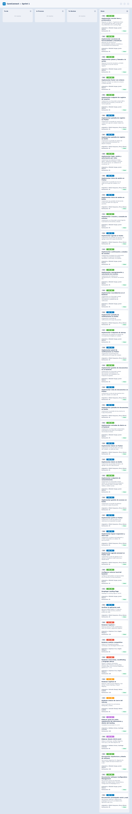

*Board del Sprint 1 en Trello, con los work items organizados en las columnas To-do, In Process, To Review y Done.*

La tabla se organiza por los User Stories definidos en la sección 3.2, descompuestos en work items técnicos. Al final se listan los tasks que no dependen de un User Story en particular, correspondientes a la configuración técnica transversal y a la elaboración del informe.

| User Story Id | User Story Title | Work-Item Id | Work-Item Title | Description | Estimation (Hours) | Assigned To | Status |
|---|---|---|---|---|---|---|---|
| USL01 | Conocer la propuesta de valor | T01 | Implementar sección hero y problemática | Maquetar en React + TypeScript el hero con la propuesta de valor y la sección de problemática de la Landing Page. | 4 | Nikaido Vargas, Javier Masaru | Done |
| USL02 | Explorar beneficios por segmento | T02 | Implementar secciones de funcionalidades y beneficios | Maquetar las secciones de funcionalidades, producto, beneficios y funcionamiento de CareConnect. | 4 | Nikaido Vargas, Javier Masaru | Done |
| USL04 | Iniciar registro desde la landing | T03 | Implementar planes y llamado a la acción | Maquetar la sección de planes y el botón de llamado a la acción hacia el registro. | 3 | Nikaido Vargas, Javier Masaru | Done |
| USL06 | Consultar Términos y Condiciones | T04 | Implementar footer con enlaces | Maquetar el footer con datos de contacto y enlaces del sitio. | 2 | Nikaido Vargas, Javier Masaru | Done |
| US10 | Registrar cuenta | T05 | Implementar endpoint de registro de usuarios | Implementar en el bounded context IAM la persistencia de usuarios y el endpoint de registro con validación de correo duplicado. | 4 | Nikaido Vargas, Javier Masaru | Done |
| US10 | Registrar cuenta | T06 | Implementar pantalla de registro en Flutter | Implementar la pantalla de creación de cuenta de la app del cuidador (web e iOS) consumiendo el endpoint de registro. | 3 | Muñiz Huayanca, Percy Alonso | Done |
| US10 | Registrar cuenta | T07 | Implementar pantalla de registro en Kotlin | Implementar la pantalla de registro de la app del paciente (Android) con Jetpack Compose. | 3 | Muñiz Huayanca, Percy Alonso | Done |
| US11 | Validar acceso por rol | T08 | Implementar login, sesión y autorización por roles | Implementar los endpoints de login, logout, validación de sesión y consulta de usuario actual, con validación de acceso por rol. | 5 | Nikaido Vargas, Javier Masaru | Done |
| US11 | Validar acceso por rol | T09 | Implementar inicio de sesión en Flutter | Implementar la pantalla de inicio de sesión de la app del cuidador y la redirección al inicio según el rol. | 3 | Muñiz Huayanca, Percy Alonso | Done |
| US11 | Validar acceso por rol | T10 | Implementar inicio de sesión en Kotlin | Implementar las pantallas de bienvenida e inicio de sesión de la app del paciente. | 3 | Muñiz Huayanca, Percy Alonso | Done |
| US01 | Registrar evento de salud | T11 | Implementar creación y consulta de eventos | Implementar en el bounded context Agenda la persistencia de eventos y los endpoints de creación y consulta. | 5 | Nikaido Vargas, Javier Masaru | Done |
| US01 | Registrar evento de salud | T12 | Implementar agenda en Kotlin | Implementar las pantallas de agenda y de agregar evento de la app del paciente. | 5 | Muñiz Huayanca, Percy Alonso | Done |
| US02 | Confirmar evento de salud | T13 | Implementar confirmación y estados de eventos | Implementar el endpoint de confirmación y la lógica de transición de estados (pendiente, confirmado, incumplido). | 3 | Nikaido Vargas, Javier Masaru | Done |
| US03 | Reprogramar evento de salud | T14 | Implementar reprogramación y cancelación de eventos | Implementar los endpoints de reprogramación y cancelación de eventos de salud. | 3 | Nikaido Vargas, Javier Masaru | Done |
| US04 | Recibir recordatorios de eventos | T15 | Implementar recordatorios en el backend | Implementar en el bounded context Notificaciones los endpoints de recordatorios y preferencias de notificación. | 4 | Nikaido Vargas, Javier Masaru | Done |
| US04 | Recibir recordatorios de eventos | T16 | Implementar pantalla de notificaciones en Kotlin | Implementar la pantalla de notificaciones de la app del paciente. | 3 | Muñiz Huayanca, Percy Alonso | Done |
| US05 | Recibir alertas de incumplimiento | T17 | Implementar endpoints de alertas | Implementar los endpoints de alertas de incumplimiento dirigidas al cuidador. | 3 | Nikaido Vargas, Javier Masaru | Done |
| US06 | Visualizar notificaciones | T18 | Implementar panel de notificaciones en Flutter | Implementar el panel lateral de notificaciones de la app del cuidador. | 3 | Muñiz Huayanca, Percy Alonso | Done |
| US07 | Subir documento médico | T19 | Implementar gestión de documentos en el backend | Implementar en el bounded context Documentos la persistencia de documentos, sus metadatos y los endpoints de gestión. | 4 | Nikaido Vargas, Javier Masaru | Done |
| US08 | Consultar documentos | T20 | Implementar vista de documentos en Flutter | Implementar la vista de documentos de la app del cuidador con tabla, filtros y panel de detalle. | 4 | Muñiz Huayanca, Percy Alonso | Done |
| US08 | Consultar documentos | T21 | Implementar pantalla de documentos en Kotlin | Implementar la pantalla de documentos de la app del paciente. | 3 | Muñiz Huayanca, Percy Alonso | Done |
| US12 | Escribir nota | T22 | Implementar entradas de diario en el backend | Implementar en el bounded context Diario la persistencia de notas y los endpoints de entradas de diario. | 3 | Nikaido Vargas, Javier Masaru | Done |
| US12 | Escribir nota | T23 | Implementar diario en Flutter | Implementar la vista de diario de la app del cuidador con grilla de notas y editor lateral fijo. | 4 | Muñiz Huayanca, Percy Alonso | Done |
| US12 | Escribir nota | T24 | Implementar diario en Kotlin | Implementar las pantallas de diario y de agregar nota de la app del paciente. | 4 | Muñiz Huayanca, Percy Alonso | Done |
| US14 | Compartir perfil | T25 | Implementar endpoints de consentimiento | Implementar en el bounded context Gestión de Consentimiento los endpoints para compartir perfil, actualizar vistas visibles y validar acceso. | 4 | Nikaido Vargas, Javier Masaru | Done |
| US14 | Compartir perfil | T26 | Implementar gestión de accesos en Kotlin | Implementar la pantalla de gestionar accesos de la app del paciente. | 3 | Muñiz Huayanca, Percy Alonso | Done |
| US15 | Consultar perfil compartido | T27 | Implementar perfil en Flutter | Implementar la vista de perfil en dos columnas con el paciente vinculado y los accesos compartidos. | 3 | Muñiz Huayanca, Percy Alonso | Done |
| USW01 | Gestionar agenda desde la web | T28 | Implementar layout responsive y shell web | Implementar el sistema de breakpoints y el shell compartido con sidebar, cabecera fija y panel de detalle para escritorio. | 6 | Muñiz Huayanca, Percy Alonso | Done |
| USW01 | Gestionar agenda desde la web | T29 | Implementar agenda semanal en Flutter web | Implementar la vista de agenda con la semana completa en siete columnas y detalle lateral. | 6 | Muñiz Huayanca, Percy Alonso | Done |
| — | — | T30 | Configurar entorno local del backend | Configurar Spring Boot con base de datos H2 en memoria y la documentación SpringDoc OpenAPI. | 3 | Nikaido Vargas, Javier Masaru | Done |
| — | — | T31 | Desplegar Landing Page | Desplegar la Landing Page en Vercel. | 2 | Nikaido Vargas, Javier Masaru | Done |
| — | — | T32 | Verificar la aplicación web | Ejecutar análisis estático, 27 tests de widget en cuatro anchos y build de producción web. | 4 | Muñiz Huayanca, Percy Alonso | Done |
| — | — | T33 | Redactar Capítulo I | Redactar Startup Profile, problemática, Lean UX Process y segmentos objetivo. | 12 | Espinoza Cruz, Angela Milagros | Done |
| — | — | T34 | Redactar análisis competitivo | Elaborar el Competitive Analysis Landscape y las estrategias frente a competidores (2.1). | 6 | Espinoza Cruz, Angela Milagros | Done |
| — | — | T35 | Redactar entrevistas, needfinding y lenguaje ubicuo | Diseñar y registrar entrevistas, elaborar User Personas, Journey Maps, Empathy Maps, As-Is Scenario Mapping y glosario (2.2 – 2.4). | 14 | Espinoza Cruz, Angela Milagros | Done |
| — | — | T36 | Redactar Capítulo III | Redactar To-Be Scenario Mapping, User Stories, Product Backlog e Impact Mapping. | 12 | Salcedo Champi, Matias Rodolfo | Done |
| — | — | T37 | Redactar avance de cierre del informe | Iniciar el borrador de conclusiones, bibliografía y anexos. | 3 | Salcedo Champi, Matias Rodolfo | Done |
| — | — | T38 | Elaborar guías de estilo, arquitectura de información y diseño del landing | Completar las secciones 4.1 a 4.3. | 10 | Baldeon Armas, Santiago Armando | Done |
| — | — | T39 | Elaborar diseño UX/UI móvil | Elaborar wireframes, wireflow diagrams, mock-ups y user flow diagrams de la aplicación móvil (4.4). | 8 | Baldeon Armas, Santiago Armando | Done |
| — | — | T40 | Documentar arquitectura y diseño de software | Documentar diagramas C4, diagrama de clases y diseño de base de datos (4.8 – 4.10). | 10 | Nikaido Vargas, Javier Masaru | Done |
| — | — | T41 | Documentar Software Configuration Management | Documentar entorno de desarrollo, gestión de código fuente, convenciones y configuración de despliegue (5.1). | 5 | Nikaido Vargas, Javier Masaru | Done |
| — | — | T42 | Documentar prototipado móvil y web | Documentar capturas y videos de los prototipos (4.5 y 4.7) y el diseño de la aplicación web (4.6). | 8 | Muñiz Huayanca, Percy Alonso | Done |

**Total comprometido:** 204 horas.

**Sprint Goal:** Completar la documentación base del informe (Capítulos I al III), la arquitectura y diseño visual del producto (Capítulo IV) y las primeras evidencias de implementación (Landing Page, Software Configuration Management y Mobile Prototyping), reutilizando como punto de partida el proyecto CareConnect del ciclo anterior.

#### 5.2.2. Implemented Landing Page Evidence

La Landing Page de **CareConnect** fue implementada utilizando **React, TypeScript y Vite** y se encuentra desplegada mediante **Vercel**.

**Repositorio:** `https://github.com/CareStacks/Landing-Page`  
**Landing Page:** `https://landing-page-lovat-ten.vercel.app/`

##### Deployment Evidence


*Figura 12. Evidencia del despliegue de la Landing Page de CareConnect.*

---

##### Home and Problem Section


*Figura 13. Home y presentación de la problemática de CareConnect.*

---

##### Features Section


*Figura 14. Funcionalidades principales presentadas en la Landing Page.*

---

##### Product, Benefits and How It Works


*Figura 15. Presentación del producto, beneficios y funcionamiento de CareConnect.*

---

##### Plans, Contact and Footer


*Figura 16. Planes, llamada a la acción y footer de la Landing Page.*
#### 5.2.3. Implemented Frontend-Web Application Evidence

**Cambios de implementación:**

- **Sistema de layout responsive** (`core/layout/care_breakpoints.dart`): tres anchos de referencia resueltos con `MediaQuery`, sin paquetes externos — bottom nav y columna única por debajo de 768px, sidebar en riel de íconos entre 768–1279px, sidebar con etiquetas y panel de detalle desde 1280px.
- **Shell compartido** (`core/widgets/care_app_shell.dart`): sidebar fijo, cabecera fija, panel de detalle a la derecha en escritorio; barra superior y bottom nav en angosto.
- **Jerarquía visual en 4 niveles**: `CareCard` ahora tiene variantes *hero*, *standard*, *quiet* y *flat*, reemplazando el uso repetido de una sola tarjeta con el mismo radio y sombra.
- **Pantallas rediseñadas**: Inicio (grilla con hero del próximo evento, cifras del día y panel de paciente/invitaciones/actividad), Agenda (semana completa en 7 columnas con detalle lateral), Documentos (tabla con filtros y panel de detalle en vez de tarjetas apiladas), Diario (grilla de notas con editor fijo lateral), Perfil (dos columnas) y Login (rediseñado por ser la primera pantalla del producto).
- **Tipografía**: Inter cargada por `<link>` en `web/index.html`, con la stack del sistema como respaldo; cifras de horas y métricas con `FontFeature.tabularFigures`.
- **Paleta de colores**: sin modificaciones respecto a `app_colors.dart` — verificado que no existen literales `Color(0x...)` fuera de ese archivo.
- La capa de datos (`lib/features/*/data/`) no fue modificada; solo se trabajó sobre `presentation/`.

**Verificación:** análisis estático limpio, 27 tests de widget que montan las cinco pantallas principales y el panel de notificaciones en cuatro anchos distintos (detectando y corrigiendo 5 desbordes reales de layout), y build de producción (`flutter build web --release`) exitoso.

A continuación, evidencia de la aplicación web corriendo localmente contra el backend de CareConnect API, con datos de prueba reales (paciente vinculado a cuidador vía el módulo de Gestión de Consentimiento).

| Pantalla | Captura |
|---|---|
| Perfil |  |
| Inicio de sesión |  |
| Registro |  |
| Home (Cuidador) |  |
| Agenda |  |
| Diario |  |
| Documentos |  |
| Notificaciones |  |

#### 5.2.4. Implemented Native-Mobile Application Evidence

La evidencia nativa móvil de CareStacks cubre ambos segmentos objetivo y ambas plataformas: **iOS**, con la aplicación Flutter del segmento cuidador (compartida con la versión web, §5.2.3), y **Android**, con la aplicación nativa Kotlin + Jetpack Compose del segmento paciente. Las capturas se tomaron con el backend local (CareConnect API) conectado y datos de prueba reales (un paciente vinculado a un cuidador mediante el módulo de Gestión de Consentimiento).

**iOS — Segmento Cuidador (Flutter)**

| Pantalla | Captura |
|---|---|
| Perfil |  |
| Inicio de sesión |  |
| Registro |  |
| Home (Cuidador) |  |
| Agenda |  |
| Diario |  |
| Documentos |  |
| Notificaciones |  |

**Video del prototipo (iOS):** [Ver video](https://youtu.be/050WhJadiuY)

**Android — Segmento Paciente (Kotlin + Jetpack Compose)**

| Pantalla | Captura |
|---|---|
| Perfil |  |
| Inicio / Bienvenida |  |
| Inicio de sesión |  |
| Registro |  |
| Home (Paciente) |  |
| Agenda |  |
| Agregar evento de agenda |  |
| Diario |  |
| Agregar nota de diario |  |
| Documentos |  |
| Notificaciones |  |
| Gestionar accesos |  |

**Video del prototipo (Android):** [Ver video](https://upcedupe-my.sharepoint.com/:v:/g/personal/u202319563_upc_edu_pe/IQCxyxzTeImsTaBVopDNXHyUAdGQYZnmlXXGn62jhU8cayU?nav=eyJyZWZlcnJhbEluZm8iOnsicmVmZXJyYWxBcHAiOiJPbmVEcml2ZUZvckJ1c2luZXNzIiwicmVmZXJyYWxBcHBQbGF0Zm9ybSI6IldlYiIsInJlZmVycmFsTW9kZSI6InZpZXciLCJyZWZlcnJhbFZpZXciOiJNeUZpbGVzTGlua0NvcHkifX0&e=noqJKl)

#### 5.2.5. Implemented RESTful API and/or Serverless Backend Evidence

El backend de CareStacks se implementó con **Spring Boot 4 + Java 25**, reutilizando como base la arquitectura del proyecto anterior (CareConnect), organizado en seis bounded contexts: IAM, Agenda, Notificaciones, Diario, Documentos y Gestión de Consentimiento. Para desarrollo local se utiliza una base de datos **H2 en memoria** (modo compatibilidad PostgreSQL), lo que permite levantar el backend sin dependencias externas.

El backend fue ejecutado y validado localmente, confirmando el correcto arranque del servidor Tomcat embebido, la inicialización de los repositorios JPA y la exposición de la documentación interactiva vía Swagger/OpenAPI, cubriendo todos los endpoints implementados en los seis bounded contexts.

#### 5.2.6. RESTful API documentation

La documentación de la API se generó automáticamente mediante **SpringDoc OpenAPI**, disponible en `/swagger-ui.html`. A continuación se detallan los endpoints expuestos por cada bounded context del sistema, así como los esquemas (DTOs y requests) que estructuran los datos intercambiados.


*Figura 17. Endpoints del módulo Gestión de Consentimiento (`/api/consents`) y Documents (`/api/documents`): compartir perfil, actualizar vistas visibles, validar acceso, y gestión de documentos médicos.*


*Figura 18. Endpoints del módulo Diary (`/api/diary`) y Notifications (`/api/notifications`): entradas de diario, recordatorios, alertas y preferencias de notificación.*


*Figura 19. Endpoints del módulo IAM (`/api/auth`): registro, login, logout, validación de sesión y consulta de usuario actual.*


*Figura 20. Endpoints del módulo Agenda (`/api/agenda`): creación, consulta, reprogramación, confirmación y cancelación de eventos de salud.*


*Figura 21. Esquemas de datos documentados automáticamente por SpringDoc: DTOs y requests de los módulos Notifications, Diary, Consents y Agenda.*


*Figura 22. Esquemas de datos documentados automáticamente por SpringDoc: DTOs y requests de los módulos Documents, Diary, Consents, IAM y Agenda.*

#### 5.2.7. Team Collaboration Insights

Esta sección presenta la evidencia de colaboración del equipo a lo largo de los cuatro repositorios que conforman la solución de CareStacks: el informe del proyecto, el backend, la aplicación móvil y la aplicación web. Los gráficos de contribuciones (GitHub Insights → Contributors) muestran la participación de cada integrante mediante commits realizados durante el sprint.

#### Repositorio del Informe (`carestacks-report`)


*Figura 23. Gráfico de contribuciones del repositorio `carestacks-report`, mostrando los commits de cada integrante del equipo durante la elaboración del informe.*

#### Repositorio del Backend (`carestacks-backend-api`)


*Figura 24. Gráfico de contribuciones del repositorio `carestacks-backend-api`, correspondiente al trabajo de implementación y configuración del backend RESTful.*

#### Repositorio de la Aplicación Móvil (`carestacks-mobile-app`)


*Figura 25. Gráfico de contribuciones del repositorio `carestacks-mobile-app`, correspondiente al trabajo sobre la aplicación Flutter del segmento cuidador.*

#### Repositorio de la Aplicación Web (`carestacks-web`)


*Figura 26. Gráfico de contribuciones del repositorio `carestacks-web`, correspondiente a la adaptación de la base Flutter al segmento cuidador para escritorio.*

#### Interpretación

La distribución de commits entre los cuatro repositorios refleja la división de trabajo definida en el Sprint Backlog (§5.2.1): mientras el repositorio del informe concentra la participación distribuida de los cinco integrantes según la sección del reporte a su cargo, los repositorios de backend, móvil y web muestran una concentración de commits en los integrantes directamente responsables de esas capas de implementación durante este sprint, consistente con la asignación de tareas técnicas del equipo.

### 5.3. Video About-the-Product

El Video About-the-Product presenta el modelo de negocio de CareConnect y sus características principales, dirigido tanto a los visitantes del Landing Page que buscan conocer la propuesta de valor como a los usuarios de las aplicaciones que desean realizar las tareas soportadas por la solución.

**URL (OneDrive/Stream):** https://upcedupe-my.sharepoint.com/:v:/g/personal/u202319881_upc_edu_pe/IQD9H0d9sU4tQJuKV5PStHyuAYjfXdpoDfRe-xCc_R1401s

> **Pendiente:** falta el screenshot del video, la URL de la versión publicada en YouTube (usada para incrustarse en el Landing Page), la duración exacta y confirmar que se incluye al menos un testimonio positivo de un usuario que haya participado en las entrevistas de validación, tal como lo exige la rúbrica.

---

# Part II: Verification, Validation & Pipeline

## Capítulo VI: Product Verification & Validation

### 6.1. Testing Suites & Validation

#### 6.1.1. Core Entities Unit Tests

#### 6.1.2. Core Integration Tests

#### 6.1.3. Core Behavior-Driven Development

#### 6.1.4. Core System Tests

### 6.2. Static testing & Verification

#### 6.2.1. Static Code Analysis

##### 6.2.1.1. Coding standard & Code conventions

##### 6.2.1.2. Code Quality & Code Security

#### 6.2.2. Reviews

### 6.3. Validation Interviews

#### 6.3.1. Diseño de Entrevistas

#### 6.3.2. Registro de Entrevistas

#### 6.3.3. Evaluaciones según heurísticas

### 6.4. Auditoría de Experiencias de Usuario

#### 6.4.1. Auditoría realizada

##### 6.4.1.1. Información del grupo auditado

##### 6.4.1.2. Cronograma de auditoría realizada

##### 6.4.1.3. Contenido de auditoría realizada

#### 6.4.2. Auditoría recibida

##### 6.4.2.1. Información del grupo auditor

##### 6.4.2.2. Cronograma de auditoría recibida

##### 6.4.2.3. Contenido de auditoría recibida

##### 6.4.2.4. Resumen de modificaciones para subsanar hallazgos

## Capítulo VII: DevOps Practices

### 7.1. Continuous Integration

#### 7.1.1. Tools and Practices

#### 7.1.2. Build & Test Suite Pipeline Components

### 7.2. Continuous Delivery

#### 7.2.1. Tools and Practices

#### 7.2.2. Stages Deployment Pipeline Components

### 7.3. Continuous deployment

#### 7.3.1. Tools and Practices

#### 7.3.2. Production Deployment Pipeline Components

### 7.4. Continuous Monitoring

#### 7.4.1. Tools and Practices

#### 7.4.2. Monitoring Pipeline Components

#### 7.4.3. Alerting Pipeline Components

#### 7.4.4. Notification Pipeline Components

---

# Part III: Experiment-Driven Lifecycle

## Capítulo VIII: Experiment-Driven Development

### 8.1. Experiment Planning

#### 8.1.1. As-Is Summary

#### 8.1.2. Raw Material: Assumptions, Knowledge Gaps, Ideas, Claims

#### 8.1.3. Experiment-Ready Questions

#### 8.1.4. Question Backlog

#### 8.1.5. Experiment Cards

### 8.2. Experiment Design

#### 8.2.1. Hypotheses

#### 8.2.2. Domain Business Metrics

#### 8.2.3. Measures

#### 8.2.4. Conditions

#### 8.2.5. Scale Calculations and Decisions

#### 8.2.6. Methods Selection

#### 8.2.7. Data Analytics: Goals, KPIs and Metrics Selection

#### 8.2.8. Web and Mobile Tracking Plan

### 8.3. Experimentation

#### 8.3.1. To-Be User Stories

#### 8.3.2. To-Be Product Backlog

#### 8.3.3. Pipeline-supported, Experiment-Driven To-Be Software Platform Lifecycle

##### 8.3.3.1. To-Be Sprint Backlogs

##### 8.3.3.2. Implemented To-Be Landing Page Evidence

##### 8.3.3.3. Implemented To-Be Frontend-Web Application Evidence

##### 8.3.3.4. Implemented To-Be Native-Mobile Application Evidence

##### 8.3.3.5. Implemented To-Be RESTful API and/or Serverless Backend Evidence

##### 8.3.3.6. Team Collaboration Insights

#### 8.3.4. To-Be Validation Interviews

##### 8.3.4.1. Diseño de Entrevistas

##### 8.3.4.2. Registro de Entrevistas

### 8.4. Experiment Aftermath & Analysis

#### 8.4.1. Analysis and Interpretation of Results

#### 8.4.2. Re-scored and Re-prioritized Question Backlog

### 8.5. Continuous Learning

#### 8.5.1. Shareback Session Artifacts: Learning Workflow

### 8.6. To-Be Software Platform Pre-launch

#### 8.6.1. About-the-Product Intro Video

#### 8.6.2. Resumen usando Gees Framework

---

## Conclusiones

### Conclusiones y recomendaciones

El Problem Statement planteado en la sección de Lean UX Problem Statements identificaba como brecha central la falta de coordinación entre cuidadores que atienden a un mismo paciente geriátrico, con tres consecuencias concretas: la imposibilidad de confirmar si otra persona ya administró una dosis, la omisión de dosis por parte del paciente ante la duda, y la reconstrucción manual del historial de evolución. Las entrevistas realizadas en el capítulo de Requirements Elicitation & Analysis confirman esta brecha con evidencia directa: la totalidad de los cuidadores entrevistados señaló la falta de coordinación en los cambios de turno como su principal problema, y la totalidad de los pacientes entrevistados reportó dudas sobre si ya había tomado una dosis. Esta evidencia valida el vacío declarado en el Problem Statement y respalda que la propuesta de valor de CareConnect apunta al problema correcto.

Respecto a las Lean UX Assumptions, la evidencia recogida valida de forma consistente las suposiciones referidas a los usuarios y a los beneficios que estos obtendrían del producto: los cuidadores entrevistados emplean el teléfono móvil como herramienta principal de su jornada, confirmando la suposición de negocio correspondiente, y combinan pastilleros o cuadernos con alarmas del celular sin que ninguna herramienta esté integrada, lo cual coincide con los puntos de dolor declarados. Sin embargo, dos supuestos permanecen sin evidencia propia en esta entrega: la suposición de negocio sobre el modelo freemium no fue explorada con los cuidadores ni con los pacientes entrevistados, y las entrevistas del primer segmento cubrieron únicamente a cuidadores informales, de modo que queda pendiente validar las suposiciones de negocio asociadas a los cuidadores formales, tales como enfermeros o técnicos de salud en atención domiciliaria.

En cuanto a los seis Hypothesis Statements formulados, ninguno ha sido sometido todavía a un experimento formal, dado que el capítulo de Experiment-Driven Development corresponde a una entrega posterior dentro del ciclo de vida del proyecto. No obstante, el análisis cualitativo de las entrevistas ofrece evidencia de plausibilidad para las primeras tres hipótesis: la totalidad de los cuidadores solicitó de manera espontánea contar con un registro compartido en tiempo real y con la confirmación de la medicación administrada, funcionalidades que corresponden directamente a las suposiciones de características sobre las cuales se construyen dichas hipótesis. Las tres hipótesis restantes cuentan con un respaldo menor en esta entrega, pues solo uno de los cuidadores entrevistados mencionó explícitamente la falta de apoyo profesional inmediato, y ninguno de los participantes se refirió de forma espontánea a la posibilidad de compartir el perfil del paciente con otros cuidadores; por ello, estas hipótesis requieren una validación específica antes de poder considerarse confirmadas.

Como recomendación para el roadmap del proyecto, se propone priorizar durante la fase de Experiment-Driven Development los experimentos asociados a las tres primeras hipótesis, dado que cuentan con la evidencia cualitativa más sólida obtenida en esta entrega, y diseñar un experimento adicional dirigido específicamente a cuidadores formales con el fin de cerrar la brecha de validación de las suposiciones de negocio correspondientes. Asimismo, se recomienda incorporar en una futura ronda de entrevistas una pregunta explícita sobre la disposición de los participantes a compartir el perfil del paciente y a pagar por funcionalidades avanzadas, de manera que la hipótesis relacionada con la compartición de perfil y la suposición de negocio sobre el modelo freemium cuenten con evidencia propia antes de invertir en su desarrollo.

---

## Bibliografía

Beard, J. R., Officer, A., de Carvalho, I. A., et al. (2016). The World report on ageing and health: A policy framework for healthy ageing. *The Lancet*, *387*(10033), 2145–2154. https://doi.org/10.1016/S0140-6736(15)00516-4

Instituto Nacional de Estadística e Informática. (2024). *Situación de la población adulta mayor: Informe técnico N.° 01*. https://www.inei.gob.pe/media/MenuRecursivo/boletines/informe-tecnico-poblacion-adulta-mayor.pdf

Microsoft. (s.f.). *REST API guidelines*. GitHub. https://github.com/microsoft/api-guidelines

Organización Mundial de la Salud. (2025). *Ageing and health*. https://www.who.int/news-room/fact-sheets/detail/ageing-and-health

The Cucumber Open Source Project. (s.f.). *Gherkin reference*. Cucumber. https://cucumber.io/docs/gherkin/reference/

---

## Anexos

### Anexo A: Archivo de Figma

[CareConnect — Web Applications UX/UI Design (4.6)](https://www.figma.com/design/1TzGaaQLzkBu26Ojno1AVU/CareConnect-%E2%80%94-Web-Applications-UX-UI-Design--4.6-?node-id=4-5&p=f), con las páginas de wireframes, mock-ups y wireflows de la aplicación web referenciadas en el Capítulo IV.

### Anexo B: Video de Entrevistas

[Video de entrevistas a cuidadores y pacientes geriátricos](https://upcedupe-my.sharepoint.com/:v:/g/personal/u202319881_upc_edu_pe/IQAd7joONgjbTYJ4N_xUFvPXAcOMtAz8WbmokiYYCP5M3T0), publicado en Microsoft Stream, con las seis entrevistas registradas en 2.2.2.

### Anexo C: Repositorios de Producto

| Repositorio | URL |
|---|---|
| Informe del proyecto (`carestacks-report`) | https://github.com/upc-pre-202620-1asi0732-9100-carestacks/carestacks-report |
| Backend / Web Services (`carestacks-backend-api`) | https://github.com/upc-pre-202620-1asi0732-9100-carestacks/carestacks-backend-api |
| Frontend Web (`carestacks-web`) | https://github.com/upc-pre-202620-1asi0732-9100-carestacks/carestacks-web |
| Landing Page (`Landing-Page`) | https://github.com/CareStacks/Landing-Page |

### Anexo: Videos
| Entrega | Título | Enlace (Microsoft Stream) |
|---------|--------|---------------------------|
| AV1 | Video About-the-Product | https://upcedupe-my.sharepoint.com/:v:/g/personal/u202319881_upc_edu_pe/IQD9H0d9sU4tQJuKV5PStHyuAYjfXdpoDfRe-xCc_R1401s |
| AV1 | Video de exposición | \<url> |
