<!--
=====================================================================
 PLANTILLA — Informe de Trabajo Final · 1ASI0732 Diseño de Experimentos
 Un solo archivo README.md (archivo principal del repositorio del informe).
 Estructura completa según el statement: 3 Partes, 8 Capítulos + anexos.
 Reemplazar cada <placeholder> y cada bloque > _Guía:_ con el contenido real.
 Recordar: actualizar y VERIFICAR la Tabla de Contenidos antes de cada entrega.
=====================================================================
-->

# Informe de Trabajo Final

<!-- CARÁTULA -->

**Universidad Peruana de Ciencias Aplicadas (UPC)**

Carrera de Ingeniería de Software

Ciclo académico: **2026-20**

Curso: **1ASI0732 — Diseño de Experimentos de Ingeniería de Software**

NRC: **9100**

Profesor: **Sanchez Ponce, Alex Humberto**

**Informe de Trabajo Final**

Startup: **CareStacks**

Producto: **CareConnect**

**Relación de integrantes:**

| Código      | Apellidos y Nombres |
|-------------|---------------------|
| U202319698  | Salcedo Champi, Matias Rodolfo |
| U20221G099  | Nikaido Vargas, Javier Masaru |
| U202319563  | Muñiz Huayanca, Percy Alonso |
| U202415495  | Espinoza Cruz, Angela Milagros |
| U202319881  | Baldeon Armas, Santiago Armando |

**Septiembre 2026**

---

## Registro de Versiones del Informe

> _Guía:_ Resumen de modificaciones relevantes durante el ciclo de vida. Una línea por versión, **un solo autor por línea**. La primera línea es la versión inicial. Modificaciones relevantes: adición/eliminación de secciones, correcciones/mejoras por feedback del docente o autocrítica del equipo.

| Versión | Fecha (YYYY-MM-DD) | Autor | Descripción de modificación |
|---------|--------------------|-------|-----------------------------|
| 1.0     | \<fecha>           | \<Apellidos, Nombres> | \<descripción> |

---

## Project Report Collaboration Insights

> _Guía:_ Indicar el URL del repositorio del Project Report en la organización GitHub del equipo. Por cada entrega, explicar cómo se desarrollaron las actividades del informe e incluir **capturas de los analíticos de colaboración y commits** en GitHub. Todos los integrantes deben participar. Debe ser coherente con el Registro de Versiones.

- Repositorio del informe: \<url-repo-github>

---

## Tabla de Contenidos

<!-- 4 niveles. Verificar los anclajes (#) antes de cada entrega: GitHub genera el ancla a partir del texto del título. -->

- [Student Outcome](#student-outcome)
- [Part I: As-Is Software Project](#part-i-as-is-software-project)
  - [Capítulo I: Introducción](#capítulo-i-introducción)
    - [1.1. Startup Profile](#11-startup-profile)
      - [1.1.1. Descripción de la Startup](#111-descripción-de-la-startup)
      - [1.1.2. Perfiles de integrantes del equipo](#112-perfiles-de-integrantes-del-equipo)
    - [1.2. Solution Profile](#12-solution-profile)
      - [1.2.1. Antecedentes y problemática](#121-antecedentes-y-problemática)
      - [1.2.2. Lean UX Process](#122-lean-ux-process)
    - [1.3. Segmentos objetivo](#13-segmentos-objetivo)
  - [Capítulo II: Requirements Elicitation & Analysis](#capítulo-ii-requirements-elicitation--analysis)
    - [2.1. Competidores](#21-competidores)
    - [2.2. Entrevistas](#22-entrevistas)
    - [2.3. Needfinding](#23-needfinding)
    - [2.4. Ubiquitous Language](#24-ubiquitous-language)
  - [Capítulo III: Requirements Specification](#capítulo-iii-requirements-specification)
    - [3.1. To-Be Scenario Mapping](#31-to-be-scenario-mapping)
    - [3.2. User Stories](#32-user-stories)
    - [3.3. Product Backlog](#33-product-backlog)
    - [3.4. Impact Mapping](#34-impact-mapping)
  - [Capítulo IV: Product Design](#capítulo-iv-product-design)
    - [4.1. Style Guidelines](#41-style-guidelines)
    - [4.2. Information Architecture](#42-information-architecture)
    - [4.3. Landing Page UI Design](#43-landing-page-ui-design)
    - [4.4. Mobile Applications UX/UI Design](#44-mobile-applications-uxui-design)
    - [4.5. Mobile Applications Prototyping](#45-mobile-applications-prototyping)
    - [4.6. Web Applications UX/UI Design](#46-web-applications-uxui-design)
    - [4.7. Web Applications Prototyping](#47-web-applications-prototyping)
    - [4.8. Domain-Driven Software Architecture](#48-domain-driven-software-architecture)
    - [4.9. Software Object-Oriented Design](#49-software-object-oriented-design)
    - [4.10. Database Design](#410-database-design)
  - [Capítulo V: Product Implementation](#capítulo-v-product-implementation)
    - [5.1. Software Configuration Management](#51-software-configuration-management)
    - [5.2. Product Implementation & Deployment](#52-product-implementation--deployment)
    - [5.3. Video About-the-Product](#53-video-about-the-product)
- [Part II: Verification, Validation & Pipeline](#part-ii-verification-validation--pipeline)
  - [Capítulo VI: Product Verification & Validation](#capítulo-vi-product-verification--validation)
    - [6.1. Testing Suites & Validation](#61-testing-suites--validation)
    - [6.2. Static testing & Verification](#62-static-testing--verification)
    - [6.3. Validation Interviews](#63-validation-interviews)
    - [6.4. Auditoría de Experiencias de Usuario](#64-auditoría-de-experiencias-de-usuario)
  - [Capítulo VII: DevOps Practices](#capítulo-vii-devops-practices)
    - [7.1. Continuous Integration](#71-continuous-integration)
    - [7.2. Continuous Delivery](#72-continuous-delivery)
    - [7.3. Continuous deployment](#73-continuous-deployment)
    - [7.4. Continuous Monitoring](#74-continuous-monitoring)
- [Part III: Experiment-Driven Lifecycle](#part-iii-experiment-driven-lifecycle)
  - [Capítulo VIII: Experiment-Driven Development](#capítulo-viii-experiment-driven-development)
    - [8.1. Experiment Planning](#81-experiment-planning)
    - [8.2. Experiment Design](#82-experiment-design)
    - [8.3. Experimentation](#83-experimentation)
    - [8.4. Experiment Aftermath & Analysis](#84-experiment-aftermath--analysis)
    - [8.5. Continuous Learning](#85-continuous-learning)
    - [8.6. To-Be Software Platform Pre-launch](#86-to-be-software-platform-pre-launch)
- [Matriz de Evaluación Ética y de Impacto](#matriz-de-evaluación-ética-y-de-impacto)
- [Conclusiones](#conclusiones)
- [Bibliografía](#bibliografía)
- [Anexos](#anexos)

---

## Student Outcome

> _Guía:_ Colocar el párrafo introductorio idéntico al Anexo A del statement. Una subsección por alumno describiendo la relación outcome–dimensiones–trabajo. En "Acciones realizadas" identificar cada participante y por entrega (AV1, TP, AV2, TB2). "Conclusiones" grupales y acumulables.

El curso contribuye al cumplimiento del Student Outcome ABET:

**ABET – EAC – Student Outcome 4**
**Criterio:** La capacidad de reconocer responsabilidades éticas y profesionales en situaciones de ingeniería y hacer juicios informados, que deben considerar el impacto de las soluciones de ingeniería en contextos globales, económicos, ambientales y sociales.

| Criterio específico | Acciones realizadas | Conclusiones |
|---------------------|---------------------|--------------|
| **4.c.1** Reconoce responsabilidad ética y profesional en situaciones de ingeniería de software | \<Apellidos, Nombres> AV1: \<acciones> TP: … AV2: … TB2: … | \<conclusiones grupales acumulables> |
| **4.c.2** Emite juicios informados considerando el impacto de las soluciones de ingeniería de software en contextos globales, económicos, ambientales y sociales | \<Apellidos, Nombres> AV1: \<acciones> TP: … AV2: … TB2: … | \<conclusiones grupales acumulables> |

---

# Part I: As-Is Software Project

## Capítulo I: Introducción

### 1.1. Startup Profile

#### 1.1.1. Descripción de la Startup
> _Guía:_ Descripción de CareStacks.

#### 1.1.2. Perfiles de integrantes del equipo
> _Guía:_ Por integrante: foto, nombres y apellidos, código, descripción de carrera y párrafo de conocimientos técnicos/habilidades que aporta.

### 1.2. Solution Profile

#### 1.2.1. Antecedentes y problemática
> _Guía:_ Enunciado del problema aplicando 5W+2H (Who, What, Where, When, Why, How, How Much). Objetivos y restricciones que delimitan el alcance.

#### 1.2.2. Lean UX Process

##### 1.2.2.1. Lean UX Problem Statements
> _Guía:_ Domain, customer segments, pain points, gap, vision/strategy, initial segment.

##### 1.2.2.2. Lean UX Assumptions

##### 1.2.2.3. Lean UX Hypothesis Statements

##### 1.2.2.4. Lean UX Canvas

### 1.3. Segmentos objetivo
> _Guía:_ Descripción de segmentos con características demográficas e información estadística de sustento.

## Capítulo II: Requirements Elicitation & Analysis

### 2.1. Competidores

#### 2.1.1. Análisis competitivo
> _Guía:_ Competitive Analysis Landscape (mín. 3 competidores directos) + SWOT enfocado en la competencia.

#### 2.1.2. Estrategias y tácticas frente a competidores

### 2.2. Entrevistas

#### 2.2.1. Diseño de entrevistas
> _Guía:_ Preguntas principales y complementarias por segmento.

#### 2.2.2. Registro de entrevistas
> _Guía:_ **3 a 5 entrevistas por segmento.** Nombres, apellidos, edad, distrito, screenshot y URL de Microsoft Stream con timing y duración. Resumen por entrevista.

#### 2.2.3. Análisis de entrevistas
> _Guía:_ Análisis por segmento con sustento estadístico (porcentajes).

### 2.3. Needfinding

#### 2.3.1. User Personas
> _Guía:_ Una ficha por segmento (UXPressia).

#### 2.3.2. User Task Matrix

#### 2.3.3. User Journey Mapping
> _Guía:_ Versión As-Is, uno por User Persona (UXPressia).

#### 2.3.4. Empathy Mapping

#### 2.3.5. As-is Scenario Mapping
> _Guía:_ Uno por User Persona (LucidChart/Miro). Filas Phases, Doing, Thinking, Feeling + áreas positivas/negativas/blank.

### 2.4. Ubiquitous Language
> _Guía:_ Glosario del dominio, términos en inglés, sin términos técnicos de ingeniería de software.

## Capítulo III: Requirements Specification

### 3.1. To-Be Scenario Mapping

### 3.2. User Stories

### 3.3. Product Backlog

### 3.4. Impact Mapping

## Capítulo IV: Product Design

### 4.1. Style Guidelines

#### 4.1.1. General Style Guidelines

CareConnect busca un tono que transmita **calidez humana, confianza y claridad**, propio de un producto que media el cuidado de personas mayores o dependientes entre pacientes, cuidadores (familiares o profesionales) y personal médico. La comunicación evita la frialdad clínica de un software hospitalario tradicional y prioriza beneficios emocionales antes que técnicos: la propia landing page abre con "Organiza el cuidado diario de tus seres queridos" y "una herramienta diseñada para brindar **paz mental** a las familias", no con una lista de funciones.

**Dimensiones de tono**

| Dimensión | Posición de CareConnect | Justificación |
|---|---|---|
| Divertido ↔ Serio | Cercano al polo **Serio** | Se maneja información de salud (medicación, diagnósticos, adherencia a tratamiento); el copy de la landing usa términos como "ansiedad", "incumplimiento" y "urgente" sin suavizarlos, priorizando la seriedad del caso de uso. |
| Formal ↔ Casual | Punto medio, ligeramente **Casual** | Los saludos personalizados ("Hola, Mariana", "Buenos días") y CTAs cortos ("Comienza ahora") son casuales, pero los formularios (Crear cuenta, Compartir perfil) mantienen etiquetas formales en mayúsculas. |
| Respetuoso ↔ Irreverente | Totalmente **Respetuoso** | Ningún microcopy usa humor; incluso los estados negativos se comunican con vocabulario neutro y accionable ("Omisión de medicación", "Resolver"), nunca alarmista sin salida. |
| Entusiasta ↔ Sereno | Cercano al polo **Sereno** | Paleta suave, tipografía redondeada y mensajes como "Podrás revocar este acceso en cualquier momento" transmiten control y calma frente a una tarea que de por sí genera estrés (cuidar a un familiar). |

**Branding**

El wordmark "Care Connect" se presenta partido en dos líneas con un ícono de conexión (barra vertical + curva) a la izquierda, en el color violeta/índigo institucional. La marca se sostiene en fotografía real de vínculo intergeneracional (abuela y cuidadora abrazadas) tanto en la landing como en la pantalla de bienvenida de la app, reforzando "cuidado que se siente como en casa" por sobre la estética de dashboard médico.

**Typography**

Se identifica una única familia **sans-serif geométrica/redondeada**, con pesos diferenciados por jerarquía (no dos familias como se estimó preliminarmente): peso *bold/extrabold* para titulares y wordmark, peso *regular/medium* para cuerpo de texto, y una variante en mayúsculas con tracking amplio para labels de formulario ("CORREO DEL CUIDADOR", "PERMISOS DE ACCESO"). Jerarquía observada: H1 ~40px (hero de landing), H2 ~28px ("Funciones principales", "Cómo funciona"), H3 ~18–20px (nombre de card/paciente), cuerpo 15–16px, caption/label 11–12px.

**Colors**

| Color | Uso |
|---|---|
| Violeta/Índigo primario (~#6C5CE7) | CTA principal en landing ("Probar app", "Comienza ahora") y en app ("Confirmar toma", "Compartir perfil", "Subir documento"), ícono activo del bottom nav, borde de badge "Cuidador". |
| Navy/Índigo oscuro (~#1E1B4B) | Titulares de landing, wordmark, texto de alto contraste. |
| Negro/Carbón (~#1A1A1A) | Botón "Elegir plan" del Plan Anual y badge "AHORRA MÁS", usado como acento de contraste para el plan destacado, diferenciándolo del violeta usado en el resto del producto. |
| Crema/Arena (~#FDF6EC) | Fondo general de la app (Inicio, Perfil, Documentos, Diario) y de la card "Bienestar hoy" en el hero de landing. |
| Verde salvia / menta (badge "Paciente", card "Bienestar hoy") | Estados positivos y el rol Paciente. |
| Lavanda claro (card "Acceso compartido" en Funciones principales) | Resalta la función diferencial del producto (compartir cuidado) sobre el resto de tarjetas en blanco. |
| Naranja (badge "PENDIENTE", "Evento no confirmado") | Alertas de atención media. |
| Rojo (badge "URGENTE", "Alerta de incumplimiento") | Estados críticos que requieren acción inmediata. |
| Gris/blanco | Badge "LEÍDO", texto secundario, bordes y campos de formulario. |

**Spacing**

Unidad base de 8px. Las tarjetas de landing y de app comparten el mismo radio de borde amplio (16–24px), y los botones usan radio total tipo *pill*. En la landing, las secciones se separan por bandas de fondo alterno (blanco / crema) en vez de líneas divisorias, patrón que se replica en la app entre el header y el contenido scrolleable.

#### 4.1.2. Web Style Guidelines

La landing page de CareConnect ya está en producción como sitio web responsivo y define el estándar a extender a un eventual panel de escritorio para cuidadores profesionales:

- **Header fijo (sticky)**: logo a la izquierda, navegación central (Inicio, Funciones, Beneficios, Precio, Contacto) y CTA violeta "Probar app" a la derecha, visible en todo momento durante el scroll.
- **Grid**: hero en dos columnas (contenido + mockup de teléfono) en desktop, que colapsa a una columna en mobile; las secciones de beneficios y funciones usan grillas de 3 y de 2–3 columnas respectivamente, con gutter generoso.
- **Componentes**: `Card` para beneficios/funciones/planes, `Badge` para "AHORRA MÁS", `Button` primario (violeta, relleno) y secundario (violeta, outline) — mismo componente reutilizado en toda la web y coherente con los botones de la app.
- **Breakpoints**: mobile (<768px, una columna, nav colapsado a menú hamburguesa), tablet (768–1024px), desktop (>1024px, layout de dos columnas en el hero tal como está implementado).
- **Interacción**: transiciones suaves (~200ms) en hover de botones y tarjetas; el mockup del teléfono en el hero refuerza visualmente el producto real sin necesidad de video o animación compleja.

#### 4.1.3. Mobile Style Guidelines

##### 4.1.3.1. iOS Mobile Style Guidelines

- Tipografía del sistema **SF Pro** para elementos nativos (notificaciones push, teclado, `UIDatePicker`), reservando la tipografía de marca para textos propios de la app.
- Respeto de **Safe Area** superior (notch/Dynamic Island): el header "CareConnect" con ícono de escudo/seguridad y campana de notificaciones se ubica debajo del área segura, como se ve en la pantalla de bienvenida implementada.
- Bottom Tab Bar nativo con 5 ítems (Inicio, Agenda, Documentos, Diario, Perfil), ícono e label activos en violeta.
- Selector de fecha (`Fecha del documento` en Subir documento) debe usar el `UIDatePicker` nativo tipo rueda, más apto para usuarios mayores que un teclado numérico libre.

##### 4.1.3.2. Android Mobile Style Guidelines

- Alineado a **Material Design 3**, tipografía Roboto para componentes nativos, manteniendo la tipografía de marca en headers custom.
- **Ripple effect** en botones primarios ("Confirmar toma", "Compartir perfil", "Subir documento") para reforzar feedback táctil.
- Bottom Navigation Bar de Material con indicador tipo "pill" violeta detrás del ítem activo.
- `Snackbar` para confirmaciones no críticas (ej. "Documento subido") y `AlertDialog` reservado para acciones sensibles como revocar el acceso de un cuidador.

### 4.2. Information Architecture

#### 4.2.1. Organization Systems

La arquitectura se organiza en tres capas:

1. **Por rol** (definido en el registro: Paciente o Cuidador), que determina el copy y alcance de cada módulo — ej. Documentos dice "Gestiona y revisa el historial médico de forma segura" para el paciente y "Archivos compartidos de Elena García para su seguimiento médico" para el cuidador.
2. **Por paciente vinculado**: un cuidador puede tener varios "Pacientes asignados"; el dashboard del cuidador lista cada paciente con su estado ("Activo") y permite entrar a su ficha completa (nombre, condición clínica, movilidad, plan emocional y preferencias).
3. **Por permiso granular**: el flujo "Compartir perfil" introduce un sistema de permisos explícito por módulo (Agenda, Documentos, Diario), de forma que el paciente decide **qué** puede ver cada cuidador, no solo **quién** tiene acceso.

#### 4.2.2. Labeling Systems

| Etiqueta | Contenido que representa |
|---|---|
| Inicio | Dashboard con resumen del paciente/pacientes: medicación pendiente, resumen del día. |
| Agenda | Calendario de medicación, terapias y citas médicas del día/mes. |
| Documentos | Historial médico digitalizado (recetas, laboratorios, informes, carnet de vacunación). |
| Diario | Registro del bienestar diario: síntomas, ánimo, alimentación, presión, glucosa. |
| Perfil | Datos de cuenta, rol, verificación y gestión de accesos. |
| Confirmar toma | Registrar que una dosis de medicación fue administrada. |
| Compartir perfil | Invitar a un cuidador por correo y otorgarle permisos específicos. |
| Gestionar accesos | Ver y revocar los permisos otorgados a cuidadores. |
| Pacientes asignados / vinculados | Listado de pacientes bajo cuidado de un cuidador. |
| Resumen del día / de tareas | Contadores de eventos pendientes, confirmados/completados e incumplidos/omitidos. |
| Notificaciones | Centro de alertas: eventos no confirmados, incumplimientos, documentos actualizados, recordatorios. |

#### 4.2.3. SEO Tags and Meta Tags

**Landing Page**

| Tag | Valor |
|---|---|
| Title | CareConnect — Organiza el cuidado diario de tus seres queridos |
| Description | Gestiona tratamientos, citas y recordatorios en un solo lugar. CareConnect brinda paz mental a las familias y el mejor cuidado para los mayores. |
| Keywords | cuidado de adultos mayores, app de cuidadores, agenda de medicación, historial médico digital, diario de bienestar, acceso compartido, cuidado geriátrico. |
| Author | Equipo CareConnect |

**Web / Mobile Application**

| Tag | Valor |
|---|---|
| Title | CareConnect App — Panel de Cuidado y Seguimiento |
| Description | Agenda de medicación, documentos médicos, diario de bienestar y acceso compartido para pacientes y cuidadores. |
| Keywords | agenda de medicación, historial clínico, diario del paciente, cuidador familiar, permisos de acceso, notificaciones de salud. |
| Author | Equipo CareConnect |

#### 4.2.4. Searching Systems

- **Documentos**: barra "Buscar documentos…" que filtra por nombre, tipo (Receta, Laboratorio, Informe, Vacuna, PDF, Digital, Imagen, DOCX) y sección (Recientes / Historial anual), cada resultado con badge de tipo codificado por color.
- **Agenda**: navegación por calendario (mes/día) con selector "◀ Octubre 2023 ▶", en vez de buscador de texto libre, dado que el usuario busca por fecha, no por palabra clave.
- **Notificaciones**: no hay buscador; se resuelve por orden cronológico inverso y por badges de estado (Pendiente, Urgente, Leído) que permiten escanear prioridad visualmente.

#### 4.2.5. Navigation Systems

- **Bottom Nav persistente** (Inicio, Agenda, Documentos, Diario, Perfil) idéntico en estructura para Paciente y Cuidador, con ítem activo resaltado en violeta.
- **Navegación de flujo con retorno explícito** ("←") en tareas puntuales: Subir documento, Compartir perfil, Notificaciones — todas permiten volver sin perder el contexto de origen.
- **Accesos rápidos contextuales**: el dashboard del cuidador incluye botones directos "Revisar agenda", "Ver documentos", "Ver diario" **del paciente actualmente enfocado**, evitando pasar por el bottom nav para tareas de seguimiento inmediato.
- **Navegación cruzada Paciente ↔ Cuidador**: desde el Perfil del paciente, "Compartir perfil" abre el flujo que —del lado del cuidador— se traduce en un nuevo "Paciente vinculado" visible en su propio dashboard y Perfil.

### 4.3. Landing Page UI Design

#### 4.3.1. Landing Page Wireframe

La estructura de la landing sigue una jerarquía descendente clásica de conversión:

1. **Header** fijo: logo, navegación (Inicio, Funciones, Beneficios, Precio, Contacto), CTA "Probar app".
2. **Hero**: titular + subtítulo + doble CTA ("Comienza ahora" / "Ver funciones") + mockup del dashboard real de la app.
3. **Beneficios** ("Pensado para pacientes, cuidadores y familias"): 3 columnas con ícono, título y descripción.
4. **Proceso** ("Cómo funciona"): 3 pasos numerados.
5. **Funciones principales**: grilla de 5 tarjetas (una destacada — Acceso compartido).
6. **Planes** ("Planes simples para tu cuidado diario"): 2 tarjetas de precio comparadas.

#### 4.3.2. Landing Page Mock-up

**Elementos del Diseño**

| Elemento | Justificación |
|---|---|
| Colour | El violeta se reserva para toda acción de conversión (Probar app, Comienza ahora, Elegir plan del plan mensual, Ver funciones), mientras que el negro/carbón se usa exclusivamente en el "Plan Anual" y su badge "AHORRA MÁS", generando un contraste deliberado que dirige la mirada hacia el plan que la empresa quiere vender más. La tarjeta "Acceso compartido" usa fondo lavanda en lugar de blanco, destacándola visualmente sobre las otras cuatro funciones sin necesidad de texto adicional ("función diferencial"). |
| Shape | Las tarjetas de beneficios, funciones y planes comparten el mismo radio de borde amplio que las tarjetas dentro de la app (Inicio, Documentos, Diario), generando continuidad formal entre el sitio público y el producto. Los pasos de "Cómo funciona" usan círculos numerados en vez de íconos, priorizando la secuencia sobre la ilustración. |
| Size | El titular del hero es el elemento tipográfico más grande de toda la landing, seguido de los títulos de sección ("Funciones principales", "Cómo funciona") y por último el cuerpo de cada tarjeta. Los precios ("$15", "$150") son notablemente más grandes que el resto del texto de su tarjeta, priorizando el dato de decisión de compra. |
| Space | Cada sección de la landing está delimitada por espacio vertical amplio y no por líneas, replicando el patrón "banda de color alterno" (blanco / crema) para separar bloques sin saturar. |
| Direction | El flujo es estrictamente vertical y de conversión creciente: hero (propuesta de valor) → beneficios (por qué importa) → cómo funciona (cómo se usa) → funciones (qué incluye) → planes (cuánto cuesta), acompañando el recorrido natural de decisión de un usuario que evalúa contratar el servicio para su familia. |
| Texture | El mockup del teléfono en el hero muestra la app real en uso (no una ilustración genérica), funcionando como prueba social implícita de que el producto ya existe y funciona. |

**Heurísticas de Usabilidad (Jakob Nielsen)**

| Heurística | Justificación |
|---|---|
| H1 – Visibilidad del estado del sistema | El mockup del hero muestra el estado real de la app (medicación "PENDIENTE", resumen "4 / 12 / 0"), comunicando al visitante qué va a ver exactamente al instalar la app, sin necesidad de descripciones abstractas. |
| H2 – Relación sistema/mundo real | El copy usa vocabulario familiar del cuidado cotidiano ("ansiedad de no saber si se han seguido las pautas", "caos de papeles y chats grupales") en vez de terminología de producto SaaS, conectando directamente con el dolor real del usuario objetivo (familias cuidadoras). |
| H4 – Consistencia y estándares | El botón "Probar app" del header y "Comienza ahora" del hero usan el mismo estilo violeta relleno, mientras "Ver funciones" usa el mismo violeta en outline, estableciendo desde el primer vistazo qué botón es la acción primaria y cuál la secundaria en toda la página. |
| H6 – Reconocer antes que recordar | Las dos tarjetas de precio muestran sus features completas en la misma vista (sin acordeones ni "ver más"), permitiendo comparar Plan Mensual vs. Plan Anual sin necesidad de recordar los datos de una al leer la otra. |
| H8 – Diseño estético y minimalista | Cada sección limita su contenido a lo esencial: 3 beneficios, 3 pasos, 5 funciones, 2 planes — números redondos y escaneables que evitan la fatiga de decisión en una landing dirigida también a usuarios mayores o poco digitales. |

**Principios de Arquitectura de Información**

| Principio | Justificación |
|---|---|
| Choices | La sección de planes ofrece exactamente dos alternativas comparables (Mensual vs. Anual), con el ahorro anual explícito ("2 meses gratis"), simplificando la decisión de compra a un solo criterio dominante (compromiso corto vs. ahorro). |
| Disclosure | La landing revela información en capas: el hero comunica el beneficio central en una frase, "Funciones principales" detalla el qué, y el precio se posterga hasta el final, cuando el usuario ya entendió el valor — evitando anclar la conversación en el costo antes que en el beneficio. |
| Exemplars | El mockup del hero usa un caso concreto y humano ("Hola, Mariana", Losartán 50mg, 8:00 a.m.) en lugar de datos genéricos tipo "Usuario X", haciendo tangible el producto desde el primer segundo. |

**Principios de Inclusive Design**

| Principio | Justificación |
|---|---|
| P2 – Considera la situación del usuario | El público de la landing incluye adultos mayores y familiares con distinta alfabetización digital; el copy evita jerga técnica y los CTAs son cortos y directos ("Comienza ahora"), reduciendo la carga cognitiva de la primera visita. |
| P6 – Prioriza el contenido | La tarjeta "Acceso compartido" se destaca cromáticamente sobre el resto de funciones porque es el diferenciador competitivo real del producto (coordinación entre múltiples cuidadores), priorizándola sin necesidad de agrandar su tamaño. |
| P7 – Agrega valor | Mostrar el resumen del día (pendientes/confirmados/incumplidos) directamente en el hero, antes de que el usuario cree una cuenta, agrega valor al anticipar el tipo de control y tranquilidad que tendrá una vez dentro del producto. |

### 4.4. Mobile Applications UX/UI Design

#### 4.4.1. Mobile Applications Wireframes

**Elementos del Diseño**

| Elemento | Justificación |
|---|---|
| Shape | Ya desde el wireframe, las tarjetas de tarea (medicación, cita, paseo) y de paciente usan rectángulos de esquinas redondeadas, mientras que los avatares de paciente son placeholders circulares, estableciendo la distinción forma-persona vs. forma-contenido desde la etapa de baja fidelidad. |
| Size | En "Inicio (Cuidador)" el saludo "Hola, Patricia" y el nombre del paciente "Elena García" son los elementos de mayor jerarquía tipográfica de la pantalla, por encima de los datos de la tarea (Losartán 50mg), priorizando el reconocimiento de personas sobre el detalle clínico en el primer vistazo. |
| Space | En Agenda, el espacio entre eventos del día (Toma de Medicación, Paseo Jardín, Cita Médica) es uniforme y suficiente para lectura rápida con el pulgar, consistente con el contexto de uso mientras se atiende a un paciente. |
| Direction | El wireframe de Agenda ordena los eventos del día de forma cronológica ascendente (09:00 → 11:30 → 02:00 PM), replicando el orden natural en que ocurrirán, y coloca "+ Agregar evento" al final del flujo de lectura, no al inicio, para no interrumpir el repaso del día. |
| Line | Los únicos bordes explícitos del wireframe son los del calendario (Agenda) y los campos de formulario (Crear cuenta, Iniciar sesión); el resto de la separación entre secciones se resuelve por espacio, validando que la jerarquía funciona incluso sin color. |

**Heurísticas de Usabilidad (Jakob Nielsen)**

| Heurística | Justificación |
|---|---|
| H1 – Visibilidad del estado del sistema | Cada evento de Agenda muestra su badge de estado (COMPLETADO, PRÓXIMO, PENDIENTE) directamente en la fila, sin necesidad de abrir el detalle, ya desde el wireframe de baja fidelidad. |
| H3 – Libertad y control del usuario | El wireframe de "Compartir Perfil" incluye una "✕" de cierre además del posible retorno, dando al usuario dos formas de abandonar el flujo de invitar a un cuidador sin completar la acción. |
| H4 – Consistencia y estándares | El bottom nav de 5 ítems (Inicio, Agenda, Documentos, Diario, Perfil) aparece idéntico en wireframe tanto para "Inicio (Cuidador)" como en Agenda, confirmando que la estructura de navegación se definió antes que el estilo visual. |
| H5 – Prevención de errores | En Crear Cuenta (wireframe), la selección de rol usa botones exclusivos tipo radio (Paciente / Cuidador) en vez de checkboxes, evitando que el sistema reciba una combinación de roles inválida. |
| H6 – Reconocer antes que recordar | El wireframe de "Compartir Perfil" ya contempla, antes del alto nivel de fidelidad, una lista explícita de permisos por módulo (Agenda, Documentos, Diario) visibles simultáneamente, evitando que el paciente deba recordar qué otorgó al cuidador en una pantalla previa. |

**Principios de Arquitectura de Información**

| Principio | Justificación |
|---|---|
| Objects | Desde el wireframe, cada evento de Agenda se define como un objeto con atributos propios (hora, título, descripción, estado), anticipando la estructura de datos que luego alimentará también las Notificaciones (mismo tipo de evento, distinto canal de visualización). |
| Choices | El wireframe de "Perfil" ofrece explícitamente dos variantes según rol —Perfil (Paciente) con "Gestionar accesos" y Perfil (Cuidador) con "Ver pacientes asignados"— validando la ramificación de la arquitectura por rol antes de invertir en diseño visual. |
| Front doors | Los tres wireframes de Perfil/Compartir Perfil/Perfil (Cuidador) están diseñados para ser autosuficientes: cada uno repite el header con logo y controles de cierre, de modo que un usuario que entra directo a "Compartir Perfil" desde una notificación entiende igual el contexto. |

**Principios de Inclusive Design**

| Principio | Justificación |
|---|---|
| P3 – Sé consistente | El patrón "avatar + nombre + badge de estado" se repite idéntico entre el wireframe de paciente en Inicio (Cuidador) y el de evento en Agenda, reduciendo la curva de aprendizaje entre módulos desde la etapa de boceto. |
| P5 – Ofrece opciones | El wireframe de Iniciar Sesión contempla tanto el ingreso por correo/contraseña como el enlace "¿Olvidaste tu contraseña?", cubriendo desde baja fidelidad el caso de usuario recurrente que no logra autenticarse. |

#### 4.4.2. Mobile Applications Wireflow Diagrams

Un wireflow por objetivo de usuario (*user goal*):

1. **Registro y selección de rol**: Bienvenida → Crear cuenta (datos + rol Paciente/Cuidador + aceptación de términos) → Inicio según rol.
2. **Inicio de sesión**: Bienvenida → Iniciar sesión (correo/contraseña) → [¿Credenciales válidas?] → Sí: Inicio / No: error + "¿Olvidaste tu contraseña?".
3. **Confirmar toma de medicación (Cuidador)**: Inicio (Cuidador) → tarjeta "Elena – 8:00 a.m. PENDIENTE" → "Confirmar toma" → resumen de tareas se actualiza (COMPLETADO +1) sin salir del dashboard.
4. **Compartir el perfil con un nuevo cuidador (Paciente)**: Perfil (Paciente) → "Gestionar accesos"/"Compartir perfil" → ingresar correo del cuidador → seleccionar permisos (Agenda/Documentos/Diario) → "Compartir perfil" → confirmación → el paciente aparece como "Paciente vinculado" en el Perfil del cuidador invitado.
5. **Revisar y resolver notificaciones (Cuidador)**: Inicio (Cuidador) → ícono de campana → Notificaciones → [tipo de alerta] → Evento no confirmado: "Confirmar" / Alerta de incumplimiento: "Resolver" / Documento actualizado: "Ver" → retorno a Notificaciones con el ítem actualizado.
6. **Registrar un evento en Agenda**: Agenda → "+ Agregar evento" → completar tipo, hora y detalle → guardar → el evento aparece en "Eventos de hoy" en su posición cronológica correspondiente.
7. **Subir un documento médico**: Documentos → "Subir documento" → seleccionar archivo → tipo/descripción/fecha → "Subir documento" → documento visible en "Recientes".

#### 4.4.3. Mobile Applications Mock-ups

**Mock-ups de diseño (alta fidelidad)**

**Elementos del Diseño**

| Elemento | Justificación |
|---|---|
| Colour | El violeta como color de acción única se mantiene disciplinadamente en toda la app de alta fidelidad: "Confirmar toma", "Compartir perfil", "Subir documento" comparten el mismo tono exacto, enseñando al usuario a reconocer la acción principal en cualquier pantalla sin ambigüedad. Los badges de rol usan color semántico propio: verde para "Paciente", violeta/azulado para "Cuidador", distinguiendo identidad de estado. |
| Shape | En "Compartir perfil", la ilustración circular de manos entrelazadas (en violeta) humaniza una pantalla técnica de permisos, coherente con el tono cálido definido en 4.1.1, y contrasta con los checkboxes cuadrados de permisos, diferenciando "emoción" de "configuración" dentro de la misma pantalla. |
| Size | En Documentos, el tipo de archivo (PDF, Digital, Imagen, DOCX) se muestra como badge pequeño bajo el nombre del documento, mientras que el nombre del documento es el elemento de mayor tamaño de cada fila, priorizando qué es el documento sobre en qué formato está. |
| Texture | El ícono de escudo junto a la hora en el header de la app implementada (pantalla de Bienvenida) comunica seguridad de forma persistente y sutil, sin necesidad de un texto explicativo adicional. |

**Heurísticas de Usabilidad (Jakob Nielsen)**

| Heurística | Justificación |
|---|---|
| H1 – Visibilidad del estado del sistema | En Compartir perfil, los checkboxes de "Agenda" y "Documentos" aparecen premarcados mientras "Diario" no, comunicando una configuración de permisos sugerida por defecto (información operativa sí, notas íntimas de bienestar no) que el paciente puede ajustar antes de confirmar. |
| H3 – Libertad y control del usuario | El texto "Podrás revocar este acceso en cualquier momento desde tu configuración" en Compartir perfil reduce la fricción emocional de otorgar acceso a datos de salud, al garantizar reversibilidad antes de que el usuario decida compartir. |
| H5 – Prevención de errores | En Subir documento, el límite de archivo ("PDF, JPG o PNG hasta 10MB") y los consejos de captura ("Evita reflejos de luz directamente sobre el papel") se muestran antes de intentar la subida, anticipando los errores más comunes en usuarios que fotografían documentos físicos. |
| H9 – Reconocer y recuperarse de errores | En Notificaciones, cada alerta trae su propia acción de resolución en el mismo ítem ("Confirmar", "Resolver", "Ver", "Registrar"), evitando que el cuidador deba navegar a otro módulo para atender el problema señalado. |

**Principios de Arquitectura de Información**

| Principio | Justificación |
|---|---|
| Multiple classification | Un documento puede localizarse por tipo (Receta, Laboratorio, Informe, Vacuna), por recencia (Recientes) o por período (Historial anual), atendiendo distintos modelos mentales de búsqueda según si el usuario recuerda el nombre, la fecha o la categoría clínica. |
| Growth | El sistema de permisos de Compartir perfil está preparado para escalar a más módulos sin rediseño: cada nuevo módulo de la app (ej. un futuro "Finanzas del cuidado") solo necesitaría sumarse como una fila más de checkbox en la misma pantalla. |

**Principios de Inclusive Design**

| Principio | Justificación |
|---|---|
| P1 – Proporciona experiencias comparables | Perfil (Paciente) y Perfil (Cuidador) comparten exactamente la misma estructura visual (foto, nombre, badge de rol, acciones de cuenta, métricas destacadas), garantizando una experiencia igualmente completa y reconocible para ambos roles. |
| P4 – Deja al usuario mandar | El paciente decide qué comparte (Compartir perfil) y puede revocarlo después (Gestionar accesos); el sistema nunca otorga visibilidad automática de los datos sensibles del Diario a un cuidador sin consentimiento explícito. |

**Aplicación móvil — pantallas implementadas**

Estas capturas —correspondientes a un caso de uso con mayor detalle clínico (paciente geriátrica con HTA y diabetes tipo 2, cuidadora con formación de enfermería)— validan que el sistema de diseño definido en 4.1 se sostiene al escalar la complejidad de los datos reales: los mismos badges de estado, la misma paleta y la misma estructura de tarjeta funcionan tanto para un caso simple (Losartán, un solo recordatorio) como para un plan de cuidado geriátrico integral con múltiples medicamentos, controles y notas de bienestar.

#### 4.4.4. Mobile Applications User Flow Diagrams

Un user flow por objetivo de usuario, contemplando *happy path* y *unhappy path*:

1. **Registrarse en la plataforma**
   - *Happy path*: Bienvenida → Crear cuenta → completar datos → seleccionar rol → aceptar términos → cuenta creada → Inicio.
   - *Unhappy path*: campo obligatorio vacío o términos no aceptados → botón "Crear cuenta" inhabilitado/error inline → usuario corrige → reintenta.

2. **Iniciar sesión**
   - *Happy path*: Iniciar sesión → credenciales correctas → Inicio según rol.
   - *Unhappy path*: credenciales incorrectas → mensaje de error → "¿Olvidaste tu contraseña?" → recuperación → nuevo intento.

3. **Confirmar toma de medicación**
   - *Happy path*: Inicio (Cuidador) → tarea "PENDIENTE" → "Confirmar toma" → contador "COMPLETADOS" se actualiza.
   - *Unhappy path*: el cuidador no confirma en el horario → el sistema reclasifica el evento como "INCUMPLIDO"/"OMITIDO" → se genera una "Alerta de incumplimiento" en Notificaciones para seguimiento.

4. **Compartir el perfil con un cuidador**
   - *Happy path*: Perfil (Paciente) → Compartir perfil → correo del cuidador + permisos seleccionados → "Compartir perfil" → invitación enviada → el cuidador ve al paciente en "Pacientes vinculados".
   - *Unhappy path*: correo inválido o cuidador ya vinculado → el sistema muestra el error en el campo → usuario corrige el correo y reenvía la invitación.

5. **Revisar y resolver una notificación**
   - *Happy path*: campana de notificaciones → alerta "Evento no confirmado" → "Confirmar" → notificación pasa a resuelta.
   - *Unhappy path*: alerta "Urgente" (omisión de medicación) sin resolver a tiempo → permanece visible en "Estado de hoy" hasta que el cuidador ejecuta "Resolver", evitando que se pierda entre notificaciones ya leídas.

6. **Subir un documento médico**
   - *Happy path*: Documentos → Subir documento → archivo válido → tipo/descripción/fecha → "Subir documento" → documento visible en "Recientes".
   - *Unhappy path*: archivo excede 10MB o formato no soportado → el sistema rechaza el archivo mostrando el requisito ("PDF, JPG o PNG hasta 10MB") → usuario selecciona un archivo válido y reintenta.

7. **Registrar un evento en Agenda**
   - *Happy path*: Agenda → "+ Agregar evento" → completar hora, tipo y detalle → guardar → evento visible en "Eventos de hoy" en su horario correspondiente.
   - *Unhappy path*: hora del evento en conflicto con otro ya registrado → el sistema advierte el solapamiento antes de guardar → usuario ajusta el horario y confirma.

## 4.5. Mobile Applications Prototyping

Esta sección documenta el prototipado interactivo de la aplicación móvil de CareStacks. Para cubrir ambos segmentos objetivo (cuidador y paciente) y ambas plataformas nativas, se utilizaron dos bases de código distintas heredadas del proyecto anterior:

- **iOS → segmento Cuidador**, con la aplicación desarrollada en **Flutter**.
- **Android → segmento Paciente**, con la aplicación nativa desarrollada en **Kotlin + Jetpack Compose**.

### 4.5.1. Android Mobile Applications Prototyping

El prototipo fue ejecutado y validado en un emulador Android, correspondiente a la aplicación nativa en **Kotlin + Jetpack Compose**, enfocada en el segmento **paciente**: consulta de agenda, diario personal, documentos médicos y notificaciones desde la perspectiva del paciente geriátrico.

| Pantalla | Captura |
|---|---|
| Perfil | 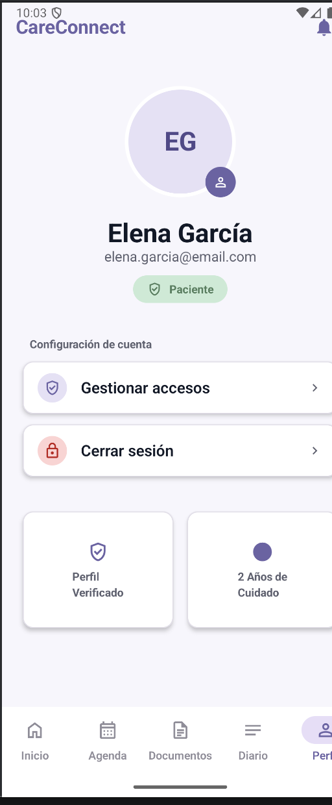 |
| Inicio de sesión | 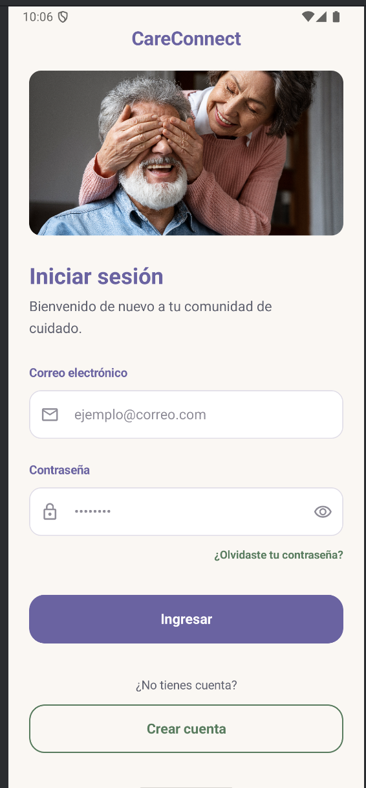 |
| Registro | 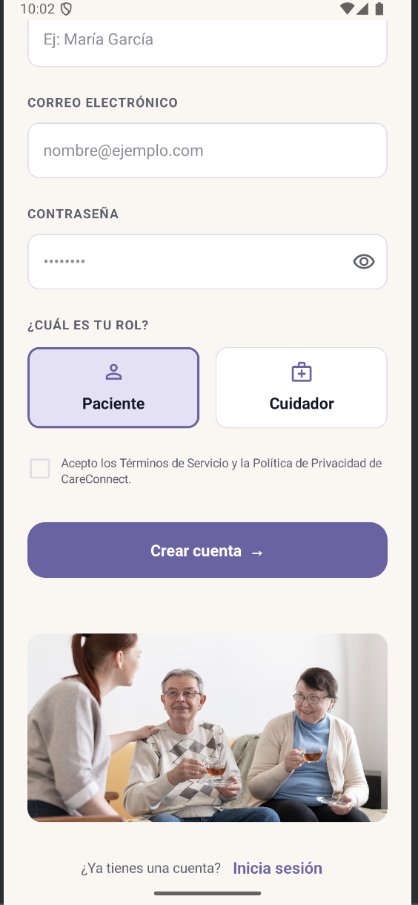 |
| Home (Paciente) | 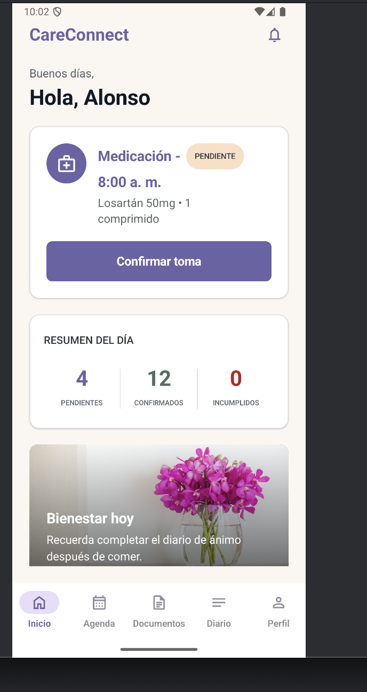 |
| Agenda | 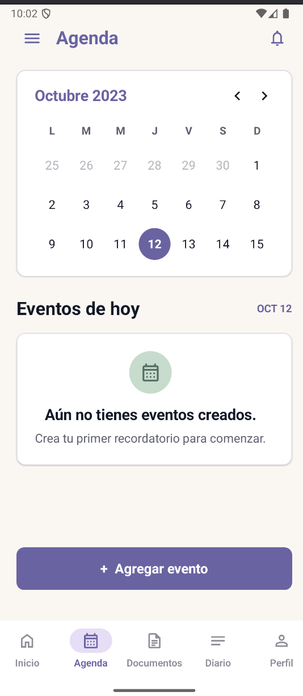 |
| Diario | 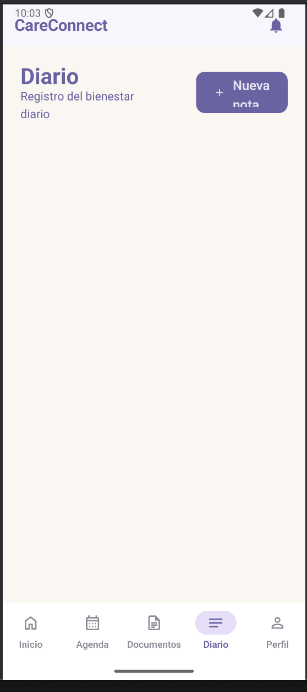 |
| Documentos | 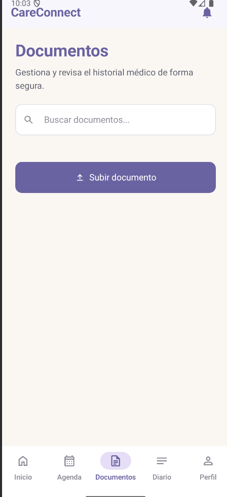 |
| Notificaciones | 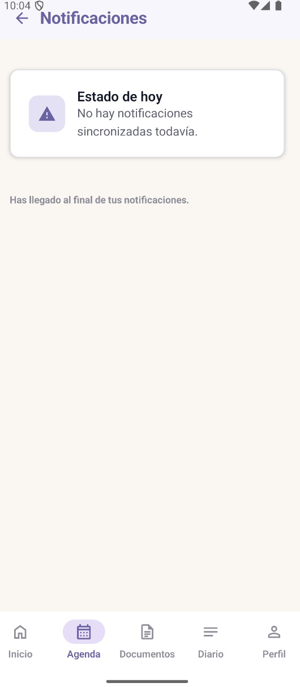 |

**Video del prototipo (Android):** [Enlace al video](PENDIENTE)

### 4.5.2. iOS Mobile Applications Prototyping

El prototipo fue ejecutado y validado en un simulador de iOS, correspondiente a la aplicación multiplataforma en **Flutter**, enfocada en el segmento **cuidador**: gestión de pacientes asignados, agenda, diario compartido, documentos médicos y notificaciones. Las capturas fueron tomadas con el backend local (CareConnect API) conectado y datos de prueba reales (un paciente vinculado a un cuidador mediante el módulo de Gestión de Consentimiento).

| Pantalla | Captura |
|---|---|
| Perfil | 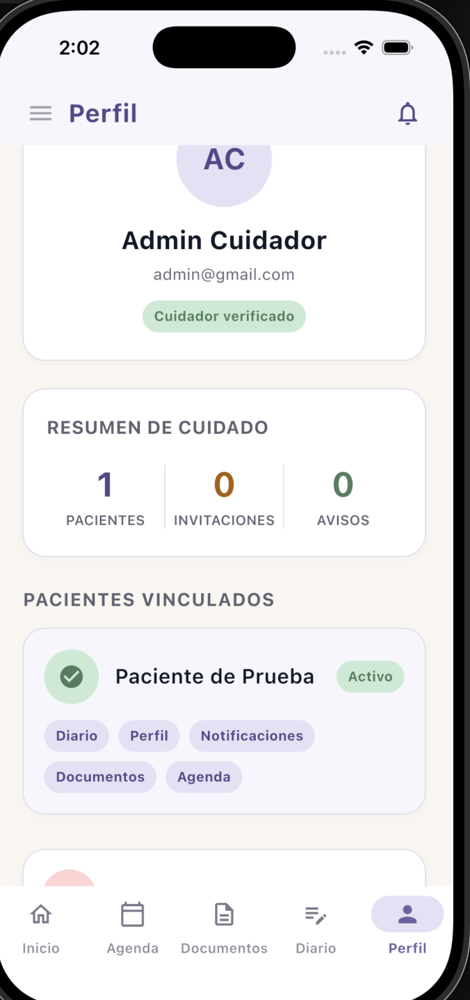 |
| Inicio de sesión | 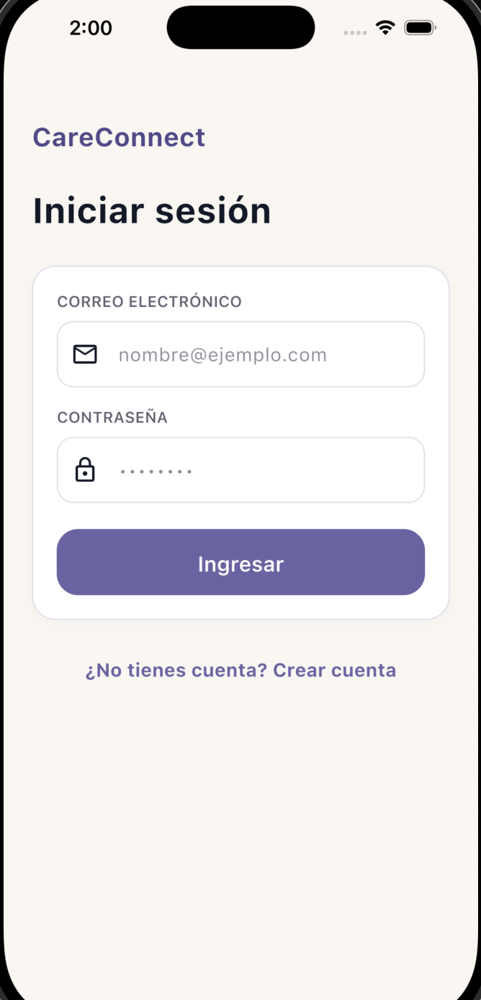 |
| Registro | 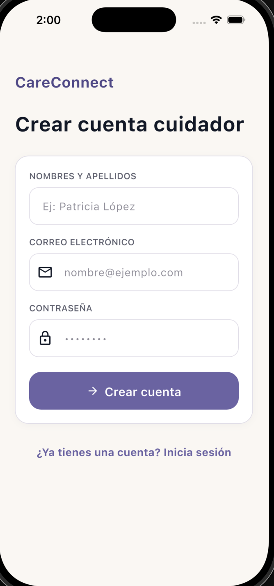 |
| Home (Cuidador) | 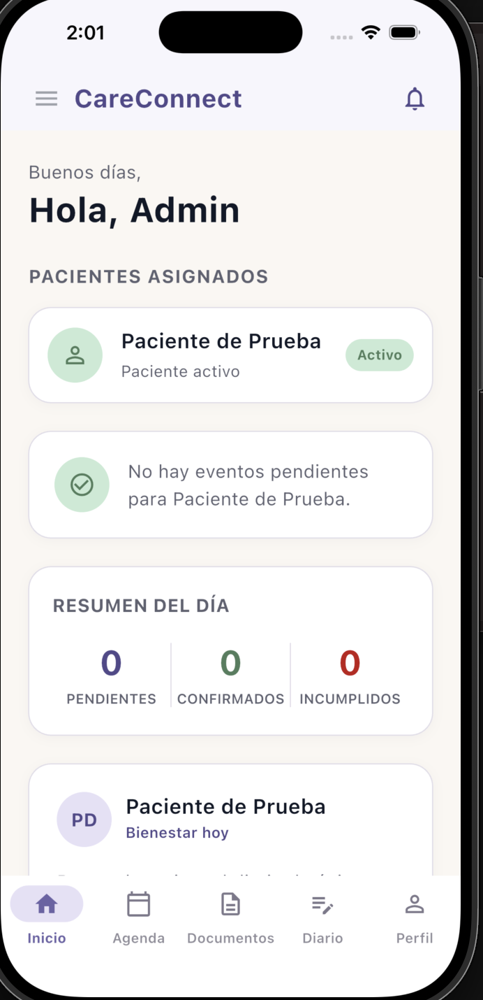 |
| Agenda | 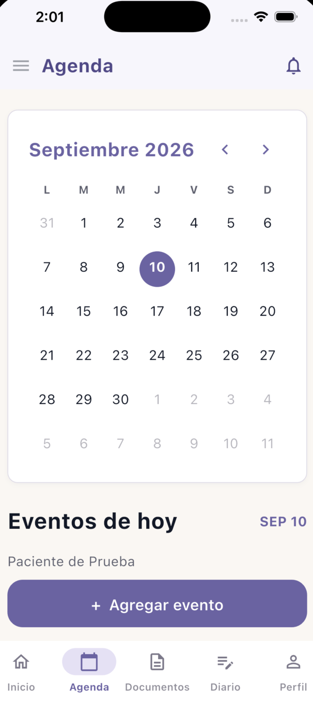 |
| Diario | 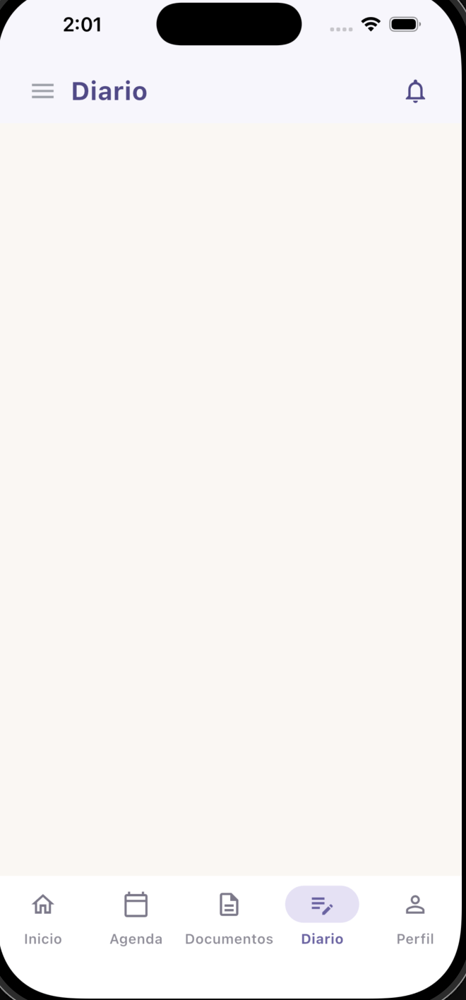 |
| Documentos | 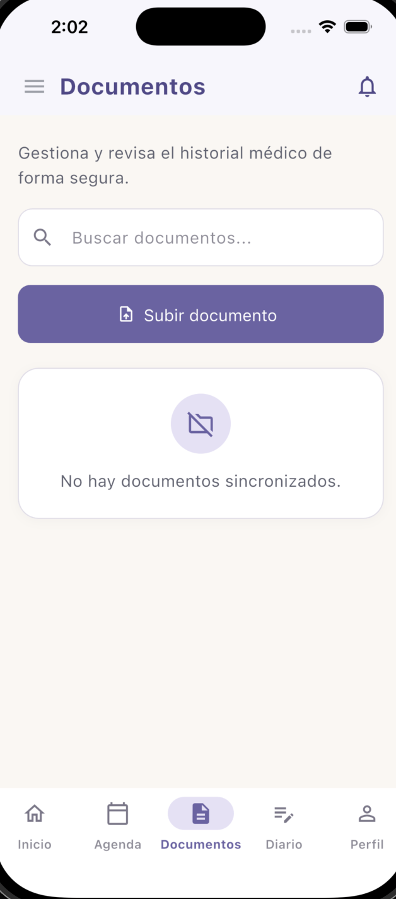 |
| Notificaciones | 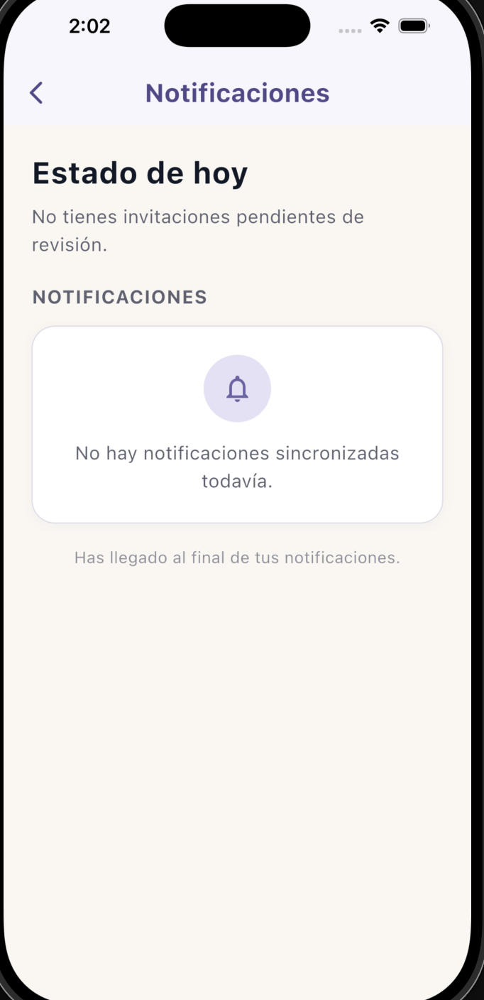 |

**Video del prototipo (iOS):** [Ver video](https://youtu.be/050WhJadiuY)

### 4.6. Web Applications UX/UI Design

#### 4.6.1. Web Applications Wireframes

#### 4.6.2. Web Applications Wireflow Diagrams

#### 4.6.3. Web Applications Mock-ups

#### 4.6.4. Web Applications User Flow Diagrams

### 4.7. Web Applications Prototyping
> _Guía:_ Prototipo navegable Desktop + Mobile Web Browser. Screenshot + video en Microsoft Stream.

### 4.8. Domain-Driven Software Architecture

La arquitectura de software de **CareConnect** se define tomando como base los principios de Domain-Driven Design (DDD) y el modelo C4. El diseño busca separar las responsabilidades del negocio mediante bounded contexts con límites explícitos, manteniendo al mismo tiempo una arquitectura que permita que las diferentes aplicaciones cliente consuman los servicios centrales del producto.

A nivel estratégico, CareConnect se encuentra organizado en seis bounded contexts: **Agenda, Notificaciones, Documentos, Gestión de Consentimiento, Diario de Seguimiento y Autenticación (IAM)**. Esta separación se deriva del EventStorming, el Context Mapping y los Bounded Context Canvases elaborados previamente, permitiendo que cada subdominio conserve sus propias reglas de negocio y lenguaje ubicuo.

Los bounded contexts **Agenda, Notificaciones y Diario de Seguimiento** concentran las funcionalidades principales vinculadas al seguimiento cotidiano del paciente. **Documentos** y **Gestión de Consentimiento** brindan capacidades de soporte relacionadas con información clínica y control de acceso, mientras que **Autenticación (IAM)** se encarga de la identidad, las sesiones y los roles de usuario.

A nivel de implementación, los bounded contexts no se despliegan como microservicios independientes. Estos se encuentran organizados como módulos dentro de un único backend RESTful, conservando la separación conceptual establecida mediante DDD.

La solución considera actualmente una Landing Page, una aplicación móvil Android, un backend RESTful, una base de datos relacional y almacenamiento externo de documentos. Para el alcance del curso 1ASI0732 también se contempla una **Frontend Web Application** independiente de la Landing Page.

---

#### 4.8.1. Software Architecture Context Diagram

El Software Architecture Context Diagram representa a **CareConnect** como un único sistema de software y muestra las personas y sistemas externos con los que interactúa. Este nivel permite comprender el alcance general de la solución sin mostrar todavía detalles relacionados con containers, componentes o tecnologías internas.

Los dos actores principales del sistema son el **Paciente geriátrico** y el **Cuidador**.

El Paciente geriátrico utiliza CareConnect para consultar sus actividades de salud, confirmar eventos, recibir recordatorios, gestionar documentos médicos, registrar información en su diario de seguimiento y administrar los permisos mediante los cuales otros usuarios pueden acceder a determinada información.

El Cuidador utiliza la solución para supervisar las actividades del paciente, consultar información autorizada, visualizar documentos médicos, recibir alertas y apoyar en la coordinación diaria del cuidado.

CareConnect también interactúa con diferentes servicios externos:

- **Firebase Cloud Messaging:** permite entregar notificaciones push a los dispositivos de los usuarios.
- **SendGrid:** permite enviar correos electrónicos transaccionales.
- **Identity Provider:** permite integrar autenticación federada mediante proveedores externos.
- **Supabase Storage:** proporciona almacenamiento privado para los archivos médicos gestionados por el sistema.

##### Elementos del Context Diagram

| Elemento | Tipo | Responsabilidad |
|---|---|---|
| Paciente geriátrico | Persona | Consulta y administra información relacionada con su cuidado. |
| Cuidador | Persona | Supervisa y coordina las actividades de cuidado del paciente. |
| CareConnect | Sistema | Centraliza agenda, notificaciones, documentos, diario, permisos e identidad. |
| Firebase Cloud Messaging | Sistema externo | Entrega notificaciones push. |
| SendGrid | Sistema externo | Envía correos electrónicos transaccionales. |
| Identity Provider | Sistema externo | Proporciona autenticación federada cuando corresponde. |
| Supabase Storage | Sistema externo | Almacena de forma privada los archivos médicos. |

##### Relaciones principales

| Origen | Destino | Relación |
|---|---|---|
| Paciente geriátrico | CareConnect | Gestiona actividades, información médica y seguimiento. |
| Cuidador | CareConnect | Supervisa al paciente y consulta información autorizada. |
| CareConnect | Firebase Cloud Messaging | Solicita la entrega de notificaciones push. |
| CareConnect | SendGrid | Solicita el envío de correos electrónicos. |
| CareConnect | Identity Provider | Solicita o verifica identidad federada. |
| CareConnect | Supabase Storage | Almacena y recupera archivos médicos privados. |

> **[INSERTAR AQUÍ EL SOFTWARE ARCHITECTURE CONTEXT DIAGRAM]**
>
> El diagrama debe mostrar:
> - Paciente geriátrico.
> - Cuidador.
> - CareConnect como sistema central.
> - Firebase Cloud Messaging.
> - SendGrid.
> - Identity Provider.
> - Supabase Storage.
> - Las relaciones entre los actores, CareConnect y los sistemas externos.

*Figura X. Software Architecture Context Diagram de CareConnect.*

---

#### 4.8.2. Software Architecture Container Diagrams

El Software Architecture Container Diagram descompone CareConnect en sus principales unidades ejecutables y de almacenamiento. Este nivel permite representar las aplicaciones que conforman la solución, sus responsabilidades, las tecnologías utilizadas y los mecanismos de comunicación entre ellas.

El backend se representa como un **único RESTful API**. Los bounded contexts Agenda, Notificaciones, Documentos, Gestión de Consentimiento, Diario de Seguimiento y Autenticación se encuentran organizados internamente dentro de este backend y no corresponden a seis microservicios independientes.

Esta decisión permite conservar los límites conceptuales definidos mediante Domain-Driven Design sin introducir complejidad distribuida innecesaria.

##### Containers de CareConnect

| Container | Tecnología | Estado | Responsabilidad |
|---|---|---|---|
| Landing Page | React + Vite + TypeScript | Implementado | Presenta el producto, la problemática y la propuesta de valor. |
| Frontend Web Application | Vue + PrimeVue | Objetivo 1ASI0732 | Proporciona una experiencia funcional desde navegador web. |
| Mobile Application | Kotlin + Jetpack Compose | Implementado | Aplicación Android utilizada por pacientes y cuidadores. |
| Backend RESTful API | Java 21 + Spring Boot | Implementado | Expone los casos de uso y reglas de los seis bounded contexts. |
| Relational Database | PostgreSQL | Implementado | Persiste la información estructurada del sistema. |
| Local Storage | Room / SQLite | Implementado | Mantiene información local y caché para soporte offline. |

##### Relaciones entre containers

| Origen | Destino | Protocolo | Responsabilidad |
|---|---|---|---|
| Mobile Application | Backend RESTful API | HTTPS / JSON | Consume los casos de uso de CareConnect. |
| Frontend Web Application | Backend RESTful API | HTTPS / JSON | Consume los servicios del dominio desde web. |
| Mobile Application | Local Storage | Room / SQLite | Almacena y consulta información local. |
| Backend RESTful API | PostgreSQL | JDBC / TLS | Persiste los datos estructurados. |
| Backend RESTful API | Supabase Storage | HTTPS | Gestiona los archivos médicos privados. |
| Backend RESTful API | Firebase Cloud Messaging | HTTPS | Solicita el envío de notificaciones push. |
| Backend RESTful API | SendGrid | HTTPS | Solicita el envío de correos electrónicos. |
| Backend RESTful API | Identity Provider | OAuth 2.0 / HTTPS | Integra autenticación federada. |

##### Consideración tecnológica

El backend actualmente implementado utiliza **Java 21 y Spring Boot**. Sin embargo, el Final Project Statement del curso establece **ASP.NET Core y C#** como tecnologías requeridas para Web Services.

Por lo tanto, existe una diferencia entre el producto actualmente implementado y el stack solicitado por el curso. Si el equipo conserva Spring Boot, esta decisión deberá ser validada con el docente. De lo contrario, será necesario realizar la migración del backend hacia la tecnología solicitada.

La Frontend Web Application se plantea con **Vue + PrimeVue**, de acuerdo con el stack requerido para el proyecto.

> **[INSERTAR AQUÍ EL SOFTWARE ARCHITECTURE CONTAINER DIAGRAM]**
>
> Dentro de CareConnect se deben representar:
> - Landing Page.
> - Frontend Web Application.
> - Mobile Application.
> - Backend RESTful API.
> - PostgreSQL Database.
> - Local Storage.
>
> Fuera de CareConnect:
> - Firebase Cloud Messaging.
> - SendGrid.
> - Identity Provider.
> - Supabase Storage.
>
> También deben mostrarse las relaciones y protocolos principales.

*Figura X. Software Architecture Container Diagram de CareConnect.*

---

#### 4.8.3. Software Architecture Components Diagrams

El Software Architecture Components Diagram representa la organización interna del container **Backend RESTful API**. Cada bounded context se modela como un componente independiente dentro del backend, manteniendo sus propias reglas de negocio, lenguaje ubicuo y responsabilidades.

##### Componentes principales

| Componente | Clasificación | Responsabilidad |
|---|---|---|
| Autenticación / IAM | Generic Domain | Gestiona identidad, usuarios, sesiones y roles. |
| Gestión de Consentimiento | Supporting Domain | Gestiona permisos y acceso compartido a información del paciente. |
| Agenda | Core Domain | Administra eventos de salud, citas, medicación y actividades. |
| Notificaciones | Core Domain | Programa y gestiona recordatorios y alertas. |
| Diario de Seguimiento | Core Domain | Registra observaciones y evolución del paciente. |
| Documentos | Supporting Domain | Gestiona metadata y acceso a documentos médicos. |
| Shared Components | Shared Infrastructure | Proporciona auditoría, excepciones y utilidades técnicas comunes. |

##### Relaciones principales entre componentes

- **Autenticación / IAM** proporciona identidad a los demás bounded contexts.
- **Gestión de Consentimiento** determina qué cuidadores se encuentran autorizados para acceder a información de un paciente.
- **Agenda** puede originar eventos que son procesados por Notificaciones para generar recordatorios.
- **Gestión de Consentimiento** puede originar eventos relacionados con invitaciones, accesos y revocaciones.
- **Diario de Seguimiento** y **Documentos** pueden originar comunicaciones que deben ser procesadas por Notificaciones.
- **Notificaciones** concentra la integración con Firebase Cloud Messaging y SendGrid.
- **Documentos** encapsula la integración con Supabase Storage.

> **[INSERTAR AQUÍ EL SOFTWARE ARCHITECTURE COMPONENTS DIAGRAM]**
>
> Dentro del Backend RESTful API deben aparecer:
> - IAM.
> - Gestión de Consentimiento.
> - Agenda.
> - Notificaciones.
> - Diario de Seguimiento.
> - Documentos.
> - Shared Components.
>
> Fuera del backend se deben representar:
> - Mobile Application.
> - Frontend Web Application.
> - PostgreSQL.
> - Identity Provider.
> - Firebase Cloud Messaging.
> - SendGrid.
> - Supabase Storage.
>
> También deben mostrarse las relaciones principales entre los bounded contexts.

*Figura X. Software Architecture Components Diagram del Backend RESTful API de CareConnect.*

---

### 4.9. Software Object-Oriented Design

El diseño orientado a objetos de CareConnect traduce el modelo conceptual definido mediante Domain-Driven Design a clases, entidades, Aggregate Roots, Value Objects, Domain Services y contratos de persistencia.

Cada bounded context conserva su propio modelo. Esta decisión evita que las entidades internas de un bounded context sean utilizadas directamente como entidades internas de otro contexto, reduciendo el acoplamiento entre módulos.

Las interacciones entre bounded contexts se realizan principalmente mediante identificadores, contratos de aplicación y eventos de dominio.

---

#### 4.9.1. Class Diagrams

Se utilizan diagramas de clases independientes para cada bounded context. Esta estrategia permite representar de forma clara las entidades, agregados, Value Objects, servicios y relaciones correspondientes a cada parte del dominio sin generar un único diagrama excesivamente complejo.

##### Bounded Context: Agenda

El bounded context Agenda controla los eventos de salud asociados a un paciente. `HealthEvent` representa una cita médica, medicamento o actividad terapéutica, mientras que `Reminder` representa un recordatorio relacionado con un evento programado.

> **[INSERTAR AQUÍ EL CLASS DIAGRAM DE AGENDA]**

*Figura X. Diagrama de clases del bounded context Agenda.*

##### Bounded Context: Notificaciones

El bounded context Notificaciones administra las comunicaciones generadas por CareConnect, incluyendo recordatorios, alertas y preferencias de comunicación.

> **[INSERTAR AQUÍ EL CLASS DIAGRAM DE NOTIFICACIONES]**

*Figura X. Diagrama de clases del bounded context Notificaciones.*

##### Bounded Context: Diario de Seguimiento

El bounded context Diario de Seguimiento gestiona las notas registradas sobre la evolución del paciente.

> **[INSERTAR AQUÍ EL CLASS DIAGRAM DE DIARIO DE SEGUIMIENTO]**

*Figura X. Diagrama de clases del bounded context Diario de Seguimiento.*

##### Bounded Context: Gestión de Consentimiento

Este bounded context controla el ciclo de vida de los accesos compartidos entre pacientes y cuidadores.

> **[INSERTAR AQUÍ EL CLASS DIAGRAM DE GESTIÓN DE CONSENTIMIENTO]**

*Figura X. Diagrama de clases del bounded context Gestión de Consentimiento.*

##### Bounded Context: Documentos

El bounded context Documentos administra la información asociada a documentos médicos y la referencia necesaria para acceder a los archivos almacenados externamente.

> **[INSERTAR AQUÍ EL CLASS DIAGRAM DE DOCUMENTOS]**

*Figura X. Diagrama de clases del bounded context Documentos.*

##### Bounded Context: Autenticación / IAM

El bounded context Autenticación gestiona las cuentas de usuario, autenticación, sesiones y roles de CareConnect.

La entidad principal es `User`, que contiene información relacionada con el correo electrónico, hash de contraseña, nombre completo, rol, estado de la cuenta, intentos fallidos de autenticación y bloqueo temporal.

> **[INSERTAR AQUÍ EL CLASS DIAGRAM DE AUTENTICACIÓN / IAM]**
>
> Debe incluir los elementos reales del módulo IAM, entre ellos:
> - `User`.
> - `UserRole`.
> - Contrato del servicio de autenticación.
> - Implementación del servicio de autenticación.
> - Repositorio de usuarios.
> - Mapper.
> - REST Controller.
> - Relaciones principales entre dichos elementos.

*Figura X. Diagrama de clases del bounded context Autenticación / IAM.*

---

#### 4.9.2. Class Dictionary

El Class Dictionary complementa los Class Diagrams describiendo los elementos principales del modelo orientado a objetos, su tipo y su responsabilidad.

Los atributos y tipos definitivos deben mantenerse consistentes con los Class Diagrams y con el código fuente de cada bounded context.

##### Agenda

| Clase | Tipo | Responsabilidad |
|---|---|---|
| `HealthEvent` | Entity | Representa una actividad, cita, medicación u otro evento de salud. |
| `Reminder` | Entity | Representa un recordatorio asociado a un evento de salud. |
| `EventStatus` | Enum / Value Object | Representa el estado de un evento. |
| `EventType` | Enum / Value Object | Clasifica el tipo de evento. |
| `AgendaRepository` | Repository | Define las operaciones necesarias para persistir información de Agenda. |

##### Notificaciones

| Clase | Tipo | Responsabilidad |
|---|---|---|
| `Notification` | Entity | Representa una comunicación generada para un usuario. |
| `Alert` | Entity | Representa una alerta relacionada con una situación que requiere atención. |
| `NotificationPreference` | Entity | Mantiene las preferencias de comunicación de un usuario. |
| `NotificationStatus` | Enum / Value Object | Representa el estado de una notificación. |
| `DeliveryChannel` | Enum / Value Object | Identifica el canal utilizado para entregar una comunicación. |
| `NotificationRepository` | Repository | Define las operaciones de persistencia del bounded context. |

##### Diario de Seguimiento

| Clase | Tipo | Responsabilidad |
|---|---|---|
| `Diary` | Aggregate Root | Gestiona el conjunto de entradas asociadas al seguimiento del paciente. |
| `DiaryEntry` | Entity | Representa una entrada individual del diario. |
| `EntryContent` | Value Object | Encapsula el contenido de una entrada. |
| `EntryDate` | Value Object | Representa la fecha asociada a una entrada. |
| `DiaryRepository` | Repository | Define las operaciones de persistencia del diario. |

##### Gestión de Consentimiento

| Clase | Tipo | Responsabilidad |
|---|---|---|
| `ProfileSharing` | Aggregate Root | Gestiona el ciclo de vida del acceso compartido a la información de un paciente. |
| `SharedAccess` | Entity | Representa un acceso otorgado a un cuidador. |
| `AccessRequest` | Entity | Representa una solicitud de acceso. |
| `ShareToken` | Value Object | Encapsula el token utilizado para compartir acceso. |
| `AccessStatus` | Enum / Value Object | Representa el estado de un acceso. |
| `AccessPermission` | Enum / Value Object | Representa el nivel de permiso otorgado. |
| `SharedProfileRepository` | Repository | Define las operaciones de persistencia del bounded context. |

##### Documentos

| Clase | Tipo | Responsabilidad |
|---|---|---|
| `MedicalDocument` | Aggregate Root / Entity | Representa la información principal de un documento médico. |
| `DocumentItem` | Entity | Representa un archivo o elemento documental asociado. |
| `DocumentType` | Enum / Value Object | Clasifica el documento médico. |
| `DocumentMetadata` | Value Object | Encapsula la información descriptiva del documento. |
| `DocumentRepository` | Repository | Define las operaciones de persistencia relacionadas con documentos. |

##### Autenticación / IAM

| Clase | Tipo | Atributos principales | Responsabilidad |
|---|---|---|---|
| `User` | Entity | `email`, `passwordHash`, `fullName`, `role`, `active`, `failedLoginAttempts`, `lockedUntil` | Representa una cuenta de CareConnect y aplica reglas relacionadas con su estado y bloqueo. |
| `UserRole` | Enum | Roles de usuario | Identifica el rol funcional del usuario. |
| `AuthService` | Application Service Contract | — | Define las operaciones de registro, autenticación, cierre de sesión y validación de sesión. |
| `AuthServiceImpl` | Application Service | — | Implementa los casos de uso asociados a autenticación. |
| `UserRepository` | Repository | — | Proporciona acceso persistente a las cuentas. |
| `UserMapper` | Mapper | — | Convierte entre los modelos de dominio y persistencia. |
| `AuthController` | REST Controller | — | Expone las operaciones de autenticación a través del API. |

---

### 4.10. Database Design

CareConnect utiliza una arquitectura de persistencia relacional para almacenar la información estructurada correspondiente a los distintos bounded contexts.

La base de datos central utiliza **PostgreSQL**. Los archivos médicos no se almacenan directamente dentro de la base relacional; estos se mantienen en **Supabase Storage**, mientras PostgreSQL conserva la metadata y referencias necesarias para localizarlos.

La separación conceptual establecida mediante Domain-Driven Design también se conserva en el diseño de persistencia. Cada bounded context mantiene responsabilidad conceptual sobre sus propias estructuras de datos.

---

#### 4.10.1. Relational/Non-Relational Database Diagram

El Relational/Non-Relational Database Diagram consolida las estructuras de persistencia del sistema en una vista integrada. Esto permite observar las relaciones generales de la solución manteniendo la separación conceptual entre bounded contexts.

##### Agrupación conceptual por bounded context

| Bounded Context | Información persistida |
|---|---|
| Autenticación / IAM | Usuarios, roles, estado de cuenta y datos de autenticación. |
| Agenda | Eventos de salud y recordatorios. |
| Notificaciones | Notificaciones, alertas, preferencias e intentos de entrega. |
| Diario de Seguimiento | Entradas del diario del paciente. |
| Gestión de Consentimiento | Solicitudes, accesos compartidos, permisos y revocaciones. |
| Documentos | Metadata y referencias a archivos médicos. |

##### Persistencia relacional

PostgreSQL constituye el almacenamiento principal para la información estructurada. Las relaciones entre tablas deben respetar las referencias necesarias entre usuarios, eventos, notificaciones, documentos, entradas de diario y accesos compartidos.

Las Primary Keys y Foreign Keys deben representarse explícitamente en el diagrama final, junto con las cardinalidades correspondientes.

##### Persistencia de archivos

Los archivos médicos se almacenan en **Supabase Storage** y no como datos binarios dentro de PostgreSQL.

La base relacional conserva únicamente la información necesaria para identificar el documento y recuperar de forma segura el archivo correspondiente.

> **[INSERTAR AQUÍ EL RELATIONAL/NON-RELATIONAL DATABASE DIAGRAM INTEGRADO]**
>
> El diagrama debe:
> - Representar las tablas reales del esquema implementado.
> - Identificar claramente a qué bounded context pertenece cada conjunto de tablas.
> - Mostrar Primary Keys.
> - Mostrar Foreign Keys.
> - Mostrar cardinalidades.
> - Mostrar los tipos de datos principales.
> - Representar la referencia entre la metadata documental y Supabase Storage cuando corresponda.
>
> Antes de insertar la figura definitiva, verificar los nombres de tablas y columnas contra el esquema vigente del backend para evitar diferencias entre el diagrama y la implementación.

*Figura X. Relational/Non-Relational Database Diagram integrado de CareConnect.*

## Capítulo V: Product Implementation

### 5.1. Software Configuration Management

#### 5.1.1. Software Development Environment Configuration
> _Guía:_ Productos por actividad (Project/Requirements Mgmt, UX/UI, Development, Testing, Deployment, Documentation) con propósito y ruta.

#### 5.1.2. Source Code Management
> _Guía:_ URLs de repositorios (Landing Page, Web Services, Frontend Web). GitFlow: convenciones de feature/release/hotfix branches. Semantic Versioning. Conventional Commits.

#### 5.1.3. Source Code Style Guide & Conventions

#### 5.1.4. Software Deployment Configuration

### 5.2. Product Implementation & Deployment

#### 5.2.1. Sprint Backlogs
> _Guía:_ Por Sprint: Planning (fecha, hora, asistentes, Sprint Goal), Sprint Backlog, Development/Execution/Services Documentation Evidence, Team Collaboration Insights.

#### 5.2.2. Implemented Landing Page Evidence

#### 5.2.3. Implemented Frontend-Web Application Evidence

#### 5.2.4. Acuerdo de Servicio - SaaS
> _Guía:_ Derechos, obligaciones y restricciones. Publicado en "Terms and Conditions" del website y enlazado en footers, con referencia a códigos de ética ACM/IEEE y CIP.

#### 5.2.5. Implemented Native-Mobile Application Evidence

#### 5.2.6. Implemented RESTful API and/or Serverless Backend Evidence

#### 5.2.7. RESTful API documentation
> _Guía:_ OpenAPI vía Swagger. Por acción: verbo HTTP, sintaxis, parámetros, ejemplo y explicación del response.

#### 5.2.8. Team Collaboration Insights

### 5.3. Video About-the-Product
> _Guía:_ Screenshot, URL OneDrive del docente + URL YouTube, duración (1–3 min), al menos un testimonio de usuario. Incrustado en el Landing Page.

---

# Part II: Verification, Validation & Pipeline

## Capítulo VI: Product Verification & Validation

### 6.1. Testing Suites & Validation

#### 6.1.1. Core Entities Unit Tests

#### 6.1.2. Core Integration Tests

#### 6.1.3. Core Behavior-Driven Development
> _Guía:_ Archivos `.feature` en Gherkin ligados a User Stories + Steps en el lenguaje de programación.

#### 6.1.4. Core System Tests

### 6.2. Static testing & Verification

#### 6.2.1. Static Code Analysis

##### 6.2.1.1. Coding standard & Code conventions

##### 6.2.1.2. Code Quality & Code Security
> _Guía:_ Complejidad, duplicación, mantenibilidad + vulnerabilidades (SQLi, XSS, datos sensibles). SonarQube/ESLint/Checkmarx.

#### 6.2.2. Reviews

### 6.3. Validation Interviews

#### 6.3.1. Diseño de Entrevistas

#### 6.3.2. Registro de Entrevistas
> _Guía:_ 3 a 5 entrevistas por segmento. Nombres, edad, distrito, screenshot, URL Microsoft Stream con timing.

#### 6.3.3. Evaluaciones según heurísticas
> _Guía:_ Formato del Anexo D (usabilidad, arquitectura de información, inclusive design) con escala de severidad.

### 6.4. Auditoría de Experiencias de Usuario

#### 6.4.1. Auditoría realizada

##### 6.4.1.1. Información del grupo auditado

##### 6.4.1.2. Cronograma de auditoría realizada

##### 6.4.1.3. Contenido de auditoría realizada

#### 6.4.2. Auditoría recibida

##### 6.4.2.1. Información del grupo auditor

##### 6.4.2.2. Cronograma de auditoría recibida

##### 6.4.2.3. Contenido de auditoría recibida

##### 6.4.2.4. Resumen de modificaciones para subsanar hallazgos

## Capítulo VII: DevOps Practices

### 7.1. Continuous Integration

#### 7.1.1. Tools and Practices

#### 7.1.2. Build & Test Suite Pipeline Components

### 7.2. Continuous Delivery

#### 7.2.1. Tools and Practices

#### 7.2.2. Stages Deployment Pipeline Components

### 7.3. Continuous deployment

#### 7.3.1. Tools and Practices

#### 7.3.2. Production Deployment Pipeline Components

### 7.4. Continuous Monitoring

#### 7.4.1. Tools and Practices

#### 7.4.2. Monitoring Pipeline Components

#### 7.4.3. Alerting Pipeline Components

#### 7.4.4. Notification Pipeline Components

---

# Part III: Experiment-Driven Lifecycle

## Capítulo VIII: Experiment-Driven Development

### 8.1. Experiment Planning

#### 8.1.1. As-Is Summary

#### 8.1.2. Raw Material: Assumptions, Knowledge Gaps, Ideas, Claims

#### 8.1.3. Experiment-Ready Questions
> _Guía:_ Belief-led vs. Exploratory. Aplicar 5W+H para descubrir premisas ocultas.

#### 8.1.4. Question Backlog
> _Guía:_ Lista priorizada de **preguntas** (no features). Motivación "por qué" + puntuación Confianza/Riesgo/Impacto/Interés; en empate gana mayor Riesgo.

#### 8.1.5. Experiment Cards
> _Guía:_ Frontal: Pregunta, Por qué, Hipótesis, Simplest Useful Thing. Posterior: Medidas, Condiciones, Escala.

### 8.2. Experiment Design

#### 8.2.1. Hypotheses
> _Guía:_ Falsificables, testables, medibles. Emparejar cada una con su Hipótesis Nula.

#### 8.2.2. Domain Business Metrics
> _Guía:_ Cada métrica con fórmula, técnica de recolección y meta. Las Experiment Cards solo referencian métricas definidas aquí.

#### 8.2.3. Measures

#### 8.2.4. Conditions
> _Guía:_ Condición experimental vs. de control.

#### 8.2.5. Scale Calculations and Decisions
> _Guía:_ Significancia 5%, potencia 80–95%, MDE explícito. Mostrar cálculo del tamaño de muestra.

#### 8.2.6. Methods Selection
> _Guía:_ Simplest Useful Thing. No ejecutar dos experimentos simultáneos sobre el mismo tema/usuario. Consideración ética de no causar daño.

#### 8.2.7. Data Analytics: Goals, KPIs and Metrics Selection

#### 8.2.8. Web and Mobile Tracking Plan
> _Guía:_ Eventos, propiedades, herramienta y punto de captura por producto.

### 8.3. Experimentation

#### 8.3.1. To-Be User Stories

#### 8.3.2. To-Be Product Backlog

#### 8.3.3. Pipeline-supported, Experiment-Driven To-Be Software Platform Lifecycle

##### 8.3.3.1. To-Be Sprint Backlogs

##### 8.3.3.2. Implemented To-Be Landing Page Evidence

##### 8.3.3.3. Implemented To-Be Frontend-Web Application Evidence

##### 8.3.3.4. Implemented To-Be Native-Mobile Application Evidence

##### 8.3.3.5. Implemented To-Be RESTful API and/or Serverless Backend Evidence

##### 8.3.3.6. Team Collaboration Insights

#### 8.3.4. To-Be Validation Interviews

##### 8.3.4.1. Diseño de Entrevistas

##### 8.3.4.2. Registro de Entrevistas

### 8.4. Experiment Aftermath & Analysis

#### 8.4.1. Analysis and Interpretation of Results
> _Guía:_ Interpretar datos contra hipótesis e hipótesis nula. La hipótesis se **prueba**, no se "valida".

#### 8.4.2. Re-scored and Re-prioritized Question Backlog

### 8.5. Continuous Learning

#### 8.5.1. Shareback Session Artifacts: Learning Workflow

### 8.6. To-Be Software Platform Pre-launch

#### 8.6.1. About-the-Product Intro Video

#### 8.6.2. Resumen usando Gees Framework
> _Guía:_ Matriz con lentes Global, Economic, Environmental, Social; por cada una: indicador clave, hallazgo del sistema y estándar internacional de referencia (ISO/IEC 27001, 25010, ISO 14001, ISO 26000, WCAG 2.2).

---

## Matriz de Evaluación Ética y de Impacto
> _Guía:_ 7 dimensiones (Anexo F): Salud Pública y Seguridad; Inclusión y Accesibilidad; Impacto Social y Cultural; Impacto Económico; Impacto Ambiental; Enfoque Global; Revelación de Peligros y Responsabilidad. Por cada una: riesgos positivos/negativos, a quién afecta y magnitud, y acciones de mitigación.

| Dimensión / Criterio | Identificación de Riesgos e Impactos | Evaluación del Impacto (¿a quién y magnitud?) | Estrategias de Mitigación y Acciones de Diseño |
|----------------------|--------------------------------------|-----------------------------------------------|------------------------------------------------|
| 1. Salud Pública y Seguridad | \<...> | \<...> | \<...> |
| 2. Inclusión y Accesibilidad | \<...> | \<...> | \<...> |
| 3. Impacto Social y Cultural | \<...> | \<...> | \<...> |
| 4. Impacto Económico | \<...> | \<...> | \<...> |
| 5. Impacto Ambiental | \<...> | \<...> | \<...> |
| 6. Enfoque Global | \<...> | \<...> | \<...> |
| 7. Revelación de Peligros y Responsabilidad | \<...> | \<...> | \<...> |

---

## Conclusiones

### Conclusiones y recomendaciones
> _Guía:_ Contrastar Problem Statements, Assumptions, Hypothesis Statements y criterios de éxito del Lean UX frente a los resultados de las validaciones/experimentos. Recomendaciones sobre el Roadmap.

### Video App Validation
> _Guía:_ Evaluación con usuarios vía Firebase App Distribution + video.

### Video About-the-Team
> _Guía:_ Pauta de secuencias con timing hh:mm:ss por sección, cuadro de video representativo, URL Stream + YouTube. Testimonio ante cámara de cada participante (outcomes y competencias, alineado al Outcome 4).

---

## Bibliografía
> _Guía:_ Referencias en formato APA 7ma edición (https://normas-apa.org/).

---

## Anexos
> _Guía:_ Cada anexo inicia en nueva página, diferenciado con letra mayúscula (Anexo A, B, …). Incluir el **Anexo: Videos de Exposiciones** con título e hipervínculo por entrega.

### Anexo: Videos de Exposiciones
| Entrega | Título | Enlace (Microsoft Stream) |
|---------|--------|---------------------------|
| \<AV1/TP/AV2/TB2> | \<título> | \<url> |
