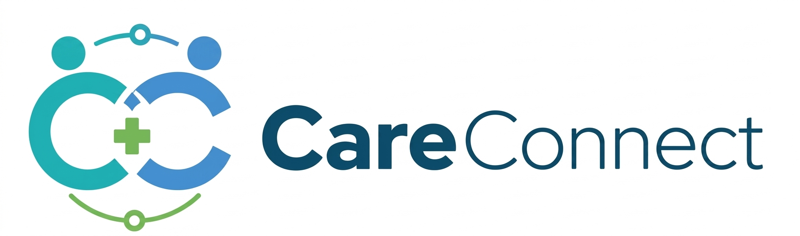
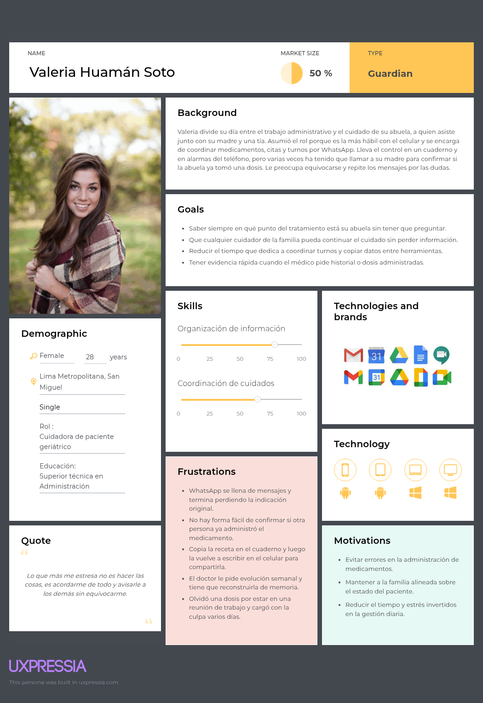
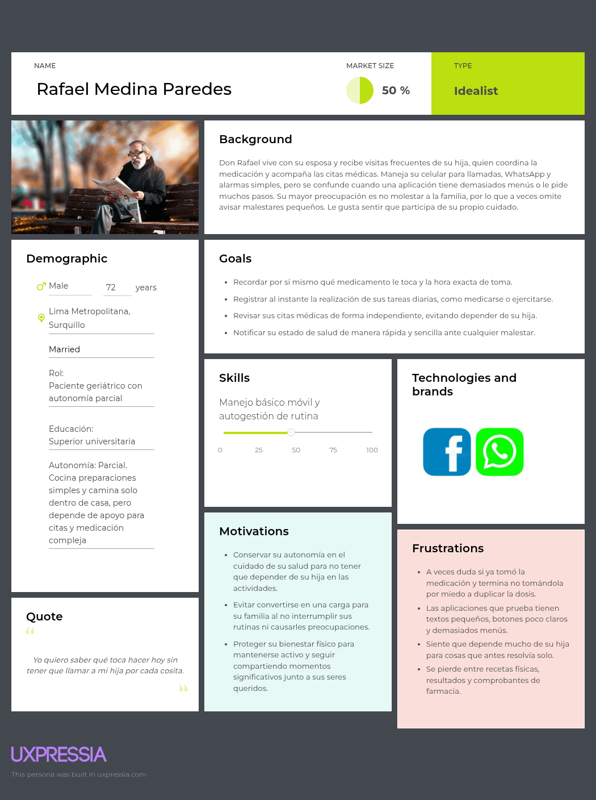
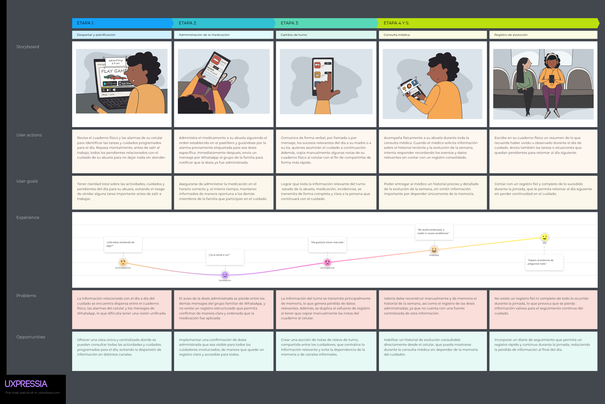
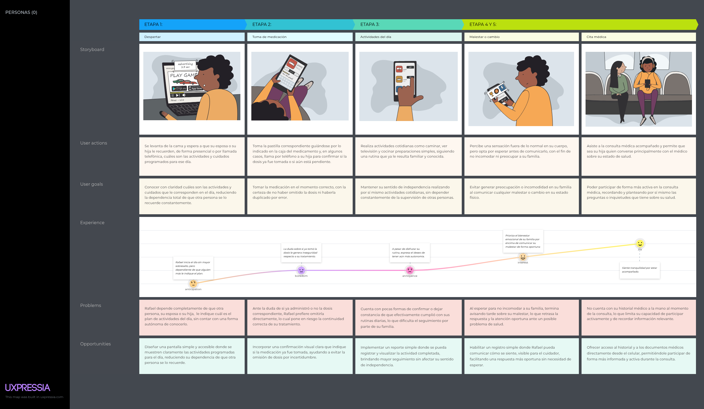
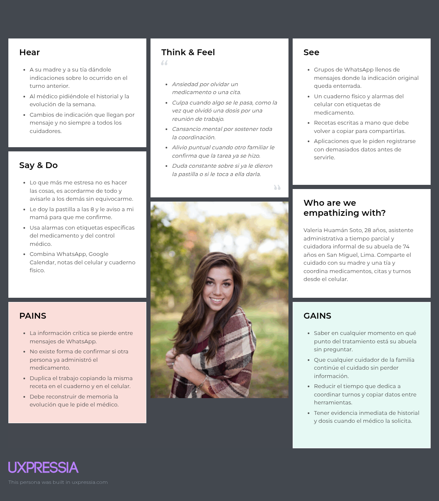
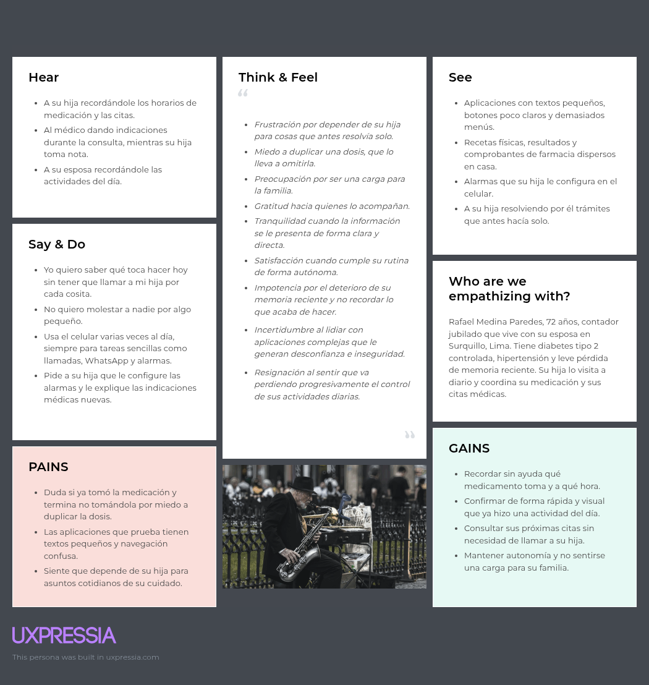

<!--
=====================================================================
 PLANTILLA — Informe de Trabajo Final · 1ASI0732 Diseño de Experimentos
 Un solo archivo README.md (archivo principal del repositorio del informe).
 Estructura completa según el statement: 3 Partes, 8 Capítulos + anexos.
 Reemplazar cada <placeholder> y cada bloque > _Guía:_ con el contenido real.
 Recordar: actualizar y VERIFICAR la Tabla de Contenidos antes de cada entrega.
=====================================================================
-->

# Informe de Trabajo Final

<!-- CARÁTULA -->

" alt="Logo UPC" width="180"/>

**Universidad Peruana de Ciencias Aplicadas (UPC)**

Carrera de Ingeniería de Software

Ciclo académico: **2026-20**

Curso: **1ASI0732 — Diseño de Experimentos de Ingeniería de Software**

NRC: **\<NRC>**

Profesor: **\<Apellidos, Nombres del profesor>**

**Informe de Trabajo Final**

Startup: **CareStacks**

Producto: **CareConnect**

**Relación de integrantes:**

| Código      | Apellidos y Nombres |
|-------------|---------------------|
| \<código>   | \<Apellidos, Nombres> |
| \<código>   | \<Apellidos, Nombres> |
| \<código>   | \<Apellidos, Nombres> |
| \<código>   | \<Apellidos, Nombres> |
| \<código>   | \<Apellidos, Nombres> |

**\<Mes> \<Año>**

---

## Registro de Versiones del Informe

> _Guía:_ Resumen de modificaciones relevantes durante el ciclo de vida. Una línea por versión, **un solo autor por línea**. La primera línea es la versión inicial. Modificaciones relevantes: adición/eliminación de secciones, correcciones/mejoras por feedback del docente o autocrítica del equipo.

| Versión | Fecha (YYYY-MM-DD) | Autor | Descripción de modificación |
|---------|--------------------|-------|-----------------------------|
| 1.0     | \<fecha>           | \<Apellidos, Nombres> | \<descripción> |

---

## Project Report Collaboration Insights

> _Guía:_ Indicar el URL del repositorio del Project Report en la organización GitHub del equipo. Por cada entrega, explicar cómo se desarrollaron las actividades del informe e incluir **capturas de los analíticos de colaboración y commits** en GitHub. Todos los integrantes deben participar. Debe ser coherente con el Registro de Versiones.

- Repositorio del informe: \<url-repo-github>

---

## Tabla de Contenidos

<!-- 4 niveles. Verificar los anclajes (#) antes de cada entrega: GitHub genera el ancla a partir del texto del título. -->

- [Student Outcome](#student-outcome)
- [Part I: As-Is Software Project](#part-i-as-is-software-project)
  - [Capítulo I: Introducción](#capítulo-i-introducción)
    - [1.1. Startup Profile](#11-startup-profile)
      - [1.1.1. Descripción de la Startup](#111-descripción-de-la-startup)
      - [1.1.2. Perfiles de integrantes del equipo](#112-perfiles-de-integrantes-del-equipo)
    - [1.2. Solution Profile](#12-solution-profile)
      - [1.2.1. Antecedentes y problemática](#121-antecedentes-y-problemática)
      - [1.2.2. Lean UX Process](#122-lean-ux-process)
    - [1.3. Segmentos objetivo](#13-segmentos-objetivo)
  - [Capítulo II: Requirements Elicitation & Analysis](#capítulo-ii-requirements-elicitation--analysis)
    - [2.1. Competidores](#21-competidores)
    - [2.2. Entrevistas](#22-entrevistas)
    - [2.3. Needfinding](#23-needfinding)
    - [2.4. Ubiquitous Language](#24-ubiquitous-language)
  - [Capítulo III: Requirements Specification](#capítulo-iii-requirements-specification)
    - [3.1. To-Be Scenario Mapping](#31-to-be-scenario-mapping)
    - [3.2. User Stories](#32-user-stories)
    - [3.3. Product Backlog](#33-product-backlog)
    - [3.4. Impact Mapping](#34-impact-mapping)
  - [Capítulo IV: Product Design](#capítulo-iv-product-design)
    - [4.1. Style Guidelines](#41-style-guidelines)
    - [4.2. Information Architecture](#42-information-architecture)
    - [4.3. Landing Page UI Design](#43-landing-page-ui-design)
    - [4.4. Mobile Applications UX/UI Design](#44-mobile-applications-uxui-design)
    - [4.5. Mobile Applications Prototyping](#45-mobile-applications-prototyping)
    - [4.6. Web Applications UX/UI Design](#46-web-applications-uxui-design)
    - [4.7. Web Applications Prototyping](#47-web-applications-prototyping)
    - [4.8. Domain-Driven Software Architecture](#48-domain-driven-software-architecture)
    - [4.9. Software Object-Oriented Design](#49-software-object-oriented-design)
    - [4.10. Database Design](#410-database-design)
  - [Capítulo V: Product Implementation](#capítulo-v-product-implementation)
    - [5.1. Software Configuration Management](#51-software-configuration-management)
    - [5.2. Product Implementation & Deployment](#52-product-implementation--deployment)
    - [5.3. Video About-the-Product](#53-video-about-the-product)
- [Part II: Verification, Validation & Pipeline](#part-ii-verification-validation--pipeline)
  - [Capítulo VI: Product Verification & Validation](#capítulo-vi-product-verification--validation)
    - [6.1. Testing Suites & Validation](#61-testing-suites--validation)
    - [6.2. Static testing & Verification](#62-static-testing--verification)
    - [6.3. Validation Interviews](#63-validation-interviews)
    - [6.4. Auditoría de Experiencias de Usuario](#64-auditoría-de-experiencias-de-usuario)
  - [Capítulo VII: DevOps Practices](#capítulo-vii-devops-practices)
    - [7.1. Continuous Integration](#71-continuous-integration)
    - [7.2. Continuous Delivery](#72-continuous-delivery)
    - [7.3. Continuous deployment](#73-continuous-deployment)
    - [7.4. Continuous Monitoring](#74-continuous-monitoring)
- [Part III: Experiment-Driven Lifecycle](#part-iii-experiment-driven-lifecycle)
  - [Capítulo VIII: Experiment-Driven Development](#capítulo-viii-experiment-driven-development)
    - [8.1. Experiment Planning](#81-experiment-planning)
    - [8.2. Experiment Design](#82-experiment-design)
    - [8.3. Experimentation](#83-experimentation)
    - [8.4. Experiment Aftermath & Analysis](#84-experiment-aftermath--analysis)
    - [8.5. Continuous Learning](#85-continuous-learning)
    - [8.6. To-Be Software Platform Pre-launch](#86-to-be-software-platform-pre-launch)
- [Matriz de Evaluación Ética y de Impacto](#matriz-de-evaluación-ética-y-de-impacto)
- [Conclusiones](#conclusiones)
- [Bibliografía](#bibliografía)
- [Anexos](#anexos)

---

## Student Outcome

> _Guía:_ Colocar el párrafo introductorio idéntico al Anexo A del statement. Una subsección por alumno describiendo la relación outcome–dimensiones–trabajo. En "Acciones realizadas" identificar cada participante y por entrega (AV1, TP, AV2, TB2). "Conclusiones" grupales y acumulables.

El curso contribuye al cumplimiento del Student Outcome ABET:

**ABET – EAC – Student Outcome 4**
**Criterio:** La capacidad de reconocer responsabilidades éticas y profesionales en situaciones de ingeniería y hacer juicios informados, que deben considerar el impacto de las soluciones de ingeniería en contextos globales, económicos, ambientales y sociales.

| Criterio específico | Acciones realizadas | Conclusiones |
|---------------------|---------------------|--------------|
| **4.c.1** Reconoce responsabilidad ética y profesional en situaciones de ingeniería de software | \<Apellidos, Nombres> AV1: \<acciones> TP: … AV2: … TB2: … | \<conclusiones grupales acumulables> |
| **4.c.2** Emite juicios informados considerando el impacto de las soluciones de ingeniería de software en contextos globales, económicos, ambientales y sociales | \<Apellidos, Nombres> AV1: \<acciones> TP: … AV2: … TB2: … | \<conclusiones grupales acumulables> |

---

# Part I: As-Is Software Project

## Capítulo I: Introducción

### 1.1. Startup Profile

#### 1.1.1. Descripción de la Startup
> _Guía:_ Descripción de CareStacks.

#### 1.1.2. Perfiles de integrantes del equipo
> _Guía:_ Por integrante: foto, nombres y apellidos, código, descripción de carrera y párrafo de conocimientos técnicos/habilidades que aporta.

### 1.2. Solution Profile

#### 1.2.1. Antecedentes y problemática
> _Guía:_ Enunciado del problema aplicando 5W+2H (Who, What, Where, When, Why, How, How Much). Objetivos y restricciones que delimitan el alcance.

#### 1.2.2. Lean UX Process

##### 1.2.2.1. Lean UX Problem Statements
> _Guía:_ Domain, customer segments, pain points, gap, vision/strategy, initial segment.

##### 1.2.2.2. Lean UX Assumptions

##### 1.2.2.3. Lean UX Hypothesis Statements

##### 1.2.2.4. Lean UX Canvas

### 1.3. Segmentos objetivo
> _Guía:_ Descripción de segmentos con características demográficas e información estadística de sustento.

## Capítulo II: Requirements Elicitation & Analysis

### 2.1. Competidores

El mercado de aplicaciones móviles orientadas a la salud personal presenta una oferta consolidada a nivel global, con actores que abordan el seguimiento del tratamiento desde distintos ángulos: recordatorios de medicación, monitoreo de hábitos o almacenamiento de información médica familiar. Sin embargo, ninguno de los productos existentes resuelve la coordinación entre varios cuidadores que atienden a un mismo paciente geriátrico, que es precisamente el espacio que **CareConnect** busca ocupar. Tras el proceso de investigación del landscape competitivo, identificamos tres competidores cuyas propuestas de valor se solapan parcialmente con la nuestra.

**Medisafe** es una aplicación enfocada en recordatorios de medicación para pacientes individuales. Su propuesta central es la alta especialización en el control de la toma de medicamentos, con un modelo freemium y distribución exclusivamente móvil.

**MyTherapy** es una aplicación orientada al seguimiento de salud, hábitos y tratamientos médicos. Su diferencial es una interfaz simple y el monitoreo continuo del estado de salud, dirigido principalmente a personas con enfermedades crónicas. Opera bajo modelo freemium y canal móvil.

**Caring Village** es una plataforma orientada a la coordinación y comunicación entre familiares y cuidadores que atienden a un mismo paciente. Su diferencial es facilitar la organización de tareas, actualizaciones y comunicación entre los miembros de la red de cuidado. Opera bajo un modelo freemium y cuenta con presencia web y móvil.

#### 2.1.1. Análisis competitivo

<table>
  <tr>
    <td colspan="6" align="center"><b>Competitive analysis landscape</b></td>
  </tr>
  <tr>
    <td colspan="2"><b>¿Por qué llevar a cabo este análisis?</b></td>
    <td colspan="4">¿Qué ofrecen los principales competidores del mercado de gestión de medicación y coordinación del cuidado, y en qué aspectos CareConnect puede diferenciarse para capturar a cuidadores y pacientes geriátricos en el mercado peruano y latinoamericano?</td>
  </tr>
  <tr>
    <td colspan="2"><i>Nombre y Logo</i></td>
    <td align="center"> <b>CareConnect</b></td>
    <td align="center"> <b>Medisafe</b></td>
    <td align="center"> <b>MyTherapy</b></td>
    <td align="center"> <b>Caring Village</b></td>
  </tr>
  <tr>
    <td rowspan="2" align="center"><b>Perfil</b></td>
    <td><b>Overview</b></td>
    <td>Aplicación móvil nativa y multiplataforma en etapa de desarrollo, orientada al cuidado colaborativo de pacientes geriátricos. Integra calendario de medicación y terapias programadas, alertas y recordatorios en tiempo real, carpeta digital de documentos clínicos, historial de notas y registro de evolución, y compartición de perfiles entre cuidadores, dirigida a cuidadores de 25 a 60 años y pacientes geriátricos de 60 años a más en el Perú.</td>
    <td>Aplicación de recordatorios de medicación con más de una década en el mercado, disponible para iOS y Android. Cuenta con más de 101 000 calificaciones en App Store con un promedio de 4.7 estrellas, y su función Medfriends permite notificar a un familiar o cuidador cuando el usuario omite una dosis.</td>
    <td>Aplicación desarrollada por smartpatient GmbH, disponible para iOS y Android en múltiples idiomas, con una calificación de 4.8 en Google Play. Combina recordatorios de medicación con seguimiento de peso, presión arterial, oxígeno en sangre y glucosa, además de un diario de síntomas y estado de ánimo.</td>
    <td>Aplicación de coordinación familiar del cuidado organizada en torno al concepto de Village, donde el usuario principal invita a familiares, amigos y cuidadores profesionales a colaborar en el cuidado de una misma persona. Incluye asistente con inteligencia artificial llamado Julia, calendario compartido sincronizable con Google Calendar, Apple Calendar y Outlook, almacenamiento de documentos y mensajería segura, con una calificación de 4.6 sobre 5 en App Store.</td>
  </tr>
  <tr>
    <td><b>Ventaja competitiva</b> <i>¿Qué valor ofrece a los clientes?</i></td>
    <td>Permite que varios cuidadores compartan en tiempo real el estado y la evolución de un mismo paciente geriátrico dentro de una sola aplicación, cubriendo la coordinación de turnos que ninguno de los tres competidores investigados ofrece de forma nativa.</td>
    <td>Ofrece seguridad en la administración de medicamentos mediante su verificador de interacciones entre fármacos y la alerta Medfriends, aunque ese aviso llega a una sola persona designada y no sostiene una coordinación continua entre varios cuidadores a la vez.</td>
    <td>Da al propio paciente una visión clara y exportable de su tratamiento y de sus signos vitales a lo largo del tiempo mediante su reporte mensual, pensado para que lo revise el usuario y su médico, y no para que lo compartan varios cuidadores en simultáneo.</td>
    <td>Ofrece a la familia un espacio único de coordinación con calendario, documentos y mensajería compartidos entre todos los miembros de un mismo Village, apoyado en el asistente Julia, aunque su plan gratuito limita ese círculo a solo 2 miembros y no incluye recordatorios de medicación.</td>
  </tr>
  <tr>
    <td rowspan="2" align="center"><b>Perfil de Marketing</b></td>
    <td><b>Mercado Objetivo</b></td>
    <td>Cuidadores formales e informales de 25 a 60 años y pacientes geriátricos de 60 años a más, en zonas urbanas y periurbanas del Perú que hoy coordinan el cuidado mediante herramientas no especializadas.</td>
    <td>Personas que gestionan tratamientos médicos individuales, incluidos pacientes con enfermedades crónicas que toman varios medicamentos a la vez, con fuerte presencia en Estados Unidos y otros mercados donde ya opera su plan de pago.</td>
    <td>Personas con tratamientos médicos y enfermedades crónicas que buscan registrar su medicación y sus signos vitales de forma autónoma, con alcance en múltiples países gracias a su disponibilidad en distintos idiomas.</td>
    <td>Familias que coordinan el cuidado de un adulto mayor o de un familiar con una condición de salud, incluidos cuidadores principales, familiares a distancia, amigos y cuidadores profesionales invitados a un mismo Village.</td>
  </tr>
  <tr>
    <td><b>Estrategias de Marketing</b></td>
    <td>Aún no ha desplegado campañas de marketing por encontrarse en etapa de desarrollo como proyecto universitario, aunque contempla campañas en redes sociales y alianzas con centros de salud según lo definido en la sección de estrategias frente a competidores.</td>
    <td>Sostiene su visibilidad principalmente en las tiendas de aplicaciones, apoyada en más de una década de trayectoria y en una calificación promedio de 4.7 sobre 5 en más de 101 000 reseñas de usuarios.</td>
    <td>Se posiciona como una aplicación reconocida para el manejo de medicación, apoyada en una calificación de 4.8 en Google Play y en su disponibilidad en múltiples idiomas para llegar a audiencias de distintos países.</td>
    <td>Construye su reputación mediante testimonios reales de familias publicados en su propio sitio y en las tiendas de aplicaciones, sostenida en una calificación de 4.6 sobre 5 en App Store y en contenido de blog orientado a distintos perfiles de cuidadores, como familias con hijos y padres mayores a la vez.</td>
  </tr>
  <tr>
    <td rowspan="3" align="center"><b>Perfil de Producto</b></td>
    <td><b>Productos &amp; Servicios</b></td>
    <td>Calendario de medicación y terapias programadas, alertas y recordatorios en tiempo real, carpeta digital de documentos clínicos, historial de notas y registro de evolución del paciente, y compartición de perfiles entre cuidadores.</td>
    <td>Recordatorios de medicación, verificador de interacciones entre fármacos, alertas de reposición, función Medfriends para notificar a un cuidador ante una dosis omitida, y sincronización con Apple HealthKit.</td>
    <td>Recordatorios de medicación y de reposición de recetas, registro de peso, presión arterial, oxígeno en sangre y glucosa, diario de síntomas y estado de ánimo, seguimiento de rachas de cumplimiento y reporte mensual de salud exportable.</td>
    <td>Calendario compartido sincronizable con Google Calendar, Apple Calendar y Outlook, listas de tareas, almacenamiento de documentos, mensajería segura, planes de cuidado personalizables y exportación de un diario de bienestar, todo organizado en torno a un Village por persona cuidada, con el asistente de inteligencia artificial Julia como soporte adicional.</td>
  </tr>
  <tr>
    <td><b>Precios &amp; Costos</b></td>
    <td>Modelo freemium con funcionalidades premium orientadas a la coordinación entre múltiples cuidadores, sin montos definidos aún por encontrarse en etapa de desarrollo.</td>
    <td>Desde enero de 2026 el nivel gratuito quedó limitado a 2 medicamentos, y el acceso completo requiere una suscripción de 4.99 dólares al mes o 39.99 dólares al año.</td>
    <td>Se mantiene completamente gratuita para iOS y Android, sostenida mediante publicidad dentro de la aplicación en lugar de un plan de pago.</td>
    <td>Ofrece un plan gratuito limitado a un Village de hasta 2 miembros, un plan Circle de 14.99 dólares al mes con hasta 2 Villages de 5 miembros cada uno, y un plan Village de 24.99 dólares al mes con hasta 5 Villages de 50 miembros cada uno, con descuento del 17 % en facturación anual.</td>
  </tr>
  <tr>
    <td><b>Canales de distribución</b> <i>(Web y/o Móvil)</i></td>
    <td>Móvil. Aplicación nativa multiplataforma para iOS y Android, sin versión web contemplada en el alcance actual.</td>
    <td>Móvil. Disponible en App Store y Google Play, sin versión web.</td>
    <td>Móvil. Disponible en App Store y Google Play, sin versión web.</td>
    <td>Web y móvil. Disponible en App Store y Google Play, con un portal web propio para la gestión de la cuenta y la suscripción.</td>
  </tr>
  <tr>
    <td rowspan="5" align="center"><b>Análisis SWOT</b></td>
    <td colspan="5"><i>Realice esto para su startup y sus competidores. Sus fortalezas deberían apoyar sus oportunidades y contribuir a lo que ustedes definen como su posible ventaja competitiva.</i></td>
  </tr>
  <tr>
    <td><b>Fortalezas</b></td>
    <td>Coordinación en tiempo real entre múltiples cuidadores dentro de una sola plataforma. Al comparar esta fortaleza con la competencia, se observa que Medisafe solo notifica a un cuidador designado mediante Medfriends, que MyTherapy concentra el seguimiento en el propio paciente sin compartirlo activamente, y que Caring Village sí coordina a varios miembros de la familia pero sin integrar el seguimiento clínico de medicación como parte central de su producto, por lo que CareConnect es el único que combina ambas dimensiones.</td>
    <td>Verificador de interacciones entre medicamentos y alerta Medfriends, respaldados por más de una década de trayectoria y una calificación de 4.7 sobre más de 101 000 reseñas. Al comparar esta fortaleza con la competencia, se observa que ese nivel de validación y confianza de usuarios supera al de CareConnect, que aún no cuenta con historial de uso real.</td>
    <td>Seguimiento integral de signos vitales junto con la medicación, con reporte mensual exportable y calificación de 4.8 en Google Play. Al comparar esta fortaleza con la competencia, se observa que ese nivel de detalle clínico individual es mayor al que ofrece hoy CareConnect, aunque no incluye coordinación entre distintos cuidadores.</td>
    <td>Coordinación familiar organizada por Villages, con asistente de inteligencia artificial Julia, calendario sincronizable con Google, Apple y Outlook, y una calificación de 4.6 sobre 5 en App Store. Al comparar esta fortaleza con la competencia, se observa que su enfoque en coordinación familiar es el más cercano al de CareConnect, aunque no incluye recordatorios ni verificación de medicación como parte de su producto principal.</td>
  </tr>
  <tr>
    <td><b>Debilidades</b></td>
    <td>Al ser un proyecto en etapa de desarrollo, no cuenta aún con usuarios activos, calificaciones ni validación de mercado. Al comparar esta debilidad con la competencia, se observa que Medisafe, MyTherapy y Caring Village ya tienen miles de reseñas y presencia consolidada, lo que exige a CareConnect construir confianza desde cero.</td>
    <td>Desde 2026 su nivel gratuito quedó limitado a solo 2 medicamentos, lo que la vuelve poco viable para pacientes geriátricos con regímenes de tratamiento más complejos. Al comparar esta debilidad con la competencia, se observa que esa restricción abre una oportunidad concreta para el modelo freemium de CareConnect, pensado para regímenes de cuidado más amplios.</td>
    <td>No ofrece verificador de interacciones entre medicamentos ni mecanismos de coordinación entre múltiples cuidadores. Al comparar esta debilidad con la competencia, se observa que ambas funciones sí forman parte del alcance de Medisafe y de CareConnect respectivamente, lo que deja a MyTherapy enfocada únicamente en el autoseguimiento individual.</td>
    <td>Su plan gratuito limita el Village a solo 2 miembros y no incluye recordatorios de medicación, que quedan fuera incluso de sus planes pagos según su propia página de precios. Al comparar esta debilidad con la competencia, se observa que Caring Village resuelve la coordinación familiar pero no el seguimiento clínico de medicamentos, brecha que sí cubre CareConnect dentro de una sola aplicación.</td>
  </tr>
  <tr>
    <td><b>Oportunidades</b></td>
    <td>La fragmentación entre soluciones de coordinación familiar como Caring Village y soluciones de medicación como Medisafe deja sin cubrir a los usuarios que buscan ambas funciones en una sola aplicación. Al comparar esta oportunidad con la competencia, se observa que ninguno de los tres competidores investigados ofrece hoy esa combinación, lo que deja a CareConnect en posición de capturar primero ese espacio en Latinoamérica.</td>
    <td>Podría extender su función Medfriends para notificar a varios cuidadores a la vez en lugar de a uno solo. Al comparar esta oportunidad con la competencia, se observa que si lo hiciera se acercaría directamente a la propuesta de coordinación que hoy diferencia a CareConnect.</td>
    <td>Podría integrar alertas dirigidas a un cuidador externo a partir de los datos que ya recopila del paciente. Al comparar esta oportunidad con la competencia, se observa que esa integración la acercaría a un modelo más colaborativo similar al de CareConnect.</td>
    <td>Podría incorporar recordatorios y verificación de medicación dentro de sus planes Circle o Village. Al comparar esta oportunidad con la competencia, se observa que si lo hiciera competiría de forma directa con CareConnect en el eje que hoy nos diferencia, la integración de coordinación familiar y seguimiento clínico en un solo producto.</td>
  </tr>
  <tr>
    <td><b>Amenazas</b></td>
    <td>Medisafe, MyTherapy y Caring Village ya cuentan con miles de usuarios y calificaciones consolidadas en las tiendas de aplicaciones. Al comparar esta amenaza con la competencia, se observa que CareConnect debe superar esa barrera de confianza inicial además de la baja alfabetización digital de parte de su segmento de pacientes geriátricos.</td>
    <td>El endurecimiento de su modelo de pago en 2026 generó una ola de usuarios buscando alternativas gratuitas, lo que puede favorecer tanto a aplicaciones gratuitas como MyTherapy como a nuevas propuestas como CareConnect. Al comparar esta amenaza con la competencia, se observa que Medisafe corre el riesgo de perder usuarios frente a alternativas mejor valoradas en precio.</td>
    <td>La saturación del mercado de aplicaciones de seguimiento de salud gratuitas, incluidas alternativas que surgieron tras el cambio de modelo de Medisafe. Al comparar esta amenaza con la competencia, se observa que MyTherapy compite por el mismo usuario individual que buscan captar varias aplicaciones similares, mientras que CareConnect se diferencia al dirigirse a la coordinación entre cuidadores.</td>
    <td>Su plan gratuito limitado a 2 miembros puede empujar a familias con más de un cuidador hacia alternativas que resuelvan coordinación y medicación en un solo pago. Al comparar esta amenaza con la competencia, se observa que CareConnect puede capturar a esas familias si su propio modelo freemium ofrece un umbral gratuito más amplio que el de Caring Village.</td>
  </tr>
</table>

#### 2.1.2. Estrategias y tácticas frente a competidores

A partir del análisis competitivo realizado en la sección anterior, se identificaron diversas oportunidades y debilidades en los competidores actuales, Medisafe, MyTherapy y Caring Village. En base a estos hallazgos, se plantean las siguientes estrategias y tácticas para afrontar las fortalezas de la competencia y aprovechar sus debilidades, posicionando a CareConnect como una solución diferenciada en el mercado.

**1. Diferenciación mediante coordinación en tiempo real con seguimiento clínico integrado**

Se identificó que Medisafe notifica únicamente a un cuidador designado a través de su función Medfriends, que MyTherapy concentra el seguimiento en el propio paciente sin coordinación activa entre terceros, y que Caring Village coordina bien a la familia mediante calendarios y mensajería compartida pero no incluye recordatorios ni verificación de medicación dentro de su producto.

*Estrategia:* implementar un sistema de coordinación en tiempo real entre cuidadores y familiares que integre, en la misma aplicación, el seguimiento de la medicación que Caring Village no ofrece.

*Tácticas:*
- Sistema de notificaciones en tiempo real sobre medicación y eventos, enviado a todos los cuidadores vinculados y no solo a uno.
- Confirmación de actividades realizadas, por ejemplo la medicación administrada.
- Alertas automáticas en caso de incumplimiento o eventos críticos.

**2. Plataforma integral de cuidado**

Los competidores actuales ofrecen soluciones parciales: Medisafe se enfoca en medicación con verificación de interacciones, MyTherapy en seguimiento de salud y signos vitales del propio paciente, y Caring Village en coordinación familiar mediante calendarios, documentos y mensajería, sin que ninguno integre las tres dimensiones a la vez.

*Estrategia:* ofrecer una plataforma integral que centralice todos los aspectos del cuidado en una sola aplicación.

*Tácticas:*
- Integración de calendario de medicación y terapias.
- Registro de historial clínico y evolución del paciente.
- Almacenamiento de documentos médicos en una carpeta digital.
- Unificación de todas las funcionalidades en una sola interfaz.

**3. Enfoque en el cuidado colaborativo accesible**

Caring Village resuelve bien la coordinación entre varios miembros de la familia, pero limita su plan gratuito a un solo Village de hasta 2 miembros, y sus planes de pago parten en 14.99 dólares al mes, una barrera de adopción para familias con más cuidadores o con menor capacidad de pago.

*Estrategia:* permitir la gestión colaborativa del cuidado mediante perfiles compartidos, con un umbral gratuito más amplio que el de Caring Village para familias con varios cuidadores.

*Tácticas:*
- Sistema de usuarios múltiples vinculados a un mismo paciente.
- Acceso compartido a historial, eventos y registros.
- Control de permisos según tipo de usuario, cuidador o familiar.

**4. Mejora de la experiencia del usuario**

Se observó que Medisafe restringió su nivel gratuito a solo 2 medicamentos desde 2026, lo que la vuelve poco viable para regímenes de cuidado geriátrico más complejos, y que varias soluciones no están diseñadas para contextos de uso bajo presión ni para usuarios con bajo conocimiento tecnológico.

*Estrategia:* desarrollar una interfaz intuitiva, rápida y centrada en el usuario, con un nivel gratuito que cubra realmente las necesidades de un paciente geriátrico con múltiples medicamentos.

*Tácticas:*
- Diseño mobile first enfocado en dispositivos Android de gama media.
- Navegación simple con flujos cortos.
- Interfaces claras para tareas críticas como registro, consulta y alertas.
- Pruebas de usabilidad con cuidadores reales.

**5. Enfoque en un nicho específico**

Ninguno de los tres competidores está especializado en el cuidado de pacientes geriátricos: Medisafe y MyTherapy se dirigen al paciente individual sin distinción etaria, y Caring Village se dirige a la coordinación familiar en general, sin distinguir entre tipos de condición de salud ni especializarse en el cuidado geriátrico.

*Estrategia:* posicionar a CareConnect como una solución especializada en el cuidado geriátrico compartido entre varios cuidadores.

*Tácticas:*
- Adaptación de funcionalidades a rutinas complejas de cuidado con múltiples actores.
- Diseño accesible y comprensible para pacientes de 60 años a más.
- Comunicación centrada en el bienestar del paciente y en el apoyo al cuidador.

**6. Estrategia de crecimiento y adopción**

Se identificó que Medisafe, MyTherapy y Caring Village tienen alcance internacional pero no están enfocados específicamente en Latinoamérica, y que los planes pagos de Caring Village, desde 14.99 dólares al mes, resultan menos accesibles para el poder adquisitivo de familias en la región.

*Estrategia:* expandir la plataforma mediante estrategias digitales y alianzas estratégicas, capturando primero el mercado peruano y latinoamericano con precios adaptados a la región.

*Tácticas:*
- Campañas en redes sociales dirigidas a cuidadores y familias.
- Alianzas con centros de salud y organizaciones de apoyo.
- Modelo freemium para facilitar la adopción inicial, con un nivel gratuito más amplio que el de Medisafe y de Caring Village.
- Programas de recomendación entre usuarios.

**7. Mejora continua basada en datos**

Los competidores presentan limitaciones distintas en personalización y evolución del producto: Medisafe endureció su modelo de pago en 2026, MyTherapy no ofrece coordinación entre cuidadores, y Caring Village no integra el seguimiento de medicación dentro de su propuesta principal.

*Estrategia:* implementar un modelo de mejora continua basado en datos y en el feedback de los usuarios, cerrando de forma iterativa las brechas que dejan los tres competidores.

*Tácticas:*
- Recolección de métricas de uso dentro de la aplicación.
- Análisis del comportamiento del usuario.
- Iteraciones frecuentes del producto.
- Incorporación de feedback directo de cuidadores y familiares.
  
### 2.2. Entrevistas

Esta sección presenta el diseño, el registro y el análisis de las entrevistas realizadas a los segmentos objetivo, con el fin de comprender sus necesidades, sus problemas actuales y las oportunidades de mejora en la gestión del cuidado geriátrico.

#### 2.2.1. Diseño de entrevistas
> _Guía:_ Preguntas principales y complementarias por segmento.

Diseñamos entrevistas semiestructuradas con preguntas diferenciadas según cada segmento objetivo, organizadas en bloques temáticos que permiten recopilar información sobre el perfil del usuario, sus hábitos actuales y la validación de las funcionalidades propuestas. Los bloques fueron definidos de modo que la información recogida alimente directamente la construcción de los arquetipos: el bloque de perfil captura características demográficas, el bloque de hábitos captura comportamientos, herramientas y canales de interacción, y el bloque de validación captura objetivos y expectativas.

#### Segmento 1: Cuidadores de pacientes geriátricos

El objetivo es entender cómo gestionan actualmente el cuidado diario, qué herramientas utilizan y qué dificultades enfrentan.

**Bloque 1: Perfil y biografía**

1. ¿Nos podría indicar su nombre, edad y cuánto tiempo lleva realizando actividades de cuidado?
2. ¿En qué distrito reside y en qué distrito realiza sus actividades de cuidado?
3. ¿A qué se dedica además del cuidado y cuál es su situación familiar actual?
4. ¿El cuidado que realiza es formal o informal, y a cuántas personas atiende?

**Bloque 2: Gestión actual del cuidado y herramientas**

5. ¿Cómo organiza actualmente la medicación y las terapias del paciente?
6. ¿Qué herramientas utiliza en su día a día?
7. ¿Qué dispositivo usa principalmente y qué aplicaciones abre con más frecuencia durante su jornada?
8. ¿Ha tenido problemas por falta de coordinación o de información?
9. ¿Cómo se comunica con otros cuidadores o familiares y por qué canal?
10. ¿Qué aspectos considera más difíciles en el cuidado diario?

**Bloque 3: Validación de funcionalidades y expectativas**

11. ¿Qué funcionalidades le gustaría tener en una aplicación de apoyo?
12. Si una aplicación permitiera que varios cuidadores registren y confirmen en tiempo real la medicación administrada, ¿la usaría? ¿Por qué?
13. ¿Qué espera mejorar con una solución digital?
14. ¿Qué tendría que ocurrir para que dejara de usar una aplicación de este tipo?

#### Segmento 2: Pacientes geriátricos

El objetivo es comprender cómo los pacientes gestionan su propio cuidado, qué dificultades tienen para seguir sus tratamientos y qué tipo de apoyo digital necesitan para mejorar su autonomía.

**Bloque 1: Perfil y biografía**

1. ¿Nos podría indicar su nombre, edad y si actualmente recibe apoyo de un cuidador?
2. ¿En qué distrito vive y con quiénes vive actualmente?
3. ¿A qué se dedicaba antes y cómo describiría su rutina de un día normal?
4. ¿Qué tan independiente se siente para resolver sus actividades diarias?

**Bloque 2: Gestión actual del cuidado y uso de tecnología**

5. ¿Cómo recuerda tomar sus medicamentos o asistir a sus citas médicas?
6. ¿Ha tenido dificultades para seguir su tratamiento o su rutina diaria?
7. ¿Qué es lo que más le cuesta recordar o controlar en su día a día?
8. ¿Utiliza celular o alguna aplicación actualmente? ¿Para qué?
9. ¿Utiliza algún otro dispositivo, como tablet o computadora?
10. ¿Qué tan fácil o difícil le resulta usar aplicaciones móviles?
11. ¿Dónde guarda actualmente sus recetas, resultados y documentos médicos?

**Bloque 3: Validación de funcionalidades y expectativas**

12. ¿Qué tipo de recordatorios le ayudarían más: alarmas, notificaciones o mensajes?
13. ¿Le gustaría poder ver sus actividades o medicamentos en una sola pantalla?
14. ¿Qué le haría sentir más seguro o tranquilo respecto a su cuidado?
15. ¿Qué funcionalidades le gustaría tener en una aplicación que le ayude en su cuidado?

#### 2.2.2. Registro de entrevistas
> _Guía:_ **3 a 5 entrevistas por segmento.** Nombres, apellidos, edad, distrito, screenshot y URL de Microsoft Stream con timing y duración. Resumen por entrevista.

#### Segmento 1: Cuidadores de pacientes geriátricos

| Segmento: Cuidadores | Entrevista #1 |
| --- | --- |
| **Nombres y Apellidos** | Giancarlo Castañeda |
| **Edad** | 20 |
| **Distrito** | *Pendiente. El documento base registra únicamente Perú como procedencia.* |
| **Ocupación** | Cuidador de adultos mayores a domicilio |
| **Tiempo como cuidador** | 1 año |
| **Timing inicio** | *Pendiente* |
| **Duración** | *Pendiente* |
| **URL** | *Pendiente* |
| **Screenshot** | *Insertar captura del video* |
| **Resumen** | Giancarlo gestiona el cuidado del paciente mediante herramientas mayormente manuales. Para la medicación utiliza pastilleros semanales organizados con base en recetas médicas, complementados con alarmas en su celular para recordar los horarios. Las terapias y citas médicas las registra en un cuaderno físico junto con el historial del paciente. Entre sus herramientas cotidianas menciona dispositivos médicos básicos como tensiómetro, oxímetro y termómetro, además de un cuaderno de bitácora para registrar eventos relevantes. A nivel digital emplea principalmente alarmas y WhatsApp para comunicarse con los familiares. Señaló que uno de los principales problemas es la falta de coordinación durante los cambios de turno, donde la información no siempre se transmite correctamente, lo que puede generar pérdida de datos importantes sobre el estado del paciente. Respecto a las dificultades del cuidado diario, mencionó el manejo de cambios de humor y episodios de confusión del paciente, así como la falta de apoyo inmediato de profesionales de salud para resolver dudas. En relación con una posible solución digital, destacó la necesidad de registro compartido en tiempo real entre cuidadores, confirmación de administración de medicamentos, recordatorios automáticos, historial de signos vitales y una sección de notas para el relevo de turno. Espera que una solución digital le permita reducir la carga mental, mejorar la organización del cuidado y generar mayor confianza con los familiares al brindarles visibilidad del estado del paciente en tiempo real. |

| Segmento: Cuidadores | Entrevista #2 |
| --- | --- |
| **Nombres y Apellidos** | Renzo Uribe |
| **Edad** | 20 |
| **Distrito** | *Pendiente. El documento base registra únicamente Perú como procedencia.* |
| **Ocupación** | Cuidador de adultos mayores a domicilio |
| **Tiempo como cuidador** | 2 años |
| **Timing inicio** | *Pendiente* |
| **Duración** | *Pendiente* |
| **URL** | *Pendiente* |
| **Screenshot** | *Insertar captura del video* |
| **Resumen** | Renzo gestiona el cuidado del paciente mediante una combinación de herramientas manuales y digitales. Para la medicación utiliza un pastillero semanal organizado por horarios de mañana, tarde y noche. Para terapias y citas médicas emplea tanto un calendario físico como Google Calendar. Entre las herramientas de su día a día mencionó hojas de papel, aplicaciones de notas y múltiples alarmas en su celular, donde además registra información relevante como alimentación, signos vitales y cambios de ánimo. Indicó que uno de los principales problemas es la falta de coordinación e información, especialmente durante los cambios de turno o cuando los familiares no comunican cambios en la medicación, lo que genera incertidumbre sobre si el paciente ya recibió una dosis o si hubo modificaciones en el tratamiento. Para comunicarse utiliza principalmente WhatsApp, aunque considera que no es eficiente porque la información se pierde entre mensajes y dificulta la búsqueda de datos importantes en situaciones críticas. Entre las principales dificultades del cuidado diario destacó la responsabilidad de manejar múltiples pacientes, el control del stock de medicamentos y suministros, la necesidad de recordar citas y tareas, la gestión de cambios de ánimo en los pacientes y la dependencia de la memoria ante la falta de un sistema centralizado. Propuso funcionalidades como registro compartido de medicación con confirmación de dosis, alertas automáticas en caso de olvido, bitácora de salud con registro de signos vitales, visualización gráfica para seguimiento médico y un botón de emergencia con notificación a familiares y envío de ubicación. Espera que una solución digital le permita mejorar la organización, reducir errores en el cuidado y contar con un historial claro del paciente, evitando depender únicamente de la memoria o de la comunicación informal. |

| Segmento: Cuidadores | Entrevista #3 |
| --- | --- |
| **Nombres y Apellidos** | Sebastián Rubio Ortiz |
| **Edad** | 20 |
| **Distrito** | *Pendiente. El documento base registra únicamente Perú como procedencia.* |
| **Ocupación** | Cuidador informal, con inicio familiar y experiencia progresiva |
| **Tiempo como cuidador** | Aproximadamente 1 año |
| **Timing inicio** | *Pendiente* |
| **Duración** | *Pendiente* |
| **URL** | *Pendiente* |
| **Screenshot** | *Insertar captura del video* |
| **Resumen** | Sebastián organiza el cuidado del paciente utilizando principalmente herramientas digitales. Para la programación de citas y terapias emplea aplicaciones como Google Calendar, mientras que para la medicación combina pastilleros físicos con recordatorios digitales en su celular. Mencionó el uso constante del teléfono móvil para alarmas, cronómetros, notas y comunicación mediante WhatsApp, y señaló que estas herramientas son útiles pero no están integradas entre sí. Destacó que uno de los principales problemas es la falta de coordinación entre cuidadores, especialmente por el uso de métodos distintos, digitales y manuales. Indicó que el choque generacional dificulta la organización, ya que algunos cuidadores prefieren registrar información en papel, lo que puede generar pérdida de datos o falta de actualización ante cambios de medicación. La comunicación se realiza principalmente a través de grupos de WhatsApp, lo cual genera desorden y dificulta el acceso rápido a información relevante. Entre las principales dificultades del cuidado diario mencionó la alta carga mental asociada a la responsabilidad del cuidado, el riesgo de cometer errores en la administración de medicación, la dificultad para organizar información de manera eficiente y la falta de un sistema unificado entre cuidadores. Propuso funcionalidades como una interfaz intuitiva y de uso rápido, un sistema de checklist sincronizado entre cuidadores, la centralización de la información médica del paciente y la gestión del stock de medicamentos. Espera que una solución digital le permita centralizar toda la información del paciente en un solo lugar, mejorar la coordinación entre cuidadores y facilitar la organización del cuidado diario de manera más eficiente. |

#### Segmento 2: Pacientes geriátricos

| Segmento: Pacientes geriátricos | Entrevista #1 |
| --- | --- |
| **Nombres y Apellidos** | Rosa María Quispe |
| **Edad** | 68 |
| **Distrito** | *Pendiente. El documento base registra únicamente Lima, Perú.* |
| **Apoyo de cuidador** | Sí, su hija |
| **Nivel de autonomía** | Media |
| **Uso de celular** | Sí, uso básico |
| **Timing inicio** | *Pendiente* |
| **Duración** | *Pendiente* |
| **URL** | *Pendiente* |
| **Screenshot** | *Pendiente. No existe captura en el documento base.* |
| **Resumen** | Rosa María depende parcialmente de su hija para organizar su medicación y sus citas médicas. Utiliza alarmas en su celular para recordar algunos medicamentos, pero en ocasiones olvida si ya los tomó, y las citas médicas las anota en un cuaderno. Entre sus dificultades identificó el olvido de medicación en algunos momentos, la confusión sobre si ya tomó una dosis y la dependencia de otra persona para confirmar información. Utiliza el celular principalmente para llamadas, WhatsApp y alarmas, e indica que no está familiarizada con aplicaciones complejas. Le gustaría contar con una herramienta simple que le indique claramente qué medicamentos debe tomar y en qué momento, sin generar confusión. Entre las funcionalidades sugeridas mencionó recordatorios claros con sonido, confirmación visual de la medicación tomada y una pantalla simple con las actividades del día. Espera que una solución digital le ayude a sentirse más segura y menos dependiente, especialmente para recordar su medicación diaria. |

| Segmento: Pacientes geriátricos | Entrevista #2 |
| --- | --- |
| **Nombres y Apellidos** | Luis Alberto Rojas |
| **Edad** | 74 |
| **Distrito** | *Pendiente. El documento base registra únicamente Arequipa, Perú.* |
| **Apoyo de cuidador** | No, vive con su esposa |
| **Nivel de autonomía** | Alta |
| **Uso de celular** | Sí |
| **Timing inicio** | *Pendiente* |
| **Duración** | *Pendiente* |
| **URL** | *Pendiente* |
| **Screenshot** | *Pendiente. No existe captura en el documento base.* |
| **Resumen** | Luis Alberto gestiona su cuidado de forma independiente, apoyándose principalmente en su memoria y en algunos recordatorios del celular, aunque reconoce que en ocasiones olvida detalles de su tratamiento o de sus citas médicas. Las citas las anota en un calendario físico. Entre sus dificultades identificó el olvido ocasional de medicamentos, la falta de organización centralizada y la dificultad para llevar un historial de su salud. Utiliza el celular para llamadas, WhatsApp y ocasionalmente para alarmas, y se siente relativamente cómodo con tecnología básica. Busca una herramienta que le permita tener todo organizado en un solo lugar y evitar olvidos. Entre las funcionalidades sugeridas mencionó recordatorios automáticos, registro de medicamentos tomados e historial simple de salud. Espera mejorar su organización diaria y reducir los errores en su tratamiento mediante una herramienta fácil de usar. |

| Segmento: Pacientes geriátricos | Entrevista #3 |
| --- | --- |
| **Nombres y Apellidos** | Laura Marcela Rios |
| **Edad** | 78 |
| **Distrito** | Magdalena, Lima |
| **Apoyo de cuidador** | No, pero vive con su familia |
| **Nivel de autonomía** | Alta |
| **Uso de celular** | Sí, junto con tablet |
| **Timing inicio** | *Pendiente* |
| **Duración** | *Pendiente* |
| **URL** | *Pendiente* |
| **Screenshot** | *Insertar captura del video* |
| **Resumen** | Laura Marcela gestiona su cuidado de forma independiente, apoyándose principalmente en alarmas y recordatorios de su celular y de su tablet. Reconoce que en ocasiones olvida, y son sus hijos o las propias alarmas quienes le recuerdan los medicamentos que debe tomar. Camina y asiste a sus citas de manera presencial y sin ayuda en la mayoría de casos. Entre sus dificultades identificó el olvido ocasional de fechas, la discapacidad física en ciertos momentos y la dificultad para guardar sus documentos de manera centralizada. Utiliza el celular para llamadas, WhatsApp y de forma intensiva para alarmas y calendario, además de usar frecuentemente la tablet para entretenimiento y comunicación, por lo que se siente cómoda con la tecnología. Busca una herramienta que le permita tener todo organizado en un solo lugar, evitar olvidos y transmitir información rápidamente a sus hijos en caso necesiten ayudarla. Entre las funcionalidades sugeridas mencionó recordatorios automáticos, agendado de citas acompañada e historial de documentos y citas pasadas. Espera mejorar su organización diaria y reducir los errores y accidentes que pueda sufrir en su tratamiento o en el camino hacia este, mediante una herramienta fácil de usar. |

#### 2.2.3. Análisis de entrevistas
> _Guía:_ Análisis por segmento con sustento estadístico (porcentajes).

Realizamos un total de seis entrevistas, tres al segmento de cuidadores y tres al segmento de pacientes geriátricos. A partir de ellas identificamos patrones claros en la gestión del cuidado, las dificultades actuales y las necesidades de cada segmento.

#### Segmento 1: Cuidadores de pacientes geriátricos

**Características objetivas**

Los tres entrevistados de este segmento, es decir el 100 %, tienen 20 años y residen en el Perú. La experiencia acumulada en actividades de cuidado varía entre uno y dos años: el 67 %, correspondiente a Giancarlo y Sebastián, lleva aproximadamente un año, mientras que el 33 %, correspondiente a Renzo, acumula dos años. Respecto al tipo de cuidado, el 67 %, es decir Giancarlo y Renzo, se desempeña como cuidador de adultos mayores a domicilio, y el 33 %, es decir Sebastián, ejerce como cuidador informal que inició en el ámbito familiar y fue ganando experiencia de manera progresiva.

En cuanto a la infraestructura de trabajo, el 100 % utiliza el celular como herramienta principal de su jornada y el 100 % utiliza alarmas para recordar la medicación. El 100 % combina herramientas físicas, como pastilleros y cuadernos, con herramientas digitales, sin que ninguna de ellas esté integrada con las demás. El 100 % utiliza WhatsApp como canal de comunicación con familiares y con otros cuidadores. El 67 %, Renzo y Sebastián, incorpora además una herramienta de calendario digital, específicamente Google Calendar, mientras que el 33 %, Giancarlo, se apoya exclusivamente en un cuaderno de bitácora. Un 33 %, Giancarlo, emplea también dispositivos médicos básicos como tensiómetro, oxímetro y termómetro.

**Características subjetivas**

Respecto a los problemas de coordinación, el 100 % declara enfrentarlos y el 100 % ha experimentado pérdida de información. El 67 %, Giancarlo y Renzo, sitúa el momento crítico específicamente en los cambios de turno: Giancarlo señala que la información no siempre se transmite correctamente al relevo, y Renzo indica que la incertidumbre sobre si el paciente ya recibió una dosis se agrava cuando los familiares no comunican cambios en la medicación. Sebastián identifica como causa el choque generacional entre cuidadores que registran en papel y cuidadores que registran de forma digital, lo que produce datos desactualizados.

En cuanto al canal de comunicación, el 67 %, Renzo y Sebastián, califica explícitamente a WhatsApp como insuficiente: Renzo indica que la información se pierde entre mensajes y dificulta encontrar datos importantes en situaciones críticas, mientras que Sebastián describe los grupos como desordenados y poco útiles para acceder rápido a lo relevante. Esto confirma que el problema no es la ausencia de un canal, sino la ausencia de una estructura que preserve la información.

Sobre la carga del rol, el 100 % menciona una alta carga mental y el 100 % expresa preocupación por cometer errores en la medicación. El 67 % refiere dificultades para organizar la información de manera eficiente, y el 33 %, Giancarlo, señala además la falta de apoyo profesional inmediato para resolver dudas clínicas. Renzo agrega dos cargas específicas de su perfil: la responsabilidad de manejar múltiples pacientes y el control del stock de medicamentos y suministros.

Respecto a las funcionalidades solicitadas de forma espontánea, el 100 % pidió registro compartido en tiempo real, confirmación de medicación administrada, alertas automáticas e historial del paciente. El 67 % solicitó una sección de notas o relevo de turno, mientras que el 33 % mencionó un botón de emergencia con envío de ubicación, propuesto por Renzo, y el control de stock de medicamentos, propuesto por Renzo y Sebastián. Sebastián enfatizó además que la interfaz debe ser intuitiva y de uso rápido, condición que aparece como requisito de adopción y no como preferencia estética.

**Conclusión del segmento**

Este grupo no busca simplemente una alarma más. Existe una fuerte dependencia de herramientas manuales y no especializadas, y la coordinación entre cuidadores emerge como el problema más crítico, por encima incluso del olvido individual. La carga mental es alta debido a la responsabilidad que asumen, y por eso valoran una solución que centralice la información y automatice procesos sin añadir pasos a su jornada. La simplicidad y la rapidez son factores determinantes para la adopción: si la herramienta les cuesta tiempo, vuelven al cuaderno.

#### Segmento 2: Pacientes geriátricos

**Características objetivas**

Los tres entrevistados de este segmento tienen entre 68 y 78 años, con un promedio de 73,3 años: Rosa María de 68 años, Luis Alberto de 74 años y Laura Marcela de 78 años. En cuanto a ubicación, el 67 %, Rosa María y Laura Marcela, reside en Lima, y el 33 %, Luis Alberto, en Arequipa. Respecto al apoyo recibido, el 33 %, Rosa María, cuenta con apoyo directo de un cuidador, específicamente su hija, mientras que el 67 %, Luis Alberto y Laura Marcela, no cuenta con cuidador asignado aunque convive con su familia. Coherentemente, el 67 % declara un nivel de autonomía alta y el 33 % un nivel de autonomía media.

El 100 % utiliza celular. En cuanto al nivel de manejo, el 67 %, Rosa María y Luis Alberto, se limita a funciones básicas de llamadas, WhatsApp y alarmas, y el 33 %, Laura Marcela, presenta un uso más intensivo que incluye calendario y el uso frecuente de una tablet para entretenimiento y comunicación. El 33 %, Rosa María, declara explícitamente no estar familiarizada con aplicaciones complejas.

**Características subjetivas**

Respecto a la gestión actual del tratamiento, el 100 % presenta dificultades para recordar la medicación o las actividades del día y el 100 % se apoya en métodos básicos como la memoria, el cuaderno o alarmas simples. Las estrategias difieren: Rosa María combina alarmas con la confirmación de su hija y anota las citas en un cuaderno, Luis Alberto se apoya en su memoria y registra las citas en un calendario físico, y Laura Marcela utiliza alarmas y recordatorios tanto en celular como en tablet.

En cuanto al riesgo asociado, el 100 % presenta riesgo de olvido y el 100 % carece de un sistema centralizado. El 33 %, Rosa María, reporta específicamente confusión sobre si ya tomó una dosis, lo que la lleva a dudar del estado real de su tratamiento. El 33 %, Laura Marcela, identifica además la dificultad para guardar sus documentos de manera centralizada, y menciona la discapacidad física en ciertos momentos como una limitación adicional.

Respecto a las funcionalidades solicitadas, el 100 % pidió recordatorios claros y automáticos, y el 100 % expresó la necesidad de una interfaz sencilla con visualización simple de las actividades. El 67 %, Rosa María y Luis Alberto, solicitó algún mecanismo de confirmación o registro de la medicación tomada. El 67 %, Luis Alberto y Laura Marcela, pidió un historial, orientado al estado de salud en el primer caso y a documentos y citas pasadas en el segundo. El 33 %, Laura Marcela, añadió el agendado de citas acompañada y la posibilidad de transmitir información rápidamente a sus hijos en caso necesiten ayudarla.

**Conclusión del segmento**

Este grupo requiere soluciones extremadamente simples. Existe una dependencia variable de apoyo externo, que va desde la confirmación puntual de un familiar hasta la gestión completa por parte de una hija, pero en los tres casos aparece el mismo deseo de conservar autonomía. La claridad visual y la facilidad de uso son fundamentales, y la solución debe orientarse a reducir la confusión antes que a añadir funciones. Es relevante que la disposición hacia la tecnología no sea uniforme dentro del segmento, lo que obliga a diseñar para el perfil de menor alfabetización digital sin limitar al de mayor manejo.

#### Conclusión general del análisis

A partir de ambos segmentos identificamos los siguientes hallazgos clave. El 100 % de los entrevistados presenta problemas de organización del cuidado y el 100 % utiliza herramientas no especializadas que no conversan entre sí. El 100 % requiere algún grado de centralización de la información. La coordinación entre cuidadores aparece como el mayor problema del primer segmento, mientras que la certeza sobre la dosis ya tomada aparece como el mayor problema del segundo. Ambos segmentos convergen en un mismo punto: necesitan saber con seguridad qué se hizo y qué falta hacer, aunque lo formulen desde posiciones distintas.

**Implicaciones para el diseño de CareConnect**

- Implementar un sistema centralizado de información que sustituya la combinación de cuaderno, alarma y mensajería.
- Diseñar una interfaz simple y accesible, con flujos cortos y textos legibles, dimensionada para el perfil de menor alfabetización digital.
- Incorporar alertas y recordatorios con confirmación explícita de cumplimiento.
- Permitir la colaboración entre múltiples usuarios vinculados a un mismo paciente, con visibilidad del relevo de turno.
- Reducir la dependencia de herramientas externas concentrando historial, documentos y agenda en un solo lugar.

### 2.3. Needfinding

#### 2.3.1. User Personas

En esta sección presentamos los arquetipos construidos a partir de los hallazgos recogidos en el análisis de competencia y en el análisis de entrevistas. Cada ficha concentra datos demográficos, hábitos, objetivos, frustraciones y nivel de adopción tecnológica observados durante la investigación, y sirve de referencia para las decisiones de diseño de CareConnect. Elaboramos una ficha por cada segmento objetivo definido en el Capítulo I, el cuidador de pacientes geriátricos y el paciente geriátrico con autonomía parcial o acompañada.

Los atributos destacados son los que aparecieron de forma transversal en las entrevistas: uso intensivo del celular como herramienta principal, dependencia de soluciones no especializadas como WhatsApp, pastilleros y cuadernos, alta carga mental en cuidadores y necesidad de simplicidad extrema en pacientes. Estos rasgos orientan el tono, la jerarquía de información y las prioridades funcionales del producto.

**Segmento 1: Cuidadores de pacientes geriátricos**

**Segmento 2: Pacientes geriátricos**   

#### 2.3.2. User Task Matrix

A partir de los dos User Personas definidos, Valeria Huamán como cuidadora informal y Rafael Medina como paciente geriátrico, consolidamos las tareas que ambos segmentos realizan en su día a día para llevar adelante el cuidado geriátrico. Es importante precisar que estas tareas se identifican con independencia de la existencia de CareConnect: representan actividades que los usuarios ya ejecutan con las herramientas que tienen a mano, como WhatsApp, cuadernos, alarmas, llamadas y memoria, y que cualquier solución de software debería facilitar, no reemplazar.

Para cada tarea indicamos la frecuencia con la que el segmento la realiza y la importancia que tiene dentro del proceso de cuidado. La escala se apoya en los porcentajes obtenidos en el análisis de entrevistas.

| Tarea | Valeria (cuidadora) Frecuencia | Valeria (cuidadora) Importancia | Rafael (paciente) Frecuencia | Rafael (paciente) Importancia |
|---|:---:|:---:|:---:|:---:|
| Administrar o tomar la medicación según horario | Alta | Alta | Alta | Alta |
| Recordar y confirmar si una dosis ya fue administrada | Alta | Alta | Alta | Alta |
| Registrar observaciones del paciente como síntomas, ánimo y signos | Alta | Alta | Media | Media |
| Consultar la rutina y actividades del día, controles y terapias | Alta | Alta | Alta | Alta |
| Agendar y asistir a citas médicas | Media | Alta | Media | Alta |
| Coordinar el cambio de turno entre cuidadores | Alta | Alta | N/A | N/A |
| Comunicar cambios o malestares del paciente a familiares o médicos | Alta | Alta | Media | Alta |
| Consultar historial clínico y evolución del paciente | Media | Alta | Baja | Media |
| Gestionar documentos médicos como recetas, resultados y comprobantes | Media | Alta | Baja | Media |
| Buscar información sobre tratamiento o medicamentos | Media | Media | Baja | Media |
| Solicitar apoyo a cuidador o familiar ante una duda | Media | Media | Alta | Alta |
| Reportar que una actividad del día fue completada | Alta | Media | Alta | Alta |

**Análisis del User Task Matrix**

Las tareas con mayor frecuencia e importancia en ambos segmentos son la administración y confirmación de la medicación, la consulta de la rutina diaria y el reporte de actividades completadas. Esto es consistente con el 100 % de entrevistados que mencionó la medicación como eje del cuidado y con las funcionalidades más solicitadas en el análisis de entrevistas: recordatorios, confirmación de medicación y visualización simple de actividades.

Respecto a las coincidencias, ambos User Personas necesitan certeza sobre el estado del tratamiento. Valeria necesita saber si alguien más ya administró una dosis, y Rafael necesita saber si él mismo ya la tomó. Ambos usan el celular como herramienta principal y valoran la rapidez para acceder a información crítica. También comparten la tarea de consultar la rutina diaria y reportar su cumplimiento, aunque con matices: Valeria la vive como responsabilidad operativa y Rafael como una forma de participar en su propio cuidado.

Respecto a las diferencias, las tareas vinculadas a la coordinación, es decir el cambio de turno, la gestión documental y la comunicación con múltiples actores, concentran alta frecuencia e importancia solo para Valeria. En Rafael aparecen con baja frecuencia porque las delega en su hija o en su esposa. En contraste, solicitar apoyo es una tarea de alta frecuencia para Rafael y media para Valeria, lo que refleja la asimetría de autonomía entre ambos: el paciente busca apoyo y el cuidador lo provee.

En cuanto a las implicaciones para el diseño, las tareas con alta frecuencia y alta importancia en ambos segmentos deben resolverse con flujos mínimos, de uno o dos toques, y con visibilidad inmediata en la pantalla principal. Las tareas asimétricas, es decir la coordinación para el cuidador y la solicitud de apoyo para el paciente, justifican vistas diferenciadas por rol dentro de una misma aplicación compartida. El resto de tareas, como la consulta de historial, la gestión documental y la búsqueda de información, puede vivir detrás de un segundo nivel de navegación sin perjudicar la experiencia.  

#### 2.3.3. User Journey Mapping

**Segmento 1: Cuidadores de pacientes geriátricos**

El recorrido de Valeria muestra una caída emocional progresiva a lo largo del día. Arranca con incertidumbre sobre si está olvidando algo, se estabiliza brevemente al administrar la medicación y vuelve a caer en los momentos críticos de cambio de turno y consulta médica, donde la falta de una herramienta centralizada hace que la información dependa de la memoria y del cuaderno. El punto más bajo aparece en la consulta médica, cuando el doctor pide historial y evolución, Valeria debe reconstruirlo a mano. La fase de registro de evolución cierra el día con frustración por no tener un registro fiel de lo ocurrido.

**Segmento 2: Pacientes geriátricos**

El recorrido de Rafael es más plano pero tiene un valle claro en la fase de malestar o cambio pues debido a su intención de no molestar a la familia, tarda en avisar cuando algo está fuera de lo normal. Al momento de tomar la medicación también baja la curva porque, ante la duda de haberla tomado, prefiere omitirla. La fase de actividades del día es la más positiva, dado que se trata de una rutina conocida que le da sensación de autonomía y la consulta médica recupera cierta estabilidad porque está acompañado, aunque persiste la frustración de no tener su historial al alcance.

#### 2.3.4. Empathy Mapping

**Segmento 1: Cuidadores de pacientes geriátricos**

En Valeria destaca una tensión entre el alto nivel de responsabilidad asumido y la falta de herramientas que la acompañen. Lo que dice y lo que piensa convergen en la misma preocupación: olvidar un medicamento o una indicación. Lo que hace muestra un patrón claro de uso intensivo del celular combinado con cuaderno físico, lo que refleja la ausencia de una solución centralizada. Lo que siente combina ansiedad y culpa con momentos puntuales de alivio cuando otro familiar confirma una acción. El mapa evidencia que CareConnect debe reducir la carga mental antes que sumar nuevas funciones.

**Segmento 2: Pacientes geriátricos**

En Rafael el eje emocional dominante es la pérdida progresiva de autonomía. Lo que dice muestra su deseo de resolver lo cotidiano sin tener que llamar a su hija por cada detalle. Lo que piensa revela una regla de decisión riesgosa: ante la duda, prefiere omitir la dosis. Lo que hace confirma un uso muy acotado del celular y un rechazo natural a aplicaciones nuevas si no fueron instaladas por alguien de confianza. Lo que siente mezcla frustración y gratitud, con tranquilidad cuando la información se presenta de forma clara. El mapa refuerza que la interfaz debe priorizar legibilidad, confirmación simple y lenguaje directo.

#### 2.3.5. As-is Scenario Mapping
> _Guía:_ Uno por User Persona (LucidChart/Miro). Filas Phases, Doing, Thinking, Feeling + áreas positivas/negativas/blank.

### 2.4. Ubiquitous Language
> _Guía:_ Glosario del dominio, términos en inglés, sin términos técnicos de ingeniería de software.

## Capítulo III: Requirements Specification

<!-- ===== CAPÍTULO ASIGNADO A ESTE INTEGRANTE ===== -->
> _Guía:_ Introducción del capítulo: en base al análisis, se especifican los requisitos de los productos digitales. Incluye To-Be Scenario Mapping, User Stories, Impact Map y Product Backlog.

### 3.1. To-Be Scenario Mapping
> _Guía:_ **(Crear desde cero — no existe en el material reciclado.)** Uno por User Persona (LucidChart/Miro). Filas Phases, Doing, Thinking, Feeling. Comparar explícitamente contra el As-Is Scenario Mapping, identificando los cambios que introduce la solución.

<!-- Insertar captura por User Persona + explicación -->

### 3.2. User Stories
> _Guía:_ Un solo cuadro para todo el conjunto de Epics/Stories, una línea por Epic/User Story. Incluir Acceptance Criteria en Gherkin (Given-When-Then), tiempo presente, tercera persona, comprobables. Incluir US del landing (rol *visitante*), Technical Stories (rol *Developer*) y Spike Stories.

| Story ID | User | Priority | Epic |
|----------|------|----------|------|
| \<US01>  | \<rol> | \<Alta/Media/Baja> | \<epic> |

**Title:** \<título>
**Description:** Como \<rol> deseo \<objetivo> para \<beneficio>.
**Acceptance Criteria:**
- **Scenario:** \<nombre> **Given** \<contexto> **When** \<evento> **Then** \<resultado>

### 3.3. Product Backlog
> _Guía:_ Orden por valor de negocio (no iniciar por seguridad/autenticación). Incluir captura + URL público de la herramienta (Trello/Jira/Pivotal). US del landing desde el primer sprint.

| # Orden | User Story Id | Título | Descripción | Story Points (1/2/3/5/8) |
|---------|---------------|--------|-------------|--------------------------|
| 1       | \<US01>       | \<título> | Como… deseo… para… | \<pts> |

- URL del Product Backlog: \<url-herramienta>

### 3.4. Impact Mapping
> _Guía:_ Business Goals con criterio SMART. Columnas Goal/Actor(Persona)/Impact/Deliverable enlazadas a User Stories (UXPressia). Incluir captura.

| Business Goal (SMART) | Actor / Persona | Impact | Deliverable | User Stories |
|-----------------------|-----------------|--------|-------------|--------------|
| \<goal>               | \<persona>      | \<impact> | \<deliverable> | \<US ids> |

<!-- ===== FIN CAPÍTULO ASIGNADO ===== -->

## Capítulo IV: Product Design

### 4.1. Style Guidelines

#### 4.1.1. General Style Guidelines
> _Guía:_ Branding, Typography, Colors, Spacing + 4 dimensiones de tono (Divertido/Serio, Formal/Casual, Respetuoso/Irreverente, Entusiasta/Sereno).

#### 4.1.2. Web Style Guidelines
> _Guía:_ Estándares visuales y de interacción para responsive web interfaces (breakpoints, grid, estados, componentes PrimeVue).

#### 4.1.3. Mobile Style Guidelines

##### 4.1.3.1. iOS Mobile Style Guidelines

##### 4.1.3.2. Android Mobile Style Guidelines

### 4.2. Information Architecture

#### 4.2.1. Organization Systems

#### 4.2.2. Labeling Systems

#### 4.2.3. SEO Tags and Meta Tags
> _Guía:_ Title, Description, Keywords, Author como mínimo, para Landing Page y Web Application.

#### 4.2.4. Searching Systems

#### 4.2.5. Navigation Systems

### 4.3. Landing Page UI Design

#### 4.3.1. Landing Page Wireframe
> _Guía:_ Desktop Web Browser y Mobile Web Browser.

#### 4.3.2. Landing Page Mock-up
> _Guía:_ Desktop y Mobile Web Browser (Figma/Adobe XD).

### 4.4. Mobile Applications UX/UI Design

#### 4.4.1. Mobile Applications Wireframes

#### 4.4.2. Mobile Applications Wireflow Diagrams
> _Guía:_ Un Wireflow por User goal.

#### 4.4.3. Mobile Applications Mock-ups

#### 4.4.4. Mobile Applications User Flow Diagrams
> _Guía:_ Un User Flow por User goal (happy/unhappy paths).

### 4.5. Mobile Applications Prototyping

#### 4.5.1. Android Mobile Applications Prototyping
> _Guía:_ Screenshot de video + enlace a Microsoft Stream.

#### 4.5.2. iOS Mobile Applications Prototyping

### 4.6. Web Applications UX/UI Design

#### 4.6.1. Web Applications Wireframes

#### 4.6.2. Web Applications Wireflow Diagrams

#### 4.6.3. Web Applications Mock-ups

#### 4.6.4. Web Applications User Flow Diagrams

### 4.7. Web Applications Prototyping
> _Guía:_ Prototipo navegable Desktop + Mobile Web Browser. Screenshot + video en Microsoft Stream.

### 4.8. Domain-Driven Software Architecture

#### 4.8.1. Software Architecture Context Diagram
> _Guía:_ C4 Model (Structurizr).

#### 4.8.2. Software Architecture Container Diagrams

#### 4.8.3. Software Architecture Components Diagrams

### 4.9. Software Object-Oriented Design

#### 4.9.1. Class Diagrams

#### 4.9.2. Class Dictionary
> _Guía:_ Tabla de clases con atributos, tipos y responsabilidades.

### 4.10. Database Design

#### 4.10.1. Relational/Non-Relational Database Diagram

## Capítulo V: Product Implementation

### 5.1. Software Configuration Management

#### 5.1.1. Software Development Environment Configuration
> _Guía:_ Productos por actividad (Project/Requirements Mgmt, UX/UI, Development, Testing, Deployment, Documentation) con propósito y ruta.

#### 5.1.2. Source Code Management
> _Guía:_ URLs de repositorios (Landing Page, Web Services, Frontend Web). GitFlow: convenciones de feature/release/hotfix branches. Semantic Versioning. Conventional Commits.

#### 5.1.3. Source Code Style Guide & Conventions

#### 5.1.4. Software Deployment Configuration

### 5.2. Product Implementation & Deployment

#### 5.2.1. Sprint Backlogs
> _Guía:_ Por Sprint: Planning (fecha, hora, asistentes, Sprint Goal), Sprint Backlog, Development/Execution/Services Documentation Evidence, Team Collaboration Insights.

#### 5.2.2. Implemented Landing Page Evidence

#### 5.2.3. Implemented Frontend-Web Application Evidence

#### 5.2.4. Acuerdo de Servicio - SaaS
> _Guía:_ Derechos, obligaciones y restricciones. Publicado en "Terms and Conditions" del website y enlazado en footers, con referencia a códigos de ética ACM/IEEE y CIP.

#### 5.2.5. Implemented Native-Mobile Application Evidence

#### 5.2.6. Implemented RESTful API and/or Serverless Backend Evidence

#### 5.2.7. RESTful API documentation
> _Guía:_ OpenAPI vía Swagger. Por acción: verbo HTTP, sintaxis, parámetros, ejemplo y explicación del response.

#### 5.2.8. Team Collaboration Insights

### 5.3. Video About-the-Product
> _Guía:_ Screenshot, URL OneDrive del docente + URL YouTube, duración (1–3 min), al menos un testimonio de usuario. Incrustado en el Landing Page.

---

# Part II: Verification, Validation & Pipeline

## Capítulo VI: Product Verification & Validation

### 6.1. Testing Suites & Validation

#### 6.1.1. Core Entities Unit Tests

#### 6.1.2. Core Integration Tests

#### 6.1.3. Core Behavior-Driven Development
> _Guía:_ Archivos `.feature` en Gherkin ligados a User Stories + Steps en el lenguaje de programación.

#### 6.1.4. Core System Tests

### 6.2. Static testing & Verification

#### 6.2.1. Static Code Analysis

##### 6.2.1.1. Coding standard & Code conventions

##### 6.2.1.2. Code Quality & Code Security
> _Guía:_ Complejidad, duplicación, mantenibilidad + vulnerabilidades (SQLi, XSS, datos sensibles). SonarQube/ESLint/Checkmarx.

#### 6.2.2. Reviews

### 6.3. Validation Interviews

#### 6.3.1. Diseño de Entrevistas

#### 6.3.2. Registro de Entrevistas
> _Guía:_ 3 a 5 entrevistas por segmento. Nombres, edad, distrito, screenshot, URL Microsoft Stream con timing.

#### 6.3.3. Evaluaciones según heurísticas
> _Guía:_ Formato del Anexo D (usabilidad, arquitectura de información, inclusive design) con escala de severidad.

### 6.4. Auditoría de Experiencias de Usuario

#### 6.4.1. Auditoría realizada

##### 6.4.1.1. Información del grupo auditado

##### 6.4.1.2. Cronograma de auditoría realizada

##### 6.4.1.3. Contenido de auditoría realizada

#### 6.4.2. Auditoría recibida

##### 6.4.2.1. Información del grupo auditor

##### 6.4.2.2. Cronograma de auditoría recibida

##### 6.4.2.3. Contenido de auditoría recibida

##### 6.4.2.4. Resumen de modificaciones para subsanar hallazgos

## Capítulo VII: DevOps Practices

### 7.1. Continuous Integration

#### 7.1.1. Tools and Practices

#### 7.1.2. Build & Test Suite Pipeline Components

### 7.2. Continuous Delivery

#### 7.2.1. Tools and Practices

#### 7.2.2. Stages Deployment Pipeline Components

### 7.3. Continuous deployment

#### 7.3.1. Tools and Practices

#### 7.3.2. Production Deployment Pipeline Components

### 7.4. Continuous Monitoring

#### 7.4.1. Tools and Practices

#### 7.4.2. Monitoring Pipeline Components

#### 7.4.3. Alerting Pipeline Components

#### 7.4.4. Notification Pipeline Components

---

# Part III: Experiment-Driven Lifecycle

## Capítulo VIII: Experiment-Driven Development

### 8.1. Experiment Planning

#### 8.1.1. As-Is Summary

#### 8.1.2. Raw Material: Assumptions, Knowledge Gaps, Ideas, Claims

#### 8.1.3. Experiment-Ready Questions
> _Guía:_ Belief-led vs. Exploratory. Aplicar 5W+H para descubrir premisas ocultas.

#### 8.1.4. Question Backlog
> _Guía:_ Lista priorizada de **preguntas** (no features). Motivación "por qué" + puntuación Confianza/Riesgo/Impacto/Interés; en empate gana mayor Riesgo.

#### 8.1.5. Experiment Cards
> _Guía:_ Frontal: Pregunta, Por qué, Hipótesis, Simplest Useful Thing. Posterior: Medidas, Condiciones, Escala.

### 8.2. Experiment Design

#### 8.2.1. Hypotheses
> _Guía:_ Falsificables, testables, medibles. Emparejar cada una con su Hipótesis Nula.

#### 8.2.2. Domain Business Metrics
> _Guía:_ Cada métrica con fórmula, técnica de recolección y meta. Las Experiment Cards solo referencian métricas definidas aquí.

#### 8.2.3. Measures

#### 8.2.4. Conditions
> _Guía:_ Condición experimental vs. de control.

#### 8.2.5. Scale Calculations and Decisions
> _Guía:_ Significancia 5%, potencia 80–95%, MDE explícito. Mostrar cálculo del tamaño de muestra.

#### 8.2.6. Methods Selection
> _Guía:_ Simplest Useful Thing. No ejecutar dos experimentos simultáneos sobre el mismo tema/usuario. Consideración ética de no causar daño.

#### 8.2.7. Data Analytics: Goals, KPIs and Metrics Selection

#### 8.2.8. Web and Mobile Tracking Plan
> _Guía:_ Eventos, propiedades, herramienta y punto de captura por producto.

### 8.3. Experimentation

#### 8.3.1. To-Be User Stories

#### 8.3.2. To-Be Product Backlog

#### 8.3.3. Pipeline-supported, Experiment-Driven To-Be Software Platform Lifecycle

##### 8.3.3.1. To-Be Sprint Backlogs

##### 8.3.3.2. Implemented To-Be Landing Page Evidence

##### 8.3.3.3. Implemented To-Be Frontend-Web Application Evidence

##### 8.3.3.4. Implemented To-Be Native-Mobile Application Evidence

##### 8.3.3.5. Implemented To-Be RESTful API and/or Serverless Backend Evidence

##### 8.3.3.6. Team Collaboration Insights

#### 8.3.4. To-Be Validation Interviews

##### 8.3.4.1. Diseño de Entrevistas

##### 8.3.4.2. Registro de Entrevistas

### 8.4. Experiment Aftermath & Analysis

#### 8.4.1. Analysis and Interpretation of Results
> _Guía:_ Interpretar datos contra hipótesis e hipótesis nula. La hipótesis se **prueba**, no se "valida".

#### 8.4.2. Re-scored and Re-prioritized Question Backlog

### 8.5. Continuous Learning

#### 8.5.1. Shareback Session Artifacts: Learning Workflow

### 8.6. To-Be Software Platform Pre-launch

#### 8.6.1. About-the-Product Intro Video

#### 8.6.2. Resumen usando Gees Framework
> _Guía:_ Matriz con lentes Global, Economic, Environmental, Social; por cada una: indicador clave, hallazgo del sistema y estándar internacional de referencia (ISO/IEC 27001, 25010, ISO 14001, ISO 26000, WCAG 2.2).

---

## Matriz de Evaluación Ética y de Impacto
> _Guía:_ 7 dimensiones (Anexo F): Salud Pública y Seguridad; Inclusión y Accesibilidad; Impacto Social y Cultural; Impacto Económico; Impacto Ambiental; Enfoque Global; Revelación de Peligros y Responsabilidad. Por cada una: riesgos positivos/negativos, a quién afecta y magnitud, y acciones de mitigación.

| Dimensión / Criterio | Identificación de Riesgos e Impactos | Evaluación del Impacto (¿a quién y magnitud?) | Estrategias de Mitigación y Acciones de Diseño |
|----------------------|--------------------------------------|-----------------------------------------------|------------------------------------------------|
| 1. Salud Pública y Seguridad | \<...> | \<...> | \<...> |
| 2. Inclusión y Accesibilidad | \<...> | \<...> | \<...> |
| 3. Impacto Social y Cultural | \<...> | \<...> | \<...> |
| 4. Impacto Económico | \<...> | \<...> | \<...> |
| 5. Impacto Ambiental | \<...> | \<...> | \<...> |
| 6. Enfoque Global | \<...> | \<...> | \<...> |
| 7. Revelación de Peligros y Responsabilidad | \<...> | \<...> | \<...> |

---

## Conclusiones

### Conclusiones y recomendaciones
> _Guía:_ Contrastar Problem Statements, Assumptions, Hypothesis Statements y criterios de éxito del Lean UX frente a los resultados de las validaciones/experimentos. Recomendaciones sobre el Roadmap.

### Video App Validation
> _Guía:_ Evaluación con usuarios vía Firebase App Distribution + video.

### Video About-the-Team
> _Guía:_ Pauta de secuencias con timing hh:mm:ss por sección, cuadro de video representativo, URL Stream + YouTube. Testimonio ante cámara de cada participante (outcomes y competencias, alineado al Outcome 4).

---

## Bibliografía
> _Guía:_ Referencias en formato APA 7ma edición (https://normas-apa.org/).

---

## Anexos
> _Guía:_ Cada anexo inicia en nueva página, diferenciado con letra mayúscula (Anexo A, B, …). Incluir el **Anexo: Videos de Exposiciones** con título e hipervínculo por entrega.

### Anexo: Videos de Exposiciones
| Entrega | Título | Enlace (Microsoft Stream) |
|---------|--------|---------------------------|
| \<AV1/TP/AV2/TB2> | \<título> | \<url> |
