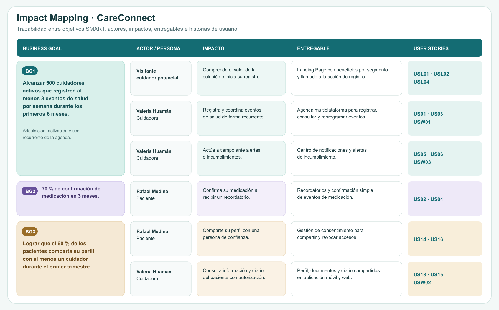

<!--
=====================================================================
 PLANTILLA — Informe de Trabajo Final · 1ASI0732 Diseño de Experimentos
 Un solo archivo README.md (archivo principal del repositorio del informe).
 Estructura completa según el statement: 3 Partes, 8 Capítulos + anexos.
 Reemplazar cada <placeholder> y cada bloque > _Guía:_ con el contenido real.
 Recordar: actualizar y VERIFICAR la Tabla de Contenidos antes de cada entrega.
=====================================================================
-->

# Informe de Trabajo Final

<!-- CARÁTULA -->

" alt="Logo UPC" width="180"/>

**Universidad Peruana de Ciencias Aplicadas (UPC)**

Carrera de Ingeniería de Software

Ciclo académico: **2026-20**

Curso: **1ASI0732 — Diseño de Experimentos de Ingeniería de Software**

NRC: **\<NRC>**

Profesor: **\<Apellidos, Nombres del profesor>**

**Informe de Trabajo Final**

Startup: **CareStacks**

Producto: **CareConnect**

**Relación de integrantes:**

| Código      | Apellidos y Nombres |
|-------------|---------------------|
| \<código>   | \<Apellidos, Nombres> |
| \<código>   | \<Apellidos, Nombres> |
| \<código>   | \<Apellidos, Nombres> |
| \<código>   | \<Apellidos, Nombres> |
| \<código>   | \<Apellidos, Nombres> |

**\<Mes> \<Año>**

---

## Registro de Versiones del Informe

> _Guía:_ Resumen de modificaciones relevantes durante el ciclo de vida. Una línea por versión, **un solo autor por línea**. La primera línea es la versión inicial. Modificaciones relevantes: adición/eliminación de secciones, correcciones/mejoras por feedback del docente o autocrítica del equipo.

| Versión | Fecha (YYYY-MM-DD) | Autor | Descripción de modificación |
|---------|--------------------|-------|-----------------------------|
| 1.0     | \<fecha>           | \<Apellidos, Nombres> | \<descripción> |

---

## Project Report Collaboration Insights

> _Guía:_ Indicar el URL del repositorio del Project Report en la organización GitHub del equipo. Por cada entrega, explicar cómo se desarrollaron las actividades del informe e incluir **capturas de los analíticos de colaboración y commits** en GitHub. Todos los integrantes deben participar. Debe ser coherente con el Registro de Versiones.

- Repositorio del informe: \<url-repo-github>

---

## Tabla de Contenidos

<!-- 4 niveles. Verificar los anclajes (#) antes de cada entrega: GitHub genera el ancla a partir del texto del título. -->

- [Student Outcome](#student-outcome)
- [Part I: As-Is Software Project](#part-i-as-is-software-project)
  - [Capítulo I: Introducción](#capítulo-i-introducción)
    - [1.1. Startup Profile](#11-startup-profile)
      - [1.1.1. Descripción de la Startup](#111-descripción-de-la-startup)
      - [1.1.2. Perfiles de integrantes del equipo](#112-perfiles-de-integrantes-del-equipo)
    - [1.2. Solution Profile](#12-solution-profile)
      - [1.2.1. Antecedentes y problemática](#121-antecedentes-y-problemática)
      - [1.2.2. Lean UX Process](#122-lean-ux-process)
    - [1.3. Segmentos objetivo](#13-segmentos-objetivo)
  - [Capítulo II: Requirements Elicitation & Analysis](#capítulo-ii-requirements-elicitation--analysis)
    - [2.1. Competidores](#21-competidores)
    - [2.2. Entrevistas](#22-entrevistas)
    - [2.3. Needfinding](#23-needfinding)
    - [2.4. Ubiquitous Language](#24-ubiquitous-language)
  - [Capítulo III: Requirements Specification](#capítulo-iii-requirements-specification)
    - [3.1. To-Be Scenario Mapping](#31-to-be-scenario-mapping)
    - [3.2. User Stories](#32-user-stories)
    - [3.3. Product Backlog](#33-product-backlog)
    - [3.4. Impact Mapping](#34-impact-mapping)
  - [Capítulo IV: Product Design](#capítulo-iv-product-design)
    - [4.1. Style Guidelines](#41-style-guidelines)
    - [4.2. Information Architecture](#42-information-architecture)
    - [4.3. Landing Page UI Design](#43-landing-page-ui-design)
    - [4.4. Mobile Applications UX/UI Design](#44-mobile-applications-uxui-design)
    - [4.5. Mobile Applications Prototyping](#45-mobile-applications-prototyping)
    - [4.6. Web Applications UX/UI Design](#46-web-applications-uxui-design)
    - [4.7. Web Applications Prototyping](#47-web-applications-prototyping)
    - [4.8. Domain-Driven Software Architecture](#48-domain-driven-software-architecture)
    - [4.9. Software Object-Oriented Design](#49-software-object-oriented-design)
    - [4.10. Database Design](#410-database-design)
  - [Capítulo V: Product Implementation](#capítulo-v-product-implementation)
    - [5.1. Software Configuration Management](#51-software-configuration-management)
    - [5.2. Product Implementation & Deployment](#52-product-implementation--deployment)
    - [5.3. Video About-the-Product](#53-video-about-the-product)
- [Part II: Verification, Validation & Pipeline](#part-ii-verification-validation--pipeline)
  - [Capítulo VI: Product Verification & Validation](#capítulo-vi-product-verification--validation)
    - [6.1. Testing Suites & Validation](#61-testing-suites--validation)
    - [6.2. Static testing & Verification](#62-static-testing--verification)
    - [6.3. Validation Interviews](#63-validation-interviews)
    - [6.4. Auditoría de Experiencias de Usuario](#64-auditoría-de-experiencias-de-usuario)
  - [Capítulo VII: DevOps Practices](#capítulo-vii-devops-practices)
    - [7.1. Continuous Integration](#71-continuous-integration)
    - [7.2. Continuous Delivery](#72-continuous-delivery)
    - [7.3. Continuous deployment](#73-continuous-deployment)
    - [7.4. Continuous Monitoring](#74-continuous-monitoring)
- [Part III: Experiment-Driven Lifecycle](#part-iii-experiment-driven-lifecycle)
  - [Capítulo VIII: Experiment-Driven Development](#capítulo-viii-experiment-driven-development)
    - [8.1. Experiment Planning](#81-experiment-planning)
    - [8.2. Experiment Design](#82-experiment-design)
    - [8.3. Experimentation](#83-experimentation)
    - [8.4. Experiment Aftermath & Analysis](#84-experiment-aftermath--analysis)
    - [8.5. Continuous Learning](#85-continuous-learning)
    - [8.6. To-Be Software Platform Pre-launch](#86-to-be-software-platform-pre-launch)
- [Matriz de Evaluación Ética y de Impacto](#matriz-de-evaluación-ética-y-de-impacto)
- [Conclusiones](#conclusiones)
- [Bibliografía](#bibliografía)
- [Anexos](#anexos)

---

## Student Outcome

> _Guía:_ Colocar el párrafo introductorio idéntico al Anexo A del statement. Una subsección por alumno describiendo la relación outcome–dimensiones–trabajo. En "Acciones realizadas" identificar cada participante y por entrega (AV1, TP, AV2, TB2). "Conclusiones" grupales y acumulables.

El curso contribuye al cumplimiento del Student Outcome ABET:

**ABET – EAC – Student Outcome 4**
**Criterio:** La capacidad de reconocer responsabilidades éticas y profesionales en situaciones de ingeniería y hacer juicios informados, que deben considerar el impacto de las soluciones de ingeniería en contextos globales, económicos, ambientales y sociales.

| Criterio específico | Acciones realizadas | Conclusiones |
|---------------------|---------------------|--------------|
| **4.c.1** Reconoce responsabilidad ética y profesional en situaciones de ingeniería de software | \<Apellidos, Nombres> AV1: \<acciones> TP: … AV2: … TB2: … | \<conclusiones grupales acumulables> |
| **4.c.2** Emite juicios informados considerando el impacto de las soluciones de ingeniería de software en contextos globales, económicos, ambientales y sociales | \<Apellidos, Nombres> AV1: \<acciones> TP: … AV2: … TB2: … | \<conclusiones grupales acumulables> |

---

# Part I: As-Is Software Project

## Capítulo I: Introducción

### 1.1. Startup Profile

#### 1.1.1. Descripción de la Startup
> _Guía:_ Descripción de CareStacks.

#### 1.1.2. Perfiles de integrantes del equipo
> _Guía:_ Por integrante: foto, nombres y apellidos, código, descripción de carrera y párrafo de conocimientos técnicos/habilidades que aporta.

### 1.2. Solution Profile

#### 1.2.1. Antecedentes y problemática
> _Guía:_ Enunciado del problema aplicando 5W+2H (Who, What, Where, When, Why, How, How Much). Objetivos y restricciones que delimitan el alcance.

#### 1.2.2. Lean UX Process

##### 1.2.2.1. Lean UX Problem Statements
> _Guía:_ Domain, customer segments, pain points, gap, vision/strategy, initial segment.

##### 1.2.2.2. Lean UX Assumptions

##### 1.2.2.3. Lean UX Hypothesis Statements

##### 1.2.2.4. Lean UX Canvas

### 1.3. Segmentos objetivo
> _Guía:_ Descripción de segmentos con características demográficas e información estadística de sustento.

## Capítulo II: Requirements Elicitation & Analysis

### 2.1. Competidores

#### 2.1.1. Análisis competitivo
> _Guía:_ Competitive Analysis Landscape (mín. 3 competidores directos) + SWOT enfocado en la competencia.

#### 2.1.2. Estrategias y tácticas frente a competidores

### 2.2. Entrevistas

#### 2.2.1. Diseño de entrevistas
> _Guía:_ Preguntas principales y complementarias por segmento.

#### 2.2.2. Registro de entrevistas
> _Guía:_ **3 a 5 entrevistas por segmento.** Nombres, apellidos, edad, distrito, screenshot y URL de Microsoft Stream con timing y duración. Resumen por entrevista.

#### 2.2.3. Análisis de entrevistas
> _Guía:_ Análisis por segmento con sustento estadístico (porcentajes).

### 2.3. Needfinding

#### 2.3.1. User Personas
> _Guía:_ Una ficha por segmento (UXPressia).

#### 2.3.2. User Task Matrix

#### 2.3.3. User Journey Mapping
> _Guía:_ Versión As-Is, uno por User Persona (UXPressia).

#### 2.3.4. Empathy Mapping

#### 2.3.5. As-is Scenario Mapping
> _Guía:_ Uno por User Persona (LucidChart/Miro). Filas Phases, Doing, Thinking, Feeling + áreas positivas/negativas/blank.

### 2.4. Ubiquitous Language
> _Guía:_ Glosario del dominio, términos en inglés, sin términos técnicos de ingeniería de software.

## Capítulo III: Requirements Specification

<!-- ===== CAPÍTULO ASIGNADO A ESTE INTEGRANTE ===== -->
> _Guía:_ Introducción del capítulo: en base al análisis, se especifican los requisitos de los productos digitales. Incluye To-Be Scenario Mapping, User Stories, Impact Map y Product Backlog.

### 3.1. To-Be Scenario Mapping
> _Guía:_ **(Crear desde cero — no existe en el material reciclado.)** Uno por User Persona (LucidChart/Miro). Filas Phases, Doing, Thinking, Feeling. Comparar explícitamente contra el As-Is Scenario Mapping, identificando los cambios que introduce la solución.

<!-- Insertar captura por User Persona + explicación -->

### 3.2. User Stories
> _Nota:_ Contenido reciclado del informe del ciclo anterior (CareConnect). Acceptance Criteria en Gherkin (Dado-Cuando-Entonces). **Pendiente:** agregar US del landing (rol *visitante*) y US de la Frontend Web Application (según decisión de stack). Revisar redacción menor de algunos AC.

**Epics**

| Epic ID | Nombre de la Épica | Descripción |
|---------|--------------------|-------------|
| EP01 | Gestión de Agenda | Como paciente o cuidador, quiero gestionar eventos de salud para organizar medicación y citas en el tiempo. |
| EP02 | Gestión de Notificaciones | Como paciente o cuidador, quiero recibir notificaciones para dar seguimiento oportuno a los eventos de salud. |
| EP03 | Gestión de Documentos | Como paciente o cuidador, quiero gestionar documentos médicos para mantener un registro accesible. |
| EP04 | Gestión de Consentimiento | Como paciente, quiero compartir mi perfil con un cuidador para permitir el seguimiento de mi estado de salud. |
| EP05 | Diario de Seguimiento | Como paciente o cuidador, quiero registrar notas de seguimiento para monitorear la evolución del estado de salud. |
| EP06 | Autenticación | Como paciente o cuidador, quiero acceder al sistema de forma segura para proteger mi información personal. |

**User Stories**

| **Story ID** | US01 |
|--------------|------|
| **User** | Paciente / Cuidador |
| **Priority** | Alta |
| **Epic** | Gestión de Agenda |
| **Description** | Como paciente o cuidador, deseo registrar un evento de salud (medicación o cita) para organizar las actividades médicas en un calendario. |
| **Acceptance Criteria** | Escenario 1: Registro exitoso de evento   Dado que el paciente o cuidador ingresa datos válidos del evento   Cuando registra el evento de salud   Entonces el sistema almacena el evento correctamente en la agenda    Escenario 2: Validación de datos obligatorios   Dado que el paciente o cuidador omite datos obligatorios   Cuando intenta registrar el evento   Entonces el sistema muestra un mensaje de error indicando los campos requeridos    Escenario 3: Visualización del evento   Dado que el evento fue registrado correctamente   Cuando el paciente o cuidador accede al calendario   Entonces el evento se visualiza en la fecha correspondiente |

| **Story ID** | US02 |
|--------------|------|
| **User** | Paciente |
| **Priority** | Alta |
| **Epic** | Gestión de Agenda |
| **Description** | Como paciente, deseo confirmar un evento de salud para registrar el cumplimiento de mi tratamiento. |
| **Acceptance Criteria** | Escenario 1: Confirmación exitosa   Dado que existe un evento programado   Cuando el paciente confirma el evento   Entonces el sistema actualiza su estado a "confirmado"    Escenario 2: Visualización del estado   Dado que el evento fue confirmado   Cuando el paciente accede al calendario   Entonces el estado del evento se muestra como confirmado |

| **Story ID** | US03 |
|--------------|------|
| **User** | Paciente / Cuidador |
| **Priority** | Media |
| **Epic** | Gestión de Agenda |
| **Description** | Como paciente o cuidador, deseo reprogramar un evento de salud para ajustarlo a cambios en la disponibilidad. |
| **Acceptance Criteria** | Escenario 1: Reprogramación exitosa   Dado que existe un evento previamente registrado   Cuando el paciente o cuidador modifica la fecha u hora   Entonces el sistema actualiza el evento correctamente    Escenario 2: Validación de conflicto   Dado que existe otro evento en el mismo horario   Cuando el paciente o cuidador intenta reprogramar   Entonces el sistema evita el conflicto y muestra una advertencia |

| **Story ID** | US04 |
|--------------|------|
| **User** | Paciente |
| **Priority** | Alta |
| **Epic** | Gestión de Notificaciones |
| **Description** | Como paciente, deseo recibir recordatorios de mis eventos de salud para cumplir con mis actividades programadas. |
| **Acceptance Criteria** | Escenario 1: Envío de recordatorio   Dado que existe un evento programado   Cuando se aproxima la hora del evento   Entonces el paciente recibe una notificación    Escenario 2: Contenido de la notificación   Dado que se genera una notificación   Cuando el paciente la visualiza   Entonces esta contiene información relevante del evento |

| **Story ID** | US05 |
|--------------|------|
| **User** | Cuidador |
| **Priority** | Alta |
| **Epic** | Gestión de Notificaciones |
| **Description** | Como cuidador, deseo recibir alertas cuando un evento no es confirmado para supervisar al paciente. |
| **Acceptance Criteria** | Escenario 1: Generación de alerta   Dado que un evento no ha sido confirmado   Cuando se supera el tiempo límite establecido   Entonces el cuidador recibe una alerta de incumplimiento    Escenario 2: Validación de permisos   Dado que el cuidador no tiene acceso al paciente   Cuando se genera la alerta   Entonces el sistema no envía la notificación |

| **Story ID** | US06 |
|--------------|------|
| **User** | Cuidador |
| **Priority** | Media |
| **Epic** | Gestión de Notificaciones |
| **Description** | Como cuidador, deseo visualizar las notificaciones recibidas para monitorear el estado del paciente. |
| **Acceptance Criteria** | Escenario 1: Consulta de notificaciones   Dado que existen notificaciones registradas   Cuando el cuidador accede a la sección de notificaciones   Entonces el sistema muestra la lista de notificaciones    Escenario 2: Orden de visualización   Dado que existen múltiples notificaciones   Cuando el cuidador las visualiza   Entonces se muestran ordenadas por fecha o prioridad |

| **Story ID** | US07 |
|--------------|------|
| **User** | Paciente / Cuidador |
| **Priority** | Alta |
| **Epic** | Gestión de Documentos |
| **Description** | Como paciente o cuidador, deseo subir documentos médicos para mantener un registro digital accesible. |
| **Acceptance Criteria** | Escenario 1: Carga exitosa   Dado que el paciente o cuidador selecciona un archivo válido   Cuando lo sube al sistema   Entonces el documento se almacena correctamente    Escenario 2: Validación de archivo   Dado que el archivo no cumple con formato o tamaño permitido   Cuando el paciente o cuidador intenta subirlo   Entonces el sistema muestra un mensaje de error |

| **Story ID** | US08 |
|--------------|------|
| **User** | Paciente / Cuidador |
| **Priority** | Media |
| **Epic** | Gestión de Documentos |
| **Description** | Como paciente o cuidador, deseo consultar los documentos almacenados para revisar información médica. |
| **Acceptance Criteria** | Escenario 1: Visualización de documentos   Dado que existen documentos almacenados   Cuando el paciente o cuidador accede a la sección correspondiente   Entonces el sistema muestra la lista de documentos disponibles |

| **Story ID** | US09 |
|--------------|------|
| **User** | Cuidador |
| **Priority** | Media |
| **Epic** | Gestión de Documentos |
| **Description** | Como cuidador, deseo acceder a los documentos del paciente para apoyar en su seguimiento. |
| **Acceptance Criteria** | Escenario 1: Acceso autorizado   Dado que el cuidador tiene permisos de acceso   Cuando consulta los documentos del paciente   Entonces el sistema permite su visualización    Escenario 2: Acceso denegado   Dado que el cuidador no tiene permisos   Cuando intenta acceder a los documentos   Entonces el sistema bloquea el acceso y muestra un mensaje de restricción |

| **Story ID** | US10 |
|--------------|------|
| **User** | Paciente / Cuidador |
| **Priority** | Alta |
| **Epic** | Autenticación |
| **Description** | Como usuario, quiero registrar mi propia cuenta para acceder a la plataforma. |
| **Acceptance Criteria** | Escenario 1: Creación de cuenta   Dado que el usuario ingresa datos válidos   Cuando registra su cuenta   Entonces el sistema crea la cuenta del usuario    Escenario 2: Creación denegada   Dado que el correo ya existe   Cuando el usuario intenta registrarse   Entonces el sistema bloquea el registro y muestra "el usuario con este correo ya existe" |

| **Story ID** | US11 |
|--------------|------|
| **User** | Paciente / Cuidador |
| **Priority** | Alta |
| **Epic** | Autenticación |
| **Description** | Como usuario, quiero validar el acceso según el rol que poseo. |
| **Acceptance Criteria** | Escenario 1: Acceso permitido   Dado que el usuario tiene permisos válidos   Cuando abre la aplicación   Entonces el sistema le muestra lo que le corresponde según su rol    Escenario 2: Acceso denegado   Dado que el usuario no tiene permisos   Cuando intenta acceder a otra sección   Entonces el sistema bloquea el acceso y muestra un mensaje de restricción |

| **Story ID** | US12 |
|--------------|------|
| **User** | Paciente / Cuidador |
| **Priority** | Media |
| **Epic** | Diario de Seguimiento |
| **Description** | Como paciente o cuidador, quiero escribir notas en mi diario para registrar mi estado o el de mi familiar. |
| **Acceptance Criteria** | Escenario 1: Nota registrada   Dado que el paciente o cuidador ingresa contenido válido   Cuando guarda la nota   Entonces la nota se almacena correctamente    Escenario 2: Nota vacía   Dado que el paciente o cuidador no ingresa contenido   Cuando intenta guardar   Entonces el sistema muestra un mensaje de error |

| **Story ID** | US13 |
|--------------|------|
| **User** | Cuidador |
| **Priority** | Media |
| **Epic** | Diario de Seguimiento |
| **Description** | Como cuidador, quiero consultar el diario compartido del paciente para conocer su estado. |
| **Acceptance Criteria** | Escenario 1: Consulta exitosa   Dado que el cuidador posee acceso autorizado   Cuando consulta el diario del paciente   Entonces el sistema le muestra las notas    Escenario 2: Acceso denegado   Dado que el cuidador no tiene permisos   Cuando intenta acceder a las notas   Entonces el sistema bloquea el acceso y muestra un mensaje de restricción |

| **Story ID** | US14 |
|--------------|------|
| **User** | Paciente |
| **Priority** | Alta |
| **Epic** | Gestión de Consentimiento |
| **Description** | Como paciente, quiero compartir mi perfil con familiares para que puedan ver mi información. |
| **Acceptance Criteria** | Escenario 1: Compartir exitoso   Dado que el familiar es un usuario válido   Cuando comparto mi perfil   Entonces el sistema otorga el acceso al familiar    Escenario 2: Error al compartir   Dado que el familiar no es un usuario válido   Cuando intento compartir el perfil   Entonces el sistema muestra un mensaje de usuario no existe |

| **Story ID** | US15 |
|--------------|------|
| **User** | Cuidador |
| **Priority** | Media |
| **Epic** | Gestión de Consentimiento |
| **Description** | Como cuidador, quiero consultar el perfil compartido del paciente para acceder a su información. |
| **Acceptance Criteria** | Escenario 1: Consulta exitosa   Dado que el paciente me dio permiso   Cuando consulto el perfil   Entonces se muestra la información    Escenario 2: Acceso inválido   Dado que el paciente no otorgó permisos   Cuando intento consultar el perfil   Entonces el sistema bloquea el acceso y muestra un mensaje de restricción |

| **Story ID** | US16 |
|--------------|------|
| **User** | Paciente |
| **Priority** | Media |
| **Epic** | Gestión de Consentimiento |
| **Description** | Como paciente, quiero revocar el acceso a mi perfil para controlar quién puede ver mi información. |
| **Acceptance Criteria** | Escenario 1: Revocación exitosa   Dado que el paciente otorgó los permisos   Cuando revoca el acceso   Entonces el sistema quita los privilegios al cuidador    Escenario 2: Acción no permitida   Dado que el paciente ya revocó el permiso al cuidador   Cuando intenta revocar nuevamente   Entonces el sistema muestra un mensaje de error |

**Technical Stories** (rol Developer)

| **Story ID** | TS01 |
|--------------|------|
| **User** | Desarrollador |
| **Priority** | Alta |
| **Description** | Como desarrollador, quiero implementar la persistencia de eventos de salud (citas y medicación) para garantizar su almacenamiento y consulta eficiente. |
| **Acceptance Criteria** | Escenario 1: Almacenamiento exitoso   Dado que se recibe un evento válido   Cuando el sistema lo procesa   Entonces el evento se almacena correctamente en la base de datos    Escenario 2: Integridad de datos   Dado que ocurre un error en el almacenamiento   Cuando el sistema intenta guardar el evento   Entonces se evita la persistencia de datos incompletos |

| **Story ID** | TS02 |
|--------------|------|
| **User** | Desarrollador |
| **Priority** | Alta |
| **Description** | Como desarrollador, quiero implementar la lógica de cambio de estado de los eventos (pendiente, confirmado, incumplido) para reflejar el seguimiento del paciente. |
| **Acceptance Criteria** | Escenario 1: Cambio de estado válido   Dado que existe un evento registrado   Cuando se actualiza su estado   Entonces el sistema persiste el nuevo estado correctamente    Escenario 2: Validación de transición   Dado un estado inválido   Cuando se intenta actualizar   Entonces el sistema rechaza la operación |

| **Story ID** | TS03 |
|--------------|------|
| **User** | Desarrollador |
| **Priority** | Alta |
| **Description** | Como desarrollador, quiero implementar un servicio de programación que genere notificaciones basadas en la fecha y hora de los eventos registrados. |
| **Acceptance Criteria** | Escenario 1: Programación correcta   Dado que existe un evento con fecha definida   Cuando se agenda la notificación   Entonces el sistema programa su envío correctamente    Escenario 2: Reprogramación   Dado que el evento cambia de horario   Cuando se actualiza   Entonces la notificación se reprograma automáticamente |

| **Story ID** | TS04 |
|--------------|------|
| **User** | Desarrollador |
| **Priority** | Alta |
| **Description** | Como desarrollador, quiero implementar el mecanismo de envío de notificaciones push hacia pacientes y cuidadores según reglas de negocio. |
| **Acceptance Criteria** | Escenario 1: Envío exitoso   Dado que existe una notificación programada   Cuando se cumple la condición de envío   Entonces el sistema envía la notificación al destinatario    Escenario 2: Manejo de fallos   Dado que falla el envío   Cuando ocurre el error   Entonces el sistema registra el incidente y reintenta según configuración |

| **Story ID** | TS05 |
|--------------|------|
| **User** | Desarrollador |
| **Priority** | Media |
| **Description** | Como desarrollador, quiero implementar validaciones de permisos para asegurar que solo usuarios autorizados reciban notificaciones. |
| **Acceptance Criteria** | Escenario 1: Acceso autorizado   Dado que el usuario tiene permisos   Cuando se genera una notificación   Entonces el sistema permite su envío    Escenario 2: Acceso restringido   Dado que el usuario no tiene permisos   Cuando se genera una notificación   Entonces el sistema bloquea el envío |

| **Story ID** | TS06 |
|--------------|------|
| **User** | Desarrollador |
| **Priority** | Alta |
| **Description** | Como desarrollador, quiero implementar el almacenamiento de documentos médicos en un sistema seguro para garantizar su disponibilidad. |
| **Acceptance Criteria** | Escenario 1: Almacenamiento correcto   Dado que se recibe un archivo válido   Cuando el sistema lo procesa   Entonces el documento se almacena correctamente    Escenario 2: Validación de archivo   Dado un archivo inválido   Cuando se intenta almacenar   Entonces el sistema rechaza la operación |

| **Story ID** | TS07 |
|--------------|------|
| **User** | Desarrollador |
| **Priority** | Media |
| **Description** | Como desarrollador, quiero implementar el registro de metadatos (tipo, fecha, paciente, descripción) asociados a cada documento. |
| **Acceptance Criteria** | Escenario 1: Registro de metadatos   Dado que se almacena un documento   Cuando se registran sus atributos   Entonces el sistema guarda correctamente los metadatos    Escenario 2: Consistencia   Dado datos incompletos   Cuando se intenta registrar   Entonces el sistema valida y rechaza la operación |

| **Story ID** | TS08 |
|--------------|------|
| **User** | Desarrollador |
| **Priority** | Alta |
| **Description** | Como desarrollador, quiero implementar mecanismos de autorización para controlar el acceso a documentos entre paciente y cuidador. |
| **Acceptance Criteria** | Escenario 1: Acceso permitido   Dado que el cuidador tiene permisos   Cuando solicita acceso   Entonces el sistema permite visualizar el documento    Escenario 2: Acceso denegado   Dado que no tiene permisos   Cuando intenta acceder   Entonces el sistema bloquea la operación |

| **Story ID** | TS09 |
|--------------|------|
| **User** | Desarrollador |
| **Priority** | Alta |
| **Description** | Como desarrollador, quiero implementar la persistencia de usuarios para garantizar el registro correcto en la base de datos. |
| **Acceptance Criteria** | Escenario 1: Registro exitoso   Dado que el usuario envía datos válidos   Cuando el sistema procesa el registro   Entonces el usuario se almacena correctamente en la base de datos    Escenario 2: Usuario duplicado   Dado que el correo ya existe   Cuando el sistema intenta registrar el usuario   Entonces se evita el registro duplicado y se muestra un error |

| **Story ID** | TS10 |
|--------------|------|
| **User** | Desarrollador |
| **Priority** | Alta |
| **Description** | Como desarrollador, quiero implementar validación de acceso por roles para garantizar seguridad en los recursos. |
| **Acceptance Criteria** | Escenario 1: Acceso autorizado   Dado que el usuario tiene el rol correcto   Cuando intenta acceder a un recurso   Entonces el sistema permite el acceso    Escenario 2: Acceso denegado   Dado que el usuario no tiene permisos   Cuando intenta acceder   Entonces el sistema bloquea el acceso |

| **Story ID** | TS11 |
|--------------|------|
| **User** | Desarrollador |
| **Priority** | Alta |
| **Description** | Como desarrollador, quiero almacenar notas del diario para asegurar su disponibilidad. |
| **Acceptance Criteria** | Escenario 1: Guardado exitoso   Dado que la nota tiene contenido válido   Cuando el sistema guarda la nota   Entonces se almacena correctamente    Escenario 2: Nota inválida   Dado que la nota está vacía   Cuando el sistema intenta guardarla   Entonces se rechaza la operación |

| **Story ID** | TS12 |
|--------------|------|
| **User** | Desarrollador |
| **Priority** | Media |
| **Description** | Como desarrollador, quiero implementar la consulta de diarios compartidos para permitir acceso a cuidadores. |
| **Acceptance Criteria** | Escenario 1: Consulta autorizada   Dado que el usuario tiene acceso   Cuando consulta el diario   Entonces se muestran las notas    Escenario 2: Acceso denegado   Dado que no tiene permisos   Cuando intenta consultar   Entonces el sistema bloquea el acceso |

| **Story ID** | TS13 |
|--------------|------|
| **User** | Desarrollador |
| **Priority** | Media |
| **Description** | Como desarrollador, quiero permitir la visualización de perfiles compartidos. |
| **Acceptance Criteria** | Escenario 1: Consulta exitosa   Dado que el usuario tiene acceso   Cuando consulta el perfil   Entonces se muestra la información    Escenario 2: Acceso inválido   Dado que no tiene permisos   Cuando intenta acceder   Entonces se bloquea el acceso |

| **Story ID** | TS14 |
|--------------|------|
| **User** | Desarrollador |
| **Priority** | Media |
| **Description** | Como desarrollador, quiero implementar la revocación de accesos para controlar permisos. |
| **Acceptance Criteria** | Escenario 1: Revocación exitosa   Dado que existe acceso activo   Cuando el propietario revoca acceso   Entonces se elimina el permiso    Escenario 2: Usuario sin permiso   Dado que no es propietario   Cuando intenta revocar   Entonces se rechaza la acción |

**Spike Stories**

Investigaciones técnicas acotadas en el tiempo, orientadas a reducir la incertidumbre antes de comprometer una User Story o decisión de arquitectura.

| **Story ID** | SP01 |
|--------------|------|
| **Tipo** | Spike (técnico) |
| **Priority** | Alta |
| **Timebox** | 2 días |
| **Description** | Como equipo de desarrollo, queremos investigar cómo entregar notificaciones push de medicación en dispositivos con conectividad intermitente, comparando Firebase Cloud Messaging vs. AlarmManager local, para decidir la estrategia del Bounded Context de Notificaciones. |
| **Resultado esperado** | Documento corto con recomendación, prototipo mínimo y criterios de decisión (latencia, batería, costo, complejidad). |

| **Story ID** | SP02 |
|--------------|------|
| **Tipo** | Spike (técnico + legal) |
| **Priority** | Alta |
| **Timebox** | 3 días |
| **Description** | Como equipo, queremos investigar patrones técnicos (tokens firmados con expiración + lista de revocación) y requisitos legales (Ley N° 29733, HIPAA-like) para implementar el otorgamiento y revocación de consentimiento del paciente sobre su información clínica. |
| **Resultado esperado** | Documento con esquema técnico, validación con caso de uso de revocación inmediata y referencias normativas aplicables. |

| **Story ID** | SP03 |
|--------------|------|
| **Tipo** | Spike (arquitectura) |
| **Priority** | Media |
| **Timebox** | 2 días |
| **Description** | Como equipo, queremos comparar Flutter y Kotlin Multiplatform en términos de productividad, performance, soporte de notificaciones nativas y curva de aprendizaje para decidir el stack móvil del MVP. |
| **Resultado esperado** | Matriz comparativa, prototipos en cada tecnología consumiendo un endpoint REST y recomendación final. |

| **Story ID** | SP04 |
|--------------|------|
| **Tipo** | Spike (técnico) |
| **Priority** | Media |
| **Timebox** | 2 días |
| **Description** | Como equipo, queremos investigar opciones de almacenamiento cifrado en reposo y en tránsito para documentos clínicos del paciente (recetas, resultados), comparando S3 con SSE-KMS, GCS y un esquema local cifrado. |
| **Resultado esperado** | Recomendación de servicio, esquema de cifrado y plan de manejo de claves. |

| **Story ID** | SP05 |
|--------------|------|
| **Tipo** | Spike (arquitectura) |
| **Priority** | Media |
| **Timebox** | 2 días |
| **Description** | Como equipo, queremos definir cómo sincronizar Diario y Agenda entre el dispositivo (SQLite/Room) y el backend tras periodos sin conexión, evitando conflictos y pérdidas de información. |
| **Resultado esperado** | Documento de estrategia de sincronización con manejo de conflictos y prototipo mínimo. |

### 3.3. Product Backlog
> _Nota:_ Reciclado del ciclo anterior. Ids normalizados a US01–US16 / TS01–TS14 y numeración de orden corregida. **Pendiente:** captura + URL público de la herramienta (Trello/Jira/Pivotal) y agregar US del landing desde el primer sprint. Revisar orden por valor de negocio.

Orden por valor para el negocio. Los User Stories incluyen su estimación en Story Points.

| # Orden | User Story ID | Título | Descripción | Story Points (1/2/3/5/8) |
|--------:|---------------|--------|-------------|:------------------------:|
| 1  | US01 | Registrar evento de salud | Como paciente o cuidador, deseo registrar un evento de salud (medicación o cita) para organizar las actividades médicas en un calendario. | 3 |
| 2  | US02 | Confirmar evento de salud | Como paciente, deseo confirmar un evento de salud para registrar el cumplimiento de mi tratamiento. | 3 |
| 3  | US03 | Reprogramar evento de salud | Como paciente o cuidador, deseo reprogramar un evento de salud para ajustarlo a cambios en la disponibilidad. | 3 |
| 4  | US04 | Recibir recordatorios de eventos | Como paciente, deseo recibir recordatorios de mis eventos de salud para cumplir con mis actividades programadas. | 2 |
| 5  | US05 | Recibir alertas de incumplimiento | Como cuidador, deseo recibir alertas cuando un evento no es confirmado para supervisar al paciente. | 2 |
| 6  | US06 | Visualizar notificaciones | Como cuidador, deseo visualizar las notificaciones recibidas para monitorear el estado del paciente. | 1 |
| 7  | US07 | Subir documento médico | Como paciente o cuidador, deseo subir documentos médicos para mantener un registro digital accesible. | 2 |
| 8  | US08 | Consultar documentos | Como paciente o cuidador, deseo consultar los documentos almacenados para revisar información médica. | 1 |
| 9  | US09 | Acceder a documentos compartidos | Como cuidador, deseo acceder a los documentos del paciente para apoyar en su seguimiento. | 3 |
| 10 | US10 | Registrar cuenta | Como usuario, quiero registrar mi propia cuenta para acceder a la plataforma. | 2 |
| 11 | US11 | Validar acceso por rol | Como usuario, quiero validar el acceso según el rol que poseo. | 3 |
| 12 | US12 | Escribir nota | Como paciente o cuidador, quiero escribir notas en mi diario para registrar mi estado o el de mi familiar. | 2 |
| 13 | US13 | Consultar diarios compartidos | Como cuidador, quiero consultar el diario compartido del paciente para conocer su estado. | 3 |
| 14 | US14 | Compartir perfil | Como paciente, quiero compartir mi perfil con familiares para que puedan ver mi información. | 3 |
| 15 | US15 | Consultar perfil compartido | Como cuidador, quiero consultar el perfil compartido del paciente para acceder a su información. | 3 |
| 16 | US16 | Revocar acceso | Como paciente, quiero revocar el acceso a mi perfil para controlar quién puede ver mi información. | 3 |
| 17 | TS01 | Persistencia de eventos de agenda | Como desarrollador, quiero implementar la persistencia de eventos de salud (citas y medicación) para garantizar su almacenamiento y consulta eficiente. | 3 |
| 18 | TS02 | Gestión de estado de eventos | Como desarrollador, quiero implementar la lógica de cambio de estado de los eventos (pendiente, confirmado, incumplido) para reflejar el seguimiento del paciente. | 3 |
| 19 | TS03 | Programación de notificaciones | Como desarrollador, quiero implementar un servicio de programación que genere notificaciones basadas en la fecha y hora de los eventos registrados. | 3 |
| 20 | TS04 | Envío de notificaciones | Como desarrollador, quiero implementar el mecanismo de envío de notificaciones push hacia pacientes y cuidadores según reglas de negocio. | 2 |
| 21 | TS05 | Control de acceso a notificaciones | Como desarrollador, quiero implementar validaciones de permisos para asegurar que solo usuarios autorizados reciban notificaciones. | 3 |
| 22 | TS06 | Almacenamiento de documentos | Como desarrollador, quiero implementar el almacenamiento de documentos médicos en un sistema seguro para garantizar su disponibilidad. | 2 |
| 23 | TS07 | Gestión de metadatos de documentos | Como desarrollador, quiero implementar el registro de metadatos (tipo, fecha, paciente, descripción) asociados a cada documento. | 3 |
| 24 | TS08 | Control de acceso a documentos | Como desarrollador, quiero implementar mecanismos de autorización para controlar el acceso a documentos entre paciente y cuidador. | 3 |
| 25 | TS09 | Persistencia de usuarios | Como desarrollador, quiero implementar la persistencia de usuarios para garantizar el registro correcto en la base de datos. | 2 |
| 26 | TS10 | Autorización basada en roles | Como desarrollador, quiero implementar validación de acceso por roles para garantizar seguridad en los recursos. | 2 |
| 27 | TS11 | Persistencia de notas | Como desarrollador, quiero almacenar notas del diario para asegurar su disponibilidad. | 2 |
| 28 | TS12 | Consulta de diario compartido | Como desarrollador, quiero implementar la consulta de diarios compartidos para permitir acceso a cuidadores. | 3 |
| 29 | TS13 | Consulta de perfil compartido | Como desarrollador, quiero permitir la visualización de perfiles compartidos. | 3 |
| 30 | TS14 | Revocación de acceso | Como desarrollador, quiero implementar la revocación de accesos para controlar permisos. | 5 |

- URL del Product Backlog: \<url-herramienta>
- Captura del Product Backlog: \<insertar imagen>

### 3.4. Impact Mapping
> _Nota:_ El ciclo anterior solo incluía la imagen del Impact Map (sin tabla textual ni Business Goals SMART explícitos). **Pendiente:** verificar que los Business Goals cumplan SMART y completar la tabla Goal/Actor/Impact/Deliverable enlazada a User Stories. Copiar el asset `assets/impact-map.png`.

El Impact Map permite visualizar cómo las funcionalidades clave de la aplicación se alinean con los objetivos de negocio, considerando a los actores involucrados y los impactos esperados en su comportamiento.

| Business Goal (SMART) | Actor / Persona | Impact | Deliverable | User Stories |
|-----------------------|-----------------|--------|-------------|--------------|
| \<goal SMART>         | \<persona>      | \<impact> | \<deliverable> | \<US ids> |

<!-- ===== FIN CAPÍTULO ASIGNADO ===== -->

## Capítulo IV: Product Design

### 4.1. Style Guidelines

#### 4.1.1. General Style Guidelines
> _Guía:_ Branding, Typography, Colors, Spacing + 4 dimensiones de tono (Divertido/Serio, Formal/Casual, Respetuoso/Irreverente, Entusiasta/Sereno).

#### 4.1.2. Web Style Guidelines
> _Guía:_ Estándares visuales y de interacción para responsive web interfaces (breakpoints, grid, estados, componentes PrimeVue).

#### 4.1.3. Mobile Style Guidelines

##### 4.1.3.1. iOS Mobile Style Guidelines

##### 4.1.3.2. Android Mobile Style Guidelines

### 4.2. Information Architecture

#### 4.2.1. Organization Systems

#### 4.2.2. Labeling Systems

#### 4.2.3. SEO Tags and Meta Tags
> _Guía:_ Title, Description, Keywords, Author como mínimo, para Landing Page y Web Application.

#### 4.2.4. Searching Systems

#### 4.2.5. Navigation Systems

### 4.3. Landing Page UI Design

#### 4.3.1. Landing Page Wireframe
> _Guía:_ Desktop Web Browser y Mobile Web Browser.

#### 4.3.2. Landing Page Mock-up
> _Guía:_ Desktop y Mobile Web Browser (Figma/Adobe XD).

### 4.4. Mobile Applications UX/UI Design

#### 4.4.1. Mobile Applications Wireframes

#### 4.4.2. Mobile Applications Wireflow Diagrams
> _Guía:_ Un Wireflow por User goal.

#### 4.4.3. Mobile Applications Mock-ups

#### 4.4.4. Mobile Applications User Flow Diagrams
> _Guía:_ Un User Flow por User goal (happy/unhappy paths).

### 4.5. Mobile Applications Prototyping

#### 4.5.1. Android Mobile Applications Prototyping
> _Guía:_ Screenshot de video + enlace a Microsoft Stream.

#### 4.5.2. iOS Mobile Applications Prototyping

### 4.6. Web Applications UX/UI Design

#### 4.6.1. Web Applications Wireframes

#### 4.6.2. Web Applications Wireflow Diagrams

#### 4.6.3. Web Applications Mock-ups

#### 4.6.4. Web Applications User Flow Diagrams

### 4.7. Web Applications Prototyping
> _Guía:_ Prototipo navegable Desktop + Mobile Web Browser. Screenshot + video en Microsoft Stream.

### 4.8. Domain-Driven Software Architecture

#### 4.8.1. Software Architecture Context Diagram
> _Guía:_ C4 Model (Structurizr).

#### 4.8.2. Software Architecture Container Diagrams

#### 4.8.3. Software Architecture Components Diagrams

### 4.9. Software Object-Oriented Design

#### 4.9.1. Class Diagrams

#### 4.9.2. Class Dictionary
> _Guía:_ Tabla de clases con atributos, tipos y responsabilidades.

### 4.10. Database Design

#### 4.10.1. Relational/Non-Relational Database Diagram

## Capítulo V: Product Implementation

### 5.1. Software Configuration Management

#### 5.1.1. Software Development Environment Configuration
> _Guía:_ Productos por actividad (Project/Requirements Mgmt, UX/UI, Development, Testing, Deployment, Documentation) con propósito y ruta.

#### 5.1.2. Source Code Management
> _Guía:_ URLs de repositorios (Landing Page, Web Services, Frontend Web). GitFlow: convenciones de feature/release/hotfix branches. Semantic Versioning. Conventional Commits.

#### 5.1.3. Source Code Style Guide & Conventions

#### 5.1.4. Software Deployment Configuration

### 5.2. Product Implementation & Deployment

#### 5.2.1. Sprint Backlogs
> _Guía:_ Por Sprint: Planning (fecha, hora, asistentes, Sprint Goal), Sprint Backlog, Development/Execution/Services Documentation Evidence, Team Collaboration Insights.

#### 5.2.2. Implemented Landing Page Evidence

#### 5.2.3. Implemented Frontend-Web Application Evidence

#### 5.2.4. Acuerdo de Servicio - SaaS
> _Guía:_ Derechos, obligaciones y restricciones. Publicado en "Terms and Conditions" del website y enlazado en footers, con referencia a códigos de ética ACM/IEEE y CIP.

#### 5.2.5. Implemented Native-Mobile Application Evidence

#### 5.2.6. Implemented RESTful API and/or Serverless Backend Evidence

#### 5.2.7. RESTful API documentation
> _Guía:_ OpenAPI vía Swagger. Por acción: verbo HTTP, sintaxis, parámetros, ejemplo y explicación del response.

#### 5.2.8. Team Collaboration Insights

### 5.3. Video About-the-Product
> _Guía:_ Screenshot, URL OneDrive del docente + URL YouTube, duración (1–3 min), al menos un testimonio de usuario. Incrustado en el Landing Page.

---

# Part II: Verification, Validation & Pipeline

## Capítulo VI: Product Verification & Validation

### 6.1. Testing Suites & Validation

#### 6.1.1. Core Entities Unit Tests

#### 6.1.2. Core Integration Tests

#### 6.1.3. Core Behavior-Driven Development
> _Guía:_ Archivos `.feature` en Gherkin ligados a User Stories + Steps en el lenguaje de programación.

#### 6.1.4. Core System Tests

### 6.2. Static testing & Verification

#### 6.2.1. Static Code Analysis

##### 6.2.1.1. Coding standard & Code conventions

##### 6.2.1.2. Code Quality & Code Security
> _Guía:_ Complejidad, duplicación, mantenibilidad + vulnerabilidades (SQLi, XSS, datos sensibles). SonarQube/ESLint/Checkmarx.

#### 6.2.2. Reviews

### 6.3. Validation Interviews

#### 6.3.1. Diseño de Entrevistas

#### 6.3.2. Registro de Entrevistas
> _Guía:_ 3 a 5 entrevistas por segmento. Nombres, edad, distrito, screenshot, URL Microsoft Stream con timing.

#### 6.3.3. Evaluaciones según heurísticas
> _Guía:_ Formato del Anexo D (usabilidad, arquitectura de información, inclusive design) con escala de severidad.

### 6.4. Auditoría de Experiencias de Usuario

#### 6.4.1. Auditoría realizada

##### 6.4.1.1. Información del grupo auditado

##### 6.4.1.2. Cronograma de auditoría realizada

##### 6.4.1.3. Contenido de auditoría realizada

#### 6.4.2. Auditoría recibida

##### 6.4.2.1. Información del grupo auditor

##### 6.4.2.2. Cronograma de auditoría recibida

##### 6.4.2.3. Contenido de auditoría recibida

##### 6.4.2.4. Resumen de modificaciones para subsanar hallazgos

## Capítulo VII: DevOps Practices

### 7.1. Continuous Integration

#### 7.1.1. Tools and Practices

#### 7.1.2. Build & Test Suite Pipeline Components

### 7.2. Continuous Delivery

#### 7.2.1. Tools and Practices

#### 7.2.2. Stages Deployment Pipeline Components

### 7.3. Continuous deployment

#### 7.3.1. Tools and Practices

#### 7.3.2. Production Deployment Pipeline Components

### 7.4. Continuous Monitoring

#### 7.4.1. Tools and Practices

#### 7.4.2. Monitoring Pipeline Components

#### 7.4.3. Alerting Pipeline Components

#### 7.4.4. Notification Pipeline Components

---

# Part III: Experiment-Driven Lifecycle

## Capítulo VIII: Experiment-Driven Development

### 8.1. Experiment Planning

#### 8.1.1. As-Is Summary

#### 8.1.2. Raw Material: Assumptions, Knowledge Gaps, Ideas, Claims

#### 8.1.3. Experiment-Ready Questions
> _Guía:_ Belief-led vs. Exploratory. Aplicar 5W+H para descubrir premisas ocultas.

#### 8.1.4. Question Backlog
> _Guía:_ Lista priorizada de **preguntas** (no features). Motivación "por qué" + puntuación Confianza/Riesgo/Impacto/Interés; en empate gana mayor Riesgo.

#### 8.1.5. Experiment Cards
> _Guía:_ Frontal: Pregunta, Por qué, Hipótesis, Simplest Useful Thing. Posterior: Medidas, Condiciones, Escala.

### 8.2. Experiment Design

#### 8.2.1. Hypotheses
> _Guía:_ Falsificables, testables, medibles. Emparejar cada una con su Hipótesis Nula.

#### 8.2.2. Domain Business Metrics
> _Guía:_ Cada métrica con fórmula, técnica de recolección y meta. Las Experiment Cards solo referencian métricas definidas aquí.

#### 8.2.3. Measures

#### 8.2.4. Conditions
> _Guía:_ Condición experimental vs. de control.

#### 8.2.5. Scale Calculations and Decisions
> _Guía:_ Significancia 5%, potencia 80–95%, MDE explícito. Mostrar cálculo del tamaño de muestra.

#### 8.2.6. Methods Selection
> _Guía:_ Simplest Useful Thing. No ejecutar dos experimentos simultáneos sobre el mismo tema/usuario. Consideración ética de no causar daño.

#### 8.2.7. Data Analytics: Goals, KPIs and Metrics Selection

#### 8.2.8. Web and Mobile Tracking Plan
> _Guía:_ Eventos, propiedades, herramienta y punto de captura por producto.

### 8.3. Experimentation

#### 8.3.1. To-Be User Stories

#### 8.3.2. To-Be Product Backlog

#### 8.3.3. Pipeline-supported, Experiment-Driven To-Be Software Platform Lifecycle

##### 8.3.3.1. To-Be Sprint Backlogs

##### 8.3.3.2. Implemented To-Be Landing Page Evidence

##### 8.3.3.3. Implemented To-Be Frontend-Web Application Evidence

##### 8.3.3.4. Implemented To-Be Native-Mobile Application Evidence

##### 8.3.3.5. Implemented To-Be RESTful API and/or Serverless Backend Evidence

##### 8.3.3.6. Team Collaboration Insights

#### 8.3.4. To-Be Validation Interviews

##### 8.3.4.1. Diseño de Entrevistas

##### 8.3.4.2. Registro de Entrevistas

### 8.4. Experiment Aftermath & Analysis

#### 8.4.1. Analysis and Interpretation of Results
> _Guía:_ Interpretar datos contra hipótesis e hipótesis nula. La hipótesis se **prueba**, no se "valida".

#### 8.4.2. Re-scored and Re-prioritized Question Backlog

### 8.5. Continuous Learning

#### 8.5.1. Shareback Session Artifacts: Learning Workflow

### 8.6. To-Be Software Platform Pre-launch

#### 8.6.1. About-the-Product Intro Video

#### 8.6.2. Resumen usando Gees Framework
> _Guía:_ Matriz con lentes Global, Economic, Environmental, Social; por cada una: indicador clave, hallazgo del sistema y estándar internacional de referencia (ISO/IEC 27001, 25010, ISO 14001, ISO 26000, WCAG 2.2).

---

## Matriz de Evaluación Ética y de Impacto
> _Guía:_ 7 dimensiones (Anexo F): Salud Pública y Seguridad; Inclusión y Accesibilidad; Impacto Social y Cultural; Impacto Económico; Impacto Ambiental; Enfoque Global; Revelación de Peligros y Responsabilidad. Por cada una: riesgos positivos/negativos, a quién afecta y magnitud, y acciones de mitigación.

| Dimensión / Criterio | Identificación de Riesgos e Impactos | Evaluación del Impacto (¿a quién y magnitud?) | Estrategias de Mitigación y Acciones de Diseño |
|----------------------|--------------------------------------|-----------------------------------------------|------------------------------------------------|
| 1. Salud Pública y Seguridad | \<...> | \<...> | \<...> |
| 2. Inclusión y Accesibilidad | \<...> | \<...> | \<...> |
| 3. Impacto Social y Cultural | \<...> | \<...> | \<...> |
| 4. Impacto Económico | \<...> | \<...> | \<...> |
| 5. Impacto Ambiental | \<...> | \<...> | \<...> |
| 6. Enfoque Global | \<...> | \<...> | \<...> |
| 7. Revelación de Peligros y Responsabilidad | \<...> | \<...> | \<...> |

---

## Conclusiones

### Conclusiones y recomendaciones
> _Guía:_ Contrastar Problem Statements, Assumptions, Hypothesis Statements y criterios de éxito del Lean UX frente a los resultados de las validaciones/experimentos. Recomendaciones sobre el Roadmap.

### Video App Validation
> _Guía:_ Evaluación con usuarios vía Firebase App Distribution + video.

### Video About-the-Team
> _Guía:_ Pauta de secuencias con timing hh:mm:ss por sección, cuadro de video representativo, URL Stream + YouTube. Testimonio ante cámara de cada participante (outcomes y competencias, alineado al Outcome 4).

---

## Bibliografía
> _Guía:_ Referencias en formato APA 7ma edición (https://normas-apa.org/).

---

## Anexos
> _Guía:_ Cada anexo inicia en nueva página, diferenciado con letra mayúscula (Anexo A, B, …). Incluir el **Anexo: Videos de Exposiciones** con título e hipervínculo por entrega.

### Anexo: Videos de Exposiciones
| Entrega | Título | Enlace (Microsoft Stream) |
|---------|--------|---------------------------|
| \<AV1/TP/AV2/TB2> | \<título> | \<url> |
