<!--
=====================================================================
 PLANTILLA — Informe de Trabajo Final · 1ASI0732 Diseño de Experimentos
 Un solo archivo README.md (archivo principal del repositorio del informe).
 Estructura completa según el statement: 3 Partes, 8 Capítulos + anexos.
 Reemplazar cada <placeholder> y cada bloque > _Guía:_ con el contenido real.
 Recordar: actualizar y VERIFICAR la Tabla de Contenidos antes de cada entrega.
=====================================================================
-->

# Informe de Trabajo Final

<!-- CARÁTULA -->
<div align="center">


**Universidad Peruana de Ciencias Aplicadas (UPC)**

Carrera de Ingeniería de Software

Ciclo académico: **2026-20**

Curso: **1ASI0732 — Diseño de Experimentos de Ingeniería de Software**

NRC: **9100**

Profesor: **Sanchez Ponce, Alex Humberto**

**Informe de Trabajo Final**

Startup: **CareStacks**

Producto: **CareConnect**

</div>

**Relación de integrantes:**

| Código      | Apellidos y Nombres |
|-------------|---------------------|
| U202319698  | Salcedo Champi, Matias Rodolfo |
| U20221G099  | Nikaido Vargas, Javier Masaru |
| U202319563  | Muñiz Huayanca, Percy Alonso |
| U202415495  | Espinoza Cruz, Angela Milagros |
| U202319881  | Baldeon Armas, Santiago Armando |

**Septiembre 2026**

---

## Registro de Versiones del Informe

> _Guía:_ Resumen de modificaciones relevantes durante el ciclo de vida. Una línea por versión, **un solo autor por línea**. La primera línea es la versión inicial. Modificaciones relevantes: adición/eliminación de secciones, correcciones/mejoras por feedback del docente o autocrítica del equipo.

| Versión | Fecha (YYYY-MM-DD) | Autor | Descripción de modificación |
|---------|--------------------|-------|-----------------------------|
| 1.0     | \<fecha>           | \<Apellidos, Nombres> | \<descripción> |

---

## Project Report Collaboration Insights

> _Guía:_ Indicar el URL del repositorio del Project Report en la organización GitHub del equipo. Por cada entrega, explicar cómo se desarrollaron las actividades del informe e incluir **capturas de los analíticos de colaboración y commits** en GitHub. Todos los integrantes deben participar. Debe ser coherente con el Registro de Versiones.

- Repositorio del informe: \<url-repo-github>

---

## Tabla de Contenidos

<!-- 4 niveles. Verificar los anclajes (#) antes de cada entrega: GitHub genera el ancla a partir del texto del título. -->

- [Student Outcome](#student-outcome)
- [Part I: As-Is Software Project](#part-i-as-is-software-project)
  - [Capítulo I: Introducción](#capítulo-i-introducción)
    - [1.1. Startup Profile](#11-startup-profile)
      - [1.1.1. Descripción de la Startup](#111-descripción-de-la-startup)
      - [1.1.2. Perfiles de integrantes del equipo](#112-perfiles-de-integrantes-del-equipo)
    - [1.2. Solution Profile](#12-solution-profile)
      - [1.2.1. Antecedentes y problemática](#121-antecedentes-y-problemática)
      - [1.2.2. Lean UX Process](#122-lean-ux-process)
    - [1.3. Segmentos objetivo](#13-segmentos-objetivo)
  - [Capítulo II: Requirements Elicitation & Analysis](#capítulo-ii-requirements-elicitation--analysis)
    - [2.1. Competidores](#21-competidores)
    - [2.2. Entrevistas](#22-entrevistas)
    - [2.3. Needfinding](#23-needfinding)
    - [2.4. Ubiquitous Language](#24-ubiquitous-language)
  - [Capítulo III: Requirements Specification](#capítulo-iii-requirements-specification)
    - [3.1. To-Be Scenario Mapping](#31-to-be-scenario-mapping)
    - [3.2. User Stories](#32-user-stories)
    - [3.3. Product Backlog](#33-product-backlog)
    - [3.4. Impact Mapping](#34-impact-mapping)
  - [Capítulo IV: Product Design](#capítulo-iv-product-design)
    - [4.1. Style Guidelines](#41-style-guidelines)
    - [4.2. Information Architecture](#42-information-architecture)
    - [4.3. Landing Page UI Design](#43-landing-page-ui-design)
    - [4.4. Mobile Applications UX/UI Design](#44-mobile-applications-uxui-design)
    - [4.5. Mobile Applications Prototyping](#45-mobile-applications-prototyping)
    - [4.6. Web Applications UX/UI Design](#46-web-applications-uxui-design)
    - [4.7. Web Applications Prototyping](#47-web-applications-prototyping)
    - [4.8. Domain-Driven Software Architecture](#48-domain-driven-software-architecture)
    - [4.9. Software Object-Oriented Design](#49-software-object-oriented-design)
    - [4.10. Database Design](#410-database-design)
  - [Capítulo V: Product Implementation](#capítulo-v-product-implementation)
    - [5.1. Software Configuration Management](#51-software-configuration-management)
    - [5.2. Product Implementation & Deployment](#52-product-implementation--deployment)
    - [5.3. Video About-the-Product](#53-video-about-the-product)
- [Part II: Verification, Validation & Pipeline](#part-ii-verification-validation--pipeline)
  - [Capítulo VI: Product Verification & Validation](#capítulo-vi-product-verification--validation)
    - [6.1. Testing Suites & Validation](#61-testing-suites--validation)
    - [6.2. Static testing & Verification](#62-static-testing--verification)
    - [6.3. Validation Interviews](#63-validation-interviews)
    - [6.4. Auditoría de Experiencias de Usuario](#64-auditoría-de-experiencias-de-usuario)
  - [Capítulo VII: DevOps Practices](#capítulo-vii-devops-practices)
    - [7.1. Continuous Integration](#71-continuous-integration)
    - [7.2. Continuous Delivery](#72-continuous-delivery)
    - [7.3. Continuous deployment](#73-continuous-deployment)
    - [7.4. Continuous Monitoring](#74-continuous-monitoring)
- [Part III: Experiment-Driven Lifecycle](#part-iii-experiment-driven-lifecycle)
  - [Capítulo VIII: Experiment-Driven Development](#capítulo-viii-experiment-driven-development)
    - [8.1. Experiment Planning](#81-experiment-planning)
    - [8.2. Experiment Design](#82-experiment-design)
    - [8.3. Experimentation](#83-experimentation)
    - [8.4. Experiment Aftermath & Analysis](#84-experiment-aftermath--analysis)
    - [8.5. Continuous Learning](#85-continuous-learning)
    - [8.6. To-Be Software Platform Pre-launch](#86-to-be-software-platform-pre-launch)
- [Matriz de Evaluación Ética y de Impacto](#matriz-de-evaluación-ética-y-de-impacto)
- [Conclusiones](#conclusiones)
- [Bibliografía](#bibliografía)
- [Anexos](#anexos)

---

## Student Outcome

> _Guía:_ Colocar el párrafo introductorio idéntico al Anexo A del statement. Una subsección por alumno describiendo la relación outcome–dimensiones–trabajo. En "Acciones realizadas" identificar cada participante y por entrega (AV1, TP, AV2, TB2). "Conclusiones" grupales y acumulables.

El curso contribuye al cumplimiento del Student Outcome ABET:

**ABET – EAC – Student Outcome 4**
**Criterio:** La capacidad de reconocer responsabilidades éticas y profesionales en situaciones de ingeniería y hacer juicios informados, que deben considerar el impacto de las soluciones de ingeniería en contextos globales, económicos, ambientales y sociales.

| Criterio específico | Acciones realizadas | Conclusiones |
|---------------------|---------------------|--------------|
| **4.c.1** Reconoce responsabilidad ética y profesional en situaciones de ingeniería de software | \<Apellidos, Nombres><br>AV1: \<acciones><br>TP: …<br>AV2: …<br>TB2: … | \<conclusiones grupales acumulables> |
| **4.c.2** Emite juicios informados considerando el impacto de las soluciones de ingeniería de software en contextos globales, económicos, ambientales y sociales | \<Apellidos, Nombres><br>AV1: \<acciones><br>TP: …<br>AV2: …<br>TB2: … | \<conclusiones grupales acumulables> |

---

# Part I: As-Is Software Project

## Capítulo I: Introducción

### 1.1. Startup Profile

#### 1.1.1. Descripción de la Startup
> _Guía:_ Descripción de CareStacks.

#### 1.1.2. Perfiles de integrantes del equipo
> _Guía:_ Por integrante: foto, nombres y apellidos, código, descripción de carrera y párrafo de conocimientos técnicos/habilidades que aporta.

### 1.2. Solution Profile

#### 1.2.1. Antecedentes y problemática
> _Guía:_ Enunciado del problema aplicando 5W+2H (Who, What, Where, When, Why, How, How Much). Objetivos y restricciones que delimitan el alcance.

#### 1.2.2. Lean UX Process

##### 1.2.2.1. Lean UX Problem Statements
> _Guía:_ Domain, customer segments, pain points, gap, vision/strategy, initial segment.

##### 1.2.2.2. Lean UX Assumptions

##### 1.2.2.3. Lean UX Hypothesis Statements

##### 1.2.2.4. Lean UX Canvas

### 1.3. Segmentos objetivo
> _Guía:_ Descripción de segmentos con características demográficas e información estadística de sustento.

## Capítulo II: Requirements Elicitation & Analysis

### 2.1. Competidores

#### 2.1.1. Análisis competitivo
> _Guía:_ Competitive Analysis Landscape (mín. 3 competidores directos) + SWOT enfocado en la competencia.

#### 2.1.2. Estrategias y tácticas frente a competidores

### 2.2. Entrevistas

#### 2.2.1. Diseño de entrevistas
> _Guía:_ Preguntas principales y complementarias por segmento.

#### 2.2.2. Registro de entrevistas
> _Guía:_ **3 a 5 entrevistas por segmento.** Nombres, apellidos, edad, distrito, screenshot y URL de Microsoft Stream con timing y duración. Resumen por entrevista.

#### 2.2.3. Análisis de entrevistas
> _Guía:_ Análisis por segmento con sustento estadístico (porcentajes).

### 2.3. Needfinding

#### 2.3.1. User Personas
> _Guía:_ Una ficha por segmento (UXPressia).

#### 2.3.2. User Task Matrix

#### 2.3.3. User Journey Mapping
> _Guía:_ Versión As-Is, uno por User Persona (UXPressia).

#### 2.3.4. Empathy Mapping

#### 2.3.5. As-is Scenario Mapping
> _Guía:_ Uno por User Persona (LucidChart/Miro). Filas Phases, Doing, Thinking, Feeling + áreas positivas/negativas/blank.

### 2.4. Ubiquitous Language
> _Guía:_ Glosario del dominio, términos en inglés, sin términos técnicos de ingeniería de software.

## Capítulo III: Requirements Specification

### 3.1. To-Be Scenario Mapping

### 3.2. User Stories

### 3.3. Product Backlog

### 3.4. Impact Mapping

## Capítulo IV: Product Design

### 4.1. Style Guidelines

#### 4.1.1. General Style Guidelines
> _Guía:_ Branding, Typography, Colors, Spacing + 4 dimensiones de tono (Divertido/Serio, Formal/Casual, Respetuoso/Irreverente, Entusiasta/Sereno).

#### 4.1.2. Web Style Guidelines
> _Guía:_ Estándares visuales y de interacción para responsive web interfaces (breakpoints, grid, estados, componentes PrimeVue).

#### 4.1.3. Mobile Style Guidelines

##### 4.1.3.1. iOS Mobile Style Guidelines

##### 4.1.3.2. Android Mobile Style Guidelines

### 4.2. Information Architecture

#### 4.2.1. Organization Systems

#### 4.2.2. Labeling Systems

#### 4.2.3. SEO Tags and Meta Tags
> _Guía:_ Title, Description, Keywords, Author como mínimo, para Landing Page y Web Application.

#### 4.2.4. Searching Systems

#### 4.2.5. Navigation Systems

### 4.3. Landing Page UI Design

#### 4.3.1. Landing Page Wireframe
> _Guía:_ Desktop Web Browser y Mobile Web Browser.

#### 4.3.2. Landing Page Mock-up
> _Guía:_ Desktop y Mobile Web Browser (Figma/Adobe XD).

### 4.4. Mobile Applications UX/UI Design

#### 4.4.1. Mobile Applications Wireframes

#### 4.4.2. Mobile Applications Wireflow Diagrams
> _Guía:_ Un Wireflow por User goal.

#### 4.4.3. Mobile Applications Mock-ups

#### 4.4.4. Mobile Applications User Flow Diagrams
> _Guía:_ Un User Flow por User goal (happy/unhappy paths).

### 4.5. Mobile Applications Prototyping

#### 4.5.1. Android Mobile Applications Prototyping
> _Guía:_ Screenshot de video + enlace a Microsoft Stream.

#### 4.5.2. iOS Mobile Applications Prototyping

### 4.6. Web Applications UX/UI Design

#### 4.6.1. Web Applications Wireframes

#### 4.6.2. Web Applications Wireflow Diagrams

#### 4.6.3. Web Applications Mock-ups

#### 4.6.4. Web Applications User Flow Diagrams

### 4.7. Web Applications Prototyping
> _Guía:_ Prototipo navegable Desktop + Mobile Web Browser. Screenshot + video en Microsoft Stream.

### 4.8. Domain-Driven Software Architecture

La arquitectura de software de **CareConnect** se define tomando como base los principios de Domain-Driven Design (DDD) y el modelo C4. El diseño busca separar las responsabilidades del negocio mediante bounded contexts con límites explícitos, manteniendo al mismo tiempo una arquitectura que permita que las diferentes aplicaciones cliente consuman los servicios centrales del producto.

A nivel estratégico, CareConnect se encuentra organizado en seis bounded contexts: **Agenda, Notificaciones, Documentos, Gestión de Consentimiento, Diario de Seguimiento y Autenticación (IAM)**. Esta separación se deriva del EventStorming, el Context Mapping y los Bounded Context Canvases elaborados previamente, permitiendo que cada subdominio conserve sus propias reglas de negocio y lenguaje ubicuo.

Los bounded contexts **Agenda, Notificaciones y Diario de Seguimiento** concentran las funcionalidades principales vinculadas al seguimiento cotidiano del paciente. **Documentos** y **Gestión de Consentimiento** brindan capacidades de soporte relacionadas con información clínica y control de acceso, mientras que **Autenticación (IAM)** se encarga de la identidad, las sesiones y los roles de usuario.

A nivel de implementación, los bounded contexts no se despliegan como microservicios independientes. Estos se encuentran organizados como módulos dentro de un único backend RESTful, conservando la separación conceptual establecida mediante DDD.

La solución considera actualmente una Landing Page, una aplicación móvil Android, un backend RESTful, una base de datos relacional y almacenamiento externo de documentos. Para el alcance del curso 1ASI0732 también se contempla una **Frontend Web Application** independiente de la Landing Page.

---

#### 4.8.1. Software Architecture Context Diagram

El Software Architecture Context Diagram representa a **CareConnect** como un único sistema de software y muestra las personas y sistemas externos con los que interactúa. Este nivel permite comprender el alcance general de la solución sin mostrar todavía detalles relacionados con containers, componentes o tecnologías internas.

Los dos actores principales del sistema son el **Paciente geriátrico** y el **Cuidador**.

El Paciente geriátrico utiliza CareConnect para consultar sus actividades de salud, confirmar eventos, recibir recordatorios, gestionar documentos médicos, registrar información en su diario de seguimiento y administrar los permisos mediante los cuales otros usuarios pueden acceder a determinada información.

El Cuidador utiliza la solución para supervisar las actividades del paciente, consultar información autorizada, visualizar documentos médicos, recibir alertas y apoyar en la coordinación diaria del cuidado.

CareConnect también interactúa con diferentes servicios externos:

- **Firebase Cloud Messaging:** permite entregar notificaciones push a los dispositivos de los usuarios.
- **SendGrid:** permite enviar correos electrónicos transaccionales.
- **Identity Provider:** permite integrar autenticación federada mediante proveedores externos.
- **Supabase Storage:** proporciona almacenamiento privado para los archivos médicos gestionados por el sistema.

##### Elementos del Context Diagram

| Elemento | Tipo | Responsabilidad |
|---|---|---|
| Paciente geriátrico | Persona | Consulta y administra información relacionada con su cuidado. |
| Cuidador | Persona | Supervisa y coordina las actividades de cuidado del paciente. |
| CareConnect | Sistema | Centraliza agenda, notificaciones, documentos, diario, permisos e identidad. |
| Firebase Cloud Messaging | Sistema externo | Entrega notificaciones push. |
| SendGrid | Sistema externo | Envía correos electrónicos transaccionales. |
| Identity Provider | Sistema externo | Proporciona autenticación federada cuando corresponde. |
| Supabase Storage | Sistema externo | Almacena de forma privada los archivos médicos. |

##### Relaciones principales

| Origen | Destino | Relación |
|---|---|---|
| Paciente geriátrico | CareConnect | Gestiona actividades, información médica y seguimiento. |
| Cuidador | CareConnect | Supervisa al paciente y consulta información autorizada. |
| CareConnect | Firebase Cloud Messaging | Solicita la entrega de notificaciones push. |
| CareConnect | SendGrid | Solicita el envío de correos electrónicos. |
| CareConnect | Identity Provider | Solicita o verifica identidad federada. |
| CareConnect | Supabase Storage | Almacena y recupera archivos médicos privados. |

> **[INSERTAR AQUÍ EL SOFTWARE ARCHITECTURE CONTEXT DIAGRAM]**
>
> El diagrama debe mostrar:
> - Paciente geriátrico.
> - Cuidador.
> - CareConnect como sistema central.
> - Firebase Cloud Messaging.
> - SendGrid.
> - Identity Provider.
> - Supabase Storage.
> - Las relaciones entre los actores, CareConnect y los sistemas externos.

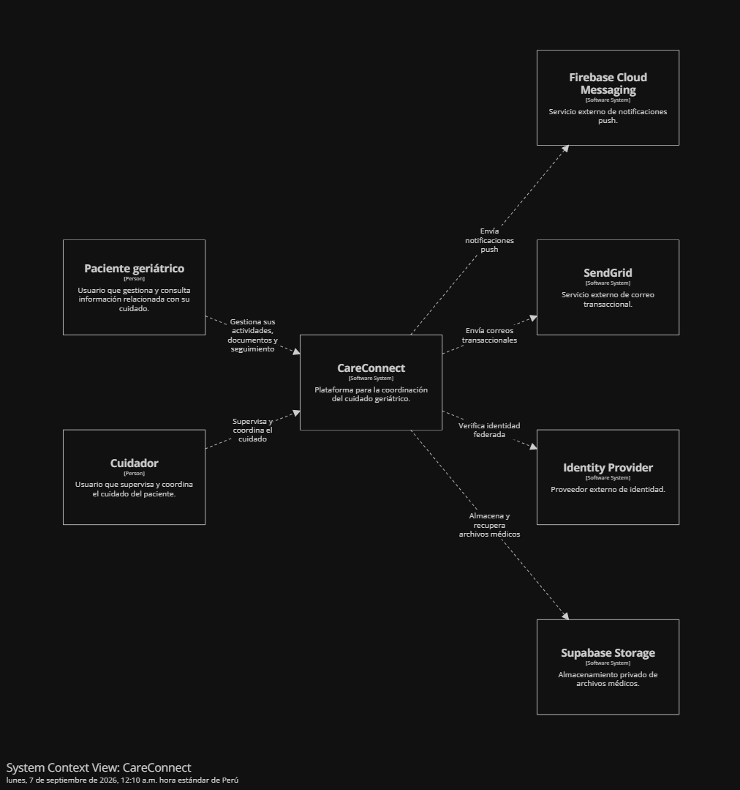

*Figura X. Software Architecture Context Diagram de CareConnect.*

---

#### 4.8.2. Software Architecture Container Diagrams

El Software Architecture Container Diagram descompone CareConnect en sus principales unidades ejecutables y de almacenamiento. Este nivel permite representar las aplicaciones que conforman la solución, sus responsabilidades, las tecnologías utilizadas y los mecanismos de comunicación entre ellas.

El backend se representa como un **único RESTful API**. Los bounded contexts Agenda, Notificaciones, Documentos, Gestión de Consentimiento, Diario de Seguimiento y Autenticación se encuentran organizados internamente dentro de este backend y no corresponden a seis microservicios independientes.

Esta decisión permite conservar los límites conceptuales definidos mediante Domain-Driven Design sin introducir complejidad distribuida innecesaria.

##### Containers de CareConnect

| Container | Tecnología | Estado | Responsabilidad |
|---|---|---|---|
| Landing Page | React + Vite + TypeScript | Implementado | Presenta el producto, la problemática y la propuesta de valor. |
| Frontend Web Application | Vue + PrimeVue | Objetivo 1ASI0732 | Proporciona una experiencia funcional desde navegador web. |
| Mobile Application | Kotlin + Jetpack Compose | Implementado | Aplicación Android utilizada por pacientes y cuidadores. |
| Backend RESTful API | Java 21 + Spring Boot | Implementado | Expone los casos de uso y reglas de los seis bounded contexts. |
| Relational Database | PostgreSQL | Implementado | Persiste la información estructurada del sistema. |
| Local Storage | Room / SQLite | Implementado | Mantiene información local y caché para soporte offline. |

##### Relaciones entre containers

| Origen | Destino | Protocolo | Responsabilidad |
|---|---|---|---|
| Mobile Application | Backend RESTful API | HTTPS / JSON | Consume los casos de uso de CareConnect. |
| Frontend Web Application | Backend RESTful API | HTTPS / JSON | Consume los servicios del dominio desde web. |
| Mobile Application | Local Storage | Room / SQLite | Almacena y consulta información local. |
| Backend RESTful API | PostgreSQL | JDBC / TLS | Persiste los datos estructurados. |
| Backend RESTful API | Supabase Storage | HTTPS | Gestiona los archivos médicos privados. |
| Backend RESTful API | Firebase Cloud Messaging | HTTPS | Solicita el envío de notificaciones push. |
| Backend RESTful API | SendGrid | HTTPS | Solicita el envío de correos electrónicos. |
| Backend RESTful API | Identity Provider | OAuth 2.0 / HTTPS | Integra autenticación federada. |

##### Consideración tecnológica

El backend actualmente implementado utiliza **Java 21 y Spring Boot**. Sin embargo, el Final Project Statement del curso establece **ASP.NET Core y C#** como tecnologías requeridas para Web Services.

Por lo tanto, existe una diferencia entre el producto actualmente implementado y el stack solicitado por el curso. Si el equipo conserva Spring Boot, esta decisión deberá ser validada con el docente. De lo contrario, será necesario realizar la migración del backend hacia la tecnología solicitada.

La Frontend Web Application se plantea con **Vue + PrimeVue**, de acuerdo con el stack requerido para el proyecto.

> **[INSERTAR AQUÍ EL SOFTWARE ARCHITECTURE CONTAINER DIAGRAM]**
>
> Dentro de CareConnect se deben representar:
> - Landing Page.
> - Frontend Web Application.
> - Mobile Application.
> - Backend RESTful API.
> - PostgreSQL Database.
> - Local Storage.
>
> Fuera de CareConnect:
> - Firebase Cloud Messaging.
> - SendGrid.
> - Identity Provider.
> - Supabase Storage.
>
> También deben mostrarse las relaciones y protocolos principales.

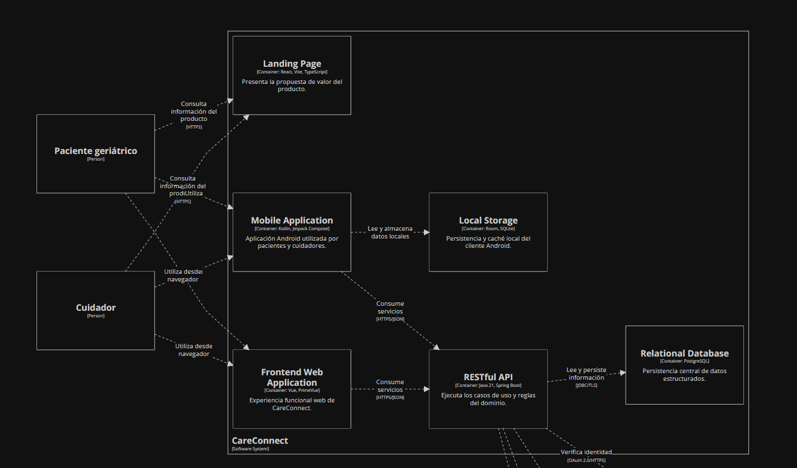
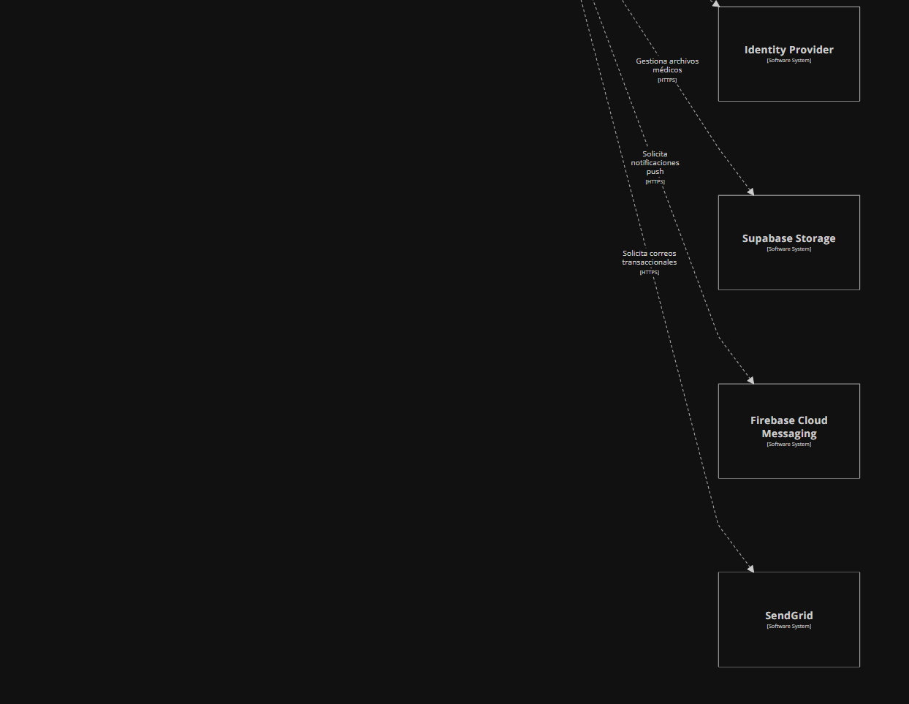

*Figura X. Software Architecture Container Diagram de CareConnect.*

---

#### 4.8.3. Software Architecture Components Diagrams

El Software Architecture Components Diagram representa la organización interna del container **Backend RESTful API**. Cada bounded context se modela como un componente independiente dentro del backend, manteniendo sus propias reglas de negocio, lenguaje ubicuo y responsabilidades.

##### Componentes principales

| Componente | Clasificación | Responsabilidad |
|---|---|---|
| Autenticación / IAM | Generic Domain | Gestiona identidad, usuarios, sesiones y roles. |
| Gestión de Consentimiento | Supporting Domain | Gestiona permisos y acceso compartido a información del paciente. |
| Agenda | Core Domain | Administra eventos de salud, citas, medicación y actividades. |
| Notificaciones | Core Domain | Programa y gestiona recordatorios y alertas. |
| Diario de Seguimiento | Core Domain | Registra observaciones y evolución del paciente. |
| Documentos | Supporting Domain | Gestiona metadata y acceso a documentos médicos. |
| Shared Components | Shared Infrastructure | Proporciona auditoría, excepciones y utilidades técnicas comunes. |

##### Relaciones principales entre componentes

- **Autenticación / IAM** proporciona identidad a los demás bounded contexts.
- **Gestión de Consentimiento** determina qué cuidadores se encuentran autorizados para acceder a información de un paciente.
- **Agenda** puede originar eventos que son procesados por Notificaciones para generar recordatorios.
- **Gestión de Consentimiento** puede originar eventos relacionados con invitaciones, accesos y revocaciones.
- **Diario de Seguimiento** y **Documentos** pueden originar comunicaciones que deben ser procesadas por Notificaciones.
- **Notificaciones** concentra la integración con Firebase Cloud Messaging y SendGrid.
- **Documentos** encapsula la integración con Supabase Storage.

> **[INSERTAR AQUÍ EL SOFTWARE ARCHITECTURE COMPONENTS DIAGRAM]**
>
> Dentro del Backend RESTful API deben aparecer:
> - IAM.
> - Gestión de Consentimiento.
> - Agenda.
> - Notificaciones.
> - Diario de Seguimiento.
> - Documentos.
> - Shared Components.
>
> Fuera del backend se deben representar:
> - Mobile Application.
> - Frontend Web Application.
> - PostgreSQL.
> - Identity Provider.
> - Firebase Cloud Messaging.
> - SendGrid.
> - Supabase Storage.
>
> También deben mostrarse las relaciones principales entre los bounded contexts.

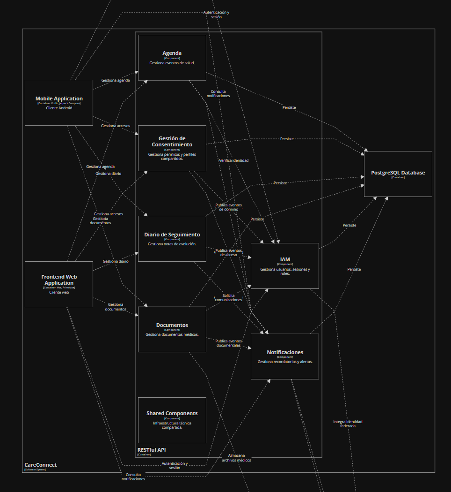


*Figura X. Software Architecture Components Diagram del Backend RESTful API de CareConnect.*

---

### 4.9. Software Object-Oriented Design

El diseño orientado a objetos de CareConnect traduce el modelo conceptual definido mediante Domain-Driven Design a clases, entidades, Aggregate Roots, Value Objects, Domain Services y contratos de persistencia.

Cada bounded context conserva su propio modelo. Esta decisión evita que las entidades internas de un bounded context sean utilizadas directamente como entidades internas de otro contexto, reduciendo el acoplamiento entre módulos.

Las interacciones entre bounded contexts se realizan principalmente mediante identificadores, contratos de aplicación y eventos de dominio.

---

#### 4.9.1. Class Diagrams

Se utilizan diagramas de clases independientes para cada bounded context. Esta estrategia permite representar de forma clara las entidades, agregados, Value Objects, servicios y relaciones correspondientes a cada parte del dominio sin generar un único diagrama excesivamente complejo.

##### Bounded Context: Agenda

El bounded context Agenda controla los eventos de salud asociados a un paciente. `HealthEvent` representa una cita médica, medicamento o actividad terapéutica, mientras que `Reminder` representa un recordatorio relacionado con un evento programado.

> **[INSERTAR AQUÍ EL CLASS DIAGRAM DE AGENDA]**

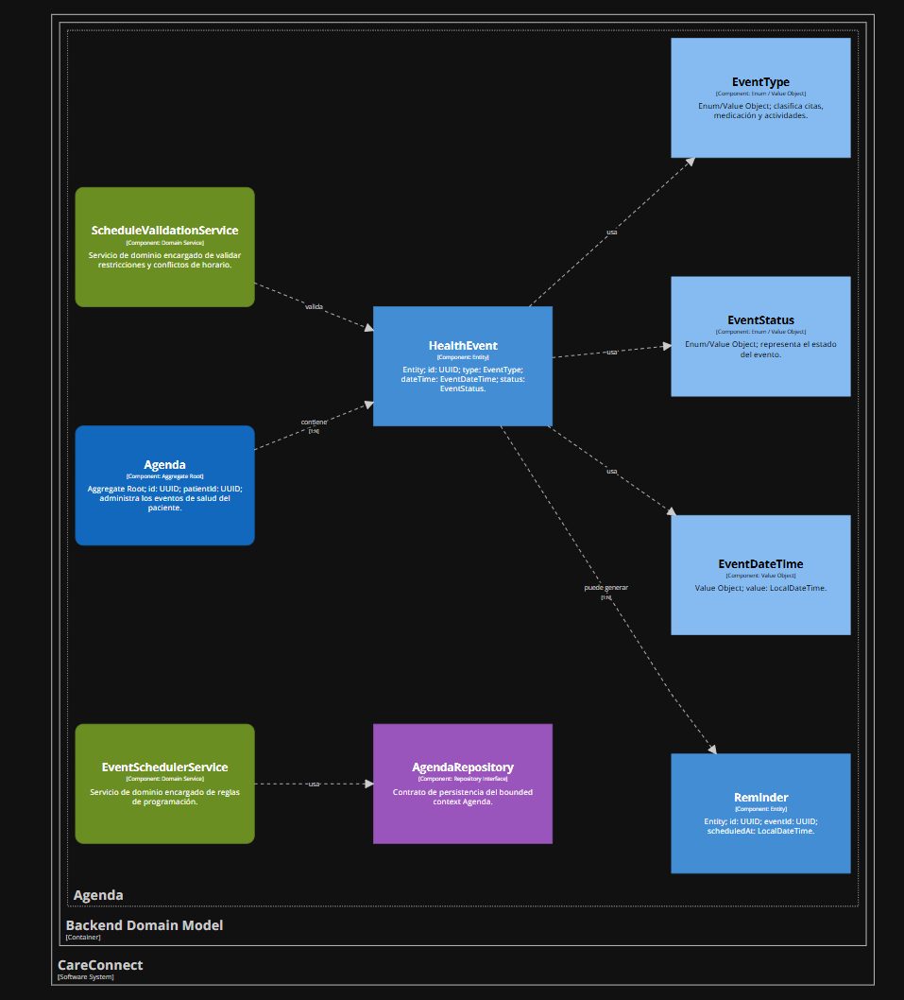

*Figura X. Diagrama de clases del bounded context Agenda.*

##### Bounded Context: Notificaciones

El bounded context Notificaciones administra las comunicaciones generadas por CareConnect, incluyendo recordatorios, alertas y preferencias de comunicación.

> **[INSERTAR AQUÍ EL CLASS DIAGRAM DE NOTIFICACIONES]**

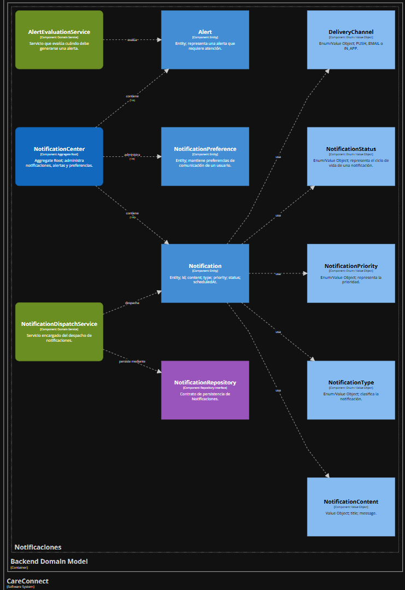

*Figura X. Diagrama de clases del bounded context Notificaciones.*

##### Bounded Context: Diario de Seguimiento

El bounded context Diario de Seguimiento gestiona las notas registradas sobre la evolución del paciente.

> **[INSERTAR AQUÍ EL CLASS DIAGRAM DE DIARIO DE SEGUIMIENTO]**

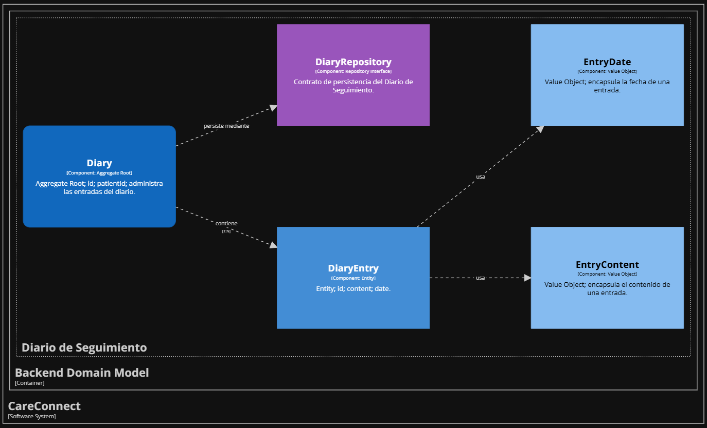

*Figura X. Diagrama de clases del bounded context Diario de Seguimiento.*

##### Bounded Context: Gestión de Consentimiento

Este bounded context controla el ciclo de vida de los accesos compartidos entre pacientes y cuidadores.

> **[INSERTAR AQUÍ EL CLASS DIAGRAM DE GESTIÓN DE CONSENTIMIENTO]**

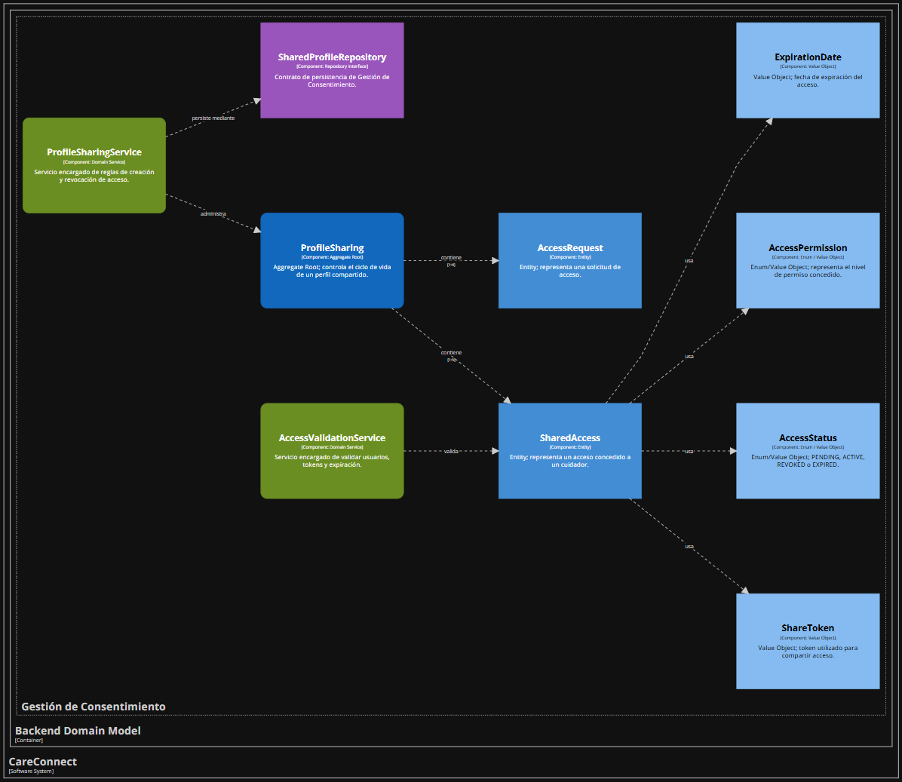

*Figura X. Diagrama de clases del bounded context Gestión de Consentimiento.*

##### Bounded Context: Documentos

El bounded context Documentos administra la información asociada a documentos médicos y la referencia necesaria para acceder a los archivos almacenados externamente.

> **[INSERTAR AQUÍ EL CLASS DIAGRAM DE DOCUMENTOS]**

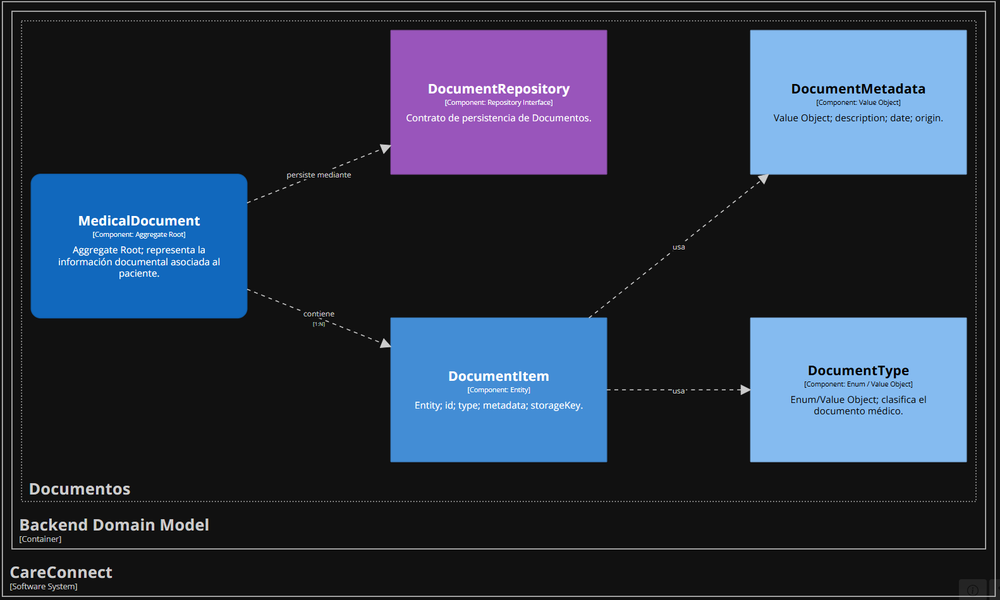

*Figura X. Diagrama de clases del bounded context Documentos.*

##### Bounded Context: Autenticación / IAM

El bounded context Autenticación gestiona las cuentas de usuario, autenticación, sesiones y roles de CareConnect.

La entidad principal es `User`, que contiene información relacionada con el correo electrónico, hash de contraseña, nombre completo, rol, estado de la cuenta, intentos fallidos de autenticación y bloqueo temporal.

> **[INSERTAR AQUÍ EL CLASS DIAGRAM DE AUTENTICACIÓN / IAM]**
>
> Debe incluir los elementos reales del módulo IAM, entre ellos:
> - `User`.
> - `UserRole`.
> - Contrato del servicio de autenticación.
> - Implementación del servicio de autenticación.
> - Repositorio de usuarios.
> - Mapper.
> - REST Controller.
> - Relaciones principales entre dichos elementos.

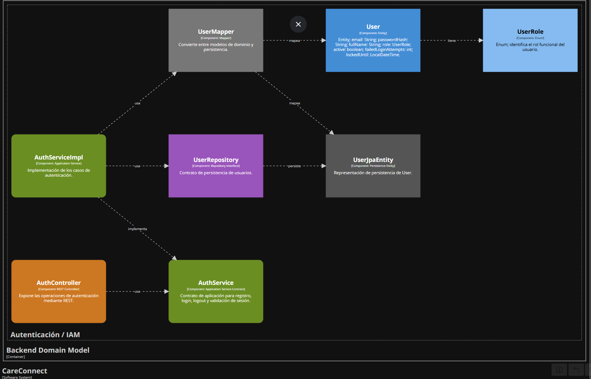

*Figura X. Diagrama de clases del bounded context Autenticación / IAM.*

---

#### 4.9.2. Class Dictionary

El Class Dictionary complementa los Class Diagrams describiendo los elementos principales del modelo orientado a objetos, su tipo y su responsabilidad.

Los atributos y tipos definitivos deben mantenerse consistentes con los Class Diagrams y con el código fuente de cada bounded context.

##### Agenda

| Clase | Tipo | Responsabilidad |
|---|---|---|
| `HealthEvent` | Entity | Representa una actividad, cita, medicación u otro evento de salud. |
| `Reminder` | Entity | Representa un recordatorio asociado a un evento de salud. |
| `EventStatus` | Enum / Value Object | Representa el estado de un evento. |
| `EventType` | Enum / Value Object | Clasifica el tipo de evento. |
| `AgendaRepository` | Repository | Define las operaciones necesarias para persistir información de Agenda. |

##### Notificaciones

| Clase | Tipo | Responsabilidad |
|---|---|---|
| `Notification` | Entity | Representa una comunicación generada para un usuario. |
| `Alert` | Entity | Representa una alerta relacionada con una situación que requiere atención. |
| `NotificationPreference` | Entity | Mantiene las preferencias de comunicación de un usuario. |
| `NotificationStatus` | Enum / Value Object | Representa el estado de una notificación. |
| `DeliveryChannel` | Enum / Value Object | Identifica el canal utilizado para entregar una comunicación. |
| `NotificationRepository` | Repository | Define las operaciones de persistencia del bounded context. |

##### Diario de Seguimiento

| Clase | Tipo | Responsabilidad |
|---|---|---|
| `Diary` | Aggregate Root | Gestiona el conjunto de entradas asociadas al seguimiento del paciente. |
| `DiaryEntry` | Entity | Representa una entrada individual del diario. |
| `EntryContent` | Value Object | Encapsula el contenido de una entrada. |
| `EntryDate` | Value Object | Representa la fecha asociada a una entrada. |
| `DiaryRepository` | Repository | Define las operaciones de persistencia del diario. |

##### Gestión de Consentimiento

| Clase | Tipo | Responsabilidad |
|---|---|---|
| `ProfileSharing` | Aggregate Root | Gestiona el ciclo de vida del acceso compartido a la información de un paciente. |
| `SharedAccess` | Entity | Representa un acceso otorgado a un cuidador. |
| `AccessRequest` | Entity | Representa una solicitud de acceso. |
| `ShareToken` | Value Object | Encapsula el token utilizado para compartir acceso. |
| `AccessStatus` | Enum / Value Object | Representa el estado de un acceso. |
| `AccessPermission` | Enum / Value Object | Representa el nivel de permiso otorgado. |
| `SharedProfileRepository` | Repository | Define las operaciones de persistencia del bounded context. |

##### Documentos

| Clase | Tipo | Responsabilidad |
|---|---|---|
| `MedicalDocument` | Aggregate Root / Entity | Representa la información principal de un documento médico. |
| `DocumentItem` | Entity | Representa un archivo o elemento documental asociado. |
| `DocumentType` | Enum / Value Object | Clasifica el documento médico. |
| `DocumentMetadata` | Value Object | Encapsula la información descriptiva del documento. |
| `DocumentRepository` | Repository | Define las operaciones de persistencia relacionadas con documentos. |

##### Autenticación / IAM

| Clase | Tipo | Atributos principales | Responsabilidad |
|---|---|---|---|
| `User` | Entity | `email`, `passwordHash`, `fullName`, `role`, `active`, `failedLoginAttempts`, `lockedUntil` | Representa una cuenta de CareConnect y aplica reglas relacionadas con su estado y bloqueo. |
| `UserRole` | Enum | Roles de usuario | Identifica el rol funcional del usuario. |
| `AuthService` | Application Service Contract | — | Define las operaciones de registro, autenticación, cierre de sesión y validación de sesión. |
| `AuthServiceImpl` | Application Service | — | Implementa los casos de uso asociados a autenticación. |
| `UserRepository` | Repository | — | Proporciona acceso persistente a las cuentas. |
| `UserMapper` | Mapper | — | Convierte entre los modelos de dominio y persistencia. |
| `AuthController` | REST Controller | — | Expone las operaciones de autenticación a través del API. |

---

### 4.10. Database Design

CareConnect utiliza una arquitectura de persistencia relacional para almacenar la información estructurada correspondiente a los distintos bounded contexts.

La base de datos central utiliza **PostgreSQL**. Los archivos médicos no se almacenan directamente dentro de la base relacional; estos se mantienen en **Supabase Storage**, mientras PostgreSQL conserva la metadata y referencias necesarias para localizarlos.

La separación conceptual establecida mediante Domain-Driven Design también se conserva en el diseño de persistencia. Cada bounded context mantiene responsabilidad conceptual sobre sus propias estructuras de datos.

---

#### 4.10.1. Relational/Non-Relational Database Diagram

El Relational/Non-Relational Database Diagram consolida las estructuras de persistencia del sistema en una vista integrada. Esto permite observar las relaciones generales de la solución manteniendo la separación conceptual entre bounded contexts.

##### Agrupación conceptual por bounded context

| Bounded Context | Información persistida |
|---|---|
| Autenticación / IAM | Usuarios, roles, estado de cuenta y datos de autenticación. |
| Agenda | Eventos de salud y recordatorios. |
| Notificaciones | Notificaciones, alertas, preferencias e intentos de entrega. |
| Diario de Seguimiento | Entradas del diario del paciente. |
| Gestión de Consentimiento | Solicitudes, accesos compartidos, permisos y revocaciones. |
| Documentos | Metadata y referencias a archivos médicos. |

##### Persistencia relacional

PostgreSQL constituye el almacenamiento principal para la información estructurada. Las relaciones entre tablas deben respetar las referencias necesarias entre usuarios, eventos, notificaciones, documentos, entradas de diario y accesos compartidos.

Las Primary Keys y Foreign Keys deben representarse explícitamente en el diagrama final, junto con las cardinalidades correspondientes.

##### Persistencia de archivos

Los archivos médicos se almacenan en **Supabase Storage** y no como datos binarios dentro de PostgreSQL.

La base relacional conserva únicamente la información necesaria para identificar el documento y recuperar de forma segura el archivo correspondiente.

> **[INSERTAR AQUÍ EL RELATIONAL/NON-RELATIONAL DATABASE DIAGRAM INTEGRADO]**
>
> El diagrama debe:
> - Representar las tablas reales del esquema implementado.
> - Identificar claramente a qué bounded context pertenece cada conjunto de tablas.
> - Mostrar Primary Keys.
> - Mostrar Foreign Keys.
> - Mostrar cardinalidades.
> - Mostrar los tipos de datos principales.
> - Representar la referencia entre la metadata documental y Supabase Storage cuando corresponda.
>
> Antes de insertar la figura definitiva, verificar los nombres de tablas y columnas contra el esquema vigente del backend para evitar diferencias entre el diagrama y la implementación.

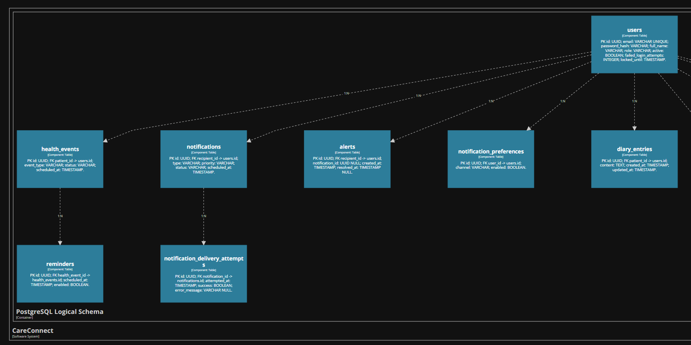
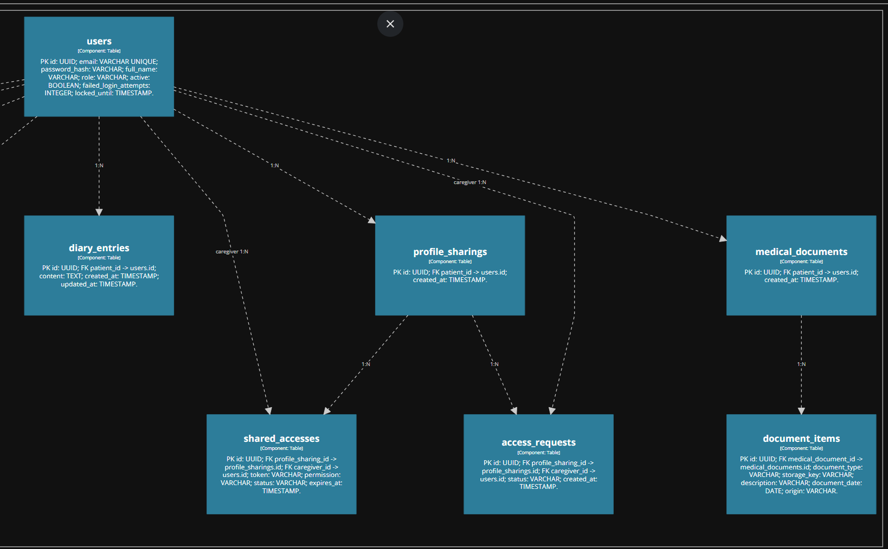


*Figura X. Relational/Non-Relational Database Diagram integrado de CareConnect.*

## Capítulo V: Product Implementation

### 5.1. Software Configuration Management

La gestión de configuración de software de **CareConnect** define las herramientas, convenciones y procedimientos utilizados para desarrollar, versionar, integrar y desplegar los productos que conforman la solución. Su propósito es mantener trazabilidad sobre los cambios, reducir diferencias entre los entornos de trabajo de los integrantes y asegurar que el código fuente, la documentación y las configuraciones puedan ser reproducidos durante el ciclo de vida del proyecto.

CareConnect se encuentra compuesto por diferentes productos de software que evolucionan de manera independiente:

- Project Report.
- Landing Page.
- Native Mobile Application.
- Backend RESTful API.
- Frontend Web Application requerida para 1ASI0732.

La solución actual mantiene repositorios separados para el informe, backend, aplicación móvil y Landing Page. La Frontend Web Application forma parte del alcance requerido por el curso, pero su repositorio y evidencia de despliegue deben incorporarse cuando su implementación sea confirmada.

---

#### 5.1.1. Software Development Environment Configuration

La configuración del entorno de desarrollo especifica las herramientas utilizadas por el equipo para la gestión del proyecto, diseño UX/UI, desarrollo, pruebas, despliegue y documentación.

La selección de herramientas busca mantener una separación clara entre cada producto de CareConnect y permitir que los integrantes reproduzcan localmente los entornos necesarios para trabajar sobre ellos.

##### Herramientas por actividad

| Actividad | Producto / herramienta | Propósito | Ruta o referencia |
|---|---|---|---|
| Project & Requirements Management | GitHub | Gestionar repositorios, ramas, Pull Requests, historial de cambios y colaboración. | Organización `CareStacks` |
| UX/UI Design | Figma | Elaborar wireframes, mockups y prototipos de interfaces. | Proyecto de diseño del equipo |
| Domain Modeling | Miro | Elaborar EventStorming, Context Mapping y Bounded Context Canvases. | Workspace del equipo |
| Software Architecture | Structurizr | Elaborar los diagramas C4 de Context, Container y Components. | Artefactos del Capítulo IV |
| Mobile Development | Android Studio | Desarrollar, ejecutar y depurar la aplicación Android. | Repositorio `CareStacks/FrontEnd` |
| Mobile Development | Kotlin | Lenguaje de programación de la aplicación Android. | `CareStacks/FrontEnd` |
| Mobile UI | Jetpack Compose | Construir la interfaz declarativa de la aplicación Android. | `CareStacks/FrontEnd` |
| Mobile Build | Gradle | Gestionar dependencias y compilación de Android. | `CareStacks/FrontEnd` |
| Backend Development | Java 21 | Lenguaje utilizado actualmente por el backend. | `CareStacks/BackEnd` |
| Backend Framework | Spring Boot | Implementar y exponer los servicios RESTful actuales. | `CareStacks/BackEnd` |
| Backend Build | Maven | Gestionar dependencias y construir el backend. | `CareStacks/BackEnd/pom.xml` |
| Persistence | Spring Data JPA / Hibernate | Gestionar el mapeo objeto-relacional del backend. | `CareStacks/BackEnd` |
| Relational Database | PostgreSQL | Persistir los datos estructurados de CareConnect. | Servicio PostgreSQL asociado al backend |
| Testing Database | H2 | Ejecutar escenarios de prueba que requieren una base en memoria. | Configuración de pruebas del backend |
| Local Mobile Storage | Room / SQLite | Mantener datos locales y soporte offline en Android. | `CareStacks/FrontEnd` |
| Document Storage | Supabase Storage | Almacenar de manera privada archivos médicos. | Configuración mediante variables de entorno del backend |
| API Documentation | OpenAPI / Swagger UI | Documentar y probar los endpoints REST. | `/v3/api-docs` y `/swagger-ui.html` |
| Notifications | Firebase Cloud Messaging | Entregar notificaciones push. | Proyecto Firebase de CareConnect |
| Mobile Distribution | Firebase App Distribution | Distribuir builds Android de prueba. | Proyecto Firebase de CareConnect |
| Email | SendGrid | Enviar correos electrónicos transaccionales. | Configuración privada del backend |
| Landing Page Development | React + Vite + TypeScript | Implementación actual de la Landing Page. | `CareStacks/Landing-Page` |
| Landing Page Deployment | Vercel | Publicar la Landing Page. | Proyecto Vercel vinculado al repositorio |
| Frontend Web Application | Vue + PrimeVue | Stack requerido por 1ASI0732 para la aplicación web funcional. | Pendiente de repositorio/implementación confirmada |
| Documentation | Markdown | Elaborar el informe principal del proyecto. | `CareStacks/Report/README.md` |

##### Configuración de la Native Mobile Application

La aplicación móvil de CareConnect utiliza actualmente el siguiente entorno:

```text
IDE: Android Studio
Language: Kotlin
UI Framework: Jetpack Compose
Build Tool: Gradle
Local Persistence: Room / SQLite
Push Notifications: Firebase Cloud Messaging
Distribution: Firebase App Distribution
```

Android Studio permite compilar el proyecto, ejecutar la aplicación mediante emuladores o dispositivos físicos, realizar debugging y generar builds para pruebas.

La persistencia local con Room/SQLite permite mantener determinados datos disponibles en el dispositivo y soportar escenarios donde la conectividad no sea constante.

##### Configuración del Backend RESTful API

El backend actual de CareConnect se implementa como una aplicación Spring Boot única organizada internamente mediante bounded contexts.

```text
Language: Java 21
Framework: Spring Boot
Build Tool: Maven
ORM: Spring Data JPA / Hibernate
Relational Database: PostgreSQL
Testing Database: H2
API Documentation: OpenAPI / Swagger UI
```

Su estructura principal sigue los bounded contexts definidos para el producto:

```text
src/main/java/com/carestacks/careconnect/
├── agenda/
├── consents/
├── diary/
├── documents/
├── iam/
├── notifications/
└── shared/
```

Cada módulo mantiene separación entre responsabilidades de dominio, aplicación, infraestructura e interfaces.

##### Variables de entorno del Backend

Las credenciales y configuraciones sensibles no deben almacenarse directamente en el repositorio.

La conexión con PostgreSQL se configura mediante variables del entorno de Spring, como:

```text
SPRING_DATASOURCE_URL
SPRING_DATASOURCE_DRIVER_CLASS_NAME
SPRING_DATASOURCE_USERNAME
SPRING_DATASOURCE_PASSWORD
```

La integración con Supabase Storage utiliza:

```text
SUPABASE_URL
SUPABASE_SERVICE_ROLE_KEY
SUPABASE_STORAGE_BUCKET
```

Los valores reales de estas variables deben mantenerse únicamente en los entornos autorizados y no deben incluirse en commits, documentación pública ni código cliente.

##### Configuración de la Landing Page

La Landing Page actualmente implementada utiliza:

```text
Framework: React
Language: TypeScript
Build Tool: Vite
Package Manager: npm
Hosting: Vercel
```

El repositorio correspondiente es:

```text
https://github.com/CareStacks/Landing-Page
```

##### Configuración de la Frontend Web Application

El alcance de 1ASI0732 requiere una Frontend Web Application independiente de la Landing Page.

El stack establecido para esta aplicación es:

```text
Framework: Vue
UI Components: PrimeVue
Package Manager: npm
Communication: REST over HTTPS/JSON
```

La aplicación deberá consumir los servicios expuestos por el backend y contar con un repositorio independiente. Mientras no exista evidencia de implementación, no debe documentarse como un producto ya desplegado.

##### Consideración sobre el stack del curso

El backend actualmente implementado utiliza **Java 21 y Spring Boot**. Sin embargo, el Final Project Statement de 1ASI0732 establece **ASP.NET Core y C#** para los Web Services.

De igual forma, la Landing Page existente utiliza React + Vite + TypeScript, mientras que el statement establece un stack específico para dicho producto.

Estas diferencias deben mantenerse explícitas en la documentación hasta que el equipo confirme con el docente si las implementaciones existentes pueden conservarse o si deben migrarse.

---

#### 5.1.2. Source Code Management

CareConnect utiliza **Git** como sistema de control de versiones distribuido y **GitHub** como plataforma central para alojar los repositorios, gestionar ramas, revisar Pull Requests y mantener la trazabilidad de los cambios.

##### Repositorios del proyecto

| Producto | Repositorio |
|---|---|
| Project Report | `https://github.com/CareStacks/Report` |
| Backend RESTful API | `https://github.com/CareStacks/BackEnd` |
| Native Mobile Application | `https://github.com/CareStacks/FrontEnd` |
| Landing Page | `https://github.com/CareStacks/Landing-Page` |
| Frontend Web Application | Pendiente de creación o confirmación |

La separación por repositorios permite que cada producto mantenga su propio historial, ciclo de desarrollo, Pull Requests y despliegues.

##### Estrategia GitFlow

El flujo de ramas se basa en GitFlow.

| Rama | Propósito |
|---|---|
| `main` | Contiene versiones estables o liberables. |
| `develop` | Integra cambios destinados a la siguiente versión. |
| `feature/*` | Implementa una funcionalidad específica. |
| `release/*` | Prepara una versión antes de integrarla a `main`. |
| `hotfix/*` | Corrige de forma urgente una versión estable. |

Ejemplos:

```text
feature/agenda-reminders
feature/document-upload
feature/profile-sharing
release/1.1.0
hotfix/login-validation
```

El flujo general de una funcionalidad es:

```text
develop
   |
   v
feature/nombre-funcionalidad
   |
   v
Pull Request
   |
   v
develop
```

Cuando se prepara una versión:

```text
develop
   |
   v
release/x.y.z
   |
   v
main
```

Una corrección urgente parte desde `main`, utiliza una rama `hotfix/*` y debe reintegrarse posteriormente tanto a `main` como a la línea activa de desarrollo.

##### Semantic Versioning

Las versiones siguen **Semantic Versioning**:

```text
MAJOR.MINOR.PATCH
```

| Elemento | Significado |
|---|---|
| `MAJOR` | Cambios incompatibles con versiones anteriores. |
| `MINOR` | Nueva funcionalidad compatible con versiones anteriores. |
| `PATCH` | Correcciones compatibles con versiones anteriores. |

Ejemplos:

```text
1.0.0
1.1.0
1.1.1
2.0.0
```

##### Conventional Commits

Los mensajes de commit utilizan la estructura:

```text
type(scope): imperative description
```

Los tipos permitidos son:

| Tipo | Uso |
|---|---|
| `feat` | Nueva funcionalidad. |
| `fix` | Corrección de errores. |
| `docs` | Cambios de documentación. |
| `refactor` | Reestructuración interna sin modificar el comportamiento externo. |
| `style` | Cambios de formato que no afectan la lógica. |
| `test` | Adición o modificación de pruebas. |
| `chore` | Mantenimiento general o configuración. |
| `perf` | Mejoras de rendimiento. |
| `build` | Cambios relacionados con construcción o dependencias. |
| `ci` | Cambios relacionados con integración continua. |

Ejemplos:

```text
feat(agenda): add health event confirmation
fix(iam): prevent login for locked accounts
docs(report): add software configuration management
refactor(notifications): simplify dispatch service
test(consent): add access revocation tests
build(backend): update Maven dependencies
ci(backend): add automated test workflow
```

Los commits deben:

- Utilizar descripción en inglés.
- Utilizar un verbo en modo imperativo.
- Describir un cambio específico.
- Evitar mensajes genéricos como `update files`.
- Ser preferentemente menores a 72 caracteres.
- Separar cambios independientes en commits diferentes.

##### Pull Requests

Las funcionalidades deben integrarse mediante Pull Requests cuando corresponda.

Cada Pull Request debe incluir:

| Elemento | Descripción |
|---|---|
| Título | Resume de forma precisa el cambio. |
| Descripción | Explica qué se modificó y por qué. |
| Historia o tarea asociada | Relaciona el cambio con la User Story o Technical Story correspondiente. |
| Evidencia | Incluye pruebas, capturas o resultados cuando corresponda. |
| Rama origen | Feature, release o hotfix. |
| Rama destino | Normalmente `develop` o `main`, según el flujo. |
| Revisión | Validación por otro integrante antes de integrar el cambio. |

---

#### 5.1.3. Source Code Style Guide & Conventions

Las convenciones de código permiten mantener consistencia entre los distintos productos y módulos de CareConnect.

Los identificadores técnicos deben escribirse en **inglés**, incluyendo clases, métodos, variables, endpoints, tablas y commits.

##### Convenciones generales

| Elemento | Convención | Ejemplo |
|---|---|---|
| Clases | PascalCase | `HealthEventService` |
| Interfaces | PascalCase | `AgendaRepository` |
| Métodos / funciones | camelCase | `confirmHealthEvent()` |
| Variables | camelCase | `patientId` |
| Constantes | UPPER_SNAKE_CASE | `MAX_LOGIN_ATTEMPTS` |
| Paquetes Java | lowercase | `com.carestacks.careconnect.agenda` |
| Componentes frontend | PascalCase | `NotificationCard` |
| Tablas | snake_case plural | `health_events` |
| Columnas | snake_case | `created_at` |
| Foreign Keys | `<entity>_id` | `patient_id` |

##### Organización del Backend

Los módulos del backend mantienen una estructura basada en:

```text
domain/
application/
infrastructure/
interfaces/
```

**Domain** contiene los conceptos y reglas propias del negocio, como entidades, Aggregate Roots, Value Objects, Domain Services, Domain Events y contratos de repositories.

**Application** coordina los casos de uso y la interacción con el dominio.

**Infrastructure** contiene detalles técnicos como persistencia, mappers, clientes de almacenamiento, adaptadores externos y configuraciones.

**Interfaces** contiene los puntos de entrada del sistema, principalmente REST Controllers.

##### Convenciones Java / Spring Boot

Ejemplo:

```java
public class HealthEventService {

    private static final int MAX_RETRIES = 3;

    public void confirmHealthEvent(UUID eventId) {
        // Implementation
    }
}
```

Se aplican las siguientes reglas:

- Clases e interfaces en PascalCase.
- Métodos y variables en camelCase.
- Constantes en UPPER_SNAKE_CASE.
- Paquetes en minúsculas.
- Evitar reglas del dominio dentro de controllers.
- Utilizar mappers cuando se requiera separar dominio y persistencia.
- Mantener los bounded contexts desacoplados.

##### Convenciones Kotlin / Android

Ejemplo:

```kotlin
class AgendaViewModel : ViewModel() {

    fun confirmEvent(eventId: String) {
        // Implementation
    }
}
```

Las principales convenciones son:

- Clases en PascalCase.
- Funciones y variables en camelCase.
- Constantes en UPPER_SNAKE_CASE.
- Paquetes en minúsculas.
- La UI no debe concentrar reglas de negocio.
- Los ViewModels deben administrar el estado de presentación.
- La comunicación con servicios y persistencia debe mantenerse separada de los composables.

##### Convenciones TypeScript / Frontend

Ejemplo:

```typescript
const API_BASE_URL = import.meta.env.VITE_API_BASE_URL;

function loadNotifications() {
    // Implementation
}
```

Los componentes utilizan PascalCase y las funciones o variables camelCase.

Las configuraciones específicas de cada ambiente deben administrarse mediante variables de entorno y no mediante valores sensibles escritos directamente en el código.

##### Convenciones REST

Los endpoints deben utilizar sustantivos y aprovechar la semántica de HTTP.

| Acción | Método | Ejemplo |
|---|---|---|
| Consultar colección | GET | `/api/events` |
| Consultar recurso | GET | `/api/events/{id}` |
| Crear | POST | `/api/events` |
| Actualizar | PUT | `/api/events/{id}` |
| Actualizar parcialmente | PATCH | `/api/events/{id}` |
| Eliminar | DELETE | `/api/events/{id}` |

Los nombres de recursos deben ser consistentes y encontrarse en inglés.

##### Convenciones de Base de Datos

| Elemento | Convención | Ejemplo |
|---|---|---|
| Tabla | snake_case plural | `health_events` |
| Columna | snake_case | `scheduled_at` |
| Primary Key | `id` | `id` |
| Foreign Key | `<entity>_id` | `patient_id` |
| Timestamp de creación | `created_at` | `created_at` |
| Timestamp de modificación | `updated_at` | `updated_at` |

##### Convenciones Gherkin

Los escenarios de aceptación siguen la estructura Given / When / Then.

```gherkin
Feature: Health event confirmation

  Scenario: Patient confirms a scheduled event
    Given the patient has a pending health event
    When the patient confirms the event
    Then the event status is marked as confirmed
```

##### Buenas prácticas

- Mantener alta cohesión dentro de cada bounded context.
- Reducir dependencias innecesarias entre módulos.
- Mantener reglas del negocio fuera de componentes de presentación.
- No exponer información sensible mediante logs.
- No almacenar secretos en GitHub.
- Utilizar nombres descriptivos.
- Mantener documentación y código consistentes.
- Evitar duplicar reglas del dominio.
- Revisar cambios mediante Pull Requests antes de integrar cuando corresponda.

---

#### 5.1.4. Software Deployment Configuration

La configuración de despliegue define cómo los productos de CareConnect son construidos y publicados en los entornos correspondientes.

La solución posee componentes con mecanismos de despliegue diferentes: backend, aplicación móvil, Landing Page y almacenamiento/servicios externos.

##### Backend RESTful API

El backend actual utiliza **Render** como plataforma de despliegue y se conecta con una base de datos PostgreSQL.

El flujo general es:

```text
Push al repositorio
        |
        v
Render obtiene el código
        |
        v
Build del proyecto
        |
        v
Maven / Docker
        |
        v
Inicio de Spring Boot
        |
        v
Conexión con PostgreSQL
        |
        v
Publicación del RESTful API
```

La configuración sensible se mantiene mediante variables de entorno definidas en el proveedor de hosting.

Las principales variables de persistencia son:

```text
SPRING_DATASOURCE_URL
SPRING_DATASOURCE_USERNAME
SPRING_DATASOURCE_PASSWORD
```

La configuración de documentos utiliza:

```text
SUPABASE_URL
SUPABASE_SERVICE_ROLE_KEY
SUPABASE_STORAGE_BUCKET
```

La `SUPABASE_SERVICE_ROLE_KEY` debe permanecer exclusivamente en el backend.

##### Base de Datos PostgreSQL

La persistencia central utiliza PostgreSQL.

Para su despliegue se deben considerar:

- Conexiones seguras.
- Credenciales privadas.
- Restricción de acceso directo.
- Backups cuando corresponda.
- Cambios de esquema controlados.
- Separación de configuraciones entre ambientes.

##### Supabase Storage

Los archivos médicos se almacenan mediante Supabase Storage.

El backend actúa como intermediario para las operaciones que requieren credenciales privilegiadas.

```text
Client Application
        |
        v
Backend RESTful API
        |
        v
Supabase Storage
```

Las credenciales privilegiadas nunca deben exponerse en la aplicación móvil, Landing Page o Frontend Web Application.

##### Native Mobile Application

La aplicación Android se compila mediante Gradle.

El proceso general es:

```text
Código Kotlin
     |
     v
Gradle Build
     |
     v
APK
     |
     v
Pruebas en emulador/dispositivo
     |
     v
Firebase App Distribution
     |
     v
Testers
```

Firebase App Distribution permite compartir builds privadas antes de una eventual publicación en una tienda de aplicaciones.

##### Landing Page

La Landing Page actual utiliza Vercel como plataforma de hosting.

```text
Push al repositorio
      |
      v
Vercel detecta el cambio
      |
      v
Instala dependencias
      |
      v
Build con Vite
      |
      v
Deploy
      |
      v
URL pública
```

##### Frontend Web Application

La Frontend Web Application requerida por el curso deberá poseer un pipeline de despliegue propio cuando su implementación sea confirmada.

Un flujo objetivo es:

```text
Push al repositorio
       |
       v
npm install
       |
       v
Lint / Tests
       |
       v
npm run build
       |
       v
Artifact Vue
       |
       v
Hosting
       |
       v
Smoke Test
```

La documentación deberá actualizarse con el repositorio real, proveedor de hosting, URL pública, API Base URL y variables de entorno una vez que exista evidencia de implementación.

##### Servicios externos

| Servicio | Responsabilidad |
|---|---|
| Render | Hosting del backend actual. |
| PostgreSQL | Persistencia relacional central. |
| Supabase Storage | Almacenamiento privado de documentos médicos. |
| Firebase Cloud Messaging | Entrega de notificaciones push. |
| Firebase App Distribution | Distribución privada de builds Android. |
| SendGrid | Envío de correos electrónicos transaccionales. |
| Vercel | Hosting de la Landing Page. |

##### Entornos

Se consideran los siguientes ambientes:

| Entorno | Propósito |
|---|---|
| Development | Desarrollo local de cada integrante. |
| Testing | Validación funcional y técnica. |
| Staging | Validación previa a producción cuando se configure. |
| Production | Entorno destinado al uso final. |

Las variables y credenciales deben mantenerse separadas entre ambientes.

##### Criterios de validación del despliegue

| Criterio | Validación |
|---|---|
| Backend disponible | El RESTful API responde correctamente. |
| Swagger / OpenAPI disponible | La documentación puede consultarse y los endpoints pueden verificarse. |
| PostgreSQL disponible | El backend puede ejecutar operaciones de lectura y escritura. |
| Mobile Application funcional | El build Android instala y ejecuta correctamente. |
| Landing Page disponible | La URL pública carga correctamente. |
| Document Storage funcional | Los documentos pueden almacenarse y recuperarse mediante el backend. |
| Notificaciones operativas | Firebase entrega mensajes correctamente. |
| Frontend Web disponible | Se validará cuando exista evidencia de implementación. |
| Variables protegidas | No existen secretos expuestos en repositorios ni clientes. |

##### Riesgos de despliegue

| Riesgo | Impacto | Mitigación |
|---|---|---|
| Variables de entorno incorrectas | El backend puede no iniciar o perder conexión con servicios. | Documentar y validar variables antes del despliegue. |
| PostgreSQL inaccesible | La solución no puede consultar ni persistir información. | Utilizar configuración segura y verificar conectividad. |
| Credenciales expuestas | Riesgo de acceso no autorizado. | Mantener secretos fuera de GitHub y del código cliente. |
| Error en Supabase Storage | Los documentos médicos no pueden almacenarse o recuperarse. | Validar variables, bucket y manejo de errores. |
| Error en Firebase | Las notificaciones pueden no ser entregadas. | Validar configuración y realizar pruebas en dispositivos físicos. |
| Build Android incompatible | Algunos dispositivos pueden no ejecutar la aplicación. | Definir requisitos mínimos y probar en distintos dispositivos. |
| Frontend apuntando al ambiente incorrecto | El cliente no puede consumir correctamente los servicios. | Administrar la API Base URL mediante configuración por ambiente. |

La configuración de despliegue debe actualizarse conforme se implementen nuevos productos y ambientes. No se deben documentar repositorios, URLs o pipelines como existentes si todavía no existe evidencia verificable de ellos.


### 5.2. Product Implementation & Deployment

### 5.2.1. Sprint Backlogs

> Nota: esta sección (5.2.1) corresponde a Angela Espinoza según la distribución del equipo. Se incluye aquí como referencia/borrador para que ella lo revise y ajuste.

#### Sprint 1

Durante el Sprint 1, el equipo se dividió el trabajo por capítulos: documentación de fundamentos del producto (Capítulo I), investigación de usuario y competencia (Capítulo II), especificación de requisitos (Capítulo III), arquitectura y diseño visual (Capítulo IV) y las primeras evidencias de implementación (Capítulo V), reutilizando como base el proyecto CareConnect del ciclo anterior.

| Sprint | Sección del Reporte | Título | Tarea técnica asociada | Description | Estimation (SP) | Assigned To | Status |
|---|---|---|---|---|---|---|---|
| 1 | Cap. I completo | Startup Profile, problemática, Lean UX, segmentos objetivo | Redactar descripción de la startup, perfiles de equipo, problem statement, Lean UX Assumptions/Hypothesis/Canvas y segmentos objetivo | Completar el Capítulo I: Introducción. | 8 | Espinoza Cruz, Angela Milagros | Done |
| 1 | 2.1 | Análisis competitivo | Investigar competidores, landscape, estrategias y tácticas | Completar el análisis competitivo con tabla comparativa y logos. | 5 | Espinoza Cruz, Angela Milagros | Done |
| 1 | 2.2 – 2.4 | Entrevistas, Needfinding y Ubiquitous Language | Diseñar y registrar entrevistas, elaborar User Personas, Journey Maps, Empathy Maps y glosario ubicuo | Completar el Capítulo II: Requirements Elicitation & Analysis. | 8 | Espinoza Cruz, Angela Milagros | Done |
| 1 | Cap. III completo | Requirements Specification | Redactar To-Be Scenario Mapping, User Stories, Product Backlog e Impact Mapping | Completar el Capítulo III. | 8 | Salcedo Champi, Matias Rodolfo | Done |
| 1 | Avance Conclusiones/Bibliografía/Anexos | — | Redactar avance preliminar de cierre del informe | Iniciar borrador de conclusiones, bibliografía y anexos. | 2 | Salcedo Champi, Matias Rodolfo | Done |
| 1 | 4.1 – 4.3 | Style Guidelines, Information Architecture, Landing Page UI Design | Definir guías de estilo (general, web, mobile), arquitectura de información y diseño del landing page | Completar las secciones iniciales del Capítulo IV. | 8 | Baldeon Armas, Santiago Armando | Done |
| 1 | 4.4 | Mobile Applications UX/UI Design | Elaborar wireframes, wireflow diagrams, mock-ups y user flow diagrams de la app móvil | Completar el diseño UX/UI de la aplicación móvil (base para el prototipado Kotlin/Flutter). | 5 | Baldeon Armas, Santiago Armando | Done |
| 1 | 4.8 – 4.10 | Domain-Driven Software Architecture, OO Design, Database Design | Documentar diagramas de contexto, contenedores y componentes; diagrama y diccionario de clases; diagrama de base de datos | Completar la arquitectura técnica del Capítulo IV. | 8 | Nikaido Vargas, Javier Masaru | Done |
| 1 | 5.1 | Software Configuration Management | Documentar entorno de desarrollo, gestión de código fuente, convenciones y configuración de despliegue | Completar la sección 5.1 del Capítulo V. | 5 | Nikaido Vargas, Javier Masaru | Done |
| 1 | 5.2.2 | Implemented Landing Page Evidence | Documentar evidencia de implementación del Landing Page | Completar con capturas del landing desplegado. | 2 | Nikaido Vargas, Javier Masaru | Done |
| 1 | 4.5 | Mobile Applications Prototyping (Android + iOS) | Registrar cuentas de prueba, conectar Flutter (cuidador) al backend local, capturar 8 pantallas en iOS; preparar app Kotlin (paciente) para Android | Completar 4.5.1 y 4.5.2 con capturas y video del prototipo. | 8 | Muñiz Huayanca, Percy Alonso | Done |
| 1 | 4.6 – 4.7 | Web Applications UX/UI Design y Prototyping | Adaptar la base Flutter del cuidador a un layout web (breakpoints, sidebar, jerarquía visual) como referencia para el diseño Figma | Completar el diseño y prototipado de la aplicación web. | 8 | Muñiz Huayanca, Percy Alonso | Done |

**Total comprometido:** 75 Story Points.

**Sprint Goal:** Completar la documentación base del informe (Capítulos I al III), la arquitectura y diseño visual del producto (Capítulo IV) y las primeras evidencias de implementación (Landing Page, Software Configuration Management y Mobile Prototyping), reutilizando como punto de partida el proyecto CareConnect del ciclo anterior.

#### 5.2.2. Implemented Landing Page Evidence

La Landing Page de **CareConnect** fue implementada utilizando **React, TypeScript y Vite** y se encuentra desplegada mediante **Vercel**.

**Repositorio:** `https://github.com/CareStacks/Landing-Page`  
**Landing Page:** `https://landing-page-lovat-ten.vercel.app/`

##### Deployment Evidence

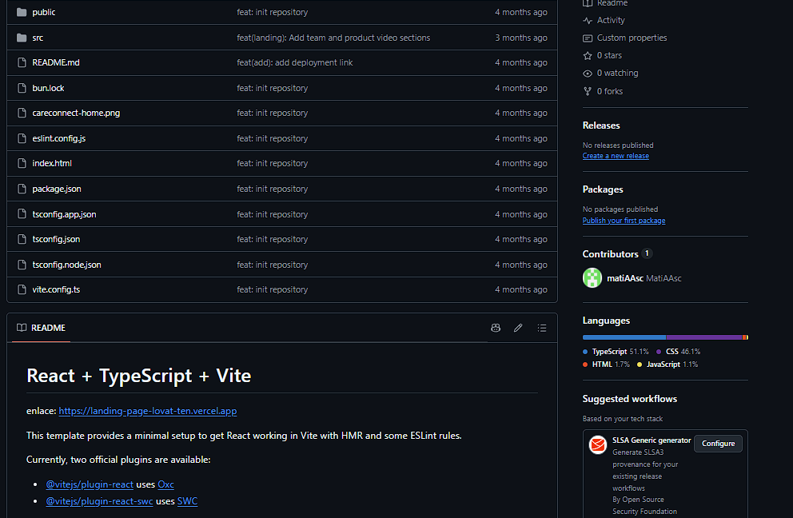

*Figura X. Evidencia del despliegue de la Landing Page de CareConnect.*

---

##### Home and Problem Section

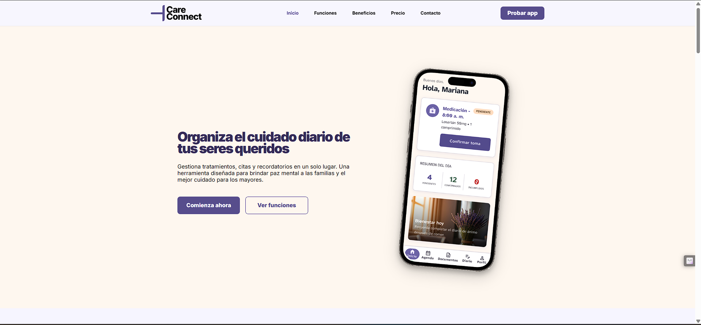

*Figura X. Home y presentación de la problemática de CareConnect.*

---

##### Features Section

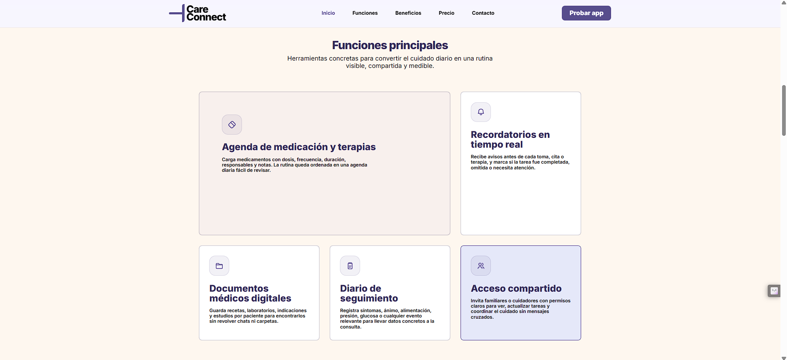

*Figura X. Funcionalidades principales presentadas en la Landing Page.*

---

##### Product, Benefits and How It Works

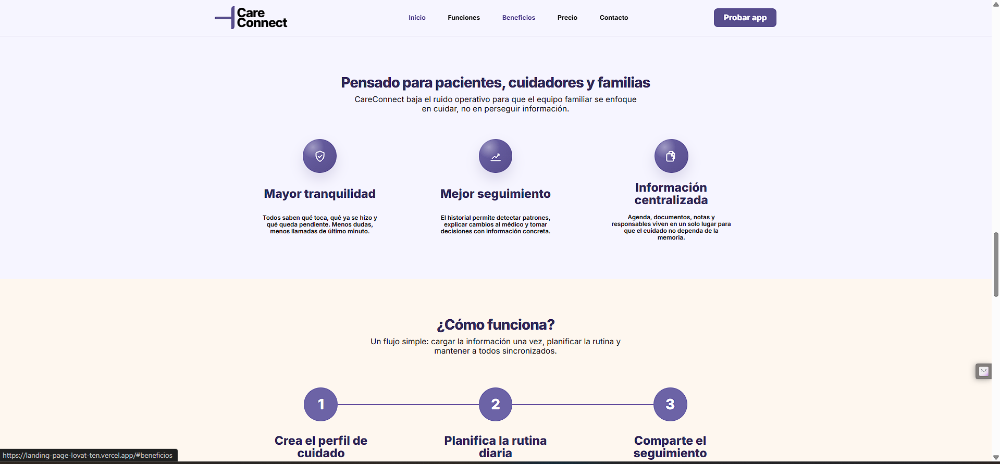

*Figura X. Presentación del producto, beneficios y funcionamiento de CareConnect.*

---

##### Plans, Contact and Footer


*Figura X. Planes, llamada a la acción y footer de la Landing Page.*
### 5.2.3. Implemented Frontend-Web Application Evidence

La aplicación web de CareStacks reutiliza como base el código Flutter del segmento cuidador (compartido con la versión móvil iOS, 5.2.4), habilitado para el target web de Flutter y rediseñado específicamente para pantallas de escritorio.

**Cambios de implementación:**

- **Sistema de layout responsive** (`core/layout/care_breakpoints.dart`): tres anchos de referencia resueltos con `MediaQuery`, sin paquetes externos — bottom nav y columna única por debajo de 768px, sidebar en riel de íconos entre 768–1279px, sidebar con etiquetas y panel de detalle desde 1280px.
- **Shell compartido** (`core/widgets/care_app_shell.dart`): sidebar fijo, cabecera fija, panel de detalle a la derecha en escritorio; barra superior y bottom nav en angosto.
- **Jerarquía visual en 4 niveles**: `CareCard` ahora tiene variantes *hero*, *standard*, *quiet* y *flat*, reemplazando el uso repetido de una sola tarjeta con el mismo radio y sombra.
- **Pantallas rediseñadas**: Inicio (grilla con hero del próximo evento, cifras del día y panel de paciente/invitaciones/actividad), Agenda (semana completa en 7 columnas con detalle lateral), Documentos (tabla con filtros y panel de detalle en vez de tarjetas apiladas), Diario (grilla de notas con editor fijo lateral), Perfil (dos columnas) y Login (rediseñado por ser la primera pantalla del producto).
- **Tipografía**: Inter cargada por `<link>` en `web/index.html`, con la stack del sistema como respaldo; cifras de horas y métricas con `FontFeature.tabularFigures`.
- **Paleta de colores**: sin modificaciones respecto a `app_colors.dart` — verificado que no existen literales `Color(0x...)` fuera de ese archivo.
- La capa de datos (`lib/features/*/data/`) no fue modificada; solo se trabajó sobre `presentation/`.

**Verificación:** análisis estático limpio, 27 tests de widget que montan las cinco pantallas principales y el panel de notificaciones en cuatro anchos distintos (detectando y corrigiendo 5 desbordes reales de layout), y build de producción (`flutter build web --release`) exitoso.

A continuación, evidencia de la aplicación web corriendo localmente contra el backend de CareConnect API, con datos de prueba reales (paciente vinculado a cuidador vía el módulo de Gestión de Consentimiento).

| Pantalla | Captura |
|---|---|
| Perfil | 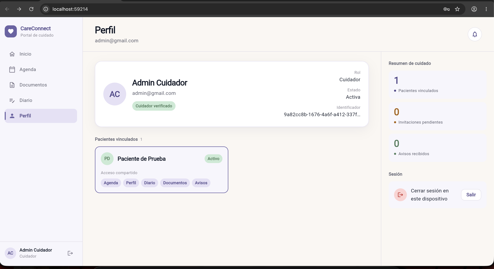 |
| Inicio de sesión | 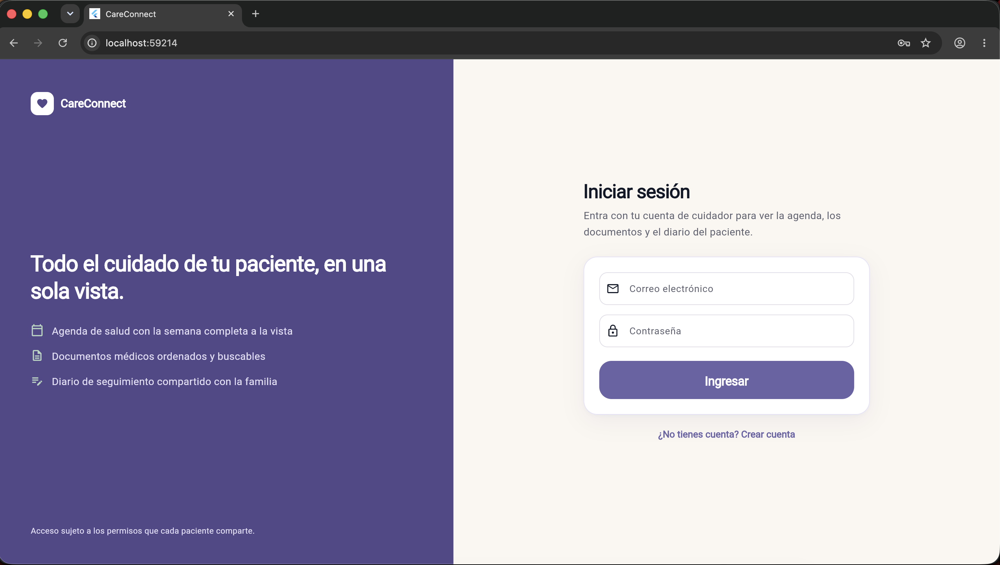 |
| Registro | 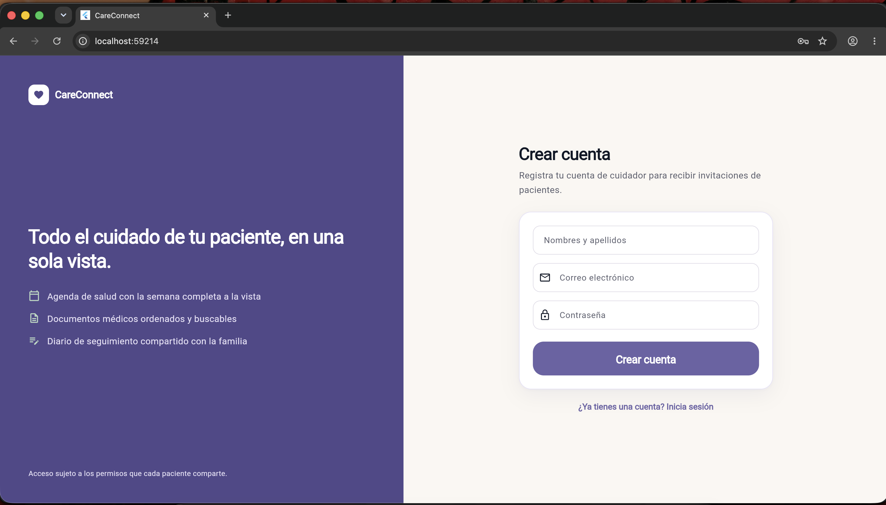 |
| Home (Cuidador) | 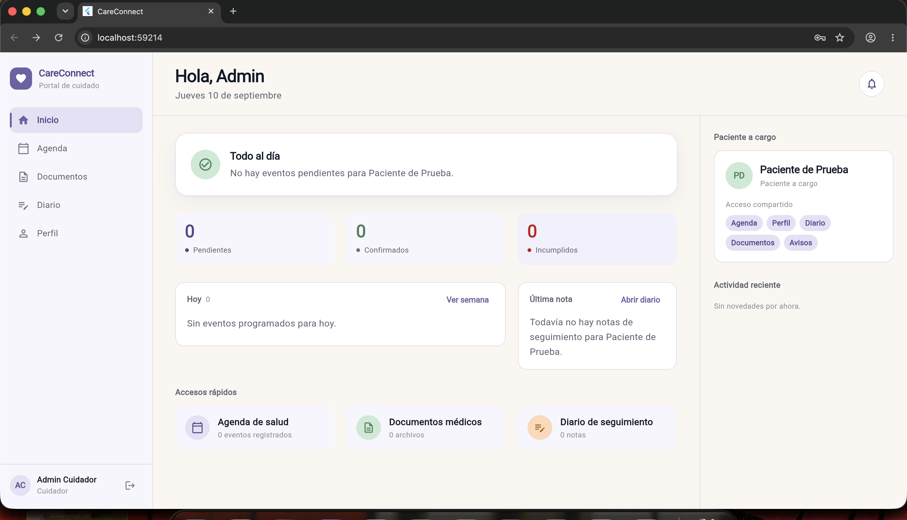 |
| Agenda | 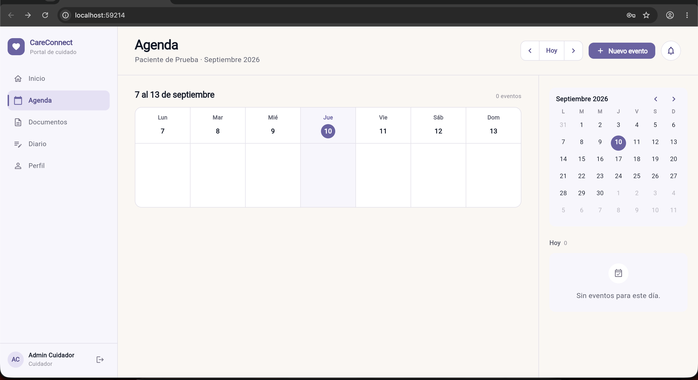 |
| Diario | 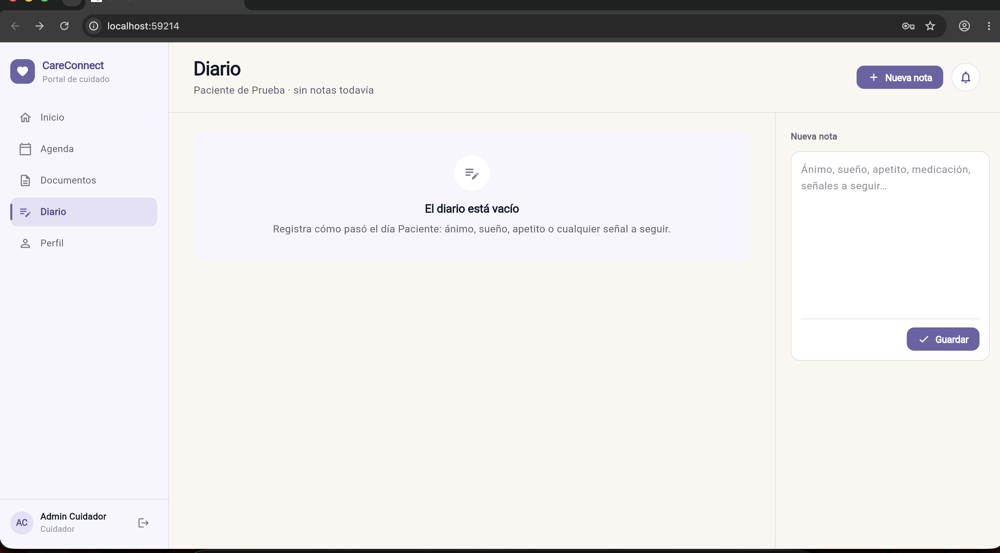 |
| Documentos | 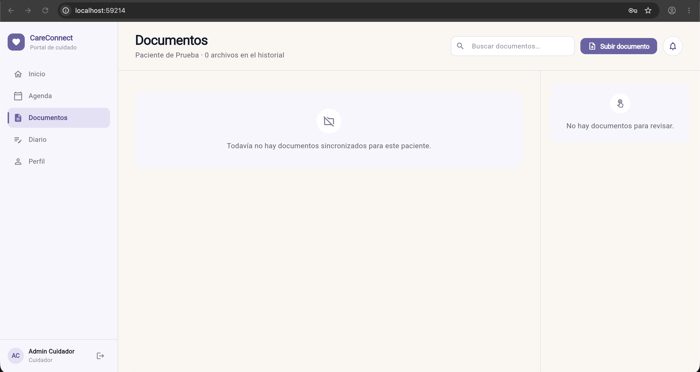 |
| Notificaciones | 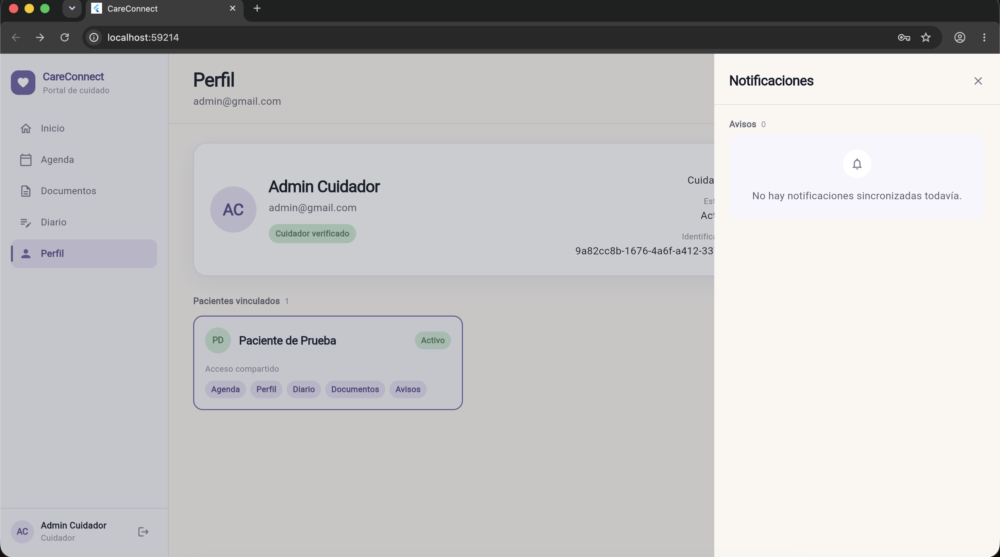 |

#### 5.2.4. Acuerdo de Servicio - SaaS
> _Guía:_ Derechos, obligaciones y restricciones. Publicado en "Terms and Conditions" del website y enlazado en footers, con referencia a códigos de ética ACM/IEEE y CIP.

### 5.2.5. Implemented RESTful API and/or Serverless Backend Evidence

El backend de CareStacks se implementó con **Spring Boot 4 + Java 25**, reutilizando como base la arquitectura del proyecto anterior (CareConnect), organizado en seis bounded contexts: IAM, Agenda, Notificaciones, Diario, Documentos y Gestión de Consentimiento. Para desarrollo local se utiliza una base de datos **H2 en memoria** (modo compatibilidad PostgreSQL), lo que permite levantar el backend sin dependencias externas.

El backend fue ejecutado y validado localmente, confirmando el correcto arranque del servidor Tomcat embebido, la inicialización de los repositorios JPA y la exposición de la documentación interactiva vía Swagger/OpenAPI, cubriendo todos los endpoints implementados en los seis bounded contexts.

### 5.2.6. RESTful API documentation

La documentación de la API se generó automáticamente mediante **SpringDoc OpenAPI**, disponible en `/swagger-ui.html`. A continuación se detallan los endpoints expuestos por cada bounded context del sistema, así como los esquemas (DTOs y requests) que estructuran los datos intercambiados.

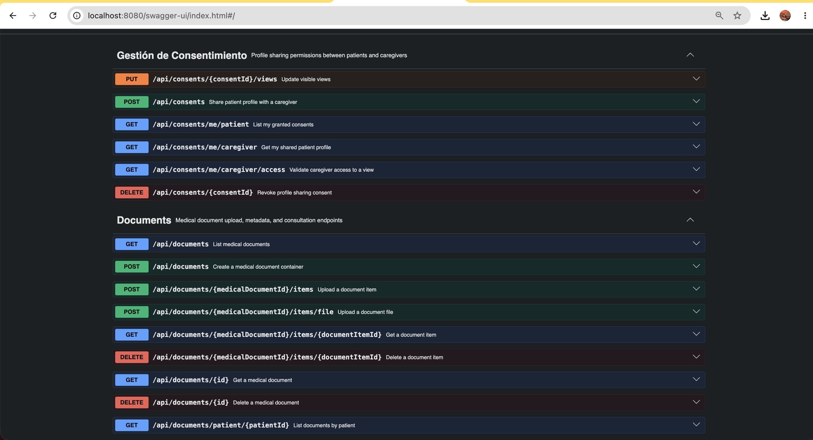

*Figura X. Endpoints del módulo Gestión de Consentimiento (`/api/consents`) y Documents (`/api/documents`): compartir perfil, actualizar vistas visibles, validar acceso, y gestión de documentos médicos.*

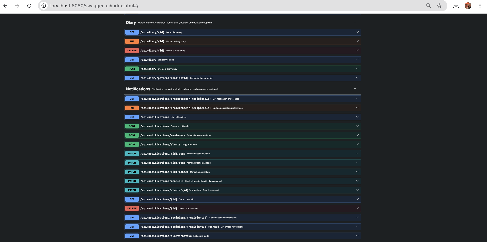

*Figura X. Endpoints del módulo Diary (`/api/diary`) y Notifications (`/api/notifications`): entradas de diario, recordatorios, alertas y preferencias de notificación.*

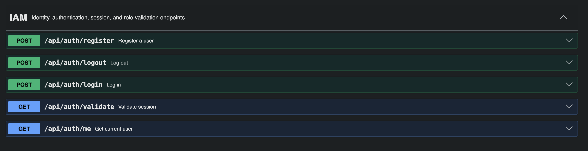

*Figura X. Endpoints del módulo IAM (`/api/auth`): registro, login, logout, validación de sesión y consulta de usuario actual.*

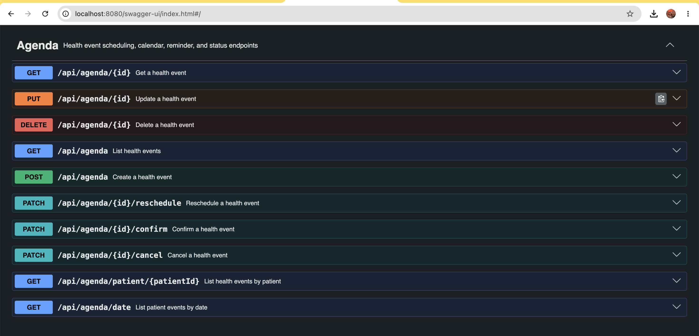

*Figura X. Endpoints del módulo Agenda (`/api/agenda`): creación, consulta, reprogramación, confirmación y cancelación de eventos de salud.*

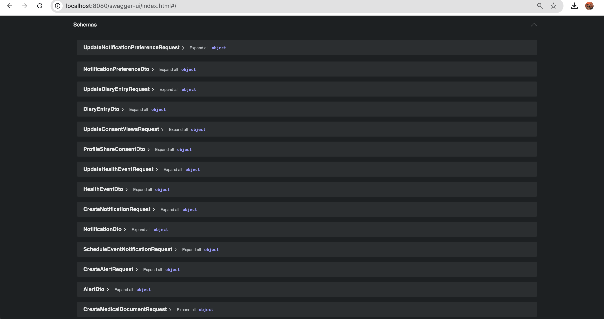

*Figura X. Esquemas de datos documentados automáticamente por SpringDoc: DTOs y requests de los módulos Notifications, Diary, Consents y Agenda.*

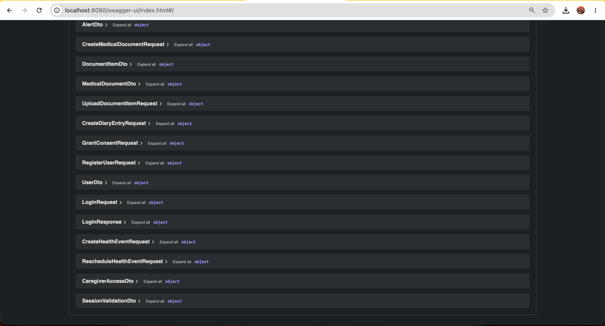

*Figura X. Esquemas de datos documentados automáticamente por SpringDoc: DTOs y requests de los módulos Documents, Diary, Consents, IAM y Agenda.*

#### 5.2.7. RESTful API documentation
> _Guía:_ OpenAPI vía Swagger. Por acción: verbo HTTP, sintaxis, parámetros, ejemplo y explicación del response.

#### 5.2.8. Team Collaboration Insights

### 5.3. Video About-the-Product
> _Guía:_ Screenshot, URL OneDrive del docente + URL YouTube, duración (1–3 min), al menos un testimonio de usuario. Incrustado en el Landing Page.

---

# Part II: Verification, Validation & Pipeline

## Capítulo VI: Product Verification & Validation

### 6.1. Testing Suites & Validation

#### 6.1.1. Core Entities Unit Tests

#### 6.1.2. Core Integration Tests

#### 6.1.3. Core Behavior-Driven Development
> _Guía:_ Archivos `.feature` en Gherkin ligados a User Stories + Steps en el lenguaje de programación.

#### 6.1.4. Core System Tests

### 6.2. Static testing & Verification

#### 6.2.1. Static Code Analysis

##### 6.2.1.1. Coding standard & Code conventions

##### 6.2.1.2. Code Quality & Code Security
> _Guía:_ Complejidad, duplicación, mantenibilidad + vulnerabilidades (SQLi, XSS, datos sensibles). SonarQube/ESLint/Checkmarx.

#### 6.2.2. Reviews

### 6.3. Validation Interviews

#### 6.3.1. Diseño de Entrevistas

#### 6.3.2. Registro de Entrevistas
> _Guía:_ 3 a 5 entrevistas por segmento. Nombres, edad, distrito, screenshot, URL Microsoft Stream con timing.

#### 6.3.3. Evaluaciones según heurísticas
> _Guía:_ Formato del Anexo D (usabilidad, arquitectura de información, inclusive design) con escala de severidad.

### 6.4. Auditoría de Experiencias de Usuario

#### 6.4.1. Auditoría realizada

##### 6.4.1.1. Información del grupo auditado

##### 6.4.1.2. Cronograma de auditoría realizada

##### 6.4.1.3. Contenido de auditoría realizada

#### 6.4.2. Auditoría recibida

##### 6.4.2.1. Información del grupo auditor

##### 6.4.2.2. Cronograma de auditoría recibida

##### 6.4.2.3. Contenido de auditoría recibida

##### 6.4.2.4. Resumen de modificaciones para subsanar hallazgos

## Capítulo VII: DevOps Practices

### 7.1. Continuous Integration

#### 7.1.1. Tools and Practices

#### 7.1.2. Build & Test Suite Pipeline Components

### 7.2. Continuous Delivery

#### 7.2.1. Tools and Practices

#### 7.2.2. Stages Deployment Pipeline Components

### 7.3. Continuous deployment

#### 7.3.1. Tools and Practices

#### 7.3.2. Production Deployment Pipeline Components

### 7.4. Continuous Monitoring

#### 7.4.1. Tools and Practices

#### 7.4.2. Monitoring Pipeline Components

#### 7.4.3. Alerting Pipeline Components

#### 7.4.4. Notification Pipeline Components

---

# Part III: Experiment-Driven Lifecycle

## Capítulo VIII: Experiment-Driven Development

### 8.1. Experiment Planning

#### 8.1.1. As-Is Summary

#### 8.1.2. Raw Material: Assumptions, Knowledge Gaps, Ideas, Claims

#### 8.1.3. Experiment-Ready Questions
> _Guía:_ Belief-led vs. Exploratory. Aplicar 5W+H para descubrir premisas ocultas.

#### 8.1.4. Question Backlog
> _Guía:_ Lista priorizada de **preguntas** (no features). Motivación "por qué" + puntuación Confianza/Riesgo/Impacto/Interés; en empate gana mayor Riesgo.

#### 8.1.5. Experiment Cards
> _Guía:_ Frontal: Pregunta, Por qué, Hipótesis, Simplest Useful Thing. Posterior: Medidas, Condiciones, Escala.

### 8.2. Experiment Design

#### 8.2.1. Hypotheses
> _Guía:_ Falsificables, testables, medibles. Emparejar cada una con su Hipótesis Nula.

#### 8.2.2. Domain Business Metrics
> _Guía:_ Cada métrica con fórmula, técnica de recolección y meta. Las Experiment Cards solo referencian métricas definidas aquí.

#### 8.2.3. Measures

#### 8.2.4. Conditions
> _Guía:_ Condición experimental vs. de control.

#### 8.2.5. Scale Calculations and Decisions
> _Guía:_ Significancia 5%, potencia 80–95%, MDE explícito. Mostrar cálculo del tamaño de muestra.

#### 8.2.6. Methods Selection
> _Guía:_ Simplest Useful Thing. No ejecutar dos experimentos simultáneos sobre el mismo tema/usuario. Consideración ética de no causar daño.

#### 8.2.7. Data Analytics: Goals, KPIs and Metrics Selection

#### 8.2.8. Web and Mobile Tracking Plan
> _Guía:_ Eventos, propiedades, herramienta y punto de captura por producto.

### 8.3. Experimentation

#### 8.3.1. To-Be User Stories

#### 8.3.2. To-Be Product Backlog

#### 8.3.3. Pipeline-supported, Experiment-Driven To-Be Software Platform Lifecycle

##### 8.3.3.1. To-Be Sprint Backlogs

##### 8.3.3.2. Implemented To-Be Landing Page Evidence

##### 8.3.3.3. Implemented To-Be Frontend-Web Application Evidence

##### 8.3.3.4. Implemented To-Be Native-Mobile Application Evidence

##### 8.3.3.5. Implemented To-Be RESTful API and/or Serverless Backend Evidence

##### 8.3.3.6. Team Collaboration Insights

#### 8.3.4. To-Be Validation Interviews

##### 8.3.4.1. Diseño de Entrevistas

##### 8.3.4.2. Registro de Entrevistas

### 8.4. Experiment Aftermath & Analysis

#### 8.4.1. Analysis and Interpretation of Results
> _Guía:_ Interpretar datos contra hipótesis e hipótesis nula. La hipótesis se **prueba**, no se "valida".

#### 8.4.2. Re-scored and Re-prioritized Question Backlog

### 8.5. Continuous Learning

#### 8.5.1. Shareback Session Artifacts: Learning Workflow

### 8.6. To-Be Software Platform Pre-launch

#### 8.6.1. About-the-Product Intro Video

#### 8.6.2. Resumen usando Gees Framework
> _Guía:_ Matriz con lentes Global, Economic, Environmental, Social; por cada una: indicador clave, hallazgo del sistema y estándar internacional de referencia (ISO/IEC 27001, 25010, ISO 14001, ISO 26000, WCAG 2.2).

---

## Matriz de Evaluación Ética y de Impacto
> _Guía:_ 7 dimensiones (Anexo F): Salud Pública y Seguridad; Inclusión y Accesibilidad; Impacto Social y Cultural; Impacto Económico; Impacto Ambiental; Enfoque Global; Revelación de Peligros y Responsabilidad. Por cada una: riesgos positivos/negativos, a quién afecta y magnitud, y acciones de mitigación.

| Dimensión / Criterio | Identificación de Riesgos e Impactos | Evaluación del Impacto (¿a quién y magnitud?) | Estrategias de Mitigación y Acciones de Diseño |
|----------------------|--------------------------------------|-----------------------------------------------|------------------------------------------------|
| 1. Salud Pública y Seguridad | \<...> | \<...> | \<...> |
| 2. Inclusión y Accesibilidad | \<...> | \<...> | \<...> |
| 3. Impacto Social y Cultural | \<...> | \<...> | \<...> |
| 4. Impacto Económico | \<...> | \<...> | \<...> |
| 5. Impacto Ambiental | \<...> | \<...> | \<...> |
| 6. Enfoque Global | \<...> | \<...> | \<...> |
| 7. Revelación de Peligros y Responsabilidad | \<...> | \<...> | \<...> |

---

## Conclusiones

### Conclusiones y recomendaciones
> _Guía:_ Contrastar Problem Statements, Assumptions, Hypothesis Statements y criterios de éxito del Lean UX frente a los resultados de las validaciones/experimentos. Recomendaciones sobre el Roadmap.

### Video App Validation
> _Guía:_ Evaluación con usuarios vía Firebase App Distribution + video.

### Video About-the-Team
> _Guía:_ Pauta de secuencias con timing hh:mm:ss por sección, cuadro de video representativo, URL Stream + YouTube. Testimonio ante cámara de cada participante (outcomes y competencias, alineado al Outcome 4).

---

## Bibliografía
> _Guía:_ Referencias en formato APA 7ma edición (https://normas-apa.org/).

---

## Anexos
> _Guía:_ Cada anexo inicia en nueva página, diferenciado con letra mayúscula (Anexo A, B, …). Incluir el **Anexo: Videos de Exposiciones** con título e hipervínculo por entrega.

### Anexo: Videos de Exposiciones
| Entrega | Título | Enlace (Microsoft Stream) |
|---------|--------|---------------------------|
| \<AV1/TP/AV2/TB2> | \<título> | \<url> |
