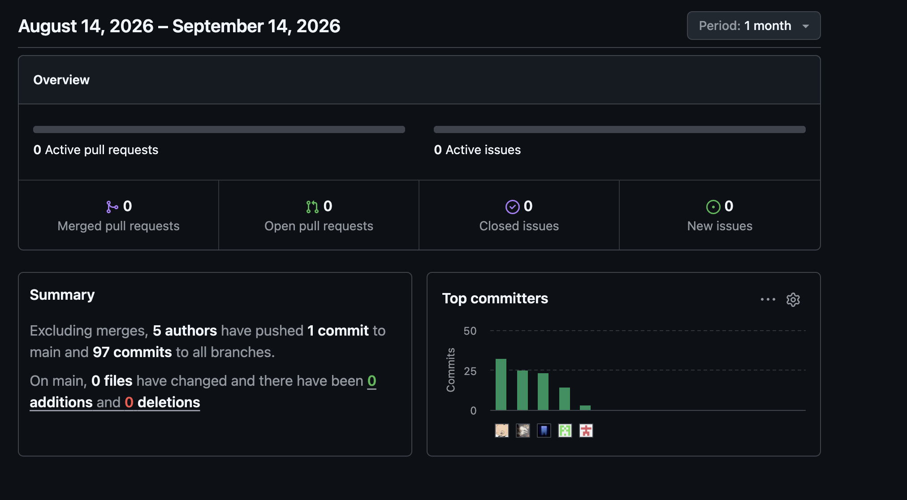
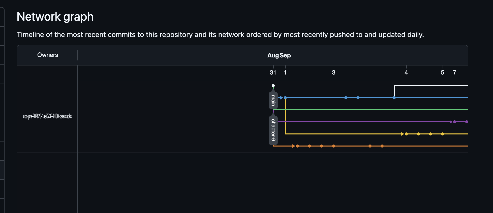

<!--
=====================================================================
 PLANTILLA — Informe de Trabajo Final · 1ASI0732 Diseño de Experimentos
 Un solo archivo README.md (archivo principal del repositorio del informe).
 Estructura completa según el statement: 3 Partes, 8 Capítulos + anexos.
 Reemplazar cada <placeholder> y cada bloque > _Guía:_ con el contenido real.
 Recordar: actualizar y VERIFICAR la Tabla de Contenidos antes de cada entrega.
=====================================================================
-->

<!-- CARÁTULA -->

# Universidad Peruana de Ciencias Aplicadas

---

## Carrera de Ingeniería de Software

---

1ASI0732

Diseño de Experimentos de Ingeniería de Software

**NRC**

9100

**Informe de Trabajo Final**

**Docente**

Sanchez Ponce, Alex Humberto

**Startup**

CareStacks

**Producto**

CareConnect

**Integrantes**

| Código | Apellidos y Nombres |
|---|---|
| U202319881 | Baldeon Armas, Santiago Armando |
| U202415495 | Espinoza Cruz, Angela Milagros |
| U202319563 | Muñiz Huayanca, Percy Alonso |
| U20221G099 | Nikaido Vargas, Javier Masaru |
| U202319698 | Salcedo Champi, Matias Rodolfo |

**Período 2026-20**

Septiembre, 2026

---
# REGISTRO DE VERSIONES DEL INFORME

| **Versión** | **Fecha** | **Autor** | **Descripción de modificación** |
|:---:|:---:|---|---|
| 0.1.0 | 31/08/2026 | Matias Salcedo | Creó la plantilla base del informe final (`main`) |
| 0.2.0 | 01/09/2026 – 08/09/2026 | Matias Salcedo | Redactó el Capítulo III, desarrollando las user stories, el product backlog, el impact mapping, el to-be scenario mapping y el llenado de la carátula (`chapter-3`) |
| 0.3.0 | 04/09/2026 – 05/09/2026 | Angela Espinoza | Desarrolló el Capítulo II a partir de las personas, los empathy maps, los journey maps y el análisis de needfinding (`chapter-2`) |
| 0.4.0 | 07/09/2026 | Javier Nikaido | Elaboró los diagramas de arquitectura, de clases y de base de datos del Capítulo IV (`chapter-4`) |
| 0.5.0 | 07/09/2026 | Angela Espinoza | Amplió el Capítulo II incorporando el enfoque Lean UX (problem statement, hipótesis y canvas), los segmentos objetivo y el análisis competitivo (`chapter-2`) |
| 0.6.0 | 08/09/2026 | Matias Salcedo | Completó la especificación de requerimientos del Capítulo III y afinó el backlog junto con el impact map (`chapter-3`) |
| 0.7.0 | 09/09/2026 | Angela Espinoza / Santiago Baldeon | Redactaron el Capítulo I describiendo el perfil de la startup y los perfiles de los integrantes del equipo (`chapter-1`, `chapter-2`) |
| 0.8.0 | 09/09/2026 – 10/09/2026 | Javier Nikaido | Implementó y documentó la Landing Page junto con su configuración de despliegue para el Capítulo V (`chapter-5`) |
| 0.9.0 | 10/09/2026 | Percy Muñiz | Incorporó la evidencia de la aplicación móvil en iOS, el prototipado y los sprint backlogs del Capítulo V (`chapter-5`) |
| 0.10.0 | 10/09/2026 | Javier Nikaido | Revisó los perfiles de los integrantes y ajustó la guía de requisitos del Capítulo IV (`chapter-1`, `chapter-4`) |
| 0.11.0 | 11/09/2026 | Matias Salcedo | Completó la sección de diseño UX web del Capítulo II (`chapter-2`) |
| 0.12.0 | 14/09/2026 | Angela Espinoza | Añadió el As-Is Scenario Mapping, el glosario de ubiquitous language, las referencias en formato APA 7 y reescribió el proceso Lean UX (`chapter-1`, `chapter-2`) |
| 0.13.0 | 14/09/2026 | Javier Nikaido / Percy Muñiz | Revisaron el class dictionary y el stack tecnológico, migraron el frontend a Flutter y ajustaron la configuración de despliegue (`chapter-4`, `chapter-5`) |
| 0.14.0 | 15/09/2026 | Santiago Baldeon | Elaboró los wireframes y mockups de la aplicación móvil del Capítulo IV (`chapter-4`) |
| 1.0.0 | 16/09/2026 | Matias Salcedo | AV1 Report |

# Project Report Collaboration Insights

Enlace de la organización para el reporte del proyecto: https://github.com/upc-pre-202620-1asi0732-9100-carestacks/carestacks-report

AV1:

## Tabla de Contenidos

<!-- 4 niveles. Verificar los anclajes (#) antes de cada entrega: GitHub genera el ancla a partir del texto del título. -->

- [Student Outcome](#student-outcome)
- [Part I: As-Is Software Project](#part-i-as-is-software-project)
  - [Capítulo I: Introducción](#capítulo-i-introducción)
    - [1.1. Startup Profile](#11-startup-profile)
      - [1.1.1. Descripción de la Startup](#111-descripción-de-la-startup)
      - [1.1.2. Perfiles de integrantes del equipo](#112-perfiles-de-integrantes-del-equipo)
    - [1.2. Solution Profile](#12-solution-profile)
      - [1.2.1. Antecedentes y problemática](#121-antecedentes-y-problemática)
      - [1.2.2. Lean UX Process](#122-lean-ux-process)
    - [1.3. Segmentos objetivo](#13-segmentos-objetivo)
  - [Capítulo II: Requirements Elicitation & Analysis](#capítulo-ii-requirements-elicitation--analysis)
    - [2.1. Competidores](#21-competidores)
    - [2.2. Entrevistas](#22-entrevistas)
    - [2.3. Needfinding](#23-needfinding)
    - [2.4. Ubiquitous Language](#24-ubiquitous-language)
  - [Capítulo III: Requirements Specification](#capítulo-iii-requirements-specification)
    - [3.1. To-Be Scenario Mapping](#31-to-be-scenario-mapping)
    - [3.2. User Stories](#32-user-stories)
    - [3.3. Product Backlog](#33-product-backlog)
    - [3.4. Impact Mapping](#34-impact-mapping)
  - [Capítulo IV: Product Design](#capítulo-iv-product-design)
    - [4.1. Style Guidelines](#41-style-guidelines)
    - [4.2. Information Architecture](#42-information-architecture)
    - [4.3. Landing Page UI Design](#43-landing-page-ui-design)
    - [4.4. Mobile Applications UX/UI Design](#44-mobile-applications-uxui-design)
    - [4.5. Mobile Applications Prototyping](#45-mobile-applications-prototyping)
    - [4.6. Web Applications UX/UI Design](#46-web-applications-uxui-design)
    - [4.7. Web Applications Prototyping](#47-web-applications-prototyping)
    - [4.8. Domain-Driven Software Architecture](#48-domain-driven-software-architecture)
    - [4.9. Software Object-Oriented Design](#49-software-object-oriented-design)
    - [4.10. Database Design](#410-database-design)
  - [Capítulo V: Product Implementation](#capítulo-v-product-implementation)
    - [5.1. Software Configuration Management](#51-software-configuration-management)
    - [5.2. Product Implementation & Deployment](#52-product-implementation--deployment)
    - [5.3. Video About-the-Product](#53-video-about-the-product)
- [Part II: Verification, Validation & Pipeline](#part-ii-verification-validation--pipeline)
  - [Capítulo VI: Product Verification & Validation](#capítulo-vi-product-verification--validation)
    - [6.1. Testing Suites & Validation](#61-testing-suites--validation)
    - [6.2. Static testing & Verification](#62-static-testing--verification)
    - [6.3. Validation Interviews](#63-validation-interviews)
    - [6.4. Auditoría de Experiencias de Usuario](#64-auditoría-de-experiencias-de-usuario)
  - [Capítulo VII: DevOps Practices](#capítulo-vii-devops-practices)
    - [7.1. Continuous Integration](#71-continuous-integration)
    - [7.2. Continuous Delivery](#72-continuous-delivery)
    - [7.3. Continuous deployment](#73-continuous-deployment)
    - [7.4. Continuous Monitoring](#74-continuous-monitoring)
- [Part III: Experiment-Driven Lifecycle](#part-iii-experiment-driven-lifecycle)
  - [Capítulo VIII: Experiment-Driven Development](#capítulo-viii-experiment-driven-development)
    - [8.1. Experiment Planning](#81-experiment-planning)
    - [8.2. Experiment Design](#82-experiment-design)
    - [8.3. Experimentation](#83-experimentation)
    - [8.4. Experiment Aftermath & Analysis](#84-experiment-aftermath--analysis)
    - [8.5. Continuous Learning](#85-continuous-learning)
    - [8.6. To-Be Software Platform Pre-launch](#86-to-be-software-platform-pre-launch)
- [Conclusiones](#conclusiones)
- [Bibliografía](#bibliografía)
- [Anexos](#anexos)

---

# Student Outcome

Cada participante del equipo debe sustentar evidencia de cómo las actividades realizadas en el trabajo final han ayudado a desarrollar las dimensiones del student outcome. Por ello en esta sección debe haber una subsección por cada alumno donde éste describa por escrito la relación entre el outcome, sus dimensiones y el trabajo que ha realizado. Esto se complementa con lo reflejado en los testimonios expuestos que forman parte del video About The Team.

**ABET – EAC - Student Outcome 4**

| Criterio específico | Acciones realizadas | Conclusiones |
|----|----|----|
|4.c.1 Reconoce responsabilidad ética y profesional en situaciones de ingeniería de software|**Espinoza Cruz, Angela Milagros** *AV1* Redacté la descripción de la startup, los perfiles del equipo, el problema y la problemática, el proceso completo de Lean UX (Problem Statements, Assumptions, Hypothesis Statements y Canvas) y los segmentos objetivo en el Capítulo I. En el Capítulo II, desarrollé el análisis competitivo, el diseño y registro de entrevistas, los User Personas, User Task Matrix, Journey Maps, Empathy Maps, As-Is Scenario Mapping y el glosario de Ubiquitous Language.  **Salcedo Champi, Matias Rodolfo** *AV1* Configuré la plantilla inicial del informe y la carátula del equipo. En el Capítulo III, redacté el To-Be Scenario Mapping, las User Stories, el Product Backlog y el Impact Mapping. En el Capítulo IV, completé la sección de Web Applications UX/UI Design.  **Nikaido Vargas, Javier Masaru** *AV1* En el Capítulo IV, elaboré los diagramas de arquitectura (Context, Container y Components), los diagramas y diccionario de clases, y el diagrama de base de datos. En el Capítulo V, documenté la Software Configuration Management, la evidencia de despliegue del Landing Page y la configuración de despliegue de los productos de CareConnect.  **Baldeon Armas, Santiago Armando** *AV1* Colaboré en la documentación de los perfiles de integrantes del equipo en el Capítulo I y en contenido del Capítulo IV.  **Muñiz Huayanca, Percy Alonso** *AV1* En el Capítulo IV, documenté el prototipado de la aplicación móvil (iOS con Flutter) y adapté la base Flutter del segmento cuidador a un prototipo funcional de escritorio para el Capítulo IV.7. En el Capítulo V, documenté la evidencia de implementación del Frontend-Web, la evidencia Native-Mobile, la evidencia del backend RESTful y su documentación en Swagger, y actualicé los Sprint Backlogs con el detalle técnico de cada tarea.|**AV1**  La actualización constante de conceptos y conocimientos en ingeniería de software nos permitió abordar de manera efectiva los retos de los capítulos desarrollados hasta esta entrega, aplicando metodologías actuales —Lean UX, Domain-Driven Design, arquitectura C4 y mejores prácticas de implementación para el desarrollo del proyecto y nuestro crecimiento profesional.|
|4.c.2 Emite juicios informados considerando el impacto de las soluciones de ingeniería de software en contextos globales, económicos, ambientales y sociales|**Espinoza Cruz, Angela Milagros** *AV1* La elaboración del Lean UX Canvas y el análisis competitivo me exigió investigar metodologías de validación temprana de producto y herramientas de análisis de mercado que no había aplicado antes. El diseño y análisis de entrevistas reforzó la importancia de la empatía y el aprendizaje continuo sobre experiencia de usuario en un dominio sensible como el cuidado de adultos mayores.  **Salcedo Champi, Matias Rodolfo** *AV1* Redactar el Product Backlog y el Impact Mapping me llevó a profundizar en técnicas de priorización de historias de usuario. Completar el diseño UX/UI web me exigió aprender a adaptar un sistema de diseño pensado originalmente para móvil hacia un contexto de escritorio.  **Nikaido Vargas, Javier Masaru** *AV1* Elaborar los diagramas C4 y el diccionario de clases me llevó a profundizar en Domain-Driven Design y en la representación formal de bounded contexts. Documentar la configuración de despliegue me impulsó a investigar buenas prácticas de gestión de variables de entorno y separación de ambientes.  **Baldeon Armas, Santiago Armando** *AV1* Colaborar en la documentación del equipo y del Capítulo IV me motivó a revisar cómo estructurar información técnica de forma clara para distintos lectores del informe.  **Muñiz Huayanca, Percy Alonso** *AV1* Adaptar la aplicación móvil Flutter a un prototipo web funcional me exigió aprender sobre sistemas de layout responsive y jerarquía visual en Flutter Web, algo que no había trabajado antes. Levantar y documentar el backend con Swagger me llevó a profundizar en configuración de CORS, gestión de variables de entorno y buenas prácticas de control de versiones (Git) que no dominaba con este nivel de detalle.|**AV1**  El aprendizaje permanente ha sido fundamental para adaptarnos a los retos técnicos y metodológicos de los capítulos desarrollados hasta esta entrega, permitiéndonos incorporar nuevas metodologías, herramientas y enfoques en el desarrollo del proyecto, y preparándonos para un desempeño profesional competente y actualizado en ingeniería de software.|

# Part I: As-Is Software Project

## Capítulo I: Introducción

### 1.1. Startup Profile

#### 1.1.1. Descripción de la Startup
> _Guía:_ Descripción de CareStacks.

#### 1.1.2. Perfiles de integrantes del equipo
> _Guía:_ Por integrante: foto, nombres y apellidos, código, descripción de carrera y párrafo de conocimientos técnicos/habilidades que aporta.

### 1.2. Solution Profile

#### 1.2.1. Antecedentes y problemática
> _Guía:_ Enunciado del problema aplicando 5W+2H (Who, What, Where, When, Why, How, How Much). Objetivos y restricciones que delimitan el alcance.

#### 1.2.2. Lean UX Process

##### 1.2.2.1. Lean UX Problem Statements
> _Guía:_ Domain, customer segments, pain points, gap, vision/strategy, initial segment.

##### 1.2.2.2. Lean UX Assumptions

##### 1.2.2.3. Lean UX Hypothesis Statements

##### 1.2.2.4. Lean UX Canvas

### 1.3. Segmentos objetivo
> _Guía:_ Descripción de segmentos con características demográficas e información estadística de sustento.

## Capítulo II: Requirements Elicitation & Analysis

### 2.1. Competidores

#### 2.1.1. Análisis competitivo
> _Guía:_ Competitive Analysis Landscape (mín. 3 competidores directos) + SWOT enfocado en la competencia.

#### 2.1.2. Estrategias y tácticas frente a competidores

### 2.2. Entrevistas

#### 2.2.1. Diseño de entrevistas
> _Guía:_ Preguntas principales y complementarias por segmento.

#### 2.2.2. Registro de entrevistas
> _Guía:_ **3 a 5 entrevistas por segmento.** Nombres, apellidos, edad, distrito, screenshot y URL de Microsoft Stream con timing y duración. Resumen por entrevista.

#### 2.2.3. Análisis de entrevistas
> _Guía:_ Análisis por segmento con sustento estadístico (porcentajes).

### 2.3. Needfinding

#### 2.3.1. User Personas
> _Guía:_ Una ficha por segmento (UXPressia).

#### 2.3.2. User Task Matrix

#### 2.3.3. User Journey Mapping
> _Guía:_ Versión As-Is, uno por User Persona (UXPressia).

#### 2.3.4. Empathy Mapping

#### 2.3.5. As-is Scenario Mapping
> _Guía:_ Uno por User Persona (LucidChart/Miro). Filas Phases, Doing, Thinking, Feeling + áreas positivas/negativas/blank.

### 2.4. Ubiquitous Language
> _Guía:_ Glosario del dominio, términos en inglés, sin términos técnicos de ingeniería de software.

## Capítulo III: Requirements Specification

<!-- ===== CAPÍTULO ASIGNADO A ESTE INTEGRANTE ===== -->
> _Guía:_ Introducción del capítulo: en base al análisis, se especifican los requisitos de los productos digitales. Incluye To-Be Scenario Mapping, User Stories, Impact Map y Product Backlog.

### 3.1. To-Be Scenario Mapping
> _Guía:_ **(Crear desde cero — no existe en el material reciclado.)** Uno por User Persona (LucidChart/Miro). Filas Phases, Doing, Thinking, Feeling. Comparar explícitamente contra el As-Is Scenario Mapping, identificando los cambios que introduce la solución.

<!-- Insertar captura por User Persona + explicación -->

### 3.2. User Stories
> _Guía:_ Un solo cuadro para todo el conjunto de Epics/Stories, una línea por Epic/User Story. Incluir Acceptance Criteria en Gherkin (Given-When-Then), tiempo presente, tercera persona, comprobables. Incluir US del landing (rol *visitante*), Technical Stories (rol *Developer*) y Spike Stories.

| Story ID | User | Priority | Epic |
|----------|------|----------|------|
| \<US01>  | \<rol> | \<Alta/Media/Baja> | \<epic> |

**Title:** \<título>
**Description:** Como \<rol> deseo \<objetivo> para \<beneficio>.
**Acceptance Criteria:**
- **Scenario:** \<nombre> **Given** \<contexto> **When** \<evento> **Then** \<resultado>

### 3.3. Product Backlog
> _Guía:_ Orden por valor de negocio (no iniciar por seguridad/autenticación). Incluir captura + URL público de la herramienta (Trello/Jira/Pivotal). US del landing desde el primer sprint.

| # Orden | User Story Id | Título | Descripción | Story Points (1/2/3/5/8) |
|---------|---------------|--------|-------------|--------------------------|
| 1       | \<US01>       | \<título> | Como… deseo… para… | \<pts> |

- URL del Product Backlog: \<url-herramienta>

### 3.4. Impact Mapping
> _Guía:_ Business Goals con criterio SMART. Columnas Goal/Actor(Persona)/Impact/Deliverable enlazadas a User Stories (UXPressia). Incluir captura.

| Business Goal (SMART) | Actor / Persona | Impact | Deliverable | User Stories |
|-----------------------|-----------------|--------|-------------|--------------|
| \<goal>               | \<persona>      | \<impact> | \<deliverable> | \<US ids> |

<!-- ===== FIN CAPÍTULO ASIGNADO ===== -->

## Capítulo IV: Product Design

### 4.1. Style Guidelines

#### 4.1.1. General Style Guidelines
> _Guía:_ Branding, Typography, Colors, Spacing + 4 dimensiones de tono (Divertido/Serio, Formal/Casual, Respetuoso/Irreverente, Entusiasta/Sereno).

#### 4.1.2. Web Style Guidelines
> _Guía:_ Estándares visuales y de interacción para responsive web interfaces (breakpoints, grid, estados, componentes PrimeVue).

#### 4.1.3. Mobile Style Guidelines

##### 4.1.3.1. iOS Mobile Style Guidelines

##### 4.1.3.2. Android Mobile Style Guidelines

### 4.2. Information Architecture

#### 4.2.1. Organization Systems

#### 4.2.2. Labeling Systems

#### 4.2.3. SEO Tags and Meta Tags
> _Guía:_ Title, Description, Keywords, Author como mínimo, para Landing Page y Web Application.

#### 4.2.4. Searching Systems

#### 4.2.5. Navigation Systems

### 4.3. Landing Page UI Design

#### 4.3.1. Landing Page Wireframe
> _Guía:_ Desktop Web Browser y Mobile Web Browser.

#### 4.3.2. Landing Page Mock-up
> _Guía:_ Desktop y Mobile Web Browser (Figma/Adobe XD).

### 4.4. Mobile Applications UX/UI Design

#### 4.4.1. Mobile Applications Wireframes

#### 4.4.2. Mobile Applications Wireflow Diagrams
> _Guía:_ Un Wireflow por User goal.

#### 4.4.3. Mobile Applications Mock-ups

#### 4.4.4. Mobile Applications User Flow Diagrams
> _Guía:_ Un User Flow por User goal (happy/unhappy paths).

### 4.5. Mobile Applications Prototyping

#### 4.5.1. Android Mobile Applications Prototyping
> _Guía:_ Screenshot de video + enlace a Microsoft Stream.

#### 4.5.2. iOS Mobile Applications Prototyping

### 4.6. Web Applications UX/UI Design

#### 4.6.1. Web Applications Wireframes

#### 4.6.2. Web Applications Wireflow Diagrams

#### 4.6.3. Web Applications Mock-ups

#### 4.6.4. Web Applications User Flow Diagrams

### 4.7. Web Applications Prototyping
> _Guía:_ Prototipo navegable Desktop + Mobile Web Browser. Screenshot + video en Microsoft Stream.

### 4.8. Domain-Driven Software Architecture

#### 4.8.1. Software Architecture Context Diagram
> _Guía:_ C4 Model (Structurizr).

#### 4.8.2. Software Architecture Container Diagrams

#### 4.8.3. Software Architecture Components Diagrams

### 4.9. Software Object-Oriented Design

#### 4.9.1. Class Diagrams

#### 4.9.2. Class Dictionary
> _Guía:_ Tabla de clases con atributos, tipos y responsabilidades.

### 4.10. Database Design

#### 4.10.1. Relational/Non-Relational Database Diagram

## Capítulo V: Product Implementation

### 5.1. Software Configuration Management

#### 5.1.1. Software Development Environment Configuration
> _Guía:_ Productos por actividad (Project/Requirements Mgmt, UX/UI, Development, Testing, Deployment, Documentation) con propósito y ruta.

#### 5.1.2. Source Code Management
> _Guía:_ URLs de repositorios (Landing Page, Web Services, Frontend Web). GitFlow: convenciones de feature/release/hotfix branches. Semantic Versioning. Conventional Commits.

#### 5.1.3. Source Code Style Guide & Conventions

#### 5.1.4. Software Deployment Configuration

### 5.2. Product Implementation & Deployment

#### 5.2.1. Sprint Backlogs
> _Guía:_ Por Sprint: Planning (fecha, hora, asistentes, Sprint Goal), Sprint Backlog, Development/Execution/Services Documentation Evidence, Team Collaboration Insights.

#### 5.2.2. Implemented Landing Page Evidence

#### 5.2.3. Implemented Frontend-Web Application Evidence

#### 5.2.4. Acuerdo de Servicio - SaaS
> _Guía:_ Derechos, obligaciones y restricciones. Publicado en "Terms and Conditions" del website y enlazado en footers, con referencia a códigos de ética ACM/IEEE y CIP.

#### 5.2.5. Implemented Native-Mobile Application Evidence

#### 5.2.6. Implemented RESTful API and/or Serverless Backend Evidence

#### 5.2.7. RESTful API documentation
> _Guía:_ OpenAPI vía Swagger. Por acción: verbo HTTP, sintaxis, parámetros, ejemplo y explicación del response.

#### 5.2.8. Team Collaboration Insights

### 5.3. Video About-the-Product

El Video About-the-Product presenta el modelo de negocio de CareConnect y sus características principales, dirigido tanto a los visitantes del Landing Page que buscan conocer la propuesta de valor como a los usuarios de las aplicaciones que desean realizar las tareas soportadas por la solución.

**URL (OneDrive/Stream):** https://upcedupe-my.sharepoint.com/:v:/g/personal/u202319881_upc_edu_pe/IQD9H0d9sU4tQJuKV5PStHyuAYjfXdpoDfRe-xCc_R1401s

> **Pendiente:** falta el screenshot del video, la URL de la versión publicada en YouTube (usada para incrustarse en el Landing Page), la duración exacta y confirmar que se incluye al menos un testimonio positivo de un usuario que haya participado en las entrevistas de validación, tal como lo exige la rúbrica.

---

# Part II: Verification, Validation & Pipeline

## Capítulo VI: Product Verification & Validation

### 6.1. Testing Suites & Validation

#### 6.1.1. Core Entities Unit Tests

#### 6.1.2. Core Integration Tests

#### 6.1.3. Core Behavior-Driven Development
> _Guía:_ Archivos `.feature` en Gherkin ligados a User Stories + Steps en el lenguaje de programación.

#### 6.1.4. Core System Tests

### 6.2. Static testing & Verification

#### 6.2.1. Static Code Analysis

##### 6.2.1.1. Coding standard & Code conventions

##### 6.2.1.2. Code Quality & Code Security
> _Guía:_ Complejidad, duplicación, mantenibilidad + vulnerabilidades (SQLi, XSS, datos sensibles). SonarQube/ESLint/Checkmarx.

#### 6.2.2. Reviews

### 6.3. Validation Interviews

#### 6.3.1. Diseño de Entrevistas

#### 6.3.2. Registro de Entrevistas
> _Guía:_ 3 a 5 entrevistas por segmento. Nombres, edad, distrito, screenshot, URL Microsoft Stream con timing.

#### 6.3.3. Evaluaciones según heurísticas
> _Guía:_ Formato del Anexo D (usabilidad, arquitectura de información, inclusive design) con escala de severidad.

### 6.4. Auditoría de Experiencias de Usuario

#### 6.4.1. Auditoría realizada

##### 6.4.1.1. Información del grupo auditado

##### 6.4.1.2. Cronograma de auditoría realizada

##### 6.4.1.3. Contenido de auditoría realizada

#### 6.4.2. Auditoría recibida

##### 6.4.2.1. Información del grupo auditor

##### 6.4.2.2. Cronograma de auditoría recibida

##### 6.4.2.3. Contenido de auditoría recibida

##### 6.4.2.4. Resumen de modificaciones para subsanar hallazgos

## Capítulo VII: DevOps Practices

### 7.1. Continuous Integration

#### 7.1.1. Tools and Practices

#### 7.1.2. Build & Test Suite Pipeline Components

### 7.2. Continuous Delivery

#### 7.2.1. Tools and Practices

#### 7.2.2. Stages Deployment Pipeline Components

### 7.3. Continuous deployment

#### 7.3.1. Tools and Practices

#### 7.3.2. Production Deployment Pipeline Components

### 7.4. Continuous Monitoring

#### 7.4.1. Tools and Practices

#### 7.4.2. Monitoring Pipeline Components

#### 7.4.3. Alerting Pipeline Components

#### 7.4.4. Notification Pipeline Components

---

# Part III: Experiment-Driven Lifecycle

## Capítulo VIII: Experiment-Driven Development

### 8.1. Experiment Planning

#### 8.1.1. As-Is Summary

#### 8.1.2. Raw Material: Assumptions, Knowledge Gaps, Ideas, Claims

#### 8.1.3. Experiment-Ready Questions
> _Guía:_ Belief-led vs. Exploratory. Aplicar 5W+H para descubrir premisas ocultas.

#### 8.1.4. Question Backlog
> _Guía:_ Lista priorizada de **preguntas** (no features). Motivación "por qué" + puntuación Confianza/Riesgo/Impacto/Interés; en empate gana mayor Riesgo.

#### 8.1.5. Experiment Cards
> _Guía:_ Frontal: Pregunta, Por qué, Hipótesis, Simplest Useful Thing. Posterior: Medidas, Condiciones, Escala.

### 8.2. Experiment Design

#### 8.2.1. Hypotheses
> _Guía:_ Falsificables, testables, medibles. Emparejar cada una con su Hipótesis Nula.

#### 8.2.2. Domain Business Metrics
> _Guía:_ Cada métrica con fórmula, técnica de recolección y meta. Las Experiment Cards solo referencian métricas definidas aquí.

#### 8.2.3. Measures

#### 8.2.4. Conditions
> _Guía:_ Condición experimental vs. de control.

#### 8.2.5. Scale Calculations and Decisions
> _Guía:_ Significancia 5%, potencia 80–95%, MDE explícito. Mostrar cálculo del tamaño de muestra.

#### 8.2.6. Methods Selection
> _Guía:_ Simplest Useful Thing. No ejecutar dos experimentos simultáneos sobre el mismo tema/usuario. Consideración ética de no causar daño.

#### 8.2.7. Data Analytics: Goals, KPIs and Metrics Selection

#### 8.2.8. Web and Mobile Tracking Plan
> _Guía:_ Eventos, propiedades, herramienta y punto de captura por producto.

### 8.3. Experimentation

#### 8.3.1. To-Be User Stories

#### 8.3.2. To-Be Product Backlog

#### 8.3.3. Pipeline-supported, Experiment-Driven To-Be Software Platform Lifecycle

##### 8.3.3.1. To-Be Sprint Backlogs

##### 8.3.3.2. Implemented To-Be Landing Page Evidence

##### 8.3.3.3. Implemented To-Be Frontend-Web Application Evidence

##### 8.3.3.4. Implemented To-Be Native-Mobile Application Evidence

##### 8.3.3.5. Implemented To-Be RESTful API and/or Serverless Backend Evidence

##### 8.3.3.6. Team Collaboration Insights

#### 8.3.4. To-Be Validation Interviews

##### 8.3.4.1. Diseño de Entrevistas

##### 8.3.4.2. Registro de Entrevistas

### 8.4. Experiment Aftermath & Analysis

#### 8.4.1. Analysis and Interpretation of Results
> _Guía:_ Interpretar datos contra hipótesis e hipótesis nula. La hipótesis se **prueba**, no se "valida".

#### 8.4.2. Re-scored and Re-prioritized Question Backlog

### 8.5. Continuous Learning

#### 8.5.1. Shareback Session Artifacts: Learning Workflow

### 8.6. To-Be Software Platform Pre-launch

#### 8.6.1. About-the-Product Intro Video

#### 8.6.2. Resumen usando Gees Framework
> _Guía:_ Matriz con lentes Global, Economic, Environmental, Social; por cada una: indicador clave, hallazgo del sistema y estándar internacional de referencia (ISO/IEC 27001, 25010, ISO 14001, ISO 26000, WCAG 2.2).

---

## Conclusiones

### Conclusiones y recomendaciones

El Problem Statement planteado en la sección de Lean UX Problem Statements identificaba como brecha central la falta de coordinación entre cuidadores que atienden a un mismo paciente geriátrico, con tres consecuencias concretas: la imposibilidad de confirmar si otra persona ya administró una dosis, la omisión de dosis por parte del paciente ante la duda, y la reconstrucción manual del historial de evolución. Las entrevistas realizadas en el capítulo de Requirements Elicitation & Analysis confirman esta brecha con evidencia directa: la totalidad de los cuidadores entrevistados señaló la falta de coordinación en los cambios de turno como su principal problema, y la totalidad de los pacientes entrevistados reportó dudas sobre si ya había tomado una dosis. Esta evidencia valida el vacío declarado en el Problem Statement y respalda que la propuesta de valor de CareConnect apunta al problema correcto.

Respecto a las Lean UX Assumptions, la evidencia recogida valida de forma consistente las suposiciones referidas a los usuarios y a los beneficios que estos obtendrían del producto: los cuidadores entrevistados emplean el teléfono móvil como herramienta principal de su jornada, confirmando la suposición de negocio correspondiente, y combinan pastilleros o cuadernos con alarmas del celular sin que ninguna herramienta esté integrada, lo cual coincide con los puntos de dolor declarados. Sin embargo, dos supuestos permanecen sin evidencia propia en esta entrega: la suposición de negocio sobre el modelo freemium no fue explorada con los cuidadores ni con los pacientes entrevistados, y las entrevistas del primer segmento cubrieron únicamente a cuidadores informales, de modo que queda pendiente validar las suposiciones de negocio asociadas a los cuidadores formales, tales como enfermeros o técnicos de salud en atención domiciliaria.

En cuanto a los seis Hypothesis Statements formulados, ninguno ha sido sometido todavía a un experimento formal, dado que el capítulo de Experiment-Driven Development corresponde a una entrega posterior dentro del ciclo de vida del proyecto. No obstante, el análisis cualitativo de las entrevistas ofrece evidencia de plausibilidad para las primeras tres hipótesis: la totalidad de los cuidadores solicitó de manera espontánea contar con un registro compartido en tiempo real y con la confirmación de la medicación administrada, funcionalidades que corresponden directamente a las suposiciones de características sobre las cuales se construyen dichas hipótesis. Las tres hipótesis restantes cuentan con un respaldo menor en esta entrega, pues solo uno de los cuidadores entrevistados mencionó explícitamente la falta de apoyo profesional inmediato, y ninguno de los participantes se refirió de forma espontánea a la posibilidad de compartir el perfil del paciente con otros cuidadores; por ello, estas hipótesis requieren una validación específica antes de poder considerarse confirmadas.

Como recomendación para el roadmap del proyecto, se propone priorizar durante la fase de Experiment-Driven Development los experimentos asociados a las tres primeras hipótesis, dado que cuentan con la evidencia cualitativa más sólida obtenida en esta entrega, y diseñar un experimento adicional dirigido específicamente a cuidadores formales con el fin de cerrar la brecha de validación de las suposiciones de negocio correspondientes. Asimismo, se recomienda incorporar en una futura ronda de entrevistas una pregunta explícita sobre la disposición de los participantes a compartir el perfil del paciente y a pagar por funcionalidades avanzadas, de manera que la hipótesis relacionada con la compartición de perfil y la suposición de negocio sobre el modelo freemium cuenten con evidencia propia antes de invertir en su desarrollo.

---

## Bibliografía

Beard, J. R., Officer, A., de Carvalho, I. A., et al. (2016). The World report on ageing and health: A policy framework for healthy ageing. *The Lancet*, *387*(10033), 2145–2154. https://doi.org/10.1016/S0140-6736(15)00516-4

Instituto Nacional de Estadística e Informática. (2024). *Situación de la población adulta mayor: Informe técnico N.° 01*. https://www.inei.gob.pe/media/MenuRecursivo/boletines/informe-tecnico-poblacion-adulta-mayor.pdf

Microsoft. (s.f.). *REST API guidelines*. GitHub. https://github.com/microsoft/api-guidelines

Organización Mundial de la Salud. (2025). *Ageing and health*. https://www.who.int/news-room/fact-sheets/detail/ageing-and-health

The Cucumber Open Source Project. (s.f.). *Gherkin reference*. Cucumber. https://cucumber.io/docs/gherkin/reference/

---

## Anexos

### Anexo A: Archivo de Figma

[CareConnect — Web Applications UX/UI Design (4.6)](https://www.figma.com/design/1TzGaaQLzkBu26Ojno1AVU/CareConnect-%E2%80%94-Web-Applications-UX-UI-Design--4.6-?node-id=4-5&p=f), con las páginas de wireframes, mock-ups y wireflows de la aplicación web referenciadas en el Capítulo IV.

### Anexo B: Video de Entrevistas

[Video de entrevistas a cuidadores y pacientes geriátricos](https://upcedupe-my.sharepoint.com/:v:/g/personal/u202319881_upc_edu_pe/IQAd7joONgjbTYJ4N_xUFvPXAcOMtAz8WbmokiYYCP5M3T0), publicado en Microsoft Stream, con las seis entrevistas registradas en 2.2.2.

### Anexo C: Repositorios de Producto

| Repositorio | URL |
|---|---|
| Informe del proyecto (`carestacks-report`) | https://github.com/upc-pre-202620-1asi0732-9100-carestacks/carestacks-report |
| Backend / Web Services (`carestacks-backend-api`) | https://github.com/upc-pre-202620-1asi0732-9100-carestacks/carestacks-backend-api |
| Frontend Web (`carestacks-web`) | https://github.com/upc-pre-202620-1asi0732-9100-carestacks/carestacks-web |
| Landing Page (`Landing-Page`) | https://github.com/CareStacks/Landing-Page |

### Anexo: Videos
| Entrega | Título | Enlace (Microsoft Stream) |
|---------|--------|---------------------------|
| AV1 | Video About-the-Product | https://upcedupe-my.sharepoint.com/:v:/g/personal/u202319881_upc_edu_pe/IQD9H0d9sU4tQJuKV5PStHyuAYjfXdpoDfRe-xCc_R1401s |
| AV1 | Video de exposición | \<url> |
