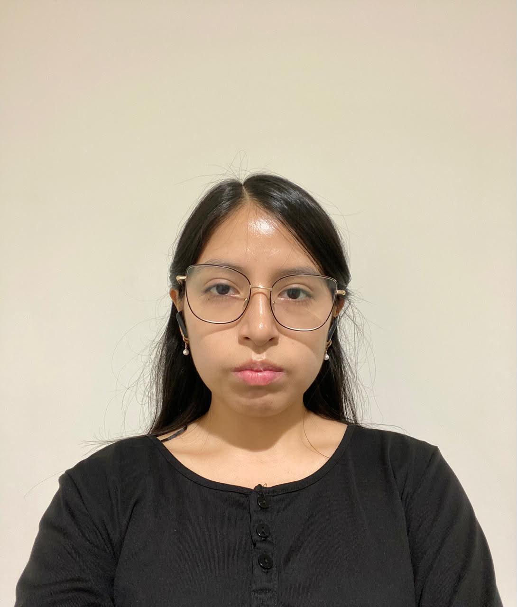
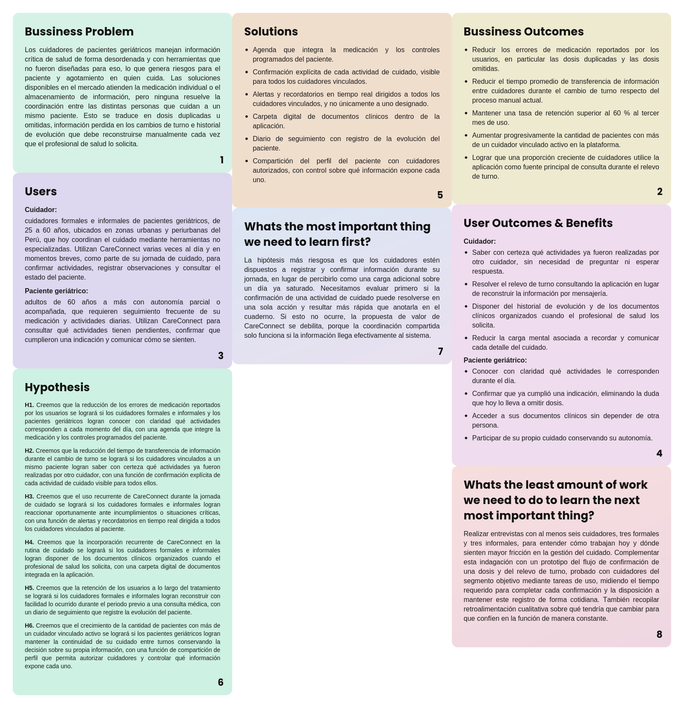

<!--
=====================================================================
 PLANTILLA — Informe de Trabajo Final · 1ASI0732 Diseño de Experimentos
 Un solo archivo README.md (archivo principal del repositorio del informe).
 Estructura completa según el statement: 3 Partes, 8 Capítulos + anexos.
 Reemplazar cada <placeholder> y cada bloque > _Guía:_ con el contenido real.
 Recordar: actualizar y VERIFICAR la Tabla de Contenidos antes de cada entrega.
=====================================================================
-->

# Informe de Trabajo Final

<!-- CARÁTULA -->

**Universidad Peruana de Ciencias Aplicadas (UPC)**

Carrera de Ingeniería de Software

Ciclo académico: **2026-20**

Curso: **1ASI0732 — Diseño de Experimentos de Ingeniería de Software**

NRC: **9100**

Profesor: **Sanchez Ponce, Alex Humberto**

**Informe de Trabajo Final**

Startup: **CareStacks**

Producto: **CareConnect**

**Relación de integrantes:**

| Código | Apellidos y Nombres |
|---|---|
| U202319881 | Baldeon Vivar, Santiago Armando |
| U202415495 | Espinoza Cruz, Angela Milagros |
| U202319563 | Muñiz Huayanca, Percy Alonso |
| U20221G099 | Nikaido Vargas, Javier Masaru |
| U202319698 | Salcedo Champi, Matias Rodolfo |

**Septiembre 2026**

---

## Registro de Versiones del Informe

> _Guía:_ Resumen de modificaciones relevantes durante el ciclo de vida. Una línea por versión, **un solo autor por línea**. La primera línea es la versión inicial. Modificaciones relevantes: adición/eliminación de secciones, correcciones/mejoras por feedback del docente o autocrítica del equipo.

| Versión | Fecha (YYYY-MM-DD) | Autor | Descripción de modificación |
|---------|--------------------|-------|-----------------------------|
| 1.0     | \<fecha>           | \<Apellidos, Nombres> | \<descripción> |

---

## Project Report Collaboration Insights

> _Guía:_ Indicar el URL del repositorio del Project Report en la organización GitHub del equipo. Por cada entrega, explicar cómo se desarrollaron las actividades del informe e incluir **capturas de los analíticos de colaboración y commits** en GitHub. Todos los integrantes deben participar. Debe ser coherente con el Registro de Versiones.

- Repositorio del informe: \<url-repo-github>

---

## Tabla de Contenidos

<!-- 4 niveles. Verificar los anclajes (#) antes de cada entrega: GitHub genera el ancla a partir del texto del título. -->

- [Student Outcome](#student-outcome)
- [Part I: As-Is Software Project](#part-i-as-is-software-project)
  - [Capítulo I: Introducción](#capítulo-i-introducción)
    - [1.1. Startup Profile](#11-startup-profile)
      - [1.1.1. Descripción de la Startup](#111-descripción-de-la-startup)
      - [1.1.2. Perfiles de integrantes del equipo](#112-perfiles-de-integrantes-del-equipo)
    - [1.2. Solution Profile](#12-solution-profile)
      - [1.2.1. Antecedentes y problemática](#121-antecedentes-y-problemática)
      - [1.2.2. Lean UX Process](#122-lean-ux-process)
    - [1.3. Segmentos objetivo](#13-segmentos-objetivo)
  - [Capítulo II: Requirements Elicitation & Analysis](#capítulo-ii-requirements-elicitation--analysis)
    - [2.1. Competidores](#21-competidores)
    - [2.2. Entrevistas](#22-entrevistas)
    - [2.3. Needfinding](#23-needfinding)
    - [2.4. Ubiquitous Language](#24-ubiquitous-language)
  - [Capítulo III: Requirements Specification](#capítulo-iii-requirements-specification)
    - [3.1. To-Be Scenario Mapping](#31-to-be-scenario-mapping)
    - [3.2. User Stories](#32-user-stories)
    - [3.3. Product Backlog](#33-product-backlog)
    - [3.4. Impact Mapping](#34-impact-mapping)
  - [Capítulo IV: Product Design](#capítulo-iv-product-design)
    - [4.1. Style Guidelines](#41-style-guidelines)
    - [4.2. Information Architecture](#42-information-architecture)
    - [4.3. Landing Page UI Design](#43-landing-page-ui-design)
    - [4.4. Mobile Applications UX/UI Design](#44-mobile-applications-uxui-design)
    - [4.5. Mobile Applications Prototyping](#45-mobile-applications-prototyping)
    - [4.6. Web Applications UX/UI Design](#46-web-applications-uxui-design)
    - [4.7. Web Applications Prototyping](#47-web-applications-prototyping)
    - [4.8. Domain-Driven Software Architecture](#48-domain-driven-software-architecture)
    - [4.9. Software Object-Oriented Design](#49-software-object-oriented-design)
    - [4.10. Database Design](#410-database-design)
  - [Capítulo V: Product Implementation](#capítulo-v-product-implementation)
    - [5.1. Software Configuration Management](#51-software-configuration-management)
    - [5.2. Product Implementation & Deployment](#52-product-implementation--deployment)
    - [5.3. Video About-the-Product](#53-video-about-the-product)
- [Part II: Verification, Validation & Pipeline](#part-ii-verification-validation--pipeline)
  - [Capítulo VI: Product Verification & Validation](#capítulo-vi-product-verification--validation)
    - [6.1. Testing Suites & Validation](#61-testing-suites--validation)
    - [6.2. Static testing & Verification](#62-static-testing--verification)
    - [6.3. Validation Interviews](#63-validation-interviews)
    - [6.4. Auditoría de Experiencias de Usuario](#64-auditoría-de-experiencias-de-usuario)
  - [Capítulo VII: DevOps Practices](#capítulo-vii-devops-practices)
    - [7.1. Continuous Integration](#71-continuous-integration)
    - [7.2. Continuous Delivery](#72-continuous-delivery)
    - [7.3. Continuous deployment](#73-continuous-deployment)
    - [7.4. Continuous Monitoring](#74-continuous-monitoring)
- [Part III: Experiment-Driven Lifecycle](#part-iii-experiment-driven-lifecycle)
  - [Capítulo VIII: Experiment-Driven Development](#capítulo-viii-experiment-driven-development)
    - [8.1. Experiment Planning](#81-experiment-planning)
    - [8.2. Experiment Design](#82-experiment-design)
    - [8.3. Experimentation](#83-experimentation)
    - [8.4. Experiment Aftermath & Analysis](#84-experiment-aftermath--analysis)
    - [8.5. Continuous Learning](#85-continuous-learning)
    - [8.6. To-Be Software Platform Pre-launch](#86-to-be-software-platform-pre-launch)
- [Matriz de Evaluación Ética y de Impacto](#matriz-de-evaluación-ética-y-de-impacto)
- [Conclusiones](#conclusiones)
- [Bibliografía](#bibliografía)
- [Anexos](#anexos)

---

## Student Outcome

> _Guía:_ Colocar el párrafo introductorio idéntico al Anexo A del statement. Una subsección por alumno describiendo la relación outcome–dimensiones–trabajo. En "Acciones realizadas" identificar cada participante y por entrega (AV1, TP, AV2, TB2). "Conclusiones" grupales y acumulables.

El curso contribuye al cumplimiento del Student Outcome ABET:

**ABET – EAC – Student Outcome 4**
**Criterio:** La capacidad de reconocer responsabilidades éticas y profesionales en situaciones de ingeniería y hacer juicios informados, que deben considerar el impacto de las soluciones de ingeniería en contextos globales, económicos, ambientales y sociales.

| Criterio específico | Acciones realizadas | Conclusiones |
|---------------------|---------------------|--------------|
| **4.c.1** Reconoce responsabilidad ética y profesional en situaciones de ingeniería de software | \<Apellidos, Nombres> AV1: \<acciones> TP: … AV2: … TB2: … | \<conclusiones grupales acumulables> |
| **4.c.2** Emite juicios informados considerando el impacto de las soluciones de ingeniería de software en contextos globales, económicos, ambientales y sociales | \<Apellidos, Nombres> AV1: \<acciones> TP: … AV2: … TB2: … | \<conclusiones grupales acumulables> |

---

# Part I: As-Is Software Project

## Capítulo I: Introducción

### 1.1. Startup Profile

#### 1.1.1. Descripción de la Startup
CareStacks es una startup de tecnología orientada al sector salud y bienestar social, fundada por estudiantes de Ingeniería de Software de la Universidad Peruana de Ciencias Aplicadas. Nacimos para resolver una necesidad concreta y cotidiana: los cuidadores y los pacientes geriátricos no cuentan con herramientas digitales realmente pensadas para organizar el cuidado diario, dar seguimiento a los tratamientos y mantener una comunicación clara entre todos los involucrados. Competimos en un mercado donde las soluciones existentes se concentran en recordatorios individuales de medicación o en el almacenamiento aislado de información médica, y nos diferenciamos al integrar la coordinación entre múltiples cuidadores dentro de una misma plataforma.

Nuestra misión es brindar a cuidadores y pacientes geriátricos una herramienta móvil accesible que facilite el seguimiento del bienestar del paciente y mejore la coordinación de las actividades de cuidado.

Nuestra visión es consolidarnos como la plataforma de referencia en Latinoamérica para la gestión del cuidado geriátrico, apostando por soluciones tecnológicas que pongan a las personas en el centro.

Nuestro producto, CareConnect, es una aplicación móvil nativa y multiplataforma pensada para el día a día del cuidado. Integra un calendario de medicación y terapias programadas, un sistema de alertas y recordatorios en tiempo real, una carpeta digital para documentos clínicos y tratamientos, un historial de notas y registro de evolución del paciente, y la compartición de perfiles entre cuidadores para garantizar continuidad en la atención. Todas estas capacidades conviven en una sola interfaz, de modo que la información crítica del paciente deja de estar dispersa entre cuadernos, alarmas y conversaciones de mensajería.

#### 1.1.2. Perfiles de integrantes del equipo
> _Guía:_ Por integrante: foto, nombres y apellidos, código, descripción de carrera y párrafo de conocimientos técnicos/habilidades que aporta.
>
| Integrantes | Descripción |
| --- | --- |
|  | **Nombres y Apellidos:** Matias Rodolfo Salcedo Champi   **Código:** U202319698   **Carrera:** Ingeniería de Software   Soy una persona orientada a la construcción de producto, con experiencia en el desarrollo de aplicaciones móviles y web y participación previa en proyectos de investigación y desarrollo. Cuento con conocimientos en Flutter, Dart, Node.js, Express.js, MongoDB, PostgreSQL, Git y GitHub, lo que me permite aportar tanto en la capa móvil como en los servicios que la soportan. Me motiva llevar una idea desde el prototipo hasta una versión funcional y desplegada. |
|  | **Nombres y Apellidos:** Santiago Armando Baldeon Vivar  **Código:** U202319881   **Carrera:** Ingeniería de Software   Mi nombre es Santiago Armando Baldeon y tengo 20 años. Actualmente estoy cursando la carrera de Ingeniería de Software en la Universidad Peruana de Ciencias Aplicadas. En mi caso elegí esta carrera porque desde chico sentí gran pasión por la tecnología y siempre quise ser alguien importante en este mundo, brindando mis aportes a la humanidad. Creo que voy por buen camino y espero en un futuro cumplir estos sueños y objetivos que tengo. |
|  | **Nombres y Apellidos:** Javier Masaru Nikaido Vargas   **Código:** U20221G099   **Carrera:** Ingeniería de Software   Soy estudiante del octavo ciclo de Ingeniería de Software y contribuyo al equipo en el desarrollo estructural de la solución y en la validación funcional de lo implementado. Me enfoco en verificar que lo construido responda efectivamente a los requisitos definidos y en detectar inconsistencias antes de que lleguen a la entrega. Me motiva el trabajo metódico y la mejora continua del producto. |
|  | **Nombres y Apellidos:** Angela Milagros Espinoza Cruz   **Código:** U202415495   **Carrera:** Ingeniería de Software   Soy una persona curiosa, creativa y resiliente, cualidades que me impulsan a aportar innovación en cada uno de mis trabajos. Cuento con conocimientos en Python, Figma y C++, además de experiencia en el diseño y desarrollo de páginas web. Me motiva el aprendizaje constante, la exploración de nuevas herramientas y la creación de soluciones innovadoras aplicadas a problemas existentes. Asimismo, considero que la proactividad y la comunicación asertiva son fundamentales para llevar a cabo los proyectos de manera efectiva. |
|   | **Nombres y Apellidos:**    **Código:** U202319563   **Carrera:** Ingeniería de Software   Soy Alonso, estudiante de Ingeniería de Software de la Universidad Peruana de Ciencias Aplicadas, actualmente en octavo ciclo. Me interesa especialmente el desarrollo backend y fullstack, y en los últimos ciclos he ido inclinándome también hacia el área de Inteligencia Artificial y Data Science, sin dejar de lado buenas prácticas de ciberseguridad. Me gusta trabajar apoyándome en herramientas de IA para programar de forma más eficiente, dividiendo el trabajo en tareas claras para cumplir con los plazos sin perder calidad. Como líder de equipo, procuro mantener una comunicación constante con mis compañeros y asegurarme de que cada entregable avance de forma ordenada, coordinando responsabilidades según las fortalezas de cada uno.|

### 1.2. Solution Profile

#### 1.2.1. Antecedentes y problemática

Aplicamos la técnica de las 5W y 2H para examinar los antecedentes y la problemática que aborda nuestro proyecto.

| 5W / 2H | Pregunta | Descripción |
| --- | --- | --- |
| **Who?** | ¿Quién es afectado? | Los más afectados son los cuidadores formales e informales y los pacientes geriátricos que dependen de una rutina de atención constante. Ambos segmentos viven de forma directa las consecuencias de una mala coordinación, ya sea por sobrecarga en el cuidado o por falta de seguimiento oportuno. |
| **What?** | ¿Cuál es el problema? | No existe una plataforma que centralice de forma práctica los tratamientos, rutinas, recordatorios, documentos clínicos e historial de evolución de un paciente geriátrico. Esa ausencia hace que coordinarse entre varios cuidadores sea difícil y que el propio paciente tenga poca visibilidad de su proceso de cuidado. |
| **Where?** | ¿Dónde sucede el problema? | El problema ocurre principalmente en entornos de cuidado domiciliario, comunitario y de atención particular en el Perú, aunque la situación es comparable en otros países de Latinoamérica, donde gran parte del cuidado geriátrico también recae en las familias y cuidadores externos. |
| **When?** | ¿Cuándo sucede el problema? | No es algo que ocurra de vez en cuando. Se presenta todos los días: al coordinar la medicación, al hacer el cambio de turno entre cuidadores, al buscar el historial clínico o al intentar registrar si el paciente mejoró o empeoró. |
| **Why?** | ¿Cuál es la causa del problema? | El cuidado geriátrico involucra a varios actores, entre ellos el paciente, los familiares, enfermeros, médicos y cuidadores contratados, pero no hay herramientas móviles accesibles que conecten esa información y la mantengan actualizada, en línea con lo señalado sobre la necesidad de nuevos modelos de cuidado integrados que combinen tecnología y soporte comunitario (Beard et al., 2016). El resultado es que muchas decisiones se toman con datos incompletos o tardíos, lo que incrementa el riesgo para el paciente. |
| **How?** | ¿Cómo se manifiesta el problema? | Se traduce en situaciones concretas: medicamentos olvidados o duplicados, citas médicas mal registradas, signos de alerta que no se comunican a tiempo, documentos clínicos dispersos y una dependencia excesiva de llamadas o mensajes informales para coordinar el cuidado. |
| **How much?** | ¿Cuál es la magnitud del problema? | La magnitud es significativa y creciente. El 13,9 % de la población peruana tiene 60 años o más y se proyecta que supere el 22 % hacia 2050, lo que amplía de forma sostenida la base de personas que requieren seguimiento continuo (INEI, 2024). Sobre esa base, cerca del 50 % de los pacientes crónicos no adhiere correctamente a su tratamiento por olvidos y desorganización, con el consiguiente aumento de complicaciones y reingresos hospitalarios (OMS, 2025). En el plano cotidiano, el impacto se refleja en tiempo perdido, errores evitables en la administración del cuidado, mayor carga física y emocional para los cuidadores y un seguimiento menos seguro para los pacientes. Cuando no existe una herramienta común de coordinación, aumentan los costos asociados a consultas repetidas, omisiones en tratamientos y desorganización en la atención diaria. |

**Restricciones del proyecto**

- El alcance se limita a una aplicación móvil nativa y multiplataforma acompañada de los servicios necesarios para su funcionamiento. No contempla integración con historias clínicas electrónicas de instituciones de salud.
- La solución está dirigida a entornos de cuidado domiciliario, comunitario y de atención particular en el Perú. No cubre la gestión operativa de clínicas u hospitales.
- El diseño debe ajustarse a dispositivos móviles de gama media, que son los de mayor uso entre los segmentos objetivo.
- Los usuarios de ambos segmentos presentan niveles heterogéneos de alfabetización digital, por lo que los flujos deben resolverse con un número mínimo de pasos y sin requerir formación técnica previa.
  
- El modelo de negocio previsto es freemium, lo que condiciona qué funcionalidades se ofrecen de forma gratuita y cuáles quedan reservadas al plan de pago.

#### 1.2.2. Lean UX Process

El proceso Lean UX permite articular la visión del modelo de negocio que será soportado por CareConnect, partiendo del problema identificado en la sección anterior. A continuación se desarrolla el Problem Statement que delimita el dominio y la brecha a abordar, los supuestos que el equipo asume sobre el negocio, los usuarios y las funcionalidades, las hipótesis que se derivan de dichos supuestos y, finalmente, el Lean UX Canvas que sintetiza todo el proceso.

##### 1.2.2.1. Lean UX Problem Statements

Se elabora un único Problem Statement para todo el proyecto, considerando ambos segmentos dentro del mismo enunciado.

**Problem Statement**

El estado actual del cuidado geriátrico domiciliario se sostiene sobre la coordinación cotidiana entre varias personas: familiares, cuidadores contratados y el propio paciente. Una vez que el profesional de salud establece el tratamiento, son los cuidadores quienes deben aplicarlo día a día, alternando turnos, administrando medicación, acompañando controles médicos y observando cambios en el estado del paciente. Este seguimiento ocurre fuera de cualquier institución de salud y sin supervisión directa del profesional que indicó el tratamiento.

La brecha que buscamos abordar frente a los productos y servicios utilizados actualmente se encuentra en la coordinación entre quienes cuidan a un mismo paciente. Durante la jornada, la información sobre lo que ya ocurrió depende de lo que cada cuidador recuerda y logra comunicar por medios que no fueron diseñados para preservarla: cuadernos de bitácora, alarmas del celular y grupos de mensajería. Esto genera tres consecuencias concretas, todas verificadas en nuestras entrevistas: el cuidador no puede confirmar si otra persona ya administró una dosis; el paciente, ante la duda de haberla tomado, prefiere omitirla; y el historial de evolución debe reconstruirse manualmente cada vez que el médico lo solicita. Las alternativas disponibles en el mercado resuelven el recordatorio individual de medicación o la coordinación familiar, pero ninguna integra ambas dimensiones en un mismo producto.

Nuestro producto, CareConnect, busca abordar esta brecha mediante una aplicación móvil que vincula digitalmente al paciente geriátrico con los cuidadores que él autoriza, centralizando la agenda de medicación y controles, las alertas, los documentos clínicos y el registro de evolución en un único lugar compartido. De este modo, cada participante sabe qué se hizo, qué queda pendiente y en qué estado se encuentra el paciente, manteniendo las decisiones clínicas exclusivamente bajo criterio del profesional de salud.

Nuestro enfoque inicial estará puesto en cuidadores informales de pacientes geriátricos, de 25 a 60 años, residentes en zonas urbanas y periurbanas de Lima, que actualmente coordinan el cuidado combinando cuadernos, alarmas y mensajería, y que comparten la responsabilidad del paciente con al menos otra persona. Este subconjunto concentra la fricción que el producto busca resolver y es el más accesible para validar la propuesta en las primeras iteraciones.

Sabremos que hemos tenido éxito cuando observemos que los cuidadores vinculados a un mismo paciente confirman de manera sostenida las actividades de cuidado dentro de la plataforma, que el relevo de turno se resuelve consultando la aplicación en lugar de reconstruir la información por mensajería, y que los pacientes geriátricos consultan o confirman por sí mismos al menos una actividad de su rutina diaria.

**Elementos del Problem Statement**

| Elemento | Contenido |
| :--- | :--- |
| **Domain** | Cuidado geriátrico domiciliario, comunitario y de atención particular, entendido como el seguimiento cotidiano de la medicación, los controles médicos, la documentación clínica y la evolución de un paciente adulto mayor fuera de una institución de salud. |
| **Customer segments** | Cuidadores formales e informales de pacientes geriátricos, responsables de la ejecución diaria del cuidado; y pacientes geriátricos con autonomía parcial o acompañada, que participan de su propia rutina de cuidado. |
| **Pain points** | Imposibilidad de confirmar si otro cuidador ya administró una dosis; pérdida de información durante el relevo de turno; omisión de dosis por parte del paciente ante la duda de haberla tomado; reconstrucción manual del historial de evolución cuando el médico lo solicita; dispersión de documentos clínicos entre medios físicos y digitales; y alta carga mental derivada de sostener toda la coordinación en la memoria. |
| **Gap** | No existe una plataforma que combine el seguimiento clínico de la medicación con la coordinación en tiempo real entre varias personas que cuidan a un mismo paciente. Las soluciones actuales resuelven una dimensión u otra, pero no ambas dentro de un mismo producto. |
| **Vision / Strategy** | Convertirse en la plataforma de referencia en Latinoamérica para la gestión del cuidado geriátrico compartido, ofreciendo continuidad real entre turnos al cuidador y una experiencia simple y legible al paciente, sin sustituir el criterio del profesional de salud. La estrategia de entrada es un modelo freemium que permite comenzar a usar la plataforma sin fricción y reserva al plan de pago las capacidades de coordinación avanzada. |
| **Initial segment** | Cuidadores informales de 25 a 60 años en zonas urbanas y periurbanas de Lima, que comparten la responsabilidad de un mismo paciente geriátrico con al menos otra persona y que hoy se coordinan mediante cuadernos, alarmas y mensajería. |

##### 1.2.2.2. Lean UX Assumptions

***Business Assumptions:***

a) Creemos que existe una oportunidad de negocio en ofrecer a cuidadores de pacientes geriátricos una herramienta digital enfocada en la coordinación entre varias personas que atienden a un mismo paciente, y no únicamente en el recordatorio individual de medicación.

b) Creemos que CareConnect puede diferenciarse de las soluciones actuales del mercado al integrar en un solo producto la coordinación entre cuidadores y el seguimiento clínico de la medicación, dimensiones que hoy las alternativas existentes resuelven por separado.

c) Creemos que los cuidadores adoptarán una herramienta digital si su configuración inicial es breve y no exige formación técnica previa.

d) Creemos que un modelo freemium permitirá reducir las barreras de acceso y llegar tanto a usuarios individuales como a instituciones de salud, capturando distintos perfiles de uso sin que el costo represente una limitación inicial.

e) Creemos que la descoordinación entre cuidadores genera costos concretos y evitables, tanto para las familias como para las instituciones de salud, que justifican la adopción de una solución como la nuestra.

f) Creemos que como equipo contamos con las capacidades técnicas y organizativas necesarias para desarrollar y validar una primera versión funcional de CareConnect dentro de los alcances y recursos disponibles para el proyecto.

---

***Business Outcome Assumptions:***

a) Creemos que CareConnect estará teniendo éxito si logra reducir los errores de medicación reportados por los usuarios, en particular las dosis duplicadas y las dosis omitidas.

b) Creemos que CareConnect estará teniendo éxito si mantiene una tasa de retención superior al 60 % al tercer mes de uso.

c) Creemos que CareConnect estará aportando valor si el tiempo promedio de transferencia de información entre cuidadores durante el cambio de turno se reduce respecto del proceso manual actual.

d) Creemos que CareConnect estará mostrando potencial de crecimiento si aumenta progresivamente la cantidad de pacientes con más de un cuidador vinculado activo en la plataforma.

e) Creemos que CareConnect estará consolidando su propuesta de valor si una proporción creciente de cuidadores utiliza la aplicación como fuente principal de consulta durante el relevo de turno, en lugar de la mensajería informal.

---

***User Assumptions:***

a) Creemos que uno de nuestros principales segmentos de usuario está conformado por cuidadores formales e informales de pacientes geriátricos, que asumen la responsabilidad operativa del cuidado diario en entornos domiciliarios o comunitarios.

b) Creemos que nuestro segundo segmento de usuario está conformado por pacientes geriátricos con autonomía parcial o acompañada, que requieren seguimiento frecuente de su medicación y actividades diarias.

c) Creemos que el cuidador utilizará CareConnect varias veces al día y en momentos breves, como parte de su jornada de cuidado, para confirmar actividades, registrar observaciones y consultar el estado del paciente.

d) Creemos que el paciente geriátrico utilizará CareConnect principalmente para consultar qué actividades tiene pendientes, confirmar que cumplió una indicación y comunicar cómo se siente.

e) Creemos que ambos segmentos interactuarán dentro de un mismo proceso de cuidado manteniendo funciones diferenciadas por rol, y que el paciente conservará la facultad de decidir qué información comparte y con qué cuidador.

f) Creemos que dentro del segmento de pacientes geriátricos conviven perfiles con niveles muy distintos de alfabetización digital, por lo que la interfaz debe dimensionarse para el perfil de menor manejo sin limitar al de mayor manejo.

---

***User Outcome and Benefit Assumptions:***

a) Creemos que el cuidador busca confirmar y consultar el estado del cuidado de forma rápida, con flujos que se resuelvan en pocos pasos y no añadan carga a una jornada ya saturada.

b) Creemos que el cuidador obtiene valor al saber con certeza qué actividades ya fueron realizadas por otro cuidador, sin necesidad de preguntar ni de esperar respuesta.

c) Creemos que el cuidador obtiene valor al disponer del historial de evolución y de los documentos clínicos organizados cuando el profesional de salud los solicita.

d) Creemos que el cuidador obtiene valor al reducir la carga mental asociada a recordar y comunicar cada detalle del cuidado a las demás personas involucradas.

e) Creemos que el paciente geriátrico busca conocer con claridad qué le corresponde hacer durante el día, sin depender de otra persona para cada consulta.

f) Creemos que el paciente geriátrico obtiene valor al poder confirmar que ya cumplió una indicación, eliminando la duda que hoy lo lleva a omitir dosis.

g) Creemos que ambos segmentos obtienen valor de una herramienta que apoye la organización del cuidado sin emitir diagnósticos ni sustituir el criterio del profesional de salud.

---

***Feature Assumptions:***

a) Creemos que ofrecer una agenda que integre la medicación y los controles programados del paciente permitirá a cuidadores y pacientes conocer con claridad qué actividades corresponden a cada momento del día.

b) Creemos que permitir la confirmación explícita de cada actividad de cuidado, visible para todos los cuidadores vinculados, eliminará la incertidumbre sobre si una dosis ya fue administrada.

c) Creemos que enviar alertas y recordatorios en tiempo real a todos los cuidadores vinculados, y no únicamente a uno designado, permitirá reaccionar oportunamente ante incumplimientos o situaciones críticas.

d) Creemos que disponer de una carpeta digital de documentos clínicos dentro de la aplicación evitará que recetas, resultados e informes queden dispersos entre medios físicos y digitales.

e) Creemos que ofrecer un diario de seguimiento con registro de evolución permitirá reconstruir con facilidad lo ocurrido durante el periodo previo a una consulta médica.

f) Creemos que permitir al paciente compartir su perfil con cuidadores autorizados, controlando qué información expone cada uno, hará posible la continuidad del cuidado entre turnos preservando su capacidad de decisión sobre su propia información.

##### 1.2.2.3. Lean UX Hypothesis Statements

Se elabora un Hypothesis Statement por cada Feature Assumption, siguiendo la plantilla: *We believe we will achieve [business outcome] if [these personas] attain [benefit/user outcome] with [feature or solution].*

**Hypothesis Statement 1**

Creemos que la reducción de los errores de medicación reportados por los usuarios se logrará si los cuidadores formales e informales y los pacientes geriátricos logran conocer con claridad qué actividades corresponden a cada momento del día, con una agenda que integre la medicación y los controles programados del paciente.

**Hypothesis Statement 2**

Creemos que la reducción del tiempo de transferencia de información durante el cambio de turno se logrará si los cuidadores vinculados a un mismo paciente logran saber con certeza qué actividades ya fueron realizadas por otro cuidador, con una función de confirmación explícita de cada actividad de cuidado visible para todos ellos.

**Hypothesis Statement 3**

Creemos que el uso recurrente de CareConnect durante la jornada de cuidado se logrará si los cuidadores formales e informales logran reaccionar oportunamente ante incumplimientos o situaciones críticas, con una función de alertas y recordatorios en tiempo real dirigida a todos los cuidadores vinculados al paciente.

**Hypothesis Statement 4**

Creemos que la incorporación recurrente de CareConnect en la rutina de cuidado se logrará si los cuidadores formales e informales logran disponer de los documentos clínicos organizados cuando el profesional de salud los solicita, con una carpeta digital de documentos integrada en la aplicación.

**Hypothesis Statement 5**

Creemos que la retención de los usuarios a lo largo del tratamiento se logrará si los cuidadores formales e informales logran reconstruir con facilidad lo ocurrido durante el periodo previo a una consulta médica, con un diario de seguimiento que registre la evolución del paciente.

**Hypothesis Statement 6**

Creemos que el crecimiento de la cantidad de pacientes con más de un cuidador vinculado activo se logrará si los pacientes geriátricos logran mantener la continuidad de su cuidado entre turnos conservando la decisión sobre su propia información, con una función de compartición de perfil que permita autorizar cuidadores y controlar qué información expone cada uno.

**Trazabilidad y criterios de validación**

| Hipótesis | Feature Assumption | Business Outcome asociado | Criterio de validación |
| :---: | :--- | :--- | :--- |
| **H1** | a) Agenda integrada de medicación y controles | Reducción de errores de medicación | Disminución de las dosis duplicadas y omitidas reportadas por los usuarios respecto de la línea base declarada al registrarse. |
| **H2** | b) Confirmación explícita de actividades | Reducción del tiempo de relevo de turno | El tiempo promedio de transferencia de información entre cuidadores al cambio de turno se reduce en 50 % respecto del proceso manual, según los registros de actividad de la aplicación. |
| **H3** | c) Alertas y recordatorios en tiempo real | Uso recurrente durante la jornada | El 70 % de los usuarios activos utiliza la función de alertas de medicación al menos una vez por día durante las primeras cuatro semanas. |
| **H4** | d) Carpeta digital de documentos clínicos | Incorporación en la rutina de cuidado | Una proporción creciente de cuidadores consulta o carga documentos en la aplicación durante el periodo previo a una consulta médica. |
| **H5** | e) Diario de seguimiento con evolución | Retención superior al 60 % al tercer mes | La tasa de retención al tercer mes supera el 60 % entre los usuarios que registraron al menos una entrada de diario durante el primer mes. |
| **H6** | f) Compartición de perfil con permisos | Crecimiento de pacientes con varios cuidadores | Aumento sostenido de la cantidad de pacientes con más de un cuidador vinculado activo, y configuración inicial del perfil completada en menos de 10 minutos por cuidadores que la realizan por primera vez. |

##### 1.2.2.4. Lean UX Canvas

| # | Sección | Contenido |
| --- | --- | --- |
| **1** | **Problema de negocio** | Los cuidadores de pacientes geriátricos manejan información crítica de salud de forma desordenada y con herramientas que no fueron diseñadas para eso, lo que genera riesgos para el paciente y agotamiento en quien cuida. Las soluciones disponibles en el mercado atienden la medicación individual o el almacenamiento de información, pero ninguna resuelve la coordinación entre las distintas personas que cuidan a un mismo paciente. Esto se traduce en dosis duplicadas u omitidas, información perdida en los cambios de turno e historial de evolución que debe reconstruirse manualmente cada vez que el profesional de salud lo solicita. |
| **2** | **Resultados comerciales** | • Reducir los errores de medicación reportados por los usuarios, en particular las dosis duplicadas y las dosis omitidas. • Reducir el tiempo promedio de transferencia de información entre cuidadores durante el cambio de turno respecto del proceso manual actual. • Mantener una tasa de retención superior al 60 % al tercer mes de uso. • Aumentar progresivamente la cantidad de pacientes con más de un cuidador vinculado activo en la plataforma. • Lograr que una proporción creciente de cuidadores utilice la aplicación como fuente principal de consulta durante el relevo de turno. |
| **3** | **Usuarios y clientes** | **Cuidador:** cuidadores formales e informales de pacientes geriátricos, de 25 a 60 años, ubicados en zonas urbanas y periurbanas del Perú, que hoy coordinan el cuidado mediante herramientas no especializadas. Utilizan CareConnect varias veces al día y en momentos breves, como parte de su jornada de cuidado, para confirmar actividades, registrar observaciones y consultar el estado del paciente.  **Paciente geriátrico:** adultos de 60 años a más con autonomía parcial o acompañada, que requieren seguimiento frecuente de su medicación y actividades diarias. Utilizan CareConnect para consultar qué actividades tienen pendientes, confirmar que cumplieron una indicación y comunicar cómo se sienten. |
| **4** | **Beneficios para el usuario** | **Cuidador:** • Saber con certeza qué actividades ya fueron realizadas por otro cuidador, sin necesidad de preguntar ni esperar respuesta. • Resolver el relevo de turno consultando la aplicación en lugar de reconstruir la información por mensajería. • Disponer del historial de evolución y de los documentos clínicos organizados cuando el profesional de salud los solicita. • Reducir la carga mental asociada a recordar y comunicar cada detalle del cuidado.  **Paciente geriátrico:** • Conocer con claridad qué actividades le corresponden durante el día. • Confirmar que ya cumplió una indicación, eliminando la duda que hoy lo lleva a omitir dosis. • Acceder a sus documentos clínicos sin depender de otra persona. • Participar de su propio cuidado conservando su autonomía. |
| **5** | **Ideas de las soluciones** | • Agenda que integra la medicación y los controles programados del paciente. • Confirmación explícita de cada actividad de cuidado, visible para todos los cuidadores vinculados. • Alertas y recordatorios en tiempo real dirigidos a todos los cuidadores vinculados, y no únicamente a uno designado. • Carpeta digital de documentos clínicos dentro de la aplicación. • Diario de seguimiento con registro de la evolución del paciente. • Compartición del perfil del paciente con cuidadores autorizados, con control sobre qué información expone cada uno. |
| **6** | **Hipótesis** | **H1.** Creemos que la reducción de los errores de medicación reportados por los usuarios se logrará si los cuidadores formales e informales y los pacientes geriátricos logran conocer con claridad qué actividades corresponden a cada momento del día, con una agenda que integre la medicación y los controles programados del paciente.  **H2.** Creemos que la reducción del tiempo de transferencia de información durante el cambio de turno se logrará si los cuidadores vinculados a un mismo paciente logran saber con certeza qué actividades ya fueron realizadas por otro cuidador, con una función de confirmación explícita de cada actividad de cuidado visible para todos ellos.  **H3.** Creemos que el uso recurrente de CareConnect durante la jornada de cuidado se logrará si los cuidadores formales e informales logran reaccionar oportunamente ante incumplimientos o situaciones críticas, con una función de alertas y recordatorios en tiempo real dirigida a todos los cuidadores vinculados al paciente.  **H4.** Creemos que la incorporación recurrente de CareConnect en la rutina de cuidado se logrará si los cuidadores formales e informales logran disponer de los documentos clínicos organizados cuando el profesional de salud los solicita, con una carpeta digital de documentos integrada en la aplicación.  **H5.** Creemos que la retención de los usuarios a lo largo del tratamiento se logrará si los cuidadores formales e informales logran reconstruir con facilidad lo ocurrido durante el periodo previo a una consulta médica, con un diario de seguimiento que registre la evolución del paciente.  **H6.** Creemos que el crecimiento de la cantidad de pacientes con más de un cuidador vinculado activo se logrará si los pacientes geriátricos logran mantener la continuidad de su cuidado entre turnos conservando la decisión sobre su propia información, con una función de compartición de perfil que permita autorizar cuidadores y controlar qué información expone cada uno. |
| **7** | **¿Qué es lo más importante que necesitamos evaluar primero?** | La hipótesis más riesgosa es que los cuidadores estén dispuestos a registrar y confirmar información durante su jornada, en lugar de percibirlo como una carga adicional sobre un día ya saturado. Necesitamos evaluar primero si la confirmación de una actividad de cuidado puede resolverse en una sola acción y resultar más rápida que anotarla en el cuaderno. Si esto no ocurre, la propuesta de valor de CareConnect se debilita, porque la coordinación compartida solo funciona si la información llega efectivamente al sistema. |
| **8** | **¿Cuál es la menor cantidad de trabajo que necesitamos hacer para resolver los supuestos?** | Realizar entrevistas con al menos seis cuidadores, tres formales y tres informales, para entender cómo trabajan hoy y dónde sienten mayor fricción en la gestión del cuidado. Complementar esta indagación con un prototipo del flujo de confirmación de una dosis y del relevo de turno, probado con cuidadores del segmento objetivo mediante tareas de uso, midiendo el tiempo requerido para completar cada confirmación y la disposición a mantener este registro de forma cotidiana. También recopilar retroalimentación cualitativa sobre qué tendría que cambiar para que confíen en la función de manera constante. |

### 1.3. Segmentos objetivo

CareConnect apunta a dos segmentos bien diferenciados, definidos a partir del análisis del problema y de las personas que lo viven de cerca.

### Segmento Objetivo 1: Cuidadores de pacientes geriátricos

Nuestro primer segmento objetivo incluye tanto a cuidadores formales, es decir enfermeros, técnicos de salud y asistentes geriátricos en atención domiciliaria o centros de cuidado, como a cuidadores informales, es decir familiares que asumen el rol principal en casa, muchas veces sin formación especializada pero con responsabilidad directa sobre la rutina del paciente.

**Aspectos demográficos:**

- Sexo: masculino y femenino, con presencia mayoritaria de mujeres en labores de cuidado.
- Edades: 25 a 60 años.
- Nivel socioeconómico: sectores B, C y D.
- Nivel educativo: variable, desde secundaria completa hasta educación superior técnica o universitaria en el caso de cuidadores formales.
- Ocupación: cuidador o cuidadora formal con experiencia en atención geriátrica, o cuidador o cuidadora informal responsable del acompañamiento diario.

**Aspectos geográficos:**

- Nacionalidad: peruana.
- Zona geográfica: urbana y periurbana, donde existe mayor acceso a smartphones y servicios de atención domiciliaria.

**Aspectos psicográficos:**

- Valores: responsabilidad, continuidad del cuidado, seguridad del paciente.
- Estilos de vida: usan el celular con frecuencia para organizar su vida diaria y acceden principalmente desde dispositivos móviles de gama media. Viven bajo presión constante, porque deben controlar medicación, citas, cambios de estado y comunicación con otros actores del cuidado.
- Intereses: organización del tiempo, seguimiento del estado del paciente, comunicación con familiares y personal de salud.
- Personalidad: dispuestos a incorporar aplicaciones que realmente les faciliten el trabajo, pero exigentes con la simplicidad. Si una herramienta les toma demasiado tiempo o esfuerzo, dejan de usarla.
- Frustraciones: perder información en los cambios de turno, no poder confirmar si otra persona ya administró una dosis y depender de múltiples herramientas no integradas.

**Datos estadísticos de sustento:**

Se trata de un segmento en crecimiento debido al aumento sostenido de la población adulta mayor. El 13,9 % de la población peruana tiene 60 años o más y se proyecta que esa proporción supere el 22 % hacia 2050, lo que amplía de forma directa la base de personas que requieren un cuidador (INEI, 2024). La relevancia del segmento también se explica por la carga que asume: cerca del 50 % de los pacientes crónicos no adhiere correctamente a su tratamiento por olvidos y desorganización, situación que recae sobre quien acompaña la rutina diaria (OMS, 2025).

### Segmento Objetivo 2: Pacientes geriátricos

Nuestro segundo segmento objetivo son adultos mayores que requieren seguimiento frecuente de su estado de salud, medicación y actividades diarias. Algunos conservan autonomía parcial y pueden interactuar por sí mismos con la aplicación, mientras que otros necesitan apoyo de un cuidador, pero igualmente se benefician de una herramienta que haga visible su rutina y su progreso.

**Aspectos demográficos:**

- Sexo: masculino y femenino, sin predominancia específica.
- Edades: 60 años a más.
- Nivel socioeconómico: sectores B, C y D.
- Nivel educativo: variable, desde educación básica hasta educación superior.
- Condición de uso: pacientes con autonomía parcial o acompañada que necesitan recordatorios, seguimiento y visualización simple de su cuidado.

**Aspectos geográficos:**

- Nacionalidad: peruana.
- Zona geográfica: urbana y periurbana, donde el acceso a smartphones o al apoyo digital es más viable.

**Aspectos psicográficos:**

- Valores: autonomía, tranquilidad, no representar una carga para la familia.
- Estilos de vida: uso básico del celular, orientado a llamadas, mensajería y alarmas simples.
- Intereses: mantener su salud bajo control y conservar la mayor independencia posible en su rutina.
- Personalidad: valoran especialmente la claridad, la legibilidad y la simplicidad. Se incomodan con navegación compleja o formularios extensos.
- Frustraciones: dudar si ya tomaron una dosis, no encontrar sus documentos clínicos y depender de otra persona para resolver asuntos cotidianos de su cuidado.

**Datos estadísticos de sustento:**

La relevancia de este segmento está directamente asociada al envejecimiento de la población peruana, donde el 13,9 % ya tiene 60 años o más con proyección superior al 22 % hacia 2050 (INEI, 2024). A ello se suma la necesidad de promover mayor adherencia a los tratamientos: el 50 % de los pacientes crónicos no cumple correctamente sus indicaciones, principalmente por olvidos y falta de soporte continuo, lo que incrementa complicaciones y reingresos hospitalarios (OMS, 2025). Es un segmento que requiere soluciones digitales con barreras de uso mínimas y utilidad inmediata.

## Capítulo II: Requirements Elicitation & Analysis

### 2.1. Competidores

#### 2.1.1. Análisis competitivo
> _Guía:_ Competitive Analysis Landscape (mín. 3 competidores directos) + SWOT enfocado en la competencia.

#### 2.1.2. Estrategias y tácticas frente a competidores

### 2.2. Entrevistas

#### 2.2.1. Diseño de entrevistas
> _Guía:_ Preguntas principales y complementarias por segmento.

#### 2.2.2. Registro de entrevistas
> _Guía:_ **3 a 5 entrevistas por segmento.** Nombres, apellidos, edad, distrito, screenshot y URL de Microsoft Stream con timing y duración. Resumen por entrevista.

#### 2.2.3. Análisis de entrevistas
> _Guía:_ Análisis por segmento con sustento estadístico (porcentajes).

### 2.3. Needfinding

#### 2.3.1. User Personas
> _Guía:_ Una ficha por segmento (UXPressia).

#### 2.3.2. User Task Matrix

#### 2.3.3. User Journey Mapping
> _Guía:_ Versión As-Is, uno por User Persona (UXPressia).

#### 2.3.4. Empathy Mapping

#### 2.3.5. As-is Scenario Mapping
> _Guía:_ Uno por User Persona (LucidChart/Miro). Filas Phases, Doing, Thinking, Feeling + áreas positivas/negativas/blank.

### 2.4. Ubiquitous Language
> _Guía:_ Glosario del dominio, términos en inglés, sin términos técnicos de ingeniería de software.

## Capítulo III: Requirements Specification

<!-- ===== CAPÍTULO ASIGNADO A ESTE INTEGRANTE ===== -->
> _Guía:_ Introducción del capítulo: en base al análisis, se especifican los requisitos de los productos digitales. Incluye To-Be Scenario Mapping, User Stories, Impact Map y Product Backlog.

### 3.1. To-Be Scenario Mapping
> _Guía:_ **(Crear desde cero — no existe en el material reciclado.)** Uno por User Persona (LucidChart/Miro). Filas Phases, Doing, Thinking, Feeling. Comparar explícitamente contra el As-Is Scenario Mapping, identificando los cambios que introduce la solución.

<!-- Insertar captura por User Persona + explicación -->

### 3.2. User Stories
> _Guía:_ Un solo cuadro para todo el conjunto de Epics/Stories, una línea por Epic/User Story. Incluir Acceptance Criteria en Gherkin (Given-When-Then), tiempo presente, tercera persona, comprobables. Incluir US del landing (rol *visitante*), Technical Stories (rol *Developer*) y Spike Stories.

| Story ID | User | Priority | Epic |
|----------|------|----------|------|
| \<US01>  | \<rol> | \<Alta/Media/Baja> | \<epic> |

**Title:** \<título>
**Description:** Como \<rol> deseo \<objetivo> para \<beneficio>.
**Acceptance Criteria:**
- **Scenario:** \<nombre> **Given** \<contexto> **When** \<evento> **Then** \<resultado>

### 3.3. Product Backlog
> _Guía:_ Orden por valor de negocio (no iniciar por seguridad/autenticación). Incluir captura + URL público de la herramienta (Trello/Jira/Pivotal). US del landing desde el primer sprint.

| # Orden | User Story Id | Título | Descripción | Story Points (1/2/3/5/8) |
|---------|---------------|--------|-------------|--------------------------|
| 1       | \<US01>       | \<título> | Como… deseo… para… | \<pts> |

- URL del Product Backlog: \<url-herramienta>

### 3.4. Impact Mapping
> _Guía:_ Business Goals con criterio SMART. Columnas Goal/Actor(Persona)/Impact/Deliverable enlazadas a User Stories (UXPressia). Incluir captura.

| Business Goal (SMART) | Actor / Persona | Impact | Deliverable | User Stories |
|-----------------------|-----------------|--------|-------------|--------------|
| \<goal>               | \<persona>      | \<impact> | \<deliverable> | \<US ids> |

<!-- ===== FIN CAPÍTULO ASIGNADO ===== -->

## Capítulo IV: Product Design

### 4.1. Style Guidelines

#### 4.1.1. General Style Guidelines
> _Guía:_ Branding, Typography, Colors, Spacing + 4 dimensiones de tono (Divertido/Serio, Formal/Casual, Respetuoso/Irreverente, Entusiasta/Sereno).

#### 4.1.2. Web Style Guidelines
> _Guía:_ Estándares visuales y de interacción para responsive web interfaces (breakpoints, grid, estados, componentes PrimeVue).

#### 4.1.3. Mobile Style Guidelines

##### 4.1.3.1. iOS Mobile Style Guidelines

##### 4.1.3.2. Android Mobile Style Guidelines

### 4.2. Information Architecture

#### 4.2.1. Organization Systems

#### 4.2.2. Labeling Systems

#### 4.2.3. SEO Tags and Meta Tags
> _Guía:_ Title, Description, Keywords, Author como mínimo, para Landing Page y Web Application.

#### 4.2.4. Searching Systems

#### 4.2.5. Navigation Systems

### 4.3. Landing Page UI Design

#### 4.3.1. Landing Page Wireframe
> _Guía:_ Desktop Web Browser y Mobile Web Browser.

#### 4.3.2. Landing Page Mock-up
> _Guía:_ Desktop y Mobile Web Browser (Figma/Adobe XD).

### 4.4. Mobile Applications UX/UI Design

#### 4.4.1. Mobile Applications Wireframes

#### 4.4.2. Mobile Applications Wireflow Diagrams
> _Guía:_ Un Wireflow por User goal.

#### 4.4.3. Mobile Applications Mock-ups

#### 4.4.4. Mobile Applications User Flow Diagrams
> _Guía:_ Un User Flow por User goal (happy/unhappy paths).

### 4.5. Mobile Applications Prototyping

#### 4.5.1. Android Mobile Applications Prototyping
> _Guía:_ Screenshot de video + enlace a Microsoft Stream.

#### 4.5.2. iOS Mobile Applications Prototyping

### 4.6. Web Applications UX/UI Design

#### 4.6.1. Web Applications Wireframes

#### 4.6.2. Web Applications Wireflow Diagrams

#### 4.6.3. Web Applications Mock-ups

#### 4.6.4. Web Applications User Flow Diagrams

### 4.7. Web Applications Prototyping
> _Guía:_ Prototipo navegable Desktop + Mobile Web Browser. Screenshot + video en Microsoft Stream.

### 4.8. Domain-Driven Software Architecture

#### 4.8.1. Software Architecture Context Diagram
> _Guía:_ C4 Model (Structurizr).

#### 4.8.2. Software Architecture Container Diagrams

#### 4.8.3. Software Architecture Components Diagrams

### 4.9. Software Object-Oriented Design

#### 4.9.1. Class Diagrams

#### 4.9.2. Class Dictionary
> _Guía:_ Tabla de clases con atributos, tipos y responsabilidades.

### 4.10. Database Design

#### 4.10.1. Relational/Non-Relational Database Diagram

## Capítulo V: Product Implementation

### 5.1. Software Configuration Management

#### 5.1.1. Software Development Environment Configuration
> _Guía:_ Productos por actividad (Project/Requirements Mgmt, UX/UI, Development, Testing, Deployment, Documentation) con propósito y ruta.

#### 5.1.2. Source Code Management
> _Guía:_ URLs de repositorios (Landing Page, Web Services, Frontend Web). GitFlow: convenciones de feature/release/hotfix branches. Semantic Versioning. Conventional Commits.

#### 5.1.3. Source Code Style Guide & Conventions

#### 5.1.4. Software Deployment Configuration

### 5.2. Product Implementation & Deployment

#### 5.2.1. Sprint Backlogs
> _Guía:_ Por Sprint: Planning (fecha, hora, asistentes, Sprint Goal), Sprint Backlog, Development/Execution/Services Documentation Evidence, Team Collaboration Insights.

#### 5.2.2. Implemented Landing Page Evidence

#### 5.2.3. Implemented Frontend-Web Application Evidence

#### 5.2.4. Acuerdo de Servicio - SaaS
> _Guía:_ Derechos, obligaciones y restricciones. Publicado en "Terms and Conditions" del website y enlazado en footers, con referencia a códigos de ética ACM/IEEE y CIP.

#### 5.2.5. Implemented Native-Mobile Application Evidence

#### 5.2.6. Implemented RESTful API and/or Serverless Backend Evidence

#### 5.2.7. RESTful API documentation
> _Guía:_ OpenAPI vía Swagger. Por acción: verbo HTTP, sintaxis, parámetros, ejemplo y explicación del response.

#### 5.2.8. Team Collaboration Insights

### 5.3. Video About-the-Product
> _Guía:_ Screenshot, URL OneDrive del docente + URL YouTube, duración (1–3 min), al menos un testimonio de usuario. Incrustado en el Landing Page.

---

# Part II: Verification, Validation & Pipeline

## Capítulo VI: Product Verification & Validation

### 6.1. Testing Suites & Validation

#### 6.1.1. Core Entities Unit Tests

#### 6.1.2. Core Integration Tests

#### 6.1.3. Core Behavior-Driven Development
> _Guía:_ Archivos `.feature` en Gherkin ligados a User Stories + Steps en el lenguaje de programación.

#### 6.1.4. Core System Tests

### 6.2. Static testing & Verification

#### 6.2.1. Static Code Analysis

##### 6.2.1.1. Coding standard & Code conventions

##### 6.2.1.2. Code Quality & Code Security
> _Guía:_ Complejidad, duplicación, mantenibilidad + vulnerabilidades (SQLi, XSS, datos sensibles). SonarQube/ESLint/Checkmarx.

#### 6.2.2. Reviews

### 6.3. Validation Interviews

#### 6.3.1. Diseño de Entrevistas

#### 6.3.2. Registro de Entrevistas
> _Guía:_ 3 a 5 entrevistas por segmento. Nombres, edad, distrito, screenshot, URL Microsoft Stream con timing.

#### 6.3.3. Evaluaciones según heurísticas
> _Guía:_ Formato del Anexo D (usabilidad, arquitectura de información, inclusive design) con escala de severidad.

### 6.4. Auditoría de Experiencias de Usuario

#### 6.4.1. Auditoría realizada

##### 6.4.1.1. Información del grupo auditado

##### 6.4.1.2. Cronograma de auditoría realizada

##### 6.4.1.3. Contenido de auditoría realizada

#### 6.4.2. Auditoría recibida

##### 6.4.2.1. Información del grupo auditor

##### 6.4.2.2. Cronograma de auditoría recibida

##### 6.4.2.3. Contenido de auditoría recibida

##### 6.4.2.4. Resumen de modificaciones para subsanar hallazgos

## Capítulo VII: DevOps Practices

### 7.1. Continuous Integration

#### 7.1.1. Tools and Practices

#### 7.1.2. Build & Test Suite Pipeline Components

### 7.2. Continuous Delivery

#### 7.2.1. Tools and Practices

#### 7.2.2. Stages Deployment Pipeline Components

### 7.3. Continuous deployment

#### 7.3.1. Tools and Practices

#### 7.3.2. Production Deployment Pipeline Components

### 7.4. Continuous Monitoring

#### 7.4.1. Tools and Practices

#### 7.4.2. Monitoring Pipeline Components

#### 7.4.3. Alerting Pipeline Components

#### 7.4.4. Notification Pipeline Components

---

# Part III: Experiment-Driven Lifecycle

## Capítulo VIII: Experiment-Driven Development

### 8.1. Experiment Planning

#### 8.1.1. As-Is Summary

#### 8.1.2. Raw Material: Assumptions, Knowledge Gaps, Ideas, Claims

#### 8.1.3. Experiment-Ready Questions
> _Guía:_ Belief-led vs. Exploratory. Aplicar 5W+H para descubrir premisas ocultas.

#### 8.1.4. Question Backlog
> _Guía:_ Lista priorizada de **preguntas** (no features). Motivación "por qué" + puntuación Confianza/Riesgo/Impacto/Interés; en empate gana mayor Riesgo.

#### 8.1.5. Experiment Cards
> _Guía:_ Frontal: Pregunta, Por qué, Hipótesis, Simplest Useful Thing. Posterior: Medidas, Condiciones, Escala.

### 8.2. Experiment Design

#### 8.2.1. Hypotheses
> _Guía:_ Falsificables, testables, medibles. Emparejar cada una con su Hipótesis Nula.

#### 8.2.2. Domain Business Metrics
> _Guía:_ Cada métrica con fórmula, técnica de recolección y meta. Las Experiment Cards solo referencian métricas definidas aquí.

#### 8.2.3. Measures

#### 8.2.4. Conditions
> _Guía:_ Condición experimental vs. de control.

#### 8.2.5. Scale Calculations and Decisions
> _Guía:_ Significancia 5%, potencia 80–95%, MDE explícito. Mostrar cálculo del tamaño de muestra.

#### 8.2.6. Methods Selection
> _Guía:_ Simplest Useful Thing. No ejecutar dos experimentos simultáneos sobre el mismo tema/usuario. Consideración ética de no causar daño.

#### 8.2.7. Data Analytics: Goals, KPIs and Metrics Selection

#### 8.2.8. Web and Mobile Tracking Plan
> _Guía:_ Eventos, propiedades, herramienta y punto de captura por producto.

### 8.3. Experimentation

#### 8.3.1. To-Be User Stories

#### 8.3.2. To-Be Product Backlog

#### 8.3.3. Pipeline-supported, Experiment-Driven To-Be Software Platform Lifecycle

##### 8.3.3.1. To-Be Sprint Backlogs

##### 8.3.3.2. Implemented To-Be Landing Page Evidence

##### 8.3.3.3. Implemented To-Be Frontend-Web Application Evidence

##### 8.3.3.4. Implemented To-Be Native-Mobile Application Evidence

##### 8.3.3.5. Implemented To-Be RESTful API and/or Serverless Backend Evidence

##### 8.3.3.6. Team Collaboration Insights

#### 8.3.4. To-Be Validation Interviews

##### 8.3.4.1. Diseño de Entrevistas

##### 8.3.4.2. Registro de Entrevistas

### 8.4. Experiment Aftermath & Analysis

#### 8.4.1. Analysis and Interpretation of Results
> _Guía:_ Interpretar datos contra hipótesis e hipótesis nula. La hipótesis se **prueba**, no se "valida".

#### 8.4.2. Re-scored and Re-prioritized Question Backlog

### 8.5. Continuous Learning

#### 8.5.1. Shareback Session Artifacts: Learning Workflow

### 8.6. To-Be Software Platform Pre-launch

#### 8.6.1. About-the-Product Intro Video

#### 8.6.2. Resumen usando Gees Framework
> _Guía:_ Matriz con lentes Global, Economic, Environmental, Social; por cada una: indicador clave, hallazgo del sistema y estándar internacional de referencia (ISO/IEC 27001, 25010, ISO 14001, ISO 26000, WCAG 2.2).

---

## Matriz de Evaluación Ética y de Impacto
> _Guía:_ 7 dimensiones (Anexo F): Salud Pública y Seguridad; Inclusión y Accesibilidad; Impacto Social y Cultural; Impacto Económico; Impacto Ambiental; Enfoque Global; Revelación de Peligros y Responsabilidad. Por cada una: riesgos positivos/negativos, a quién afecta y magnitud, y acciones de mitigación.

| Dimensión / Criterio | Identificación de Riesgos e Impactos | Evaluación del Impacto (¿a quién y magnitud?) | Estrategias de Mitigación y Acciones de Diseño |
|----------------------|--------------------------------------|-----------------------------------------------|------------------------------------------------|
| 1. Salud Pública y Seguridad | \<...> | \<...> | \<...> |
| 2. Inclusión y Accesibilidad | \<...> | \<...> | \<...> |
| 3. Impacto Social y Cultural | \<...> | \<...> | \<...> |
| 4. Impacto Económico | \<...> | \<...> | \<...> |
| 5. Impacto Ambiental | \<...> | \<...> | \<...> |
| 6. Enfoque Global | \<...> | \<...> | \<...> |
| 7. Revelación de Peligros y Responsabilidad | \<...> | \<...> | \<...> |

---

## Conclusiones

### Conclusiones y recomendaciones
> _Guía:_ Contrastar Problem Statements, Assumptions, Hypothesis Statements y criterios de éxito del Lean UX frente a los resultados de las validaciones/experimentos. Recomendaciones sobre el Roadmap.

### Video App Validation
> _Guía:_ Evaluación con usuarios vía Firebase App Distribution + video.

### Video About-the-Team
> _Guía:_ Pauta de secuencias con timing hh:mm:ss por sección, cuadro de video representativo, URL Stream + YouTube. Testimonio ante cámara de cada participante (outcomes y competencias, alineado al Outcome 4).

---

## Bibliografía
> _Guía:_ Referencias consolidadas en la rama `develop` (formato APA 7ma edición, https://normas-apa.org/).

---

## Anexos
> _Guía:_ Cada anexo inicia en nueva página, diferenciado con letra mayúscula (Anexo A, B, …). Incluir el **Anexo: Videos de Exposiciones** con título e hipervínculo por entrega.

### Anexo: Videos de Exposiciones
| Entrega | Título | Enlace (Microsoft Stream) |
|---------|--------|---------------------------|
| \<AV1/TP/AV2/TB2> | \<título> | \<url> |
