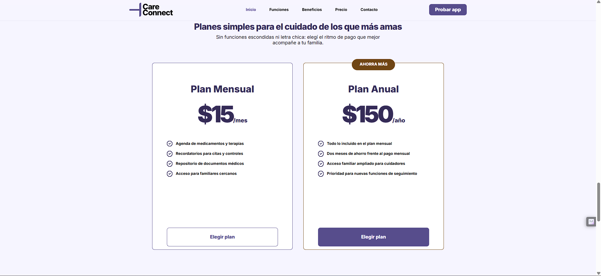
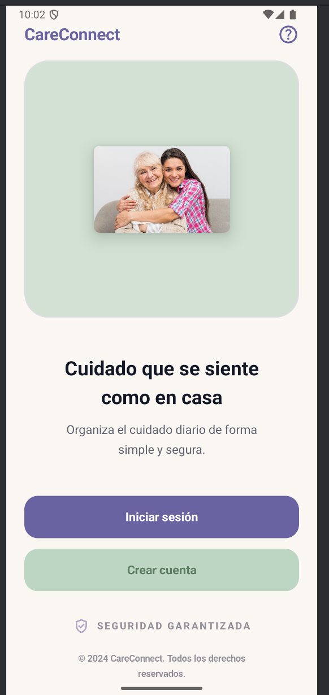
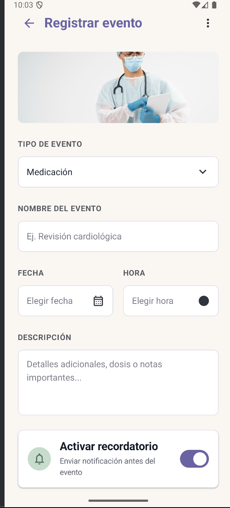
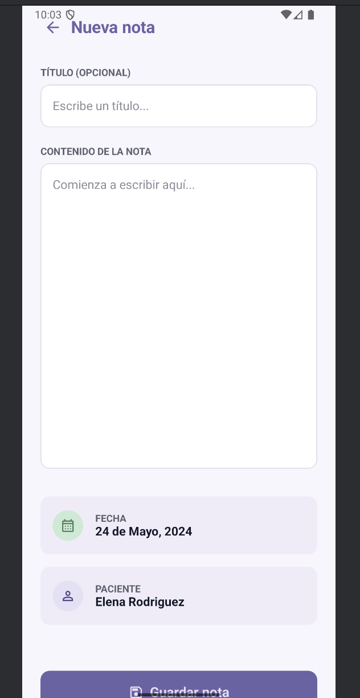
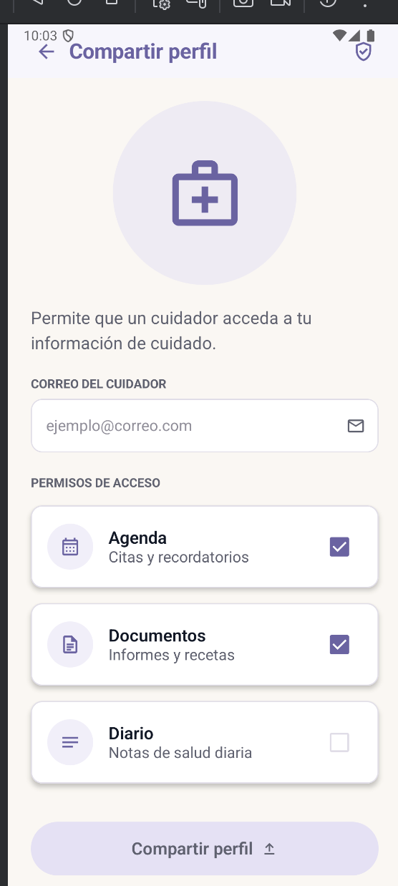
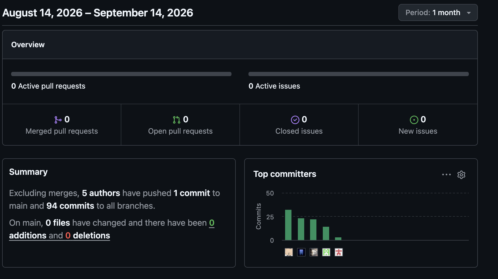
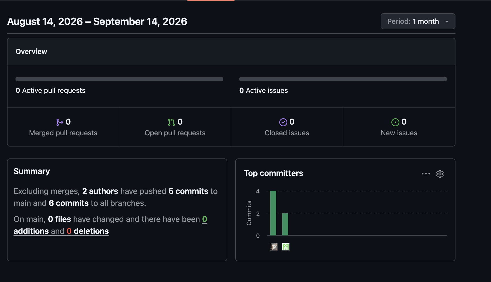
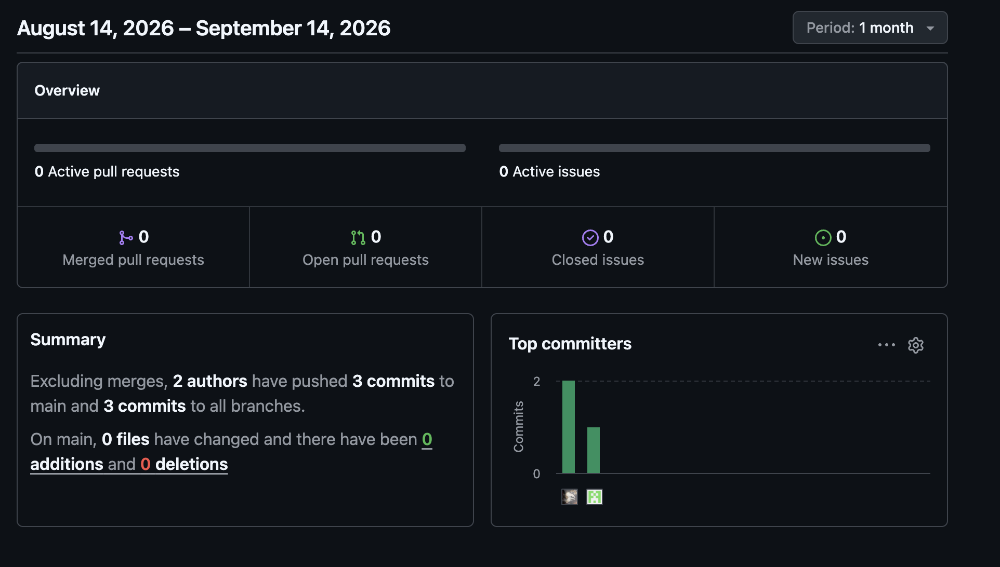
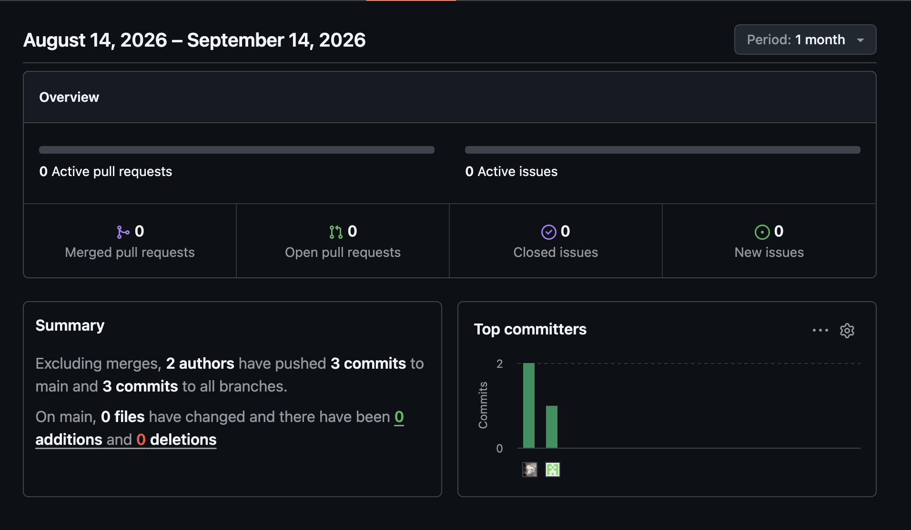

# Informe de Trabajo Final


<div align="center">


**Universidad Peruana de Ciencias Aplicadas (UPC)**

Carrera de Ingeniería de Software

Ciclo académico: **2026-20**

Curso: **1ASI0732 — Diseño de Experimentos de Ingeniería de Software**

NRC: **9100**

Profesor: **Sanchez Ponce, Alex Humberto**

**Informe de Trabajo Final**

Startup: **CareStacks**

Producto: **CareConnect**

</div>

**Relación de integrantes:**

| Código      | Apellidos y Nombres |
|-------------|---------------------|
| U202319698  | Salcedo Champi, Matias Rodolfo |
| U20221G099  | Nikaido Vargas, Javier Masaru |
| U202319563  | Muñiz Huayanca, Percy Alonso |
| U202415495  | Espinoza Cruz, Angela Milagros |
| U202319881  | Baldeon Armas, Santiago Armando |

**Septiembre 2026**

---

## Registro de Versiones del Informe


| Versión | Fecha (YYYY-MM-DD) | Autor | Descripción de modificación |
|---------|--------------------|-------|-----------------------------|
| 1.0     | \<fecha>           | \<Apellidos, Nombres> | \<descripción> |

---

## Project Report Collaboration Insights


- Repositorio del informe: \<url-repo-github>

---

## Tabla de Contenidos


- [Student Outcome](#student-outcome)
- [Part I: As-Is Software Project](#part-i-as-is-software-project)
  - [Capítulo I: Introducción](#capítulo-i-introducción)
    - [1.1. Startup Profile](#11-startup-profile)
      - [1.1.1. Descripción de la Startup](#111-descripción-de-la-startup)
      - [1.1.2. Perfiles de integrantes del equipo](#112-perfiles-de-integrantes-del-equipo)
    - [1.2. Solution Profile](#12-solution-profile)
      - [1.2.1. Antecedentes y problemática](#121-antecedentes-y-problemática)
      - [1.2.2. Lean UX Process](#122-lean-ux-process)
    - [1.3. Segmentos objetivo](#13-segmentos-objetivo)
  - [Capítulo II: Requirements Elicitation & Analysis](#capítulo-ii-requirements-elicitation--analysis)
    - [2.1. Competidores](#21-competidores)
    - [2.2. Entrevistas](#22-entrevistas)
    - [2.3. Needfinding](#23-needfinding)
    - [2.4. Ubiquitous Language](#24-ubiquitous-language)
  - [Capítulo III: Requirements Specification](#capítulo-iii-requirements-specification)
    - [3.1. To-Be Scenario Mapping](#31-to-be-scenario-mapping)
    - [3.2. User Stories](#32-user-stories)
    - [3.3. Product Backlog](#33-product-backlog)
    - [3.4. Impact Mapping](#34-impact-mapping)
  - [Capítulo IV: Product Design](#capítulo-iv-product-design)
    - [4.1. Style Guidelines](#41-style-guidelines)
    - [4.2. Information Architecture](#42-information-architecture)
    - [4.3. Landing Page UI Design](#43-landing-page-ui-design)
    - [4.4. Mobile Applications UX/UI Design](#44-mobile-applications-uxui-design)
    - [4.5. Mobile Applications Prototyping](#45-mobile-applications-prototyping)
    - [4.6. Web Applications UX/UI Design](#46-web-applications-uxui-design)
    - [4.7. Web Applications Prototyping](#47-web-applications-prototyping)
    - [4.8. Domain-Driven Software Architecture](#48-domain-driven-software-architecture)
    - [4.9. Software Object-Oriented Design](#49-software-object-oriented-design)
    - [4.10. Database Design](#410-database-design)
  - [Capítulo V: Product Implementation](#capítulo-v-product-implementation)
    - [5.1. Software Configuration Management](#51-software-configuration-management)
    - [5.2. Product Implementation & Deployment](#52-product-implementation--deployment)
    - [5.3. Video About-the-Product](#53-video-about-the-product)
- [Part II: Verification, Validation & Pipeline](#part-ii-verification-validation--pipeline)
  - [Capítulo VI: Product Verification & Validation](#capítulo-vi-product-verification--validation)
    - [6.1. Testing Suites & Validation](#61-testing-suites--validation)
    - [6.2. Static testing & Verification](#62-static-testing--verification)
    - [6.3. Validation Interviews](#63-validation-interviews)
    - [6.4. Auditoría de Experiencias de Usuario](#64-auditoría-de-experiencias-de-usuario)
  - [Capítulo VII: DevOps Practices](#capítulo-vii-devops-practices)
    - [7.1. Continuous Integration](#71-continuous-integration)
    - [7.2. Continuous Delivery](#72-continuous-delivery)
    - [7.3. Continuous deployment](#73-continuous-deployment)
    - [7.4. Continuous Monitoring](#74-continuous-monitoring)
- [Part III: Experiment-Driven Lifecycle](#part-iii-experiment-driven-lifecycle)
  - [Capítulo VIII: Experiment-Driven Development](#capítulo-viii-experiment-driven-development)
    - [8.1. Experiment Planning](#81-experiment-planning)
    - [8.2. Experiment Design](#82-experiment-design)
    - [8.3. Experimentation](#83-experimentation)
    - [8.4. Experiment Aftermath & Analysis](#84-experiment-aftermath--analysis)
    - [8.5. Continuous Learning](#85-continuous-learning)
    - [8.6. To-Be Software Platform Pre-launch](#86-to-be-software-platform-pre-launch)
- [Matriz de Evaluación Ética y de Impacto](#matriz-de-evaluación-ética-y-de-impacto)
- [Conclusiones](#conclusiones)
- [Bibliografía](#bibliografía)
- [Anexos](#anexos)

---

## Student Outcome


El curso contribuye al cumplimiento del Student Outcome ABET:

**ABET – EAC – Student Outcome 4**
**Criterio:** La capacidad de reconocer responsabilidades éticas y profesionales en situaciones de ingeniería y hacer juicios informados, que deben considerar el impacto de las soluciones de ingeniería en contextos globales, económicos, ambientales y sociales.

| Criterio específico | Acciones realizadas | Conclusiones |
|---------------------|---------------------|--------------|
| **4.c.1** Reconoce responsabilidad ética y profesional en situaciones de ingeniería de software | \<Apellidos, Nombres><br>AV1: \<acciones><br>TP: …<br>AV2: …<br>TB2: … | \<conclusiones grupales acumulables> |
| **4.c.2** Emite juicios informados considerando el impacto de las soluciones de ingeniería de software en contextos globales, económicos, ambientales y sociales | \<Apellidos, Nombres><br>AV1: \<acciones><br>TP: …<br>AV2: …<br>TB2: … | \<conclusiones grupales acumulables> |

---

# Part I: As-Is Software Project

## Capítulo I: Introducción

### 1.1. Startup Profile

#### 1.1.1. Descripción de la Startup

#### 1.1.2. Perfiles de integrantes del equipo

### 1.2. Solution Profile

#### 1.2.1. Antecedentes y problemática

#### 1.2.2. Lean UX Process

##### 1.2.2.1. Lean UX Problem Statements

##### 1.2.2.2. Lean UX Assumptions

##### 1.2.2.3. Lean UX Hypothesis Statements

##### 1.2.2.4. Lean UX Canvas

### 1.3. Segmentos objetivo

## Capítulo II: Requirements Elicitation & Analysis

### 2.1. Competidores

#### 2.1.1. Análisis competitivo

#### 2.1.2. Estrategias y tácticas frente a competidores

### 2.2. Entrevistas

#### 2.2.1. Diseño de entrevistas

#### 2.2.2. Registro de entrevistas

#### 2.2.3. Análisis de entrevistas

### 2.3. Needfinding

#### 2.3.1. User Personas

#### 2.3.2. User Task Matrix

#### 2.3.3. User Journey Mapping

#### 2.3.4. Empathy Mapping

#### 2.3.5. As-is Scenario Mapping

### 2.4. Ubiquitous Language

## Capítulo III: Requirements Specification

### 3.1. To-Be Scenario Mapping

### 3.2. User Stories

### 3.3. Product Backlog

### 3.4. Impact Mapping

## Capítulo IV: Product Design

### 4.1. Style Guidelines

#### 4.1.1. General Style Guidelines

#### 4.1.2. Web Style Guidelines

#### 4.1.3. Mobile Style Guidelines

##### 4.1.3.1. iOS Mobile Style Guidelines

##### 4.1.3.2. Android Mobile Style Guidelines

### 4.2. Information Architecture

#### 4.2.1. Organization Systems

#### 4.2.2. Labeling Systems

#### 4.2.3. SEO Tags and Meta Tags

#### 4.2.4. Searching Systems

#### 4.2.5. Navigation Systems

### 4.3. Landing Page UI Design

#### 4.3.1. Landing Page Wireframe

#### 4.3.2. Landing Page Mock-up

### 4.4. Mobile Applications UX/UI Design

#### 4.4.1. Mobile Applications Wireframes

#### 4.4.2. Mobile Applications Wireflow Diagrams

#### 4.4.3. Mobile Applications Mock-ups

#### 4.4.4. Mobile Applications User Flow Diagrams

### 4.5. Mobile Applications Prototyping

#### 4.5.1. Android Mobile Applications Prototyping

#### 4.5.2. iOS Mobile Applications Prototyping

### 4.6. Web Applications UX/UI Design

#### 4.6.1. Web Applications Wireframes

#### 4.6.2. Web Applications Wireflow Diagrams

#### 4.6.3. Web Applications Mock-ups

#### 4.6.4. Web Applications User Flow Diagrams

### 4.7. Web Applications Prototyping

### 4.8. Domain-Driven Software Architecture


#### 4.8.1. Software Architecture Context Diagram


#### 4.8.2. Software Architecture Container Diagrams


#### 4.8.3. Software Architecture Components Diagrams


### 4.9. Software Object-Oriented Design

#### 4.9.1. Class Diagrams


#### 4.9.2. Class Dictionary


### 4.10. Database Design


#### 4.10.1. Relational/Non-Relational Database Diagram


## Capítulo V: Product Implementation

### 5.1. Software Configuration Management

La gestión de configuración de software de **CareConnect** define las herramientas, convenciones y procedimientos utilizados para desarrollar, versionar, integrar y desplegar los productos que conforman la solución. Su propósito es mantener trazabilidad sobre los cambios, reducir diferencias entre los entornos de trabajo de los integrantes y asegurar que el código fuente, la documentación y las configuraciones puedan ser reproducidos durante el ciclo de vida del proyecto.

CareConnect se encuentra compuesto por diferentes productos de software que evolucionan de manera independiente:

- Project Report.
- Landing Page.
- Native Mobile Application.
- Backend RESTful API.
- Frontend Web Application requerida para 1ASI0732.

La solución actual mantiene repositorios separados para el informe, backend, aplicación móvil y Landing Page. La Frontend Web Application forma parte del alcance requerido por el curso, pero su repositorio y evidencia de despliegue deben incorporarse cuando su implementación sea confirmada.

---

#### 5.1.1. Software Development Environment Configuration

La configuración del entorno de desarrollo especifica las herramientas utilizadas por el equipo para la gestión del proyecto, diseño UX/UI, desarrollo, pruebas, despliegue y documentación.

La selección de herramientas busca mantener una separación clara entre cada producto de CareConnect y permitir que los integrantes reproduzcan localmente los entornos necesarios para trabajar sobre ellos.

##### Herramientas por actividad

| Actividad | Producto / herramienta | Propósito | Ruta o referencia |
|---|---|---|---|
| Project & Requirements Management | GitHub | Gestionar repositorios, ramas, Pull Requests, historial de cambios y colaboración. | Organización `CareStacks` |
| UX/UI Design | Figma | Elaborar wireframes, mockups y prototipos de interfaces. | Proyecto de diseño del equipo |
| Domain Modeling | Miro | Elaborar EventStorming, Context Mapping y Bounded Context Canvases. | Workspace del equipo |
| Software Architecture | Structurizr | Elaborar los diagramas C4 de Context, Container y Components. | Artefactos del Capítulo IV |
| Mobile Development | Android Studio | Desarrollar, ejecutar y depurar la aplicación Android. | Repositorio `CareStacks/FrontEnd` |
| Mobile Development | Kotlin | Lenguaje de programación de la aplicación Android. | `CareStacks/FrontEnd` |
| Mobile UI | Jetpack Compose | Construir la interfaz declarativa de la aplicación Android. | `CareStacks/FrontEnd` |
| Mobile Build | Gradle | Gestionar dependencias y compilación de Android. | `CareStacks/FrontEnd` |
| Backend Development | Java 21 | Lenguaje utilizado actualmente por el backend. | `CareStacks/BackEnd` |
| Backend Framework | Spring Boot | Implementar y exponer los servicios RESTful actuales. | `CareStacks/BackEnd` |
| Backend Build | Maven | Gestionar dependencias y construir el backend. | `CareStacks/BackEnd/pom.xml` |
| Persistence | Spring Data JPA / Hibernate | Gestionar el mapeo objeto-relacional del backend. | `CareStacks/BackEnd` |
| Relational Database | PostgreSQL | Persistir los datos estructurados de CareConnect. | Servicio PostgreSQL asociado al backend |
| Testing Database | H2 | Ejecutar escenarios de prueba que requieren una base en memoria. | Configuración de pruebas del backend |
| Local Mobile Storage | Room / SQLite | Mantener datos locales y soporte offline en Android. | `CareStacks/FrontEnd` |
| Document Storage | Supabase Storage | Almacenar de manera privada archivos médicos. | Configuración mediante variables de entorno del backend |
| API Documentation | OpenAPI / Swagger UI | Documentar y probar los endpoints REST. | `/v3/api-docs` y `/swagger-ui.html` |
| Notifications | Firebase Cloud Messaging | Entregar notificaciones push. | Proyecto Firebase de CareConnect |
| Mobile Distribution | Firebase App Distribution | Distribuir builds Android de prueba. | Proyecto Firebase de CareConnect |
| Email | SendGrid | Enviar correos electrónicos transaccionales. | Configuración privada del backend |
| Landing Page Development | React + Vite + TypeScript | Implementación actual de la Landing Page. | `CareStacks/Landing-Page` |
| Landing Page Deployment | Vercel | Publicar la Landing Page. | Proyecto Vercel vinculado al repositorio |
| Frontend Web Application | Flutter | Stack requerido por 1ASI0732 para la aplicación web funcional. | Pendiente de repositorio/implementación confirmada |
| Documentation | Markdown | Elaborar el informe principal del proyecto. | `CareStacks/Report/README.md` |

##### Configuración de la Native Mobile Application

La aplicación móvil de CareConnect utiliza actualmente el siguiente entorno:

```text
IDE: Android Studio
Language: Kotlin
UI Framework: Jetpack Compose
Build Tool: Gradle
Local Persistence: Room / SQLite
Push Notifications: Firebase Cloud Messaging
Distribution: Firebase App Distribution
```

Android Studio permite compilar el proyecto, ejecutar la aplicación mediante emuladores o dispositivos físicos, realizar debugging y generar builds para pruebas.

La persistencia local con Room/SQLite permite mantener determinados datos disponibles en el dispositivo y soportar escenarios donde la conectividad no sea constante.

##### Configuración del Backend RESTful API

El backend actual de CareConnect se implementa como una aplicación Spring Boot única organizada internamente mediante bounded contexts.

```text
Language: Java 21
Framework: Spring Boot
Build Tool: Maven
ORM: Spring Data JPA / Hibernate
Relational Database: PostgreSQL
Testing Database: H2
API Documentation: OpenAPI / Swagger UI
```

Su estructura principal sigue los bounded contexts definidos para el producto:

```text
src/main/java/com/carestacks/careconnect/
├── agenda/
├── consents/
├── diary/
├── documents/
├── iam/
├── notifications/
└── shared/
```

Cada módulo mantiene separación entre responsabilidades de dominio, aplicación, infraestructura e interfaces.

##### Variables de entorno del Backend

Las credenciales y configuraciones sensibles no deben almacenarse directamente en el repositorio.

La conexión con PostgreSQL se configura mediante variables del entorno de Spring, como:

```text
SPRING_DATASOURCE_URL
SPRING_DATASOURCE_DRIVER_CLASS_NAME
SPRING_DATASOURCE_USERNAME
SPRING_DATASOURCE_PASSWORD
```

La integración con Supabase Storage utiliza:

```text
SUPABASE_URL
SUPABASE_SERVICE_ROLE_KEY
SUPABASE_STORAGE_BUCKET
```

Los valores reales de estas variables deben mantenerse únicamente en los entornos autorizados y no deben incluirse en commits, documentación pública ni código cliente.

##### Configuración de la Landing Page

La Landing Page actualmente implementada utiliza:

```text
Framework: Flutter
UI Components: Flutter
Package Manager: flutter run
Communication: REST over HTTPS/JSON
```

El repositorio correspondiente es:

```text
https://github.com/CareStacks/Landing-Page
```

##### Configuración de la Frontend Web Application

El alcance de 1ASI0732 requiere una Frontend Web Application independiente de la Landing Page.

El stack establecido para esta aplicación es:

```text
Framework: Flutter
UI Components: Flutter
Package Manager: npm
Communication: REST over HTTPS/JSON
```

La aplicación deberá consumir los servicios expuestos por el backend y contar con un repositorio independiente. Mientras no exista evidencia de implementación, no debe documentarse como un producto ya desplegado.

##### Consideración sobre el stack del curso

El backend actualmente implementado utiliza **Java 21 y Spring Boot**. Sin embargo, el Final Project Statement de 1ASI0732 establece **ASP.NET Core y C#** para los Web Services.

De igual forma, la Landing Page existente utiliza React + Vite + TypeScript, mientras que el statement establece un stack específico para dicho producto.

Estas diferencias deben mantenerse explícitas en la documentación hasta que el equipo confirme con el docente si las implementaciones existentes pueden conservarse o si deben migrarse.

---

### 5.1.2. Source Code Management

Para la gestión del código fuente y de los artefactos de documentación de CareConnect, el equipo utiliza **Git** como sistema de control de versiones distribuido y **GitHub** como plataforma colaborativa para el alojamiento de repositorios, administración de ramas, revisión de cambios y trazabilidad del desarrollo.

El uso de control de versiones permite mantener un historial de modificaciones, identificar la contribución de cada integrante y controlar la integración progresiva del trabajo realizado durante los diferentes sprints y entregas del proyecto.

#### Repositorio del informe

El informe del proyecto se encuentra alojado en el siguiente repositorio de GitHub:

- **Repositorio:** CareStacks Report
- **Organización:** `upc-pre-202620-1asi0732-9100-carestacks`
- **URL:** https://github.com/upc-pre-202620-1asi0732-9100-carestacks/carestacks-report

El repositorio contiene la documentación correspondiente a los diferentes capítulos del informe y los recursos gráficos utilizados como evidencia de los artefactos desarrollados.

#### Estrategia de ramas

Para organizar el desarrollo del informe se utiliza una estrategia de ramas basada en una separación entre la versión estable, la versión de integración y las ramas de trabajo correspondientes a cada capítulo.

Las principales ramas son:

| Rama | Propósito |
|---|---|
| `main` | Contiene la versión estable y consolidada del informe correspondiente a las entregas oficiales. |
| `develop` | Rama de integración en la que se consolidan los cambios desarrollados antes de incorporarlos a `main`. |
| `chapter-1` | Desarrollo y actualización del Capítulo I. |
| `chapter-2` | Desarrollo y actualización del Capítulo II. |
| `chapter-3` | Desarrollo y actualización del Capítulo III. |
| `chapter-4` | Desarrollo y actualización del Capítulo IV. |
| `chapter-5` | Desarrollo y actualización del Capítulo V. |
| `chapter-6` | Desarrollo y actualización del Capítulo VI. |

El flujo de integración utilizado para el informe es el siguiente:

1. Cada capítulo es desarrollado en su respectiva rama `chapter-*`.
2. Los cambios realizados se registran mediante commits siguiendo la convención definida por el equipo.
3. Una vez concluida y revisada una sección, los cambios son integrados hacia `develop`.
4. La rama `develop` funciona como punto de integración y validación del informe.
5. Cuando el contenido correspondiente a una entrega se encuentra completo y revisado, se realiza la integración desde `develop` hacia `main`.
6. `main` mantiene únicamente versiones consideradas estables y listas para entrega.

El flujo general puede representarse de la siguiente manera:

`chapter-*` → `develop` → `main`

#### Convenciones para nombres de ramas

Las ramas utilizadas para el desarrollo del informe siguen la siguiente convención:

```text
chapter-<número>
#### 5.1.3. Source Code Style Guide & Conventions

Las convenciones de código permiten mantener consistencia entre los distintos productos y módulos de CareConnect.

Los identificadores técnicos deben escribirse en **inglés**, incluyendo clases, métodos, variables, endpoints, tablas y commits.

##### Convenciones generales

| Elemento | Convención | Ejemplo |
|---|---|---|
| Clases | PascalCase | `HealthEventService` |
| Interfaces | PascalCase | `AgendaRepository` |
| Métodos / funciones | camelCase | `confirmHealthEvent()` |
| Variables | camelCase | `patientId` |
| Constantes | UPPER_SNAKE_CASE | `MAX_LOGIN_ATTEMPTS` |
| Paquetes Java | lowercase | `com.carestacks.careconnect.agenda` |
| Componentes frontend | PascalCase | `NotificationCard` |
| Tablas | snake_case plural | `health_events` |
| Columnas | snake_case | `created_at` |
| Foreign Keys | `<entity>_id` | `patient_id` |

##### Organización del Backend

Los módulos del backend mantienen una estructura basada en:

```text
domain/
application/
infrastructure/
interfaces/
```

**Domain** contiene los conceptos y reglas propias del negocio, como entidades, Aggregate Roots, Value Objects, Domain Services, Domain Events y contratos de repositories.

**Application** coordina los casos de uso y la interacción con el dominio.

**Infrastructure** contiene detalles técnicos como persistencia, mappers, clientes de almacenamiento, adaptadores externos y configuraciones.

**Interfaces** contiene los puntos de entrada del sistema, principalmente REST Controllers.

##### Convenciones Java / Spring Boot

Ejemplo:

```java
public class HealthEventService {

    private static final int MAX_RETRIES = 3;

    public void confirmHealthEvent(UUID eventId) {
    }
}
```

Se aplican las siguientes reglas:

- Clases e interfaces en PascalCase.
- Métodos y variables en camelCase.
- Constantes en UPPER_SNAKE_CASE.
- Paquetes en minúsculas.
- Evitar reglas del dominio dentro de controllers.
- Utilizar mappers cuando se requiera separar dominio y persistencia.
- Mantener los bounded contexts desacoplados.

##### Convenciones Kotlin / Android

Ejemplo:

```kotlin
class AgendaViewModel : ViewModel() {

    fun confirmEvent(eventId: String) {
    }
}
```

Las principales convenciones son:

- Clases en PascalCase.
- Funciones y variables en camelCase.
- Constantes en UPPER_SNAKE_CASE.
- Paquetes en minúsculas.
- La UI no debe concentrar reglas de negocio.
- Los ViewModels deben administrar el estado de presentación.
- La comunicación con servicios y persistencia debe mantenerse separada de los composables.

##### Convenciones TypeScript / Frontend

Ejemplo:

```typescript
const API_BASE_URL = import.meta.env.VITE_API_BASE_URL;

function loadNotifications() {
}
```

Los componentes utilizan PascalCase y las funciones o variables camelCase.

Las configuraciones específicas de cada ambiente deben administrarse mediante variables de entorno y no mediante valores sensibles escritos directamente en el código.

##### Convenciones REST

Los endpoints deben utilizar sustantivos y aprovechar la semántica de HTTP.

| Acción | Método | Ejemplo |
|---|---|---|
| Consultar colección | GET | `/api/events` |
| Consultar recurso | GET | `/api/events/{id}` |
| Crear | POST | `/api/events` |
| Actualizar | PUT | `/api/events/{id}` |
| Actualizar parcialmente | PATCH | `/api/events/{id}` |
| Eliminar | DELETE | `/api/events/{id}` |

Los nombres de recursos deben ser consistentes y encontrarse en inglés.

##### Convenciones de Base de Datos

| Elemento | Convención | Ejemplo |
|---|---|---|
| Tabla | snake_case plural | `health_events` |
| Columna | snake_case | `scheduled_at` |
| Primary Key | `id` | `id` |
| Foreign Key | `<entity>_id` | `patient_id` |
| Timestamp de creación | `created_at` | `created_at` |
| Timestamp de modificación | `updated_at` | `updated_at` |

##### Convenciones Gherkin

Los escenarios de aceptación siguen la estructura Given / When / Then.

```gherkin
Feature: Health event confirmation

  Scenario: Patient confirms a scheduled event
    Given the patient has a pending health event
    When the patient confirms the event
    Then the event status is marked as confirmed
```

##### Buenas prácticas

- Mantener alta cohesión dentro de cada bounded context.
- Reducir dependencias innecesarias entre módulos.
- Mantener reglas del negocio fuera de componentes de presentación.
- No exponer información sensible mediante logs.
- No almacenar secretos en GitHub.
- Utilizar nombres descriptivos.
- Mantener documentación y código consistentes.
- Evitar duplicar reglas del dominio.
- Revisar cambios mediante Pull Requests antes de integrar cuando corresponda.

---
#### 5.1.4. Software Deployment Configuration

La configuración de despliegue de CareConnect define los mecanismos utilizados para construir, configurar y publicar los diferentes productos que forman parte de la solución. Debido a que cada componente posee características tecnológicas diferentes, el proceso de despliegue se documenta de manera independiente para la Landing Page, la Frontend Web Application, la Native Mobile Application y la RESTful API.

Para la presente entrega, no todos los productos cuentan todavía con un despliegue público en un ambiente de producción. Por ello, esta sección diferencia entre los componentes que poseen evidencia de despliegue verificable y aquellos cuya ejecución ha sido validada únicamente en un ambiente local.

---

##### Landing Page

La Landing Page de CareConnect está implementada utilizando **React, TypeScript y Vite** y se encuentra desplegada públicamente mediante **Vercel**.

- **Repositorio:** `https://github.com/CareStacks/Landing-Page`
- **URL de producción:** `https://landing-page-lovat-ten.vercel.app/`
- **Proveedor de despliegue:** Vercel
- **Build Tool:** Vite

El flujo de despliegue utilizado es:

```text
Cambios en el repositorio
          |
          v
     Push a GitHub
          |
          v
Vercel detecta los cambios
          |
          v
Instalación de dependencias
          |
          v
       Build Vite
          |
          v
Publicación de la nueva versión
          |
          v
      URL pública
```

Vercel se encuentra vinculado al repositorio de la Landing Page, permitiendo generar una nueva versión desplegada a partir de los cambios integrados en la rama configurada para producción.

La evidencia visual correspondiente al despliegue y funcionamiento de este producto se presenta posteriormente en la sección **5.2.2. Implemented Landing Page Evidence**.

---

##### Frontend Web Application

La Frontend Web Application de CareConnect dispone actualmente de una implementación web basada en Flutter, adaptada a diferentes resoluciones de pantalla.

Durante el desarrollo se validó satisfactoriamente la generación del artefacto web mediante:

```bash
flutter build web --release
```

Este comando genera la versión optimizada para producción dentro del directorio:

```text
build/web/
```

El flujo de construcción utilizado actualmente es:

```text
Código fuente Flutter
        |
        v
flutter analyze
        |
        v
Ejecución de tests
        |
        v
flutter build web --release
        |
        v
Artefacto build/web
```

En la presente entrega, la aplicación web ha sido validada en un entorno local y cuenta con un build de producción exitoso. Sin embargo, todavía no se documenta una URL pública de producción para este producto.

Una vez definido el proveedor de hosting, el proceso de despliegue deberá incorporar:

```text
Push al repositorio
        |
        v
Integración de cambios
        |
        v
Análisis y pruebas
        |
        v
Build de producción
        |
        v
Publicación del artefacto web
        |
        v
Smoke Test
        |
        v
URL pública
```

La configuración deberá incluir, como mínimo:

- repositorio utilizado;
- rama de producción;
- proveedor de hosting;
- URL pública;
- configuración de la API Base URL;
- variables de entorno requeridas;
- evidencia del build;
- evidencia del despliegue.

> **Nota:** El stack definitivo de la Frontend Web Application debe mantenerse consistente con lo especificado en las demás secciones del informe y con las disposiciones tecnológicas establecidas para el curso.

---

##### RESTful API

La RESTful API de CareConnect está implementada utilizando **Java y Spring Boot** y organiza la lógica del producto mediante seis bounded contexts:

- IAM;
- Agenda;
- Notifications;
- Diary Tracking;
- Documents;
- Consent Management.

Para la presente entrega, la evidencia incluida en la sección correspondiente a la implementación de la RESTful API se basa principalmente en una ejecución local del backend.

En el ambiente de desarrollo, el backend puede ser construido mediante Maven:

```bash
./mvnw clean package
```

y ejecutado mediante:

```bash
./mvnw spring-boot:run
```

El proceso actual de ejecución es:

```text
Código fuente
      |
      v
Maven Build
      |
      v
Spring Boot Application
      |
      v
Inicialización de persistencia
      |
      v
RESTful API
      |
      v
Swagger / OpenAPI
```

Para desarrollo y pruebas locales se utiliza una base de datos **H2 en memoria con compatibilidad PostgreSQL**, permitiendo ejecutar y validar el backend sin depender de infraestructura externa.

La documentación interactiva de la API se encuentra disponible durante la ejecución mediante:

```text
/swagger-ui.html
```

y la especificación OpenAPI mediante:

```text
/v3/api-docs
```

Actualmente, el informe no presenta evidencia suficiente de una URL pública de producción de la RESTful API. Por ello, el deployment del backend deberá completarse antes de ser presentado como un servicio desplegado en producción.

---

##### Configuración objetivo de la RESTful API

Para el ambiente de producción, el backend deberá utilizar una base de datos PostgreSQL y administrar sus credenciales mediante variables de entorno.

Las variables requeridas para la configuración de persistencia son:

```text
SPRING_DATASOURCE_URL
SPRING_DATASOURCE_USERNAME
SPRING_DATASOURCE_PASSWORD
```

El flujo objetivo de despliegue es:

```text
Push al repositorio
       |
       v
Proveedor de hosting
       |
       v
Maven Build
       |
       v
Spring Boot
       |
       v
Variables de entorno
       |
       v
PostgreSQL
       |
       v
RESTful API pública
```

Una vez implementado el despliegue, esta sección deberá actualizarse incluyendo:

- proveedor utilizado;
- URL pública del backend;
- rama desplegada;
- evidencia del deployment;
- URL pública de Swagger/OpenAPI;
- variables de entorno utilizadas, sin revelar secretos;
- evidencia de conexión con PostgreSQL.

---

##### PostgreSQL

PostgreSQL constituye la tecnología definida para la persistencia relacional de CareConnect en un ambiente desplegado.

La configuración de producción debe mantener de forma privada las credenciales necesarias para establecer la conexión con la base de datos.

Se deben considerar las siguientes medidas:

- almacenamiento seguro de credenciales;
- conexiones cifradas cuando el proveedor lo permita;
- separación de credenciales por ambiente;
- restricción del acceso directo a la base de datos;
- respaldo de información;
- control de cambios del esquema;
- exclusión de credenciales del repositorio Git.

Durante el desarrollo local, la aplicación puede utilizar H2 para facilitar las pruebas. Esto no reemplaza la configuración PostgreSQL definida para un ambiente de producción.

---

##### Supabase Storage

CareConnect contempla el uso de **Supabase Storage** para el almacenamiento de archivos médicos.

La arquitectura evita almacenar archivos médicos directamente como datos binarios dentro de PostgreSQL. En su lugar, la base de datos conserva la metadata y las referencias necesarias para identificar los archivos almacenados externamente.

El flujo definido es:

```text
Aplicación cliente
       |
       v
RESTful API
       |
       v
Supabase Storage
```

Las variables de configuración asociadas son:

```text
SUPABASE_URL
SUPABASE_SERVICE_ROLE_KEY
SUPABASE_STORAGE_BUCKET
```

La variable:

```text
SUPABASE_SERVICE_ROLE_KEY
```

debe permanecer exclusivamente en el backend y no debe incorporarse en la Landing Page, Frontend Web Application o Native Mobile Application.

---

##### Native Mobile Application

La aplicación móvil Android de CareConnect utiliza un proceso de construcción mediante Gradle.

El flujo general es:

```text
Código fuente Kotlin
       |
       v
Gradle Build
       |
       v
Generación del APK
       |
       v
Instalación en dispositivo/emulador
       |
       v
Pruebas funcionales
```

Para la distribución de versiones de prueba se contempla **Firebase App Distribution**, permitiendo proporcionar builds controlados a testers sin requerir una publicación inmediata en Google Play Store.

El flujo correspondiente es:

```text
Código fuente
      |
      v
Gradle Build
      |
      v
APK
      |
      v
Firebase App Distribution
      |
      v
Testers autorizados
```

Cuando se realice una distribución mediante Firebase App Distribution, el informe deberá incluir evidencia verificable del build publicado y de los testers asociados.

---

##### Firebase Cloud Messaging

CareConnect contempla **Firebase Cloud Messaging (FCM)** como servicio para la entrega de notificaciones push.

El flujo esperado es:

```text
CareConnect Backend
       |
       v
Firebase Cloud Messaging
       |
       v
Dispositivo del usuario
```

Las credenciales utilizadas para comunicarse con Firebase deben mantenerse en el backend y no deben exponerse en los clientes.

---

##### SendGrid

SendGrid se utiliza como servicio externo previsto para el envío de correos electrónicos transaccionales.

El acceso al servicio debe configurarse mediante variables de entorno y las claves privadas correspondientes no deben almacenarse dentro del repositorio.

---

##### Gestión de variables de entorno

Los datos sensibles y configuraciones que dependen del ambiente no deben almacenarse directamente en el código fuente.

Entre ellos se encuentran:

```text
DATABASE_URL
DATABASE_USERNAME
DATABASE_PASSWORD
SUPABASE_URL
SUPABASE_SERVICE_ROLE_KEY
SUPABASE_STORAGE_BUCKET
API_BASE_URL
FIREBASE_CREDENTIALS
SENDGRID_API_KEY
```

Los nombres definitivos de las variables deben corresponder con la configuración real implementada por cada producto.

Los secretos deben mantenerse fuera del repositorio Git y configurarse utilizando los mecanismos proporcionados por cada proveedor de hosting.

---

##### Entornos de despliegue

CareConnect distingue los siguientes entornos:

| Entorno | Propósito |
|---|---|
| Development | Desarrollo y ejecución local realizada por los integrantes del equipo. |
| Testing | Ejecución de pruebas funcionales y técnicas antes de integrar los cambios. |
| Staging | Ambiente previo a producción destinado a validación integral cuando sea configurado. |
| Production | Ambiente público y estable destinado a las versiones de entrega. |

Cada entorno debe poseer su propia configuración y evitar compartir credenciales sensibles cuando no sea necesario.

---

##### Estado actual del despliegue

El estado de despliegue de los productos de CareConnect para la presente entrega es el siguiente:

| Producto | Build / Ejecución | Deployment público | Evidencia actual |
|---|---|---|---|
| Landing Page | Completado | Sí | Vercel + URL pública + capturas |
| Frontend Web Application | Build de producción completado | Pendiente | Ejecución local + capturas |
| RESTful API | Ejecución local completada | Pendiente de evidencia pública | Swagger/OpenAPI local + capturas |
| Native Mobile Application | Build y ejecución en dispositivo/emulador | Pendiente de evidencia de distribución | Prototipo y capturas |
| PostgreSQL | Definido para producción | Pendiente de integración pública demostrada | Diseño y configuración documentados |
| Supabase Storage | Configuración contemplada | Pendiente de evidencia completa | Arquitectura documentada |
| Firebase Cloud Messaging | Configuración contemplada | Pendiente de evidencia completa | Arquitectura documentada |

Esta tabla deberá actualizarse conforme se obtengan evidencias verificables de los despliegues restantes.

---

##### Criterios de validación del despliegue

Antes de considerar un producto como correctamente desplegado se verifican los siguientes criterios:

| Criterio | Validación esperada |
|---|---|
| Build exitoso | El producto se construye sin errores. |
| URL accesible | El servicio o aplicación puede accederse desde un entorno externo cuando corresponde. |
| RESTful API disponible | Los endpoints responden correctamente. |
| Swagger/OpenAPI disponible | La documentación de la API puede consultarse. |
| Persistencia disponible | Las operaciones de lectura y escritura funcionan correctamente. |
| Aplicación móvil funcional | El build se instala y ejecuta correctamente. |
| Landing Page disponible | La URL pública carga correctamente. |
| Variables protegidas | No existen secretos expuestos en el código fuente ni en el repositorio. |
| Integraciones externas | Los servicios externos configurados responden correctamente. |

---

##### Seguridad de la configuración

Las credenciales utilizadas durante el despliegue no deben almacenarse directamente dentro del repositorio.

Se deben aplicar las siguientes prácticas:

- utilizar variables de entorno;
- excluir archivos locales con secretos mediante `.gitignore`;
- no incluir API Keys en capturas del informe;
- no exponer credenciales administrativas en aplicaciones cliente;
- utilizar diferentes configuraciones para desarrollo y producción;
- limitar el acceso a las credenciales únicamente a los integrantes autorizados.

La configuración de despliegue deberá mantenerse actualizada durante el desarrollo del proyecto. Un producto solo será identificado como desplegado cuando exista evidencia verificable de su publicación y funcionamiento en el ambiente correspondiente.


### 5.2. Product Implementation & Deployment

### 5.2.1. Sprint Backlogs


#### Sprint 1

Durante el Sprint 1, el equipo se dividió el trabajo por capítulos: documentación de fundamentos del producto (Capítulo I), investigación de usuario y competencia (Capítulo II), especificación de requisitos (Capítulo III), arquitectura y diseño visual (Capítulo IV) y las primeras evidencias de implementación (Capítulo V), reutilizando como base el proyecto CareConnect del ciclo anterior.

| Sprint | Sección del Reporte | Título | Tarea técnica asociada | Description | Estimation (SP) | Assigned To | Status |
|---|---|---|---|---|---|---|---|
| 1 | Cap. I completo | Startup Profile, problemática, Lean UX, segmentos objetivo | Redactar descripción de la startup, perfiles de equipo, problem statement, Lean UX Assumptions/Hypothesis/Canvas y segmentos objetivo | Completar el Capítulo I: Introducción. | 8 | Espinoza Cruz, Angela Milagros | Done |
| 1 | 2.1 | Análisis competitivo | Investigar competidores, landscape, estrategias y tácticas | Completar el análisis competitivo con tabla comparativa y logos. | 5 | Espinoza Cruz, Angela Milagros | Done |
| 1 | 2.2 – 2.4 | Entrevistas, Needfinding y Ubiquitous Language | Diseñar y registrar entrevistas, elaborar User Personas, Journey Maps, Empathy Maps y glosario ubicuo | Completar el Capítulo II: Requirements Elicitation & Analysis. | 8 | Espinoza Cruz, Angela Milagros | Done |
| 1 | Cap. III completo | Requirements Specification | Redactar To-Be Scenario Mapping, User Stories, Product Backlog e Impact Mapping | Completar el Capítulo III. | 8 | Salcedo Champi, Matias Rodolfo | Done |
| 1 | Avance Conclusiones/Bibliografía/Anexos | — | Redactar avance preliminar de cierre del informe | Iniciar borrador de conclusiones, bibliografía y anexos. | 2 | Salcedo Champi, Matias Rodolfo | Done |
| 1 | 4.1 – 4.3 | Style Guidelines, Information Architecture, Landing Page UI Design | Definir guías de estilo (general, web, mobile), arquitectura de información y diseño del landing page | Completar las secciones iniciales del Capítulo IV. | 8 | Baldeon Armas, Santiago Armando | Done |
| 1 | 4.4 | Mobile Applications UX/UI Design | Elaborar wireframes, wireflow diagrams, mock-ups y user flow diagrams de la app móvil | Completar el diseño UX/UI de la aplicación móvil (base para el prototipado Kotlin/Flutter). | 5 | Baldeon Armas, Santiago Armando | Done |
| 1 | 4.8 – 4.10 | Domain-Driven Software Architecture, OO Design, Database Design | Documentar diagramas de contexto, contenedores y componentes; diagrama y diccionario de clases; diagrama de base de datos | Completar la arquitectura técnica del Capítulo IV. | 8 | Nikaido Vargas, Javier Masaru | Done |
| 1 | 5.1 | Software Configuration Management | Documentar entorno de desarrollo, gestión de código fuente, convenciones y configuración de despliegue | Completar la sección 5.1 del Capítulo V. | 5 | Nikaido Vargas, Javier Masaru | Done |
| 1 | 5.2.2 | Implemented Landing Page Evidence | Documentar evidencia de implementación del Landing Page | Completar con capturas del landing desplegado. | 2 | Nikaido Vargas, Javier Masaru | Done |
| 1 | 4.5 | Mobile Applications Prototyping (Android + iOS) | Registrar cuentas de prueba, conectar Flutter (cuidador) al backend local, capturar 8 pantallas en iOS; preparar app Kotlin (paciente) para Android | Completar 4.5.1 y 4.5.2 con capturas y video del prototipo. | 8 | Muñiz Huayanca, Percy Alonso | Done |
| 1 | 4.6 – 4.7 | Web Applications UX/UI Design y Prototyping | Adaptar la base Flutter del cuidador a un layout web (breakpoints, sidebar, jerarquía visual) como referencia para el diseño Figma | Completar el diseño y prototipado de la aplicación web. | 8 | Muñiz Huayanca, Percy Alonso | Done |

**Total comprometido:** 75 Story Points.

**Sprint Goal:** Completar la documentación base del informe (Capítulos I al III), la arquitectura y diseño visual del producto (Capítulo IV) y las primeras evidencias de implementación (Landing Page, Software Configuration Management y Mobile Prototyping), reutilizando como punto de partida el proyecto CareConnect del ciclo anterior.

#### 5.2.2. Implemented Landing Page Evidence

La Landing Page de **CareConnect** fue implementada utilizando **React, TypeScript y Vite** y se encuentra desplegada mediante **Vercel**.

**Repositorio:** `https://github.com/CareStacks/Landing-Page`  
**Landing Page:** `https://landing-page-lovat-ten.vercel.app/`

##### Deployment Evidence


*Figura X. Evidencia del despliegue de la Landing Page de CareConnect.*

---

##### Home and Problem Section


*Figura X. Home y presentación de la problemática de CareConnect.*

---

##### Features Section


*Figura X. Funcionalidades principales presentadas en la Landing Page.*

---

##### Product, Benefits and How It Works


*Figura X. Presentación del producto, beneficios y funcionamiento de CareConnect.*

---

##### Plans, Contact and Footer



*Figura X. Planes, llamada a la acción y footer de la Landing Page.*
### 5.2.3. Implemented Frontend-Web Application Evidence

**Cambios de implementación:**

- **Sistema de layout responsive** (`core/layout/care_breakpoints.dart`): tres anchos de referencia resueltos con `MediaQuery`, sin paquetes externos — bottom nav y columna única por debajo de 768px, sidebar en riel de íconos entre 768–1279px, sidebar con etiquetas y panel de detalle desde 1280px.
- **Shell compartido** (`core/widgets/care_app_shell.dart`): sidebar fijo, cabecera fija, panel de detalle a la derecha en escritorio; barra superior y bottom nav en angosto.
- **Jerarquía visual en 4 niveles**: `CareCard` ahora tiene variantes *hero*, *standard*, *quiet* y *flat*, reemplazando el uso repetido de una sola tarjeta con el mismo radio y sombra.
- **Pantallas rediseñadas**: Inicio (grilla con hero del próximo evento, cifras del día y panel de paciente/invitaciones/actividad), Agenda (semana completa en 7 columnas con detalle lateral), Documentos (tabla con filtros y panel de detalle en vez de tarjetas apiladas), Diario (grilla de notas con editor fijo lateral), Perfil (dos columnas) y Login (rediseñado por ser la primera pantalla del producto).
- **Tipografía**: Inter cargada por `<link>` en `web/index.html`, con la stack del sistema como respaldo; cifras de horas y métricas con `FontFeature.tabularFigures`.
- **Paleta de colores**: sin modificaciones respecto a `app_colors.dart` — verificado que no existen literales `Color(0x...)` fuera de ese archivo.
- La capa de datos (`lib/features/*/data/`) no fue modificada; solo se trabajó sobre `presentation/`.

**Verificación:** análisis estático limpio, 27 tests de widget que montan las cinco pantallas principales y el panel de notificaciones en cuatro anchos distintos (detectando y corrigiendo 5 desbordes reales de layout), y build de producción (`flutter build web --release`) exitoso.

A continuación, evidencia de la aplicación web corriendo localmente contra el backend de CareConnect API, con datos de prueba reales (paciente vinculado a cuidador vía el módulo de Gestión de Consentimiento).

| Pantalla | Captura |
|---|---|
| Perfil |  |
| Inicio de sesión |  |
| Registro |  |
| Home (Cuidador) |  |
| Agenda |  |
| Diario |  |
| Documentos |  |
| Notificaciones |  |

### 5.2.4. Implemented Native-Mobile Application Evidence

La evidencia nativa móvil de CareStacks cubre ambos segmentos objetivo y ambas plataformas: **iOS**, con la aplicación Flutter del segmento cuidador (compartida con la versión web, §5.2.3), y **Android**, con la aplicación nativa Kotlin + Jetpack Compose del segmento paciente. Las capturas se tomaron con el backend local (CareConnect API) conectado y datos de prueba reales (un paciente vinculado a un cuidador mediante el módulo de Gestión de Consentimiento).

**iOS — Segmento Cuidador (Flutter)**

| Pantalla | Captura |
|---|---|
| Perfil |  |
| Inicio de sesión |  |
| Registro |  |
| Home (Cuidador) |  |
| Agenda |  |
| Diario |  |
| Documentos |  |
| Notificaciones |  |

**Video del prototipo (iOS):** [Ver video](https://youtu.be/050WhJadiuY)

**Android — Segmento Paciente (Kotlin + Jetpack Compose)**

| Pantalla | Captura |
|---|---|
| Perfil |  |
| Inicio / Bienvenida |  |
| Inicio de sesión |  |
| Registro |  |
| Home (Paciente) |  |
| Agenda |  |
| Agregar evento de agenda |  |
| Diario |  |
| Agregar nota de diario |  |
| Documentos |  |
| Notificaciones |  |
| Gestionar accesos |  |

**Video del prototipo (Android):** [Ver video](https://upcedupe-my.sharepoint.com/:v:/g/personal/u202319563_upc_edu_pe/IQCxyxzTeImsTaBVopDNXHyUAdGQYZnmlXXGn62jhU8cayU?nav=eyJyZWZlcnJhbEluZm8iOnsicmVmZXJyYWxBcHAiOiJPbmVEcml2ZUZvckJ1c2luZXNzIiwicmVmZXJyYWxBcHBQbGF0Zm9ybSI6IldlYiIsInJlZmVycmFsTW9kZSI6InZpZXciLCJyZWZlcnJhbFZpZXciOiJNeUZpbGVzTGlua0NvcHkifX0&e=noqJKl)

### 5.2.5. Implemented RESTful API and/or Serverless Backend Evidence

El backend de CareStacks se implementó con **Spring Boot 4 + Java 25**, reutilizando como base la arquitectura del proyecto anterior (CareConnect), organizado en seis bounded contexts: IAM, Agenda, Notificaciones, Diario, Documentos y Gestión de Consentimiento. Para desarrollo local se utiliza una base de datos **H2 en memoria** (modo compatibilidad PostgreSQL), lo que permite levantar el backend sin dependencias externas.

El backend fue ejecutado y validado localmente, confirmando el correcto arranque del servidor Tomcat embebido, la inicialización de los repositorios JPA y la exposición de la documentación interactiva vía Swagger/OpenAPI, cubriendo todos los endpoints implementados en los seis bounded contexts.

### 5.2.6. RESTful API documentation

La documentación de la API se generó automáticamente mediante **SpringDoc OpenAPI**, disponible en `/swagger-ui.html`. A continuación se detallan los endpoints expuestos por cada bounded context del sistema, así como los esquemas (DTOs y requests) que estructuran los datos intercambiados.


*Figura X. Endpoints del módulo Gestión de Consentimiento (`/api/consents`) y Documents (`/api/documents`): compartir perfil, actualizar vistas visibles, validar acceso, y gestión de documentos médicos.*


*Figura X. Endpoints del módulo Diary (`/api/diary`) y Notifications (`/api/notifications`): entradas de diario, recordatorios, alertas y preferencias de notificación.*


*Figura X. Endpoints del módulo IAM (`/api/auth`): registro, login, logout, validación de sesión y consulta de usuario actual.*


*Figura X. Endpoints del módulo Agenda (`/api/agenda`): creación, consulta, reprogramación, confirmación y cancelación de eventos de salud.*


*Figura X. Esquemas de datos documentados automáticamente por SpringDoc: DTOs y requests de los módulos Notifications, Diary, Consents y Agenda.*


*Figura X. Esquemas de datos documentados automáticamente por SpringDoc: DTOs y requests de los módulos Documents, Diary, Consents, IAM y Agenda.*

### 5.2.7. Team Collaboration Insights

Esta sección presenta la evidencia de colaboración del equipo a lo largo de los cuatro repositorios que conforman la solución de CareStacks: el informe del proyecto, el backend, la aplicación móvil y la aplicación web. Los gráficos de contribuciones (GitHub Insights → Contributors) muestran la participación de cada integrante mediante commits realizados durante el sprint.

#### Repositorio del Informe (`carestacks-report`)



*Figura X. Gráfico de contribuciones del repositorio `carestacks-report`, mostrando los commits de cada integrante del equipo durante la elaboración del informe.*

#### Repositorio del Backend (`carestacks-backend-api`)



*Figura X. Gráfico de contribuciones del repositorio `carestacks-backend-api`, correspondiente al trabajo de implementación y configuración del backend RESTful.*

#### Repositorio de la Aplicación Móvil (`carestacks-mobile-app`)



*Figura X. Gráfico de contribuciones del repositorio `carestacks-mobile-app`, correspondiente al trabajo sobre la aplicación Flutter del segmento cuidador.*

#### Repositorio de la Aplicación Web (`carestacks-web`)



*Figura X. Gráfico de contribuciones del repositorio `carestacks-web`, correspondiente a la adaptación de la base Flutter al segmento cuidador para escritorio.*

#### Interpretación

La distribución de commits entre los cuatro repositorios refleja la división de trabajo definida en el Sprint Backlog (§5.2.1): mientras el repositorio del informe concentra la participación distribuida de los cinco integrantes según la sección del reporte a su cargo, los repositorios de backend, móvil y web muestran una concentración de commits en los integrantes directamente responsables de esas capas de implementación durante este sprint, consistente con la asignación de tareas técnicas del equipo.

### 5.3. Video About-the-Product

---

# Part II: Verification, Validation & Pipeline

## Capítulo VI: Product Verification & Validation

### 6.1. Testing Suites & Validation

#### 6.1.1. Core Entities Unit Tests

#### 6.1.2. Core Integration Tests

#### 6.1.3. Core Behavior-Driven Development

#### 6.1.4. Core System Tests

### 6.2. Static testing & Verification

#### 6.2.1. Static Code Analysis

##### 6.2.1.1. Coding standard & Code conventions

##### 6.2.1.2. Code Quality & Code Security

#### 6.2.2. Reviews

### 6.3. Validation Interviews

#### 6.3.1. Diseño de Entrevistas

#### 6.3.2. Registro de Entrevistas

#### 6.3.3. Evaluaciones según heurísticas

### 6.4. Auditoría de Experiencias de Usuario

#### 6.4.1. Auditoría realizada

##### 6.4.1.1. Información del grupo auditado

##### 6.4.1.2. Cronograma de auditoría realizada

##### 6.4.1.3. Contenido de auditoría realizada

#### 6.4.2. Auditoría recibida

##### 6.4.2.1. Información del grupo auditor

##### 6.4.2.2. Cronograma de auditoría recibida

##### 6.4.2.3. Contenido de auditoría recibida

##### 6.4.2.4. Resumen de modificaciones para subsanar hallazgos

## Capítulo VII: DevOps Practices

### 7.1. Continuous Integration

#### 7.1.1. Tools and Practices

#### 7.1.2. Build & Test Suite Pipeline Components

### 7.2. Continuous Delivery

#### 7.2.1. Tools and Practices

#### 7.2.2. Stages Deployment Pipeline Components

### 7.3. Continuous deployment

#### 7.3.1. Tools and Practices

#### 7.3.2. Production Deployment Pipeline Components

### 7.4. Continuous Monitoring

#### 7.4.1. Tools and Practices

#### 7.4.2. Monitoring Pipeline Components

#### 7.4.3. Alerting Pipeline Components

#### 7.4.4. Notification Pipeline Components

---

# Part III: Experiment-Driven Lifecycle

## Capítulo VIII: Experiment-Driven Development

### 8.1. Experiment Planning

#### 8.1.1. As-Is Summary

#### 8.1.2. Raw Material: Assumptions, Knowledge Gaps, Ideas, Claims

#### 8.1.3. Experiment-Ready Questions

#### 8.1.4. Question Backlog

#### 8.1.5. Experiment Cards

### 8.2. Experiment Design

#### 8.2.1. Hypotheses

#### 8.2.2. Domain Business Metrics

#### 8.2.3. Measures

#### 8.2.4. Conditions

#### 8.2.5. Scale Calculations and Decisions

#### 8.2.6. Methods Selection

#### 8.2.7. Data Analytics: Goals, KPIs and Metrics Selection

#### 8.2.8. Web and Mobile Tracking Plan

### 8.3. Experimentation

#### 8.3.1. To-Be User Stories

#### 8.3.2. To-Be Product Backlog

#### 8.3.3. Pipeline-supported, Experiment-Driven To-Be Software Platform Lifecycle

##### 8.3.3.1. To-Be Sprint Backlogs

##### 8.3.3.2. Implemented To-Be Landing Page Evidence

##### 8.3.3.3. Implemented To-Be Frontend-Web Application Evidence

##### 8.3.3.4. Implemented To-Be Native-Mobile Application Evidence

##### 8.3.3.5. Implemented To-Be RESTful API and/or Serverless Backend Evidence

##### 8.3.3.6. Team Collaboration Insights

#### 8.3.4. To-Be Validation Interviews

##### 8.3.4.1. Diseño de Entrevistas

##### 8.3.4.2. Registro de Entrevistas

### 8.4. Experiment Aftermath & Analysis

#### 8.4.1. Analysis and Interpretation of Results

#### 8.4.2. Re-scored and Re-prioritized Question Backlog

### 8.5. Continuous Learning

#### 8.5.1. Shareback Session Artifacts: Learning Workflow

### 8.6. To-Be Software Platform Pre-launch

#### 8.6.1. About-the-Product Intro Video

#### 8.6.2. Resumen usando Gees Framework

---

## Matriz de Evaluación Ética y de Impacto

| Dimensión / Criterio | Identificación de Riesgos e Impactos | Evaluación del Impacto (¿a quién y magnitud?) | Estrategias de Mitigación y Acciones de Diseño |
|----------------------|--------------------------------------|-----------------------------------------------|------------------------------------------------|
| 1. Salud Pública y Seguridad | \<...> | \<...> | \<...> |
| 2. Inclusión y Accesibilidad | \<...> | \<...> | \<...> |
| 3. Impacto Social y Cultural | \<...> | \<...> | \<...> |
| 4. Impacto Económico | \<...> | \<...> | \<...> |
| 5. Impacto Ambiental | \<...> | \<...> | \<...> |
| 6. Enfoque Global | \<...> | \<...> | \<...> |
| 7. Revelación de Peligros y Responsabilidad | \<...> | \<...> | \<...> |

---

## Conclusiones

### Conclusiones y recomendaciones

### Video App Validation

### Video About-the-Team

---

## Bibliografía

---

## Anexos

### Anexo: Videos de Exposiciones
| Entrega | Título | Enlace (Microsoft Stream) |
|---------|--------|---------------------------|
| \<AV1/TP/AV2/TB2> | \<título> | \<url> |
