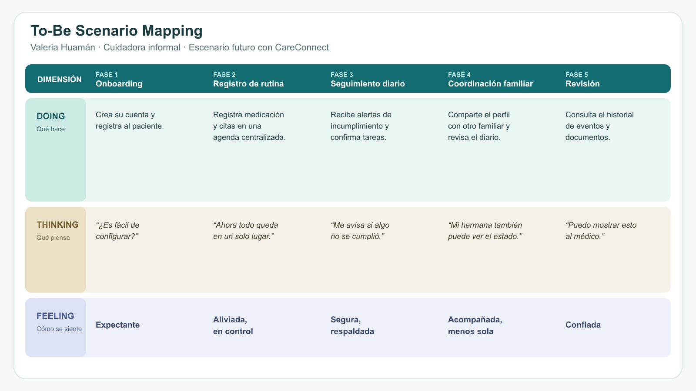
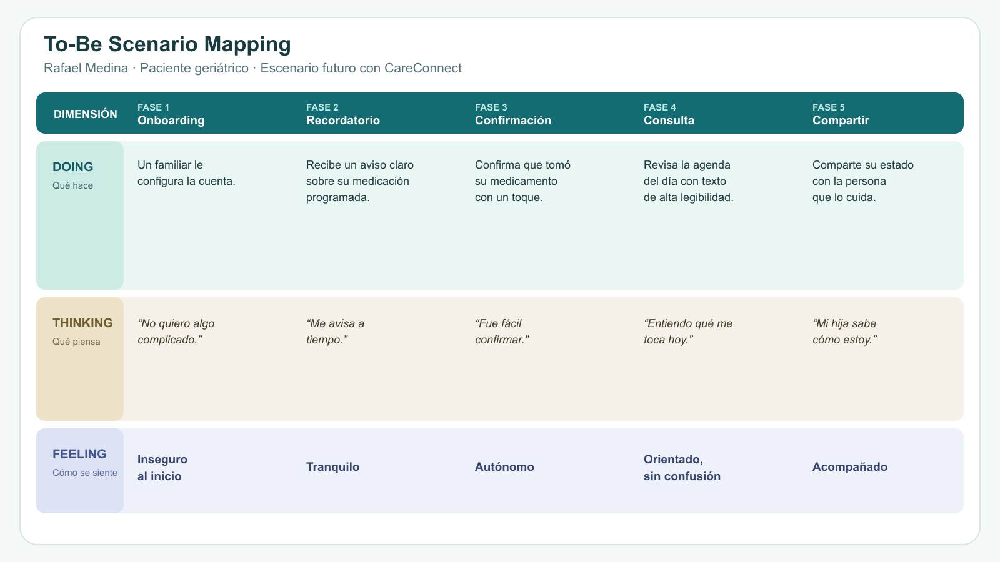
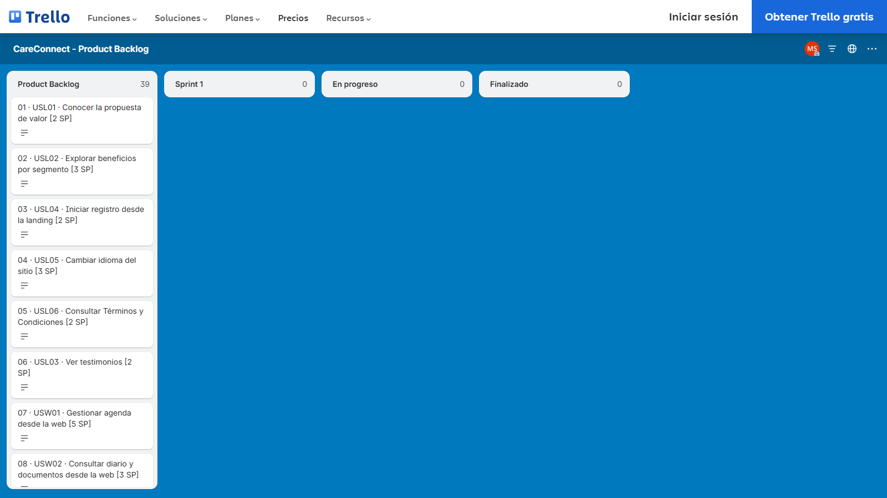
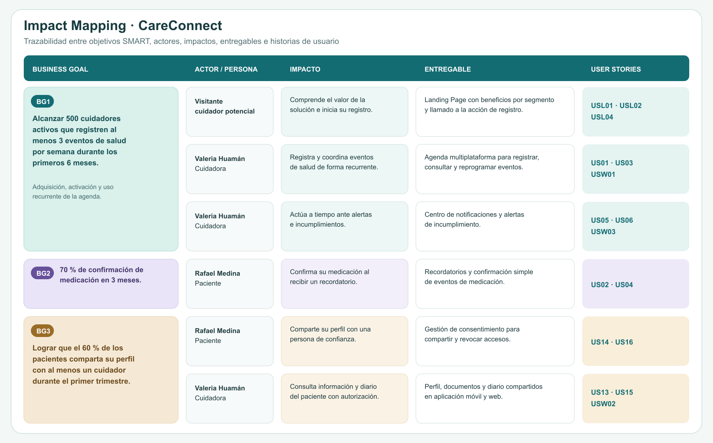

<!--
=====================================================================
 PLANTILLA — Informe de Trabajo Final · 1ASI0732 Diseño de Experimentos
 Un solo archivo README.md (archivo principal del repositorio del informe).
 Estructura completa según el statement: 3 Partes, 8 Capítulos + anexos.
 Reemplazar cada <placeholder> y cada bloque > _Guía:_ con el contenido real.
 Recordar: actualizar y VERIFICAR la Tabla de Contenidos antes de cada entrega.
=====================================================================
-->

# Informe de Trabajo Final

<!-- CARÁTULA -->

**Universidad Peruana de Ciencias Aplicadas (UPC)**

Carrera de Ingeniería de Software

Ciclo académico: **2026-20**

Curso: **1ASI0732 — Diseño de Experimentos de Ingeniería de Software**

NRC: **9100**

Profesor: **Sanchez Ponce, Alex Humberto**

**Informe de Trabajo Final**

Startup: **CareStacks**

Producto: **CareConnect**

**Relación de integrantes:**

| Código      | Apellidos y Nombres |
|-------------|---------------------|
| U202319698  | Salcedo Champi, Matias Rodolfo |
| U20221G099  | Nikaido Vargas, Javier Masaru |
| U202319563  | Muñiz Huayanca, Percy Alonso |
| U202415495  | Espinoza Cruz, Angela Milagros |
| U202319881  | Baldeon Armas, Santiago Armando |

**Septiembre 2026**

---

## Registro de Versiones del Informe

> _Guía:_ Resumen de modificaciones relevantes durante el ciclo de vida. Una línea por versión, **un solo autor por línea**. La primera línea es la versión inicial. Modificaciones relevantes: adición/eliminación de secciones, correcciones/mejoras por feedback del docente o autocrítica del equipo.

| Versión | Fecha (YYYY-MM-DD) | Autor | Descripción de modificación |
|---------|--------------------|-------|-----------------------------|
| 1.0     | \<fecha>           | \<Apellidos, Nombres> | \<descripción> |

---

## Project Report Collaboration Insights

> _Guía:_ Indicar el URL del repositorio del Project Report en la organización GitHub del equipo. Por cada entrega, explicar cómo se desarrollaron las actividades del informe e incluir **capturas de los analíticos de colaboración y commits** en GitHub. Todos los integrantes deben participar. Debe ser coherente con el Registro de Versiones.

- Repositorio del informe: \<url-repo-github>

---

## Tabla de Contenidos

<!-- 4 niveles. Verificar los anclajes (#) antes de cada entrega: GitHub genera el ancla a partir del texto del título. -->

- [Student Outcome](#student-outcome)
- [Part I: As-Is Software Project](#part-i-as-is-software-project)
  - [Capítulo I: Introducción](#capítulo-i-introducción)
    - [1.1. Startup Profile](#11-startup-profile)
      - [1.1.1. Descripción de la Startup](#111-descripción-de-la-startup)
      - [1.1.2. Perfiles de integrantes del equipo](#112-perfiles-de-integrantes-del-equipo)
    - [1.2. Solution Profile](#12-solution-profile)
      - [1.2.1. Antecedentes y problemática](#121-antecedentes-y-problemática)
      - [1.2.2. Lean UX Process](#122-lean-ux-process)
    - [1.3. Segmentos objetivo](#13-segmentos-objetivo)
  - [Capítulo II: Requirements Elicitation & Analysis](#capítulo-ii-requirements-elicitation--analysis)
    - [2.1. Competidores](#21-competidores)
    - [2.2. Entrevistas](#22-entrevistas)
    - [2.3. Needfinding](#23-needfinding)
    - [2.4. Ubiquitous Language](#24-ubiquitous-language)
  - [Capítulo III: Requirements Specification](#capítulo-iii-requirements-specification)
    - [3.1. To-Be Scenario Mapping](#31-to-be-scenario-mapping)
    - [3.2. User Stories](#32-user-stories)
    - [3.3. Product Backlog](#33-product-backlog)
    - [3.4. Impact Mapping](#34-impact-mapping)
  - [Capítulo IV: Product Design](#capítulo-iv-product-design)
    - [4.1. Style Guidelines](#41-style-guidelines)
    - [4.2. Information Architecture](#42-information-architecture)
    - [4.3. Landing Page UI Design](#43-landing-page-ui-design)
    - [4.4. Mobile Applications UX/UI Design](#44-mobile-applications-uxui-design)
    - [4.5. Mobile Applications Prototyping](#45-mobile-applications-prototyping)
    - [4.6. Web Applications UX/UI Design](#46-web-applications-uxui-design)
    - [4.7. Web Applications Prototyping](#47-web-applications-prototyping)
    - [4.8. Domain-Driven Software Architecture](#48-domain-driven-software-architecture)
    - [4.9. Software Object-Oriented Design](#49-software-object-oriented-design)
    - [4.10. Database Design](#410-database-design)
  - [Capítulo V: Product Implementation](#capítulo-v-product-implementation)
    - [5.1. Software Configuration Management](#51-software-configuration-management)
    - [5.2. Product Implementation & Deployment](#52-product-implementation--deployment)
    - [5.3. Video About-the-Product](#53-video-about-the-product)
- [Part II: Verification, Validation & Pipeline](#part-ii-verification-validation--pipeline)
  - [Capítulo VI: Product Verification & Validation](#capítulo-vi-product-verification--validation)
    - [6.1. Testing Suites & Validation](#61-testing-suites--validation)
    - [6.2. Static testing & Verification](#62-static-testing--verification)
    - [6.3. Validation Interviews](#63-validation-interviews)
    - [6.4. Auditoría de Experiencias de Usuario](#64-auditoría-de-experiencias-de-usuario)
  - [Capítulo VII: DevOps Practices](#capítulo-vii-devops-practices)
    - [7.1. Continuous Integration](#71-continuous-integration)
    - [7.2. Continuous Delivery](#72-continuous-delivery)
    - [7.3. Continuous deployment](#73-continuous-deployment)
    - [7.4. Continuous Monitoring](#74-continuous-monitoring)
- [Part III: Experiment-Driven Lifecycle](#part-iii-experiment-driven-lifecycle)
  - [Capítulo VIII: Experiment-Driven Development](#capítulo-viii-experiment-driven-development)
    - [8.1. Experiment Planning](#81-experiment-planning)
    - [8.2. Experiment Design](#82-experiment-design)
    - [8.3. Experimentation](#83-experimentation)
    - [8.4. Experiment Aftermath & Analysis](#84-experiment-aftermath--analysis)
    - [8.5. Continuous Learning](#85-continuous-learning)
    - [8.6. To-Be Software Platform Pre-launch](#86-to-be-software-platform-pre-launch)
- [Matriz de Evaluación Ética y de Impacto](#matriz-de-evaluación-ética-y-de-impacto)
- [Conclusiones](#conclusiones)
- [Bibliografía](#bibliografía)
- [Anexos](#anexos)

---

## Student Outcome

> _Guía:_ Colocar el párrafo introductorio idéntico al Anexo A del statement. Una subsección por alumno describiendo la relación outcome–dimensiones–trabajo. En "Acciones realizadas" identificar cada participante y por entrega (AV1, TP, AV2, TB2). "Conclusiones" grupales y acumulables.

El curso contribuye al cumplimiento del Student Outcome ABET:

**ABET – EAC – Student Outcome 4**
**Criterio:** La capacidad de reconocer responsabilidades éticas y profesionales en situaciones de ingeniería y hacer juicios informados, que deben considerar el impacto de las soluciones de ingeniería en contextos globales, económicos, ambientales y sociales.

| Criterio específico | Acciones realizadas | Conclusiones |
|---------------------|---------------------|--------------|
| **4.c.1** Reconoce responsabilidad ética y profesional en situaciones de ingeniería de software | \<Apellidos, Nombres> AV1: \<acciones> TP: … AV2: … TB2: … | \<conclusiones grupales acumulables> |
| **4.c.2** Emite juicios informados considerando el impacto de las soluciones de ingeniería de software en contextos globales, económicos, ambientales y sociales | \<Apellidos, Nombres> AV1: \<acciones> TP: … AV2: … TB2: … | \<conclusiones grupales acumulables> |

---

# Part I: As-Is Software Project

## Capítulo I: Introducción

### 1.1. Startup Profile

#### 1.1.1. Descripción de la Startup
> _Guía:_ Descripción de CareStacks.

#### 1.1.2. Perfiles de integrantes del equipo
> _Guía:_ Por integrante: foto, nombres y apellidos, código, descripción de carrera y párrafo de conocimientos técnicos/habilidades que aporta.

### 1.2. Solution Profile

#### 1.2.1. Antecedentes y problemática
> _Guía:_ Enunciado del problema aplicando 5W+2H (Who, What, Where, When, Why, How, How Much). Objetivos y restricciones que delimitan el alcance.

#### 1.2.2. Lean UX Process

##### 1.2.2.1. Lean UX Problem Statements
> _Guía:_ Domain, customer segments, pain points, gap, vision/strategy, initial segment.

##### 1.2.2.2. Lean UX Assumptions

##### 1.2.2.3. Lean UX Hypothesis Statements

##### 1.2.2.4. Lean UX Canvas

### 1.3. Segmentos objetivo
> _Guía:_ Descripción de segmentos con características demográficas e información estadística de sustento.

## Capítulo II: Requirements Elicitation & Analysis

### 2.1. Competidores

#### 2.1.1. Análisis competitivo
> _Guía:_ Competitive Analysis Landscape (mín. 3 competidores directos) + SWOT enfocado en la competencia.

#### 2.1.2. Estrategias y tácticas frente a competidores

### 2.2. Entrevistas

#### 2.2.1. Diseño de entrevistas
> _Guía:_ Preguntas principales y complementarias por segmento.

#### 2.2.2. Registro de entrevistas
> _Guía:_ **3 a 5 entrevistas por segmento.** Nombres, apellidos, edad, distrito, screenshot y URL de Microsoft Stream con timing y duración. Resumen por entrevista.

#### 2.2.3. Análisis de entrevistas
> _Guía:_ Análisis por segmento con sustento estadístico (porcentajes).

### 2.3. Needfinding

#### 2.3.1. User Personas
> _Guía:_ Una ficha por segmento (UXPressia).

#### 2.3.2. User Task Matrix

#### 2.3.3. User Journey Mapping
> _Guía:_ Versión As-Is, uno por User Persona (UXPressia).

#### 2.3.4. Empathy Mapping

#### 2.3.5. As-is Scenario Mapping
> _Guía:_ Uno por User Persona (LucidChart/Miro). Filas Phases, Doing, Thinking, Feeling + áreas positivas/negativas/blank.

### 2.4. Ubiquitous Language
> _Guía:_ Glosario del dominio, términos en inglés, sin términos técnicos de ingeniería de software.

## Capítulo III: Requirements Specification

<!-- ===== CAPÍTULO ASIGNADO A ESTE INTEGRANTE ===== -->
Este capítulo especifica los requisitos funcionales y técnicos de los productos digitales de CareConnect a partir de los hallazgos del proceso de elicitación. Se presentan los escenarios futuros de las personas usuarias, las historias de usuario, el Product Backlog priorizado y el Impact Mapping que conecta las funcionalidades con los objetivos del negocio.

### 3.1. To-Be Scenario Mapping
Se presenta la situación futura (To-Be) de cada User Persona con la solución implementada, en contraste directo con el As-Is Scenario Mapping presentado en la sección [2.3.5](#235-as-is-scenario-mapping). Cada escenario organiza el recorrido en las mismas fases definidas en el As-Is y describe las acciones, pensamientos y emociones esperadas durante el uso de CareConnect.

**User Persona 1 — Valeria Huamán (Cuidadora informal)**

| | Fase 1: Organización inicial | Fase 2: Registro de rutina | Fase 3: Seguimiento diario | Fase 4: Coordinación familiar | Fase 5: Revisión |
|---|---|---|---|---|---|
| **Doing** | Crea su cuenta y registra al paciente | Registra medicación y citas en la agenda | Recibe alertas de incumplimiento y confirma tareas | Comparte el perfil con otro familiar y revisa el diario compartido | Consulta el historial de eventos y documentos |
| **Thinking** | "¿Es fácil de configurar?" | "Ahora todo queda en un solo lugar" | "Me avisa si algo no se cumplió" | "Mi hermana también puede ver el estado" | "Puedo mostrar esto al médico" |
| **Feeling** | Expectante | Aliviada, en control | Segura, respaldada | Acompañada, menos sola | Confiada |

**User Persona 2 — Don Rafael Medina (Paciente geriátrico)**

| | Fase 1: Organización inicial | Fase 2: Recordatorio | Fase 3: Confirmación | Fase 4: Consulta | Fase 5: Compartir |
|---|---|---|---|---|---|
| **Doing** | Un familiar le configura la cuenta | Recibe un recordatorio claro de su medicación | Confirma que tomó su medicamento con un toque | Revisa su agenda del día en letra grande | Comparte su estado con su cuidadora |
| **Thinking** | "No quiero algo complicado" | "Me avisa a tiempo" | "Fue fácil confirmar" | "Entiendo qué me toca hoy" | "Mi hija sabe cómo estoy" |
| **Feeling** | Inseguro al inicio | Tranquilo | Autónomo | Orientado, sin confusión | Acompañado |

##### Comparación con el As-Is Scenario Mapping (sección [2.3.5](#235-as-is-scenario-mapping))

En el caso de Valeria, el escenario actual distribuye la información entre cuadernos, alarmas y conversaciones de WhatsApp. Esta fragmentación incrementa la carga mental, dificulta el relevo entre cuidadores y obliga a reconstruir manualmente el historial durante una consulta médica. El escenario To-Be centraliza la agenda, las confirmaciones, el diario y los documentos; además, permite compartir el perfil para que la coordinación familiar no dependa de mensajes aislados.

En el caso de Rafael, la situación actual genera dudas sobre si ya tomó una dosis y lo lleva a depender de otras personas para consultar su rutina. El escenario To-Be introduce recordatorios claros, confirmación con un solo toque y una agenda diaria de alta legibilidad. Con ello conserva mayor autonomía y su cuidadora puede conocer el estado de las actividades sin interrumpirlo constantemente.

### 3.2. User Stories
Las historias de usuario se organizaron por producto digital y se redactaron con criterios de aceptación en formato Gherkin (Given-When-Then). Las palabras reservadas de Gherkin (`Given`, `When`, `Then` y `And`) se mantienen en inglés y el resto de la redacción se presenta en español. Se conservaron las historias funcionales validadas durante el ciclo anterior y se incorporaron las correspondientes al Landing Page y a la Frontend Web Application.

**Epics**

| Epic ID | Nombre de la Épica | Descripción |
|---------|--------------------|-------------|
| EP01 | Gestión de Agenda | Como paciente o cuidador, quiero gestionar eventos de salud para organizar medicación y citas en el tiempo. |
| EP02 | Gestión de Notificaciones | Como paciente o cuidador, quiero recibir notificaciones para dar seguimiento oportuno a los eventos de salud. |
| EP03 | Gestión de Documentos | Como paciente o cuidador, quiero gestionar documentos médicos para mantener un registro accesible. |
| EP04 | Gestión de Consentimiento | Como paciente, quiero compartir mi perfil con un cuidador para permitir el seguimiento de mi estado de salud. |
| EP05 | Diario de Seguimiento | Como paciente o cuidador, quiero registrar notas de seguimiento para monitorear la evolución del estado de salud. |
| EP06 | Autenticación | Como paciente o cuidador, quiero acceder al sistema de forma segura para proteger mi información personal. |
| EP07 | Landing Page | Como visitante, quiero conocer la propuesta de valor y las características de CareConnect para decidir si la solución responde a mis necesidades de cuidado. |

**Historias de usuario, historias técnicas y spikes**

El siguiente cuadro consolida todos los elementos especificados para los productos digitales de CareConnect. Las User Stories, Technical Stories y Spikes incluyen criterios de aceptación comprobables en formato Gherkin (en las Technical Stories se describen como escenarios de request/response), mientras que los spikes incluyen, además, su timebox y criterios que definen cuándo se considera completada la investigación.

| Story ID | Tipo | Usuario | Prioridad | Épica | Título | Descripción | Criterios de aceptación |
|----------|------|---------|-----------|--------|--------|-------------|-----------------------------------------------|
| US01 | User Story | Paciente / Cuidador | Alta | Gestión de Agenda | Registrar evento de salud | Como paciente o cuidador, deseo registrar un evento de salud (medicación o cita) para organizar las actividades médicas en un calendario. | Escenario 1: Registro exitoso de evento   **Given** que el paciente o cuidador proporciona los datos válidos de un evento de salud   **When** registra el evento   **Then** el sistema almacena el evento en la agenda    Escenario 2: Validación de datos obligatorios   **Given** que el paciente o cuidador omite datos obligatorios del evento   **When** intenta registrar el evento   **Then** el sistema rechaza el registro e indica los datos requeridos    Escenario 3: Consulta del evento registrado   **Given** que el evento fue registrado correctamente   **When** el paciente o cuidador consulta la agenda   **Then** el evento aparece en la fecha correspondiente |
| US02 | User Story | Paciente | Alta | Gestión de Agenda | Confirmar evento de salud | Como paciente, deseo confirmar un evento de salud para registrar el cumplimiento de mi tratamiento. | Escenario 1: Confirmación exitosa   **Given** que existe un evento programado para el paciente   **When** el paciente confirma el evento   **Then** el sistema actualiza el estado del evento a "confirmado"    Escenario 2: Consulta del estado   **Given** que el evento fue confirmado   **When** el paciente consulta la agenda   **Then** el estado del evento se presenta como confirmado |
| US03 | User Story | Paciente / Cuidador | Media | Gestión de Agenda | Reprogramar evento de salud | Como paciente o cuidador, deseo reprogramar un evento de salud para ajustarlo a cambios en la disponibilidad. | Escenario 1: Reprogramación exitosa   **Given** que existe un evento previamente registrado   **When** el paciente o cuidador modifica la fecha u hora del evento   **Then** el sistema actualiza el evento correctamente    Escenario 2: Validación de conflicto   **Given** que existe otro evento en el mismo horario   **When** el paciente o cuidador intenta reprogramar el evento a ese horario   **Then** el sistema evita el conflicto y advierte sobre la superposición |
| US04 | User Story | Paciente | Alta | Gestión de Notificaciones | Recibir recordatorios de eventos | Como paciente, deseo recibir recordatorios de mis eventos de salud para cumplir con mis actividades programadas. | Escenario 1: Envío de recordatorio   **Given** que existe un evento programado para el paciente   **When** se aproxima la hora del evento   **Then** el paciente recibe una notificación de recordatorio    Escenario 2: Contenido de la notificación   **Given** que el sistema genera una notificación de recordatorio   **When** el paciente la recibe   **Then** la notificación contiene la información relevante del evento |
| US05 | User Story | Cuidador | Alta | Gestión de Notificaciones | Recibir alertas de incumplimiento | Como cuidador, deseo recibir alertas cuando un evento no es confirmado para supervisar al paciente. | Escenario 1: Generación de alerta   **Given** que un evento no ha sido confirmado por el paciente   **When** transcurre el tiempo límite establecido   **Then** el cuidador vinculado recibe una alerta de incumplimiento    Escenario 2: Validación de permisos   **Given** que el cuidador no tiene acceso al perfil del paciente   **When** el sistema genera la alerta de incumplimiento   **Then** el sistema no envía la notificación a ese cuidador |
| US06 | User Story | Cuidador | Media | Gestión de Notificaciones | Visualizar notificaciones | Como cuidador, deseo visualizar las notificaciones recibidas para monitorear el estado del paciente. | Escenario 1: Consulta de notificaciones   **Given** que existen notificaciones registradas para el cuidador   **When** el cuidador consulta sus notificaciones   **Then** el sistema presenta las notificaciones recibidas    Escenario 2: Orden de presentación   **Given** que existen múltiples notificaciones   **When** el cuidador las consulta   **Then** el sistema las ordena por fecha o prioridad |
| US07 | User Story | Paciente / Cuidador | Alta | Gestión de Documentos | Subir documento médico | Como paciente o cuidador, deseo subir documentos médicos para mantener un registro digital accesible. | Escenario 1: Carga exitosa   **Given** que el paciente o cuidador proporciona un archivo con formato y tamaño permitidos   **When** sube el documento   **Then** el sistema almacena el documento correctamente    Escenario 2: Validación de archivo   **Given** que el archivo no cumple con el formato o tamaño permitido   **When** el paciente o cuidador intenta subirlo   **Then** el sistema rechaza la carga e informa el error |
| US08 | User Story | Paciente / Cuidador | Media | Gestión de Documentos | Consultar documentos | Como paciente o cuidador, deseo consultar los documentos almacenados para revisar información médica. | Escenario 1: Consulta de documentos   **Given** que existen documentos almacenados   **When** el paciente o cuidador consulta sus documentos   **Then** el sistema presenta los documentos disponibles    Escenario 2: Consulta del detalle de un documento   **Given** que existen documentos almacenados con sus metadatos (tipo, fecha, paciente y descripción)   **When** el paciente o cuidador selecciona un documento   **Then** el sistema presenta los metadatos del documento |
| US09 | User Story | Cuidador | Media | Gestión de Documentos | Acceder a documentos compartidos | Como cuidador, deseo acceder a los documentos del paciente para apoyar en su seguimiento. | Escenario 1: Acceso autorizado   **Given** que el cuidador tiene permisos de acceso sobre el paciente   **When** consulta los documentos del paciente   **Then** el sistema permite su visualización    Escenario 2: Acceso denegado   **Given** que el cuidador no tiene permisos de acceso sobre el paciente   **When** intenta consultar los documentos del paciente   **Then** el sistema bloquea el acceso e informa la restricción |
| US10 | User Story | Paciente / Cuidador | Alta | Autenticación | Registrar cuenta | Como usuario, quiero registrar mi propia cuenta para acceder a la plataforma. | Escenario 1: Creación de cuenta   **Given** que el usuario proporciona datos válidos de registro   **When** registra su cuenta   **Then** el sistema crea la cuenta del usuario    Escenario 2: Creación denegada   **Given** que el correo proporcionado ya está registrado   **When** el usuario intenta registrarse   **Then** el sistema rechaza el registro e informa que "el usuario con este correo ya existe" |
| US11 | User Story | Paciente / Cuidador | Alta | Autenticación | Validar acceso por rol | Como usuario, quiero validar el acceso según el rol que poseo. | Escenario 1: Acceso permitido   **Given** que el usuario tiene un rol válido   **When** accede a la plataforma   **Then** el sistema le otorga acceso solo a las funciones correspondientes a su rol    Escenario 2: Acceso denegado   **Given** que el usuario no tiene permisos para un recurso   **When** intenta acceder a ese recurso   **Then** el sistema bloquea el acceso e informa la restricción |
| US12 | User Story | Paciente / Cuidador | Media | Diario de Seguimiento | Escribir nota | Como paciente o cuidador, quiero escribir notas en mi diario para registrar mi estado o el de mi familiar. | Escenario 1: Nota registrada   **Given** que el paciente o cuidador proporciona contenido válido   **When** guarda la nota   **Then** el sistema almacena la nota correctamente    Escenario 2: Nota vacía   **Given** que el paciente o cuidador no proporciona contenido   **When** intenta guardar la nota   **Then** el sistema rechaza el guardado e informa el error |
| US13 | User Story | Cuidador | Media | Diario de Seguimiento | Consultar diarios compartidos | Como cuidador, quiero consultar el diario compartido del paciente para conocer su estado. | Escenario 1: Consulta exitosa   **Given** que el cuidador tiene acceso autorizado al diario del paciente   **When** consulta el diario   **Then** el sistema presenta las notas del paciente    Escenario 2: Acceso denegado   **Given** que el cuidador no tiene permisos de acceso al diario del paciente   **When** intenta consultar las notas   **Then** el sistema bloquea el acceso e informa la restricción |
| US14 | User Story | Paciente | Alta | Gestión de Consentimiento | Compartir perfil | Como paciente, quiero compartir mi perfil con familiares para que puedan ver mi información. | Escenario 1: Compartir exitoso   **Given** que el familiar indicado es un usuario registrado   **When** el paciente comparte su perfil   **Then** el sistema otorga el acceso al familiar    Escenario 2: Error al compartir   **Given** que el familiar indicado no es un usuario registrado   **When** el paciente intenta compartir su perfil   **Then** el sistema informa que el usuario no existe |
| US15 | User Story | Cuidador | Media | Gestión de Consentimiento | Consultar perfil compartido | Como cuidador, quiero consultar el perfil compartido del paciente para acceder a su información. | Escenario 1: Consulta exitosa   **Given** que el paciente otorgó permiso al cuidador   **When** el cuidador consulta el perfil compartido   **Then** el sistema presenta la información del perfil    Escenario 2: Acceso inválido   **Given** que el paciente no otorgó permiso al cuidador   **When** el cuidador intenta consultar el perfil   **Then** el sistema bloquea el acceso e informa la restricción |
| US16 | User Story | Paciente | Media | Gestión de Consentimiento | Revocar acceso | Como paciente, quiero revocar el acceso a mi perfil para controlar quién puede ver mi información. | Escenario 1: Revocación exitosa   **Given** que el paciente otorgó acceso a un cuidador   **When** el paciente revoca el acceso   **Then** el sistema retira los permisos del cuidador    Escenario 2: Acción no permitida   **Given** que el paciente ya revocó el acceso al cuidador   **When** el paciente intenta revocarlo nuevamente   **Then** el sistema informa el error |
| USL01 | User Story | Visitante | Alta | Landing Page | Conocer la propuesta de valor | Como visitante, deseo conocer la propuesta de valor de CareConnect para entender cómo la solución me ayuda a coordinar el cuidado. | Escenario 1: Presentación de la propuesta   **Given** que el visitante ingresa a la landing   **When** visualiza el contenido principal   **Then** se presenta la propuesta de valor y su beneficio principal    Escenario 2: Presentación de la problemática   **Given** que el visitante ingresa a la landing   **When** recorre el contenido inicial   **Then** se presenta la problemática que CareConnect busca resolver |
| USL02 | User Story | Visitante (cuidador / paciente) | Alta | Landing Page | Explorar beneficios por segmento | Como visitante, deseo explorar los beneficios dirigidos a mi segmento para evaluar si la solución responde a mi necesidad. | Escenario 1: Contenido por segmento   **Given** que el visitante recorre la landing   **When** llega al contenido de beneficios   **Then** se presentan beneficios diferenciados para cuidadores y pacientes    Escenario 2: Funcionamiento de la solución   **Given** que el visitante recorre la landing   **When** consulta cómo funciona CareConnect   **Then** se presentan los pasos para comenzar a usar la solución |
| USL03 | User Story | Visitante | Media | Landing Page | Ver testimonios | Como visitante, deseo ver testimonios de usuarios para generar confianza en la solución. | Escenario 1: Presentación de testimonios   **Given** que el visitante recorre la landing   **When** llega al contenido de testimonios   **Then** se presenta al menos un testimonio por segmento objetivo |
| USL04 | User Story | Visitante | Alta | Landing Page | Iniciar registro desde la landing | Como visitante, deseo iniciar mi registro desde la landing para comenzar a usar la plataforma. | Escenario 1: Inicio de registro   **Given** que el visitante decide registrarse   **When** solicita iniciar su registro   **Then** el sistema lo dirige al flujo de creación de cuenta    Escenario 2: Inicio de registro desde los planes   **Given** que el visitante consulta los planes disponibles   **When** solicita iniciar su registro desde un plan   **Then** el sistema lo dirige al flujo de creación de cuenta |
| USL05 | User Story | Visitante | Media | Landing Page | Implementar Internationalization (i18n) | Como visitante, deseo que la Landing Page implemente Internationalization (i18n) para visualizar el contenido en el idioma de mi preferencia. | Escenario 1: Cambio de locale mediante i18n   **Given** que la Landing Page implementa Internationalization (i18n) y dispone de los locales `en_US` y `es_419`   **When** el visitante selecciona uno de los locales disponibles   **Then** el contenido se presenta utilizando los recursos de traducción correspondientes al locale seleccionado    Escenario 2: Persistencia del locale   **Given** que el visitante seleccionó uno de los locales disponibles   **When** recarga la Landing Page   **Then** el contenido se mantiene en el locale seleccionado |
| USL06 | User Story | Visitante | Media | Landing Page | Consultar Términos y Condiciones | Como visitante, deseo consultar los Términos y Condiciones desde la landing para conocer los derechos y obligaciones del servicio. | Escenario 1: Acceso a Términos y Condiciones   **Given** que el visitante está en la landing   **When** solicita consultar los Términos y Condiciones   **Then** el sistema presenta el Acuerdo de Servicio (SaaS)    Escenario 2: Datos de contacto y enlaces del sitio   **Given** que el visitante recorre la landing   **When** consulta la información de contacto   **Then** se presentan los datos de contacto y los enlaces del sitio |
| USW01 | User Story | Cuidador | Alta | Gestión de Agenda | Gestionar agenda desde la web | Como cuidador, deseo gestionar la agenda del paciente desde el navegador para coordinar el cuidado sin depender del móvil. | Escenario 1: Gestión web de eventos   **Given** que el cuidador inició sesión en la web application   **When** registra o edita un evento de salud   **Then** el sistema persiste el cambio y lo refleja en la agenda    Escenario 2: Consulta de la agenda semanal   **Given** que el cuidador inició sesión en la web application   **When** consulta la agenda   **Then** el sistema presenta los eventos de la semana y permite consultar el detalle de cada evento |
| USW02 | User Story | Cuidador | Media | Diario de Seguimiento | Consultar diario y documentos desde la web | Como cuidador, deseo consultar el diario y los documentos compartidos del paciente desde la web para dar seguimiento en pantalla amplia. | Escenario 1: Consulta web autorizada   **Given** que el cuidador tiene acceso autorizado   **When** consulta el diario o los documentos compartidos en la web application   **Then** el sistema presenta la información correspondiente    Escenario 2: Consulta web denegada   **Given** que el cuidador no tiene acceso autorizado   **When** intenta consultar el diario o los documentos compartidos en la web application   **Then** el sistema bloquea el acceso e informa la restricción |
| USW03 | User Story | Paciente / Cuidador | Media | Gestión de Notificaciones | Visualizar notificaciones desde la web | Como usuario, deseo visualizar mis notificaciones en la web application para dar seguimiento a los eventos desde cualquier dispositivo. | Escenario 1: Notificaciones en la web application   **Given** que existen notificaciones para el usuario   **When** accede a sus notificaciones en la web application   **Then** el sistema las presenta ordenadas por fecha o prioridad    Escenario 2: Estado de las notificaciones   **Given** que existen notificaciones con distinto estado   **When** el usuario las consulta en la web application   **Then** el sistema identifica el estado de cada notificación (pendiente, urgente o leído) |
| TS01 | Technical Story | Desarrollador | Alta | Gestión de Agenda | Persistencia de eventos de agenda | Como desarrollador, quiero implementar la persistencia de eventos de salud (citas y medicación) para garantizar su almacenamiento y consulta eficiente. | Escenario 1: Almacenamiento exitoso   **Given** que el servicio recibe una solicitud con un evento de salud válido   **When** procesa la solicitud   **Then** almacena el evento y responde con la confirmación del registro    Escenario 2: Integridad de datos   **Given** que ocurre un error durante el almacenamiento del evento   **When** el servicio intenta persistirlo   **Then** evita la persistencia de datos incompletos y responde indicando el error |
| TS02 | Technical Story | Desarrollador | Alta | Gestión de Agenda | Gestión de estado de eventos | Como desarrollador, quiero implementar la lógica de cambio de estado de los eventos (pendiente, confirmado, incumplido) para reflejar el seguimiento del paciente. | Escenario 1: Cambio de estado válido   **Given** que existe un evento registrado y el servicio recibe una solicitud con un estado válido   **When** procesa la solicitud de actualización   **Then** persiste el nuevo estado y responde con el evento actualizado    Escenario 2: Validación de transición   **Given** que existe un evento registrado y el servicio recibe una solicitud con un estado inválido   **When** intenta procesar la actualización   **Then** rechaza la operación y responde indicando el error |
| TS03 | Technical Story | Desarrollador | Alta | Gestión de Notificaciones | Programación de notificaciones | Como desarrollador, quiero implementar un servicio de programación que genere notificaciones basadas en la fecha y hora de los eventos registrados. | Escenario 1: Programación correcta   **Given** que existe un evento con fecha definida   **When** el servicio agenda la notificación   **Then** programa su envío correctamente    Escenario 2: Reprogramación   **Given** que el evento cambia de horario   **When** el servicio recibe la actualización del evento   **Then** reprograma automáticamente la notificación asociada |
| TS04 | Technical Story | Desarrollador | Alta | Gestión de Notificaciones | Envío de notificaciones | Como desarrollador, quiero implementar el mecanismo de envío de notificaciones push hacia pacientes y cuidadores según reglas de negocio. | Escenario 1: Envío exitoso   **Given** que existe una notificación programada   **When** se cumple la condición de envío   **Then** el servicio envía la notificación al destinatario    Escenario 2: Manejo de fallos   **Given** que falla el envío de la notificación   **When** ocurre el error   **Then** el servicio registra el incidente y reintenta el envío según la configuración |
| TS05 | Technical Story | Desarrollador | Media | Gestión de Notificaciones | Control de acceso a notificaciones | Como desarrollador, quiero implementar validaciones de permisos para asegurar que solo usuarios autorizados reciban notificaciones. | Escenario 1: Acceso autorizado   **Given** que el destinatario tiene permisos sobre el paciente   **When** el servicio genera una notificación   **Then** permite su envío    Escenario 2: Acceso restringido   **Given** que el destinatario no tiene permisos sobre el paciente   **When** el servicio genera una notificación   **Then** bloquea el envío |
| TS06 | Technical Story | Desarrollador | Alta | Gestión de Documentos | Almacenamiento de documentos | Como desarrollador, quiero implementar el almacenamiento de documentos médicos en un sistema seguro para garantizar su disponibilidad. | Escenario 1: Almacenamiento correcto   **Given** que el servicio recibe una solicitud con un archivo válido   **When** procesa la solicitud   **Then** almacena el documento y responde con la confirmación del registro    Escenario 2: Validación de archivo   **Given** que el servicio recibe una solicitud con un archivo inválido   **When** intenta almacenarlo   **Then** rechaza la operación y responde indicando el error |
| TS07 | Technical Story | Desarrollador | Media | Gestión de Documentos | Gestión de metadatos de documentos | Como desarrollador, quiero implementar el registro de metadatos (tipo, fecha, paciente, descripción) asociados a cada documento. | Escenario 1: Registro de metadatos   **Given** que se almacena un documento   **When** el servicio registra sus atributos (tipo, fecha, paciente y descripción)   **Then** guarda correctamente los metadatos    Escenario 2: Consistencia   **Given** que la solicitud contiene datos incompletos   **When** el servicio intenta registrar los metadatos   **Then** valida y rechaza la operación |
| TS08 | Technical Story | Desarrollador | Alta | Gestión de Documentos | Control de acceso a documentos | Como desarrollador, quiero implementar mecanismos de autorización para controlar el acceso a documentos entre paciente y cuidador. | Escenario 1: Acceso permitido   **Given** que el cuidador tiene permisos sobre el paciente   **When** solicita acceso a un documento   **Then** el servicio permite visualizar el documento    Escenario 2: Acceso denegado   **Given** que el usuario no tiene permisos sobre el paciente   **When** intenta acceder a un documento   **Then** el servicio bloquea la operación |
| TS09 | Technical Story | Desarrollador | Alta | Autenticación | Persistencia de usuarios | Como desarrollador, quiero implementar la persistencia de usuarios para garantizar el registro correcto en la base de datos. | Escenario 1: Registro exitoso   **Given** que el servicio recibe una solicitud de registro con datos válidos   **When** procesa el registro   **Then** almacena al usuario correctamente en la base de datos    Escenario 2: Usuario duplicado   **Given** que el correo de la solicitud ya está registrado   **When** el servicio intenta registrar al usuario   **Then** evita el registro duplicado y responde indicando el error |
| TS10 | Technical Story | Desarrollador | Alta | Autenticación | Autorización basada en roles | Como desarrollador, quiero implementar validación de acceso por roles para garantizar seguridad en los recursos. | Escenario 1: Acceso autorizado   **Given** que el usuario tiene el rol correcto   **When** solicita un recurso   **Then** el servicio permite el acceso    Escenario 2: Acceso denegado   **Given** que el usuario no tiene permisos   **When** solicita un recurso   **Then** el servicio bloquea el acceso |
| TS11 | Technical Story | Desarrollador | Alta | Diario de Seguimiento | Persistencia de notas | Como desarrollador, quiero almacenar notas del diario para asegurar su disponibilidad. | Escenario 1: Guardado exitoso   **Given** que la nota tiene contenido válido   **When** el servicio guarda la nota   **Then** la almacena correctamente    Escenario 2: Nota inválida   **Given** que la nota está vacía   **When** el servicio intenta guardarla   **Then** rechaza la operación |
| TS12 | Technical Story | Desarrollador | Media | Diario de Seguimiento | Consulta de diario compartido | Como desarrollador, quiero implementar la consulta de diarios compartidos para permitir acceso a cuidadores. | Escenario 1: Consulta autorizada   **Given** que el usuario tiene acceso al diario compartido   **When** consulta el diario   **Then** el servicio responde con las notas    Escenario 2: Acceso denegado   **Given** que el usuario no tiene permisos sobre el diario compartido   **When** intenta consultarlo   **Then** el servicio bloquea el acceso |
| TS13 | Technical Story | Desarrollador | Media | Gestión de Consentimiento | Consulta de perfil compartido | Como desarrollador, quiero permitir la visualización de perfiles compartidos. | Escenario 1: Consulta exitosa   **Given** que el usuario tiene acceso al perfil compartido   **When** consulta el perfil   **Then** el servicio responde con la información del perfil    Escenario 2: Acceso inválido   **Given** que el usuario no tiene permisos sobre el perfil compartido   **When** intenta acceder al perfil   **Then** el servicio bloquea el acceso |
| TS14 | Technical Story | Desarrollador | Media | Gestión de Consentimiento | Revocación de acceso | Como desarrollador, quiero implementar la revocación de accesos para controlar permisos. | Escenario 1: Revocación exitosa   **Given** que existe un acceso activo sobre el perfil   **When** el propietario revoca el acceso   **Then** el servicio elimina el permiso    Escenario 2: Usuario sin permiso   **Given** que quien realiza la solicitud no es el propietario del perfil   **When** intenta revocar el acceso   **Then** el servicio rechaza la acción |
| SP01 | Spike | Desarrollador | Alta | Investigación técnica | Estrategia de notificaciones sin conexión | Como desarrollador, quiero investigar cómo entregar notificaciones push de medicación en dispositivos con conectividad intermitente, comparando Firebase Cloud Messaging vs. AlarmManager local, para decidir la estrategia del Bounded Context de Notificaciones. | Timebox: 2 días.    Escenario 1: Cierre del spike   **Given** que se evalúan Firebase Cloud Messaging y AlarmManager local para entregar notificaciones push de medicación con conectividad intermitente   **When** finaliza el timebox de 2 días   **Then** se presenta un documento corto con la recomendación y los criterios de decisión (latencia, batería, costo y complejidad)   **And** se entrega un prototipo mínimo |
| SP02 | Spike | Desarrollador | Alta | Investigación técnica | Consentimiento y requisitos legales | Como desarrollador, quiero investigar patrones técnicos (tokens firmados con expiración + lista de revocación) y requisitos legales (Ley N° 29733, HIPAA-like) para implementar el otorgamiento y revocación de consentimiento del paciente sobre su información clínica. | Timebox: 3 días.    Escenario 1: Cierre del spike   **Given** que se investigan tokens firmados con expiración, lista de revocación y los requisitos legales (Ley N° 29733, HIPAA-like) para el consentimiento del paciente   **When** finaliza el timebox de 3 días   **Then** se presenta un documento con el esquema técnico y las referencias normativas aplicables   **And** se valida el esquema con el caso de uso de revocación inmediata |
| SP03 | Spike | Desarrollador | Media | Investigación técnica | Evaluación del stack móvil | Como desarrollador, quiero comparar Flutter y Kotlin Multiplatform en términos de productividad, performance, soporte de notificaciones nativas y curva de aprendizaje para decidir el stack móvil del MVP. | Timebox: 2 días.    Escenario 1: Cierre del spike   **Given** que se comparan Flutter y Kotlin Multiplatform según productividad, performance, soporte de notificaciones nativas y curva de aprendizaje   **When** finaliza el timebox de 2 días   **Then** se presenta una matriz comparativa y la recomendación final del stack móvil   **And** se entregan prototipos en cada tecnología que consumen un endpoint REST |
| SP04 | Spike | Desarrollador | Media | Investigación técnica | Almacenamiento cifrado de documentos | Como desarrollador, quiero investigar opciones de almacenamiento cifrado en reposo y en tránsito para documentos clínicos del paciente (recetas, resultados), comparando S3 con SSE-KMS, GCS y un esquema local cifrado. | Timebox: 2 días.    Escenario 1: Cierre del spike   **Given** que se comparan S3 con SSE-KMS, GCS y un esquema local cifrado para el almacenamiento cifrado en reposo y en tránsito de documentos clínicos   **When** finaliza el timebox de 2 días   **Then** se presenta la recomendación del servicio y el esquema de cifrado   **And** se documenta el plan de manejo de claves |
| SP05 | Spike | Desarrollador | Media | Investigación técnica | Sincronización offline | Como desarrollador, quiero definir cómo sincronizar Diario y Agenda entre el dispositivo (SQLite/Room) y el backend tras periodos sin conexión, evitando conflictos y pérdidas de información. | Timebox: 2 días.    Escenario 1: Cierre del spike   **Given** que se define la sincronización de Diario y Agenda entre el dispositivo (SQLite/Room) y el backend tras periodos sin conexión   **When** finaliza el timebox de 2 días   **Then** se presenta un documento con la estrategia de sincronización y el manejo de conflictos   **And** se entrega un prototipo mínimo |
### 3.3. Product Backlog
El Product Backlog integra las historias funcionales de la aplicación, el Landing Page y la Frontend Web Application, además de las historias técnicas y los spikes necesarios para reducir incertidumbre antes de la implementación. El orden considera primero la comunicación y captación inicial del Landing Page y, a continuación, el acceso web y las capacidades principales de seguimiento y cuidado.

Los elementos se ordenan por valor para el negocio e incluyen su estimación en Story Points.

| # Orden | User Story ID | Título | Descripción | Story Points (1/2/3/5/8) |
|--------:|---------------|--------|-------------|:------------------------:|
| 1  | USL01 | Conocer la propuesta de valor | Como visitante, deseo conocer la propuesta de valor de CareConnect para entender cómo la solución me ayuda a coordinar el cuidado. | 2 |
| 2  | USL02 | Explorar beneficios por segmento | Como visitante, deseo explorar los beneficios dirigidos a mi segmento para evaluar si la solución responde a mi necesidad. | 3 |
| 3  | USL04 | Iniciar registro desde la landing | Como visitante, deseo iniciar mi registro desde la landing para comenzar a usar la plataforma. | 2 |
| 4 | USL05 | Implementar Internationalization (i18n) | Como visitante, deseo que la Landing Page implemente Internationalization (i18n) para visualizar el contenido en el idioma de mi preferencia. | 3 |
| 5  | USL06 | Consultar Términos y Condiciones | Como visitante, deseo consultar los Términos y Condiciones desde la landing para conocer los derechos y obligaciones del servicio. | 2 |
| 6  | USL03 | Ver testimonios | Como visitante, deseo ver testimonios de usuarios para generar confianza en la solución. | 2 |
| 7  | USW01 | Gestionar agenda desde la web | Como cuidador, deseo gestionar la agenda del paciente desde el navegador para coordinar el cuidado sin depender del móvil. | 5 |
| 8  | USW02 | Consultar diario y documentos desde la web | Como cuidador, deseo consultar el diario y los documentos compartidos del paciente desde la web para dar seguimiento en pantalla amplia. | 3 |
| 9  | USW03 | Visualizar notificaciones desde la web | Como usuario, deseo visualizar mis notificaciones en la web application para dar seguimiento a los eventos desde cualquier dispositivo. | 2 |
| 10 | US01 | Registrar evento de salud | Como paciente o cuidador, deseo registrar un evento de salud (medicación o cita) para organizar las actividades médicas en un calendario. | 3 |
| 11 | US02 | Confirmar evento de salud | Como paciente, deseo confirmar un evento de salud para registrar el cumplimiento de mi tratamiento. | 3 |
| 12 | US03 | Reprogramar evento de salud | Como paciente o cuidador, deseo reprogramar un evento de salud para ajustarlo a cambios en la disponibilidad. | 3 |
| 13 | US04 | Recibir recordatorios de eventos | Como paciente, deseo recibir recordatorios de mis eventos de salud para cumplir con mis actividades programadas. | 2 |
| 14 | US05 | Recibir alertas de incumplimiento | Como cuidador, deseo recibir alertas cuando un evento no es confirmado para supervisar al paciente. | 2 |
| 15 | US06 | Visualizar notificaciones | Como cuidador, deseo visualizar las notificaciones recibidas para monitorear el estado del paciente. | 1 |
| 16 | US07 | Subir documento médico | Como paciente o cuidador, deseo subir documentos médicos para mantener un registro digital accesible. | 2 |
| 17 | US08 | Consultar documentos | Como paciente o cuidador, deseo consultar los documentos almacenados para revisar información médica. | 1 |
| 18 | US09 | Acceder a documentos compartidos | Como cuidador, deseo acceder a los documentos del paciente para apoyar en su seguimiento. | 3 |
| 19 | US10 | Registrar cuenta | Como usuario, quiero registrar mi propia cuenta para acceder a la plataforma. | 2 |
| 20 | US11 | Validar acceso por rol | Como usuario, quiero validar el acceso según el rol que poseo. | 3 |
| 21 | US12 | Escribir nota | Como paciente o cuidador, quiero escribir notas en mi diario para registrar mi estado o el de mi familiar. | 2 |
| 22 | US13 | Consultar diarios compartidos | Como cuidador, quiero consultar el diario compartido del paciente para conocer su estado. | 3 |
| 23 | US14 | Compartir perfil | Como paciente, quiero compartir mi perfil con familiares para que puedan ver mi información. | 3 |
| 24 | US15 | Consultar perfil compartido | Como cuidador, quiero consultar el perfil compartido del paciente para acceder a su información. | 3 |
| 25 | US16 | Revocar acceso | Como paciente, quiero revocar el acceso a mi perfil para controlar quién puede ver mi información. | 3 |
| 26 | TS01 | Persistencia de eventos de agenda | Como desarrollador, quiero implementar la persistencia de eventos de salud (citas y medicación) para garantizar su almacenamiento y consulta eficiente. | 3 |
| 27 | TS02 | Gestión de estado de eventos | Como desarrollador, quiero implementar la lógica de cambio de estado de los eventos (pendiente, confirmado, incumplido) para reflejar el seguimiento del paciente. | 3 |
| 28 | TS03 | Programación de notificaciones | Como desarrollador, quiero implementar un servicio de programación que genere notificaciones basadas en la fecha y hora de los eventos registrados. | 3 |
| 29 | TS04 | Envío de notificaciones | Como desarrollador, quiero implementar el mecanismo de envío de notificaciones push hacia pacientes y cuidadores según reglas de negocio. | 2 |
| 30 | TS05 | Control de acceso a notificaciones | Como desarrollador, quiero implementar validaciones de permisos para asegurar que solo usuarios autorizados reciban notificaciones. | 3 |
| 31 | TS06 | Almacenamiento de documentos | Como desarrollador, quiero implementar el almacenamiento de documentos médicos en un sistema seguro para garantizar su disponibilidad. | 2 |
| 32 | TS07 | Gestión de metadatos de documentos | Como desarrollador, quiero implementar el registro de metadatos (tipo, fecha, paciente, descripción) asociados a cada documento. | 3 |
| 33 | TS08 | Control de acceso a documentos | Como desarrollador, quiero implementar mecanismos de autorización para controlar el acceso a documentos entre paciente y cuidador. | 3 |
| 34 | TS09 | Persistencia de usuarios | Como desarrollador, quiero implementar la persistencia de usuarios para garantizar el registro correcto en la base de datos. | 2 |
| 35 | TS10 | Autorización basada en roles | Como desarrollador, quiero implementar validación de acceso por roles para garantizar seguridad en los recursos. | 2 |
| 36 | TS11 | Persistencia de notas | Como desarrollador, quiero almacenar notas del diario para asegurar su disponibilidad. | 2 |
| 37 | TS12 | Consulta de diario compartido | Como desarrollador, quiero implementar la consulta de diarios compartidos para permitir acceso a cuidadores. | 3 |
| 38 | TS13 | Consulta de perfil compartido | Como desarrollador, quiero permitir la visualización de perfiles compartidos. | 3 |
| 39 | TS14 | Revocación de acceso | Como desarrollador, quiero implementar la revocación de accesos para controlar permisos. | 5 |
| 40 | SP01 | Estrategia de notificaciones sin conexión | Como desarrollador, quiero investigar cómo entregar notificaciones push de medicación en dispositivos con conectividad intermitente, comparando Firebase Cloud Messaging vs. AlarmManager local, para decidir la estrategia del Bounded Context de Notificaciones. | 3 |
| 41 | SP02 | Consentimiento y requisitos legales | Como desarrollador, quiero investigar patrones técnicos (tokens firmados con expiración + lista de revocación) y requisitos legales (Ley N° 29733, HIPAA-like) para implementar el otorgamiento y revocación de consentimiento del paciente sobre su información clínica. | 5 |
| 42 | SP03 | Evaluación del stack móvil | Como desarrollador, quiero comparar Flutter y Kotlin Multiplatform en términos de productividad, performance, soporte de notificaciones nativas y curva de aprendizaje para decidir el stack móvil del MVP. | 3 |
| 43 | SP04 | Almacenamiento cifrado de documentos | Como desarrollador, quiero investigar opciones de almacenamiento cifrado en reposo y en tránsito para documentos clínicos del paciente (recetas, resultados), comparando S3 con SSE-KMS, GCS y un esquema local cifrado. | 3 |
| 44 | SP05 | Sincronización offline | Como desarrollador, quiero definir cómo sincronizar Diario y Agenda entre el dispositivo (SQLite/Room) y el backend tras periodos sin conexión, evitando conflictos y pérdidas de información. | 3 |

- URL del Product Backlog: https://trello.com/b/slxEXro5/careconnect-product-backlog

### 3.4. Impact Mapping
El Impact Mapping representa la relación entre las tres metas SMART de CareConnect, los actores que influyen en ellas, los cambios de comportamiento esperados y los entregables que los habilitan. La versión actual incorpora las experiencias móvil, web y Landing Page.

El Impact Map permite visualizar cómo las funcionalidades clave de la aplicación se alinean con los objetivos de negocio, considerando a los actores involucrados y los impactos esperados en su comportamiento.

**Business Goals (SMART)**
- **BG1:** Alcanzar 500 cuidadores activos que registren al menos 3 eventos de salud por semana en los primeros 6 meses post-lanzamiento.
- **BG2:** Lograr una tasa de confirmación de eventos de medicación del 70% por parte de los pacientes en los primeros 3 meses.
- **BG3:** Conseguir que el 60% de los pacientes comparta su perfil con al menos un cuidador durante el primer trimestre.

| Business Goal | Actor / Persona | Impact | Deliverable | User Stories |
|---------------|-----------------|--------|-------------|--------------|
| BG1 | Visitante (cuidador potencial) | Comprende el valor de la solución e inicia su registro | Landing Page con beneficios por segmento y llamado a la acción | USL01, USL02, USL04 |
| BG1 | Cuidador (Valeria Huamán) | Registra y coordina los eventos de salud de forma regular | Agenda multiplataforma con registro y reprogramación de eventos | US01, US03, USW01 |
| BG1 | Cuidador (Valeria Huamán) | Actúa a tiempo ante incumplimientos | Centro de notificaciones y alertas de incumplimiento | US05, US06, USW03 |
| BG2 | Paciente (Rafael Medina) | Confirma su medicación al recibir el recordatorio | Recordatorios y confirmación simple de eventos | US02, US04 |
| BG3 | Paciente (Rafael Medina) | Comparte su perfil con un familiar o cuidador | Gestión de consentimiento para compartir y revocar accesos | US14, US16 |
| BG3 | Cuidador (Valeria Huamán) | Consulta el perfil, los documentos y el diario compartidos | Vistas compartidas en la aplicación móvil y web | US13, US15, USW02 |
<!-- ===== FIN CAPÍTULO ASIGNADO ===== -->

## Capítulo IV: Product Design

### 4.1. Style Guidelines

#### 4.1.1. General Style Guidelines
> _Guía:_ Branding, Typography, Colors, Spacing + 4 dimensiones de tono (Divertido/Serio, Formal/Casual, Respetuoso/Irreverente, Entusiasta/Sereno).

#### 4.1.2. Web Style Guidelines
> _Guía:_ Estándares visuales y de interacción para responsive web interfaces (breakpoints, grid, estados, componentes PrimeVue).

#### 4.1.3. Mobile Style Guidelines

##### 4.1.3.1. iOS Mobile Style Guidelines

##### 4.1.3.2. Android Mobile Style Guidelines

### 4.2. Information Architecture

#### 4.2.1. Organization Systems

#### 4.2.2. Labeling Systems

#### 4.2.3. SEO Tags and Meta Tags
> _Guía:_ Title, Description, Keywords, Author como mínimo, para Landing Page y Web Application.

#### 4.2.4. Searching Systems

#### 4.2.5. Navigation Systems

### 4.3. Landing Page UI Design

#### 4.3.1. Landing Page Wireframe
> _Guía:_ Desktop Web Browser y Mobile Web Browser.

#### 4.3.2. Landing Page Mock-up
> _Guía:_ Desktop y Mobile Web Browser (Figma/Adobe XD).

### 4.4. Mobile Applications UX/UI Design

#### 4.4.1. Mobile Applications Wireframes

#### 4.4.2. Mobile Applications Wireflow Diagrams
> _Guía:_ Un Wireflow por User goal.

#### 4.4.3. Mobile Applications Mock-ups

#### 4.4.4. Mobile Applications User Flow Diagrams
> _Guía:_ Un User Flow por User goal (happy/unhappy paths).

### 4.5. Mobile Applications Prototyping

#### 4.5.1. Android Mobile Applications Prototyping
> _Guía:_ Screenshot de video + enlace a Microsoft Stream.

#### 4.5.2. iOS Mobile Applications Prototyping

### 4.6. Web Applications UX/UI Design

#### 4.6.1. Web Applications Wireframes

#### 4.6.2. Web Applications Wireflow Diagrams

#### 4.6.3. Web Applications Mock-ups

#### 4.6.4. Web Applications User Flow Diagrams

### 4.7. Web Applications Prototyping
> _Guía:_ Prototipo navegable Desktop + Mobile Web Browser. Screenshot + video en Microsoft Stream.

### 4.8. Domain-Driven Software Architecture

#### 4.8.1. Software Architecture Context Diagram
> _Guía:_ C4 Model (Structurizr).

#### 4.8.2. Software Architecture Container Diagrams

#### 4.8.3. Software Architecture Components Diagrams

### 4.9. Software Object-Oriented Design

#### 4.9.1. Class Diagrams

#### 4.9.2. Class Dictionary
> _Guía:_ Tabla de clases con atributos, tipos y responsabilidades.

### 4.10. Database Design

#### 4.10.1. Relational/Non-Relational Database Diagram

## Capítulo V: Product Implementation

### 5.1. Software Configuration Management

#### 5.1.1. Software Development Environment Configuration
> _Guía:_ Productos por actividad (Project/Requirements Mgmt, UX/UI, Development, Testing, Deployment, Documentation) con propósito y ruta.

#### 5.1.2. Source Code Management
> _Guía:_ URLs de repositorios (Landing Page, Web Services, Frontend Web). GitFlow: convenciones de feature/release/hotfix branches. Semantic Versioning. Conventional Commits.

#### 5.1.3. Source Code Style Guide & Conventions

#### 5.1.4. Software Deployment Configuration

### 5.2. Product Implementation & Deployment

#### 5.2.1. Sprint Backlogs
> _Guía:_ Por Sprint: Planning (fecha, hora, asistentes, Sprint Goal), Sprint Backlog, Development/Execution/Services Documentation Evidence, Team Collaboration Insights.

#### 5.2.2. Implemented Landing Page Evidence

#### 5.2.3. Implemented Frontend-Web Application Evidence

#### 5.2.4. Acuerdo de Servicio - SaaS
> _Guía:_ Derechos, obligaciones y restricciones. Publicado en "Terms and Conditions" del website y enlazado en footers, con referencia a códigos de ética ACM/IEEE y CIP.

#### 5.2.5. Implemented Native-Mobile Application Evidence

#### 5.2.6. Implemented RESTful API and/or Serverless Backend Evidence

#### 5.2.7. RESTful API documentation
> _Guía:_ OpenAPI vía Swagger. Por acción: verbo HTTP, sintaxis, parámetros, ejemplo y explicación del response.

#### 5.2.8. Team Collaboration Insights

### 5.3. Video About-the-Product
> _Guía:_ Screenshot, URL OneDrive del docente + URL YouTube, duración (1–3 min), al menos un testimonio de usuario. Incrustado en el Landing Page.

---

# Part II: Verification, Validation & Pipeline

## Capítulo VI: Product Verification & Validation

### 6.1. Testing Suites & Validation

#### 6.1.1. Core Entities Unit Tests

#### 6.1.2. Core Integration Tests

#### 6.1.3. Core Behavior-Driven Development
> _Guía:_ Archivos `.feature` en Gherkin ligados a User Stories + Steps en el lenguaje de programación.

#### 6.1.4. Core System Tests

### 6.2. Static testing & Verification

#### 6.2.1. Static Code Analysis

##### 6.2.1.1. Coding standard & Code conventions

##### 6.2.1.2. Code Quality & Code Security
> _Guía:_ Complejidad, duplicación, mantenibilidad + vulnerabilidades (SQLi, XSS, datos sensibles). SonarQube/ESLint/Checkmarx.

#### 6.2.2. Reviews

### 6.3. Validation Interviews

#### 6.3.1. Diseño de Entrevistas

#### 6.3.2. Registro de Entrevistas
> _Guía:_ 3 a 5 entrevistas por segmento. Nombres, edad, distrito, screenshot, URL Microsoft Stream con timing.

#### 6.3.3. Evaluaciones según heurísticas
> _Guía:_ Formato del Anexo D (usabilidad, arquitectura de información, inclusive design) con escala de severidad.

### 6.4. Auditoría de Experiencias de Usuario

#### 6.4.1. Auditoría realizada

##### 6.4.1.1. Información del grupo auditado

##### 6.4.1.2. Cronograma de auditoría realizada

##### 6.4.1.3. Contenido de auditoría realizada

#### 6.4.2. Auditoría recibida

##### 6.4.2.1. Información del grupo auditor

##### 6.4.2.2. Cronograma de auditoría recibida

##### 6.4.2.3. Contenido de auditoría recibida

##### 6.4.2.4. Resumen de modificaciones para subsanar hallazgos

## Capítulo VII: DevOps Practices

### 7.1. Continuous Integration

#### 7.1.1. Tools and Practices

#### 7.1.2. Build & Test Suite Pipeline Components

### 7.2. Continuous Delivery

#### 7.2.1. Tools and Practices

#### 7.2.2. Stages Deployment Pipeline Components

### 7.3. Continuous deployment

#### 7.3.1. Tools and Practices

#### 7.3.2. Production Deployment Pipeline Components

### 7.4. Continuous Monitoring

#### 7.4.1. Tools and Practices

#### 7.4.2. Monitoring Pipeline Components

#### 7.4.3. Alerting Pipeline Components

#### 7.4.4. Notification Pipeline Components

---

# Part III: Experiment-Driven Lifecycle

## Capítulo VIII: Experiment-Driven Development

### 8.1. Experiment Planning

#### 8.1.1. As-Is Summary

#### 8.1.2. Raw Material: Assumptions, Knowledge Gaps, Ideas, Claims

#### 8.1.3. Experiment-Ready Questions
> _Guía:_ Belief-led vs. Exploratory. Aplicar 5W+H para descubrir premisas ocultas.

#### 8.1.4. Question Backlog
> _Guía:_ Lista priorizada de **preguntas** (no features). Motivación "por qué" + puntuación Confianza/Riesgo/Impacto/Interés; en empate gana mayor Riesgo.

#### 8.1.5. Experiment Cards
> _Guía:_ Frontal: Pregunta, Por qué, Hipótesis, Simplest Useful Thing. Posterior: Medidas, Condiciones, Escala.

### 8.2. Experiment Design

#### 8.2.1. Hypotheses
> _Guía:_ Falsificables, testables, medibles. Emparejar cada una con su Hipótesis Nula.

#### 8.2.2. Domain Business Metrics
> _Guía:_ Cada métrica con fórmula, técnica de recolección y meta. Las Experiment Cards solo referencian métricas definidas aquí.

#### 8.2.3. Measures

#### 8.2.4. Conditions
> _Guía:_ Condición experimental vs. de control.

#### 8.2.5. Scale Calculations and Decisions
> _Guía:_ Significancia 5%, potencia 80–95%, MDE explícito. Mostrar cálculo del tamaño de muestra.

#### 8.2.6. Methods Selection
> _Guía:_ Simplest Useful Thing. No ejecutar dos experimentos simultáneos sobre el mismo tema/usuario. Consideración ética de no causar daño.

#### 8.2.7. Data Analytics: Goals, KPIs and Metrics Selection

#### 8.2.8. Web and Mobile Tracking Plan
> _Guía:_ Eventos, propiedades, herramienta y punto de captura por producto.

### 8.3. Experimentation

#### 8.3.1. To-Be User Stories

#### 8.3.2. To-Be Product Backlog

#### 8.3.3. Pipeline-supported, Experiment-Driven To-Be Software Platform Lifecycle

##### 8.3.3.1. To-Be Sprint Backlogs

##### 8.3.3.2. Implemented To-Be Landing Page Evidence

##### 8.3.3.3. Implemented To-Be Frontend-Web Application Evidence

##### 8.3.3.4. Implemented To-Be Native-Mobile Application Evidence

##### 8.3.3.5. Implemented To-Be RESTful API and/or Serverless Backend Evidence

##### 8.3.3.6. Team Collaboration Insights

#### 8.3.4. To-Be Validation Interviews

##### 8.3.4.1. Diseño de Entrevistas

##### 8.3.4.2. Registro de Entrevistas

### 8.4. Experiment Aftermath & Analysis

#### 8.4.1. Analysis and Interpretation of Results
> _Guía:_ Interpretar datos contra hipótesis e hipótesis nula. La hipótesis se **prueba**, no se "valida".

#### 8.4.2. Re-scored and Re-prioritized Question Backlog

### 8.5. Continuous Learning

#### 8.5.1. Shareback Session Artifacts: Learning Workflow

### 8.6. To-Be Software Platform Pre-launch

#### 8.6.1. About-the-Product Intro Video

#### 8.6.2. Resumen usando Gees Framework
> _Guía:_ Matriz con lentes Global, Economic, Environmental, Social; por cada una: indicador clave, hallazgo del sistema y estándar internacional de referencia (ISO/IEC 27001, 25010, ISO 14001, ISO 26000, WCAG 2.2).

---

## Matriz de Evaluación Ética y de Impacto
> _Guía:_ 7 dimensiones (Anexo F): Salud Pública y Seguridad; Inclusión y Accesibilidad; Impacto Social y Cultural; Impacto Económico; Impacto Ambiental; Enfoque Global; Revelación de Peligros y Responsabilidad. Por cada una: riesgos positivos/negativos, a quién afecta y magnitud, y acciones de mitigación.

| Dimensión / Criterio | Identificación de Riesgos e Impactos | Evaluación del Impacto (¿a quién y magnitud?) | Estrategias de Mitigación y Acciones de Diseño |
|----------------------|--------------------------------------|-----------------------------------------------|------------------------------------------------|
| 1. Salud Pública y Seguridad | \<...> | \<...> | \<...> |
| 2. Inclusión y Accesibilidad | \<...> | \<...> | \<...> |
| 3. Impacto Social y Cultural | \<...> | \<...> | \<...> |
| 4. Impacto Económico | \<...> | \<...> | \<...> |
| 5. Impacto Ambiental | \<...> | \<...> | \<...> |
| 6. Enfoque Global | \<...> | \<...> | \<...> |
| 7. Revelación de Peligros y Responsabilidad | \<...> | \<...> | \<...> |

---

## Conclusiones

### Conclusiones y recomendaciones
> _Guía:_ Contrastar Problem Statements, Assumptions, Hypothesis Statements y criterios de éxito del Lean UX frente a los resultados de las validaciones/experimentos. Recomendaciones sobre el Roadmap.

### Video App Validation
> _Guía:_ Evaluación con usuarios vía Firebase App Distribution + video.

### Video About-the-Team
> _Guía:_ Pauta de secuencias con timing hh:mm:ss por sección, cuadro de video representativo, URL Stream + YouTube. Testimonio ante cámara de cada participante (outcomes y competencias, alineado al Outcome 4).

---

## Bibliografía
> _Guía:_ Referencias en formato APA 7ma edición (https://normas-apa.org/).

---

## Anexos
> _Guía:_ Cada anexo inicia en nueva página, diferenciado con letra mayúscula (Anexo A, B, …). Incluir el **Anexo: Videos de Exposiciones** con título e hipervínculo por entrega.

### Anexo: Videos de Exposiciones
| Entrega | Título | Enlace (Microsoft Stream) |
|---------|--------|---------------------------|
| \<AV1/TP/AV2/TB2> | \<título> | \<url> |
