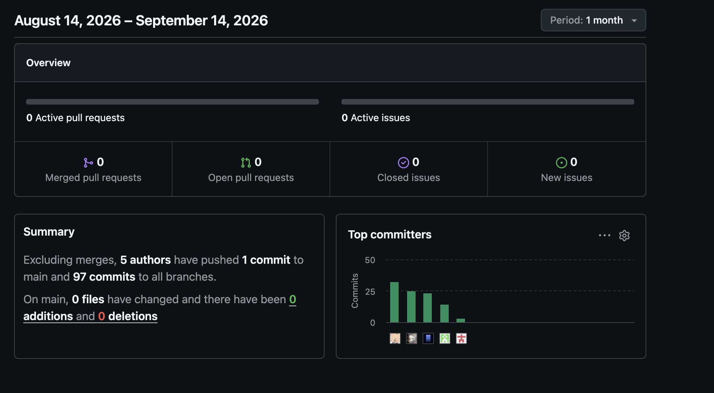
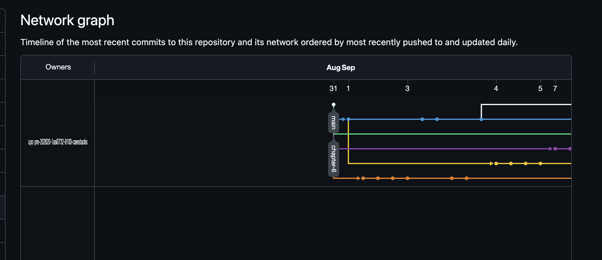
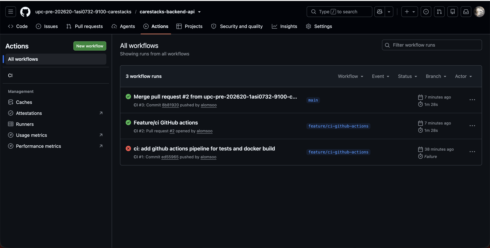
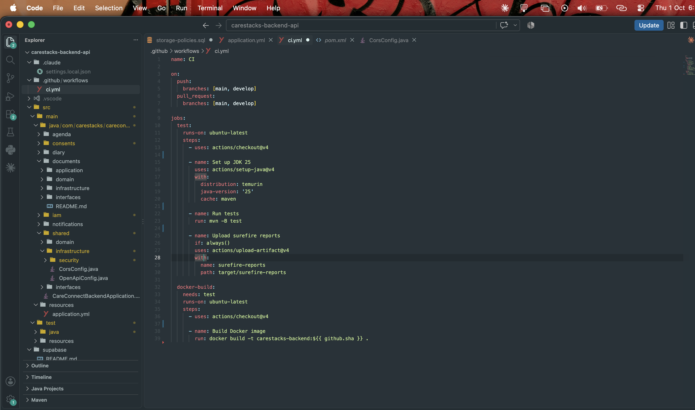
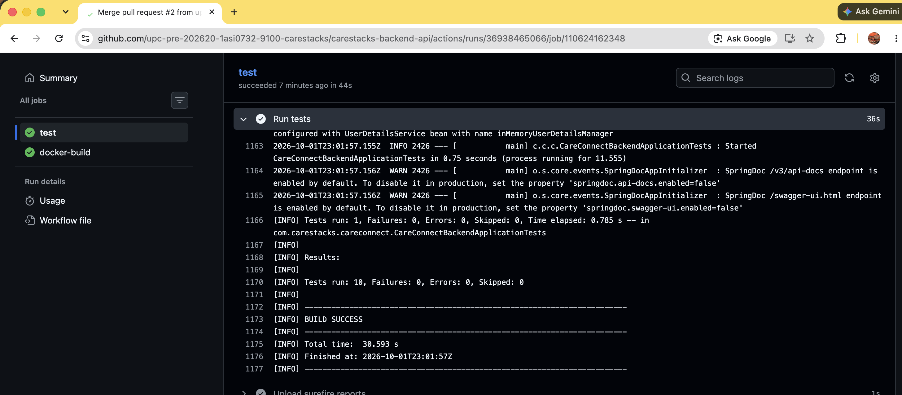
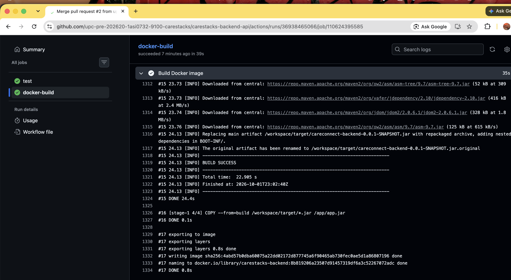
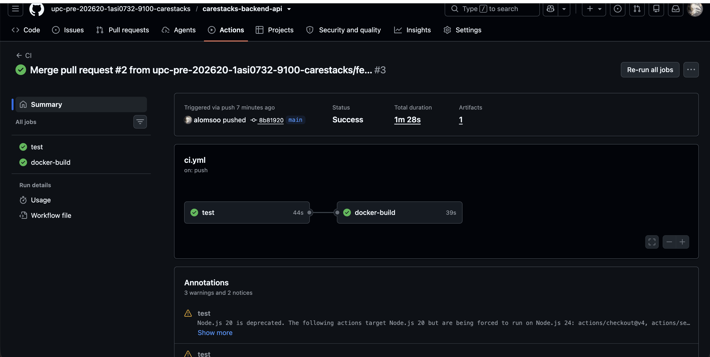

<!--
=====================================================================
 PLANTILLA — Informe de Trabajo Final · 1ASI0732 Diseño de Experimentos
 Un solo archivo README.md (archivo principal del repositorio del informe).
 Estructura completa según el statement: 3 Partes, 8 Capítulos + anexos.
 Reemplazar cada <placeholder> y cada bloque > _Guía:_ con el contenido real.
 Recordar: actualizar y VERIFICAR la Tabla de Contenidos antes de cada entrega.
=====================================================================
-->

<!-- CARÁTULA -->
<div align="center">


# Universidad Peruana de Ciencias Aplicadas

---

## Carrera de Ingeniería de Software

---

1ASI0732

Diseño de Experimentos de Ingeniería de Software

**NRC**

9100

**Informe de Trabajo Final**

**Docente**

Sanchez Ponce, Alex Humberto

**Startup**

CareStacks

**Producto**

CareConnect

**Integrantes**

<center>

| Código | Apellidos y Nombres |
|---|---|
| U202319881 | Baldeon Armas, Santiago Armando |
| U202415495 | Espinoza Cruz, Angela Milagros |
| U202319563 | Muñiz Huayanca, Percy Alonso |
| U20221G099 | Nikaido Vargas, Javier Masaru |
| U202319698 | Salcedo Champi, Matias Rodolfo |

</center>

**Período 2026-20**

Septiembre, 2026

</div>

---
# REGISTRO DE VERSIONES DEL INFORME

| **Versión** | **Fecha** | **Autor** | **Descripción de modificación** |
|:---:|:---:|---|---|
| 0.1.0 | 31/08/2026 | Matias Salcedo | Creó la plantilla base del informe final (`main`) |
| 0.2.0 | 01/09/2026 – 08/09/2026 | Matias Salcedo | Redactó el Capítulo III, desarrollando las user stories, el product backlog, el impact mapping, el to-be scenario mapping y el llenado de la carátula (`chapter-3`) |
| 0.3.0 | 04/09/2026 – 05/09/2026 | Angela Espinoza | Desarrolló el Capítulo II a partir de las personas, los empathy maps, los journey maps y el análisis de needfinding (`chapter-2`) |
| 0.4.0 | 07/09/2026 | Javier Nikaido | Elaboró los diagramas de arquitectura, de clases y de base de datos del Capítulo IV (`chapter-4`) |
| 0.5.0 | 07/09/2026 | Angela Espinoza | Amplió el Capítulo II incorporando el enfoque Lean UX (problem statement, hipótesis y canvas), los segmentos objetivo y el análisis competitivo (`chapter-2`) |
| 0.6.0 | 08/09/2026 | Matias Salcedo | Completó la especificación de requerimientos del Capítulo III y afinó el backlog junto con el impact map (`chapter-3`) |
| 0.7.0 | 09/09/2026 | Angela Espinoza / Santiago Baldeon | Redactaron el Capítulo I describiendo el perfil de la startup y los perfiles de los integrantes del equipo (`chapter-1`, `chapter-2`) |
| 0.8.0 | 09/09/2026 – 10/09/2026 | Javier Nikaido | Implementó y documentó la Landing Page junto con su configuración de despliegue para el Capítulo V (`chapter-5`) |
| 0.9.0 | 10/09/2026 | Percy Muñiz | Incorporó la evidencia de la aplicación móvil en iOS, el prototipado y los sprint backlogs del Capítulo V (`chapter-5`) |
| 0.10.0 | 10/09/2026 | Javier Nikaido | Revisó los perfiles de los integrantes y ajustó la guía de requisitos del Capítulo IV (`chapter-1`, `chapter-4`) |
| 0.11.0 | 11/09/2026 | Matias Salcedo | Completó la sección de diseño UX web del Capítulo II (`chapter-2`) |
| 0.12.0 | 14/09/2026 | Angela Espinoza | Añadió el As-Is Scenario Mapping, el glosario de ubiquitous language, las referencias en formato APA 7 y reescribió el proceso Lean UX (`chapter-1`, `chapter-2`) |
| 0.13.0 | 14/09/2026 | Javier Nikaido / Percy Muñiz | Revisaron el class dictionary y el stack tecnológico, migraron el frontend a Flutter y ajustaron la configuración de despliegue (`chapter-4`, `chapter-5`) |
| 0.14.0 | 15/09/2026 | Santiago Baldeon | Elaboró los wireframes y mockups de la aplicación móvil del Capítulo IV (`chapter-4`) |
| 1.0.0 | 16/09/2026 | Matias Salcedo | AV1 Report |

# Project Report Collaboration Insights

Enlace de la organización para el reporte del proyecto: https://github.com/upc-pre-202620-1asi0732-9100-carestacks/carestacks-report

AV1:



## Tabla de Contenidos

<!-- 4 niveles. Verificar los anclajes (#) antes de cada entrega: GitHub genera el ancla a partir del texto del título. -->

- [Student Outcome](#student-outcome)
- [Part I: As-Is Software Project](#part-i-as-is-software-project)
  - [Capítulo I: Introducción](#capítulo-i-introducción)
    - [1.1. Startup Profile](#11-startup-profile)
      - [1.1.1. Descripción de la Startup](#111-descripción-de-la-startup)
      - [1.1.2. Perfiles de integrantes del equipo](#112-perfiles-de-integrantes-del-equipo)
    - [1.2. Solution Profile](#12-solution-profile)
      - [1.2.1. Antecedentes y problemática](#121-antecedentes-y-problemática)
      - [1.2.2. Lean UX Process](#122-lean-ux-process)
        - [1.2.2.1. Lean UX Problem Statements](#1221-lean-ux-problem-statements)
        - [1.2.2.2. Lean UX Assumptions](#1222-lean-ux-assumptions)
        - [1.2.2.3. Lean UX Hypothesis Statements](#1223-lean-ux-hypothesis-statements)
        - [1.2.2.4. Lean UX Canvas](#1224-lean-ux-canvas)
    - [1.3. Segmentos objetivo](#13-segmentos-objetivo)
    - [Segmento Objetivo 1: Cuidadores de pacientes geriátricos](#segmento-objetivo-1-cuidadores-de-pacientes-geriátricos)
    - [Segmento Objetivo 2: Pacientes geriátricos](#segmento-objetivo-2-pacientes-geriátricos)
  - [Capítulo II: Requirements Elicitation & Analysis](#capítulo-ii-requirements-elicitation--analysis)
    - [2.1. Competidores](#21-competidores)
      - [2.1.1. Análisis competitivo](#211-análisis-competitivo)
      - [2.1.2. Estrategias y tácticas frente a competidores](#212-estrategias-y-tácticas-frente-a-competidores)
    - [2.2. Entrevistas](#22-entrevistas)
      - [2.2.1. Diseño de entrevistas](#221-diseño-de-entrevistas)
      - [Segmento 1: Cuidadores de pacientes geriátricos](#segmento-1-cuidadores-de-pacientes-geriátricos)
      - [Segmento 2: Pacientes geriátricos](#segmento-2-pacientes-geriátricos)
      - [2.2.2. Registro de entrevistas](#222-registro-de-entrevistas)
      - [Segmento 1: Cuidadores de pacientes geriátricos](#segmento-1-cuidadores-de-pacientes-geriátricos-1)
      - [Segmento 2: Pacientes geriátricos](#segmento-2-pacientes-geriátricos-1)
      - [2.2.3. Análisis de entrevistas](#223-análisis-de-entrevistas)
      - [Segmento 1: Cuidadores de pacientes geriátricos](#segmento-1-cuidadores-de-pacientes-geriátricos-2)
      - [Segmento 2: Pacientes geriátricos](#segmento-2-pacientes-geriátricos-2)
      - [Conclusión general del análisis](#conclusión-general-del-análisis)
    - [2.3. Needfinding](#23-needfinding)
      - [2.3.1. User Personas](#231-user-personas)
      - [2.3.2. User Task Matrix](#232-user-task-matrix)
      - [2.3.3. User Journey Mapping](#233-user-journey-mapping)
      - [2.3.4. Empathy Mapping](#234-empathy-mapping)
      - [2.3.5. As-is Scenario Mapping](#235-as-is-scenario-mapping)
        - [User Persona 1 — Valeria Huamán](#user-persona-1--valeria-huamán)
        - [User Persona 2 — Rafael Medina](#user-persona-2--rafael-medina)
        - [Hallazgos transversales](#hallazgos-transversales)
    - [2.4. Ubiquitous Language](#24-ubiquitous-language)
        - [Actores del cuidado](#actores-del-cuidado)
        - [Agenda y eventos de salud](#agenda-y-eventos-de-salud)
        - [Medicación y adherencia](#medicación-y-adherencia)
        - [Continuidad del cuidado](#continuidad-del-cuidado)
        - [Documentación y evolución](#documentación-y-evolución)
  - [Capítulo III: Requirements Specification](#capítulo-iii-requirements-specification)
    - [3.1. To-Be Scenario Mapping](#31-to-be-scenario-mapping)
        - [Comparación con el As-Is Scenario Mapping (sección 2.3.5)](#comparación-con-el-as-is-scenario-mapping-sección-235)
    - [3.2. User Stories](#32-user-stories)
    - [3.3. Product Backlog](#33-product-backlog)
    - [3.4. Impact Mapping](#34-impact-mapping)
  - [Capítulo IV: Product Design](#capítulo-iv-product-design)
    - [4.1. Style Guidelines](#41-style-guidelines)
      - [4.1.1. General Style Guidelines](#411-general-style-guidelines)
      - [4.1.2. Web Style Guidelines](#412-web-style-guidelines)
      - [4.1.3. Mobile Style Guidelines](#413-mobile-style-guidelines)
        - [4.1.3.1. iOS Mobile Style Guidelines](#4131-ios-mobile-style-guidelines)
        - [4.1.3.2. Android Mobile Style Guidelines](#4132-android-mobile-style-guidelines)
    - [4.2. Information Architecture](#42-information-architecture)
      - [4.2.1. Organization Systems](#421-organization-systems)
      - [4.2.2. Labeling Systems](#422-labeling-systems)
      - [4.2.3. SEO Tags and Meta Tags](#423-seo-tags-and-meta-tags)
      - [4.2.4. Searching Systems](#424-searching-systems)
      - [4.2.5. Navigation Systems](#425-navigation-systems)
    - [4.3. Landing Page UI Design](#43-landing-page-ui-design)
      - [4.3.1. Landing Page Wireframe](#431-landing-page-wireframe)
      - [4.3.2. Landing Page Mock-up](#432-landing-page-mock-up)
    - [4.4. Mobile Applications UX/UI Design](#44-mobile-applications-uxui-design)
      - [4.4.1. Mobile Applications Wireframes](#441-mobile-applications-wireframes)
      - [4.4.2. Mobile Applications Wireflow Diagrams](#442-mobile-applications-wireflow-diagrams)
        - [User Goal 1: Registro y selección de rol](#user-goal-1-registro-y-selección-de-rol)
        - [User Goal 2: Inicio de sesión](#user-goal-2-inicio-de-sesión)
        - [User Goal 3: Confirmar toma de medicación (Cuidador)](#user-goal-3-confirmar-toma-de-medicación-cuidador)
        - [User Goal 4: Compartir el perfil con un nuevo cuidador (Paciente)](#user-goal-4-compartir-el-perfil-con-un-nuevo-cuidador-paciente)
        - [User Goal 5: Revisar y resolver notificaciones (Cuidador)](#user-goal-5-revisar-y-resolver-notificaciones-cuidador)
        - [User Goal 6: Registrar un evento en Agenda](#user-goal-6-registrar-un-evento-en-agenda)
        - [User Goal 7: Subir un documento médico](#user-goal-7-subir-un-documento-médico)
      - [4.4.3. Mobile Applications Mock-ups](#443-mobile-applications-mock-ups)
      - [4.4.4. Mobile Applications User Flow Diagrams](#444-mobile-applications-user-flow-diagrams)
    - [4.5. Mobile Applications Prototyping](#45-mobile-applications-prototyping)
      - [4.5.1. Android Mobile Applications Prototyping](#451-android-mobile-applications-prototyping)
      - [4.5.2. iOS Mobile Applications Prototyping](#452-ios-mobile-applications-prototyping)
    - [4.6. Web Applications UX/UI Design](#46-web-applications-uxui-design)
      - [4.6.1. Web Applications Wireframes](#461-web-applications-wireframes)
      - [4.6.2. Web Applications Wireflow Diagrams](#462-web-applications-wireflow-diagrams)
      - [4.6.3. Web Applications Mock-ups](#463-web-applications-mock-ups)
      - [4.6.4. Web Applications User Flow Diagrams](#464-web-applications-user-flow-diagrams)
    - [4.7. Web Applications Prototyping](#47-web-applications-prototyping)
    - [4.8. Domain-Driven Software Architecture](#48-domain-driven-software-architecture)
      - [4.8.1. Software Architecture Context Diagram](#481-software-architecture-context-diagram)
        - [Elementos del Context Diagram](#elementos-del-context-diagram)
        - [Relaciones principales](#relaciones-principales)
      - [4.8.2. Software Architecture Container Diagrams](#482-software-architecture-container-diagrams)
        - [Containers de CareConnect](#containers-de-careconnect)
        - [Relaciones entre containers](#relaciones-entre-containers)
        - [Consideración tecnológica](#consideración-tecnológica)
      - [4.8.3. Software Architecture Components Diagrams](#483-software-architecture-components-diagrams)
        - [Componentes principales](#componentes-principales)
        - [Relaciones principales entre componentes](#relaciones-principales-entre-componentes)
    - [4.9. Software Object-Oriented Design](#49-software-object-oriented-design)
      - [4.9.1. Class Diagrams](#491-class-diagrams)
        - [Bounded Context: Agenda](#bounded-context-agenda)
        - [Bounded Context: Notificaciones](#bounded-context-notificaciones)
        - [Bounded Context: Diario de Seguimiento](#bounded-context-diario-de-seguimiento)
        - [Bounded Context: Gestión de Consentimiento](#bounded-context-gestión-de-consentimiento)
        - [Bounded Context: Documentos](#bounded-context-documentos)
        - [Bounded Context: Autenticación / IAM](#bounded-context-autenticación--iam)
      - [4.9.2. Class Dictionary](#492-class-dictionary)
        - [Bounded Context Agenda](#bounded-context-agenda-1)
        - [Bounded Context Notifications](#bounded-context-notifications)
        - [Bounded Context Diary Tracking](#bounded-context-diary-tracking)
        - [Bounded Context Consent Management](#bounded-context-consent-management)
        - [Bounded Context Documents](#bounded-context-documents)
        - [Bounded Context Authentication / IAM](#bounded-context-authentication--iam)
        - [Resumen del Diccionario de Clases](#resumen-del-diccionario-de-clases)
    - [4.10. Database Design](#410-database-design)
      - [4.10.1. Relational/Non-Relational Database Diagram](#4101-relationalnon-relational-database-diagram)
        - [Agrupación conceptual por bounded context](#agrupación-conceptual-por-bounded-context)
        - [Persistencia relacional](#persistencia-relacional)
        - [Persistencia de archivos](#persistencia-de-archivos)
  - [Capítulo V: Product Implementation](#capítulo-v-product-implementation)
    - [5.1. Software Configuration Management](#51-software-configuration-management)
      - [5.1.1. Software Development Environment Configuration](#511-software-development-environment-configuration)
        - [Herramientas por actividad](#herramientas-por-actividad)
        - [Configuración de la Native Mobile Application](#configuración-de-la-native-mobile-application)
        - [Configuración del Backend RESTful API](#configuración-del-backend-restful-api)
        - [Variables de entorno del Backend](#variables-de-entorno-del-backend)
        - [Configuración de la Landing Page](#configuración-de-la-landing-page)
        - [Configuración de la Frontend Web Application](#configuración-de-la-frontend-web-application)
        - [Consideración sobre el stack del curso](#consideración-sobre-el-stack-del-curso)
      - [5.1.2. Source Code Management](#512-source-code-management)
      - [Repositorio del informe](#repositorio-del-informe)
      - [Estrategia de ramas](#estrategia-de-ramas)
      - [Convenciones para nombres de ramas](#convenciones-para-nombres-de-ramas)
      - [Repositorios de producto](#repositorios-de-producto)
      - [Convenciones de GitFlow para los repositorios de producto](#convenciones-de-gitflow-para-los-repositorios-de-producto)
      - [Versionado Semántico (Semantic Versioning)](#versionado-semántico-semantic-versioning)
      - [Conventional Commits](#conventional-commits)
      - [5.1.3. Source Code Style Guide & Conventions](#513-source-code-style-guide--conventions)
        - [Convenciones generales](#convenciones-generales)
        - [Organización del Backend](#organización-del-backend)
        - [Convenciones Java / Spring Boot](#convenciones-java--spring-boot)
        - [Convenciones Kotlin / Android](#convenciones-kotlin--android)
        - [Convenciones TypeScript / Frontend](#convenciones-typescript--frontend)
        - [Convenciones REST](#convenciones-rest)
        - [Convenciones de Base de Datos](#convenciones-de-base-de-datos)
        - [Convenciones Gherkin](#convenciones-gherkin)
        - [Buenas prácticas](#buenas-prácticas)
      - [5.1.4. Software Deployment Configuration](#514-software-deployment-configuration)
        - [Landing Page](#landing-page)
        - [Frontend Web Application](#frontend-web-application)
        - [RESTful API](#restful-api)
        - [Configuración objetivo de la RESTful API](#configuración-objetivo-de-la-restful-api)
        - [PostgreSQL](#postgresql)
        - [Supabase Storage](#supabase-storage)
        - [Native Mobile Application](#native-mobile-application)
        - [Firebase Cloud Messaging](#firebase-cloud-messaging)
        - [SendGrid](#sendgrid)
        - [Gestión de variables de entorno](#gestión-de-variables-de-entorno)
        - [Entornos de despliegue](#entornos-de-despliegue)
        - [Estado actual del despliegue](#estado-actual-del-despliegue)
        - [Criterios de validación del despliegue](#criterios-de-validación-del-despliegue)
        - [Seguridad de la configuración](#seguridad-de-la-configuración)
    - [5.2. Product Implementation & Deployment](#52-product-implementation--deployment)
      - [5.2.1. Sprint Backlogs](#521-sprint-backlogs)
      - [Sprint 1](#sprint-1)
        - [Sprint Planning 1](#sprint-planning-1)
        - [Aspect Leaders and Collaborators](#aspect-leaders-and-collaborators)
        - [Sprint Backlog 1](#sprint-backlog-1)
      - [5.2.2. Implemented Landing Page Evidence](#522-implemented-landing-page-evidence)
        - [Deployment Evidence](#deployment-evidence)
        - [Home and Problem Section](#home-and-problem-section)
        - [Features Section](#features-section)
        - [Product, Benefits and How It Works](#product-benefits-and-how-it-works)
        - [Plans, Contact and Footer](#plans-contact-and-footer)
      - [5.2.3. Implemented Frontend-Web Application Evidence](#523-implemented-frontend-web-application-evidence)
      - [5.2.4. Acuerdo de Servicio - SaaS](#524-acuerdo-de-servicio---saas)
      - [5.2.5. Implemented Native-Mobile Application Evidence](#525-implemented-native-mobile-application-evidence)
      - [5.2.6. Implemented RESTful API and/or Serverless Backend Evidence](#526-implemented-restful-api-andor-serverless-backend-evidence)
      - [5.2.7. RESTful API documentation](#527-restful-api-documentation)
      - [5.2.8. Team Collaboration Insights](#528-team-collaboration-insights)
      - [Repositorio del Informe (`carestacks-report`)](#repositorio-del-informe-carestacks-report)
      - [Repositorio del Backend (`carestacks-backend-api`)](#repositorio-del-backend-carestacks-backend-api)
      - [Repositorio de la Aplicación Móvil (`carestacks-mobile-app`)](#repositorio-de-la-aplicación-móvil-carestacks-mobile-app)
      - [Repositorio de la Aplicación Web (`carestacks-web`)](#repositorio-de-la-aplicación-web-carestacks-web)
      - [Interpretación](#interpretación)
    - [5.3. Video About-the-Product](#53-video-about-the-product)
- [Part II: Verification, Validation & Pipeline](#part-ii-verification-validation--pipeline)
  - [Capítulo VI: Product Verification & Validation](#capítulo-vi-product-verification--validation)
    - [6.1. Testing Suites & Validation](#61-testing-suites--validation)
      - [6.1.1. Core Entities Unit Tests](#611-core-entities-unit-tests)
      - [6.1.2. Core Integration Tests](#612-core-integration-tests)
      - [6.1.3. Core Behavior-Driven Development](#613-core-behavior-driven-development)
      - [6.1.4. Core System Tests](#614-core-system-tests)
    - [6.2. Static testing & Verification](#62-static-testing--verification)
      - [6.2.1. Static Code Analysis](#621-static-code-analysis)
        - [6.2.1.1. Coding standard & Code conventions](#6211-coding-standard--code-conventions)
        - [6.2.1.2. Code Quality & Code Security](#6212-code-quality--code-security)
      - [6.2.2. Reviews](#622-reviews)
    - [6.3. Validation Interviews](#63-validation-interviews)
      - [6.3.1. Diseño de Entrevistas](#631-diseño-de-entrevistas)
      - [6.3.2. Registro de Entrevistas](#632-registro-de-entrevistas)
      - [6.3.3. Evaluaciones según heurísticas](#633-evaluaciones-según-heurísticas)
    - [6.4. Auditoría de Experiencias de Usuario](#64-auditoría-de-experiencias-de-usuario)
      - [6.4.1. Auditoría realizada](#641-auditoría-realizada)
        - [6.4.1.1. Información del grupo auditado](#6411-información-del-grupo-auditado)
        - [6.4.1.2. Cronograma de auditoría realizada](#6412-cronograma-de-auditoría-realizada)
        - [6.4.1.3. Contenido de auditoría realizada](#6413-contenido-de-auditoría-realizada)
      - [6.4.2. Auditoría recibida](#642-auditoría-recibida)
        - [6.4.2.1. Información del grupo auditor](#6421-información-del-grupo-auditor)
        - [6.4.2.2. Cronograma de auditoría recibida](#6422-cronograma-de-auditoría-recibida)
        - [6.4.2.3. Contenido de auditoría recibida](#6423-contenido-de-auditoría-recibida)
        - [6.4.2.4. Resumen de modificaciones para subsanar hallazgos](#6424-resumen-de-modificaciones-para-subsanar-hallazgos)
  - [Capítulo VII: DevOps Practices](#capítulo-vii-devops-practices)
    - [7.1. Continuous Integration](#71-continuous-integration)
      - [7.1.1. Tools and Practices](#711-tools-and-practices)
      - [7.1.2. Build & Test Suite Pipeline Components](#712-build--test-suite-pipeline-components)
    - [7.2. Continuous Delivery](#72-continuous-delivery)
      - [7.2.1. Tools and Practices](#721-tools-and-practices)
      - [7.2.2. Stages Deployment Pipeline Components](#722-stages-deployment-pipeline-components)
    - [7.3. Continuous deployment](#73-continuous-deployment)
      - [7.3.1. Tools and Practices](#731-tools-and-practices)
      - [7.3.2. Production Deployment Pipeline Components](#732-production-deployment-pipeline-components)
    - [7.4. Continuous Monitoring](#74-continuous-monitoring)
      - [7.4.1. Tools and Practices](#741-tools-and-practices)
      - [7.4.2. Monitoring Pipeline Components](#742-monitoring-pipeline-components)
      - [7.4.3. Alerting Pipeline Components](#743-alerting-pipeline-components)
      - [7.4.4. Notification Pipeline Components](#744-notification-pipeline-components)
- [Part III: Experiment-Driven Lifecycle](#part-iii-experiment-driven-lifecycle)
  - [Capítulo VIII: Experiment-Driven Development](#capítulo-viii-experiment-driven-development)
    - [8.1. Experiment Planning](#81-experiment-planning)
      - [8.1.1. As-Is Summary](#811-as-is-summary)
      - [8.1.2. Raw Material: Assumptions, Knowledge Gaps, Ideas, Claims](#812-raw-material-assumptions-knowledge-gaps-ideas-claims)
      - [8.1.3. Experiment-Ready Questions](#813-experiment-ready-questions)
      - [8.1.4. Question Backlog](#814-question-backlog)
      - [8.1.5. Experiment Cards](#815-experiment-cards)
    - [8.2. Experiment Design](#82-experiment-design)
      - [8.2.1. Hypotheses](#821-hypotheses)
      - [8.2.2. Domain Business Metrics](#822-domain-business-metrics)
      - [8.2.3. Measures](#823-measures)
      - [8.2.4. Conditions](#824-conditions)
      - [8.2.5. Scale Calculations and Decisions](#825-scale-calculations-and-decisions)
      - [8.2.6. Methods Selection](#826-methods-selection)
      - [8.2.7. Data Analytics: Goals, KPIs and Metrics Selection](#827-data-analytics-goals-kpis-and-metrics-selection)
      - [8.2.8. Web and Mobile Tracking Plan](#828-web-and-mobile-tracking-plan)
    - [8.3. Experimentation](#83-experimentation)
      - [8.3.1. To-Be User Stories](#831-to-be-user-stories)
      - [8.3.2. To-Be Product Backlog](#832-to-be-product-backlog)
      - [8.3.3. Pipeline-supported, Experiment-Driven To-Be Software Platform Lifecycle](#833-pipeline-supported-experiment-driven-to-be-software-platform-lifecycle)
        - [8.3.3.1. To-Be Sprint Backlogs](#8331-to-be-sprint-backlogs)
        - [8.3.3.2. Implemented To-Be Landing Page Evidence](#8332-implemented-to-be-landing-page-evidence)
        - [8.3.3.3. Implemented To-Be Frontend-Web Application Evidence](#8333-implemented-to-be-frontend-web-application-evidence)
        - [8.3.3.4. Implemented To-Be Native-Mobile Application Evidence](#8334-implemented-to-be-native-mobile-application-evidence)
        - [8.3.3.5. Implemented To-Be RESTful API and/or Serverless Backend Evidence](#8335-implemented-to-be-restful-api-andor-serverless-backend-evidence)
        - [8.3.3.6. Team Collaboration Insights](#8336-team-collaboration-insights)
      - [8.3.4. To-Be Validation Interviews](#834-to-be-validation-interviews)
        - [8.3.4.1. Diseño de Entrevistas](#8341-diseño-de-entrevistas)
        - [8.3.4.2. Registro de Entrevistas](#8342-registro-de-entrevistas)
    - [8.4. Experiment Aftermath & Analysis](#84-experiment-aftermath--analysis)
      - [8.4.1. Analysis and Interpretation of Results](#841-analysis-and-interpretation-of-results)
      - [8.4.2. Re-scored and Re-prioritized Question Backlog](#842-re-scored-and-re-prioritized-question-backlog)
    - [8.5. Continuous Learning](#85-continuous-learning)
      - [8.5.1. Shareback Session Artifacts: Learning Workflow](#851-shareback-session-artifacts-learning-workflow)
    - [8.6. To-Be Software Platform Pre-launch](#86-to-be-software-platform-pre-launch)
      - [8.6.1. About-the-Product Intro Video](#861-about-the-product-intro-video)
      - [8.6.2. Resumen usando Gees Framework](#862-resumen-usando-gees-framework)
  - [Conclusiones](#conclusiones)
    - [Conclusiones y recomendaciones](#conclusiones-y-recomendaciones)
  - [Bibliografía](#bibliografía)
  - [Anexos](#anexos)
    - [Anexo A: Archivo de Figma](#anexo-a-archivo-de-figma)
    - [Anexo B: Video de Entrevistas](#anexo-b-video-de-entrevistas)
    - [Anexo C: Repositorios de Producto](#anexo-c-repositorios-de-producto)
    - [Anexo: Videos](#anexo-videos)

# Student Outcome

Cada participante del equipo debe sustentar evidencia de cómo las actividades realizadas en el trabajo final han ayudado a desarrollar las dimensiones del student outcome. Por ello en esta sección debe haber una subsección por cada alumno donde éste describa por escrito la relación entre el outcome, sus dimensiones y el trabajo que ha realizado. Esto se complementa con lo reflejado en los testimonios expuestos que forman parte del video About The Team.

**ABET – EAC - Student Outcome 4**

| Criterio específico | Acciones realizadas | Conclusiones |
|----|----|----|
|4.c.1 Reconoce responsabilidad ética y profesional en situaciones de ingeniería de software|**Espinoza Cruz, Angela Milagros**<br>*AV1*<br>Redacté la descripción de la startup, los perfiles del equipo, el problema y la problemática, el proceso completo de Lean UX (Problem Statements, Assumptions, Hypothesis Statements y Canvas) y los segmentos objetivo en el Capítulo I. En el Capítulo II, desarrollé el análisis competitivo, el diseño y registro de entrevistas, los User Personas, User Task Matrix, Journey Maps, Empathy Maps, As-Is Scenario Mapping y el glosario de Ubiquitous Language.<br><br>**Salcedo Champi, Matias Rodolfo**<br>*AV1*<br>Configuré la plantilla inicial del informe y la carátula del equipo. En el Capítulo III, redacté el To-Be Scenario Mapping, las User Stories, el Product Backlog y el Impact Mapping. En el Capítulo IV, completé la sección de Web Applications UX/UI Design.<br><br>**Nikaido Vargas, Javier Masaru**<br>*AV1*<br>En el Capítulo IV, elaboré los diagramas de arquitectura (Context, Container y Components), los diagramas y diccionario de clases, y el diagrama de base de datos. En el Capítulo V, documenté la Software Configuration Management, la evidencia de despliegue del Landing Page y la configuración de despliegue de los productos de CareConnect.<br><br>**Baldeon Armas, Santiago Armando**<br>*AV1*<br>Colaboré en la documentación de los perfiles de integrantes del equipo en el Capítulo I y en contenido del Capítulo IV.<br><br>**Muñiz Huayanca, Percy Alonso**<br>*AV1*<br>En el Capítulo IV, documenté el prototipado de la aplicación móvil (iOS con Flutter) y adapté la base Flutter del segmento cuidador a un prototipo funcional de escritorio para el Capítulo IV.7. En el Capítulo V, documenté la evidencia de implementación del Frontend-Web, la evidencia Native-Mobile, la evidencia del backend RESTful y su documentación en Swagger, y actualicé los Sprint Backlogs con el detalle técnico de cada tarea.|**AV1**<br><br>La actualización constante de conceptos y conocimientos en ingeniería de software nos permitió abordar de manera efectiva los retos de los capítulos desarrollados hasta esta entrega, aplicando metodologías actuales —Lean UX, Domain-Driven Design, arquitectura C4 y mejores prácticas de implementación para el desarrollo del proyecto y nuestro crecimiento profesional.|
|4.c.2 Emite juicios informados considerando el impacto de las soluciones de ingeniería de software en contextos globales, económicos, ambientales y sociales|**Espinoza Cruz, Angela Milagros**<br>*AV1*<br>La elaboración del Lean UX Canvas y el análisis competitivo me exigió investigar metodologías de validación temprana de producto y herramientas de análisis de mercado que no había aplicado antes. El diseño y análisis de entrevistas reforzó la importancia de la empatía y el aprendizaje continuo sobre experiencia de usuario en un dominio sensible como el cuidado de adultos mayores.<br><br>**Salcedo Champi, Matias Rodolfo**<br>*AV1*<br>Redactar el Product Backlog y el Impact Mapping me llevó a profundizar en técnicas de priorización de historias de usuario. Completar el diseño UX/UI web me exigió aprender a adaptar un sistema de diseño pensado originalmente para móvil hacia un contexto de escritorio.<br><br>**Nikaido Vargas, Javier Masaru**<br>*AV1*<br>Elaborar los diagramas C4 y el diccionario de clases me llevó a profundizar en Domain-Driven Design y en la representación formal de bounded contexts. Documentar la configuración de despliegue me impulsó a investigar buenas prácticas de gestión de variables de entorno y separación de ambientes.<br><br>**Baldeon Armas, Santiago Armando**<br>*AV1*<br>Colaborar en la documentación del equipo y del Capítulo IV me motivó a revisar cómo estructurar información técnica de forma clara para distintos lectores del informe.<br><br>**Muñiz Huayanca, Percy Alonso**<br>*AV1*<br>Adaptar la aplicación móvil Flutter a un prototipo web funcional me exigió aprender sobre sistemas de layout responsive y jerarquía visual en Flutter Web, algo que no había trabajado antes. Levantar y documentar el backend con Swagger me llevó a profundizar en configuración de CORS, gestión de variables de entorno y buenas prácticas de control de versiones (Git) que no dominaba con este nivel de detalle.|**AV1**<br><br>El aprendizaje permanente ha sido fundamental para adaptarnos a los retos técnicos y metodológicos de los capítulos desarrollados hasta esta entrega, permitiéndonos incorporar nuevas metodologías, herramientas y enfoques en el desarrollo del proyecto, y preparándonos para un desempeño profesional competente y actualizado en ingeniería de software.|

# Part I: As-Is Software Project

## Capítulo I: Introducción

### 1.1. Startup Profile
#### 1.1.1. Descripción de la Startup
#### 1.1.2. Perfiles de integrantes del equipo

### 1.2. Solution Profile
#### 1.2.1. Antecedentes y problemática
#### 1.2.2. Lean UX Process
##### 1.2.2.1. Lean UX Problem Statements
##### 1.2.2.2. Lean UX Assumptions
##### 1.2.2.3. Lean UX Hypothesis Statements
##### 1.2.2.4. Lean UX Canvas

### 1.3. Segmentos objetivo

---

## Capítulo II: Requirements Elicitation & Analysis

### 2.1. Competidores
#### 2.1.1. Análisis competitivo
#### 2.1.2. Estrategias y tácticas frente a competidores

### 2.2. Entrevistas
#### 2.2.1. Diseño de entrevistas
#### 2.2.2. Registro de entrevistas
#### 2.2.3. Análisis de entrevistas

### 2.3. Needfinding
#### 2.3.1. User Personas
#### 2.3.2. User Task Matrix
#### 2.3.3. User Journey Mapping
#### 2.3.4. Empathy Mapping
#### 2.3.5. As-is Scenario Mapping

### 2.4. Ubiquitous Language

---

## Capítulo III: Requirements Specification

### 3.1. To-Be Scenario Mapping
### 3.2. User Stories
### 3.3. Product Backlog
### 3.4. Impact Mapping

---

## Capítulo IV: Product Design

### 4.1. Style Guidelines
#### 4.1.1. General Style Guidelines
#### 4.1.2. Web Style Guidelines
#### 4.1.3. Mobile Style Guidelines
##### 4.1.3.1. iOS Mobile Style Guidelines
##### 4.1.3.2. Android Mobile Style Guidelines

### 4.2. Information Architecture
#### 4.2.1. Organization Systems
#### 4.2.2. Labeling Systems
#### 4.2.3. SEO Tags and Meta Tags
#### 4.2.4. Searching Systems
#### 4.2.5. Navigation Systems

### 4.3. Landing Page UI Design
#### 4.3.1. Landing Page Wireframe
#### 4.3.2. Landing Page Mock-up

### 4.4. Mobile Applications UX/UI Design
#### 4.4.1. Mobile Applications Wireframes
#### 4.4.2. Mobile Applications Wireflow Diagrams
#### 4.4.3. Mobile Applications Mock-ups
#### 4.4.4. Mobile Applications User Flow Diagrams

### 4.5. Mobile Applications Prototyping
#### 4.5.1. Android Mobile Applications Prototyping
#### 4.5.2. iOS Mobile Applications Prototyping

### 4.6. Web Applications UX/UI Design
#### 4.6.1. Web Applications Wireframes
#### 4.6.2. Web Applications Wireflow Diagrams
#### 4.6.3. Web Applications Mock-ups
#### 4.6.4. Web Applications User Flow Diagrams

### 4.7. Web Applications Prototyping

### 4.8. Domain-Driven Software Architecture
#### 4.8.1. Software Architecture Context Diagram
#### 4.8.2. Software Architecture Container Diagrams
#### 4.8.3. Software Architecture Components Diagrams

### 4.9. Software Object-Oriented Design
#### 4.9.1. Class Diagrams
#### 4.9.2. Class Dictionary

### 4.10. Database Design
#### 4.10.1. Relational/Non-Relational Database Diagram

---

## Capítulo V: Product Implementation

### 5.1. Software Configuration Management
#### 5.1.1. Software Development Environment Configuration
#### 5.1.2. Source Code Management
#### 5.1.3. Source Code Style Guide & Conventions
#### 5.1.4. Software Deployment Configuration

### 5.2. Product Implementation & Deployment
#### 5.2.1. Sprint Backlogs
#### 5.2.2. Implemented Landing Page Evidence
#### 5.2.3. Implemented Frontend-Web Application Evidence
#### 5.2.4. Acuerdo de Servicio - SaaS
#### 5.2.5. Implemented Native-Mobile Application Evidence
#### 5.2.6. Implemented RESTful API and/or Serverless Backend Evidence
#### 5.2.7. RESTful API documentation
#### 5.2.8. Team Collaboration Insights

### 5.3. Video About-the-Product

---

# Part II: Verification, Validation & Pipeline

## Capítulo VI: Product Verification & Validation

### 6.1. Testing Suites & Validation
#### 6.1.1. Core Entities Unit Tests
#### 6.1.2. Core Integration Tests
#### 6.1.3. Core Behavior-Driven Development
#### 6.1.4. Core System Tests

### 6.2. Static testing & Verification
#### 6.2.1. Static Code Analysis
##### 6.2.1.1. Coding standard & Code conventions
##### 6.2.1.2. Code Quality & Code Security
#### 6.2.2. Reviews

### 6.3. Validation Interviews
#### 6.3.1. Diseño de Entrevistas
#### 6.3.2. Registro de Entrevistas
#### 6.3.3. Evaluaciones según heurísticas

### 6.4. Auditoría de Experiencias de Usuario
#### 6.4.1. Auditoría realizada
##### 6.4.1.1. Información del grupo auditado
##### 6.4.1.2. Cronograma de auditoría realizada
##### 6.4.1.3. Contenido de auditoría realizada
#### 6.4.2. Auditoría recibida
##### 6.4.2.1. Información del grupo auditor
##### 6.4.2.2. Cronograma de auditoría recibida
##### 6.4.2.3. Contenido de auditoría recibida
##### 6.4.2.4. Resumen de modificaciones para subsanar hallazgos

---

## Capítulo VII: DevOps Practices

Para el **Trabajo Parcial (TP)**, el alcance del Capítulo VII comprende **Continuous Integration, Continuous Delivery y Continuous Deployment**, correspondientes a las secciones **7.1, 7.2 y 7.3**. La sección **7.4 Continuous Monitoring** se mantiene únicamente como estructura del informe, ya que corresponde a una etapa posterior.

La estrategia DevOps de CareConnect busca que los cambios realizados en los productos principales de la solución puedan ser verificados, preparados para entrega y desplegados mediante procesos repetibles y trazables. Para ello se emplea GitHub como plataforma de control de versiones y colaboración, y se plantea GitHub Actions como herramienta de automatización de los pipelines.

Los productos considerados en el pipeline del Trabajo Parcial son:

| Producto | Repositorio | Stack actual | Build tool |
|---|---|---|---|
| Landing Page | `CareStacks/Landing-Page` | React + TypeScript + Vite | npm / Vite |
| Frontend Web Application | `carestacks-web` | Flutter Web | Flutter SDK |
| RESTful API | `carestacks-backend-api` | Spring Boot 4 + Java 25 | Maven |

La Native Mobile Application continúa formando parte del producto CareConnect, pero el pipeline descrito en este hito prioriza los tres productos exigidos en el alcance del Trabajo Parcial: Landing Page, Frontend-Web Application y RESTful API.

### 7.1. Continuous Integration

La **Integración Continua (Continuous Integration)** permite verificar automáticamente cada cambio antes de integrarlo a una rama estable. En CareConnect, el objetivo es detectar errores de compilación, fallas en pruebas y problemas de integración lo más temprano posible, evitando que cambios defectuosos lleguen a los ambientes de entrega o producción.

#### 7.1.1. Tools and Practices

La herramienta seleccionada para la automatización es **GitHub Actions**, debido a que los repositorios de CareConnect se administran en GitHub y el equipo ya utiliza GitFlow, Pull Requests y Conventional Commits como parte de su flujo de desarrollo.

Las prácticas definidas para Continuous Integration son:

| Práctica | Aplicación en CareConnect |
|---|---|
| Control de versiones | Git y GitHub para todos los repositorios del producto. |
| Estrategia de ramas | `main`, `develop`, `feature/*`, `release/*` y `hotfix/*`. |
| Pull Requests | Todo cambio destinado a `develop` o `main` debe integrarse mediante Pull Request. |
| Validaciones automáticas | Cada Pull Request debe ejecutar el workflow de CI antes de ser fusionado. |
| Build reproducible | Cada producto utiliza su herramienta oficial de construcción: Maven, Flutter o Vite. |
| Pruebas automatizadas | Se ejecutan las suites disponibles y se incorporan progresivamente Unit, Integration, BDD y System Tests del Capítulo VI. |
| Gestión de secretos | Las credenciales no se incluyen en el repositorio y deben almacenarse en GitHub Secrets o GitHub Environments. |
| Trazabilidad | El resultado de cada ejecución queda asociado al commit y al Pull Request que la originó. |

Los triggers definidos para CI son:

```text
push -> develop
pull_request -> develop
pull_request -> main
```

Cuando el equipo trabaje directamente sobre una rama `feature/*`, la validación principal se ejecutará al abrir o actualizar el Pull Request hacia `develop`. Esto permite evitar ejecuciones innecesarias sin perder el control de calidad previo a la integración.

#### 7.1.2. Build & Test Suite Pipeline Components

El pipeline general de integración continua sigue el siguiente flujo:

```text
Developer
    |
    v
Commit / Push
    |
    v
Pull Request
    |
    v
GitHub Actions
    |
    v
Checkout
    |
    v
Setup del entorno
    |
    v
Restauración de dependencias
    |
    v
Build
    |
    v
Automated Test Suite
    |
    v
Resultado del pipeline
    |
    +---- success ----> PR habilitado para revisión e integración
    |
    +---- failure ----> corrección requerida
```

Los componentes principales son:

| Componente | Responsabilidad |
|---|---|
| Trigger | Inicia el workflow ante `push` o `pull_request`. |
| Checkout | Obtiene exactamente el commit que será validado. |
| Environment Setup | Configura Java, Flutter o Node.js según el producto. |
| Dependency Restore | Descarga y, cuando sea posible, reutiliza caché de dependencias. |
| Build | Verifica que el producto pueda construirse correctamente. |
| Unit Tests | Valida reglas de negocio y comportamiento aislado. |
| Integration Tests | Verifica la interacción entre capas, persistencia y servicios. |
| BDD Tests | Ejecuta escenarios derivados de User Stories cuando los Steps estén implementados. |
| System Tests | Verifica flujos de extremo a extremo cuando la suite esté disponible. |
| Pipeline Result | Publica el resultado `success` o `failure` asociado al commit/PR. |

##### Pipeline del RESTful API

Para el backend de CareConnect se utiliza **Java 25, Spring Boot 4 y Maven**.

```text
Checkout
   |
   v
Setup Java 25
   |
   v
Maven dependency cache
   |
   v
./mvnw clean verify
   |
   v
Unit / Integration / BDD Tests
   |
   v
Build Result
```

Comando principal:

```bash
./mvnw clean verify
```

> **[INSERTAR CAPTURA: ejecución exitosa del workflow CI del RESTful API]**


*Figura X. Evidencia del pipeline de Continuous Integration del RESTful API.*

##### Pipeline de la Frontend Web Application

Para la aplicación web, el pipeline considera análisis estático, pruebas y generación del build de producción.

```text
Checkout
   |
   v
Setup Flutter
   |
   v
flutter pub get
   |
   v
flutter analyze
   |
   v
flutter test
   |
   v
flutter build web --release
   |
   v
Build Result
```

Comandos principales:

```bash
flutter pub get
flutter analyze
flutter test
flutter build web --release
```

> **[INSERTAR CAPTURA: ejecución exitosa del workflow CI de la Frontend Web Application]**


*Figura X. Evidencia del pipeline de Continuous Integration de la Frontend Web Application.*

##### Pipeline de la Landing Page

La Landing Page utiliza **React, TypeScript y Vite**. Su pipeline valida instalación reproducible de dependencias, análisis estático y construcción del bundle de producción.

```text
Checkout
   |
   v
Setup Node.js
   |
   v
npm ci
   |
   v
npm run lint
   |
   v
npm run build
   |
   v
Build Result
```

Comandos principales:

```bash
npm ci
npm run lint
npm run build
```

> **[INSERTAR CAPTURA: ejecución exitosa del workflow CI de la Landing Page]**


*Figura X. Evidencia del pipeline de Continuous Integration de la Landing Page.*

##### Diagrama general del pipeline

> **[INSERTAR DIAGRAMA DEL BUILD & TEST SUITE PIPELINE DE CARECONNECT]**


*Figura X. Build & Test Suite Pipeline Components de CareConnect.*

---

## 7.2. Continuous Delivery

### 7.2.1. Tools and Practices.

Para el proceso de Continuous Delivery del proyecto CareStacks se utiliza GitHub como repositorio central del código fuente y GitHub Actions como herramienta de integración continua. Se configuró un workflow de CI (`.github/workflows/ci.yml`) que se ejecuta automáticamente en cada push a las ramas `main` y `develop`, así como en cada Pull Request dirigido a estas ramas. Este workflow realiza dos tareas principales de forma secuencial: primero ejecuta la suite completa de pruebas del backend mediante `mvn -B test`, y si todas las pruebas pasan exitosamente, procede a construir la imagen Docker de la aplicación. De esta manera, cada cambio integrado al repositorio es validado automáticamente antes de considerarse apto para su despliegue, garantizando que el código en las ramas principales siempre se encuentra en un estado funcional y desplegable.





### 7.2.2. Stages Deployment Pipeline Components.

- **Test Stage:**

Marco de pruebas unitarias: JUnit 5 (Jupiter)

Pruebas de integración: Spring Boot Test con H2 en memoria

El pipeline ejecuta `mvn -B test`, que corre 4 clases de prueba con 10 métodos en total: 2 clases de pruebas unitarias de dominio (HealthEventTest, ProfileShareConsentTest), 1 clase de integración end-to-end (CoreApiIntegrationTests) y 1 smoke test del contexto Spring (CareConnectBackendApplicationTests). Todas las pruebas son autocontenidas y no requieren variables de entorno externas ni base de datos de producción.



- **Staging Environment:**

Contenerización: Docker (build multi-stage con Maven 3.9.11 + Eclipse Temurin JDK 25)

Base de datos de pruebas: H2 en memoria (configurada en `src/test/resources/application.yml`)

El segundo job del pipeline (`docker-build`) construye la imagen Docker de la aplicación utilizando el Dockerfile multi-stage existente en el repositorio, verificando que el artefacto compilado se empaqueta correctamente en un contenedor listo para despliegue.



- **Deployment Stage:**

Herramienta de despliegue: Render (Web Service)

El backend se despliega en Render conectado a una base de datos PostgreSQL. La URL de producción es `https://careconnect-backend-hvyq.onrender.com`. La documentación de la API está disponible vía Swagger UI.

- **Release Stage:**

Herramientas de monitoreo y registro: No implementado. El proyecto utiliza únicamente el logging por defecto de Spring Boot (consola). No se ha integrado Spring Boot Actuator ni herramientas externas de monitoreo.

- **Rollback and Recovery:**

Copias de seguridad y restauración: No implementado. No existe una estrategia de rollback automatizada ni scripts de backup de base de datos en el repositorio. En caso de ser necesario, Render permite revertir a un despliegue anterior desde su panel de administración.

Gestión de versiones de código: Git.

- **Release Management:**

Herramientas de gestión de versiones: Git, GitHub.



## 7.3. Continuous Deployment

### 7.3.1. Tools and Practices.

Para llevar a cabo el proceso de gestión de versiones en Git, el equipo sigue el modelo Gitflow simplificado. La estructura de ramas documentada y utilizada en el proyecto es la siguiente:

```
main (producción)
 └── develop (integración)
      ├── feature/* (funcionalidades nuevas)
      └── test/* (ramas de pruebas)
```

La rama `main` contiene la versión estable y desplegada del backend en producción. La rama `develop` sirve como rama de integración donde se consolidan las funcionalidades antes de pasar a producción. Las ramas `feature/*` se crean a partir de `develop` para el desarrollo de nuevas funcionalidades, y se integran de vuelta a `develop` mediante Pull Requests que deben pasar las validaciones del pipeline CI antes de ser aceptados. Para facilitar la automatización, se utiliza GitHub Actions que valida automáticamente cada Pull Request antes del merge.

El equipo utiliza parcialmente la convención de Conventional Commits para los mensajes de commit, empleando prefijos como `feat:`, `chore:`, `test():` y `ci:` para categorizar los cambios realizados. El versionado del proyecto se encuentra en `0.0.1-SNAPSHOT` y se planea implementar versionado semántico con tags de Git en futuras iteraciones.

### 7.3.2. Production Deployment Pipeline Components.

- **Source Control Management:** Git, GitHub
- **Build and compilation:** Maven 3.9.11 (wrapper incluido en el repositorio) con JDK 25 (Eclipse Temurin)
- **Artifact repository:** Docker Image (construida mediante Dockerfile multi-stage en el pipeline CI)
- **Deployment platform:** Render (Web Service conectado a PostgreSQL)
- **API Documentation:** OpenAPI 3.0 / Swagger UI (`https://careconnect-backend-hvyq.onrender.com/swagger-ui/index.html`)

Vistazo general de los pipelines utilizados en el backend:


Detalle de los jobs del pipeline:


Resultado del pipeline de pruebas:


Resultado del pipeline de Docker Build:


Archivo de configuración del pipeline CI:


## 7.4. Continuous Deployment (Evidencias)
#### 7.4.1. Tools and Practices
#### 7.4.2. Monitoring Pipeline Components
#### 7.4.3. Alerting Pipeline Components
#### 7.4.4. Notification Pipeline Components


### 7.4. Continuous Monitoring
#### 7.4.1. Tools and Practices
#### 7.4.2. Monitoring Pipeline Components
#### 7.4.3. Alerting Pipeline Components
#### 7.4.4. Notification Pipeline Components

---

# Part III: Experiment-Driven Lifecycle

## Capítulo VIII: Experiment-Driven Development

### 8.1. Experiment Planning
#### 8.1.1. As-Is Summary
#### 8.1.2. Raw Material: Assumptions, Knowledge Gaps, Ideas, Claims
#### 8.1.3. Experiment-Ready Questions
#### 8.1.4. Question Backlog
#### 8.1.5. Experiment Cards

### 8.2. Experiment Design
#### 8.2.1. Hypotheses
#### 8.2.2. Domain Business Metrics
#### 8.2.3. Measures
#### 8.2.4. Conditions
#### 8.2.5. Scale Calculations and Decisions
#### 8.2.6. Methods Selection
#### 8.2.7. Data Analytics: Goals, KPIs and Metrics Selection
#### 8.2.8. Web and Mobile Tracking Plan

### 8.3. Experimentation
#### 8.3.1. To-Be User Stories
#### 8.3.2. To-Be Product Backlog
#### 8.3.3. Pipeline-supported, Experiment-Driven To-Be Software Platform Lifecycle
##### 8.3.3.1. To-Be Sprint Backlogs
##### 8.3.3.2. Implemented To-Be Landing Page Evidence
##### 8.3.3.3. Implemented To-Be Frontend-Web Application Evidence
##### 8.3.3.4. Implemented To-Be Native-Mobile Application Evidence
##### 8.3.3.5. Implemented To-Be RESTful API and/or Serverless Backend Evidence
##### 8.3.3.6. Team Collaboration Insights
#### 8.3.4. To-Be Validation Interviews
##### 8.3.4.1. Diseño de Entrevistas
##### 8.3.4.2. Registro de Entrevistas

### 8.4. Experiment Aftermath & Analysis
#### 8.4.1. Analysis and Interpretation of Results
#### 8.4.2. Re-scored and Re-prioritized Question Backlog

### 8.5. Continuous Learning
#### 8.5.1. Shareback Session Artifacts: Learning Workflow

### 8.6. To-Be Software Platform Pre-launch
#### 8.6.1. About-the-Product Intro Video
#### 8.6.2. Resumen usando Gees Framework

---

## Conclusiones

### Conclusiones y recomendaciones

El Problem Statement planteado en la sección de Lean UX Problem Statements identificaba como brecha central la falta de coordinación entre cuidadores que atienden a un mismo paciente geriátrico, con tres consecuencias concretas: la imposibilidad de confirmar si otra persona ya administró una dosis, la omisión de dosis por parte del paciente ante la duda, y la reconstrucción manual del historial de evolución. Las entrevistas realizadas en el capítulo de Requirements Elicitation & Analysis confirman esta brecha con evidencia directa: la totalidad de los cuidadores entrevistados señaló la falta de coordinación en los cambios de turno como su principal problema, y la totalidad de los pacientes entrevistados reportó dudas sobre si ya había tomado una dosis. Esta evidencia valida el vacío declarado en el Problem Statement y respalda que la propuesta de valor de CareConnect apunta al problema correcto.

Respecto a las Lean UX Assumptions, la evidencia recogida valida de forma consistente las suposiciones referidas a los usuarios y a los beneficios que estos obtendrían del producto: los cuidadores entrevistados emplean el teléfono móvil como herramienta principal de su jornada, confirmando la suposición de negocio correspondiente, y combinan pastilleros o cuadernos con alarmas del celular sin que ninguna herramienta esté integrada, lo cual coincide con los puntos de dolor declarados. Sin embargo, dos supuestos permanecen sin evidencia propia en esta entrega: la suposición de negocio sobre el modelo freemium no fue explorada con los cuidadores ni con los pacientes entrevistados, y las entrevistas del primer segmento cubrieron únicamente a cuidadores informales, de modo que queda pendiente validar las suposiciones de negocio asociadas a los cuidadores formales, tales como enfermeros o técnicos de salud en atención domiciliaria.

En cuanto a los seis Hypothesis Statements formulados, ninguno ha sido sometido todavía a un experimento formal, dado que el capítulo de Experiment-Driven Development corresponde a una entrega posterior dentro del ciclo de vida del proyecto. No obstante, el análisis cualitativo de las entrevistas ofrece evidencia de plausibilidad para las primeras tres hipótesis: la totalidad de los cuidadores solicitó de manera espontánea contar con un registro compartido en tiempo real y con la confirmación de la medicación administrada, funcionalidades que corresponden directamente a las suposiciones de características sobre las cuales se construyen dichas hipótesis. Las tres hipótesis restantes cuentan con un respaldo menor en esta entrega, pues solo uno de los cuidadores entrevistados mencionó explícitamente la falta de apoyo profesional inmediato, y ninguno de los participantes se refirió de forma espontánea a la posibilidad de compartir el perfil del paciente con otros cuidadores; por ello, estas hipótesis requieren una validación específica antes de poder considerarse confirmadas.

Como recomendación para el roadmap del proyecto, se propone priorizar durante la fase de Experiment-Driven Development los experimentos asociados a las tres primeras hipótesis, dado que cuentan con la evidencia cualitativa más sólida obtenida en esta entrega, y diseñar un experimento adicional dirigido específicamente a cuidadores formales con el fin de cerrar la brecha de validación de las suposiciones de negocio correspondientes. Asimismo, se recomienda incorporar en una futura ronda de entrevistas una pregunta explícita sobre la disposición de los participantes a compartir el perfil del paciente y a pagar por funcionalidades avanzadas, de manera que la hipótesis relacionada con la compartición de perfil y la suposición de negocio sobre el modelo freemium cuenten con evidencia propia antes de invertir en su desarrollo.

---

## Bibliografía

Beard, J. R., Officer, A., de Carvalho, I. A., et al. (2016). The World report on ageing and health: A policy framework for healthy ageing. *The Lancet*, *387*(10033), 2145–2154. https://doi.org/10.1016/S0140-6736(15)00516-4

Instituto Nacional de Estadística e Informática. (2024). *Situación de la población adulta mayor: Informe técnico N.° 01*. https://www.inei.gob.pe/media/MenuRecursivo/boletines/informe-tecnico-poblacion-adulta-mayor.pdf

Microsoft. (s.f.). *REST API guidelines*. GitHub. https://github.com/microsoft/api-guidelines

Organización Mundial de la Salud. (2025). *Ageing and health*. https://www.who.int/news-room/fact-sheets/detail/ageing-and-health

The Cucumber Open Source Project. (s.f.). *Gherkin reference*. Cucumber. https://cucumber.io/docs/gherkin/reference/

---

## Anexos

### Anexo A: Archivo de Figma

[CareConnect — Web Applications UX/UI Design (4.6)](https://www.figma.com/design/1TzGaaQLzkBu26Ojno1AVU/CareConnect-%E2%80%94-Web-Applications-UX-UI-Design--4.6-?node-id=4-5&p=f), con las páginas de wireframes, mock-ups y wireflows de la aplicación web referenciadas en el Capítulo IV.

### Anexo B: Video de Entrevistas

[Video de entrevistas a cuidadores y pacientes geriátricos](https://upcedupe-my.sharepoint.com/:v:/g/personal/u202319881_upc_edu_pe/IQAd7joONgjbTYJ4N_xUFvPXAcOMtAz8WbmokiYYCP5M3T0), publicado en Microsoft Stream, con las seis entrevistas registradas en 2.2.2.

### Anexo C: Repositorios de Producto

| Repositorio | URL |
|---|---|
| Informe del proyecto (`carestacks-report`) | https://github.com/upc-pre-202620-1asi0732-9100-carestacks/carestacks-report |
| Backend / Web Services (`carestacks-backend-api`) | https://github.com/upc-pre-202620-1asi0732-9100-carestacks/carestacks-backend-api |
| Frontend Web (`carestacks-web`) | https://github.com/upc-pre-202620-1asi0732-9100-carestacks/carestacks-web |
| Landing Page (`Landing-Page`) | https://github.com/CareStacks/Landing-Page |

### Anexo: Videos
| Entrega | Título | Enlace (Microsoft Stream) |
|---------|--------|---------------------------|
| AV1 | Video About-the-Product | https://upcedupe-my.sharepoint.com/:v:/g/personal/u202319881_upc_edu_pe/IQD9H0d9sU4tQJuKV5PStHyuAYjfXdpoDfRe-xCc_R1401s |
| AV1 | Video de exposición | \<url> |
